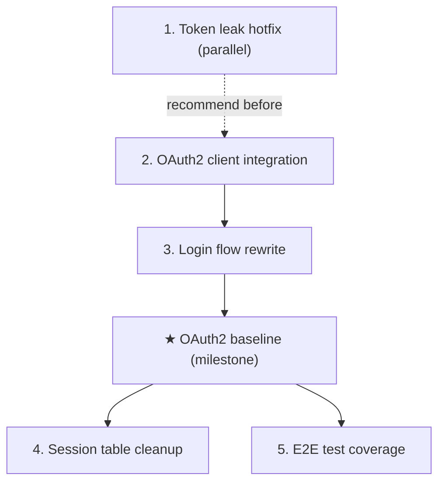

# Roadmap Template (stack-agnostic, annotated)

> Reference doc for `SKILL.md` Workflow A. Full authoring rules: `docs/backlog/00-roadmap-authoring-guide.md`.
> This file uses a synthetic example (an auth-module refactor) to annotate each section's purpose.

## Table of contents

1. [Structure overview](#structure-overview)
2. [Annotated example (auth-refactor)](#annotated-example-auth-refactor)
3. [Work-item granularity](#work-item-granularity)
4. [Status values and transitions](#status-values-and-transitions)
5. [Common anti-patterns and fixes](#common-anti-patterns-and-fixes)

---

## Structure overview

A roadmap contains these sections in order (omit ones that don't apply):

| # | Section | Required | Purpose |
|---|---|---|---|
| 1 | Title + last-updated date + sources | Yes | Sources point at input docs (FSD / bug list / analysis) |
| 2 | Purpose | Yes | What this roadmap is (fixed text referencing the authoring guide) |
| 3 | **Work Items** (the only dynamic block) | Yes | List, one line per item: `- N. name: \`todo\`/\`planned\`/\`done\`` |
| 4 | Status values | Yes | Small table explaining the three states |
| 5 | Framework / platform reuse | Recommended | Table: capability / provider / notes. Avoids rebuilding existing capability |
| 6 | Current baseline | Recommended | Already implemented / main gaps (use ~~strikethrough~~+✅ for closed gaps) |
| 7 | **Stage table** | Yes | Global index: # / stage / owner plan / dependencies / critical path / reuse |
| 8 | Stage details | Yes | Per-stage subsection: goal / deliverables (no checkboxes) / out-of-scope / module area |
| 9 | Dependency graph | Recommended | Mermaid `graph TD` |
| 10 | Cross-cutting concerns | Recommended | Cross-stage traps table |
| 11 | Rules | Recommended | Authoring and update rules for this file (fixed text) |

---

## Annotated example (auth-refactor)

### Section 1: Title + sources

```md
# Auth Module Refactor Roadmap — OAuth2 Migration

> Last updated: 2026-07-21
> Sources: `docs/design/oauth2-fsd.md` (primary),
> `docs/bugs/2026-07-15-token-leak.md` (security driver, parallel track)
```

**Why**: Title names the topic + terminal goal. Sources point at real docs; mark primary
vs parallel tracks when there are multiple.

### Section 2: Purpose

```md
## Purpose

This roadmap tracks the auth module's migration from session-based auth to OAuth2.
Terminal goal: all login flows use OAuth2 tokens, session tables removed, security
audit passes — enabling `./tools/mission-driver.sh auth-refactor` to drive follow-up
auth features autonomously.

Does not contain implementation details. Each `planned` stage is owned by its execution plan.
```

**Why**: One sentence on "why this roadmap exists". Explicitly state "no implementation
details" — prevents roadmap decay into an execution plan. Optionally reference the
mission launch command so the roadmap↔mission mapping is visible.

### Section 3: Work Items (the only dynamic block)

```md
## Work Items

> **This is the only dynamic state block. Update status only here.**
> The roadmap is a human-AI alignment artifact: humans set items and their order;
> AI takes the first `todo` item, drafts/executes plans (humans don't review individual
> plans), and writes the item back to `done` when closure audit passes.

- 1. Token leak hotfix (parallel track, independent plan): `done`
- 2. OAuth2 client integration (OAUTH-01/02/03): `done`
- 3. Login flow rewrite (LOGIN-01/02): `planned`
- ★ **Milestone: OAuth2 baseline live** (unlocks when 2 + 3 done): `todo`
- 4. Session table cleanup + migration (SESSION-01/02/03): `todo`
- 5. E2E test coverage for new flows (TEST-01/02): `todo`
```

**Why**:
- **Single source of state**. Anywhere else (stage details), write "status: see Work Items above".
- Milestones (★) are allowed but their status is **derived** (only `done` when all deps are done; never premature).
- Issue IDs in parens help map back to source docs.
- Order is execution order; AI takes the first `todo`.

### Section 4: Status values

```md
## Status values

| Status | Meaning |
| --- | --- |
| `todo` | Not started, no plan |
| `planned` | Has execution plan, passed draft review |
| `done` | Complete, passed closure audit |

> Milestone status is derived: when work items 2 and 3 are both `done`, the milestone auto-flips to `done`.
```

**Why**: Three fixed states. `planned` means "has reviewed plan", not "informally planned".

### Section 5: Framework / platform reuse

```md
## Framework / platform reuse

| Capability | Provider | Notes |
| --- | --- | --- |
| OAuth2 client | `oauth2-client@^3.0` npm package | Use existing; don't roll our own |
| Token validation | `jose` library for JWT verification | Already a dependency |
| Session storage | Redis (existing cluster) | Reuse, don't introduce a new store |
| Test fixtures | `tests/fixtures/oauth.ts` | Shared mock IdP; don't reinvent per-plan |
```

**Why**: Anti-reinventing-wheels guardrail. AI drafting plans reads this and knows what's available.

### Section 6: Current baseline

```md
## Current baseline

**Already shipped:**
- Auth middleware skeleton at `src/auth/middleware.ts`
- Token leak hotfix (item 1, 2026-07-16 closure audit PASS)

**Main gaps (blocking OAuth2 baseline):**
- ~~Login flow uses session cookies, not OAuth2 tokens~~ ✅ Closed (item 2, 2022-07-20)
- E2E tests still hit the old session endpoint
- Session tables (`user_sessions`) still populated by legacy code path
```

**Why**: Use `~~strikethrough~~ + ✅` to keep closed-gap history visible (don't delete lines).
Each closed gap notes: which plan, when, audit verdict. Snapshot; update when stages done.

### Section 7: Stage table

```md
## Stages

| # | Stage | Owner plan | Deps | Critical path | Reuse |
| --- | --- | --- | --- | --- | --- |
| 1 | Token leak hotfix | security plan | — | No (parallel) | `jose` lib |
| 2 | OAuth2 client integration | main plan §2.1 | recommend 1 first | **Yes** | `oauth2-client` |
| 3 | Login flow rewrite | main plan §2.2 | after 2 stable | **Yes** | existing middleware |
| ★ | OAuth2 baseline (milestone) | — | 2 + 3 done | — | — |
| 4 | Session table cleanup | main plan §3.1 | milestone | No | migration script |
| 5 | E2E test coverage | main plan §3.2 | milestone | No | `tests/fixtures/oauth.ts` |
```

**Why**: Owner Plan points at a specific plan file or section. Dependencies column calls
out hard vs soft deps ("recommend first" vs "must first"). Critical path flags mainline vs
parallel. Must match the dependency graph; conflicts resolve in favor of this table.

### Section 8: Stage details

```md
### 2. OAuth2 client integration

> Status: see Work Items above

**Goal:** Replace the legacy session-based auth client with an OAuth2 client using `oauth2-client`.

**Deliverables:**
- OAUTH-01: Add `oauth2-client` dependency + config loader for IdP endpoints
- OAUTH-02: Implement `OAuth2Client` wrapper (token refresh, PKCE)
- OAUTH-03: Wire into existing middleware as drop-in replacement

**Out of scope:** login flow UI (item 3), session cleanup (item 4).

**Module / area:** `src/auth/oauth/`, `src/config/oauth.ts`.
```

**Why**:
- **No checkboxes** (`- [ ]`). Checkboxes belong to execution plans.
- Goal one sentence; deliverables short list (with issue IDs); out-of-scope explicit; module area points at code locations.
- Status line says "see Work Items above" — single source of truth.
- Deliverable size = one plan can finish. See [Work-item granularity](#work-item-granularity).

### Section 9: Dependency graph

````md
## Dependency graph


````

**Why**: `-->` for hard deps, `-.->` (dashed) for soft ("recommend before"). Milestone
nodes use ★. Must match the stage table.

### Section 10: Cross-cutting concerns

```md
## Cross-cutting concerns

| Concern | Notes |
| --- | --- |
| Verification baseline | After each stage: `pnpm test` green, `pnpm typecheck` clean |
| Token refresh race | IdP token refresh must be atomic; use the existing `withTokenLock` helper |
| Backward compatibility | Legacy session endpoint stays until item 4 completes; don't rip out early |
| Test fixture | All new tests use `tests/fixtures/oauth.ts`; don't mock IdP ad-hoc |
```

**Why**: Cross-stage traps. AI drafting plans reads this section to avoid repeating mistakes per plan.

### Section 11: Rules

```md
## Rules
- This file is a state index and coarse decomposition, not an execution plan.
- Each `planned` stage is owned by its execution plan.
- Status changes happen only in the Work Items block at the top.
- Milestones are derived: 2 and 3 must both be `done` before the milestone is marked `done`.
```

**Why**: Fixed text reinforcing the authoring guide's core constraints.

---

## Work-item granularity

Core rule: **each work item's size = one execution plan can finish it**.

### Decision flow

```
work-item candidate → can one execution plan complete it?
  yes → valid work item (mark todo/planned/done)
  no  → split into multiple work items; original "epic" becomes a grouping label (no status)
```

### Typical sizes

One execution plan typically:
- Modifies 5-15 files
- 200-500 lines of change
- 1-4 phases
- Closes within one mission cycle (EXECUTE → CLOSURE → BUILD_VERIFY)

### Anti-examples

| Candidate | Problem | Fix |
|---|---|---|
| "Frontend component library implementation" | Too large (dozens of components) | Split: "form components", "table components", "layout components" |
| "Fix all dead code" | Too large (dozens of sites) | Split by module or category: "service-layer dead code", "dao-layer dead code" |
| "Improve code quality" | Too vague | Concretize: "unify exception-handling pattern", "eliminate catch-and-swallow" |
| "Update one config field" | Too small | Merge into the related feature's plan |

### Grouping labels (no status)

If you want to keep "epic / wave / series" as organizational views, use headings **without status**:

```md
### Wave 1: Foundation (items 1-3)
- 1. Credentials externalization: `done`
- 2. Pollution cleanup: `done`
- 3. Pom governance: `done`

### Wave 2: Quality (items 4-6)
- 4. dead code: `todo`
...
```

The "Wave 1" / "Wave 2" headings themselves have no `todo/planned/done`.

---

## Status values and transitions

### Three states

| Status | Meaning | Who changes | When |
|---|---|---|---|
| `todo` | Not started, no plan | Human | When creating the roadmap |
| `planned` | Has plan, passed independent draft review | AI (mission-driver) | After plan draft review passes |
| `done` | Complete, passed independent closure audit | AI (mission-driver) | After closure audit passes |

### Transition diagram

```
todo --[AI drafts plan + independent draft review passes]--> planned --[execution + independent closure audit passes]--> done
```

### Milestones (derived)

Milestones are not independent states — they're derived from dependency status:

- All dependencies `done` → milestone `done`
- Never mark a milestone `done` before its dependencies are done
- Milestones don't enter `todo` / `planned` — they're either "not yet reached" (deps not all done) or `done`

---

## Common anti-patterns and fixes

| Anti-pattern | Consequence | Fix |
|---|---|---|
| Roadmap contains implementation steps / checkboxes | Decays into execution plan, duplicates plans | Remove steps; keep only deliverable scope |
| Stage larger than one plan's scope | No item to update when plan completes; loop stalls | Split into multiple work items |
| Status maintained in multiple places (e.g. overlay tables) | Status desyncs | Maintain only in Section 3 Work Items |
| Marking `done` before closure audit | Status lies; quality gate broken | Strictly wait for closure audit PASS |
| Framework/platform reuse not annotated | AI rebuilds existing capability | Explicitly list in Section 5 |
| AI re-arbitrates priority | Drifts from human intent | AI takes the first `todo` in order, no skipping |
| Dependency graph disagrees with stage table | Confusing for everyone | Table wins; sync the graph |
| Restating owner-doc business rules | Roadmap bloats | Reference the owner doc path instead |
| Stage details carry their own status column | Second dynamic state | Status line says only "see Work Items above" |
