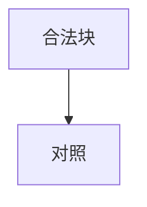

# 缺陷页

自检缺陷样本页：集中五类预期缺陷，selftest 断言它们分别被 gen 降级或被 check 检出。本页不追求内容合规，词数与表格密度 WARN 属预期内。

## 越界行号引用

下面这条松格式引用行号超出 pom.xml 实际行数，gen 应降级为文件级链接并在 stdout 汇报：[pom.xml:99999-100001]()。它旁边的界内引用 [pom.xml:1-4]() 应正常生成锚点。

## 空括号死链

本页正文中含一条指向不存在目标的链接：[幽灵页面](missing-page.md)，check 应报断链；还有一条无法解析的空括号引用 [bad-anchor-target]()，gen 应保留原样、check 应报空括号死链。

```mermaid
notadiagram
    a --> b
```

## 杂项



> Sources: pom.xml、Foo.java

## Sources

- pom.xml
- Foo.java
