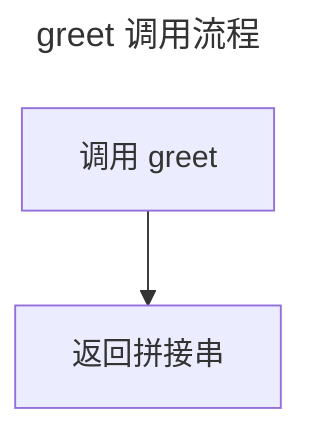

# 正常页

自检基准页：全部引用可解析、行号在界内、mermaid 合法、密度达标。本页与缺陷页共同构成 selftest 的期望输出基线，任何一项检出异常即说明管线行为漂移。

> 本页源文件基准（相对基准已由 gen 阶段验证）：
>
> - [pom.xml:1-8]()
> - [src/Foo.java:1-14]()

## 构件与依赖

fixture 目标仓库是一个最小 Maven 构件，只包含一个 pom 描述文件和一个 Java 类。构件坐标、版本与名称如下表：

| 字段 | 值 | 出处 |
|------|----|------|
| groupId | io.nop | [pom.xml:4](../repo/pom.xml) |
| artifactId | selftest-fixture-target | [pom.xml:5](../repo/pom.xml) |
| version | 1.0.0 | [pom.xml:6](../repo/pom.xml) |

pom 文件第 1 行是 XML 声明，第 2 行以 project 元素打开并携带 xmlns 命名空间，第 3 行锁定模型版本 4.0.0，第 7 行以 name 元素给出构件显示名，第 8 行关闭 project 元素。整份构件没有声明任何依赖，因此解析与构建路径完全由 Maven 默认生命周期决定；这也意味着本页关于依赖的叙述只有一句：无。fixture 的使命是让 selftest 在毫秒级完成管线断言，构件越简单越好。

## 类型与行为

Foo 是 fixture 中唯一的 Java 类型：常量 NAME 提供构件标识，greet 方法做字符串拼接问候。类型成员如下表：

| 成员 | 形态 | 语义 | 出处 |
|------|------|------|------|
| NAME | 常量 | 构件名 "foo" | [src/Foo.java:8](../repo/src/Foo.java) |
| greet | 方法 | 返回 hello 前缀拼接串 | [src/Foo.java:10-12](../repo/src/Foo.java) |

Foo 的 javadoc 位于第三至第六行，说明该类存在的唯一目的就是充当自检样本。greet 的实现只有一条 return 语句，把前缀 hello 与调用方传入的参数用逗号加空格拼接后返回；NAME 常量被声明为 public static final，值与构件目录名一致。selftest 断言本页零检出，因此正文不引入任何跨页死链、越界行号或未知图表类型；若未来 gen 或 check 的行为变化导致本页被报出任何 ERROR 或 WARN，应当首先怀疑管线回归而不是 fixture 本身失效。行号口径方面，本页全部界内引用都落在两个源文件的真实行数之内：pom.xml 共九行，Foo.java 共十六行，这正是越界降级机制需要的目标文件行数事实。自检断言的第三层含义是可重复性：selftest 每次运行都从 fixture 重新拷贝工作区到 _tmp 目录并对迷你目标仓库执行 git init，保证断言不依赖任何历史状态，也不依赖本仓库的 gitee 远端配置。术语与跨页对照见缺陷页 bad.md，那里集中了全部五类预期缺陷，与本页形成正反两个用例。

> Sources: [pom.xml:1-8]()、[src/Foo.java:1-14]()

## Sources

- [pom.xml:1-8]()
- [src/Foo.java:3-12]()

## 自检的边界语义

越界降级机制对本页也构成约束：pom.xml 实际行数为九，任何超过该值的行号引用都会被 gen 降级为文件级链接并在运行报告中逐条列名，因此本页引用 pom.xml 时一律以 1-8 为界；Foo.java 实际行数为十四，本页同理以 1-14 为界。这一约束正是 selftest 想要固化的行为：引用的行号锚必须落在目标文件真实行数之内，锚的存在性由生成管线负责，而不是留给读者在源码托管站上点开一个 404。
