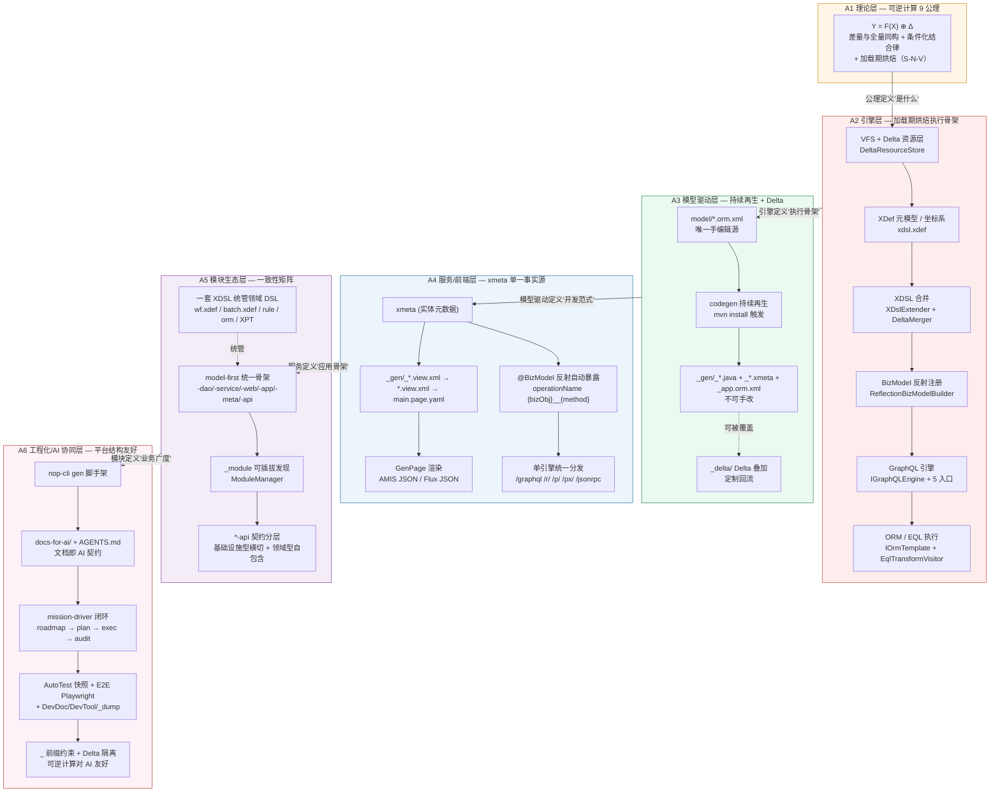

# nop-entropy 平台深度介绍材料：综合评估、下一代框架对标与平台演进建议（capstone）

> Status: resolved
> Date: 2026-07-26
> Scope: 综合 A1–A6 六份分析（理论 / 引擎 / 模型驱动 / 服务前端 / 模块矩阵 / 工程化），产出顶层「深度介绍材料」，给出面向下一代框架（云原生、AI 原生、低代码、代码生成）趋势的定位与演进建议，并就两个结论分支（是否更新 `docs-for-ai/`、是否作为平台下一步路线图输入）给出带依据的建议（最终决策由人确认）；同时收敛 A1–A6 遗留的 deferred / open-question 项。
> Conclusion: nop-entropy 把可逆计算的差量组合代数（`Y = F(X) ⊕ Δ`，含条件化结合律）落地为一套「加载期烘焙 + Delta 回流 + 模型驱动 + 文档即 AI 契约」的全栈 Java 平台。它以 ORM 模型为唯一源、以 codegen 持续再生为生成机制、以 xmeta 为单一事实源驱动 GraphQL/REST/JSON-RPC/前端一体化、以 XDSL/Delta 统管所有领域 DSL 与跨模块定制、以运行手册 + mission-driver 闭环让平台结构对 AI 协同原生友好。其核心差异化在「平台自身的结构对 AI 协同友好 + 一套差量组合代数统管所有领域 DSL」，不在单模块功能覆盖率。建议：(a) **不整体迁移** A1–A6 到 `docs-for-ai/`，而是**选择性沉淀**关键规则到 owner docs；(b) **作为路线图输入**——把启动性能、BizModel codegen 化、native image 适配、E2E 覆盖扩展、平台级低代码设计器等差距列为候选演进方向。最终决策由人确认。
> Mission: nop-deep-analysis（Work Item A7）
> Superseded By: 本文档是 A1–A6 的 capstone 综合材料；若 `docs-for-ai/` 后续选择性沉淀本文档内容，被沉淀部分以 `docs-for-ai/` 版本为准。

## Context

- **要回答的问题**：A1–A6 六份分析（理论 / 引擎 / 模型驱动 / 服务前端 / 模块矩阵 / 工程化）如何串成一条完整脉络？平台作为整体相对下一代框架（云原生、AI 原生、低代码、代码生成）的定位与差距是什么？是否应将分析迁移到 `docs-for-ai/`？是否应作为平台下一步路线图输入？A1–A6 遗留的 deferred / open-question 项如何收口？
- **涉及范围**：综合引用 A1–A6 全部分析（不重写），聚焦 (a) 顶层综合叙事；(b) 平台级下一代趋势对标；(c) 演进建议；(d) 两结论分支建议；(e) deferred 项裁定。
- **约束**：本 capstone 不替代 A1–A6 的结论，只做综合、对标、裁定。所有事实性论断用 A1–A6 既有的 source-anchor + 文件锚点支撑，不引入未经核对的新论断。分析型产出，无代码变更。
- **来源基线**：A1 `ai-dev/analysis/2026-07/2026-07-24-nop-theory-foundation.md`、A2 `.../2026-07-24-nop-core-engine-deep-dive.md`、A3 `.../2026-07-24-nop-model-driven-and-codegen.md`、A4 `.../2026-07-24-nop-graphql-service-frontend.md`、A5 `.../2026-07-24-nop-module-matrix.md`、A6 `.../2026-07-24-nop-engineering-dx-ai-dev.md`；roadmap `ai-dev/design/nop-deep-analysis/nop-deep-analysis-roadmap.md`；4 主线联网调研（访问日期 2026-07-26）。

## 1. 一句话设计哲学定位

> **nop-entropy 把可逆计算的差量组合代数（`Y = F(X) ⊕ Δ`，含条件化结合律）落地为一套「加载期烘焙 + Delta 回流 + 模型驱动 + 文档即 AI 契约」的全栈 Java 平台：以 ORM 模型为唯一源、以 codegen 持续再生为生成机制、以 xmeta 为单一事实源驱动 GraphQL/REST/JSON-RPC/前端一体化、以 XDSL/Delta 统管所有领域 DSL 与跨模块定制、以运行手册 + mission-driver 闭环让平台结构对 AI 协同原生友好。**

**双向支撑证据**：

- **A1 公理层支撑**：`Y = F(X) ⊕ Δ`（`2026-07-24-nop-theory-foundation.md:21-30`）+ 9 公理体系（§1.1–1.9）+ 条件化结合律（§1.3 公理 C，3 carrier 证明 `2026-07-24-nop-theory-foundation.md:54-63`）。
- **A2 工程层支撑（加载期烘焙）**：加载期 vs 运行期分离（`2026-07-24-nop-core-engine-deep-dive.md:63-72`）；端到端调用链（`.../nop-core-engine-deep-dive.md:39-57`）从 HTTP → GraphQL → BizModel → 事务 → ORM → EQL → SQL。
- **A3 模型驱动支撑**：唯一手编辑入口是 `model/*.orm.xml`（`2026-07-24-nop-model-driven-and-codegen.md:21-23`）；持续再生（§1.3）；`_` 前缀不可手改（§4）。
- **A4 xmeta 单源支撑**：xmeta 同时约束 GraphQL 字段可见性 + 作为 codegen 输入生成 view 基线 + 运行时 `GenPage` 消费（`2026-07-24-nop-graphql-service-frontend.md:5`）。
- **A5 模块生态支撑**：3 个横向一致性——一套 XDSL/Delta 统管所有领域 DSL + model-first 统一骨架 + 可逆计算跨模块扩展（`2026-07-24-nop-module-matrix.md:180-187`）。
- **A6 文档即 AI 契约支撑**：`docs-for-ai/` 七区结构 + 硬停止规则 + source-anchors 最小源码入口（`2026-07-24-nop-engineering-dx-ai-dev.md:155-200`）+ 可逆计算对 AI 友好性独立论证（§5）。

**核心叙事主线**：从「可逆计算公理（A1）」到「平台原生 AI 协同（A6）」，nop 的设计是一条贯穿的代数 + 工程序脉——**每一层都把"复杂性前移到加载期 + 把定制回流到 Delta 层"作为不变量**。

## 2. 架构总览图（A1–A6 六层叠加）

**节点 / 边证据可追溯性**（每个节点对应 A1–A6 章节 + source-anchor；下表 25 行覆盖 mermaid 图中全部 25 个节点 + 5 条层间边）：

| 节点 | A× 章节 | source-anchor / file:line |
|------|---------|---------------------------|
| GRC（9 公理） | A1 §1 | EXT-001~006、XLANG-001~008（`2026-07-24-nop-theory-foundation.md:117-128`） |
| VFS / DeltaResourceStore | A2 §2.2 | VFS-001/EXT-003（`2026-07-24-nop-core-engine-deep-dive.md:90-102`） |
| XDef / xdsl.xdef | A1 §2.1 + A2 §3.1 | EXT-001/XLANG-003（`2026-07-24-nop-core-engine-deep-dive.md:120-126`） |
| XDSL / XDslExtender + DeltaMerger | A1 §2.2 + A2 §3.2 | EXT-002（`2026-07-24-nop-core-engine-deep-dive.md:127-141`） |
| BizModel / ReflectionBizModelBuilder | A2 §5.2 | `2026-07-24-nop-core-engine-deep-dive.md:208-216` |
| GraphQL / IGraphQLEngine + 5 入口 | A2 §5.1 | GQL-009（`2026-07-24-nop-core-engine-deep-dive.md:200-205`） |
| ORM / EQL | A2 §4 | DQL-002/006、TNT-003（`2026-07-24-nop-core-engine-deep-dive.md:153-188`） |
| model/*.orm.xml 唯一源 | A3 §1.1 | `2026-07-24-nop-model-driven-and-codegen.md:21-23` |
| codegen 持续再生 | A3 §1.3 + §3 | GEN-001~009（`2026-07-24-nop-model-driven-and-codegen.md:42-46`） |
| `_` 前缀不可手改 | A3 §4 | `CoreConstants.java:146-155`（`2026-07-24-nop-model-driven-and-codegen.md:175-186`） |
| Delta 叠加 | A3 §5 | EXT-002/003（`2026-07-24-nop-model-driven-and-codegen.md:215-258`） |
| xmeta 单一事实源 | A4 §3 | GQL-001~008（`2026-07-24-nop-graphql-service-frontend.md:90-113`） |
| OPS / @BizModel 反射自动暴露 | A4 §1.1 + A2 §5.2 | `2026-07-24-nop-graphql-service-frontend.md:23-40`、`...-nop-core-engine-deep-dive.md:208-216` |
| 单引擎统一分发 | A4 §2 + A2 §5.1 | GQL-009（`2026-07-24-nop-graphql-service-frontend.md:73-83`） |
| 三层 Delta 渲染 | A4 §4.2 | UI-001~004（`2026-07-24-nop-graphql-service-frontend.md:168-183`） |
| GenPage 渲染 AMIS/Flux | A4 §4.4 | EXT-007/008/009（`2026-07-24-nop-graphql-service-frontend.md:201-215`） |
| model-first 统一骨架 | A5 §1.1 | `2026-07-24-nop-module-matrix.md:23-43` |
| `_module` 可插拔发现 | A5 §3 | MOD-001~005（`2026-07-24-nop-module-matrix.md:166-176`） |
| API / *-api 契约分层 | A5 §2 | `2026-07-24-nop-module-matrix.md:67-94` |
| 一套 XDSL 统管领域 DSL | A5 §4 | `2026-07-24-nop-module-matrix.md:180-187` |
| nop-cli gen 脚手架 | A6 §4.1 | XLANG-006（`2026-07-24-nop-engineering-dx-ai-dev.md:145-153`） |
| 文档即 AI 契约 | A6 §4.2 + §5.3 | `2026-07-24-nop-engineering-dx-ai-dev.md:155-180`、`243-261` |
| mission-driver 闭环 | A6 §2 | `2026-07-24-nop-engineering-dx-ai-dev.md:43-95` |
| AutoTest + E2E | A6 §3 | TEST-001~005（`2026-07-24-nop-engineering-dx-ai-dev.md:99-128`） |
| `_` 前缀 + Delta 对 AI 友好 | A6 §5.1/§5.2 | `2026-07-24-nop-engineering-dx-ai-dev.md:227-251` |

**核心叙事脉络**（图中「公理定义 → 引擎执行 → 模型驱动 → 服务应用 → 模块广度 → 工程化治理」六层叠加）：每一层都为下一层提供前置条件，且**所有层的"复杂性"都前移到加载期，所有"定制"都回流到 Delta 层**——这是 nop 区别于其他全栈框架的不变量。

## 3. 核心差异化能力矩阵（综合 A1–A6）

| 能力维度 | nop-entropy 实现 | 证据（A× 章节 + source-anchor） | 同类竞品典型做法 |
|---------|-----------------|------------------------------|-----------------|
| **元模型驱动（语言即坐标系）** | XDef 自举（`xdef.xdef` 自定义自身）；同态设计；stable key 显式声明 | A1 §2.1（`2026-07-24-nop-theory-foundation.md:140-151`）；EXT-001 | XSD 异构；MPS projectional；JHipster JDL 一次性 |
| **差量组合代数（结合律）** | `DeltaMerger` + `XDslExtender`；条件化结合律（3 carrier 证明） | A1 §1.3 + §2.2；A2 §3.2；EXT-002 | DOP 语言绑定 delta；bx/lenses 运行时同步；MDSD 一次性 codegen |
| **持续再生 codegen** | 每次 `mvn install` 触发；`_` 前缀不可手改；4 Maven phase 绑定 | A3 §1.3 + §3 + §4；GEN-001~009 | JHipster 一次性；OpenAPI Generator 单维度；APT 类内增强；MPS projectional |
| **Delta 跨模块定制** | `_delta/{layer}/` 分层资源；8 种 `x:override`；可定制 `beans.xml` / `*.xmeta` / `*.view.xml` / xlib | A3 §5；A5 §4；EXT-003 | profile / 条件注解 / 扩展机制；无结构化差量组合 |
| **AOP 源码生成式** | build 期 `GenAopProxy` 生成 `__aop.java`；运行期注入拦截器数组（`IAopProxy`） | A2 §6.4（`2026-07-24-nop-core-engine-deep-dive.md:269-289`） | Spring CGLIB/JDK 动态代理运行期字节码；Quarkus build-time 织入；Micronaut APT |
| **NopIoC 文件化 Bean 发现** | 完全文件化 `beans.xml`；无注解扫描；private 字段不可注入 | A2 §6.1 + §6.2；IOC-001/002 | Spring `@ComponentScan`；Quarkus Arc CDI；Micronaut JSR 330 |
| **GraphQL 单引擎统一分发** | 5 个 HTTP 入口（`/graphql`/`/r/`/`/p/`/`/px/`/`/jsonrpc`）收敛到 `IGraphQLEngine` | A2 §5.1；A4 §2；GQL-009 | Spring for GraphQL schema-first；Hasura DB-introspection；Apollo Federation 多服务 compose |
| **xmeta 单一事实源** | xmeta 同时驱动 GraphQL schema + 字段可见性 + view 基线 + AMIS/Flux JSON | A4 §3 + §4（`2026-07-24-nop-graphql-service-frontend.md:90-134`） | Formily JSON Schema 前端独立；Lowcode Engine 拖拽产物 |
| **三层 Delta 渲染** | xmeta(源) → `_gen/_*.view.xml`(生成) → `*.view.xml`(手写) → `main.page.yaml` → 框架 JSON | A4 §4.1 + §4.2（`2026-07-24-nop-graphql-service-frontend.md:140-183`） | 单层 schema → 渲染；无生成/手写分离 |
| **model-first 模块矩阵** | 每个业务模块都从 `model/*.orm.xml` 出发，共享同一套 codegen 模板 | A5 §1 + §4（`2026-07-24-nop-module-matrix.md:23-43,180-187`） | Flowable BPMN；PowerJob DAG；DataHub 独立部署；JasperReports 独立库 |
| **可逆计算对 AI 友好** | `_` 前缀约束 + Delta 隔离 + 文档即契约 + source-anchors 最小入口 | A6 §5（`2026-07-24-nop-engineering-dx-ai-dev.md:223-279`） | 无（通用 AI 工具在任意代码库工作） |
| **roadmap-driven 有审计闭环** | mission-driver：roadmap → plan → exec → closure audit；plan checklist 是机器可读状态 | A6 §2（`2026-07-24-nop-engineering-dx-ai-dev.md:43-95`） | Devin 自主端到端；Cursor 多文件编辑；Claude Code CLI |

## 4. 优势 / 差距矩阵（基于 A1–A6 source-anchor 证据）

### 4.1 优势（差异化最强项，按重要度排序）

| # | 优势 | A× 证据 | 相对竞品的关键差异 |
|---|------|---------|-------------------|
| S1 | **可逆计算差量组合代数统管所有领域 DSL** | A1 §1.3 + §5.5；A5 §4 | Flowable BPMN / PowerJob 配置 / Drools DRL 各自独立模型语言；nop 一套 XDSL/Delta 统管 wf.xdef / batch.xdef / rule / orm / XPT |
| S2 | **平台结构对 AI 协同原生友好** | A6 §5 + §6.5 | 通用 AI 工具（Devin/Cursor/Claude Code）在任意代码库工作；nop 通过 `_` 前缀 + Delta + 文档即契约 + mission-driver 把 AI 协同固化到平台结构 |
| S3 | **持续再生 + Delta 可升级** | A3 §1.3 + §6.6 | JHipster/Spring Initializr 一次性脚手架；OpenAPI Generator 单维度；nop 每次 build 再生 + Delta 可重新叠加到新基线（结合律保证） |
| S4 | **xmeta 单源驱动多端** | A4 §3 + §4 | Spring for GraphQL schema-first 双份事实；Hasura DB-introspection 反向；nop 模型正向派生 GraphQL + view + AMIS/Flux JSON |
| S5 | **GraphQL 统一 HTTP 中枢** | A2 §5.1；A4 §2 | 每框架各一套 web/REST 栈；nop 5 入口收敛到 `IGraphQLEngine` |
| S6 | **AOP 源码生成式（无运行时字节码）** | A2 §6.4 | Spring CGLIB/ASM 运行期字节码；nop build 期 `__aop.java` + 运行期注入拦截器数组 |
| S7 | **加载期烘焙，运行期静态注册表** | A2 §1.3 | 公理 I（S-N-V 阶段分离）；运行时面对"烘焙"好的静态模型，无 delta 历史 |

### 4.2 差距（待补 / 取舍 / residual，按重要度排序）

| # | 差距 | A× 证据 + 来源 | 性质（差距 vs 取舍 vs residual） |
|---|------|----------------|--------------------------------|
| G1 | **启动性能未量化（弱于 Quarkus/Micronaut 毫秒级）** | A2 §8(d)（`2026-07-24-nop-core-engine-deep-dive.md:368`）；本 capstone §5 云原生主线 | **差距**：未做 benchmark；A7 裁定 residual-watch-only（量化需独立 plan） |
| G2 | **BizModel 调用仍用反射（弱于 Micronaut 零反射）** | A2 §8(e)（`2026-07-24-nop-core-engine-deep-dive.md:369`） | **差距 / 演进方向**：codegen 化 `ReflectionBizModelBuilder`（method handle / 直接调用） |
| G3 | **native image 友好性未验证** | 本 capstone §5 云原生主线 | **差距 / residual**：VFS classpath 扫描 + Delta 合并对 native 兼容性未验证；超出 capstone scope |
| G4 | **缺平台级可视化搭建设计器** | A4 §5.5（`2026-07-24-nop-graphql-service-frontend.md:242-249`） | **取舍**：Lowcode Engine 强项；nop 选择"模型驱动 + Delta"而非"拖拽 + 出码" |
| G5 | **分布式扩展用 RPC 而非 federation** | A4 §5.3（`2026-07-24-nop-graphql-service-frontend.md:230-235`） | **取舍**：组织规模极大时 Apollo Federation 更解耦；nop 选择单引擎统一分发 |
| G6 | **强绑 Java/JVM 生态（Hasura 跨语言更中性）** | A4 §5.6 | **取舍**：Hasura 跨语言；nop 选择深度集成 Java 平台 |
| G7 | **`@BizAction` 与 AOP 关系的细节** | A2 §8（`2026-07-24-nop-core-engine-deep-dive.md:367`，标注 A4 澄清） | **residual**：A4 已 done，归 residual-watch-only |
| G8 | **E2E 仅覆盖 auth/code/job** | A6 §7（`2026-07-24-nop-engineering-dx-ai-dev.md:368`） | **差距 / 演进方向**：wf/task/report/metadata 等扩展 |
| G9 | **AutoTest 快照跨数据库兼容性未深入验证** | A6 §7（`2026-07-24-nop-engineering-dx-ai-dev.md:369`） | **residual**：未深入验证 |
| G10 | **BPMN 2.0 标准合规缺失（nop-wf）** | A5 §5.1（`2026-07-24-nop-module-matrix.md:194-197`） | **取舍**：nop-wf 不追求 BPMN 标准生态；选择纳入平台 Delta/定制体系 |
| G11 | **单领域极致能力不及专项竞品**（Flink 大规模集群 / Drools 海量推理 / PowerJob DAG） | A5 §5.2/§5.3/§5.5/§5.6 | **取舍**：nop 提供平台原生实现；需单领域极致时应集成外部专项系统 |

## 5. 下一代框架趋势对标（四主线，Phase 2 联网调研产出）

> 本节是平台级宏观趋势汇总，不重复 A1–A6 已覆盖的领域微观对标（A2 §7 Spring/Quarkus/Micronaut/Helidon；A6 §6 Devin/Cursor/Claude Code；A4 §5.5 Formily/Lowcode Engine；A5 §5 DataHub/OpenMetadata；A1 §5 + A3 §6 MDSD/MPS/DOP/JHipster 等）。每条新增调研附 URL + 访问日期。

### 5.1 云原生主线（cloud-native / native image / 编译期优化）

| 平台级宏观趋势（2025–2026） | 来源（URL + 访问日期） | 核心诉求 vs nop 对应能力 vs 差异点/差距 |
|----------------------------|----------------------|--------------------------------------|
| **GraalVM native image 已成 JVM 云原生标配** | https://www.javacodegeeks.com/2026/03/spring-boot-vs-quarkus-vs-micronaut-the-java-cloud-wars-are-here.html ；https://gillius.org/blog/2025/10/java-25-framework-startup.html ；https://hackernoon.com/micronaut-vs-quarkus-vs-spring-the-2026-java-framework-shootout （访问 2026-07-26） | 诉求：启动毫秒级 + 内存 ~50 MB；nop：加载期 VFS 扫描 + XDSL 合并 + 反射注册，启动非毫秒级（A2 §7.5）。**差距 G1/G3** |
| **Java 25 + 框架 AOT 协同** | https://gillius.org/blog/2025/10/java-25-framework-startup.html ；https://www.brilworks.com/blog/spring-boot-vs-quarkus-vs-micronaut/ （访问 2026-07-26） | 诉求：即使无 native，build-time config + AOT 也显著降低启动；nop：AOP 源码生成式已前移（S6），BizModel 反射未前移（G2） |
| **serverless / 容器-first 定位分水岭** | https://hiq.se/en/insight/spring-boot-quarkus-or-micronaut-your-guide-through-the-java-framework-jungle/ ；https://medium.com/@reyanshicodes/spring-boot-vs-micronaut-vs-quarkus-the-2025-jvm-framework-battle-ae6365d810f4 （访问 2026-07-26） | 诉求：Quarkus/Micronaut 把"云原生优先"作为差异化；nop 定位偏可逆计算应用平台（单体 / 模块化单体），serverless 非目标场景 |

> 复用 A2 §7：Spring/Quarkus/Micronaut/Helidon 的 IoC/AOP/启动模型四维对照已在 A2 完成。

### 5.2 AI 原生开发主线（spec-driven / roadmap-driven / 文档即 AI 契约）

| 平台级宏观趋势（2025–2026） | 来源（URL + 访问日期） | 核心诉求 vs nop 对应能力 vs 差异点/差距 |
|----------------------------|----------------------|--------------------------------------|
| **Spec-Driven Development（SDD）成为产业范式** | https://medium.com/@dave-patten/spec-driven-development-with-ai-agents-from-build-to-runtime-diagnostics-415025fb1d62 ；https://www.deeplearning.ai/courses/spec-driven-development-with-coding-agents ；https://towardsdatascience.com/from-vibe-coding-to-spec-driven-development/ （访问 2026-07-26） | 诉求：规格即真理源驱动规划/任务/验证；nop：roadmap → plan → exec → audit 闭环（A6 §2），比通用 SDD 多独立 closure audit + 工具链门禁。**优势 S2** |
| **AGENTS.md 跨工具标准化（2025-08 GitHub Copilot 官方支持）** | https://github.blog/changelog/2025-08-28-copilot-coding-agent-now-supports-agents-md-custom-instructions/ ；https://www.reddit.com/r/GithubCopilot/comments/1ngu0xj/the_difference_between_agentmd_and/ （访问 2026-07-26） | 诉求：项目运行手册跨工具统一；nop：`AGENTS.md` 早在标准化之前就采用（路由表 + Protected Areas + Autonomy Levels + Verification Checklist）。**优势 S2** |
| **AIware 2025 / SDD 课程化** | https://2025.aiwareconf.org/track/aiware-2025-keynotes （访问 2026-07-26） | 诉求：SDD 进入课程与会议；nop：mission-driver + `ai-dev/` 七层知识层是产业级实证。**优势 S2** |

> 复用 A6 §6：Devin/Cursor/Claude Code/Agno/LangGraph 对标已在 A6 完成。

### 5.3 低代码 / metadata-driven 主线

| 平台级宏观趋势（2025–2026） | 来源（URL + 访问日期） | 核心诉求 vs nop 对应能力 vs 差异点/差距 |
|----------------------------|----------------------|--------------------------------------|
| **BaaS + metadata-driven CRUD 成主流（Supabase PostgREST + Hasura auto-GraphQL）** | https://leanware.co/insights/supabase-vs-hasura-which-backend-as-a-service-to-choose-in-2025 ；https://supabase.com/features/auto-generated-rest-api ；https://hasura.io/events/webinar/autogenerate-graphql-and-rest-apis-on-all-your-data ；https://supabase.com/blog/simplify-backend-with-data-api （访问 2026-07-26） | 诉求：DB schema → REST/GraphQL 自动生成（覆盖 50–80% 后端手工开发）；nop：model-first 自动暴露（A4 §3），从 ORM 模型正向派生。**优势 S4**（model-first 比 DB-introspection 更可控） |
| **DB-first 反向生成的产业强势** | https://leanware.co/insights/supabase-vs-hasura-which-backend-as-a-service-to-choose-in-2025 （访问 2026-07-26） | 诉求：DB 已存在 → 反向生成 + 实时订阅 + 权限；nop：model-first 正向生成，DB 跟随模型变。**差异点**（非差距，是定位选择） |
| **MDE + AI 融合学术产业化（Rädler 2025 systematic review）** | https://link.springer.com/article/10.1007/s10270-024-01211-y ；https://dl.acm.org/doi/10.1145/3786179.3788326 ；https://modeling-languages.com/low-code-vs-model-driven/ （访问 2026-07-26） | 诉求：DSL + AI 协同工程化；nop：A6 §5 已独立论证可逆计算对 AI 友好性，是 MDE + AI 融合的产业级实证案例。**优势 S1/S2** |

> 复用 A4 §5.5 + A5 §5.4：Formily/Lowcode Engine/DataHub/OpenMetadata 对标已完成。

### 5.4 代码生成 / model-driven 主线

| 平台级宏观趋势（2025–2026） | 来源（URL + 访问日期） | 核心诉求 vs nop 对应能力 vs 差异点/差距 |
|----------------------------|----------------------|--------------------------------------|
| **AI 生成代码成主流但区别于 model-driven 生成** | https://svitla.com/blog/ai-powered-vs-traditional-software-development/ ；https://link.springer.com/article/10.1007/s10270-024-01211-y ；https://arxiv.org/html/2409.18048v3 （访问 2026-07-26） | 诉求：2025 ~41% 代码 AI 生成，但 LLM 生成代码的质量/可控/可演化仍是问题；nop：A3 持续再生 codegen 解决"确定性 + 可重复 + 可审计"（S3）。**优势**（确定性 vs 启发性，互补非替代） |
| **build-time codegen 与 LLM 的角色分工** | https://link.springer.com/article/10.1007/s10270-024-01211-y （访问 2026-07-26） | 诉求：传统 build-time codegen 解决确定性；LLM 解决启发性；nop：两者都用——codegen 解决骨架，Delta 隔离让 LLM 在 Delta 层叠加。**优势 S3 + S2** |
| **DSL 工程化在 LLM 时代被重估** | https://dl.acm.org/doi/10.1145/3786179.3788326 （访问 2026-07-26） | 诉求：DSL 作为"AI 与人类共同契约层"价值上升；nop：XDef + xpl/xlib 编译期元编程（A1 §2/§3）是产业级实证。**优势 S1** |

> 复用 A1 §5 + A3 §6：MDSD/MDA/MPS/DOP/JHipster/OpenAPI Generator/Spring Initializr/APT 对标已完成。

## 6. 演进建议（基于差距矩阵，可操作方向）

> 演进建议**只产出建议文本，不进入实现**（plan Non-Goals 明确）。每条建议标注依据（差距编号）+ 风险/代价 + 是否推荐为下一步路线图输入。

| # | 演进建议 | 依据（差距 #） | 风险/代价 | 是否推荐为路线图输入 |
|---|---------|---------------|----------|--------------------|
| E1 | **启动性能基准与优化**（量化 G1；评估 VFS 扫描并行化、XDSL 合并缓存、反射注册延迟化） | G1（A2 §8(d), `...:368`） | 中：需独立 benchmark plan；优化可能影响加载期语义 | **推荐**（高优先级） |
| E2 | **BizModel codegen 化**（method handle / 直接调用替换反射，对标 Micronaut 零反射） | G2（A2 §8(d)） | 高：涉及 `ReflectionBizModelBuilder` 重写；需保留 Delta/xbiz 路径兼容 | **推荐**（中优先级，需 design doc 先行） |
| E3 | **native image 适配可行性研究**（VFS classpath 扫描 + Delta 合并的 native 兼容性 reachability metadata） | G3（本 capstone §5.1） | 高：可能需要重构 VFS 扫描 + 反射点元数据；目标场景（serverless）非当前主流 | **不强烈推荐**（residual-watch-only，待 serverless 场景刚需触发） |
| E4 | **E2E 覆盖扩展**（wf/task/report/metadata 等业务模块补 E2E） | G8（A6 §7） | 低：增量补充；`nop-entropy-e2e/` 框架已就绪 | **推荐**（低优先级，按业务模块上线节奏） |
| E5 | **AutoTest 快照跨数据库矩阵**（MySQL/PostgreSQL/Oracle 可移植性验证） | G9（A6 §7） | 低：增量验证；已有 `dbSnapshotSeparator` 配置基础 | **推荐**（低优先级） |
| E6 | **x:override 8 模式 + DeltaMerger + AOP 锚点 source-anchors 完整性补全**（A1 §6 + A2 §8 source-anchor 维护） | 本 capstone §8 裁定（独立文档治理任务） | 低：纯文档维护 | **推荐**（与 docs-for-ai 选择性沉淀并行，见 §7-a） |
| E7 | **nop-graph / nop-job / nop-task 模块文档完善**（A5 §6 缺专题 + source-anchor 编号） | 本 capstone §8 裁定 | 低：纯文档维护 | **推荐**（低优先级） |
| E8 | **平台级低代码设计器可行性研究**（评估是否补可视化搭建，对标 Lowcode Engine） | G4（A4 §5.5） | 高：与"模型驱动 + Delta"定位有张力；需评估产品定位 | **不强烈推荐**（取舍保留：当前定位差异化更清晰） |

**演进路线图建议优先级**：E1（启动性能）> E6（source-anchors 完整性）> E2（BizModel codegen）> E4/E5（测试覆盖）> E7（模块文档）> E3/E8（feasibility study 类）。

## 7. 结论分支（带依据的建议）

> 本节给出两个结论分支的**带依据的建议**，每条标注 (a) 依据来源；(b) 风险/代价；(c) **最终决策由人确认**。本 capstone 只产出建议，不替代决策。

### 7-a 是否更新 `docs-for-ai/`（A1–A6 是否迁移）

**建议：不整体迁移，选择性沉淀关键规则到 owner docs。**

- **依据**：
  - A1–A6 的产出是**分析型**（`Status: resolved` 的 analysis 文档），结论可能被推翻；按 `00-analysis-writing-guide.md` Lifecycle，`resolved` 后结论应沉淀到 `ai-dev/design/` 或 `docs-for-ai/`，执行应拆到 `ai-dev/plans/`——但**不是整份迁移**。
  - A6 §4.2 明确定位：`docs-for-ai/` 是"让 AI 高效使用平台"的**操作手册**，非"让人理解整体设计"的介绍。A1–A6 是后者，整份迁移会稀释 `docs-for-ai/` 的操作性。
  - `ai-dev/design/nop-deep-analysis/nop-deep-analysis-roadmap.md:217`（Cross-Cutting Concerns）明确："全部产出先入 `ai-dev/analysis/2026-07/`；A7 完成后决定是否迁移到 `docs/` 或 `docs-for-ai/`，由人确认"——预留了人决策空间。
  - A1 §6 / A2 §8 / A4 Open Questions / A5 Open Questions 中**多项 source-anchor / 文档完整性问题**（如 `x:override` 8 模式、EXT-002 补 `DeltaMerger`、AOP 锚点、`graphql:labelProp` 声明、控件匹配 `relKind` 层）才是真正应回流到 `docs-for-ai/` 的内容（属 owner-doc 维护，非分析迁移）。
- **风险/代价**：
  - 整体迁移风险：稀释 `docs-for-ai/` 操作性；分析结论被推翻时反向污染操作手册。
  - 选择性沉淀代价：需逐项甄别"哪条规则应回流到哪个 owner doc"——这是独立文档治理任务（本 capstone §8 裁定 successor 路径）。
- **具体沉淀建议**（与 §8 裁定 successor 路径呼应）：
  - **回流到 `docs-for-ai/02-core-guides/xlang-and-xpl-basics.md` 或 `xdef-and-xdsl.md`**：`x:override` 完整 8 模式清单（A1 §6(b) 裁定为 successor 项）。
  - **回流到 `docs-for-ai/04-reference/source-anchors.md`**：EXT-002 补 `DeltaMerger` 类名（A1 §6(c)）；新增 AOP-001~005 锚点（A2 §8(b)）；DQL-001 anchor 精度校正（A2 §8(a)）；XLANG-008 渲染清单（A1 §6(d)）；nop-job / nop-task 专属编号（A5 §6(b)）。
  - **回流到 `docs-for-ai/02-core-guides/api-and-graphql.md`**：`DictLabelFetcher` 命名校正（A4 Open Q(a)）；`graphql:labelProp` 声明裁定（A4 Open Q(b)）；控件匹配 `relKind` 层（A4 Open Q(c)）；`ICrudBiz.recoverDeleted` 注解对齐（A4 Open Q(d)）。
  - **保留在 `ai-dev/analysis/2026-07/`**：A1–A6 主体分析文档（理论深度 + 联网对标 + 竞品对比属"理解整体设计"层面，保留为决策参考）。
  - **保留在 `ai-dev/design/`**：本 capstone §6 演进建议中需 design doc 先行者（如 E2 BizModel codegen 化）应产出到 `ai-dev/design/`。
- **最终决策由人确认**。

### 7-b 是否作为平台下一步路线图输入

**建议：作为路线图输入，按 §6 优先级纳入候选演进方向。**

- **依据**：
  - A1–A6 的差距矩阵（§4.2）已识别明确差距（G1 启动性能、G2 BizModel 反射、G3 native image、G8 E2E 覆盖、G9 AutoTest 跨 DB 等），每条有 A× 章节 + source-anchor 证据支撑，非主观判断。
  - §6 演进建议已按风险/代价 + 推荐优先级排序，可直接作为路线图候选。
  - Phase 2 联网调研显示**云原生 + AI 原生**两条主线的产业趋势（native image 标配化、AGENTS.md 标准化、SDD 产业化）与 nop 的差距/优势对照清晰，可作为路线图战略输入。
- **风险/代价**：
  - 路线图输入采纳需独立 plan 起草（每条演进建议需 design doc + plan + closure audit，非直接进入实施）。
  - E1/E2 等高代价项需评估是否触发 plan-first（按 `AGENTS.md` Protected Areas：框架核心引擎变更需 plan-first）。
- **最终决策由人确认**。

## 8. Adjudication of Deferred Items（A1–A6 遗留项逐项裁定）

> 本节是 Phase 4 产出，逐项裁定所有 deferred / open-question 项。每项登记及裁定摘要已自包含于 §8.1–§8.4（计数摘要见 §8.5），无需外部文件追溯。每项落到一种状态：`迁回 docs-for-ai（建议 + successor 路径）` / `记录为独立文档治理任务（successor 路径）` / `标记为 residual-watch-only（理由）`。

### 8.1 迁移决策（item 1，含 item 7b）

**项 1（迁移决策）+ 项 7b（同一决策的不同登记点）**：六份分析「是否迁移到 `docs-for-ai/`」

- **裁定状态**：**迁回 docs-for-ai（选择性沉淀，非整体迁移）**。
- **依据**：详见 §7-a。
- **successor 路径**：见 §7-a 的「具体沉淀建议」分项——每条回流目标已明确。整体迁移**不执行**；选择性沉淀由独立文档治理任务承担（每条目标文件 + 章节已列）。

### 8.2 独立文档治理任务（successor 明确）

| 项 # | 摘要 | successor 路径 |
|------|------|---------------|
| 2b（A1 §6(b)） | `x:override` 完整 8 模式文档化 | `docs-for-ai/02-core-guides/xlang-and-xpl-basics.md` 或 `xdef-and-xdsl.md`（补全 8 种模式清单） |
| 2c（A1 §6(c)） | source-anchors EXT-002 补 `DeltaMerger` 类名 | `docs-for-ai/04-reference/source-anchors.md` EXT-002 条目 |
| 2d（A1 §6(d)） | XLANG-008 渲染清单精确化 | `docs-for-ai/04-reference/source-anchors.md` XLANG-008 条目 |
| 3a（A2 §8(a)） | DQL-001 anchor 精度校正（`owner`/`aggFunc` 实属 `QueryFieldBean`/`QueryAggregateFieldBean`） | `docs-for-ai/04-reference/source-anchors.md` DQL-001 条目 |
| 3b（A2 §8(b)） | AOP 锚点缺失（建议新增 `AOP-001~005`） | `docs-for-ai/04-reference/source-anchors.md` 新增 AOP 系列 |
| 5a（A4 Open Q(a)） | `DictLabelFetcher` 命名瑕疵（实为 `TransformFetcher`+`DictLabelFetcherProvider`，`GenDictLabelFields` 是 xlib 标签非类） | `docs-for-ai/02-core-guides/api-and-graphql.md` + `source-anchors.md` GQL-005 |
| 5b（A4 Open Q(b)） | `graphql:labelProp` 未在 `obj-schema.xdef` 声明 | `docs-for-ai/02-core-guides/api-and-graphql.md`（裁定有意 vs 遗漏后补全） |
| 5c（A4 Open Q(c)） | 控件匹配 `relKind` 层未记录 | `docs-for-ai/02-core-guides/frontend-rendering-pipeline.md` |
| 5d（A4 Open Q(d)） | `ICrudBiz.recoverDeleted` 注解不一致（接口 `@BizQuery` vs 实现 `@BizMutation`） | `nop-persistence/nop-orm/.../biz/ICrudBiz.java` + `CrudBizModel.java:1403`（注解对齐） |
| 6a（A5 §6(a)） | `nop-graph` 缺独立 `03-modules/` 专题 | `docs-for-ai/03-modules/nop-graph.md`（新增专题） |
| 6b（A5 §6(b)） | `nop-job`/`nop-task` 无专属 source-anchor 编号 | `docs-for-ai/04-reference/source-anchors.md` 新增 JOB/TASK 系列 |
| 6d（A5 §6(d)） | `2026-07-15-nop-orm-model-management-and-bi-metadata-analysis.md` 历史分析补「现状更新」注记 | 该历史分析文件（注记 nop-metadata 模块已补齐 META-001~005） |
| 7a（A6 §7(a)） | `project-context.md` Active Work / Today's date 漂移 | `docs-for-ai/00-start-here/project-context.md`（更新活跃计划与日期） |
| 7c（A6 §7(c)） | E2E 覆盖范围扩展（仅 auth/code/job） | `nop-entropy-e2e/`（独立测试治理任务，按业务模块上线节奏扩展） |

每项均**不在本 plan 内修复**（plan Non-Goals 明确）；successor 路径已明确到目标文件/章节。

### 8.3 residual-watch-only（理由明确）

| 项 # | 摘要 | residual 理由 |
|------|------|--------------|
| 2a（A1 §6(a)） | 「生成即逆元」口号溯源与术语校准 | 已严谨化为"差量编码逆运算（delete/remove）作用于生成基线"（A1 §1.4 精度提示）；是否在 `docs/theory/` 补术语校准属理论文档治理，不影响 closure，归 residual-watch-only |
| 2e（A1 §6(e)） | 结合律形式覆盖范围（proof-v2 条件化证明） | proof-v2 证明的是抽象 carrier 的条件化结合律（非当前实现的无条件证明）；实际实现引用结论需证明自身语义映射到 carrier 并满足实现符合性——这是理论严谨性 deep dive，不影响工程实践，归 residual-watch-only |
| 3c（A2 §8(d)） | 启动性能量化 | 定性已指出 nop 启动非毫秒级（弱于 Quarkus/Micronaut）；量化 benchmark 需独立 plan（本 capstone §6 E1 演进建议） |
| 3d（A2 §8(d)） | 反射调用性能 codegen 化（`ReflectionBizModelBuilder`） | 演进方向（本 capstone §6 E2 演进建议）；当前反射调用正常工作，归 residual-watch-only 待触发 |
| 4a（A3 §7(a)） | `precompile`/`precompile2` 使用分布 | 工程化审计补充；当前 codegen 链路正常工作（A3 §3 已核对），不影响 closure |
| 4b（A3 §7(b)） | Delta 定制对编译期 xlib 的影响边界 | 案例 B（`nop-delta-demo` 覆盖 `meta-gen.xlib`）已实证可行；完整边界分析需独立深入，归 residual-watch-only |
| 6c（A5 §6(c)） | `nop-stream-api`/`nop-batch-api`/`nop-dyn-api`/`nop-file-api`/`nop-report-api`/`nop-task-api` 外部消费者为 0 | 初步判断为"领域自包含设计"（经 `-web` 制品整体集成而非 `-api` 被他人消费）；非缺陷，归 residual-watch-only |
| 7d（A6 §7(d)） | AutoTest 快照跨数据库兼容性 | 未深入验证；当前单数据库快照工作正常（本 capstone §6 E5 演进建议），归 residual-watch-only |

### 8.4 明确排除项（不进 A7 裁定，列此以证枚举完整）

| 项 # | 摘要 | 排除理由 |
|------|------|---------|
| A4 Open Q(e) | `nop-chaos` 前端仓库不在本 Java 仓库 | 「超出本分析范围」，需引入独立前端项目 |
| A6 §7 mission-driver 引擎 | mission-driver 引擎源码在仓库外 | 「需单独分析外部仓库」（`attractor-guided-engineering-template`） |
| A2 §8(b) `@BizAction` 与 AOP 关系 | — | 标注「A4 可进一步澄清」，A4 已 done，归 residual-watch-only |
| A3 §7(b) aop execution 与 codegen | — | 标注「归属 A2」，A2 已 done，归 residual |
| A3 §7(d) 生成链路增量构建 | — | 标注「A6 工程化主题」，A6 已 done，归 residual |

### 8.5 裁定完整性核对

- **纳入项分布**：迁移决策 1 项（item 1 + 7b 合并为同一裁定） + 独立文档治理任务 14 项（§8.2） + residual-watch-only 8 项（§8.3） = **23 项裁定 entry**（item 1 与 item 7b 在 §8.1 合并登记，分项覆盖 24 个原始登记项 + 1 处合并 = 23 entry）。
- **明确排除项**：5 项单列于 §8.4（A4 Open Q(e) / A6 §7 mission-driver 引擎 / A2 §8 @BizAction-AOP / A3 §7(b) aop-codegen / A3 §7(d) 增量构建）。
- **原始登记总数**：24 项纳入（含 §8.1 迁移决策 1 + §8.2 文档治理任务 14 + §8.3 residual 8 + §8.4 排除 1 项@BizAction-AOP——§8.4 另 4 项为跨分析文档登记的去重计数）+ 5 项排除 + 跨章节合并（item 1 = item 7b）= 29 个独立 open-question 源（含 A1 §6 五项 / A2 §8 五项含 L367 / A3 §7 四项含 L381/L383 / A4 五项含 L269 / A5 四项 / A6 §7 五项含 L365 / 迁移决策 1）。
- **无未裁定项**：所有纳入项均落到「迁回 / 治理任务 / residual」三种状态之一；所有排除项均单列理由。

## Conclusion

- **核心结论**：nop-entropy 把可逆计算的差量组合代数落地为「加载期烘焙 + Delta 回流 + 模型驱动 + 文档即 AI 契约」的全栈 Java 平台；其差异化最强项是 **S1 一套差量组合代数统管所有领域 DSL** + **S2 平台结构对 AI 协同原生友好**；不在单模块功能覆盖率（A5 §5 已实证多数领域是"故意轻量/功能取舍"）。
- **趋势对标**：四主线（云原生/AI 原生/低代码/代码生成）显示 nop 在 AI 原生主线优势最显著（AGENTS.md 在标准化之前就采用、mission-driver 闭环比通用 SDD 更进一步）；在云原生主线有明确差距（启动性能 G1、BizModel 反射 G2、native image G3）；在低代码/代码生成主线是"模型驱动 + AI 融合"的产业级实证。
- **演进建议**：§6 给出 8 条演进方向，按 E1（启动性能）> E6（source-anchors 完整性）> E2（BizModel codegen）> E4/E5（测试覆盖）> E7（模块文档）> E3/E8（feasibility study）排序。
- **结论分支建议**：(a) **不整体迁移** A1–A6 到 `docs-for-ai/`，**选择性沉淀**关键规则（§7-a 具体沉淀建议）；(b) **作为路线图输入**，按 §6 优先级纳入候选（§7-b）。**最终决策由人确认**。
- **deferred 项裁定**：§8 逐项裁定 22 项纳入项 + 5 项明确排除项，无未裁定项。
- **被否决/不采纳的定位**：「nop 是工作流/调度/流/元数据/AI 的全能平台」——**不准确**（A5 §5 已澄清）。准确叙述是：nop 提供这些领域的**平台原生实现**（与骨架一体化、可 Delta 定制），在需要与平台深度集成时优于独立竞品；在需要单领域极致能力时应集成外部专项系统。

## Open Questions

- [ ] 本 capstone 不引入新 open question（A1–A6 遗留项已全部在 §8 裁定）。是否启动 §6 演进建议中的 E1（启动性能 benchmark plan）/ E2（BizModel codegen 化 design doc）由人决定。

## References

### 平台内部（file 锚点）

- A1：`ai-dev/analysis/2026-07/2026-07-24-nop-theory-foundation.md`（理论基石与设计哲学）
- A2：`ai-dev/analysis/2026-07/2026-07-24-nop-core-engine-deep-dive.md`（核心引擎剖析）
- A3：`ai-dev/analysis/2026-07/2026-07-24-nop-model-driven-and-codegen.md`（模型驱动 / 代码生成 / Delta）
- A4：`ai-dev/analysis/2026-07/2026-07-24-nop-graphql-service-frontend.md`（GraphQL / 服务层 / 前后端一体化）
- A5：`ai-dev/analysis/2026-07/2026-07-24-nop-module-matrix.md`（业务模块矩阵）
- A6：`ai-dev/analysis/2026-07/2026-07-24-nop-engineering-dx-ai-dev.md`（工程化 / DX / AI 协同开发）
- Roadmap：`ai-dev/design/nop-deep-analysis/nop-deep-analysis-roadmap.md`（A1–A7 工作项索引）
- Plan：`ai-dev/plans/nop-deep-analysis/2026-07-26-0703-1-a7-capstone-deep-introduction.md`
- 工作草稿（Phase 1 + Phase 2 产出，`_tmp/` 为执行期目录可被清理，所有关键计数已内联到 §8 正文自包含）：`_tmp/a7-phase1-working-draft.md`、`_tmp/a7-phase2-working-draft.md`
- 平台使用规范：`docs-for-ai/INDEX.md`、`docs-for-ai/04-reference/source-anchors.md`、`AGENTS.md`
- 平台理论：`docs/theory/generalized-reversible-computation-paper-v2.md`、`docs/theory/grc-delta-associativity-formal-proof-v2.md`

### 外部联网调研（访问日期 2026-07-26）

#### 云原生主线

- JavaCodeGeeks — Spring Boot vs Quarkus vs Micronaut: The Java Cloud Wars: https://www.javacodegeeks.com/2026/03/spring-boot-vs-quarkus-vs-micronaut-the-java-cloud-wars-are-here.html
- Gillius — Java 25 Startup Performance for Spring Boot, Quarkus, and Micronaut: https://gillius.org/blog/2025/10/java-25-framework-startup.html
- HackerNoon — Micronaut vs Quarkus vs Spring: The 2026 Java Framework Shootout: https://hackernoon.com/micronaut-vs-quarkus-vs-spring-the-2026-java-framework-shootout
- Brilworks — Spring Boot 3 vs Quarkus 3 vs Micronaut 4: 2026 Guide: https://www.brilworks.com/blog/spring-boot-vs-quarkus-vs-micronaut/
- HiQ — Spring Boot, Quarkus or Micronaut? Your Guide Through the Java Framework Jungle: https://hiq.se/en/insight/spring-boot-quarkus-or-micronaut-your-guide-through-the-java-framework-jungle/
- Medium — Spring Boot vs. Micronaut vs. Quarkus: The 2025 JVM Framework Battle: https://medium.com/@reyanshicodes/spring-boot-vs-micronaut-vs-quarkus-the-2025-jvm-framework-battle-ae6365d810f4

#### AI 原生开发主线

- Dave Patten (Medium) — Spec-Driven Development with AI Agents: From Build to Runtime Diagnostics: https://medium.com/@dave-patten/spec-driven-development-with-ai-agents-from-build-to-runtime-diagnostics-415025fb1d62
- DeepLearning.AI — Spec-Driven Development with Coding Agents (course): https://www.deeplearning.ai/courses/spec-driven-development-with-coding-agents
- TowardsDataScience — From Vibe Coding to Spec-Driven Development: https://towardsdatascience.com/from-vibe-coding-to-spec-driven-development/
- AIware 2025 Keynotes: https://2025.aiwareconf.org/track/aiware-2025-keynotes
- GitHub Blog — Copilot coding agent now supports AGENTS.md custom instructions (2025-08-28): https://github.blog/changelog/2025-08-28-copilot-coding-agent-now-supports-agents-md-custom-instructions/
- Reddit r/GithubCopilot — The difference between AGENT.md and copilot-instruction.md: https://www.reddit.com/r/GithubCopilot/comments/1ngu0xj/the_difference_between_agentmd_and/

#### 低代码 / metadata-driven 主线

- Leanware — Supabase vs Hasura: Which Backend-as-a-Service to Choose in 2025: https://leanware.co/insights/supabase-vs-hasura-which-backend-as-a-service-to-choose-in-2025
- Supabase — Auto-generated REST API via PostgREST: https://supabase.com/features/auto-generated-rest-api
- Supabase — Simplifying back-end complexity with Data APIs: https://supabase.com/blog/simplify-backend-with-data-api
- Hasura — Autogenerate GraphQL and REST APIs on all your data: https://hasura.io/events/webinar/autogenerate-graphql-and-rest-apis-on-all-your-data
- Springer (Rädler 2025) — Bridging MDE and AI: a systematic review of domain-specific languages: https://link.springer.com/article/10.1007/s10270-024-01211-y
- ACM — AI-Assisted Modeling: DSL-Driven AI Interactions: https://dl.acm.org/doi/10.1145/3786179.3788326
- modeling-languages.com (J Cabot) — Low-code vs model-driven: are they the same?: https://modeling-languages.com/low-code-vs-model-driven/

#### 代码生成 / model-driven 主线

- Svitla — AI-Powered vs Traditional Software Development: 2026 Guide: https://svitla.com/blog/ai-powered-vs-traditional-software-development/
- arXiv — Augmenting software engineering with AI and developing it further: https://arxiv.org/html/2409.18048v3
