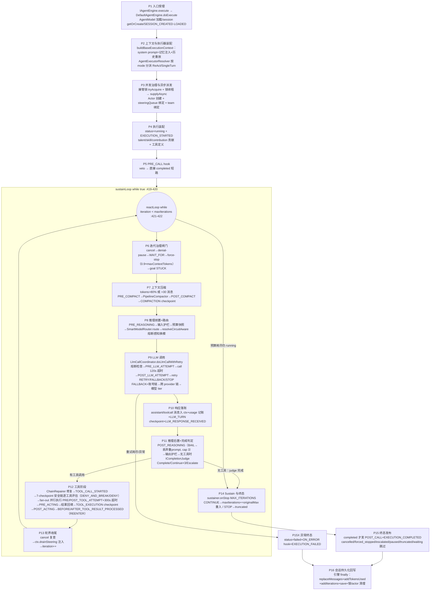
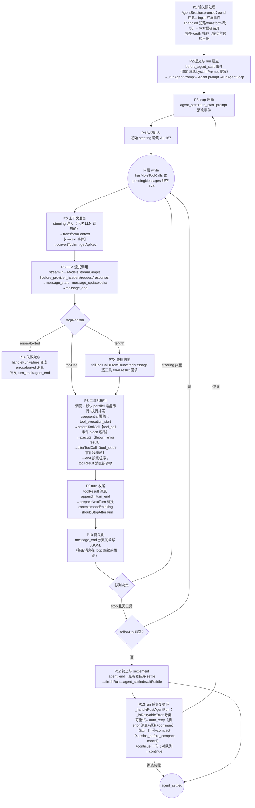

# S1 三方 agent loop 具体执行流程逐步分解（WI4 交付物）

> Status: resolved
> Date: 2026-09-12
> Scope: nop-ai-agent / deepseek-harness（dsh）/ pi 三方 agent 主循环从输入进入到最终响应的完整调用链：阶段划分、每步职责、流式路径、扩展点挂载位置；S1 主题权威深挖
> Conclusion: 三方主循环都收敛于"治理检查 → 上下文准备 → LLM 调用 → 工具批 → 回填 → 终止判定"骨架，但层级与重入语义根本不同——nop 是双层计数循环（sustainLoop×reactLoop，maxIterations 上限 + sustainer 扩预算，7 个治理退出分支），dsh 是三层队列循环（driver×turn×step，inbox 排空即停，重试在 step 内 while 重入），pi 是双层队列循环 + loop 外层恢复循环（retry/溢出压缩在 AgentSession 层以 agent.continue() 重入）。扩展点挂载哲学三分：nop 枚举点+HookResult 四态、dsh waterfall 洋葱模型、pi 单槽 hook+多播事件。流式路径三分：dsh 流式整流记录持久化（结算一次性落 assistant/attempt 或含完整 stream 记录的 assistant/message——c291e7961a 结构迁移）、pi delta 转发不持久、**nop 当前无流式路径**（REASONING_CHUNK 已声明未接线，LLM 调用唯一路径为非流式 IChatService.call——勘误，见 ④-8）。
> 基线: nop=800baf32da（2026-09-12 实测；nop-ai/nop-ai-agent 与基线 c585459f83 间代码 diff 为空，锚点不漂移）、dsh=c291e7961a（WI6 期重钉；原基线 141eb6fef8）、pi=c49906ec7；全部锚点行号当日实测
> 锚点重钉: 2026-09-14，HEAD 4582e780dad4（plan 355 重构+M5/M6 修复后逐锚点核对；仅行号更新，结论不变）
> 引用: 00-dimension-matrix.md（S1 章节契约）、02-terminology-map.md（T1-T7 术语口径）；本文档是执行流程主题权威源

## ① 结论摘要

- 三方共享"治理→上下文→LLM→工具→回填→终止"骨架；层级差异：nop 双层计数循环、dsh 三层队列循环（driver/turn/step）、pi 双层队列循环（外层 follow-up/内层 turn）。
- LLM 重试重入位置三分：nop 在 LlmCallCoordinator 内部（对主循环透明，:160-443）；dsh 在 step 的 while(true) `continue` 重入（重走 buildRequest，压缩后消息生效，agent.ts:361,463）；pi 在 loop 外层 AgentSession._handlePostAgentRun → agent.continue()（摘除 error 消息，AS:1088-1116）。
- 压缩触发点三分：nop iteration 闸门后（tokens>80% 或 >30 消息，:813-815）；dsh 挂 agent/pre-step（pressure）与 agent/request-error（overflow）两个 waterfall；pi run 后恢复循环（overflow compact 一次性门闩）+ 提交前预检。
- 流式：dsh 流式经 AssistantStreamAttempt 累积 + `agent/assistant-stream` 瞬时帧，结算一次性持久化 `assistant/attempt` 或含完整 stream 记录的 `assistant/message`（整流记录，c291e7961a 结构迁移）+ BlockAssembler 装配；pi message_update 转发 delta（不持久化 delta）；nop 无流式（勘误：REASONING_CHUNK lifecycle point 与 ITERATION_STARTED 事件已声明但无触发点）。
- 工具并发：nop 批内全 fan-out（300s 超时，无并发安全标记）；dsh isConcurrencySafe 分组 + exclusive 屏障 + 有界池（10）；pi 默认并行（准备串行+执行并发）+ executionMode 覆盖。
- 扩展点总量：nop 12 lifecycle point + 4 execution point + 7-checkpoint 安全链；dsh 4 agent waterfall + 4 tools waterfall + llm/stream + system-prompt/assemble + 若干 emit；pi 10 个 AgentLoopConfig 单槽 hook + 34 类 ExtensionAPI 事件桥接。
- 关键勘误（对 WI3 术语表，已回写）：①nop 无流式路径；②pi v4 harness 未接入生产循环（仅骨架+测试引用），"双会话栈并存"应读作"v3 生产 + v4 未接线骨架"；③pi 生产重试路径是 _prepareRetry+continue，retryAssistantCall 仅存在于未接线的 v4 路径；④dsh 并行池实现在 tool-calls.ts:199-214。

## ② 三方完整调用链

### 2.1 nop-ai-agent：ReAct 执行链

路径约定：`AGENT`=nop-ai/nop-ai-agent/src/main/java/io/nop/ai/agent/，`CORE`=nop-ai/nop-ai-core/src/main/java/io/nop/ai/core/。

阶段明细（职责与锚点）：

| 阶段 | 职责 | 关键锚点 |
|---|---|---|
| P1 入口受理 | execute/sendMessage → sessionId 解析、`/{agentName}.agent.xml` 加载 + recipe 合并、session getOrCreate | `AGENT/engine/DefaultAgentEngine.java:690-734`、`engine/AgentSessionSupport.java:87-109` |
| P2 装配 | system prompt + 预算化记忆注入 + 会话历史重放构 ctx（默认 maxIterations=10）；mode 分派：null/"react"→ReAct、"single-turn"→SingleTurnExecutor、"plan"→fail-fast | `engine/AgentSessionLifecycle.java:138-172`、`engine/AgentExecutionContext.java:86-117`、`engine/AgentExecutorResolver.java:140-218` |
| P3 并发治理 | 接管锁 tryAcquire + runningExecutions.putIfAbsent + 锁续租 → supplyAsync → Actor 创建 + steeringQueue 绑定 + team 绑定 → executor.execute().join() | `engine/DefaultAgentEngine.java:771-877` |
| P4 执行装配 | status=running、EXECUTION_STARTED、talent/skill/PROMPT 贡献 + 工具定义 + 基础 ChatOptions | `engine/ReActAgentExecutor.java:355-373`、`engine/AgentPromptAssembly.java:273-283` |
| P5 PRE_CALL | 会话级前置 hook；veto → 整个执行直接 completed + vetoedAt=PRE_CALL | `engine/ReActAgentExecutor.java:614-623` |
| P6 治理闸门 | 每 iteration 开头五连检：cancel（:731）→ denial-pause（:745）→ WAIT_FOR suspend（:757-788，checkpoint+waiting 终态）→ force-stop（:790，预调用估算 >0.9×maxContextTokens，兜底压缩）→ goal STUCK（:807，escalated） | `engine/ReActAgentExecutor.java:731-811`、`engine/AgentLoopGuard.java:48-122` |
| P7 压缩 | 触发：tokensUsed>80%×maxContextTokens 或 messages>30；PRE_COMPACT→快照归档→PipelineCompactor（异常保留原文）→POST_COMPACT→消息替换→COMPACTION checkpoint→COMPACTION 事件 | `engine/ReActAgentExecutor.java:813-815,136-137`、`engine/AgentCompactionCoordinator.java:58-219` |
| P8 推理前置 | PRE_REASONING（veto→跳过本轮但计预算）→输入护栏（block→注入阻断消息）→预算快照→route（SmartModelRouter 分级+预算降档）→resolveCircuitAware（主模型熔断则扫 fallback 链，上限 64，全拒绝 fail-loud）→模型切换审计 role=80 | `engine/ReActAgentExecutor.java:824-925`、`router/SmartModelRouter.java:86-123`、`engine/LlmCallCoordinator.java:784-826` |
| P9 LLM 调用 | 熔断检查→重试循环[PRE_LLM_ATTEMPT（veto cap 3）→callChatWithTimeout 120s→POST_LLM_ATTEMPT→shouldRetry]；RETRY=同账号退避重试；FALLBACK 三级：QUOTA/AUTH→账号链换 key→跨 provider failover 链；TRANSIENT→模型 tier 回退；全耗尽 fail-loud | `engine/LlmCallCoordinator.java:160-443,681-705`、`CORE/reliability/StandardRetryPolicy.java:113-154`、`CORE/reliability/ThresholdBreaker.java:112-144` |
| P10 响应落账 | assistant/toolCall 消息入 ctx、usage 记账（usageRecorder+tokenEstimator 校准）、LLM_TURN checkpoint、LLM_RESPONSE_RECEIVED 事件 | `engine/ReActAgentExecutor.java:934-1051` |
| P11 推理后置 | POST_REASONING（BAIL→丢弃响应+re-prompt，cap 3 超限 fail-loud）→输出护栏（block/modify）→goalTracker.recordIteration→无工具时 completionJudge：Complete→completed / Continue→注入续跑消息（连续 3 次强制完成）/ Escalate→escalated | `engine/ReActAgentExecutor.java:1059-1140`、`completion/RuleBasedCompletionJudge.java:57-75`、`completion/LlmCompletionJudge.java:71-111` |
| P12 工具阶段 | repair（默认 NoOp opt-in）→TOOL_CALL_STARTED→7-checkpoint 逐工具评估（postDenialGuard→toolAccess→permission→pathAccess→Layer2→Layer3 approvalGate→conflict；DENY_AND_BREAK→break，DENY→跳过该工具；deny 记入 ledger，超阈值 3 →paused）→executeAllowedCalls fan-out 并行（PRE/POST_TOOL_ATTEMPT veto→该工具 error result；300s 超时）→PRE_ACTING（返回值被丢弃）→spill 超限→结果回填 ctx→TOOL_EXECUTION checkpoint→POST_ACTING→BEFORE/AFTER_TOOL_RESULT_PROCESSED（REENTER 合法点，per-iteration cap 3，注入 marker 消息） | `engine/ReActAgentExecutor.java:1148-1204`、`engine/AgentToolDispatcher.java:118-487`、`engine/AgentSecurityConsultation.java:113-351`、`repair/ChainRepairer.java:42-80` |
| P13 轮界收尾 | cancel 复查→ctx.drainSteering（Actor steering 注入点）→iteration++ | `engine/ReActAgentExecutor.java:1206-1234`、`engine/AgentExecutionContext.java:319-326` |
| P14 Sustain | 预算耗尽且仍 running→sustainer.onStop(MAX_ITERATIONS)：CONTINUE→maxIterations+=originalMax（计数不重置，k 次 sustain 总预算=original×(1+k)，每轮重跑 P6 全部治理检查）/ STOP→truncated。默认 NoOpSustainer 恒 STOP；SisypheanSustainer 默认最多 3 轮 | `engine/ReActAgentExecutor.java:455-479,1250-1252,403-411`、`reliability/ISustainer.java:11-67`、`reliability/SisypheanSustainer.java:74` |
| P15 终态发布 | 仅 completed 发 POST_CALL hook（BAIL→记录 bailReason）+EXECUTION_COMPLETED；其余终态跳过 | `engine/ReActAgentExecutor.java:1304-1335` |
| P15X 异常终态 | 顶层 catch→status=failed+ON_ERROR hook（两处：LlmCallCoordinator:432 与 execute:492）+EXECUTION_FAILED | `engine/ReActAgentExecutor.java:484-495` |
| P16 持久化回写 | 引擎 finally：session.replaceMessages+addTokensUsed+addIterations+save；锁/actor/checkpoint 缓存清理 | `engine/DefaultAgentEngine.java:878-925` |

**流式路径（勘误结论）**：`REASONING_CHUNK` lifecycle point 仅在 `hook/AgentLifecyclePoint.java:11` 声明、`hook/DefaultHookRegistry.java:169` 注册名映射，全仓库（非测试）**无任何触发点**；`AgentEventType.ITERATION_STARTED`（`engine/AgentEventType.java:6`）同样无发布点。LLM 调用唯一路径是同步非流式 `IChatService.call`（`nop-ai/nop-ai-api/.../chat/IChatService.java:16-19`，经 120s 超时包装）；`callStream`（:33）不被 agent 引擎消费。**nop 当前无流式执行路径**。

### 2.2 deepseek-harness：ReactLoopAgent 三层队列循环

路径约定：dsh 仓库相对路径；`AL-C`=packages/core/agent-loop/src/agent.ts。

```mermaid
flowchart TD
    P1d[P1 输入接入<br/>上层调 followup/steer/inject] --> P2d[P2 inbox 持久入队<br/>Inbox.splice→agent/inbox/spliced 落账<br/>abort 后唤醒重分类 next-turn]
    P2d --> P3d[P3 唤醒<br/>idle→running 新 AbortController<br/>agent/status emit；非 idle 则 latch]
    P3d --> P4d[P4 driver 循环<br/>while await turn ；finally idle+latch 重放]
    P4d --> P5d[P5 turn 打开<br/>turn/start 落账]
    P5d --> P6d[P6 步骤认领+提示词组装<br/>inbox.claim→systemPrompt.assemble<br/>【system-prompt/assemble waterfall】<br/>→runtime-context 快照候选]
    P6d --> P7d[P7 pre-step 瀑布<br/>【agent/pre-step waterfall】<br/>reject→blocked / enter 重写消息<br/>默认注入快照 user 消息；compaction pressure 挂此]
    P7d --> P8d[P8 终止判定 A<br/>reject→turn/end blocked<br/>空 batch→completed]
    P8d --> P9d[P9 step 打开+消息落账<br/>step/start + user/message]
    P9d --> P10d[P10 请求组装<br/>seed→【agent/request waterfall】替换 LlmCallConfig<br/>→prepareCall 绑 retryPolicy<br/>→request/header + request/context]
    P10d --> P11d[P11 模型流调用<br/>llm.stream→【llm/stream waterfall】<br/>→adapterStream 终端边界]
    P11d --> P12d[P12 流式消费<br/>AssistantStreamAttempt 累积+瞬时帧<br/>结算持久化 assistant/attempt 或 assistant/message 整流记录<br/>+BlockAssembler 装配；abort 落 interrupted:true 消息]
    P12d --> P13d{finish error/aborted?}
    P13d -->|是| P13X[P13 请求错误恢复<br/>【agent/request-error waterfall】<br/>llm-retry 退避（llm/retry 先持久化）<br/>或 compaction overflow 压缩<br/>retry→continue 重入 P10]
    P13X --> P10d
    P13d -->|否| P14d[P14 消息定格<br/>assistant/message（sourceEventSeqs）<br/>max-tokens→step 结束（粘性）<br/>无工具→completed]
    P14d -->|有工具| P15d[P15 工具调度<br/>isConcurrencySafe 分组：parallel 池 cap10<br/>/exclusive 屏障；tool/call 落账]
    P15d --> P16d[P16 工具执行管线<br/>【tools/pre-execute】审批 allow/deny/ask<br/>→【tools/execute】around-dispatch<br/>→【tools/post-execute】spill-policy<br/>→物化→【tools/result emit】]
    P16d --> P17d[P17 结果落账+回灌<br/>tool/result（引用 call seq）<br/>additionalContexts FIFO 进 next-step<br/>concludesTurn 累积]
    P17d --> P18d[P18 step 收尾<br/>step/end（finally）；max-tokens 粘性合并]
    P18d --> P19d{turnEnds 且 next-step 排空?}
    P19d -->|否| P6d
    P19d -->|是| P19X[P19X turn 关闭判定<br/>【agent/turn-stopping serial】<br/>监听者 steer 反对→继续 step]
    P19X -->|复查仍空| P20d[P20 turn 收尾<br/>finally turn/end reason<br/>队列有 pending→换新 AbortController]
    P20d --> P4d
    P20d -->|无 pending| P21d[P21 终态<br/>driver idle（agent/status）<br/>消费侧从 session log 读最终响应]
```

阶段明细：

| 阶段 | 职责 | 关键锚点 |
|---|---|---|
| P1-P2 输入接入 | followup→next-turn / steer→next-step（唤醒）/ inject→next-step（不唤醒）；`send` 先于 splice 捕获 abort 后唤醒重分类；splice 落 `agent/inbox/spliced` 持久事件 | `AL-C:128-147`、`packages/core/agent-loop/src/inbox.ts:169-246` |
| P3 唤醒 | idle→running（新 AbortController）+`agent/status`；非 idle latch（wakeRequested）；disposed 不 latch | `AL-C:172-193,104-111` |
| P4 driver | `while (await this.turn())`；turn() false 三情况：队列无 pending/pre-step reject/空 batch；finally idle+latch 重放；turn 间复用 AbortController，有 pending 才换新 | `AL-C:225-238,342-348` |
| P5-P6 turn 打开+组装 | `turn/start`；inbox.claim（纯删除持久 splice+claimed 通知）→systemPrompt.assemble（变量求值→sections 排序→tools 收集→waterfall→complete 段恢复）→renderContextSections→RuntimeContextProjection（快照变化才产候选） | `AL-C:240-248`、`packages/core/system-prompt/src/index.ts:467-542`、`packages/core/agent-loop/src/runtime-context.ts:64-75` |
| P7 pre-step | agent/pre-step waterfall：默认 next=enter+[...claimed, 快照消息]；reject→blocked；compaction-basic pressure 检查挂链首 | `AL-C:240-259`（preStep 本体，waterfall 249-255）、`packages/compaction/compaction-basic/src/index.ts:147-165` |
| P9-P10 请求组装 | step/start→user/message 落账；buildRequest：seed config（上次 header 的 requestProposal）→agent/request waterfall（LlmCallConfig 替换，不能改消息）→prepareCall（绑 registration/retryPolicy）→request/header（initial/resume/change）+request/context | `AL-C:302,375,531,541,571-580,597`（step/start:302、user/message:375、agent/request:531、prepareCall:541、request/header:571-580、request/context:597） |
| P11-P12 流式 | LlmRuntime.stream→llm/stream waterfall（终端 next=adapterStream）→AssistantStreamAttempt 累积 + `agent/assistant-stream` 瞬时帧，结算 append `assistant/attempt` 或含完整 stream 记录的 `assistant/message`（整流记录，c291e7961a 结构迁移）+ BlockAssembler.push；abort→interruptedBlocks 落 `assistant/message{interrupted:true}`（丢 tool-call 块） | `AL-C:389-431`、`packages/llm/llm/src/index.ts:913-927,843-900`、`packages/llm/llm/src/assembler.ts:48-178` |
| P13 错误恢复 | finish error/aborted→agent/request-error waterfall：无监听者认领→undefined→LlmError 终止；llm-retry：normal 非可重试码→next()，否则经 sessionProjections 事件折叠恢复 llm/retry 计数（step/start|turn/end 清零）→超 maxRetries→next()→`llm/retry` 先持久化→cancellableDelay→`llm/retry-started`→retry（`continue` 重入 while(true)：重新 buildRequest，压缩后消息生效）；compaction-basic overflow：CONTEXT_WINDOW_EXCEEDED 码→压缩→retry（maxOverflowRetries 上限） | `AL-C:443-463`、`packages/llm/llm-retry/src/index.ts:126-137,188-190,194-241`、`packages/compaction/compaction-basic/src/index.ts:179-223` |
| P14 消息定格 | assistant/message append（surfaceOp:append，内嵌 stream 整流记录）；max-tokens 粘性（:307-310，后续 completed 不能降级）；无 tool-call→completed | `AL-C:465-486` |
| P15-P17 工具 | 模型序分组：executionMode 严格 parallel 才入池（cap=maxParallelToolCalls 默认 10，settings 热改下一组生效），exclusive 是屏障；tool/call 落账→prepare（tools/pre-execute 审批：allow/deny/ask，ask 无审批服务降级 deny）→dispatch（tools/execute around：timeout-policy 挂此）→finalize（tools/post-execute：spill-policy 挂此；block→error feedback）→tools/result emit（冻结）→tool/result 模型序提交（sourceEventSeqs=[callSeq]）→additionalContexts FIFO 进 next-step inbox→concludesTurn 累积 | `packages/core/agent-loop/src/tool-calls.ts:59-289`、`packages/core/tools/src/index.ts:1463-1507,1569-1599,1742-1781,1657-1676` |
| P18-P19 step/turn 收尾 | step/end（finally）→max-tokens 粘性合并；turnEnds 且 next-step 排空→agent/turn-stopping serial（监听者 agent.steer() 反对→继续 step，数据裁决）→复查仍空→break | `AL-C:307-319` |
| P20-P21 turn/driver 收尾 | 异常定格：signal.aborted→aborted（reason=CancelCause user/parent/hook/disposed）/非 abort→error（LlmError.failure 或 errorChain→UNKNOWN）+agent/error emit；finally turn/end；队列有 pending→换新 AbortController 继续下一个 turn；driver idle→消费侧从 session log 读响应（headless：flush+summarize） | `AL-C:322-348,217-223,230-238`、`packages/bundle/headless/src/index.ts:64,207` |

### 2.3 pi：runLoop 双层队列循环 + AgentSession 恢复循环

路径约定：`AL`=packages/agent/src/agent-loop.ts，`A`=packages/agent/src/agent.ts，`AS`=packages/coding-agent/src/core/agent-session.ts，`R`=packages/coding-agent/src/core/extensions/runner.ts，`SM`=packages/coding-agent/src/core/session-manager.ts，`SDK`=packages/coding-agent/src/core/sdk.ts。**生产链路为 v3 栈**；v4 AgentHarness 未接入生产循环（`packages/agent/src/harness/agent-harness.ts:355-441` 除少数方法外全部 `unavailable()` 抛 HarnessNotImplemented；唯一引用 `server/create-harness.ts` 仅被测试引用）。

阶段明细：

| 阶段 | 职责 | 关键锚点 |
|---|---|---|
| P1 输入预处理 | /cmd 扩展命令拦截→compaction 进行中拒绝→`input` 事件（handled 短路/transform）→skill/模板展开→流式中按 streamingBehavior 入队→模型/API key 校验→提交前预检压缩→组 user 消息+_pendingNextTurnMessages | `AS:1127-1284`、`R:1196-1270` |
| P2 run 建立 | `before_agent_start` 事件（附加消息/systemPrompt 整条替换）→_runAgentPrompt（_isAgentRunActive）→Agent.prompt（activeRun 互斥）→runAgentLoop | `AS:1244-1286,1074-1086`、`A:348-358,409-423`、`AL:95-118` |
| P3 loop 启动 | agent_start→turn_start→逐条 prompt 消息 message_start/end→runLoop；事件出口=Agent.processEvents 按订阅序 await 全部监听器 | `AL:104-118`、`A:588-590`、`AS:400` |
| P4 队列注入 | steer/followUp 入 PendingMessageQueue（默认 one-at-a-time）；getSteeringMessages/getFollowUpMessages 回调=queue.drain；steering 注入点=内层下一迭代开头、下次 LLM 调用前（AL:182-190）；follow-up 是外层 while 燃料（AL:263-268） | `A:125-159,283-290,475-482`、`AL:167,182-190,259,263-268` |
| P5 上下文准备 | transformContext（LLM 前改写消息数组，扩展 `context` 事件 structuredClone 链式替换）→convertToLlm（bashExecution/custom→user、过滤 excludeFromContext）→getApiKey（每次调用前重取） | `AL:289-306`、`SDK:360-364,266-300`、`R:984-1014` |
| P6 流式调用 | streamFn（内部 modelRuntime.streamSimple+timeout/retry 设置+transformHeaders 内挂 before_provider_headers）→start→text/thinking/toolcall delta（message_update 携带原生 assistantMessageEvent）→done/error（response.result() 取终稿→message_end）；StreamFn 契约：错误编码进流不抛 | `AL:308-361`、`SDK:312-358`、`R:1050-1079` |
| P7 stopReason 判定 | error/aborted→turn_end+agent_end 早退；length→整批判废（"arguments may be truncated... Re-issue"，terminate:false）；stop→退出内层；toolUse→executeToolCalls | `AL:196-222,381-406` |
| P8 工具批 | 调度分派（config sequential 或任一工具 executionMode sequential→串行；否则并行：按源序 start+prepareToolCall 串行 preflight→thunk 推入→Promise.all 并发；end 按完成序、toolResult 消息按源序）；beforeToolCall（校验后，block→error result 可带 terminate；扩展 tool_call 事件可就地 mutate event.input，block 短路）；工具 throw→createErrorToolResult；afterToolCall（浅覆盖 content/details/usage/isError/terminate；hook 抛错→结果替换为 error）；terminate 早停=全批都 true | `AL:411-554,600-791`、`AS:484-538`、`R:932-953,877-930` |
| P9 turn 收尾 | toolResult 消息 append→turn_end→prepareNextTurn（返回 AgentLoopTurnUpdate 替换 context/model/thinkingLevel；AgentSession 用 _installAgentNextTurnRefresh 每轮刷新 systemPrompt+tools）→shouldStopAfterTurn（true→agent_end return） | `AL:224-257`、`AS:540-561` |
| P10 持久化 | 唯一生产持久化点=_handleAgentEvent 的 message_end 分支（user/assistant/toolResult→sessionManager.appendMessage→同步 appendFileSync JSONL；首条 assistant 前缓冲）；由于 processEvents 同步 await，**每条消息在 loop 继续前落盘** | `AS:651-669`、`SM:1015-1067` |
| P11 队列决策 | steering 非空→设为 pendingMessages 重进内层；stop 且无工具且无 steering→getFollowUpMessages 非空→continue 外层；空→break→agent_end | `AL:170-274` |
| P12 settlement | agent_end 只是最后 loop 事件；全部 subscribe 监听器 settle 后 finishRun（resolve activeRun）→waitForIdle；AgentSession 层发 agent_settled | `A:529-591,328-330`、`AS:607-615,1566-1571` |
| P13 恢复循环 | _handlePostAgentRun：取末条 assistant→_isRetryableError（先排除 isContextOverflow，再 isRetryableAssistantError 正则双表）→可重试：_prepareRetry（maxRetries 预算→auto_retry_start→**摘除 error assistant 消息**（session 历史保留）→指数退避→agent.continue()）；溢出：门闩 _overflowRecoveryAttempted（一次性）→摘 error→_runAutoCompaction("overflow")（session_before_compact 可 cancel/自备结果）→buildSessionContext 重建→continue 一次；补队列→continue | `AS:1088-1116,2770-2874,2050-2154,2166-2348` |
| P14 失败兜底 | handleRunFailure：loop 异常时合成 stopReason=error/aborted 的 assistant 消息，按序补发 message_start→message_end→turn_end→agent_end，保证事件序列完整 | `A:504-527` |

**流式路径**：pi 流式存在且是默认（streamSimple），但 delta（message_update）**不持久化**——落盘的是 message_end 后的完整消息（v3 SessionManager）；扩展可经 message_update 观察但无改写权（改写走 message_end 同 role 替换）。

## ③ 扩展点挂载位置汇总表（阶段 × 扩展点）

### nop（12 lifecycle + 4 execution + 安全链 + 护栏/路由/压缩挂点）

| 阶段 | 挂载扩展点 | 能力入口 |
|---|---|---|
| P5 | AgentLifecyclePoint.PRE_CALL | hook veto→整个执行 completed |
| P7 | PRE_COMPACT / POST_COMPACT | observe（middleware 链式包裹） |
| P8 | PRE_REASONING；IContentGuardrail(输入) | veto→跳过本轮；block→注入阻断消息 |
| P9 | ExecutionPoint.PRE_LLM_ATTEMPT / POST_LLM_ATTEMPT（middleware，重试内重跑）；ICircuitBreaker/IRetryPolicy/IAccountChainResolver/IProviderFailoverChain/IModelRouter（策略对象非 hook） | veto→合成失败进 retry 决策（cap 3） |
| P11 | POST_REASONING；IContentGuardrail(输出)；ICompletionJudge | bail→丢弃响应 re-prompt（cap 3）；block/modify |
| P12 | IToolCallRepairer；SecurityCheckpointChain 7-checkpoint；ExecutionPoint.PRE/POST_TOOL_ATTEMPT；PRE_ACTING / POST_ACTING；BEFORE/AFTER_TOOL_RESULT_PROCESSED | repair 改写；DENY/DENY_AND_BREAK；tool veto→该工具 error result；REENTER 合法点（cap 3） |
| P13 | IActorRuntime steeringQueue | 注入消息 |
| P14/P15 | ISustainer；POST_CALL | 强制续跑 / bail 记录 |
| P15X | ON_ERROR | observe（hook 异常被吞） |

### dsh（4 agent waterfall + tools 4+2 + llm/stream + system-prompt/assemble + emit 组）

| 阶段 | 挂载扩展点 | 分发语义 |
|---|---|---|
| P6 | system-prompt/assemble（waterfall） | 返回值权威（complete 段除外） |
| P7 | agent/pre-step（waterfall） | reject→blocked / enter 重写消息；compaction pressure 挂链 |
| P10 | agent/request（waterfall） | 替换 LlmCallConfig（不能改消息） |
| P11 | llm/stream（waterfall） | 终端 next=adapterStream |
| P13 | agent/request-error（waterfall） | retry action 或 undefined 终局；llm-retry 与 overflow 压缩挂此 |
| P15-P16 | tools/pre-execute / tools/execute / tools/post-execute（waterfall×3）；tools/result、tools/change（emit） | allow/deny/ask；around-dispatch；accept/block |
| P19 | agent/turn-stopping（serial） | steer 反对即续跑（数据裁决） |
| P3/P21 | agent/status（emit） | idle↔running |
| P20 | agent/error（emit） | 失败上报 |
| P2 | agent/inbox/inserted·claimed·discarded（emit×3）+ agent/inbox/spliced（session 事件） | inbox 观察 |
| P3 前 | agent/session-start（emit） | 发布后首 turn 前 |
| 全局 | session/event（emit，每次 append 后）+ session/flush（parallel） | post-commit 馈送 |

### pi（AgentLoopConfig 单槽 hook + ExtensionAPI 事件桥接）

| 阶段 | 挂载扩展点 | 类型 |
|---|---|---|
| P1 | input；before_agent_start | ExtensionAPI 事件（handled/transform；附加消息/systemPrompt 替换） |
| P4 | queue_update | AgentSession 自有事件 |
| P5 | transformContext（→context 事件）；convertToLlm；getApiKey | AgentLoopConfig hook（单槽） |
| P6 | before_provider_headers / before_provider_request / after_provider_response | ExtensionAPI 事件（改 headers/替换 payload/观察响应） |
| P8 | beforeToolCall（→tool_call 事件，block+就地 mutate input）；afterToolCall（→tool_result 事件，浅覆盖）；toolExecution | AgentLoopConfig hook + 事件 |
| P8 全程 | tool_execution_start/update/end；message_start/update/end | ExtensionAPI 事件（message_end 可同 role 替换） |
| P9 | prepareNextTurn；shouldStopAfterTurn | AgentLoopConfig hook |
| P13 | session_before_compact（cancel/自备结果）；session_compact | ExtensionAPI 事件 |
| P12 | agent_end；agent_settled | 事件 |

## ④ 三方流程结构差异点

1. **循环层级与停止判定**：nop 双层计数循环（sustainLoop×reactLoop；maxIterations 默认 10 上限 + sustainer 扩预算重入；iteration 计数不重置而是扩上限）；dsh 三层队列循环（driver×turn×step；无步数上限，inbox 排空即停）；pi 双层队列循环（外层 follow-up×内层 turn；无上限，队列排空即停）。nop 是唯一"计数上限+显式延长机制"设计。
2. **治理退出分支**：nop reactLoop 顶部五连检（cancel/denial-pause/WAIT_FOR suspend/force-stop/goal-STUCK）+ judge 三分（Complete/Continue/Escalate）+ 终态机 9 态（completed/failed/truncated/escalated/paused/waiting/cancelled/forced_stopped/vetoed）；dsh 6 种 TurnEndReason；pi stopReason 7 值。pause/waiting/escalated/force-stop 四个治理态为 nop 独有。
3. **LLM 重试重入位置**：nop 在 LlmCallCoordinator 内部 while 循环（对主循环透明，重试不改消息）；dsh 在 step 的 while(true) `continue`（重走 buildRequest，重读 surface 派生消息——压缩后重试天然生效）；pi 在 loop 外层（AgentSession._handlePostAgentRun→摘除 error 消息→agent.continue() 整 run 重入）。
4. **压缩触发位置**：nop iteration 开头治理闸门后（集中式 Coordinator，tokens>80% 或 >30 消息）；dsh 挂两个 waterfall（pre-step pressure / request-error overflow），压缩序列内嵌 open turn（step 间）；pi run 后恢复循环（overflow）+ 提交前预检 + 手动 /compact。
5. **扩展点挂载哲学**：nop 枚举点+HookResult 四态显式语义（veto/bail/reenter 各有合法点白名单与 cap）；dsh 全部收敛为 Cordis waterfall/emit 事件（结构化 Decision 返回值）；pi 双轨——AgentLoopConfig 单槽 hook（每类一个，多扩展靠 coding-agent 组合串链）+ ExtensionAPI 多播事件（34 类）。
6. **输入注入消费点**：nop P13 轮界（ctx.drainSteering，Actor opt-in 绑定）；dsh inbox.claim（step 边界，三种注入词 followup/steer/inject 按 next-turn/next-step 双边界+唤醒语义区分）；pi 双队列 drain（turn 末 AL:259 + 内层下一迭代开头 AL:182-190；QueueMode 控制排空粒度）。
7. **工具并发模型**：nop 批内全 fan-out 并行（CompletableFuture+300s 超时+中途异常取消全部；无并发安全标记）；dsh isConcurrencySafe(args) 分组+exclusive 屏障+有界池（默认 10）；pi 默认并行（准备串行+执行并发）+任一 sequential 全批串行+文件变更按路径串行队列。
8. **流式路径**：dsh 持久化整流记录（assistant/attempt 或含完整 stream 记录的 assistant/message；token 级重放保真；c291e7961a 结构迁移，原逐 chunk assistant/chunk 事件已删除）+中断固化 interrupted:true 消息；pi 流式默认但 delta 不持久化（持久化完整消息）；**nop 无流式路径**（勘误：REASONING_CHUNK/ITERATION_STARTED 已声明未接线，IChatService.call 非流式唯一路径；WI8/WI18 对比 D1-4 子机制时 nop 侧裁定"双方均无"对 nop 成立）。
9. **持久化时机**：nop iteration 粒度 checkpoint 分录（LLM_TURN/TOOL_EXECUTION/COMPACTION/WAIT_FOR）+ 引擎 finally 会话整体保存；dsh 事件即持久化（append 即真相，write-behind 批量落盘+flush barrier）；pi message_end 同步落盘（每条消息 loop 继续前，JSONL 同步 append）。
10. **异常序列完整性**：dsh 靠持久化修复（interruptedTurnClosers 崩溃收尾）+ turn finally；pi 靠 handleRunFailure 合成消息补齐事件序列；nop 靠终态机+ON_ERROR+EXECUTION_FAILED 事件（无合成消息机制）。
11. **run 与会话的绑定**：nop 一次 execute=一个 AgentExecutionContext（引擎 finally 回写 session）；dsh agent 与 session 1:1 同 id、状态全在事件日志（进程重启从 log 恢复）；pi Agent 有状态（transcript 在内存）+AgentSession 持久化层，continue() 语义受"末消息可续"约束。

## ⑤ 权威源引用关系

- 本文档是 **S1（agent loop 执行流程）主题的权威深挖**。
- **dsh-D1（WI8）**：D1 子机制对比中，凡涉及流程级事实（循环层级、重试重入、压缩触发、流式路径、steering 消费点、扩展点挂载位置），引用本文档 §2.2/③/④ 结论，只写对比增量（对 dsh 的取舍评价），不重复展开调用链。
- **pi-D1（WI18）**：同上，引用 §2.3/③/④。
- **nop 侧流程事实**被 dsh-D*/pi-D* 各维引用时以本文档为准。
- 冲突处理：维度报告与本文档冲突时，以本文档为准，由 WI29 交叉校对收敛记录；本文档与代码冲突时以代码为准并回写本文档 + daily log 登记。
- 关联勘误（已回写 02-terminology-map.md，见 daily log 2026-09-12）：T4 nop 无流式路径、T9 pi 生产重试路径、T13 dsh 并行池锚点、T15 pi v4 未接线、T1 sustainLoop 精确锚点 :419-420。

## References

- `ai-dev/analysis/compare-agent-design/00-dimension-matrix.md`（S1 章节契约与权威源约定）
- `ai-dev/analysis/compare-agent-design/02-terminology-map.md`（T1-T7 术语口径）
- `ai-dev/analysis/compare-agent-design/01-code-map.md`（三方 HEAD 基线）
- nop：`nop-ai/nop-ai-agent/src/main/java/io/nop/ai/agent/engine/`（ReActAgentExecutor/DefaultAgentEngine/LlmCallCoordinator/AgentToolDispatcher/AgentCompactionCoordinator/AgentHookInvoker）、`hook/`、`middleware/`、`engine/AgentSecurityConsultation.java`、`reliability/`（nop-ai-core）
- dsh：`packages/core/agent-loop/src/`（agent.ts/inbox.ts/tool-calls.ts）、`packages/core/agent/src/`（runtime-types.ts/dispatch.ts）、`packages/core/tools/src/index.ts`、`packages/llm/llm/src/index.ts`、`packages/llm/llm-retry/src/index.ts`、`packages/compaction/compaction-basic/src/index.ts`（外部仓库 `~/ai/deepseek-harness`）
- pi：`packages/agent/src/agent-loop.ts`、`agent.ts`、`packages/coding-agent/src/core/agent-session.ts`、`core/extensions/runner.ts`、`core/sdk.ts`、`core/session-manager.ts`（外部仓库 `~/ai/pi`）
