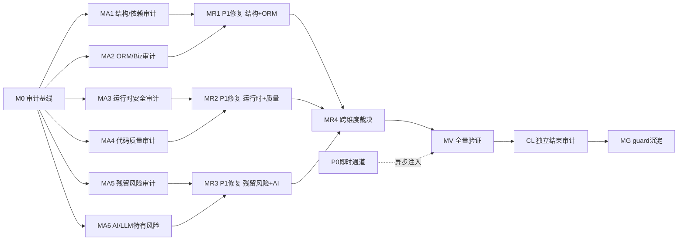

# 审计-修复路线图：nop-ai 全模块组

> 最后更新：2026-07-30（v3 — 修复 Owner Doc 路径、Finding ID 格式、MR3 恢复、MA6 扩展）
> 来源：`ai-dev/skills/audit-remediation-roadmap-authoring-prompt.md`
> 目标模块组：nop-ai（18 子模块，~1275 main Java, ~426 test）
> 模块排除：`nop-ai-mcp-server`、`nop-spring-mcp-server`、`nop-spring-mcp-server-support`（MCP 协议集成模块，独立发布周期，需单独审计）
> 复杂度评分：**S 级**（18 子模块，1275+ main Java，21 实体 — 均超出 S 阈值：子模块 ≥5、Java ≥200、实体 ≥15）

## 目的

对 nop-ai 模块组实施全面审计-修复闭环：
1. 覆盖从未被审计的 17 个子模块（nop-ai-agent 是唯一被审计过的）
2. 覆盖残留风险新维度（空壳实现、静默跳过、接线完整性等 7 项）
3. 覆盖 AI/LLM 特有风险维度（LLM 配置安全、Agent 编排安全、向量数据隔离等）
4. P0 即时通道 + P1 批量修复
5. 每个工作项产出后经独立 closure audit 验证

## Work Item Status

### M0 — 审计编排基线

| # | Work Item | Status | Owner Doc | Deps | Skill |
|---|-----------|--------|-----------|------|-------|
| 0.1 | 生成审计维度矩阵 | done | `ai-dev/audits/arm-audit-dimension-matrix.md` | — | `audit-remediation-roadmap-authoring-prompt.md` |
| 0.2 | 初始化 arm-index.md | done | `ai-dev/audits/arm-index.md` | 0.1 | `audit-remediation-roadmap-authoring-prompt.md` |
| 0.3 | 运行绿色基线验证 | done | — | 0.2 | none（手动命令） |

### MA1 — 结构与依赖审计（api-core + toolkit + infra）

| # | Work Item | Status | Owner Doc | Deps | Skill |
|---|-----------|--------|-----------|------|-------|
| 1.1 | api-core 依赖图与模块边界 | done | `ai-dev/design/nop-ai-agent/01-architecture-baseline.md` | 0.3 | `deep-audit-prompts.md`（维度 01） |
| 1.2 | api-core API 表面积与契约一致性 | done | —（无独立设计文档，以 `nop-ai/nop-ai-api/` 源码为基线） | 0.3 | `deep-audit-prompts.md`（维度 03） |
| 1.3 | toolkit 模块职责与工具接口审计 | done | — | 0.3 | `deep-audit-prompts.md`（维度 02） |
| 1.4 | infra 模块（gateway/dsl-orm/maven/codegen）审计 | done | — | 0.3 | `deep-audit-prompts.md`（维度 02） |
| 1.5 | 命名与术语一致性（全模块） | done | — | 0.3 | `deep-audit-prompts.md`（维度 19） |

### MA2 — ORM/BizModel/服务层审计（biz-dao + biz-svc）

| # | Work Item | Status | Owner Doc | Deps | Skill |
|---|-----------|--------|-----------|------|-------|
| 2.1 | ORM 模型与实体设计审计 | done | `nop-ai/model/nop-ai.orm.xml` | 0.3 | `orm-model-audit-prompt.md` |
| 2.2 | 生成管线完整性审计 | done | `nop-ai/model/` | 0.3 | `deep-audit-prompts.md`（维度 05） |
| 2.3 | Delta 定制合规性审计 | done | `nop-ai/nop-ai-dao/src/main/resources/_vfs/` | 0.3 | `deep-audit-prompts.md`（维度 06） |
| 2.4 | BizModel 规范遵循审计 | done | `nop-ai/nop-ai-service/src/main/java/io/nop/ai/service/entity/` | 0.3 | `deep-audit-prompts.md`（维度 07） |
| 2.5 | XMeta 与 BizModel 对齐审计 | done | `nop-ai/nop-ai-meta/src/main/resources/_vfs/nop/ai/model/` | 0.3 | `deep-audit-prompts.md`（维度 11） |
| 2.6 | GraphQL 与 API 层审计 | done | `nop-ai/nop-ai-service/` + `nop-ai/nop-ai-api/` | 0.3 | `deep-audit-prompts.md`（维度 12） |
| 2.7 | IoC 与 Bean 配置审计 | done | `nop-ai/*/src/main/resources/_vfs/**/*.beans.xml` | 0.3 | `deep-audit-prompts.md`（维度 08） |

### MA3 — 运行时与安全审计（全模块）

| # | Work Item | Status | Owner Doc | Deps | Skill |
|---|-----------|--------|-----------|------|-------|
| 3.1 | 跨模块依赖链审计 | done | `docs-for-ai/01-repo-map/module-groups.md` | 0.3 | `cross-module-dependency-audit-prompt.md` |
| 3.2 | 安全与权限模型审计 | done | `nop-ai/nop-ai-core/src/main/java/io/nop/ai/core/` | 0.3 | `deep-audit-prompts.md`（维度 13） |
| 3.3 | 异步与事务模式审计 | done | — | 0.3 | `deep-audit-prompts.md`（维度 14） |
| 3.4 | 错误处理与错误码审计 | done | `nop-ai/*/src/main/java/**/*Errors.java` | 0.3 | `deep-audit-prompts.md`（维度 09） |
| 3.5 | 跨模块契约一致性审计 | done | `nop-ai/nop-ai-api/` + `nop-ai/nop-ai-core/` | 0.3 | `deep-audit-prompts.md`（维度 20） |

### MA4 — 代码质量审计（全模块）

| # | Work Item | Status | Owner Doc | Deps | Skill |
|---|-----------|--------|-----------|------|-------|
| 4.1 | 类型安全与泛型使用 | todo | — | 0.3 | `deep-audit-prompts.md`（维度 15） |
| 4.2 | 代码风格与规范 | todo | — | 0.3 | `deep-audit-prompts.md`（维度 17） |
| 4.3 | 测试覆盖与质量 | todo | — | 0.3 | `deep-audit-prompts.md`（维度 16） |
| 4.4 | 单元测试有效性 | todo | — | 0.3 | `deep-audit-prompts.md`（维度 21） |
| 4.5 | 文档-代码一致性 | todo | `docs-for-ai/` | 0.3 | `deep-audit-prompts.md`（维度 18） |

### MA5 — 残留风险审计专项（全模块）

| # | Work Item | Status | Owner Doc | Deps | Skill |
|---|-----------|--------|-----------|------|-------|
| 5.1 | 空壳实现扫描（H01） | done | — | 0.3 | `open-ended-adversarial-review-prompt.md` |
| 5.2 | 静默跳过检测（H02） | done | — | 0.3 | `open-ended-adversarial-review-prompt.md` |
| 5.3 | 接线完整性验证（H03） | done | — | 0.3 | `open-ended-adversarial-review-prompt.md` |
| 5.4 | 设计文档与代码 drift（H04） | done | `ai-dev/design/` + `docs-for-ai/` | 0.3 | `design-doc-audit-prompt.md` |
| 5.5 | 敏感信息泄露扫描（H05） | done | — | 0.3 | `open-ended-adversarial-review-prompt.md` |
| 5.6 | 测试隔离性审查（H06） | done | — | 0.3 | `open-ended-adversarial-review-prompt.md` |
| 5.7 | 既有修复验证（H07） | done | `ai-dev/audits/arm-*.md` | 5.1-5.3 done | `closure-audit-prompt.md` |

### MA6 — AI/LLM 特有风险审计（全模块）

| # | Work Item | Status | Owner Doc | Deps | Skill |
|---|-----------|--------|-----------|------|-------|
| 6.1 | LLM 配置安全与密钥管理审计 | done | — | 0.3 | `open-ended-adversarial-review-prompt.md` |
| 6.2 | Agent 编排安全审计（指令注入/SSRF） | done | — | 0.3 | `open-ended-adversarial-review-prompt.md` |
| 6.3 | Token 计量与 LLM 调用可靠性审计 | done | — | 0.3 | `deep-audit-prompts.md`（维度 09/14） |
| 6.4 | 向量存储/Embedding 数据隔离审计 | done | — | 0.3 | `open-ended-adversarial-review-prompt.md` |
| 6.5 | 对话历史与 Prompt 安全审计 | done | — | 0.3 | `open-ended-adversarial-review-prompt.md` |

### MR1 — P1 批量修复（第一批：结构 + ORM/Biz）

| # | Work Item | Status | Owner Doc | Deps | Skill |
|---|-----------|--------|-----------|------|-------|
| R1.0 | MA1+MA2 P1 发现汇总、排序并展开为具体修复工作项行 | done | `ai-dev/audits/arm-index.md` §P1 | MA1+MA2 done | none（展开器） |
| R1.x | MA1+MA2 修复（17 P1 findings fixed） | done | — | R1.0 | MR1 plan executed |

### MR2 — P1 批量修复（第二批：运行时 + 质量）

| # | Work Item | Status | Owner Doc | Deps | Skill |
|---|-----------|--------|-----------|------|-------|
| R2.0 | MA3+MA4 P1 发现汇总、排序并展开 | done | `ai-dev/audits/arm-index.md` §P1 | MA3+MA4 done | none（展开器） |
| R2.x | MR2 P1 修复执行 | done | — | R2.0 | 按具体修复工作项确定 |

### MR3 — P1 批量修复（第三批：残留风险 + AI 特有）

| # | Work Item | Status | Owner Doc | Deps | Skill |
|---|-----------|--------|-----------|------|-------|
| R3.0 | MA5+MA6 P1 发现汇总、排序并展开 | done | `ai-dev/audits/arm-index.md` §P1 | MA5+MA6 done | none（展开器） |
| R3.x | MR3 P1 修复执行（含 P0-MA6-01） | done | `ai-dev/plans/2026-07-31-1300-5-arm-mr3-fix.md` | R3.0 | 按具体修复工作项确定 |

### MR4 — 跨维度裁决

| # | Work Item | Status | Owner Doc | Deps | Skill |
|---|-----------|--------|-----------|------|-------|
| R4.1 | 跨维度 P1 裁决与冲突修复 | done | `ai-dev/audits/arm-index.md` | MR1+MR2 done | `closure-audit-prompt.md` |

### MV — 全量验证

| # | Work Item | Status | Owner Doc | Deps | Skill |
|---|-----------|--------|-----------|------|-------|
| V.1 | 全量 build + test | todo | — | MR4 done | none |
| V.2 | 独立子代理 closure audit | todo | `ai-dev/audits/arm-index.md` | V.1 | `closure-audit-prompt.md` |
| V.3 | 所有 P0/P1 finding 可追溯至修复或 deferred | todo | `ai-dev/audits/arm-index.md` | V.2 | `closure-audit-prompt.md` |

### MG — Guard 与知识沉淀

| # | Work Item | Status | Owner Doc | Deps | Skill |
|---|-----------|--------|-----------|------|-------|
| G.1 | 新失败模式提升为 lessons | todo | `ai-dev/lessons/` | MV done | none |
| G.2 | 重复审计维度提升为 skills/ 新提示 | todo | `ai-dev/skills/` | MV done | none |
| G.3 | 更新 docs-for-ai/ 和 design 文档 | todo | `docs-for-ai/` + `ai-dev/design/` | MV done | none |

## 里程碑

| 里程碑 | 依赖 | 产出 |
|--------|------|------|
| M0 | 无 | 维度矩阵 + arm-index + 绿色基线 |
| MA1 | M0 | 审计报告（api-core, toolkit, infra） |
| MA2 | M0 | 审计报告（ORM, BizModel, 服务层） |
| MA3 | M0 | 审计报告（跨模块依赖, 安全, 错误处理） |
| MA4 | M0 | 审计报告（代码质量, 测试, 文档） |
| MA5 | M0 | 审计报告（残留风险 7 维度） |
| MA6 | M0 | 审计报告（AI/LLM 特有风险） |
| MR1 ✅ | MA1+MA2 | 修复代码 + 测试（closed 2026-07-31） |
| MR2 ✅ | MA3+MA4 | 修复代码 + 测试（closed 2026-07-31） |
| MR3 ✅ | MA5+MA6 | 修复代码 + 测试（closed 2026-07-31） |
| MR4 ✅ | MR1+MR2+MR3 | 裁决文档（closed 2026-07-31） |
| MV | MR1+MR2+MR3+MR4 | 验证报告 + closure audit |
| MG | MV | lessons + docs |

## 依赖图

## Work Item Details

### M0
- **M0.3**: 运行 `./mvnw clean install -DskipTests -pl nop-ai -am -T 1C` + `./mvnw test -pl nop-ai -am -T 1C`

### MA1 — 结构与依赖审计
- **MA1.1**: api-core 模块依赖图合规性（是否引入不该依赖的模块）
- **MA1.2**: api-core 的 IChatService/IAiChatService/ILlmDialect 等公开接口契约收敛性
- **MA1.3**: toolkit 的 IToolExecutor/IToolManager 接口及 20 个工具执行器的职责边界
- **MA1.4**: infra 子模块（gateway/dsl-orm/maven/codegen）的文件职责与模块边界
- **MA1.5**: 全模块命名与术语一致性（跨模块同概念同一名称）

### MA2 — ORM/BizModel/服务层审计
- **MA2.1**: 21 实体的 ORM 建模合规性（字段类型、关系定义、域使用、displayName）
- **MA2.2**: model→codegen→dao→meta→service→web 生成链路完整性
- **MA2.3**: Delta 文件位置、x:extends 使用合规性
- **MA2.4**: 21 个 CrudBizModel 规范遵循（注解、继承、方法归属）
- **MA2.5**: XMeta 字段与 BizModel 方法返回值一致性
- **MA2.6**: GraphQL schema 暴露与字段权限
- **MA2.7**: beans.xml 注入方式、生成文件边界

### MA3 — 运行时与安全
- **MA3.1**: 全模块跨模块依赖链检查（nop-ai-agent 依赖链是否符合架构基线）
- **MA3.2**: 安全模型审计（App-layer shell 命令检查器、gateway 转换安全、默认配置）
- **MA3.3**: 异步/事务模式（BizModel 事务边界、chat service 异步调用）
- **MA3.4**: 错误处理（NopAiException 规范、ErrorCode 使用、错误消息国际化）
- **MA3.5**: 跨模块契约一致性（api→core→agent→toolkit 接口版本兼容性）

### MA4 — 代码质量
- **MA4.1**: 类型安全与泛型使用（Raw type、unchecked cast、泛型擦除）
- **MA4.2**: 代码风格与规范（命名、导入分组、文件长度、注释质量）
- **MA4.3**: 测试覆盖与质量（覆盖率缺口、测试断言强度、mock 使用）
- **MA4.4**: 单元测试有效性（测试是否捕获 bug、边界覆盖、异常路径）
- **MA4.5**: 文档-代码一致性（j apidoc vs 实际行为、注释过期）

### MA5 — 残留风险
- **MA5.1**: 空壳实现扫描（接口有声明无实现、方法体空或 throw UnsupportedOperationException）
- **MA5.2**: 静默跳过检测（空 catch 块、catch-and-swallow、条件不满足时静默返回）
- **MA5.3**: 接线完整性（beans.xml 是否所有 bean class 存在，@Inject 是否有对应 bean）
- **MA5.4**: 设计文档与代码 drift（design/ 下文档 vs 实际实现）
- **MA5.5**: 敏感信息泄露（API Key/Secret/密码/令牌在日志或错误消息中泄露）
- **MA5.6**: 测试隔离性（测试间共享状态导致交叉污染）
- **MA5.7**: 既有修复验证（验证 MA5.1-MA5.3 的 P1 修复是否到位）

### MA6 — AI/LLM 特有风险
- **MA6.1**: LLM 配置安全（API Key 是否硬编码、配置加载路径、日志脱敏）
- **MA6.2**: Agent 编排安全（ToolExecutor 输入验证、外部 URL 白名单、指令注入防御）
- **MA6.3**: Token 计量与 LLM 调用可靠性（计量一致性、重试/退避/熔断、超时配置）
- **MA6.4**: 向量存储/Embedding 数据隔离（IVectorStore 多租户隔离、embedding API 鉴权）
- **MA6.5**: 对话历史与 Prompt 安全（prompt 注入持久化、敏感信息在 ChatMessage 存储中泄露）

### MR1-MR3
每个 MR 含 R*.0 展开器工作项 + 具体修复工作项。R*.0 执行后自动展开到 roadmap 中。

### MR3
MA5+MA6 产出的 P1 发现展开为具体修复工作项

### MR4
无跨维度冲突时直接 N/A

### MV
全量构建 + 独立子代理 closure audit（验证所有 P0/P1 finding 可追溯）

### MG
失败模式提升为 lessons + 文档更新

## 框架/平台复用

| 能力 | 提供方式 |
|------|----------|
| 21 维度深度审计 | `ai-dev/skills/deep-audit-prompts.md` |
| ORM 模型审计 | `ai-dev/skills/orm-model-audit-prompt.md` |
| 跨模块依赖审计 | `ai-dev/skills/cross-module-dependency-audit-prompt.md` |
| 设计文档审计 | `ai-dev/skills/design-doc-audit-prompt.md` |
| 设计完整性扫描 | `ai-dev/skills/design-completeness-scan-prompt.md` |
| 开放式对抗审查 | `ai-dev/skills/open-ended-adversarial-review-prompt.md` |
| Closure audit | `ai-dev/skills/closure-audit-prompt.md` |
| 构建验证 | `./mvnw clean install -DskipTests -T 1C` |
| 测试验证 | `./mvnw test -pl <模块> -am -T 1C` |

## 横切关注点

- **执行模式（串行）**：Mission Driver 按文档顺序取第一个 todo
- **P0 即时通道**：审计中发现 P0 当即处理（就地修复或异步注入修复 plan）
- **报告归档**：每份审计报告使用 `arm-` 前缀，产出即更新 arm-index.md
- **Finding ID 规范**：`P<级别>-<里程碑>-<序号>`，如 `P0-MA1-001`
- **绿色基线保持**：每个 MR 结束时全量 build 通过
- **R*.0 展开机制**：MR1-MR2 使用展开器工作项
- **Closure audit 强制**：每个工作项完成后必须由独立子代理做 closure audit，通过后方可标记 done

## 规则

1. 本 roadmap 只处理 P0 和 P1。P2/P3 记录为 deferred successor
2. 审计 plan 产物 = 审计报告（`ai-dev/audits/arm-*.md`）+ 索引更新
3. 修复 plan 产物 = 代码变更 + 测试
4. MA 与 MR 严格分离
5. 初始全 `todo`，里程碑无状态
6. 每个工作项标记 done 前必须经独立 closure audit
