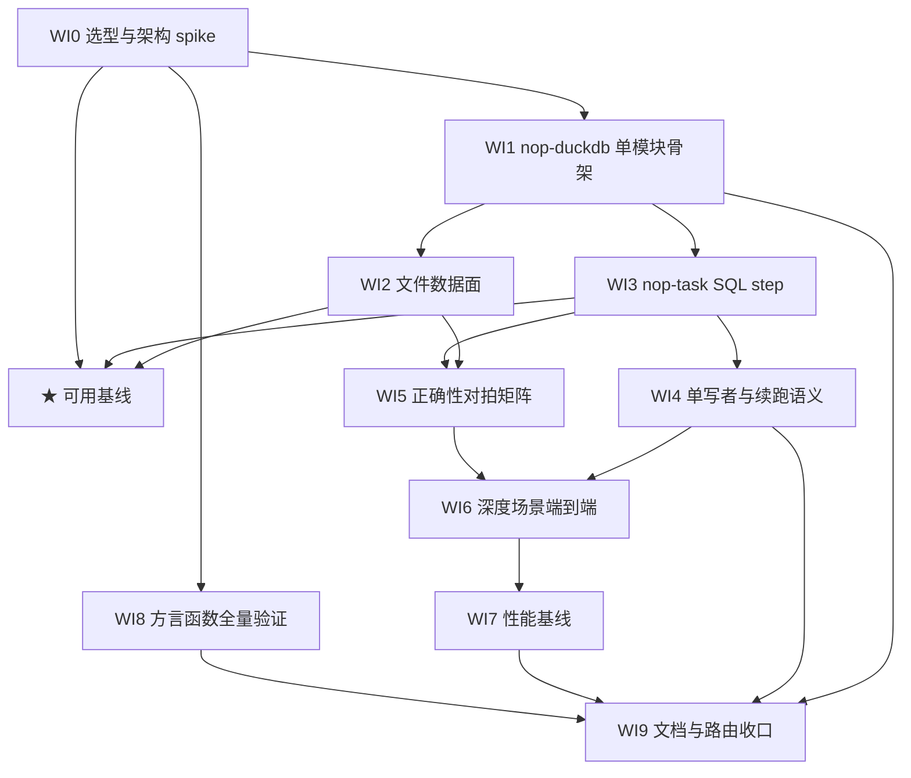

# DuckDB 集成 Roadmap（数据文件与本地库的分析执行层）

> Last updated: 2026-09-30
> 位置：按仓库 roadmap 惯例存放于 ai-dev/backlog/。书写约定：未来交付物路径用普通文本书写、不加反引号；已存在的文档路径用反引号，持续受 check-doc-links 保护。
> Sources: `ai-dev/analysis/2026-09/2026-09-30-esproc-sqlazy-deep-analysis.md`（§19 性能归因与引擎选型裁定，primary）、2026-09-30 同日追问结论（范围收敛：仅数据文件 + 本地库，不做多源联邦；DuckDB 执行 + nop-task 编排；深度应用测试优先）

## Purpose

本 roadmap 编排 Nop 平台对 DuckDB 的首次集成：以 DuckDB 作为**数据文件与本地库场景**的进程内分析执行层，挂接 nop-task 步骤编排，并交付各种深度应用测试。

**范围硬边界**（继承 §19 裁定，改动须先改本节）：

- **不做多源联邦**——那是 esProc 的立身之本，本 roadmap 明确排除
- **分层契约**：持久层 = 开放数据文件（CSV/Parquet，归档不用专有二进制）；执行层 = DuckDB（进程内 duckdb_jdbc）；编排层 = nop-task；业务库写回 = nop-dao/ORM（DuckDB 不作业务库写通道）
- `.duckdb` 文件只作任务级工作集/结果缓存（单写者），不作长期归档格式

不含实现细节。每个 `todo` WI 由其执行计划承载（`ai-dev/plans/00-plan-authoring-and-execution-guide.md`）；roadmap 就绪后可经 mission-driver draft 生成 mission config 驱动（当前未立项 mission）。

## Work Item Status

> 唯一动态状态块。勾选 = 独立 closure audit 通过（完成判定见 Cross-Cutting）；`todo` = 无计划，`planned` = 已有通过 draft review 的执行计划。WI 编号全文件递增不重排；**deps 是唯一并行屏障**。每个 WI 以独立 plan 承载。

### M0 — 可行性与架构裁定

- [x] WI0 duckdb_jdbc 选型与既有方言实测 spike：依赖坐标与版本裁定（duckdb_jdbc，MIT 许可，native 平台矩阵 darwin-aarch64 / linux-amd64 / linux-aarch64 / windows；版本收敛进 nop-dependencies BOM；JDK release=17 兼容实测）；既有 duckdb 方言转实测（selector 自动选择、EQL/ORM 查询翻译、ddl_duckdb 建表、错误码翻译）；ORM 数据源接入路径实测（nop.datasource.* 指 jdbc:duckdb:{filePath}、命名 dataSourceMap 可否作实体路由、Hikari 池 + 单写者文件的连接策略）；spike 四问——进程内连接与 CSV/Parquet 读写、memory_limit + temp_directory 外存溢出、同文件单写者锁冲突行为、不支持平台 native 加载失败的报错语义；模块归属预设裁定 = **单一顶层模块 nop-duckdb**（对齐 nop-jq 扁平先例：一个 pom 无子模块，连接管理 + 文件数据面 + task step 全放本模块；已裁定不拆、不叫 nop-dao-duckdb——职责是执行层而非 DAO/dialect），WI0 可按实测推翻并记录理由（Deliverable: 裁定报告（落 ai-dev/analysis/ 当月目录）+ 依赖坐标裁定；deps: 无；Item Type: Decision + Proof）

### M1 — 核心集成

- [x] WI1 nop-duckdb 单模块骨架与连接管理：新模块注册（根 pom modules + nop-dependencies BOM 条目）、IoC bean 的连接/会话管理（@InjectValue 配置：memory_limit / threads / temp_directory / 单文件锁策略）、模块级异常（English 消息，按 error-handling 两档惯例，不裸 RuntimeException）、基础单测（连接生命周期、配置注入、异常路径、native 缺失显式报错）（Deliverable: 模块 + 测试；deps: WI0；Item Type: Feature）
- [x] WI2 文件数据面：CSV/Parquet 读写封装（读入与 COPY 导出）、类型映射与 NULL 语义、XLSX 入口桥（复用 nop-tablesaw 既有 XlsxReader 转 CSV/Parquet，不重造 xlsx 解析）、roundtrip 测试（文件 → DuckDB → 文件 一致性）（Deliverable: file IO API + 测试；deps: WI1；Item Type: Feature）
- [x] WI3 nop-task SQL 步骤集成：SQL 执行型 ITaskStep（step 类型注册与 XDSL 定义、参数绑定防注入、步骤间传文件路径/表名而非全量数据、结果摘要回传）、与既有 retry/timeout/ratelimit/transaction/orm 装饰器兼容、测试对齐 nop-task-ext 既有可靠性测试家族（Deliverable: step 实现 + 测试；deps: WI1；Item Type: Feature）
- [x] ★ **Milestone: 可用基线**（WI0+WI1+WI2+WI3 全部完成后勾选）

### M2 — 可靠性与并发

- [x] WI4 单写者与续跑语义：同文件 lock conflict 的显式任务语义（错误码/可读英文消息/retry 策略，不假装可并行）、独立文件并行与多读单写测试、DB 状态存档跨重启续跑（任务中途 kill 后 resume 且数据一致）、native 缺失/磁盘满/临时目录不可写等故障注入（Deliverable: 语义裁定 + 测试；deps: WI3；Item Type: Feature + Fix）

### M3 — 深度应用测试

- [x] WI5 数据正确性对拍矩阵：同一数据集上四方对拍——DuckDB 经 nop-duckdb 执行层 API、DuckDB 经 ORM/EQL 既有方言路径、RDB 下推（经 nop-dao）、tablesaw；类型矩阵（decimal 精度、date/time 时区、大整数、字符串、boolean、NULL）；聚合与 join 语义（count(*)、avg 忽略 NULL、NULL 等值 join、隐式类型提升）golden 断言——断言业务不变量，防快照漂移（Deliverable: 对拍测试矩阵；deps: WI2 + WI3；Item Type: Proof）
- [x] WI6 深度场景端到端测试：大负载外存档（低 memory_limit + temp_directory 下大 CSV/Parquet 聚合/join/sort 不 OOM 完成、native 与连接句柄无泄漏）；端到端 pipeline（xlsx/csv 摄取 → parquet → SQL 步骤链 → 结果文件或写回本地库——SQLite ATTACH 直写、业务表经 ORM）；并发档（独立文件并行任务全绿、同文件冲突按 WI4 语义失败）（Deliverable: 场景测试套件；deps: WI4 + WI5；Item Type: Proof）
- [x] WI7 性能基线与调优档：同一数据集下 DuckDB vs tablesaw vs RDB 下推的可重复基准（记录数据量档位与 threads/memory_limit 配置），对齐 nop-benchmark 既有 JMH 模式或落可重复脚本——只立基线不设竞速指标（Deliverable: 基准基线记录；deps: WI6；Item Type: Proof）
- [x] WI8 duckdb 方言函数全量验证：覆盖 IDialect("duckdb").getFunctionNames() 生效集（继承链 default 49 ∪ postgresql 8 ∪ duckdb 覆盖 9 ≈ 50 个净函数，含 rand→random、instr→strpos、current_date/current_timestamp 括号语义、year 覆盖、uuid/uuidv7/cosh/sinh）+ sqls 模板（分页 LIMIT/OFFSET、dateTimeLiteral/timestampLiteral 字面量、forUpdate/lockHint 置空）+ errorCodes 模式匹配 + sqlDataTypes 映射的 DDL 可执行性；机制 = 参数化测试枚举全部函数逐一在真实 DuckDB 构造 SELECT fn(...) 执行（test scope duckdb_jdbc，jdbc:duckdb: 内存/临时库），要求无异常 + 关键语义断言（返回类型、括号、映射正确性）；发现方言定义错误修 duckdb.dialect.xml（nop-dao 既有配置，非生成物）并带回归；模式参照既有 TestDialect / TestSQLFunction / JdbcTestCase（Deliverable: 函数验证测试套件 + dialect.xml 缺陷修复；deps: WI0；Item Type: Proof + Fix）

### M4 — 收口

- [ ] WI9 文档与路由收口：owner doc 落 docs-for-ai/03-modules/（模块使用、配置项、单写者/内存/写边界约束）、docs-for-ai/INDEX.md 路由与 04-reference source-anchors 更新、01-repo-map/module-groups.md 登记新模块 nop-duckdb、当日 ai-dev/logs/ 状态一致（Deliverable: 文档更新 + 路由更新；deps: WI0–WI8 完成或显式延期裁定；Item Type: Proof）

## Current Baseline（2026-09-30 核对）

**已存在：**

- **nop-dao DuckDB SQL 方言已内置**（commit c6c09978c8，2025-11-14）：duckdb.dialect.xml（extends postgresql 方言，205 行：driver org.duckdb.DuckDBDriver、jdbcUrlPattern、类型映射、时间字面量、无锁覆写）+ selector/duckdb.selector.yaml（按 JDBC productName=DuckDB 自动选择）+ nop-orm 的 ddl_duckdb.xlib（DDL 生成）+ 错误码翻译器 duckdb 模式
- 选型裁定与分层依据：`ai-dev/analysis/2026-09/2026-09-30-esproc-sqlazy-deep-analysis.md` §19
- nop-task 编排引擎成熟：ITaskStep 步骤图 + Retry/Timeout/RateLimit/Transaction/OrmSession 装饰器 + DB 状态存档跨重启续跑（nop-task-ext 既有测试家族可作参照）
- nop-tablesaw 数据面（tablesaw 0.43.1）：XlsxReader、DataSet↔Table 变换、行校验、facet 函数
- 测试基建与规范：nop-autotest 三档基类 + `docs-for-ai/02-core-guides/testing.md`

**主要缺口：**

- 方言**零实测**：仓库内无任何 `jdbc:duckdb` 实际连接、无 ORM/EQL 对 DuckDB 的端到端测试（唯一 pattern 是方言自身）——方言是纸面支持，WI0 起转实测
- 零执行层：无 duckdb_jdbc 依赖坐标（BOM 未收录）、无连接/会话管理、无 task step、无文件数据面
- 全仓无 Arrow/Parquet 基础设施——"向量化文件"层不存在，Parquet 通路需从零引入
- nop-tablesaw 模块外零引用（孤岛），与任何执行层无桥
- 仓库无 CI——所有测试必须 `./mvnw test` 本地可跑可复现（esProc 零测试基线的反面教训）

## Framework / Platform Reuse

| 能力 | 提供方 | 约束 |
| --- | --- | --- |
| SQL 方言与 DDL 生成 | nop-dao 既有 DuckDB 方言（duckdb.dialect.xml + selector + ddl_duckdb.xlib，c6c09978c8） | 不重建方言、不把方言搬进 nop-duckdb；缺口修 dialect.xml（nop-dao 既有配置，非生成物）；nop-duckdb 只消费 |
| 任务编排与状态续跑 | nop-task core + nop-task-ext（Retry/Timeout/RateLimit/Transaction/OrmSession 装饰器、DB 状态存档） | 不自造调度/重试/续跑机制；测试参照既有可靠性测试家族 |
| XLSX 读取 | nop-tablesaw XlsxReader（既有） | DuckDB 不读 xlsx；不重造解析，只做转换桥 |
| 业务库读写 | nop-dao / ORM（EQL 下推） | 业务表写回一律走 ORM；DuckDB 仅分析与文件 |
| 测试基类与快照 | nop-autotest（BaseTestCase / JunitBaseTestCase / JunitAutoTestCase）+ testing.md 选型 | 对拍断言锚定业务不变量；异步并发遵守 testing.md 防挂起规则 |
| 依赖管理 | nop-kernel/nop-dependencies BOM | duckdb_jdbc 版本收敛进 BOM，不在业务模块散写 |
| 性能基准 | nop-benchmark 既有 JMH 模式 | WI7 只立基线，不新建基准框架 |
| 持久层格式 | Parquet（开放列存） | 归档禁用 `.duckdb` 专有格式；不引入任何不可 diff 的私有二进制格式 |
| JSON/表达式查询 | nop-jq（既有 jq 1.7.1 引擎） | 结构化 JSON 处理不重复引入 SQL 通道 |

## Dependency Graph

## Cross-Cutting（每个 WI 的完成判定）

1. **验证门**：`./mvnw test -pl <module> -am` 绿（含新模块与其消费方）；命令口径以 `docs-for-ai/00-start-here/project-context.md` Verification Commands 为准。
2. **单写者硬约束**：同一 `.duckdb` 文件并行写必然 lock conflict——产品语义与测试都必须显式化（失败可读、可裁定 retry），不假装可并行。
3. **内存预算**：DuckDB 默认按系统内存比例占用，必须经配置注入压低（memory_limit + temp_directory）；测试含低限外存档，防宿主 JVM OOM。
4. **native 平台矩阵**：duckdb_jdbc 携带平台 native 库；不支持平台在加载期显式报英文错误，而非运行中诡异失败。仓库无 CI，测试不依赖 CI 才能跑。
5. **写边界**：业务库写回一律走 nop-dao/ORM；DuckDB 仅承担分析计算与文件读写，不绕过 ORM 改业务数据。
6. **错误处理**：模块级异常 + English 消息（`docs-for-ai/02-core-guides/error-handling.md` 两档惯例），不裸 RuntimeException。
7. **测试取向**：断言业务语义而非凑数量；既有测试只增不删不削弱；测试暴露的产品缺陷走 `ai-dev/bugs/00-bug-fix-note-writing-guide.md` 独立立项，不在本 roadmap WI 内夹带修复。
8. **closure 判定**：独立 closure audit（不同 task_id 子代理，不得自审）通过后，才勾选 Work Item Status checkbox，并同步当日 `ai-dev/logs/` 与承载 plan 三处状态。
9. **边界回写**：任何"要不要多源/换存储/砍编排层"的范围变更，先改本文件 Purpose 硬边界再动工。
10. **方言语义边界**：既有 duckdb 方言已声明无锁（forUpdate/lockHint 置空）、supportReturningForUpdate=false——依赖悲观锁 / UPDATE...RETURNING 的路径不适用，测试与调用方不得假设其存在；ORM 实体默认挂单一数据源，"业务 MySQL + 分析 DuckDB 双库并存"的路由能力以 WI0 实测为准，不预设。

## Rules

- 状态只在 Work Item Status 的 checkbox 通道维护，不设第二状态面；WI 编号全文件递增不重排。
- deps 是唯一并行屏障；M1 内 WI2/WI3 可并行，WI8 仅依赖 WI0 可提前并行，WI9 必须最后。
- WI 编号于 2026-09-30 初稿期调整过一次（函数验证 WI 插入 M3，原 WI8 文档收口顺延为 WI9）——彼时无任何 plan 引用编号，此后编号冻结不重排。
- 本文件是状态索引与粗粒度分解，不是执行计划：不写实现步骤，deliverable 只述范围。
- 每个 `planned`/`todo` WI 由独立 plan 承载；mission 启动后不得手工改本文件（先停 mission）。
- 里程碑为派生状态：★ 可用基线仅在 WI0–WI3 全部完成后勾选。
- **单模块裁定与拆分触发条件**：已裁定单一顶层模块 nop-duckdb（对齐 nop-jq 扁平先例；不预拆、不叫 nop-dao-duckdb）。仅当出现下列任一**真实**条件才提拆分，且另行立项：(a) 出现不需要 nop-task 的第二消费者（如 CLI / 报表直连分析）被迫携带 task-core；(b) nop-task 生态要求 classpath 零 duckdb native。无真实消费者前不为假想需求拆模块。
