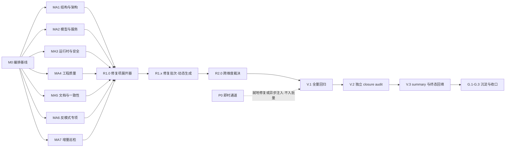

# 全仓代码审查路线图（full-code-review）

> 最后更新：2026-09-22（v5 — 第四轮收敛审查共识达成；收尾 2 处 Minor：utils 归属批次 d、check P0 分支处置背景注入 6.4。v4 = 第三轮 F1–F7；v3 = 第二轮 N1–N9；v2 = 第一轮 F1–F7）
> 来源：`ai-dev/skills/audit-remediation-roadmap-authoring-prompt.md`
> 关联轮次目录：`ai-dev/audits/2026-09/2026-09-22-2020-code-review-full/`
> Mission 配置：`missions/full-code-review.json`
> 目标范围：nop-entropy 全部顶层模块组（41 组 / ~200 子模块）
> 总体复杂度：**S 级**（多组同时满足 Java ≥ 200 与子模块 ≥ 5）

## 目的

对全仓库实施「审查 → 修正 → 整体审核」闭环，分三个 Wave 推进：

1. **Wave 0（编制期已完成）**：全仓调研基线、审计维度矩阵、未闭包发现汇聚。
2. **Wave 1（审核）**：按层 × 按模块细粒度审计现有代码，所有报告逐项保留在轮次子目录。
3. **Wave 2（修正）**：R1.0 展开器根据 Wave 1 审计结果把 P0/P1 发现转为修正工作项（增补本 roadmap），逐项修复并验证。
4. **Wave 3（整体审核）**：全量回归 + 独立 closure audit + 轮次汇总与知识沉淀。

本 roadmap 只处理 **P0 与 P1**；P2 走显式裁决通道，P3 记录为 watch-only。

## Work Item Status

> 唯一动态状态块。Status 取值 `todo | in progress | done | blocked | cancelled`。M0 四项为编制期已完成，其余初始全 `todo`。

### M0 — 审计编排基线（Wave 0）

| # | Work Item | Status | Owner Doc | Deps | Skill |
|---|-----------|--------|-----------|------|-------|
| 0.1 | 全仓模块调研与复杂度评级（9 组只读调研） | done | `docs-for-ai/01-repo-map/module-groups.md` | — | `audit-remediation-roadmap-authoring-prompt.md` |
| 0.2 | 建立轮次子目录与报告索引骨架 | done | 轮次子目录 `index.md` | 0.1 | 同上 |
| 0.3 | 绿色构建基线验证 | done | — | 0.1 | none（`./mvnw clean install -DskipTests -T 1C`，2026-09-22T19:56:36+08:00 BUILD SUCCESS） |
| 0.4 | 未闭包发现汇聚清单 | done | 矩阵 `00-scope-and-dimension-matrix.md` §4 | 0.1 | `audit-remediation-verification-prompt.md`（登记口径） |

### MA1 — 结构与架构层审计（Wave 1）

| # | Work Item | Status | Owner Doc | Deps | Skill |
|---|-----------|--------|-----------|------|-------|
| 1.1 | 全仓依赖图与模块边界审计（跨组依赖、循环依赖、api 模块纯净性） | todo | `docs-for-ai/01-repo-map/module-groups.md` | 0.3, 0.4 | `cross-module-dependency-audit-prompt.md` |
| 1.2 | nop-xlang 结构/边界/生成管线审计（解析、编译、执行链；XLangASTOptimizer 3028 行无直接测试、JsPromise:117 吞 Throwable 复核） | todo | `docs-for-ai/02-core-guides/xlang-and-xpl-basics.md` | 0.3, 0.4 | `deep-audit-prompts.md`（维度 01/02/05） |
| 1.3 | nop-core 结构审计（VFS/反射 ClassModel/XNode 2829 行/类型体系/CoreInitialization 启动链） | todo | `docs-for-ai/02-core-guides/xlang-and-xpl-basics.md` | 0.3, 0.4 | `deep-audit-prompts.md`（维度 01/02/15） |
| 1.4 | nop-commons + nop-api-core + nop-codegen + nop-xdefs 审计（工具巨类、162 模板文件链、114 xdef schema 一致性） | todo | `docs-for-ai/02-core-guides/xdef-and-xdsl.md` | 0.3, 0.4 | `deep-audit-prompts.md`（维度 02/05/17） |
| 1.5 | xlang 执行后端审计（nop-xlang-java/truffle/e2e/javac/antlr4 + dataset/markdown/record-mapping/kernel-cli/jq 空壳裁定） | todo | `ai-dev/design/xlang-java/` | 0.3, 0.4 | `deep-audit-prompts.md`（维度 02/16） |
| 1.6 | nop-core-framework 六模块结构边界审计（boot/config/ioc/log/plugin/security；CORE-02 defer 现状复核） | todo | `docs-for-ai/03-modules/nop-plugin.md` | 0.3, 0.4 | `deep-audit-prompts.md`（维度 01/02） |
| 1.7 | nop-persistence + nop-service-framework 分层与边界合规审计 | todo | `docs-for-ai/02-core-guides/service-layer.md` | 0.3, 0.4 | `deep-audit-prompts.md`（维度 01/06） |
| 1.8 | 集成与外围结构审计（spring/quarkus/network/integration/runner/autotest/demo + 漏网模块归属裁定） | todo | `docs-for-ai/01-repo-map/module-groups.md` | 0.3, 0.4 | `deep-audit-prompts.md`（维度 01/02） |

### MA2 — 模型与服务层审计（Wave 1）

| # | Work Item | Status | Owner Doc | Deps | Skill |
|---|-----------|--------|-----------|------|-------|
| 2.1 | nop-orm + nop-orm-model 深审（会话状态机/持久化上下文；check2 P1 复核） | todo | `docs-for-ai/02-core-guides/model-first-development.md` | 0.3, 0.4 | `deep-audit-prompts.md`（维度 04/10/14/15） |
| 2.2 | nop-orm-eql 深审（EQL 编译器；集合操作符 join 放大 P0 复核） | todo | — | 0.3, 0.4 | `deep-audit-prompts.md`（维度 10/15/16） |
| 2.3 | nop-dao + nop-db-migration + nop-dbtool 深审（migration 9/17 change CCE P0 复核） | todo | `docs-for-ai/02-core-guides/model-first-development.md` | 0.3, 0.4 | `deep-audit-prompts.md`（维度 04/09/14） |
| 2.4 | nop-nosql + nop-cdc 深审（RESP3 RateLimiter P0、PubSub 串投、codec 不对称复核） | todo | `ai-dev/design/nop-nosql/` | 0.3, 0.4 | `deep-audit-prompts.md`（维度 09/14/15） |
| 2.5 | 全仓 `model/*.orm.xml` 模型合规扫描（机械维度：业务 13 模块 + ai + code + stream 实体模型） | todo | `docs-for-ai/02-core-guides/orm-model-design.md` | 0.3, 0.4 | `orm-model-audit-prompt.md` |
| 2.6 | nop-biz + nop-graphql 深审（CrudBizModel 上帝类、权限 fail-open 三处、GraphQL 引擎） | todo | `docs-for-ai/02-core-guides/service-layer.md` | 0.3, 0.4 | `deep-audit-prompts.md`（维度 03/07/12/13） |
| 2.7 | 业务模块 BizModel/IoC 配置合规整域扫描（beans.xml、@BizModel 规范、xmeta 对齐） | todo | `docs-for-ai/02-core-guides/ioc-and-config.md` | 0.3, 0.4 | `configuration-audit-prompt.md` + `deep-audit-prompts.md`（维度 08/11） |

### MA3 — 运行时与安全层审计（Wave 1）

| # | Work Item | Status | Owner Doc | Deps | Skill |
|---|-----------|--------|-----------|------|-------|
| 3.1 | nop-wf 深审（WorkflowEngineImpl 1941 行、WF-01..03 MEDIUM 现状、审批状态机） | todo | `docs-for-ai/02-core-guides/workflow-configuration.md` | 0.3, 0.4 | `state-machine-business-review-prompt.md` + `deep-audit-prompts.md`（维度 13/14） |
| 3.2 | nop-task 深审（DaoTaskStateStore、continuation-skip P0 复核、可靠性装饰器） | todo | `docs-for-ai/03-modules/nop-task.md` | 0.3, 0.4 | `state-machine-business-review-prompt.md` |
| 3.3 | nop-batch 深审 a（S 级零专项审计首审）：DSL 任务模型→执行链、集群分区一致性 | todo | `docs-for-ai/03-modules/nop-batch.md` | 0.3, 0.4 | `deep-audit-prompts.md`（维度 04/07/14） |
| 3.4 | nop-batch 深审 b（首审续）：JDBC 读写事务、导入导出路径、批任务记录 | todo | `docs-for-ai/03-modules/nop-batch.md` | 0.3, 0.4 | `deep-audit-prompts.md`（维度 12/14/16） |
| 3.5 | nop-sys 深审（锁过期判断反向 P0 复核、Maker-Checker、事件广播可靠性） | todo | `docs-for-ai/03-modules/nop-sys.md` | 0.3, 0.4 | `deep-audit-prompts.md`（维度 08/13/14） |
| 3.6 | nop-report 深审（XPT 展开、ExpandedCell、公式函数注入面、pdf/docx 导出） | todo | `docs-for-ai/03-modules/nop-report.md` | 0.3, 0.4 | `deep-audit-prompts.md`（维度 12/13/15） |
| 3.7 | nop-rule + nop-dyn 深审（规则引擎、DynCodeGen 动态建模信任边界、DYN-01 复核） | todo | `docs-for-ai/03-modules/nop-rule.md` | 0.3, 0.4 | `deep-audit-prompts.md`（维度 10/13） |
| 3.8 | nop-tcc + nop-retry + nop-file 深审（CANCEL_SUCCESS 误标 P0、恢复路径、上传下载越权） | todo | `docs-for-ai/03-modules/nop-tcc.md` | 0.3, 0.4 | `state-machine-business-review-prompt.md` + `deep-audit-prompts.md`（维度 13） |
| 3.9 | nop-gateway + nop-network 深审（AI 鉴权拦截器语义、HTTP 客户端错误路径、解压/MQTT P0 复核） | todo | `docs-for-ai/03-modules/nop-network.md` | 0.3, 0.4 | `deep-audit-prompts.md`（维度 12/13/14） |
| 3.10 | nop-auth + nop-credential 增量安全审计（security AUTH/CRED 族之后的增量面） | todo | `docs-for-ai/03-modules/nop-auth.md` | 0.3, 0.4 | `deep-audit-prompts.md`（维度 13） |
| 3.11 | 全仓安全横切复核（security-audit item 14 的 MEDIUM×14 逐项现状标定 + 新增敏感面扫描） | todo | `ai-dev/backlog/security-audit-roadmap.md` | 0.3, 0.4 | `audit-remediation-verification-prompt.md` |

### MA4 — 工程质量层审计（Wave 1）

| # | Work Item | Status | Owner Doc | Deps | Skill |
|---|-----------|--------|-----------|------|-------|
| 4.1 | 错误处理与错误码一致性审计（全仓 ErrorCode/NopException 两层策略落地） | todo | `docs-for-ai/02-core-guides/error-handling.md` | 0.3, 0.4 | `deep-audit-prompts.md`（维度 09）+ `nop-platform-conformance-audit-prompt.md` |
| 4.2 | 测试有效性审计（zero-test 模块清单、@Disabled 清单、反模式抽查） | todo | `docs-for-ai/02-core-guides/testing.md` | 0.3, 0.4 | `unit-test-antipatterns.md` |
| 4.3 | 巨型手写文件与复杂度热点审计（>1500 行全仓盘点 + 拆分/保留裁定清单） | todo | — | 0.3, 0.4 | `deep-audit-prompts.md`（维度 02/15） |
| 4.4 | nop-format + nop-search + nop-message（非 pulsar）+ nop-cluster 深审 | todo | — | 0.3, 0.4 | `deep-audit-prompts.md`（维度 09/14/16） |
| 4.5 | nop-frontend-support + nop-dev-tools + nop-migration + nop-runner + nop-utils 深审（CLI 双入口、工具链质量） | todo | — | 0.3, 0.4 | `deep-audit-prompts.md`（维度 02/16/17） |

### MA5 — 文档与一致性层审计（Wave 1）

| # | Work Item | Status | Owner Doc | Deps | Skill |
|---|-----------|--------|-----------|------|-------|
| 5.1 | docs-for-ai 与 live 代码一致性审计（02-core-guides + 03-modules 抽样） | todo | `docs-for-ai/INDEX.md` | 0.3, 0.4 | `documentation-routing-audit-prompt.md` |
| 5.2 | ai-dev/design 各子系统设计文档 drift 审计（对照 live 代码） | todo | `ai-dev/design/README.md` | 0.3, 0.4 | `design-doc-audit-prompt.md` |
| 5.3 | 跨模块公共 API（nop-*-api）契约一致性与版本健康审计 | todo | `docs-for-ai/01-repo-map/module-groups.md` | 0.3, 0.4 | `cross-module-dependency-audit-prompt.md` + `deep-audit-prompts.md`（维度 20） |

### MA6 — 代码审计专项：反模式（Wave 1）

| # | Work Item | Status | Owner Doc | Deps | Skill |
|---|-----------|--------|-----------|------|-------|
| 6.1 | 空壳实现全仓扫描（scan-hollow-implementations.mjs + 人工抽样确认） | todo | — | 0.3, 0.4 | `deep-audit-prompts.md` + `ai-dev/tools/scan-hollow-implementations.mjs` |
| 6.2 | 静默跳过/吞异常全仓扫描（空 catch、catch-ignore、no-op 返回值） | todo | — | 0.3, 0.4 | `deep-audit-prompts.md`（维度 09） |
| 6.3 | 接线完整性抽样审计（入口→出口：codegen 全链、db-migration 执行链、IoC 启动链、GraphQL 请求链） | todo | — | 0.3, 0.4 | `deep-audit-prompts.md`（接线/端到端路径方法） |
| 6.4 | check 系列 P0×36 逐项复核与状态标定（still-live / already-fixed / false-positive / duplicated），仍 live 的转入 R1.0 输入 | todo | `ai-dev/audits/check/SUMMARY.md` | 0.3, 0.4 | `audit-remediation-verification-prompt.md` |
| 6.5 | check 系列 P1 抽样标定 a（≥50%）：成员 = 矩阵 §6 批次 a（kernel/core-framework/persistence） | todo | `ai-dev/audits/check/SUMMARY.md` | 0.3, 0.4 | `audit-remediation-verification-prompt.md` |
| 6.6 | check 系列 P1 抽样标定 b（≥50%）：成员 = 矩阵 §6 批次 b（service-framework/业务样板/可复用业务·除 metadata） | todo | `ai-dev/audits/check/SUMMARY.md` | 0.3, 0.4 | `audit-remediation-verification-prompt.md` |
| 6.7 | check 系列 P1 抽样标定 c（≥50%）：成员 = 矩阵 §6 批次 c（ai/stream/code/graph/credential/datav/metadata） | todo | `ai-dev/audits/check/SUMMARY.md` | 0.3, 0.4 | `audit-remediation-verification-prompt.md` |
| 6.8 | check 系列 P1 抽样标定 d（≥50%）：成员 = 矩阵 §6 批次 d（集成运行时/runner·autotest·demo/e2e/rg/lint+treesitter/其他） | todo | `ai-dev/audits/check/SUMMARY.md` | 0.3, 0.4 | `audit-remediation-verification-prompt.md` |
| 6.9 | check 系列 P2/P3 批量状态标定（watch-only 归档，不进修复范围；异常项上报 R1.0 裁决） | todo | `ai-dev/audits/check/SUMMARY.md` | 0.3, 0.4 | `audit-remediation-verification-prompt.md` |

### MA7 — 已审模块增量巡检（Wave 1）

| # | Work Item | Status | Owner Doc | Deps | Skill |
|---|-----------|--------|-----------|------|-------|
| 7.1 | nop-ai 增量审计（2026-08-01 后 89 提交的非安全维度 + 3 个回涨千行文件巡检） | todo | `ai-dev/backlog/audit-remediation-roadmap.md` | 0.3, 0.4 | `audit-remediation-verification-prompt.md` |
| 7.2 | nop-stream 增量巡检 + invariant-loop backlog P2×~15 标定 | todo | `ai-dev/backlog/nop-stream-invariant-loop-roadmap.md` | 0.3, 0.4 | `audit-remediation-verification-prompt.md` |
| 7.3 | nop-metadata P1×1 live 复核 + P2 open/watch 台账巡检 | todo | `ai-dev/audits/arm-unclosed-findings-nop-metadata.md` | 0.3, 0.4 | `audit-remediation-verification-prompt.md` |
| 7.4 | nop-code gated 项（Phase 9 @Auth）复核 + 增量巡检 | todo | `ai-dev/backlog/nop-code-invariant-loop-roadmap.md` | 0.3, 0.4 | `audit-remediation-verification-prompt.md` |
| 7.5 | nop-job R10 发现（5 P1/8 P2）修复状态标定 + 增量巡检 | todo | — | 0.3, 0.4 | `audit-remediation-verification-prompt.md` |
| 7.6 | nop-datav followups P2×~55 抽样巡检 | todo | `ai-dev/backlog/nop-datav-audit-followups.md` | 0.3, 0.4 | `audit-remediation-verification-prompt.md` |
| 7.7 | nop-message-pulsar + nop-record 单轮审计残留复核 | todo | `ai-dev/audits/2026-05-20-adversarial-review-nop-message-pulsar/` | 0.3, 0.4 | `audit-remediation-verification-prompt.md` |

### MR — 修正波次（Wave 2，动态展开）

| # | Work Item | Status | Owner Doc | Deps | Skill |
|---|-----------|--------|-----------|------|-------|
| R1.0 | 修复工作项展开器：汇聚 MA1–MA7 全部 P0/P1（含 6.4–6.6/3.11 标定结果）→ 向本 roadmap 增补 R1.x 修正工作项行（按模块组分批、粒度对齐审核项） | todo | 本文件 | MA1–MA7 全部 done | `plan-reviewer-prompt.md` + `ai-dev/plans/00-plan-authoring-and-execution-guide.md` |
| R1.x | 修正工作项（由 R1.0 动态增补，每项引用 finding ID，含测试 + doc-sync） | —（待展开） | 逐项指定 | R1.0 + 对应 finding | 逐项指定 |
| R2.0 | 跨维度裁决：处理跨工作项重复发现与修复冲突；无冲突时直接 done 并注明 | todo | 本文件 | R1.x 全部 done | `closure-audit-prompt.md` |

### MV/MG — 整体审核与沉淀（Wave 3）

| # | Work Item | Status | Owner Doc | Deps | Skill |
|---|-----------|--------|-----------|------|-------|
| V.1 | 全量回归：`./mvnw test -T 1C`（与规则 #10/mission commands 同口径；如需验证安装链另跑 `clean install -DskipTests`）——先记录预存失败清单，再以「修复后无新增失败」为通过标准；报告落 `V.1-full-regression.md`，路径登记 index | todo | 轮次子目录 | R2.0 | none |
| V.2 | 修复项独立 closure audit（全部 P0 + 关键 P1 抽样回归） | todo | 轮次子目录 | V.1 | `plan-closure-audit-prompt.md` |
| V.3 | 轮次 `summary.md` 汇总 + 矩阵终态回填 + 本 roadmap 状态收口 | todo | 矩阵文件 | V.2 | `closure-audit-prompt.md` |
| G.1 | 新失败模式沉淀 `ai-dev/lessons/` | todo | `ai-dev/lessons/README.md` | V.3 | — |
| G.2 | owner docs（docs-for-ai/）与 skills 同步 | todo | `docs-for-ai/INDEX.md` | V.3 | — |
| G.3 | 本 roadmap 终态收口（文本一致性核对 + 日志收口） | todo | 本文件 | V.3, G.1, G.2 | — |

## 框架/平台复用

- 审计 prompt 库：`ai-dev/skills/deep-audit-prompts.md`（22 维度）、`open-ended-adversarial-review-prompt.md`、`orm-model-audit-prompt.md`、`state-machine-business-review-prompt.md`、`unit-test-antipatterns.md`、`configuration-audit-prompt.md`、`cross-module-dependency-audit-prompt.md`、`documentation-routing-audit-prompt.md`、`design-doc-audit-prompt.md`、`nop-platform-conformance-audit-prompt.md`、`audit-remediation-verification-prompt.md`
- 流程 prompt：`plan-reviewer-prompt.md`（plan 实施前审查）、`plan-closure-audit-prompt.md`（plan 结项）、`closure-audit-prompt.md`（工作项收口）
- 工具：`ai-dev/tools/scan-hollow-implementations.mjs`、`ai-dev/tools/check-plan-checklist.mjs`、`ai-dev/tools/check-doc-links.mjs --strict`
- 历史审计资产：`ai-dev/audits/check/`（41 模块组单轮基线）、`ai-dev/audits/check2/`（持久化深扫）、`ai-dev/audits/security-audit/`（8 族安全）、各模块 arm/invariant 台账

## 当前基线

- **构建**：`./mvnw clean install -DskipTests -T 1C` BUILD SUCCESS（2026-09-22T19:56:36+08:00，exit 0）。全仓 test 尚未建立基线（V.1 首跑时记录预存失败清单）。
- **已闭包审计区**（不重复全维度审计，只做增量/标定）：nop-ai（arm v16 全 done）、nop-metadata（arm + invariant 稳态）、nop-stream（40+ 轮）、nop-datav（P0/P1 闭包）、nop-code（invariant Cycle 1）、nop-auth/nop-credential（deep-audit + security 族）、nop-job（多轮）、xlang 执行后端（设计 review r5 PASS）。
- **未闭包敞口**（Wave 1 必须收口）：check 系列 930 发现无修复跟踪（36 P0）；security item 14 MEDIUM×14 deferred；check2 持久化 4 个 P0 未修；nop-batch/nop-report/nop-sys/nop-rule S/A 级零专项审计；nop-kernel 从未整体审计。详见矩阵 §4。
- **执行注意**：工作树中可能存在与本 roadmap 无关的在途变更；每个工作项动手前先确认基线（`git status` + 必要时构建），不得把他人在途工作误判为审计发现。

## 审计维度矩阵

见 `ai-dev/audits/2026-09/2026-09-22-2020-code-review-full/00-scope-and-dimension-matrix.md`：模块组清单与 S/A/B/C 评级、8 维度 × 18 模块组覆盖矩阵（❓ 未审计格 55 格 → MA1–MA6 工作项来源）、未闭包发现清单、check 系列 P1 抽样分批权威归属（§6）、风险热点 Top 10。

## Milestones 概览

| 里程碑 | Wave | 范围 | 交付物 | 依赖 |
|---|---|---|---|---|
| M0 | 0 | 调研基线 + 矩阵 + 未闭包汇聚 | 矩阵文件、index、绿色构建 | —（编制期已完成） |
| MA1 | 1 | 结构与架构层（8 项） | 审计报告 ×8 | M0 |
| MA2 | 1 | 模型与服务层（7 项） | 审计报告 ×7 | M0 |
| MA3 | 1 | 运行时与安全层（11 项） | 审计报告 ×11 | M0 |
| MA4 | 1 | 工程质量层（5 项） | 审计报告 ×5 | M0 |
| MA5 | 1 | 文档与一致性层（3 项） | 审计报告 ×3 | M0 |
| MA6 | 1 | 反模式专项（9 项） | 审计报告 ×9 | M0 |
| MA7 | 1 | 已审模块增量巡检（7 项） | 审计报告 ×7 | M0 |
| MR | 2 | 修正（R1.0 展开器 + R1.x 动态批次 + R2.0 裁决） | 修复代码 + 测试 + doc-sync | MA1–MA7 |
| MV/MG | 3 | 整体审核与沉淀 | 全量回归、closure audit、summary、lessons/docs | MR |

## Work Item Details

> 通用约定（适用于全部 Wave 1 审计工作项，不再逐项重复）：每项产物为轮次子目录下一份报告（命名 `<工作项号>-<slug>.md`，含摘要段 + P0/P1/P2/P3 发现列表，发现必须附 file:line 证据与修复方向；**severity 判级统一以 `deep-audit-prompts.md` 共享前缀中的 P0–P3 定义为准**，即使本项 Skill 链不含 deep-audit）+ index.md 回填 + **独立子 agent closure audit**（验证：证据完整性、严重性标定、引用路径真实性、**index 登记的 P0/P1 计数与报告发现清单一一对应**）通过后方可置 `done`。审计工作项不改产品代码（P0 即时通道除外）；结束前跑受影响模块 `./mvnw test -pl <模块> -am` 或引用当前绿色基线。

- **1.1**：root pom modules 与 module-groups.md 对齐；跨组依赖违规、循环依赖、`nop-*-api` 模块被实现依赖污染、`_vfs` beans 装配越界。
- **1.2**：xlang 解析/编译/执行链结构；XLangASTOptimizer（3028 行无直接测试）、BuildExecutableProcessor、JsPromise:117 吞 Throwable 复核。
- **1.3**：nop-core 资源/VFS 组件模型、运行时反射元模型、XNode 巨类、类型转换体系、CoreInitialization 启动顺序。
- **1.4**：commons/api-core/codegen 工具巨类（StringHelper 4932、ConvertHelper 1531）；codegen 模板链（162 模板文件）与 xdef schema（114 个）一致性。
- **1.5**：执行后端（已 review 范围之外的部分）：ExecToJavaTranslator 2656 行、truffle 节点族、jq 空壳模块处置裁定。
- **1.6**：六模块职责纯度；CORE-02（插件哈希绕过 defer）现状复核；nop-config 弱加密默认路径 fail-closed 评估。
- **1.7**：两层模块组分层合规（api/impl 边界、spi 泄漏、test scope 依赖泄漏）。
- **1.8**：集成层模块归属与依赖方向；EmptyMain 双入口；demo/autotest 基建定位；`nop-entropy-e2e/`（Playwright 测试资产）与根 `scripts/` 的审计归属裁定。
- **2.1**：OrmSessionImpl 状态机、级联 flush、脏检查；check2 已报 P1（复合主键非法 SQL、游标分页丢行）复核。
- **2.2**：EqlTransformVisitor/EqlCompiler；集合属性 `_some`/`_all` join 放大 P0 复核与回归测试缺口评估。
- **2.3**：migration 17 种 change executor 逐个验证（9 种 CCE P0 复核）；JdbcBatcher 负计数问题修复确认。
- **2.4**：Lettuce RESP3 兼容矩阵逐原语验证；PubSub 过滤；PrefixTextCodec 对称性（MFA 票据 P1 复核）。
- **2.5**：全仓 orm.xml 源模型机械扫描（实体命名/主键/索引/列类型/delta 合规），不改模型，产出发现清单。
- **2.6**：CrudBizModel 2272 行拆分评估与全局查询变压器单点依赖；GraphQLActionAuthChecker 等 fail-open 三处 fail-fast 方案评估。
- **2.7**：beans.xml 全域扫描：私有字段注入、缺失 bean 定义、@InjectValue 误用、xmeta 与 BizModel 字段对齐。
- **3.1**：WorkflowEngineImpl 审批/委托/子流程状态机；WF-01（check-start-auth 未调用）、WF-02（状态明文）、WF-03 现状标定。
- **3.2**：DaoTaskStateStore 850 行；continuation-skip P0 复核；可靠性装饰器语义。
- **3.3**：nop-batch 首审 a（子模块：dsl/core/exp/gen/biz/service + app/meta/web 装配）——DSL→执行链、集群分区一致性。
- **3.4**：nop-batch 首审 b（子模块：jdbc/dao/orm/sys + api/codegen 契约）——JDBC 读写事务、导入导出路径、批任务记录。
- **3.5**：分布式锁过期判断反向 P0 复核；Maker-Checker 审批语义；事件队列可靠性（plans 288–290 后续）。
- **3.6**：ExpandedCell/XPT 展开正确性；ReportFunctions 公式注入面；pdf 导出样式过滤。
- **3.7**：规则引擎执行语义与 Excel 规则表解析；DynCodeGen 动态模型→ORM 信任边界（生成代码注入风险评估）。
- **3.8**：TccEngine 状态机（CANCEL_SUCCESS 误标 P0 复核、恢复路径）；RetryEngineImpl 死信语义；DaoResourceFileStore 上传限制。
- **3.9**：AiAuthGatewayInterceptor 鉴权失败语义确认（warn 后是否拒绝）；Apache/Jdk HTTP 客户端错误路径；NET 族 P0（解压、MQTT）复核。
- **3.10**：两次 security 审计之间 nop-auth/nop-credential 的 diff 面（含新增 NopAuthLoginAttempt/RateLimitCounter API）；限流存储一致性。
- **3.11**：security-audit consolidation-summary 中 item 14 的 MEDIUM×14 逐项现状（已修/仍 live/缓解生效）+ 全仓新增敏感面（密钥/日志/路径拼接）grep 复扫。
- **4.1**：全仓 `NopException`/ErrorCode 使用一致性、bare RuntimeException、错误消息英文约束。
- **4.2**：zero-test 清单核定（nop-code-api/dao、nop-spring、nop-autotest、nop-benchmark、nop-biz-auth-api 等）；@Disabled 全清单及理由标定；测试反模式抽查。
- **4.3**：>1500 行手写文件全仓盘点（区分生成物），逐个给出拆分/保留/monitor 裁定建议（供 R1.0 参考，不强制拆分）。
- **4.4**：format 族（TODO=27 全仓最多）债务性质；LuceneSearchEngine 1130 行单类；PulsarConsumeTask seek TODO 与 kafka 不对称。
- **4.5**：CLI 双入口腐化风险；dev-tools/idea-plugin 质量；utils 依赖卫生。
- **5.1**：docs-for-ai 抽样与 live 代码对照（路由表、命令、默认规则是否与实现一致）。
- **5.2**：design/ 各子系统文档是否残留 "Proposed vs Current" 草稿态、与 live 基线 drift。
- **5.3**：nop-*-api 模块表面（api/xmeta/api.xml）与实现一致性、破坏性变更记录、版本健康。
- **6.1**：全仓空壳扫描 + 抽样确认（区分在建模块的合法空壳如 nop-jq/nop-lint-nop 与违规空壳）。
- **6.2**：空 catch/吞异常/no-op 全仓清单，逐个裁定「合法忽略（带注释）」或「静默跳过违规」。
- **6.3**：四条关键链路入口→出口追踪（codegen、db-migration 执行、IoC 启动、GraphQL 请求），验证无断链。
- **6.4**：check 系列 36 个 P0 逐项标定：`still-live / already-fixed / false-positive / duplicated`；check/SUMMARY 记录部分 P0 曾在 `fix-ai-check` 分支处置——标定时以该处置记录为输入、**以 master 当前代码为准**复核 live-ness；仍 live 的全部进入 R1.0 输入。
- **6.5–6.8**：check 系列 209 个 P1 按矩阵 §6 的批次成员表分四批抽样标定（每批 ≥50%，优先安全与数据正确性类；仍 live 的进入 R1.0 输入；check 报告按模块名映射到批次成员，四批并集 = 矩阵 §2 全部 18 行，metadata 唯一归属批次 c、search 唯一归属批次 d）。
- **6.9**：check 系列 P2/P3 批量归类为 watch-only 档案；若发现应升级的异常项，逐条上报 R1.0 裁决通道。
- **7.1**：nop-ai 2026-08 后增量（非安全维度：契约/错误处理/测试质量）+ 3 个千行回涨文件复杂度巡检。
- **7.2–7.7**：各自台账逐项标定（fixed/still-open/watch-only），仍 live 的 P0/P1 进入 R1.0 输入。
- **R1.0**：读全部 Wave 1 报告与 index，按模块组把未修复 P0/P1 聚合为 R1.x 工作项行（每项引用 finding ID、Owner Doc、Skill、可单会话完成的粒度），增补进本文件 MR 表并同步 index；增补内容须经独立子 agent 对抗审查（见规则 #5）。**汇聚对账**：以 Wave 1 报告全集为准（不以上表为唯一来源）；发现 index 登记 vs 报告内容不一致时，先调和并把差异记为流程缺陷，再展开——防止漏单。
- **R1.x**：按 plan guide 拟制 plan（`NN-<描述>.md`，标题注明 finding ID）→ 独立子 agent plan review → 执行修复 + 回归测试 + owner doc 同步 → 独立 closure audit → done。
- **R2.0**：跨维度重复发现合并裁决、修复冲突处理；无冲突则直接 done。
- **V.1–V.3 / G.1–G.3**：全量回归（含测试，先建立预存失败清单作对照）；独立子 agent 对全部 P0 修复与关键 P1 修复做 closure audit（Anti-Hollow：调用链连通 + 无静默跳过）；summary.md 收口；lessons/docs 沉淀；roadmap 文本一致性终检。

## 依赖图

## 横切关注点

- **执行模式（串行）**：按文档顺序取第一个 `todo` 工作项，人工 + 子 agent 半自动执行为主。**本 roadmap 的六列工作项表（`# | Work Item | Status | …`）与五态词表同 `tools/mission-driver/` 解析器（要求 `| Work Item | Status |` 两列布局 + `todo/ready/planned/done` 词表，见 `roadmap-check.mjs`）不兼容**——若要改由 driver 驱动，须先做表格式转换（机械转换不属内容变更，不触发规则 #5 审查）；未转换前 `mission` 配置仅作元数据与校验用途。mission 的 `commands` 是全局门禁（build/全量 test 仅在 M0/V.1 使用）；工作项级验证一律按规则 #10 的模块级命令。
- **细粒度纪律**：一个工作项 = 单次 AI 会话可完成；禁止在一个工作项内处理整个模块组的多个层面（S 级模块已按行为/机械维度拆分）。
- **P0 即时通道**：审计中发现 P0 必须当即处理——就地修复（该工作项已按 plan guide 拟有 plan 时，在 plan 内追加修复 phase）或异步注入修复 plan（`ai-dev/plans/NN-<描述>.md`，标题注明 finding ID）；审核工作项默认未拟 plan，故就地修复路径通常不可用，**一律走异步注入**；P0 不得留到 R1.x 批量修复，直接进入 V.1 回归范围。
- **报告归档纪律**：全部报告入轮次子目录；产出即更新 `index.md`（P0/P1 计数与状态、P2 裁决台账）；`summary.md` 由 V.3 收口。
- **审计不改代码**：Wave 1 工作项是只读审计（P0 即时通道例外）；Wave 2 修复项才允许代码变更，且必须带测试与 doc-sync 裁定。
- **绿色基线保持**：每个 MA 里程碑结束时受影响模块测试必须保持绿色；R1.x 每项修复后跑受影响模块测试。
- **独立审查强制**：roadmap 增补、plan 拟制、工作项 closure 均须独立子 agent（fresh session）执行，self-audit 不算数。

## 规则

1. **状态机**：工作项 `todo → in progress → done`；blocked/cancelled 必须写原因。本文件 Work Item Status 是唯一动态状态块，里程碑无状态。
2. **报告归档**：报告一律落在 `ai-dev/audits/2026-09/2026-09-22-2020-code-review-full/`，命名 `<工作项号>-<slug>.md`；发现编号 `P<级别>-<工作项号>-<序号>`（如 `P1-3.5-002`）。既有非本目录审计文件一律不动。
3. **范围**：只处理 P0/P1。P2 仅在审计报告显式开辟裁决例外时由 R1.0 逐项裁决（修 / deferred 且带 Why Not Blocking Closure + Successor），裁决台账记入 index.md；P3 记为 watch-only，不进 roadmap。
4. **P0 即时通道**：见横切关注点；每个 P0 在 index.md「P0 发现追踪」表登记修复路径与状态。
5. **roadmap 增补审查（硬性）**：除 Status 回填与 index 引用更新外，任何对本文件工作项表的增补/修改（R1.0 展开产物、范围调整）必须先由独立子 agent 按 `ai-dev/plans/00-plan-authoring-and-execution-guide.md` 的对抗性审查流程（含想象性分析：新工作项引用的路径/发现 ID 是否真实存在、粒度是否单会话可完成、依赖是否成立）通过后才能合入；审查结论在 daily log 记录。
6. **修正 plan 拟制（硬性）**：每个 R1.x 执行前必须按 plan guide 拟制 plan 并经独立子 agent `plan-reviewer-prompt.md` 审查通过（无 Blocker）；plan 编号遵守 `NN-<描述>.md` 规则。
7. **closure audit（硬性）**：审计工作项由独立子 agent 验证报告完整性后才能 `done`；修复工作项按 `plan-closure-audit-prompt.md` 收口，evidence 写入 plan 的 Closure 段；全部收口证据在 index.md 留痕。
8. **边界**：功能开发类 todo（nop-lint W4–6、nop-jq、credential-mfa 二期、ai-agent 自治改进等）由各自 roadmap 负责，不入本 roadmap；本 roadmap 只收口缺陷修复与质量收敛。
9. **文本一致性**：任何工作项状态变更须同步 index.md（Wave 1 行在「报告清单」，MR/MV/MG 行在「MR/MV/MG 状态与收口证据」节）；每项 closure audit 必须核对 index 登记与报告发现清单一一对应；R1.0 汇聚以报告全集为准并与 index 对账（见 R1.0 Details）；V.3 收口前逐项核对本文件、index.md、矩阵文件与 daily log 彼此一致。
10. **验证命令**：构建 `./mvnw clean install -DskipTests -T 1C`；模块测试 `./mvnw test -pl <模块> -am`；全量测试 `./mvnw test -T 1C`（仅 V.1 使用，先建立预存失败清单）；文档 `node ai-dev/tools/check-doc-links.mjs --strict`。

## 增补审查记录

> 规则 #5 要求的 roadmap 增补审查证据在此登记（时间、审查子 agent、结论、涉及工作项）。

- 2026-09-22 v1 初版：独立子 agent（agent_cfa1bcb7）对抗审查，结论「3 项必须先修（F1 拆分 6.4、F2 拆分 1.2/3.3、F5 审查证据落日志）+ 4 项建议（F3 依赖图 P0 箭头、F4 index P2 台账、F6 状态词表、F7 全量 test 口径）」；引用真实性验证零缺陷。
- 2026-09-22 v2：按上述结论修复全部 7 项（MA1 7→8 项、MA3 10→11 项、MA6 4→6 项，共 47 个审核工作项；P0 通道箭头改指 V.1；index 增设 P2 裁决台账；V.1 增加预存失败清单机制；审查结论写入 `ai-dev/logs/2026/09-22.md`）。
- 2026-09-22 v3：第二轮独立审查（agent_92a2b9a9）确认 v1→v2 修复全部落实、无编号错位，新发现 N1–N4（Major）+ N5–N9（Minor），本轮全部修复：N1 横切明确 driver 六列表/词表双重不兼容与 mission commands 口径关系；N2 R1.0 增加报告全集对账规则 + closure audit 清单增计数一致性检查；N3 MA6 的 P1 抽样再拆为 6.5–6.8 四批（模块组分批），P2/P3 归档为 6.9（MA6 6→9 项，共 50 个审核工作项）；N4 矩阵补 nop-entropy-e2e 行、1.8 点名 e2e 与根 scripts/ 归属裁定；N5 6.3 删除错误的「维度 21」引用；N6 通用约定锚定 severity 判级标准；N7 index 增设 MR/MV/MG 状态与收口证据节；N8 P0 通道明确未拟 plan 时一律异步注入；N9 3.3/3.4 补子模块清单。
- 2026-09-22 v4：第三轮收敛审查（agent_b37dec33）确认 N1–N9 全部落实，新发现 F1（Major）+ F2–F7（Minor），本轮全部修复：F1 新增矩阵 §6「check 系列 P1 抽样分批权威归属」（metadata 唯一归批次 c、search 唯一归批次 d，四批并集 = §2 全部 18 行），6.5–6.8 行与 Details 改引 §6；F2 ❓ 计数勘正为 55；F3 模块组行数勘正为 18；F4 §1 评级规则加「人工调整」注记；F5 V.1 命令统一为 `./mvnw test -T 1C`（与规则 #10/mission 同口径）；F6 deep-audit 维度数勘正为 22；F7 V.1 预存失败清单落点定为 `V.1-full-regression.md` 并登记 index。
- 2026-09-22 v5（共识达成）：第四轮收敛审查（agent_628f43aa）实测验证 F1–F7 全部落实（❓=55 复数一致、18 行复数一致、命令三处同口径、22 维度属实、批次并集覆盖验证通过），全局数量链 50 四方自洽，无 Blocker/Major——**判定「共识达成（可直接进入执行）」**。随判定的 2 处 Minor 备忘已就地收尾：utils 显式补入矩阵 §6 批次 d 与 §2 其他行；check P0 在 `fix-ai-check` 分支处置的背景注入 6.4 Details（以 master 代码为准复核 live-ness）。
