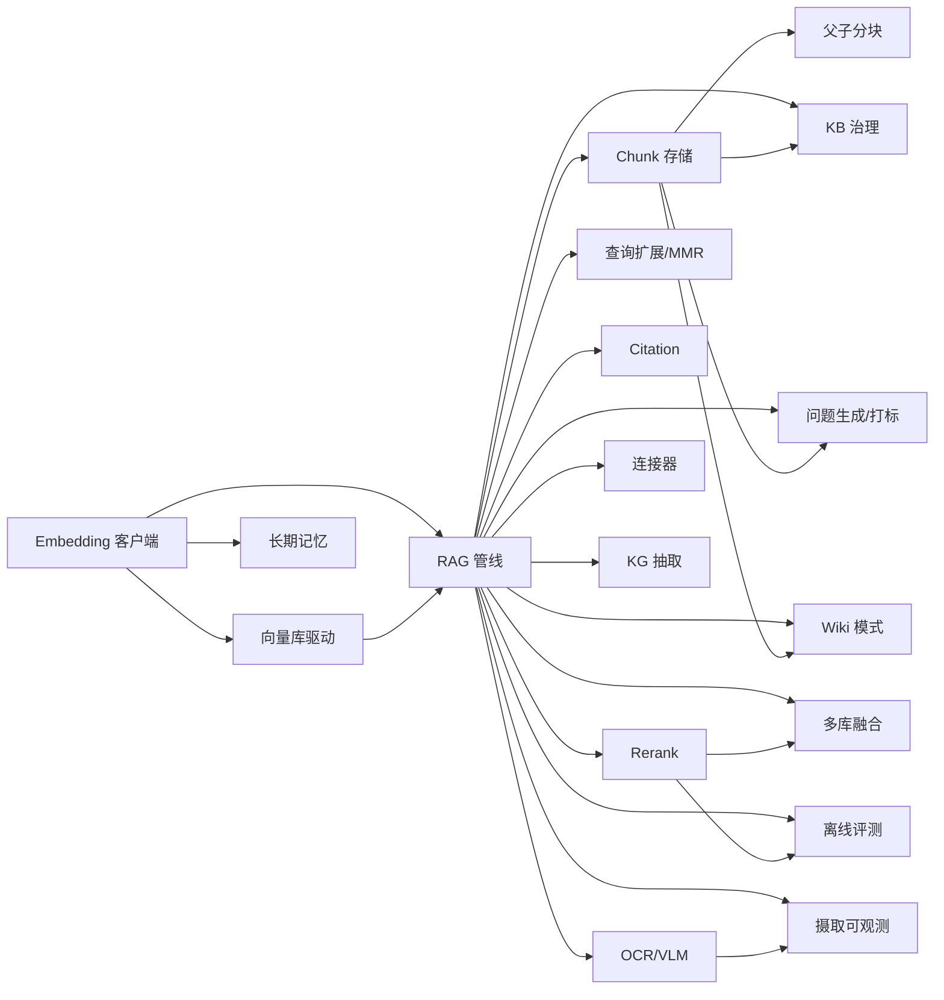

# Knowledge & RAG Roadmap — WeKnora 对标缺口

> 最后更新：2026-09-23
> 来源：`~/ai/WeKnora`（Tencent/WeKnora v0.8.0）× `nop-entropy` 模块盘点对比
> 关联：`ontology-semantic-roadmap.md`（OSSIE 对标，姊妹路线图）
> 位置：本文件按仓库 roadmap 惯例存放于 `ai-dev/backlog/`；格式遵循 AGE 模板（attractor-guided-engineering-template）nop-app-erp docs/backlog/00-roadmap-authoring-guide.md（跨仓）（跨仓模板参考）。
> 独立草案审查：见文末 Draft Review Record

## 1. 目的

补齐 Nop 平台相对 WeKnora 的**知识库/RAG 产品化**缺口。平台已有 Agent/LLM/搜索/解析文本层骨架，本路线图只覆盖**缺失的生产链路与治理面**，不重建已覆盖能力。

**范围外（明确不做）**：

- SQL/表达式方言 — 完全交给 EQL `dialect.xml` 机制（见姊妹路线图范围外说明）
- Chrome 扩展/小程序/Go SDK 等外围客户端 — 归产品后续，不进本路线图工作项
- RDF/OWL/SPARQL 运行时栈 — 平台已多次裁决拒绝

## 2. Work Item Status

> 状态在工作项上；Milestone 仅为分组。此块是 AI 工作队列唯一入口：按里程碑顺序取第一个 `todo`。

**汇总**：todo 18 · ready 0 · done 0

### M1 — RAG 生产基座

| Work Item | Status | Depends |
|-----------|--------|---------|
| K1 Embedding API 客户端 | todo | — |
| K2 向量库后端驱动 | todo | K1 |
| K3 RAG 摄取-检索管线 | todo | K1, K2 |
| K4 Chunk 存储+编辑+版本回滚 | todo | K3 |

### M2 — 检索质量

| Work Item | Status | Depends |
|-----------|--------|---------|
| K5 Rerank 模型接入 | todo | K3 |
| K6 查询扩展 + MMR 去重 | todo | K3 |
| K7 父子分块 | todo | K4 |
| K8 多知识库扇出与分数融合 | todo | K3, K5 |
| K9 引用/Citation 回写 | todo | K3 |

### M3 — 摄取增强

| Work Item | Status | Depends |
|-----------|--------|---------|
| K10 OCR / VLM 图注适配器 | todo | K3 |
| K11 摄取管线 per-stage 可观测 | todo | K3, K10 |
| K12 多源连接器 SPI + RSS/URL 抓取 | todo | K3 |
| K13 KB 治理（文件夹/标签/配额/活动流/解析状态机） | todo | K3, K4 |

### M4 — 知识增强产物与记忆

| Work Item | Status | Depends |
|-----------|--------|---------|
| K14 问题生成 + 自动打标 | todo | K3, K4 |
| K15 实体/关系抽取 → 知识图谱存储 | todo | K3 |
| K16 跨会话长期记忆 | todo | K1 |
| K17 Wiki 模式 | todo | K3, K4（K15 可选增强，非硬依赖） |

### M5 — 评测

| Work Item | Status | Depends |
|-----------|--------|---------|
| K18 RAG 离线评测 | todo | K3, K5 |

## 3. 框架/平台复用

以下能力已存在，工作项**不得重建**：

| 能力 | 提供方式 |
|------|----------|
| LLM 调用/网关/failover | `nop-ai-core`、`nop-ai-gateway`（`ILlmDialect`、账号链切换） |
| ReAct Agent / 工具 / MCP / Prompt 版本 | `nop-ai-agent`、`nop-ai-toolkit`、`nop-ai-mcp-server`、`prompt.xdef` |
| 全文 BM25 + 向量 kNN + RRF 混合检索 | `nop-search`（`SearchType.TEXT/VECTOR/HYBRID`、`LuceneSearchEngine`） |
| 文本层文档解析 | `nop-converter`、`nop-ooxml`（Docx/Pptx→MD）、`nop-pdf`（layout-aware）、`nop-markdown` |
| 文本切分原语 | `IAiTextSplitter`、`SimpleTextSplitter`、`MarkdownTextSplitter`、`TokenCountHelper` |
| Embedding/向量 SPI | `IEmbeddingModel`、`IVectorStore`、`ITextEmbedding`（**仅接口，无生产实现**） |
| 向量内存放大 | agent 层 `InMemoryEmbeddingAdapter`/`InMemoryVectorAdapter`（线性扫 cosine，仅开发用） |
| 知识条目实体骨架 | `NopAiKnowledge` + `NopAiKnowledgeBizModel`（裸 CRUD） |
| 文件存储/配额基础 | `nop-file`、`nop-integration-file-*`、hash 去重 |
| 异步任务/调度 | `nop-job`、`nop-batch`、`nop-sys` outbox |
| 多租户/RBAC/审计 | `nop-auth`、`nop-biz-auth-core` |
| 可观测 | micrometer、Langfuse OTLP 通路（网关已有 trace 出口） |
| 知识库关键词检索（ERP 已有薄实现） | CS 域 `searchKnowledge`/`suggestForTicket`（LIKE，非 RAG） |

## 4. 当前基线

| 区域 | 已有 | 主要缺口 |
|------|------|----------|
| RAG 管线 | SPI + 占位模块 `nop-ai-rag`（**0 Java 源文件**） | ingest→chunk→embed→index→retrieve→synthesize 全链路为零 |
| Embedding/向量库 | SPI + Lucene kNN（需外部预计算向量） | 无 embedding API 客户端；无 pgvector/Milvus/Qdrant/ES 集成 |
| 多模态摄取 | 无 | **零 OCR**；无 VLM 图注；扫描件不可用 |
| Chunk 治理 | 仅 splitter 纯函数 | 无 chunk 存储/编辑/版本回滚；无父子分块 |
| KB 治理 | `NopAiKnowledge` 裸 CRUD | 无文件夹树/标签/存储配额/活动审计/解析状态机 |
| 检索增强 | `nop-search` 侧 RRF 已有 | AI 层无 rerank/查询扩展/MMR/多库扇出融合 |
| 引用与评测 | 无 | 无 citation 回写；无 P/R/NDCG 离线评测 |
| 知识增强产物 | 无 | 无问题生成/自动打标/KG 抽取/Wiki 模式 |
| 长期记忆 | adapter 三件套 NoOp/in-memory | 无类型化记忆持久化/确认流/召回注入 |
| 多源连接器 | 飞书（`nop-integration`） | 无 Notion/语雀/GitLab/RSS/URL 抓取连接器 SPI |
| 摄取可观测 | 无 | 无 per-stage 解析 span 时间线 |

## 5. Milestones

### Milestone M1 — RAG 生产基座

> 其余里程碑的**经 K3 索引/检索链依赖 M1**：K5/K6/K8/K9/K10/K11/K12/K13/K14/K15/K17/K18 均直接依赖 K3，故 M1 未完成前这些项不可启动。K7 虽不直连 K3，但依赖 K4（∈M1），同样受 M1 门禁约束。K16 仅依赖 K1，可与 M1 并行启动其存储侧。

| Work Item | Status | Owner Doc | Dependencies | Platform Reuse | 落点 |
|-----------|--------|-----------|--------------|----------------|------|
| K1: Embedding API 客户端 | todo | ai-dev/design/nop-ai/embedding.md（**NEW**） | — | `IEmbeddingModel` SPI、`nop-ai-core` provider/failover/rate-limit 范式 | **平台** nop-entropy `nop-ai-core` |
| K2: 向量库后端驱动（首选 pgvector，备选 Milvus） | todo | ai-dev/design/nop-ai/vector-store.md（**NEW**） | K1 | `IVectorStore` SPI、`nop-nosql`/JDBC 连接池、`nop-db-migration` | **平台** nop-entropy 新子模块或 `nop-ai-rag` |
| K3: RAG 摄取-检索管线落地 | todo | ai-dev/design/nop-ai/rag-pipeline.md（**NEW**） | K1, K2 | `nop-ai-rag` 占位模块、`IAiTextSplitter`、`nop-search` HYBRID、`NopAiKnowledge` | **平台** nop-entropy `nop-ai-rag` |
| K4: Chunk 存储 + 编辑 + 版本回滚 | todo | ai-dev/design/nop-ai/knowledge-chunks.md（**NEW**） | K3 | `nop-db-migration`、乐观锁、`nop-job` 重建索引 | **平台** ORM 新实体（chunk/chunk_revision） |

### Milestone M2 — 检索质量

| Work Item | Status | Owner Doc | Dependencies | Platform Reuse | 落点 |
|-----------|--------|-----------|--------------|----------------|------|
| K5: Rerank 模型接入 | todo | ai-dev/design/nop-ai/rag-retrieval.md（**NEW**） | K3 | `ILlmDialect` 同构 provider 模式、K1 客户端骨架 | **平台** |
| K6: 查询扩展 + MMR 去重 | todo | ai-dev/design/nop-ai/rag-retrieval.md（**EXPAND**，K5 已建时） | K3 | 纯算法，无外部依赖 | **平台** |
| K7: 父子分块（parent/child） | todo | ai-dev/design/nop-ai/knowledge-chunks.md（**EXPAND**，K4 已建时） | K4 | splitter 组合 | **平台** |
| K8: 多知识库扇出与分数融合 | todo | ai-dev/design/nop-ai/rag-pipeline.md（**EXPAND**） | K3, K5 | `nop-search` RRF 可下沉复用 | **平台** |
| K9: 引用/Citation 回写 | todo | ai-dev/design/nop-ai/rag-citations.md（**NEW**） | K3 | `nop-file` 资源句柄、GraphQL 投影 | **平台** SPI + **应用**接线 |

### Milestone M3 — 摄取增强

| Work Item | Status | Owner Doc | Dependencies | Platform Reuse | 落点 |
|-----------|--------|-----------|--------------|----------------|------|
| K10: OCR / VLM 图注适配器 | todo | ai-dev/design/nop-ai/document-multimodal.md（**NEW**） | K3 | `IChatService` VLM 调用；OCR 走外部 SPI（如 Tesseract/云 OCR） | **平台** SPI + 首个实现 |
| K11: 摄取管线 per-stage 可观测 | todo | ai-dev/design/nop-ai/document-multimodal.md（**EXPAND**，K10 已建时） | K3, K10 | Langfuse OTLP、micrometer、span 树 | **平台** |
| K12: 多源连接器 SPI + RSS/URL 抓取 | todo | ai-dev/design/nop-ai/knowledge-connectors.md（**NEW**） | K3 | `nop-job` 增量同步、`nop-network` HTTP（SSRF 防护已有）、飞书连接器范式 | **平台** SPI + 2 实现 |
| K13: KB 治理（文件夹/标签/配额/活动流/解析状态机） | todo | ai-dev/design/nop-ai/knowledge-base-admin.md（**NEW**） | K3, K4 | `NopAiKnowledge` 扩展、`nop-auth` 审计、EAV/ext 字段 | **平台** ORM + **应用**页面 |

### Milestone M4 — 知识增强产物与记忆

| Work Item | Status | Owner Doc | Dependencies | Platform Reuse | 落点 |
|-----------|--------|-----------|--------------|----------------|------|
| K14: 问题生成 + 自动打标 | todo | ai-dev/design/nop-ai/knowledge-enrichment.md（**NEW**） | K3, K4 | `IChatService`、既有标签 dict 模式 | **平台** |
| K15: 实体/关系抽取 → 知识图谱存储 | todo | ai-dev/design/nop-ai/knowledge-graph.md（**NEW**） | K3 | `nop-graph`（算法）、可选图存储后端；**不引入 Neo4j 强制依赖** | **平台** SPI |
| K16: 跨会话长期记忆（类型化 + 确认流） | todo | ai-dev/design/nop-ai/agent-memory.md（**NEW**） | K1 | agent memory adapter 换 DB 实现、`search_memory` 工具 | **平台** |
| K17: Wiki 模式（自动页面 + 修订历史） | todo | ai-dev/design/nop-ai/knowledge-wiki.md（**NEW**） | K3, K4（K15 可选增强，非硬依赖） | `nop-markdown`、修订表范式同 K4 | **平台** 延后批次 |

### Milestone M5 — 评测

| Work Item | Status | Owner Doc | Dependencies | Platform Reuse | 落点 |
|-----------|--------|-----------|--------------|----------------|------|
| K18: RAG 离线评测（P/R/NDCG/MRR） | todo | ai-dev/design/nop-ai/rag-evaluation.md（**NEW**） | K3, K5 | `nop-autotest` 回放骨架、Parquet/CSV 数据集 | **平台** API-only，UI 延后 |

## 6. Work Item Details

| Work Item | 交付范围（一句话） | ORM 变更 |
|-----------|-------------------|----------|
| K1 | OpenAI 兼容 embedding 客户端实现 `IEmbeddingModel`，接入 provider failover/限流/重试 | 否 |
| K2 | `IVectorStore` 的 pgvector（或 Milvus）实现：upsert/search/delete + 租户隔离命名空间 | 可能（向量表 migration） |
| K3 | `nop-ai-rag` 内落地 ingestion job + hybrid retrieve + synthesize 编排，暴露 `@BizQuery`/`@BizMutation` | 否（chunk 实体由后继 K4 承接；K3 先用既有 `NopAiKnowledge`/临时存储） |
| K4 | `chunk`/`chunk_revision` 实体 + 编辑乐观锁 + 变更触发重建索引 | **是** |
| K5 | rerank provider SPI + 至少一个实现（本地/API），接入 K3 候选重排步 | 否 |
| K6 | 查询改写（同义/拆分）+ MMR λ 去重，纯函数可单测 | 否 |
| K7 | 摄取时生成父子两级 chunk，检索命中 child 回传 parent 上下文 | 否（K4 结构扩展） |
| K8 | 跨 KB 并发检索 + RRF/加权融合，共享 KB 去重 | 否 |
| K9 | 答案 span → chunk → 原文位置引用链，GraphQL/流式事件回传 | 否 |
| K10 | OCR SPI + 1 实现；图片走 VLM 产 `image_ocr`/`image_caption` 类 chunk | 可能（chunk type 字典） |
| K11 | 摄取各阶段 span（parse/chunk/embed/index）落库 + 查询 API | **是**（span 表或复用日志表） |
| K12 | `IKnowledgeConnector` SPI + RSS + URL 抓取两实现 + `nop-job` 增量同步 | **是**（连接器/同步游标实体） |
| K13 | **单一「KB 管理面」交付**（内聚理由：文件夹/标签/配额/活动流/解析状态机共同构成 `NopAiKnowledge` 管理 API + AMIS 管理页，共享同一实体扩展与同一 owner doc，拆开会产生重复 ORM 迁移与页面接线）：文件夹树、多对多标签、租户存储配额、KB 活动流、parse 状态机（含重解析/取消） | **是**（`NopAiKnowledge` 扩展 + 关联表） |
| K14 | 每 chunk 生成问答对（可编辑）+ 从既有标签集自动打标（不新建标签） | **是**（问答对/标签关联） |
| K15 | LLM 抽取实体/关系写入图存储，提供邻接查询工具给 Agent | **是**（或独立图 schema） |
| K16 | 类型化记忆（profile/preference/fact/task）DB 持久化 + 待确认队列 + 注入/召回策略 | **是**（记忆实体） |
| K17 | 摄取/问答触发 wiki 页生成，页修订历史 + diff + 回滚 | **是**（wiki_page/revision） |
| K18 | 离线评测集加载 + 指标计算 + 报告输出（API-only） | 否 |

## 7. Dependencies

## 8. 横切关注点

- **租户隔离**：向量命名空间、chunk、记忆、评测集全部带 tenant 维度；K2 设计时一次性定契约，后续工作项不得绕过。
- **保护区域**：
  - 新增/修改 `*.orm.xml`/`*.api.xml` → `auto + dual-agent-approval`（双独立子 agent 分别批准，非已废止的 ask-first 人工确认路径）。
  - **落应用仓（nop-app-erp）的接线工作项触发「外部仓库代码」保护区域**（nop-app-erp docs/context/ai-autonomy-policy.md（跨仓）：跨仓 plan + 两个独立子 agent 批准）；与 ORM 变更叠加时两者均须满足。本仓保护区域按本仓 `ai-dev` 约定执行。
  - 生成物不手写。
- **落点分层**：本路线图住在 `nop-entropy`；绝大多数工作项直接落本仓。少数「应用」接线点（K9/K13 页面与 GraphQL 接线）在 nop-app-erp，实施计划须写双仓验证命令。
- **与 ERP CS 知识库关系**：CS 域 `searchKnowledge` 保持 LIKE 薄实现不动，K3 落地后是否切换由应用层另开工作项裁决（不在本路线图自动改行为）。
- **状态纪律**：`todo → ready` 须独立草案审查；`ready → done` 须独立结束审计。里程碑无状态。

## 9. 规则

1. 本路线图是编排层，不是实施规格；每工作项实施前须单独 plan + plan-audit。
2. 不重建 §3 已列平台能力；发现可复用点在结束审计时回写 §3。
3. AI 不得自行增删/重排工作项；结构变更标记供人工审查。
4. 方言问题一律路由到 EQL `dialect.xml`，不得在本路线图工作项内发明并行方言层。

## Draft Review Record

| Round | Reviewer | Verdict | Summary |
|-------|----------|---------|---------|
| R1 | 独立子 agent `ses_f337528c9ffeGQiCsGJ70TxPB4`（fresh） | needs revision | 2 Blocker（幽灵 EXPAND 路径 K5；与 R1 ontology 交叉项见姊妹文）+ Major（§2 未按里程碑分组、mermaid 缺 K5→K8、M1 门禁措辞、保护区域未含外部仓、K13 内聚说明）+ Minor/Nit；裁定计数/方言排除/边界本身成立 |
| R2 | 独立子 agent `ses_f33605c79ffeSpizwg4HrhWWgU`（fresh） | passes draft review | 全部 16 项 R1 Blocker/Major 修复复核通过；0 Blocker + 0 Major + 8 Minor + 1 Nit（K11/O11/O12 EXPAND-before-NEW 依赖、M1 门禁补 K7、README O5/外部仓枚举、O9 §2 标签、K3 前向引用、K6 EXPAND）——Minor/Nit 已同批回写，不阻塞 per-plan |
