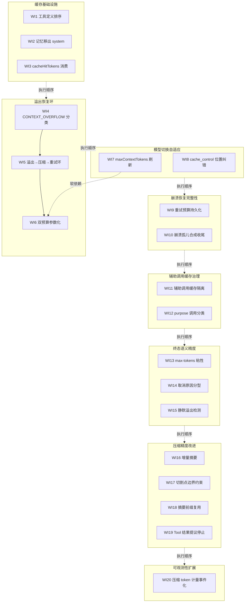

# nop-ai-agent 自主执行能力改进 Roadmap

> Last updated: 2026-09-16
> Sources: `ai-dev/analysis/compare-agent-design/99-overall-comparison.md`（总报告）；D1/D4/D6/D8 维度报告的⑥节建议；用户确认 nop-ai-agent 面向无交互自主执行设计
> 位置：`ai-dev/backlog/`
> 书写约定：Deliverable 路径不加反引号；已存在的 owner / 参考文档路径用反引号

## Purpose

本 roadmap 编排 nop-ai-agent 的**自主执行能力改进**，基于三方对比报告（nop-ai-agent vs deepseek-harness vs pi）的可吸收增量建议，聚焦 agent loop 设计、容错设计、前缀缓存利用和上下文压缩四个维度。

**定位约束**：nop-ai-agent 面向无交互自主执行设计，不考虑流式交互、UI 桥接、steering 持久化等交互场景改进。

**改进来源**：`ai-dev/analysis/compare-agent-design/` 目录下的 20 份维度报告 + 99 总报告，特别是 D1/D4/D6/D8 维度的⑥节建议。

**终态**：20 项改进全部落地，每项通过独立 closure audit，owner docs 同步更新，回归测试全绿。

## Work Item Status

> 唯一动态状态块。勾选 = 独立 closure audit 通过（见 Cross-Cutting 完成判定）。WI 编号全文件递增；顺序即执行顺序，AI 不重排。

### M0 — 缓存基础设施（P0，改造成本最低收益直接）

> 来源：`99-overall-comparison.md` ⑤-A 节 + `dsh-D6-prefix-cache.md` ⑥ + `pi-D6-prefix-cache.md` ⑥
> 理由：缓存解析资产已就位，只差消费层；前缀不稳定源是缓存失效的根因

- [ ] WI1 工具定义显式排序：将 `Set<String>` 改为有序集合（TreeSet 或显式排序），确保跨 JVM 工具定义顺序稳定，消除前缀漂移根因之一（Deliverable: 代码变更 + 测试；deps: 无；Owner: `ai-dev/design/nop-ai-agent/nop-ai-agent-context-compaction-economics.md`；来源: `dsh-D6-prefix-cache.md` ⑥-建议1a + `pi-D6-prefix-cache.md` ⑥-建议4；**文档同步**：更新 `nop-ai-agent-context-compaction-economics.md` §2.1 现状描述 + 新增 §3.x 工具排序机制）
- [ ] WI2 记忆移出 system 区域：将记忆注入从第二个 `ChatSystemMessage` 改为 user 快照消息，消除用户可变内容导致的跨轮前缀漂移（Deliverable: 代码变更 + 测试；deps: 无；Owner: `ai-dev/design/nop-ai-agent/nop-ai-agent-context-compaction-economics.md`；来源: `dsh-D6-prefix-cache.md` ⑥-建议1b；**文档同步**：更新 `nop-ai-agent-context-compaction-economics.md` §3.1 摘要调用前缀结构）
- [ ] WI3 cacheHitTokens 消费：通过 `IUsageRecorder` 和事件 payload 暴露缓存命中统计，将解析层资产转化为可观测指标（Deliverable: 代码变更 + 测试；deps: 无；Owner: `ai-dev/design/nop-ai-agent/nop-ai-agent-context-compaction-economics.md`；来源: `dsh-D6-prefix-cache.md` ⑥-建议2 + `pi-D6-prefix-cache.md` ⑥-建议3；**文档同步**：更新 `nop-ai-agent-usage-and-billing.md` 消费路径 + `nop-ai-agent-context-compaction-economics.md` 新增 §3.4 计价扩展章节）

### M1 — 溢出恢复环（P0，核心可靠性缺口）

> 来源：`99-overall-comparison.md` ⑤-B 节 + `dsh-D8-context-compaction.md` ⑥ + `pi-D8-context-compaction.md` ⑥
> 理由：当前溢出=硬停+执行进度丢失，是自主长任务可靠性的关键缺口

- [ ] WI4 CONTEXT_OVERFLOW 独立分类：`LlmErrorClassifier` 新增 `CONTEXT_OVERFLOW` 分类值，绕过重试直接路由到压缩（Deliverable: 代码变更 + 测试；deps: 无；Owner: `ai-dev/design/nop-ai-agent/nop-ai-agent-reliability.md`；来源: `pi-D4-fault-tolerance.md` ⑥-建议1；**文档同步**：更新 `nop-ai-agent-reliability.md` 错误分类表 + 新增 CONTEXT_OVERFLOW 路由语义）
- [ ] WI5 溢出→压缩→重试恢复环：修改 `AgentLoopGuard` 触发逻辑，0.9 阈值触发时先执行压缩重算预算，仍超限才 `FORCED_STOP`；新增 `maxOverflowRetries` 配置（Deliverable: 代码变更 + 测试；deps: WI4；Owner: `ai-dev/design/nop-ai-agent/nop-ai-agent-react-engine.md`；来源: `dsh-D8-context-compaction.md` ⑥-建议1 + `pi-D4-fault-tolerance.md` ⑥-建议1；**文档同步**：更新 `nop-ai-agent-react-engine.md` 循环终止语义 + `nop-ai-agent-context-compaction-economics.md` 溢出恢复路径）
- [ ] WI6 双预算参数化：将固定 80% 阈值改为 `reserveTokens`（响应预留）+ `keepRecentTokens`（切割点保留）双参数，避免压缩→溢出死循环；软依赖 WI7——多模型场景下预算参数需与动态 contextWindow 对齐（Deliverable: 代码变更 + 测试；deps: WI5；软依赖: WI7；Owner: `ai-dev/design/nop-ai-agent/nop-ai-agent-context-compaction-economics.md`；来源: `pi-D8-context-compaction.md` ⑥-建议1；**文档同步**：更新 `nop-ai-agent-context-compaction-economics.md` §3.2 触发条件 + 新增双参数配置说明）

### M2 — 模型切换自适应（P1，跨维缺口）

> 来源：`dsh-D8-context-compaction.md` ⑥ + `dsh-D6-prefix-cache.md` ⑥
> 理由：D5×D8 跨维缺口，模型切换后阈值/前缀不更新

- [ ] WI7 maxContextTokens 动态刷新：`SmartModelRouter` 切换模型时同步刷新 `maxContextTokens`，与路由模型的 `contextWindow` 对齐（Deliverable: 代码变更 + 测试；deps: 无；Owner: `ai-dev/design/nop-ai-agent/nop-ai-agent-context-compaction-economics.md`；来源: `dsh-D8-context-compaction.md` ⑥-建议2；**文档同步**：更新 `nop-ai-agent-context-compaction-economics.md` §3.2 触发条件 + `nop-ai-agent-llm-layer.md` 路由刷新语义）
- [ ] WI8 Anthropic cache_control 位置纠错：修正 `AnthropicDialect.convertMessage` 中 cache_control 放置位置，从 message map 顶层改为 content block 级别（Deliverable: 代码变更 + 测试；deps: 无；Owner: `ai-dev/design/nop-ai-agent/nop-ai-agent-context-compaction-economics.md`；来源: `dsh-D6-prefix-cache.md` ⑥-建议5；**文档同步**：更新 `nop-ai-agent-context-compaction-economics.md` §3.3 缓存断点 + `nop-ai-agent-llm-layer.md` dialect 规范）

### M3 — 崩溃恢复完整性（P1）

> 来源：`dsh-D4-fault-tolerance.md` ⑥ + `99-overall-comparison.md` ⑤-E 节
> 理由：重试预算跨重启丢失、崩溃孤儿工具无合成收尾是恢复完整性的缺口

- [ ] WI9 重试预算持久化：将重试计划持久化到 checkpoint journal（新增 `RETRY_PLAN` 条目类型），进程重启后恢复重试计数（Deliverable: 代码变更 + 测试；deps: 无；Owner: `ai-dev/design/nop-ai-agent/nop-ai-agent-reliability.md`；来源: `dsh-D4-fault-tolerance.md` ⑥-建议1；**文档同步**：更新 `nop-ai-agent-reliability.md` 重试持久化语义 + `nop-ai-agent-session-and-storage.md` checkpoint 条目类型）
- [ ] WI10 崩溃孤儿工具合成收尾：为 `TOOL_EXECUTION` checkpoint 缺失结果的情况生成"结果未知，勿盲目重试"的合成响应（Deliverable: 代码变更 + 测试；deps: 无；Owner: `ai-dev/design/nop-ai-agent/nop-ai-agent-reliability.md`；来源: `dsh-D4-fault-tolerance.md` ⑥-建议2；**文档同步**：更新 `nop-ai-agent-reliability.md` 崩溃恢复路径 + `nop-ai-agent-session-and-storage.md` 发散检测）

### M4 — 辅助调用缓存治理（P1）

> 来源：`pi-D6-prefix-cache.md` ⑥ + `dsh-D6-prefix-cache.md` ⑥
> 理由：辅助调用无缓存隔离可能污染主会话缓存

- [ ] WI11 辅助调用缓存隔离：`LlmCompletionJudge` / Layer3 summary 等辅助调用默认 `retention:none` + 全新 sessionId，防止污染主缓存（Deliverable: 代码变更 + 测试；deps: 无；Owner: `ai-dev/design/nop-ai-agent/nop-ai-agent-context-compaction-economics.md`；来源: `pi-D6-prefix-cache.md` ⑥-建议2；**文档同步**：更新 `nop-ai-agent-context-compaction-economics.md` §3.3 缓存断点 + 新增辅助调用隔离策略）
- [ ] WI12 purpose 调用分类标记：为辅助调用引入 `purpose` 分类标记（compaction/judge/title），作为后续专用生成策略的基础（Deliverable: 代码变更 + 测试；deps: 无；Owner: `ai-dev/design/nop-ai-agent/nop-ai-agent-context-compaction-economics.md`；来源: `dsh-D6-prefix-cache.md` ⑥-建议4；**文档同步**：更新 `nop-ai-agent-context-compaction-economics.md` 新增 §3.4 计价扩展章节 + `nop-ai-agent-llm-layer.md` 新增调用分类小节）

### M5 — 终态语义精度（P1）

> 来源：`dsh-D1-agent-loop.md` ⑥ + `pi-D1-agent-loop.md` ⑥
> 理由：终态语义精度影响自主执行的结果判定可靠性，是正确性问题而非精度改进

- [ ] WI13 max-tokens 粘性语义：新增 max-tokens 粘性终态，一旦命中不可降级为 completed，防止截断结果被误标为完成（Deliverable: 代码变更 + 测试；deps: 无；Owner: `ai-dev/design/nop-ai-agent/nop-ai-agent-react-engine.md`；来源: `dsh-D1-agent-loop.md` ⑥-建议4；**文档同步**：更新 `nop-ai-agent-react-engine.md` 终态枚举表 + `02-execution-model.md` 循环终止语义）
- [ ] WI14 取消原因分型：`SESSION_CANCEL_REQUESTED` 增加 `cause` 字段（user/parent/system），支持差异化取消后处理（Deliverable: 代码变更 + 测试；deps: 无；Owner: `ai-dev/design/nop-ai-agent/nop-ai-agent-reliability.md`；来源: `dsh-D4-fault-tolerance.md` ⑥-建议4；**文档同步**：更新 `nop-ai-agent-reliability.md` 新增取消原因分型章节 + `02-execution-model.md` 事件类型）
- [ ] WI15 静默溢出检测：`CalibratedTokenEstimator` 增加 `usage.input > contextWindow` 检测，加速 EMA 校准收敛（Deliverable: 代码变更 + 测试；deps: 无；Owner: `ai-dev/design/nop-ai-agent/nop-ai-agent-context-compaction-economics.md`；来源: `pi-D4-fault-tolerance.md` ⑥-建议3；**文档同步**：更新 `nop-ai-agent-context-compaction-economics.md` 新增 token 估算机制章节 + `nop-ai-agent-llm-layer.md` 校准逻辑）

### M6 — 压缩精度改进（P2）

> 来源：`pi-D8-context-compaction.md` ⑥ + `dsh-D8-context-compaction.md` ⑥
> 理由：压缩精度影响上下文窗口利用率和长会话质量

- [ ] WI16 增量摘要：`Layer3FullSummaryStrategy` 改为增量模式——旧摘要 + 新增量合并，将多次压缩的累积成本从 O(n²) 降为 O(n)（Deliverable: 代码变更 + 测试；deps: 无；Owner: `ai-dev/design/nop-ai-agent/nop-ai-agent-context-compaction-economics.md`；来源: `pi-D8-context-compaction.md` ⑥-建议2；**文档同步**：更新 `nop-ai-agent-context-compaction-economics.md` §3.1 KV 前缀保持的摘要调用 + 新增增量摘要算法小节）
- [ ] WI17 Layer2 切割点边界约束：`TurnPruning` 增加合法边界约束，只允许在 user/bashExecution/branch_summary 边界切割，保证 tool-pairing 平衡（Deliverable: 代码变更 + 测试；deps: 无；Owner: `ai-dev/design/nop-ai-agent/nop-ai-agent-context-compaction-economics.md`；来源: `pi-D8-context-compaction.md` ⑥-建议3；**文档同步**：更新 `nop-ai-agent-context-compaction-economics.md` 新增 Layer2 边界约束章节）
- [ ] WI18 Layer3 摘要前缀复用：评估并实现压缩后摘要调用复用对话自身前缀（system+tools+message），保持 provider 缓存温热；方案需对齐 `dsh-D6-prefix-cache.md` ⑥-建议3 的完整前缀对齐评估（Deliverable: 代码变更 + 测试；deps: 无；Owner: `ai-dev/design/nop-ai-agent/nop-ai-agent-context-compaction-economics.md`；来源: `dsh-D8-context-compaction.md` ⑥-建议3 + `dsh-D6-prefix-cache.md` ⑥-建议3；**文档同步**：更新 `nop-ai-agent-context-compaction-economics.md` §3.1 KV 前缀保持的摘要调用 + 新增前缀复用评估小节）
- [ ] WI19 Tool 结果可提议停止：工具结果可通过 `shouldStopAfterTurn` 提议停止，批次共识生效（Deliverable: 代码变更 + 测试；deps: 无；Owner: `ai-dev/design/nop-ai-agent/nop-ai-agent-react-engine.md`；来源: `pi-D1-agent-loop.md` ⑥-建议3；**文档同步**：更新 `nop-ai-agent-react-engine.md` 循环终止语义 + `03-extension-matrix.md` 扩展点）

### M7 — 可观测性扩展（P2）

> 来源：`dsh-D8-context-compaction.md` ⑥ + `99-overall-comparison.md` ⑤-B 节
> 理由：可观测性是压缩精度改进验证的基础，P2 优先级

- [ ] WI20 压缩 token 计量事件化：将压缩前后 token 计量扩展为完整的事件化记录——包括被遮蔽段的逐段计价、压缩前后的 token 差异明细、shadow-price 协议对位，支持压缩成本审计和 M6 压缩精度验证（Deliverable: 代码变更 + 测试；deps: 无；Owner: `ai-dev/design/nop-ai-agent/nop-ai-agent-context-compaction-economics.md`；来源: `dsh-D8-context-compaction.md` ⑥-建议3；**文档同步**：更新 `nop-ai-agent-context-compaction-economics.md` 新增 §3.4 计价扩展章节 + `nop-ai-agent-usage-and-billing.md` 事件结构）

## Dependency Graph

## Framework / Platform Reuse

| Capability | Provider | Notes |
| --- | --- | --- |
| 对比报告总表 | `ai-dev/analysis/compare-agent-design/99-overall-comparison.md` | 20 裁定 + 可吸收增量建议汇总 |
| D1 agent loop 对比 | `ai-dev/analysis/compare-agent-design/dsh-D1-agent-loop.md`、`pi-D1-agent-loop.md` | 流式/steering/终止语义对比 |
| D4 容错对比 | `ai-dev/analysis/compare-agent-design/dsh-D4-fault-tolerance.md`、`pi-D4-fault-tolerance.md` | 重试/分类/崩溃恢复对比 |
| D6 缓存对比 | `ai-dev/analysis/compare-agent-design/dsh-D6-prefix-cache.md`、`pi-D6-prefix-cache.md` | 前缀稳定性/断点/观测对比 |
| D8 压缩对比 | `ai-dev/analysis/compare-agent-design/dsh-D8-context-compaction.md`、`pi-D8-context-compaction.md` | 阈值/策略/溢出恢复对比 |
| nop 侧设计基线 | `ai-dev/design/nop-ai-agent/`（54 篇） | Owner doc，仍须与代码核对 |
| 分析写作规范 | `ai-dev/analysis/00-analysis-writing-guide.md` | 所有报告写作前必读 |

## Current Baseline

- **nop-ai-agent 定位**：无交互自主执行设计，不考虑流式交互、UI 桥接、steering 持久化
- **改进来源**：三方对比报告（nop vs dsh vs pi）的 D1/D4/D6/D8 维度⑥节建议，共 20 项独立改进
- **nop 领先域**（不需改进）：D5 自动切换（唯一内置多通道故障转移）、D7 工具系统（修复链+安全纵深）、D10 多代理（编排全栈）
- **nop 落后域**（本 roadmap 聚焦）：D1 agent loop（溢出处理）、D4 容错（崩溃恢复）、D6 缓存（前缀稳定+观测）、D8 压缩（阈值+策略）
- **既有 owner docs**：`ai-dev/design/nop-ai-agent/` 下 54 篇，其中 `nop-ai-agent-context-compaction-economics.md`、`nop-ai-agent-reliability.md`、`nop-ai-agent-react-engine.md` 是本 roadmap 的主要 owner

## Cross-Cutting

- **证据纪律**：每条结论必须带代码锚点（仓库相对路径 + 类/函数名，必要时 `:line`）；对比报告的建议必须引用对应维度报告的⑥节
- **closure audit**：每个工作项完成后由独立子代理审计，确认代码变更+测试+owner doc 更新全部到位
- **owner doc 更新**：每个 milestone 完成后同步更新 `ai-dev/design/nop-ai-agent/` 下的对应 owner doc
- **验证面**：每项改进需 `./mvnw test -pl nop-ai/nop-ai-agent -am` 通过 + 新增回归测试覆盖
- **报告语言**：中文行文，类名/函数名/术语保留英文原名

## Rules

- 状态只在本文件 `## Work Item Status` 的 checkbox 通道维护
- WI 编号全文件唯一递增；执行顺序 = 文档顺序；AI 不重排优先级、不发明工作项
- 本文件不写实现代码；实现方案放 `ai-dev/design/`，代码放源码
- 每个 execution item 必须能归类为 `Fix`、`Decision`、`Proof`、或 `Follow-up`
- `completed` 必须来自单独的 closure audit，不要在完成最后一个编码 slice 的同时顺手宣布 plan 关闭
