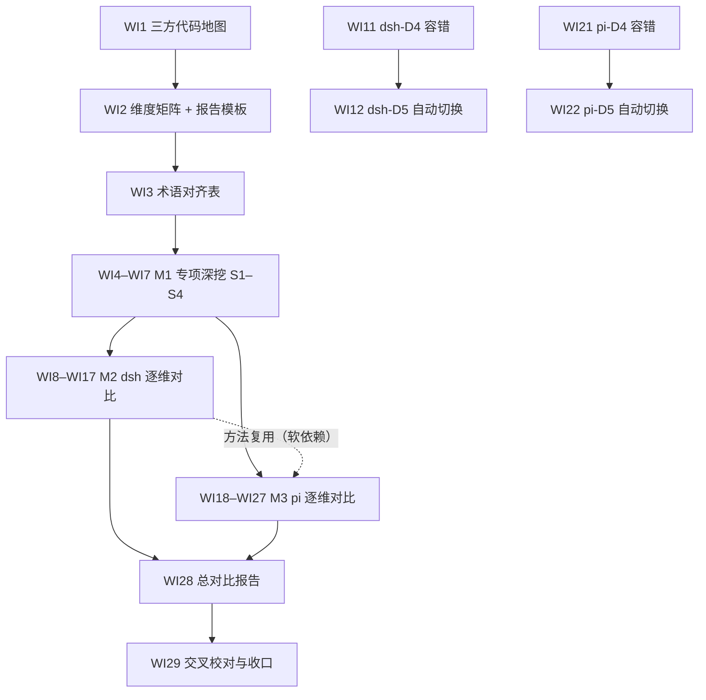

# nop-ai-agent 内在设计对比 Roadmap — deepseek-harness 与 pi

> Last updated: 2026-09-14
> Sources: 2026-09-12 三方代码实地探查（本 roadmap 全部代码锚点来自该次探查，执行时须按各仓库当前 HEAD 复核）；既有调研见 Framework / Platform Reuse
> 位置：本文件按仓库 roadmap 惯例存放于 `ai-dev/backlog/`；全部对比报告（Deliverable）产出至 ai-dev/analysis/compare-agent-design/（用户指定目录）。格式遵循 AGE 模板（attractor-guided-engineering-template）的 docs/backlog/00-roadmap-authoring-guide.md（frontmatter + checkbox 通道）。
> 书写约定：Deliverable 是尚未产出的未来报告，其路径一律用普通文本书写、**不加反引号**——check-doc-links 会把反引号路径当作必须已存在的仓库内链接校验；已存在的 owner / 参考文档路径保持反引号，持续受 checker 保护。

## Purpose

本 roadmap 编排一项**纯分析任务**：以 nop-ai-agent 为基准，逐项核对其与 `~/ai/deepseek-harness`（Part A）以及 `~/ai/pi`（Part B）在 agent 内在设计上的异同。终态：ai-dev/analysis/compare-agent-design/ 目录下三份基线产物 + 4 份专项深挖文档 + 20 份逐维对比报告 + 1 份总报告全部存在、代码锚点可复核、通过交叉一致性校对。

对比维度 D1–D10（权威定义与子机制拆解由 WI2 维度矩阵落定）：

- D1 内部 agent loop：主循环形态（turn/step/iteration 分层）、终止条件、迭代上限与延长、流式输出、输入注入/steering
- D2 扩展点：hook/中间件/waterfall/拦截器的类型与触发阶段、注册方式（声明式 DSL vs 代码）、veto/改写语义
- D3 事件类型与触发方式：事件词表与分类、发射点、订阅模型（emit/serial/waterfall、同步/异步）、持久化事件 vs 瞬时事件、UI 桥接
- D4 容错性：错误分类体系、重试策略与退避、部分失败与中断语义、abort/cancel、降级与恢复路径
- D5 自动切换：provider/model/账号故障转移、熔断与冷却、配额感知、模型分级路由、切换语义与 fail-loud
- D6 前缀缓存利用：缓存断点控制、前缀稳定性构造、压缩与缓存的交互、一次性调用是否写缓存、缓存命中观测
- D7 工具系统：声明与 schema、执行调度（并行/串行/屏障）、结果回填、工具调用修复、权限/沙箱
- D8 上下文工程与压缩：token 预算与压力检测、触发条件、策略分层、spill/引用式保真、产物形态（破坏性 vs 追加式）
- D9 会话持久化与恢复：session 数据模型、存储格式与后端、resume/fork/branch、checkpoint 与崩溃恢复
- D10 多代理与子代理：派生模型、深度预算、团队/编排、与主循环的隔离边界

专项深挖主题（M1，用户指定的四个机制级专题，三方覆盖，权威深挖）：

- S1 agent loop 具体执行流程：从输入进入到最终响应的逐步调用链，每阶段做什么、扩展点挂载在流程哪个位置
- S2 扩展点全量清单与能力语义：逐点标注触发时机、可以扩展什么、能力级别（仅监听 observe / 修改内容 transform / 否决跳过 veto / 中断轮次 abort-bail / 注入内容 inject）、同步异步与错误传播
- S3 同一扩展点上多个触发的顺序：排序来源（注册序/优先级/声明序）、分发语义（waterfall/serial/emit/链式）、顺序是否可预测可配置
- S4 不同扩展机制之间的协同：同一行为穿过多种扩展机制时的叠加顺序、冲突裁决、veto/中断的传播边界

范围边界（Non-Goals）：**只比较 agent 内在设计**。明确排除——插件动态更新/热重载（dsh 的 `cordis-host-runner`/`tool-cordis`/client HMR；pi 的 `/reload`、extension cache 失效、`pi install/update`）；UI/TUI 与 RPC 协议层；产品形态与部署；评测基准。总报告只产出对比结论与可吸收增量**建议**，不排实施计划（实施另开 roadmap/plan）。

## Work Item Status

> 唯一动态状态块。勾选 = 独立 closure audit 通过（见 Cross-Cutting 完成判定）。WI 编号全文件递增；顺序即执行顺序，AI 不重排。

### M0 — 对比基线

- [x] WI1 三方代码地图：nop-ai-agent / deepseek-harness / pi 的包结构、关键类与 load-bearing 文件清单，记录各仓库 HEAD commit（Deliverable: ai-dev/analysis/compare-agent-design/01-code-map.md; deps: 无; Owner: `ai-dev/design/nop-ai-agent/01-architecture-baseline.md`）
- [x] WI2 对比维度矩阵 D1–D10：每维度的子机制拆解、三方代码锚点、报告 6 节模板与裁定格式（Deliverable: ai-dev/analysis/compare-agent-design/00-dimension-matrix.md; deps: WI1; 参考: `ai-dev/analysis/00-analysis-writing-guide.md`）
- [x] WI3 术语与概念对齐表：loop/turn/step/iteration、hook/middleware/waterfall、持久化事件 vs 瞬时事件、session/compaction/checkpoint/spill 等三方概念映射（Deliverable: ai-dev/analysis/compare-agent-design/02-terminology-map.md; deps: WI2）

### M1 — 专项深挖：执行流程与扩展机制（S1–S4，三方覆盖）

- [x] WI4 S1 agent loop 具体执行流程逐步分解：三方各产出一条从输入进入到最终响应的完整调用链（阶段划分、每步职责、流式路径），流程图上逐点标注该阶段挂载的扩展点（Deliverable: ai-dev/analysis/compare-agent-design/03-flow-agent-loop.md; deps: WI3; nop 锚点: ReActAgentExecutor/LlmCallCoordinator/AgentToolDispatcher）
- [x] WI5 S2 扩展点全量清单与能力语义：三方每个扩展点一行——触发时机、可扩展/可影响的内容、能力级别（observe/transform/veto/abort-bail/inject 分级，能力级别以代码实际行为为准，不以注释或文档为准）、同步异步、异常如何传播（Deliverable: ai-dev/analysis/compare-agent-design/04-extension-capability-matrix.md; deps: WI4）
- [x] WI6 S3 同点多触发顺序：三方每个扩展点上多个实现共存的排序来源（注册顺序/优先级字段/DSL 声明顺序/订阅顺序）、该点的分发语义（waterfall 逐层包裹 / serial 顺序 await / emit 广播）、顺序对调用方的可预测性与可配置性（Deliverable: ai-dev/analysis/compare-agent-design/05-extension-ordering.md; deps: WI5）
- [x] WI7 S4 跨扩展协同：同一行为穿过多种扩展机制时的组合语义——nop 的 lifecycle hook × execution middleware × filter chain × DSL 声明扩展，dsh 的 agent waterfall × tools waterfall × llm/stream × system-prompt，pi 的 AgentLoopConfig hook × ExtensionAPI event × registerProvider——叠加顺序、冲突裁决、veto/bail 的传播边界与终止范围（Deliverable: ai-dev/analysis/compare-agent-design/06-extension-composition.md; deps: WI5, WI6）

### M2 — deepseek-harness 逐维对比（Part A；范围排除其插件动态更新机制）

- [x] WI8 D1 内部 agent loop：ReActAgentExecutor/AgentLoopGuard 迭代模型（maxIterations/ISustainer）vs ReactLoopAgent turn/step 模型（TurnEndReason、无固定步数上限、Inbox followup/steer/inject、chunk 持久化）；流程级细节引用 03 专项文档，只写对比增量（Deliverable: ai-dev/analysis/compare-agent-design/dsh-D1-agent-loop.md; deps: WI3, WI4; Owner: `ai-dev/design/nop-ai-agent/nop-ai-agent-react-engine.md`）
- [x] WI9 D2 扩展点：12 个 AgentLifecyclePoint + 4 个 ExecutionPoint + filter chain + 66 接口扩展矩阵 vs `agent/pre-step`·`agent/request`·`agent/request-error`·`agent/turn-stopping` waterfall + `tools/*` waterfall + `llm/stream` + capability seams；能力级别与顺序语义引用 04/05/06 专项文档，只写对比增量（Deliverable: ai-dev/analysis/compare-agent-design/dsh-D2-extension-points.md; deps: WI3, WI5; Owner: `ai-dev/design/nop-ai-agent/03-extension-matrix.md`）
- [x] WI10 D3 事件类型与触发方式：AgentEventType/IAgentEventPublisher + 异步消息信封（IMailbox/Topics）vs 48 类持久化 SessionEvent + Cordis emit/serial/waterfall 瞬时事件 + UI 桥接（Deliverable: ai-dev/analysis/compare-agent-design/dsh-D3-events.md; deps: WI3; Owner: `ai-dev/design/nop-ai-agent/02-execution-model.md`）
- [x] WI11 D4 容错性：ErrorClassification/IRetryPolicy/三级失败升级/IDenialLedger vs HarnessError 稳定错误码 + `agent/request-error` 重试 waterfall + 持久化 `llm/retry` 事件 + 工具中止合成结果（Deliverable: ai-dev/analysis/compare-agent-design/dsh-D4-fault-tolerance.md; deps: WI3; Owner: `ai-dev/design/nop-ai-agent/nop-ai-agent-reliability.md`）
- [x] WI12 D5 自动切换：LlmCallCoordinator 多通道（重试→熔断→账号链→ProviderFailoverChain→模型分级路由）vs dsh 无内置 failover——`agent/request` 逐步重写 provider/model + per-provider 重试策略 + 配额仅分类不转移（Deliverable: ai-dev/analysis/compare-agent-design/dsh-D5-auto-failover.md; deps: WI11; Owner: `ai-dev/design/nop-ai-agent/nop-ai-agent-reliability.md`）
- [x] WI13 D6 前缀缓存利用：dsh 构造性前缀稳定（section 化静态 system prompt、动态上下文走 user 快照消息、压缩请求字节级重放复用 KV cache、`purpose` 标记辅助调用）vs nop 侧现状逐项核查（显式缓存断点/前缀稳定性约定是否存在）（Deliverable: ai-dev/analysis/compare-agent-design/dsh-D6-prefix-cache.md; deps: WI3; Owner: `ai-dev/design/nop-ai-agent/nop-ai-agent-context-compaction-economics.md`）
- [x] WI14 D7 工具系统：tool.xdef DSL + AgentToolDispatcher 标签过滤 + IToolCallRepairer 修复链 vs defineTool 输出 schema/render/`isConcurrencySafe` + tools/pre-execute 审批 + Landlock/Seatbelt 沙箱 + code-mode（Deliverable: ai-dev/analysis/compare-agent-design/dsh-D7-tool-system.md; deps: WI3; Owner: `ai-dev/design/nop-ai-agent/04-tool-invocation.md`）
- [x] WI15 D8 上下文工程与压缩：PipelineCompactor 分层 + short-ref 引用式 + spill store vs CompactionEngine seam（pressure/context-overflow 触发、token 预算保留、tool-pairing 平衡、spill policy）（Deliverable: ai-dev/analysis/compare-agent-design/dsh-D8-context-compaction.md; deps: WI3; Owner: `ai-dev/design/nop-ai-agent/nop-ai-agent-context-model.md`）
- [x] WI16 D9 会话持久化与恢复：ISessionStore 三实现 + ICheckpointManager 体系（幂等键/发散检测）vs 追加式类型化事件日志 + fork 边界 + JSONL(zstd)/SQLite 双后端 + write-behind（Deliverable: ai-dev/analysis/compare-agent-design/dsh-D9-session-persistence.md; deps: WI3; Owner: `ai-dev/design/nop-ai-agent/nop-ai-agent-session-and-storage.md`）
- [x] WI17 D10 多代理与子代理：team/actor/plan 全栈（FanOut/Reduction/调度守护进程/跨进程协调）vs `ctx.subagents` 6 provider + 深度预算 + 实验性 agent-team（Deliverable: ai-dev/analysis/compare-agent-design/dsh-D10-multi-agent.md; deps: WI3; Owner: `ai-dev/design/nop-ai-agent/nop-ai-agent-multi-agent.md`）

### M3 — pi 逐维对比（Part B；维度同 D1–D10）

M2 完成后执行可复用其方法与裁定口径（软依赖，不阻塞）。

- [x] WI18 D1 内部 agent loop：agentLoop() 单层循环 + stopReason 终止 + steering/follow-up 队列 + 截断消息工具调用失败语义 vs nop 迭代模型；流程级细节引用 03 专项文档（Deliverable: ai-dev/analysis/compare-agent-design/pi-D1-agent-loop.md; deps: WI3, WI4; Owner: `ai-dev/design/nop-ai-agent/nop-ai-agent-react-engine.md`）
- [x] WI19 D2 扩展点：AgentLoopConfig 配置级 hook（transformContext/beforeToolCall/afterToolCall/prepareNextTurn 等）+ ExtensionAPI 约 35 个 `pi.on` 事件 hook + registerTool/registerCommand/registerProvider vs nop 双层扩展；能力级别与顺序语义引用 04/05/06 专项文档（Deliverable: ai-dev/analysis/compare-agent-design/pi-D2-extension-points.md; deps: WI3, WI5; Owner: `ai-dev/design/nop-ai-agent/03-extension-matrix.md`）
- [x] WI20 D3 事件类型与触发方式：AgentEvent 判别联合 + 顺序 await sink + AgentSessionEvent 扩展（auto_retry_* 等）+ JSONL/TUI 桥接 vs nop 事件体系（Deliverable: ai-dev/analysis/compare-agent-design/pi-D3-events.md; deps: WI3; Owner: `ai-dev/design/nop-ai-agent/02-execution-model.md`）
- [x] WI21 D4 容错性：可重试/不可重试正则分类 + 传输层（SDK 镜像策略）与应用层（AgentSession 自动重试）双重重试 + 上下文溢出独立分类走压缩 + 错误工具结果回填 vs nop 错误规范化与重试（Deliverable: ai-dev/analysis/compare-agent-design/pi-D4-fault-tolerance.md; deps: WI3; Owner: `ai-dev/design/nop-ai-agent/nop-ai-agent-reliability.md`）
- [x] WI22 D5 自动切换：pi 明确无内置切换——用户/扩展驱动 model_select + registerProvider 热注册 + per-call getApiKey + 配额不可重试 vs nop 多通道故障转移（Deliverable: ai-dev/analysis/compare-agent-design/pi-D5-auto-failover.md; deps: WI21; Owner: `ai-dev/design/nop-ai-agent/nop-ai-agent-reliability.md`）
- [x] WI23 D6 前缀缓存利用：Anthropic cache_control 断点（system/最后工具定义/最后 user 消息）+ cacheRetention long/short/none + 工具集变化才重建 system prompt + 稳定工具序 + 一次性调用禁写缓存 + cache-stats 未命中观测 vs nop 侧现状逐项核查（Deliverable: ai-dev/analysis/compare-agent-design/pi-D6-prefix-cache.md; deps: WI3; Owner: `ai-dev/design/nop-ai-agent/nop-ai-agent-context-compaction-economics.md`）
- [x] WI24 D7 工具系统：typebox schema + 默认并行/sequential 覆盖 + deferred tools（transcript 中途引入）+ 文件变更串行队列 + 权限留白给扩展 vs nop 工具体系（Deliverable: ai-dev/analysis/compare-agent-design/pi-D7-tool-system.md; deps: WI3; Owner: `ai-dev/design/nop-ai-agent/04-tool-invocation.md`）
- [x] WI25 D8 上下文工程与压缩：threshold/overflow/manual 触发 + reserveTokens/keepRecentTokens 预算 + 追加式 CompactionEntry 非破坏重建 + branch summarization vs nop 分层压缩（Deliverable: ai-dev/analysis/compare-agent-design/pi-D8-context-compaction.md; deps: WI3; Owner: `ai-dev/design/nop-ai-agent/nop-ai-agent-context-compaction-economics.md`）
- [x] WI26 D9 会话持久化与恢复：JSONL + id/parentId 会话树 + 类型化条目与版本迁移 + labels + SQLite 后端 + 上下文重建 vs nop session/checkpoint 体系（Deliverable: ai-dev/analysis/compare-agent-design/pi-D9-session-persistence.md; deps: WI3; Owner: `ai-dev/design/nop-ai-agent/nop-ai-agent-session-and-storage.md`）
- [x] WI27 D10 多代理与子代理：pi 无内置（官方 example extension 形态）及其设计取舍 vs nop team 全栈（Deliverable: ai-dev/analysis/compare-agent-design/pi-D10-multi-agent.md; deps: WI3; Owner: `ai-dev/design/nop-ai-agent/nop-ai-agent-multi-agent.md`）

### M4 — 汇总与收口

- [x] WI28 总对比报告：汇总 20 份维度报告与 4 份专项文档，产出全维度三方对照总表、结构性差异（范式级）清单、逐维裁定汇总与可吸收增量建议（仅建议）（Deliverable: ai-dev/analysis/compare-agent-design/99-overall-comparison.md; deps: WI4..WI27 全部; 参考: `ai-dev/analysis/agent-survey/agentscope-harness-vs-nop-ai-agent-comparison.md`）
- [x] WI29 交叉一致性校对与收口：由独立子代理校对全部 28 个产物间的结论矛盾、锚点失效与模板缺失（含专项文档与 D1/D2 报告间的权威源一致性），修正后在总报告附录记录校对结论（Deliverable: ai-dev/analysis/compare-agent-design/99-overall-comparison.md 附录; deps: WI28）

### M5 — Deep Audit Findings R1

> 来源：2026-09-14 deep-audit round 1（nop-ai 全模块组 vs 架构文档交叉审核；4 个并行维度子代理 + 主 agent 复核）。全部 P0/P1 发现落此块，关闭机制 = 勾选 checkbox（由 DRAFT 管线据此起草 remediation plan，本审计不自行起草）。

- [x] [P1] plan 356 ErrorCode 化后新增 5 个错误码零测试钉子——`ERR_AGENT_INVALID_ARGUMENT`/`ERR_AGENT_INVALID_STATE`/`ERR_AGENT_INTERNAL_DETAIL`（NopAiAgentErrors）+ `ERR_AI_CORE_INVALID_*`（NopAiCoreErrors）共 628+ 处 throw 站点，agent/core 测试零 `getErrorCode()` 断言（仅断言异常类型）；错误码值/参数契约可静默漂移而测试全绿（NopAiAgentErrors.java、NopAiCoreErrors.java; 来源: deep-audit round 1）
- [x] [P1] `AiModelCredentialResolverImpl.java:64-96` 三个 ErrorCode ID 违反 `nop.err.ai.*` 点号命名约定（`ERR_AI_CREDENTIAL_*` 大写常量式，含中文描述），经跨模块公共路径被 nop-ai-core ChatServiceImpl 消费，i18n/日志/前端按 nop.err.* 解析失效；同模块 NopAiErrors 已是正确格式，属契约面命名漂移（来源: deep-audit round 1）
- [x] [P1] nop-ai-tools → nop-ai-coder 分层倒置——`FileToolBizModel.java:250-251` 直接 `new DslToolImpl(...)`（import io.nop.ai.coder.xdsl），与 module-groups.md 分层（tools 低层工具实现、coder 应用层助手）相悖；复用 DSL 工具须连带引入 coder 重量传递依赖，契约应下沉 toolkit/core 或显式登记为有意设计（来源: deep-audit round 1）
- [x] [P1] nop-ai-gateway 模块范围漂移——channel 消息网关（ChannelMessageServiceImpl/FeishuConnector/ChannelSessionStoreImpl/IChannelConnector）与扫码登录编排（ChannelLoginApiBizModel/ChannelLoginScanProcessor）为生产面，但在 nop-ai.md/nop-ai-gateway.md/module-groups.md 零文档覆盖（docs-for-ai 0 命中），模块文档仍只见"LLM failover 网关"；消费者按文档引入模块会连带 nop-ai-dao/nop-auth-api/feishu 依赖（来源: deep-audit round 1）

### M7 — Deep Audit Findings R3

> 来源：2026-09-14 deep-audit round 3（nop-ai 模块组多维度审计：API 表面/XMeta 对齐 + IoC/beans 配置 + 测试有效性 + owner docs 契约漂移 + 模块边界；5 并行子代理 + 主 agent 独立复核）。6×P1 新发现落此块；round 1/2 的 M5/M6 全部 P0/P1 + Follow-up 25×P2 复核已修复落地（含 12 例 AiFileTool 逃逸回归、租约不误删 SQL 断言、&> 单行断言、@bot 精确匹配负例等，不重复登记）。

- [ ] [P1] nop-ai-tools 与 nop-ai-toolkit 同名 VFS 路径 `ai-tools-defaults.beans.xml` 重复注册——两份 `/nop/autoconfig/{nop-ai-tools,nop-ai-toolkit}.beans` 均指向同一路径 `/nop/ai/beans/ai-tools-defaults.beans.xml`，`check-duplicate-vfs-resource`（默认 true）下两 jar 同 classpath VFS 初始化抛 `ERR_RESOURCE_DUPLICATE_VFS_RESOURCE` 启动失败，关闭检查则按 classpath jar 序非确定性静默丢一边 bean（丢 toolkit 则 agent 无 nopToolManager/nopToolExecutorProvider 工具执行全断，丢 tools 则 FileTool/SequentialThinking/GraphQL 工具集缺失）；当前无消费方组合触发属潜伏，tools/toolkit 均为工具包自然组合（来源: deep-audit round 3）
- [ ] [P1] `ai-gateway-defaults.beans.xml` 无任何自动装配入口——nop-ai-gateway 无 `/nop/autoconfig/*.beans`、beans 文件名不含 `app-*.beans.xml`、`_module` 位于 `/nop/ai/gateway/_module`（3 层，不匹配 `*/*/_module` 模块发现模式）、全仓零 `<import>`；docs-for-ai/03-modules/nop-ai-gateway.md:37/79 声称"模块自动装配"与实际运行面矛盾，12 个生产 bean（nopChannelConnectorManager/nopChannelSessionStore/nopFeishuConnector/nopChannelMessageService/ChannelLoginApiBizModel/nopChatServiceFailoverAdapter 等）静默缺失（ai-gateway-defaults.beans.xml + AppBeanContainerLoader.java:279-288; 来源: deep-audit round 3）
- [ ] [P1] react-engine.md §5.1/§5.2 steering 语义与代码不符——文档称"steering 注入后跳过剩余工具"且伪代码把 steering 检查放 before_acting 之前；实际 ReActAgentExecutor.java:1234-1242 在所有工具执行完成后的 round 边界 drain，02-execution-model.md §4 已同步 round-boundary + mid-round 为 successor，两份 owner doc 互相矛盾（来源: deep-audit round 3）
- [ ] [P1] tool-dsl.md §4 `paralllel` 拼写现状描述已为假——schema call-tools.xdef:2 已修正为 `parallel`（commit 9903d31303），文档仍称"schema 当前是 paralllel（拼写错误）+ 修正计划未执行"，示例照抄会 schema 校验失败（来源: deep-audit round 3）
- [ ] [P1] reliability.md:585 + 01-architecture-baseline.md:89 + llm-layer.md:331 三处声称引擎在 AgentExecutionContext 维护 `prefixLength`/`prefixHash` 并在压缩前后校验前缀完整性——全仓 main 代码 0 命中，文档以现状口吻描述不存在的运行时契约（来源: deep-audit round 3）
- [ ] [P1] 5 个 team 工具（team-send-message/team-status/team-task-create/team-task-update/team-execute-flow）有 IoC bean + ACL 映射但零 `.tool.xml` 定义——`AgentToolPlanResolver`（:72-81）白名单 loadTool 为 null 静默跳过、`listTools` 只枚举 VFS `.tool.xml`，LLM 标准发现路径不可达；actor-runtime-vision.md plan 225/239 声称"已落地/foundational 已交付"与运行面不符（ai-agent-tools.beans.xml:23-36 + ToolManagerImpl.java:119-137; 来源: deep-audit round 3）

### M6 — Deep Audit Findings R2

> 来源：2026-09-14 deep-audit round 2（nop-ai 全模块 open-ended adversarial review；4 并行子代理 + 主 agent 复核）。1×P0 + 5×P1 新发现落此块；round 1 的 4×P1（M5）+ 9×P2 全部复核仍存在、未修复，不重复登记。

- [x] [P0] `AiFileTool`（nop-ai-mcp-server）任意文件读写——`getResource` 用 `new File(baseDir, path)` 拼接后仅 normalize 不含校验：绝对路径（`loadNopFile("/etc/passwd")`）完全绕过 baseDir、`../` 段直接逃逸，MCP 工具权限 `AiFileTool:read/write` 恰好是授予 LLM 的工具权限，prompt-injection 暴露面下即任意主机文件读取/覆盖（AiFileTool.java:163-179; 来源: deep-audit round 2）
- [x] [P1] `ReActAgentExecutor` 失败执行仍发布 EXECUTION_COMPLETED + 跑 POST_CALL hooks——`canPublishExecutionCompleted`（:1271-1278）排除 cancelled/forced_stopped/escalated/paused/truncated/waiting 但漏 `failed`：重试耗尽/不可重试分类终止后 `finalizeLlmCallResult`（LlmCallCoordinator.java:430-434）置 failed → 循环 break → `adjudicateTerminal` 照常发布完成事件并触发副作用 hook，与 :1254-1260 注释"aborted/suspended 不得发布"契约漂移，下游消费者收到失败后的"完成"事件（ReActAgentExecutor.java:482, 1261; 来源: deep-audit round 2）
- [x] [P1] 同实例重复提交会删掉运行中执行的 takeover 租约——`DefaultAgentEngine.java:789-806`/`resumeSession:298-313`：同实例第二次提交 `tryAcquire` 走同 owner 续租成功（DbSessionTakeoverLock.java:203-224），`putIfAbsent` 失败后 catch 调 `releaseLockQuietly(sessionId, instanceId)`，其 `DELETE ... AND LOCK_OWNER=?` 删除的是**胜出执行**的租约行 → 其续租失败被强制 cancel + 第三方可趁机双执行；报错文案"locked by another instance"也错误（来源: deep-audit round 2）
- [x] [P1] `FileToolBizModel.getProjectDir` 沙箱逃逸——`StringHelper.fileName("..")` 原样返回且 `isValidFileName` 不拒 `..`，`new File(baseDir, "..")` 把整个工具沙箱上移一级（默认 /nop/projects → /nop），readFiles/saveFile/saveFiles/mergeFile/saveDslFile 全部脱沙；对侧 `AiToolsHelper.requireValidSessionId` 同类输入 fail-closed，同一抽象两套安全姿态（FileToolBizModel.java:265-271 + LocalFileOperator.java:76-88; 来源: deep-audit round 2）
- [x] [P1] Shell `&>`/`&>>` 合并重定向输出翻倍——`handleMergeRedirect` 用 `new TeeOutput(fileOutput, fileOutput)` 同一实例两次，write 逐 leg 落同一 buffer 导致每次 flush 写入双倍内容（echo stdout &> f 产出两行 stdout）；回归测试只断言 `contains("stdout")` 所以 CI 全绿（ShellCommandExecutor.java:499-506 + TeeOutput.java:33-37 + ShellCommandExecutorTest.java:239-253; 来源: deep-audit round 2）
- [x] [P1] `FeishuConnector.isBotMentioned` 群聊 @任意成员即触发 agent——仅检查 mentions 数组含 `"key"` 与 `"open_id"` 两个子串，群消息 @了**任何其他人**也通过过滤 → 未 @ bot 的群消息触发 IAgentEngine 执行与回复（成本/滥用向量，且消耗限流窗口）；类注释自认"bot open_id 精确匹配 deferred"，测试缺"@了其他用户"负例（FeishuConnector.java:586-617 + TestFeishuConnector.java:356-371; 来源: deep-audit round 2）

### M8 — Deep Audit Findings R4

> 来源：2026-09-14 deep-audit round 4（nop-ai 模块组 open-ended adversarial review；3 并行子代理 + 主 agent 逐项源码复核）。1×P1 新发现落此块；round 3 的 M7 全部 6×P1 复核仍存在未修复，不重复登记；Follow-up Backlog 追加 16×P2 + 6×P3（source: deep-audit round 4）。

- [ ] [P1] `DockerBashSandbox.classifyFailure` 把一切非零命令退出码误判为 `CONTAINER_START_FAILED`，且 `BashExecutor` 丢弃唯一输出副本——`docker run` 原样透传容器内命令退出码，普通命令失败（`ls /nonexistent` exit 2、`grep` 无命中 exit 1、`cd` 失败 exit 1 等）全部被归类为"容器启动失败"；`BashExecutor.doExecute` catch 后返回 `"Sandbox refused execution [CONTAINER_START_FAILED]"`，真实退出码与 stderr 全部丢失，agent 无法区分命令失败与基础设施失败，bash 主工具错误契约失效；`BashSandboxTest:203-204` 还把该误判固化为断言（DockerBashSandbox.java:174-198 + BashExecutor.java:123-127; 来源: deep-audit round 4）

## Follow-up Backlog

> P2 发现（trivial / 非阻塞 polish）。来源统一标注 `source: deep-audit round <n>`。

- [x] [P2] compare-agent-design 7 份报告（03/04/05/06 专项 + dsh-D9/D5 + pi-D4）约 118 处 nop 侧 `:行号` 锚点漂移——plan 355 重构后 ReActAgentExecutor 1053→1387 行、LlmCallCoordinator 765→872、AgentToolDispatcher 434→566；全部类/机制锚点仍有效、结论不受影响，仅行号需重钉（source: deep-audit round 1）（2026-09-14 收口：plan 2026-09-14-1638-1 Phase 1，7 份报告全部锚点按 HEAD `4582e780dad4` 逐条重核重钉，每份抽查 ≥5 锚点解析成立，报告头部已记重钉说明）
- [x] [P2] 03-extension-matrix.md §5.2"唯一实现 NoOpBudgetProvider"措辞不精确——test scope 存在 `InMemoryBudgetProvider implements IBudgetProvider`（src/test/.../budget/InMemoryBudgetProvider.java:37），建议补注 test-scope 实现以免绝对化表述被误读；矩阵其余 10 项事实声明（72 接口/死点/死代码/接线缺口/半闭合/存储实现）全部与 live code 一致（source: deep-audit round 1）（2026-09-14 收口：plan 2026-09-14-1638-1 Phase 3，§4.2/§5.1/§5.2 补注 test-scope 实现）
- [x] [P2] `ChannelConnectorContext.java:26-31` 两处裸 `IllegalArgumentException` 参数校验，模块已有 `NopAiGatewayErrors` 错误码容器；按 error-handling.md 两档策略应改模块异常类/ErrorCode（FailoverStreamFlow.java:186 的 IAE 为 Reactive Streams 规范强制，豁免）（source: deep-audit round 1）（2026-09-14 收口：plan 2026-09-14-1638-3 Phase 1，两处 IAE 改为 `NopAiGatewayErrors.ERR_CHANNEL_CONTEXT_NULL_ENGINE`/`ERR_CHANNEL_CONTEXT_NULL_PUBLISHER`（`nop.err.ai.channel-context.*`，英文描述 + {field} 参数）+ NopException；FailoverStreamFlow.java:186 豁免注释登记；2 回归测试断言 getErrorCode + param，TestIChannelConnectorWiring 同步；gateway 182 tests 全绿）
- [x] [P2] nop-ai-agent/core 约 9 个零价值测试方法（unit-test-antipatterns P-1/P-5）：TestAgentLifecyclePoint:15-60 枚举计数+assertNotNull 遍历、TestHookResult:87-93 与 TestCompletionDecision:56-61 编译期强转断言、TestNoOpContextCompactor:110 静态常量断言、TestRoutingResult:57-66 toString 仅非空、TestXmlResponseParser:17-23 零内容断言、TestGeminiDialect:39-47 仅 key 存在、TestChainRepairer:249-280 装配未验证、TestUsageRecord:17-39 全字段往返；占全量 @Test（agent 3347 + core 382）<0.5%，关键引擎 11 类覆盖扎实（source: deep-audit round 1）（2026-09-14 收口：plan 2026-09-14-1638-3 Phase 5，9 处逐一处置（删除编译期/常量断言 7 处 + 2 处替换为真实行为断言），处置理由记录于 plan Verification 段；每类保留有效断言，无空壳测试类；9 类 40 tests 全绿）
- [x] [P2] roadmap Cross-Cutting 机器校验声明不可满足——"运行 `tools/mission-driver/src/roadmap-check.mjs`（指向本文件）得 passed: true"：该脚本无 CLI 入口（仅导出 parseRoadmapMarkdown/roadmapAllDone）、不解析本文件 checkbox 格式（实测 0 items / allDone=false）；AGE 模板的 ledger 校验（scanRoadmapLedger/validateRoadmapFrontmatter）不在本仓库 tools/ 副本中（source: deep-audit round 1）（2026-09-14 收口：plan 2026-09-14-1638-1 Phase 2，Cross-Cutting 与 Reuse 表两处声明改写为可执行自检：check-doc-links --strict 0 error + checkbox 人工/脚本核对；按事实登记本仓库无对应 ledger 校验器）
- [x] [P2] roadmap Current Baseline "nop-ai-agent main java 536 文件"快照漂移——当前 src/main 实测 535（plan 354/355 后）；包计数 engine 42 / plan 66 / security 74 / team 55 / reliability 30 精确成立（source: deep-audit round 1）（2026-09-14 收口：plan 2026-09-14-1638-1 Phase 2，536→535 + 包计数按 live 复核并标注复核命令/日期/HEAD）
- [x] [P2] nop-ai.md:126 "42 个 xbiz 文件"计数漂移——实测 main 44 个（22 实体 × 基+保留）；"非下划线 22 个全空 actions"结论仍成立（source: deep-audit round 1）（2026-09-14 收口：plan 2026-09-14-1638-1 Phase 3，nop-ai.md 计数 42→44 + 实体表补全 22 实体）
- [x] [P2] module-groups.md:85 "不直接依赖 core 内部包"表述不精确——nop-ai-agent 直接 import `io.nop.ai.core.reliability` 18 个类型（ThresholdBreaker/LlmErrorClassifier/ProviderFailoverChain/StandardRetryPolicy 等）；建议改为"token 估算经 bridge，可靠性机制直接复用 core.reliability 包"（source: deep-audit round 1）（2026-09-14 收口：plan 2026-09-14-1638-1 Phase 3，module-groups.md:85 表述已改）
- [x] [P2] plan 356"裸异常归零"广义表述不成立——四模块仍残留 10 处 UnsupportedOperationException fail-fast 默认方法（agent 7 / core 1 / toolkit 1 / shell 1，均为接口 default/NoOp 占位、英文消息、plan 明确排除在范围外）；建议在 plan Deferred 段补记清单防后续审核误判（source: deep-audit round 1）（2026-09-14 收口：plan 2026-09-14-1638-1 Phase 2，plan 356 Deferred 段已登记 UOE residual 清单，含 team `notEnabled()` 站点，以 live grep 口径为准）
- [x] [P2] `ThresholdBreaker` HALF_OPEN 探测位可永久卡死——`probeInFlight` 仅由 recordSuccess/recordFailure 清除：若探针调用永不回报（取消/hang/线程终止），熔断器永久 HALF_OPEN 拒绝全部后续调用，无超时逃生门；另含重复 static import（ThresholdBreaker.java:3-4, 132-139; source: deep-audit round 2）（2026-09-14 收口：plan 2026-09-14-1638-2 Phase 1，probeTimeoutMs 默认 30s 逃生门 + 重占探针槽 + 3 回归测试 + import 去重；owner doc `nop-ai-agent-reliability.md` §3.3/§5.1 已同步）
- [x] [P2] `ConcurrencyRegistry.release` 下溢补偿非原子 + 计数表永不收缩——`decrementAndGet` 后 `incrementAndGet` 恢复与并发 acquire 竞争会永久 +1 幽灵计数（自诱导下溢）；counts map 按 (provider, accountKey) 只增不删，长跑网关缓慢内存泄漏（ConcurrencyRegistry.java:52-64; source: deep-audit round 2）（2026-09-14 收口：plan 2026-09-14-1638-2 Phase 2，acquire/release 全部移入 CHM compute per-key 原子临界区（先比较后减 + 归零移除）；2 回归测试 + gateway 68 例无回归；owner doc `02-account-failover-requirement.md` §3.3 已同步）
- [x] [P2] `CFG_AI_SERVICE_CONNECT_TIMEOUT` 死配置——定义于 AiCoreConfigs.java:31 但全仓零消费，`ChatServiceImpl.buildHttpRequest` 只设 read timeout；文档宣称的连接超时 30s 静默失效，连接挂起会远超预期阻塞（AiCoreConfigs.java:30-32 + ChatServiceImpl.java:269; source: deep-audit round 2）（2026-09-14 收口：plan 2026-09-14-1638-2 Phase 3，裁定 B 删除死配置 + 30s 宣称随 `@Description` 移除，全仓 grep 零残留；不改 nop-http-api 公共契约）
- [x] [P2] RetryDecision/IRetryPolicy/LlmErrorClassifier javadoc 过期——"FALLBACK = fail-loud STOP，无 fallback chain wired"（RetryDecision.java:14-18 等）与 StandardRetryPolicy.java:126-129 已产 FALLBACK + LlmCallCoordinator 账号链/provider 链实际路由相矛盾；LlmErrorClassifier javadoc 声称 ChatServiceImpl 抛 NopException 也与 :146-152 归一化错误 ChatResponse 不符，误导消费者裁定 FALLBACK 语义（source: deep-audit round 2）（2026-09-14 收口：plan 2026-09-14-1638-2 Phase 4，3 份 javadoc 更新至 live 语义——FALLBACK 双通道已接线 + 响应级错误归一化）
- [x] [P2] `AbstractLlmDialect.buildFullContentWithThinking` 垃圾默认标记 + 死代码——默认 think 包裹字面量 `"ery\n"`/`"module-info>\n"` 为无意义笔误残留，全仓 main 零调用（已列 ai-core-api.md:407 P3 未修）；应删除或给 sane 默认（AbstractLlmDialect.java:460-480; source: deep-audit round 2）（2026-09-14 收口：plan 2026-09-14-1638-3 Phase 4，裁定删除——全仓 main/test/xpl 零调用、无子类覆盖/反射使用，方法整体删除；grep 零残留 + nop-ai-core 全量 tests 全绿）
- [x] [P2] `CalibratedTokenEstimator.apiStyle` 死字段 + javadoc 漂移——文档称标定"keyed on ApiStyle"，实际 estimateTokens/record 只消费 dialect；`getApiStyle()` 全仓零调用，工厂恒传 `ApiStyle.openai`（CalibratedTokenEstimator.java:19-62 + TokenEstimators.java:10-11; source: deep-audit round 2）（2026-09-14 收口：plan 2026-09-14-1638-3 Phase 4，裁定删除——字段+getter+构造器参数一并移除（dialect 已编码 ApiStyle），javadoc 与实现同步；TokenEstimators 与 3 测试类调用点同步；grep 零残留 + nop-ai-agent 全量 tests 全绿）
- [x] [P2] `AgentHookInvoker` 非 PRE/BEFORE 点的 fail-loud bail 校验被吞——`validateBailPoint` 抛出的 NopAiAgentException 落入 else 分支被降级为 `LOG.warn("after_* hook ... continuing")`（:183-186），W5-3 fail-loud 保证（Minimum Rules #24）只对 PRE/BEFORE 点成立；POST_COMPACT/REASONING_CHUNK/ON_ERROR 直调路径丢校验（AgentHookInvoker.java:149-188; source: deep-audit round 2）（2026-09-14 收口：plan 2026-09-14-1638-3 Phase 2，契约校验（Reenter/validateBailPoint）移出降级 try/catch——hook 业务异常在 after_* 点仍 warn-and-continue，契约违规在全部点 fail-loud；7 回归测试（POST_COMPACT/REASONING_CHUNK/ON_ERROR/PRE_ACTING bail 抛错 + Pass/业务异常语义不变）；agent 全量 tests 全绿）
- [x] [P2] `extractAssistantMessage` 可返回 null 但调用方无守卫——tool-call-only 响应（真实 provider 形态）时 assistantMsg=null 仍 `ctx.addMessage(null)` 并在 saveLlmTurnCheckpoint 对 `getContent()` NPE（ReActAgentExecutor.java:943-948, 1019；SingleTurnExecutor.java:82-83 同模式），执行整体以 failed 收场；防御姿态与对 messages 列表的 null 检查不一致（source: deep-audit round 2）（2026-09-14 收口：plan 2026-09-14-1638-3 Phase 3，两调用点对 null 显式处理——按语义构造空 assistant 文本 + INFO 可观测日志；全部调用点复核仅此两处；回归测试 2（RAE tool-call-only 不 NPE + 工具正常派发 + 会话历史一致；SingleTurnExecutor 不 NPE）；agent 全量 tests 全绿）
- [x] [P2] `LlmCallCoordinator` FALLBACK 循环无总步数上限——每次 FALLBACK 切换 `attempt=0` 重置（:206-271, 312-363, 400-412），唯一护栏是 veto cap 3 与 circuit scan 64；循环 getFallback 的自定义 IModelRouter（A→B→A）可 while(true) 无限发真实 LLM 调用 + backoff 睡眠，与同文件其他显式 cap 风格不一致（source: deep-audit round 2）（2026-09-14 收口：plan 2026-09-14-1638-2 Phase 4，MAX_FALLBACK_STEPS=16 总步数上限 + 4 切换点全部计数 + 超限 fail-loud；A→B→A 循环回归测试 callCount ≤ cap+1；owner doc `nop-ai-agent-reliability.md` 重试段已同步）
- [x] [P2] `ThoughtStorage.exportSession/importSession` 任意路径读写原语——生产类中未校验的 `FileHelper.writeText(new File(filePath))`/`readText`，仅测试调用；一旦接线到请求 bean 即成任意文件读写工具（ThoughtStorage.java:133-158; source: deep-audit round 2）（2026-09-14 收口：plan 2026-09-14-1937-1 Phase 1，裁定方案 A = 保留 + 约束——canonical 包含性守卫限定在 storageDir 内，逃逸 fail-closed 抛 `ERR_AI_TOOLS_SESSION_FILE_PATH_INVALID`（`nop.err.ai.tools.session-file-path-invalid` + filePath 参数）；逃逸拒绝/round-trip 回归测试；owner doc `03-sequential-thinking-storage.md` 已登记裁定）
- [x] [P2] 文件修改工具全部原地截断写无原子性——LocalToolFileSystem.writeText/PatchFileExecutor/ApplyDeltaExecutor/ThoughtStorage.saveSession 均直接覆盖原文件（无 temp+rename、无 fsync、无 .bak）；部分写/崩溃/ENOSPC 时旧内容永久丢失，且与 move/copy 的失败转异常不一致——mkdirs()/delete() 返回值被忽略，Create/DeleteDirectoryExecutor 对失败仍报"成功"（LocalToolFileSystem.java:161-164, 198-220; source: deep-audit round 2）（2026-09-14 收口：plan 2026-09-14-1937-1 Phase 2，writeText(append=false)/saveSession 改同目录 temp + ATOMIC_MOVE（REPLACE_EXISTING 回退）；mkdirs/delete 检查结果失败抛 ERR_AI_TOOLKIT_INVALID_STATE，executor 失败转 error；失败保旧内容/mkdirs-delete 失败传播/append 回归 + 五执行器真实 fs 端到端测试；owner doc `nop-ai-tool-filesystem-design.md` §9 已登记）
- [x] [P2] `ChannelLoginScanProcessor` MFA 分支零测试 + 跨模块裸字符串契约——`MFA_REQUIRED_ERROR_CODE = "nop.err.auth.mfa-required"`（:37, 147）与 NopAuthErrors.java:97 靠字符串精确匹配且无测试守护；nop-auth 侧改名会静默把 MFA 从"挑战应答"降级为"透传失败"，gateway 测试面 10 例全覆盖 happy path 独缺 MFA（ChannelLoginScanProcessor.java:141-176; source: deep-audit round 2）（2026-09-14 收口：plan 2026-09-14-1937-2 Phase 1，裁定 Option A 保留字符串匹配——两侧 javadoc 交叉引用 + owner doc `01-architecture-baseline.md` §3.8/§五 登记 + 测试字面量漂移哨兵；`TestChannelLoginApi` +4 例覆盖 MFA 参数转发/非 MFA 透传/null context/参数缺失不伪造，经公开入口全链；Option B（上移 nop-auth-api）登记 successor）
- [x] [P2] `IChannelConnector.getCapabilities()` 无生产消费者——105 行 ChannelCapabilities SPI 仅 FeishuConnector 自实现自调用，`ChannelMessageServiceImpl.sendToUser`（:268-304）从不读 maxMessageLength/supportsMarkdown 等；承诺的跨通道降级语义（截断/适配）无法实现，要么消费要么登记为 reserved（source: deep-audit round 2）（2026-09-14 收口：plan 2026-09-14-1937-2 Phase 2，裁定 Option B reserved——javadoc + owner doc `nop-ai-agent-channel-connector.md` §5.1/§8 标 RESERVED 并记录拒绝方案 A 理由（与 FeishuConnector 自身降级双边界/截断与分段裁定冲突）；生产代码零消费者无承诺残留）
- [x] [P2] `FeishuConnector` 凭证路径与自身 beans.xml 契约矛盾——ai-gateway-defaults.beans.xml:36-44 注释称 FeishuCredentials bean 来自 feishu-defaults.beans.xml，但 resolveCredentials（:619-641）从不读注入的 FeishuCredentials，改从 ChannelConfig options 手工拼、最后兜底空凭证延迟到 FeishuClient.start 失败；平台标准 `nop.integration.feishu.credentialId` 凭证面经连接器不可达，测试还把该忽略行为固化为断言（source: deep-audit round 2）（2026-09-14 收口：plan 2026-09-14-1937-2 Phase 3，新增 `@Inject FeishuCredentials` 注入面 + resolveCredentials 四级优先级（options 成对 → options 对象 → 注入 bean → 空凭证 fail-fast）；beans.xml 注释对齐；`TestFeishuConnector` +3 例 + IoC 注入断言；options 面 credentialId 忽略负向语义保留）
- [x] [P2] `McpServerErrors` 中文描述违反 AGENTS.md 英文错误消息约定——`ERR_MCP_FILE_NOT_FOUND` 描述为"文件不存在: {path}"（同文件兄弟码全英文）；且 `AiModelCredentialResolverImpl.java:147` javadoc 写 `setLimit(1)` 实际 `setLimit(2)`（重复探测是意图，文档误导后续"修复"丢 WARN）（McpServerErrors.java:12 + AiModelCredentialResolverImpl.java:147-158; source: deep-audit round 2）（2026-09-14 收口：plan 2026-09-14-1638-3 Phase 5，`ERR_MCP_FILE_NOT_FOUND` 描述英文化为 "File not found: {path}"（ID 与参数契约不变，同文件其余码复核全英文）；`AiModelCredentialResolverImpl` javadoc `setLimit(1)` → `setLimit(2)` 并说明重复探测意图（实现不变）；4 模块编译+测试全绿）
- [x] [P2] docs-for-ai 计数/锚点漂移——nop-ai.md:20-32 实体表仅列 22 实体中的 12 个（漏 NopAiChannelSession/NopAiEvent/NopAiSessionMessage/NopAiTodo/NopAiProjectConfig/*History）；nop-auth.md:247/216 锚点过期（loginByScan :144→实际 :147，ERR_AUTH_MFA_REQUIRED :216→实际 :97）（source: deep-audit round 2）（2026-09-14 收口：plan 2026-09-14-1638-1 Phase 3，nop-ai.md 实体表补全至 22 实体；nop-auth.md 锚点重钉 loginByScan `ChannelLoginApiBizModel.java:146/:148`、ERR_AUTH_MFA_REQUIRED `NopAuthErrors.java:97`）
- [ ] [P2] `AiFileTool` `@BizModel("AiTool")` 与 `@Auth(permissions="AiFileTool:read")`/docs 权限命名表（service-layer.md:203 BizObjName 列写 `AiFileTool`）三方不一致——wire 上 operation 名是 `AiTool__*`，但权限按类名 `AiFileTool:read`，违反 `<BizObjName>:<action>` 约定（McpConstants.java:4 + AiFileTool.java:45,59；source: deep-audit round 3）
- [ ] [P2] FileTool 工具描述文件命名与加载约定不符——`FileTool_grepFiles.tool.json`（单下划线）对应操作名 `FileTool__grepFiles`（双下划线），`ToolSpecificationLoader` 拼 `/nop/ai/tools/{toolName}.tool.json` 永不命中 → GraphQLToolProvider 静默回退 schema 派生描述；3 个 `.task.json`（loadDslSchema/loadDslSchemaForFileType/saveDslFile）全仓无任何 loader，纯死资源（ToolSpecificationLoader.java:16 + GraphQLToolProvider.java:88-99；source: deep-audit round 3）
- [ ] [P2] `ChatStreamAccumulator`（nop-ai-api 公共类）全仓无生产消费——dialect 各自实现 chunk 累积逻辑，api 公共面与实际使用面不一致（ChatStreamAccumulator.java:20-31 + OpenAiDialect/ResponsesDialect；source: deep-audit round 3）
- [ ] [P2] `ChatUserMessage.parts`（image/audio 多模态）与 `attachments` 全仓无生产消费路径——6 个 dialect 请求构建只读 `getContent()` 文本视图，image/audio part 序列化时静默丢弃（纯图片消息 content=null），plan 326 声明的多模态 API 表面未接线（ChatUserMessage.java:34-68 + OpenAiDialect.java:339；source: deep-audit round 3）
- [ ] [P2] nop-ai-mcp-server 声明 `nop-graphql-core` 编译依赖但全模块零引用（dependency:analyze unused；GraphQL 版 MCP 2023 遗留，BizModel 运行时由消费方 nop-biz 提供）（nop-ai-mcp-server/pom.xml:19-22；source: deep-audit round 3）
- [ ] [P2] nop-ai-coder 声明 `nop-ai-api` 与 `nop-ui` 编译依赖但全模块零引用（coder 主代码只 import nop-ai-core/coder 包；nop-ui 为前端框架模块与 coder 职责无交集）（nop-ai-coder/pom.xml:20-23,60-63；source: deep-audit round 3）
- [ ] [P2] nop-ai-shell 声明 `jline-reader`（optional）但全模块零引用——jline 代码移植到模块内重写后依赖未清理（nop-ai-shell/pom.xml:33-38 + git ff4d865b97；source: deep-audit round 3）
- [ ] [P2] nop-ai-agent 声明 `nop-autotest-junit`（test scope）但 agent 测试零使用——测试全为纯 JUnit5 自组装引擎/存储（nop-ai-agent/pom.xml:42-46；source: deep-audit round 3）
- [ ] [P2] module-groups.md:86-87 对 toolkit/tools 职责分层描述与 live 代码不符——toolkit 主代码实际含 30 个具体执行器（ReadFile/Bash/Http/ApplyDelta/Patch…）+ LocalToolFileSystem + ToolManagerImpl，"工具抽象层"表述失真（module-groups.md:86-87 + toolkit DESIGN.md:5；source: deep-audit round 3）
- [ ] [P2] nop-ai-toolkit/mcp-server beans.xml XDSL 卫生：toolkit `ai-tools-defaults.beans.xml` 缺 x:schema 且 `xmlns:ioc="urn: nop-ioc:1.0"` 带空格非常规 URI；mcp-server `ai-mcp-server-defaults.beans.xml` 缺 XML 声明（MA2.7 P4-MA2-033 遗留未收敛，tools 侧已修）（ai-tools-defaults.beans.xml:1-3 + ai-mcp-server-defaults.beans.xml:1；source: deep-audit round 3）
- [ ] [P2] react-engine.md §9 Actor 状态表列 `cancelling` 状态在代码中不存在——AgentActorStatus 仅 7 值（CREATED/READY/RUNNING/IDLE/FAILED/RECOVERING/STOPPED），两级取消经 ctx 标志+interrupt 实现；且 §9 声称 cancelSession "default UOE 预留" 已过时（IAgentEngine.java:49-51 现抛 ERR_AGENT_CANCEL_SESSION_NOT_SUPPORTED，DefaultAgentEngine:565 已实现）（react-engine.md:301,316；source: deep-audit round 3）
- [ ] [P2] react-engine.md §3.2 IAgentEngine 接口片段与 live 不符——execute 为抽象方法非 default UOE；default 方法现抛 NopAiAgentException(ERR_AGENT_*_NOT_SUPPORTED)；接口已新增文档未列的 resumeSession/restoreSession/wakeSession/restorePendingSessions/close（IAgentEngine.java:15,41-51,79-80；source: deep-audit round 3）
- [ ] [P2] 02-execution-model.md §5.1 Hook 生命周期清单漏 2 个已实现重入点——BEFORE_TOOL_RESULT_PROCESSED/AFTER_TOOL_RESULT_PROCESSED（AgentLifecyclePoint 共 12 点，AgentToolDispatcher.java:200-210 实际执行），且 react-engine.md §8 自称"核心 7 点"回指该清单，两份文档枚举互相矛盾（02-execution-model.md:89-107；source: deep-audit round 3）
- [ ] [P2] security-and-permissions.md:616 沙箱段落行号锚点全部失效——plan 355 拆分后 `DefaultAgentEngine.java:346-347/:1520`、`ReActAgentExecutor.java:3114/:299` 均已超文件长度（现 1418 行）；实质结论（SandboxRequest 无生产构造点）仍成立但锚点不可追溯（source: deep-audit round 3）
- [ ] [P2] channel-connector.md:169 §7.2 事件 payload 锚点漂移——ReActAgentExecutor payload 构建现于 :1334-1345/:972-974（plan 355 偏移 200+ 行）；实质裁定（payload 不含响应文本）仍正确（source: deep-audit round 3）
- [ ] [P2] reliability.md §13 WAIT_FOR/idempotency_key 锚点集体漂移——`:920`/`resumeSession:248-252`/`Checkpoint:187-189` 等 7 处失效（resumeSession 已迁 AgentSessionLifecycle:954 委托、Checkpoint:210）；功能本身（waiting 状态/WAIT_FOR/idempotencyKey/wakeSession 门禁）复核全部存在（source: deep-audit round 3）
- [ ] [P2] session-and-storage.md §16.1"6 张表"计数缺 `nop_ai_channel_session`——orm.xml 现 7 张 agent 运行时相关表，channel 映射表已被 ChannelSessionStoreImpl 消费（session-and-storage.md:390-401 + nop-ai.orm.xml:1420；source: deep-audit round 3）
- [ ] [P2] TestAiFileTool 沙箱包含性缺"同前缀兄弟目录 + 符号链接"负例——15 例逃逸形态单一（绝对路径/../），若 isInsideBaseDir 退化为 `startsWith(basePath)`（去 separator 的同前缀目录穿透 bug）或引入 symlink 逃逸，全绿回归不报警（TestAiFileTool.java + AiFileTool.java:200-204；source: deep-audit round 3）
- [ ] [P2] TestAiFileTool merge 正例无法区分 merge 分支与普通覆写分支——传入内容与预置完全相同，`assertTrue(exists && length>0)` 几乎恒真；merge 静默退化为覆写（plan 350 曾修复的条件反转）此处不报警（TestAiFileTool.java:64-73；source: deep-audit round 3）
- [ ] [P2] ShellCommandExecutorTest.testInputRedirectFromFile 只断言退出码不验证重定向内容——`echo < test_input.txt` 若输入重定向实现损坏仍返回 0（ShellCommandExecutorTest.java:207-221；source: deep-audit round 3）
- [ ] [P2] TestThoughtStorage 两处路径解析断言近似同义反复——`new File(workDir, "_tmp/...")` 的 startsWith 恒真、`new ThoughtStorage(null)` 的 assertNotNull 恒真、`~/.mcp_sequential_thinking` 的 startsWith 恒真，未锚定 storageDir 实际解析值（TestThoughtStorage.java:72-95；source: deep-audit round 3）
- [ ] [P2] TestAuditEvent 全类为 P-1 构造器/Getter 镜像测试——8 个测试方法 7 个是 set/get 往返（testImmutability 与 testConstructionWithAllFields 重复、testToString 仅包含断言），无法捕获任何真实业务 bug（TestAuditEvent.java:12-107；source: deep-audit round 3）
- [ ] [P2] 清理后仍残余 P-1 枚举/Bean 镜像断言约 20 处——TestChannelKind.valuesMatchDesignSpec（valueOf 往返）、TestSkillModel 字段往返、TestPathAccessDecision.enumHasAllowAndDenyValues、TestTeamSpec getter 镜像、TestContributionAndPayload 计数、TestUsageRecord nullableFieldsDefaultToNull 残留、TestPermission equals/hashCode/toString 镜像（2026-09-14 清理只覆盖 9 处，未纳入本轮）（多文件；source: deep-audit round 3）
- [ ] [P2] 04-tool-invocation.md:72 AskOracleExecutor 行数 99→91；01-architecture-baseline.md:75 buildBaseExecutionContext 已迁 AgentSessionLifecycle:138、:146 mailbox 调用模型未提 plan 224 async 落地；context-model.md:207 IToolExecuteContext 实现 22→24 处（低价值锚点/表述漂移）（source: deep-audit round 3）
- [ ] [P3] TestPipelineCompactor 缺策略异常/空结果/不缓解结果与 isRelieved `<=` 边界测试——"压缩层故障不导致 agent 整体失败"降级契约（catch→skip）无任何负例守护（PipelineCompactor.java:94-118,144-147；source: deep-audit round 3）
- [ ] [P3] ShellCommandExecutorTest.testGroupExprEnvironmentRestore 空壳——命令不含 group 表达式、未比较执行前后 getExportedEnv，任何 group 解析/还原逻辑损坏都不影响它（ShellCommandExecutorTest.java:377-390；source: deep-audit round 3）
- [ ] [P2] `AgentSessionLifecycle` resumeSession/wakeSession 在 tryAcquire 之前就地变更共享 live session——`session.setStatus(running)`（resume:263 / wake:414）与 `denialLedger.reset`+`postDenialGuard.reset`（resume:251/260）先于锁获取；锁被他人持有时异常传播但内存态已改：cached 会话卡死为 running（后续重试恒报 "not paused/waiting"）+ 暂停证据已被清除而 session 并未真正恢复；InMemory/FileBacked session store 均返回缓存活对象（AgentSessionLifecycle.java:245-263/:395-414 + InMemorySessionStore.java:29 + FileBackedSessionStore.java:132-141; source: deep-audit round 4）
- [ ] [P2] 四条执行路径均在最终 `sessionStore.save()` 之前释放 takeover 租约——`doExecute`（DefaultAgentEngine releaseLock:906 vs save:925）、resume（:367 vs :380）、wake（:481 vs :489）、restore；该窗口内 JVM 崩溃/save 抛错（磁盘满）→ 持久化状态过期 + 会话已解锁，另一实例可从过期状态 resume 重复执行同一用户 turn（工具副作用重复）；终态结果在 checkpoint 移除后未落盘（AgentSessionLifecycle.java:367,380,481,489 + DefaultAgentEngine.java:906,925; source: deep-audit round 4）
- [ ] [P2] `wakeSession` 不重建租户上下文——与 resumeSession（捕获 sessionTenantId 并在 worker 线程恢复）和 restoreSession（显式 set(null) 有注释理由）不同，wake 的同步阶段与 worker lambda 均不设 tenant，租户作用域 DB 操作（denial ledger/session store）以 null tenant 运行（跨租户可见）且无任何注释说明（AgentSessionLifecycle.java:395-499; source: deep-audit round 4）
- [ ] [P2] `UpdateTodosExecutor` 进程级 static 全局 todo 表 + `getListKey` 恒返回常量——所有 agent session/chat 共享一张表，A 会话 write 空列表会清掉所有人列表；多租户部署 = 会话间数据泄漏 + 破坏性跨会话写入（UpdateTodosExecutor.java:19,54-56; source: deep-audit round 4）
- [ ] [P2] `OpenAiDialect.parseResponse` 非流式路径静默丢弃 `tool_calls`——5 个 dialect 中唯一不解析（其余 Anthropic/Gemini/Ollama/Responses 均解析），代码注释自认"保持现状"，`ILlmDialect.parseResponse` javadoc 无此例外说明；OpenAI 非流式工具调用消费者拿到零工具调用零报错（OpenAiDialect.java:196-197; source: deep-audit round 4）
- [ ] [P2] `ChatUsage.copy()` 对 null token 字段 NPE + 重算 totalTokens——`new ChatUsage(promptTokens, completionTokens)` 构造器内 `promptTokens + completionTokens` 拆箱 NPE；而生产形态 `parseUsage` 的 `getIntByPath` 可返回 null（缺 usage 路径）；`ChatResponse.copy()`（:371）公开 API 对合法数据 NPE，且 copy 丢失 provider 上报的 totalTokens（可能含缓存 token）（ChatUsage.java:53-57,122-128 + AbstractLlmDialect.java:407-409; source: deep-audit round 4）
- [ ] [P2] `ConcurrencyRegistry.release` 下溢异常消息内嵌原始备用账号 apiKey——消息拼 `"accountKey=" + accountKey`，而 accountKey 即 `ModelClassCandidate` 的备份账号 apiKey 直配值（`toString()` 已掩码 `***`、`RuleBasedSelectionStrategy` 显式排除该机密），编排缺陷检测路径把密钥写进日志/错误面（ConcurrencyRegistry.java:84-87 + ModelClassCandidate.java:13-15,100; source: deep-audit round 4）
- [ ] [P2] `ChatServiceImpl.callAsync` 对 `ChatRequest.options == null` NPE——`request.getOptions().getStream()`（:115）无守卫，而 null options 是文档化契约（ChatRequest.getOptions 可 null、ModelClassRouter/RuleBasedSelectionStrategy 均按 null 处理）；`new ChatRequest(messages)` 天然入口即炸（ChatServiceImpl.java:114-116; source: deep-audit round 4）
- [ ] [P2] `ToolManagerImpl.executeParallel` 读取 `maxConcurrency` 后从不使用——所有并行工具调用同时提交无并发上限，`IToolManager` javadoc 将其作为真实契约；agent 发出大量并行调用时无界 fan-out 资源耗尽（ToolManagerImpl.java:69-96; source: deep-audit round 4）
- [ ] [P2] 中文错误消息违反 AGENTS.md 英文约定且位于用户可见路径——`NopAiErrors.ERR_AI_SESSION_ID_REQUIRED` "会话ID不能为空"（NopAiChatResponseBizModel.java:64 GraphQL 路径）+ `AiCoderErrors.ERR_AI_CODER_UNKNOWN_SQL_TYPE`/`HEADERS_AND_DATA_NOT_MATCH` 中文（AiOrmSqlType.java:83/AiCoderHelper.java:70）；AiCoderErrors javadoc 还声称"English descriptions 保持 AGENTS.md 约定"与自身矛盾，同 class 的 McpServerErrors 已于 round 2 英文化（NopAiErrors.java:12 + AiCoderErrors.java:18-23; source: deep-audit round 4）
- [ ] [P2] `PlanExecutor` BLOCKED/EXPLICIT_VERDICT_REQUIRED 终态退出报 `finalStatus=running`——`setPlanStatus` 仅被设 running/completed/escalated，:272-276 终态结果直接取 `state.getPlanStatus()`（仍 running），调用方无法区分"阻塞"与"运行中"；与 ESCALATE 路径（replanner 已设 escalated）不一致（PlanExecutor.java:118,183,272-276 + PlanReplanner.java:168; source: deep-audit round 4）
- [ ] [P2] SSRF 传输层权威防护从未接线——`SsrfGuardDnsResolver`（防 DNS rebinding/内部地址解析）全仓仅测试引用；`HttpRequestExecutor`/`GraphqlQueryExecutor` 只做 pre-flight `SsrfAddressGuard.validateHost`（IP 字面量 + 黑名单），真实主机名（`*.internal`/rebinding 域）放行后由标准 client 解析直连内网；javadoc 自述 "authoritative enforcement lives in SsrfGuardDnsResolver at the transport level" 与实际装配矛盾（HttpRequestExecutor.java:74-90 + SsrfAddressGuard.java + SsrfGuardDnsResolver.java; source: deep-audit round 4）
- [ ] [P2] `SkillExecutor` "load" 动作空操作报成功——`handleLoad` 仅验证技能目录存在即返回 "Skill loaded successfully"，无内容/无状态变更，agent 误信技能已加载（SkillExecutor.java:76-101; source: deep-audit round 4）
- [ ] [P2] `AiGatewayFailoverInterceptor.sinkAuthHeader` 无守卫 `loadConfig(...).getApiStyle()` NPE——同文件 :480-481 已用 `config != null ? config.getApiStyle() : null` 守卫，:505/:507 却直接解引用；路由候选 provider 无 `.llm.xml` 配置时 onRequest/重试路径抛裸 NPE（AiGatewayFailoverInterceptor.java:497-507 + GatewayStreamingRetryCallback.java:107-113; source: deep-audit round 4）
- [ ] [P2] `ai-tools:bash` bean 无任何 sandbox 接线——toolkit 默认装配下 BashExecutor 恒 fail-closed（sandbox==null 拒绝一切调用），全仓无 HostBashSandbox/DockerBashSandbox 生产接线示例，主工具开箱即不可用且无 opt-in 指引（ai-tools-defaults.beans.xml:18; source: deep-audit round 4）
- [ ] [P2] nop-ai-shell 核心语义缺陷簇（模块当前仅测试消费）——`cd` 对后续命令无效果（`executeSimpleCommandWithContext` 用调用方 context.workingDirectory() 构建每命令上下文，`updateContextFromResult` 的 currentWorkingDir 从不回写上下文）；`{ ... }` 组表达式丢弃退出码与全部输出（恒返回 exit 0 空串）；`a & b` 尾随命令被 parser 静默丢弃（parseSequence 只消费一个 BACKGROUND token）（ShellCommandExecutor.java:355-383,288-303,525-544 + BashSyntaxParser.java:24-33; source: deep-audit round 4）
- [ ] [P3] `REASONING_CHUNK` 生命周期点声明但永不触发——仅枚举+注册映射+注释，全库 main 零 invokeHooks 调用点；用户注册 `reasoning_chunk` hook 静默永不触发；03-extension-matrix.md 已登记死点但代码未处置（AgentLifecyclePoint.java:11 + DefaultHookRegistry.java:169; source: deep-audit round 4）
- [ ] [P3] `ThresholdBreaker.entries` map 永不收缩——`allowCall`/`recordFailure` 只 computeIfAbsent 无移除路径，与刚硬化的 ConcurrencyRegistry（归零收缩）不一致；gateway 按请求任意 model 路由时无界增长（ThresholdBreaker.java:91,154,252; source: deep-audit round 4）
- [ ] [P3] `ChatOptions.merge()` 对 stop/tools 列表字段 append 而非覆盖——javadoc 承诺"非null值会覆盖"，实际 `addAll`；router 逐跳 copy().merge(tierOptions) 时重复累加（ChatOptions.java:409,429-447; source: deep-audit round 4）
- [ ] [P3] `ChatServiceImpl.ToolCallAccumulator` 工具参数 JSON 解析失败静默吞掉——畸形 args 落空 Map 无日志无错误码，下游无法区分 provider 发 `{}` 与畸形 JSON（AnthropicDialect 同场景显式抛错）（ChatServiceImpl.java:600-606; source: deep-audit round 4）
- [ ] [P3] nop-ai-core `api/` 包约 20 个公共类全仓零消费者——IAiChatProgressListener（deprecated forRemoval）/IAiTextAggregator/IAiChatResponseChecker/ITextClassifier/IDocumentClassifier/分类器三件套/IEmbeddingModel/IVectorStore/VectorStoreOptions 等（多文件; source: deep-audit round 4）
- [ ] [P3] nop-ai-api `crud/` 下 66 个生成 NopAiXxxApi 接口 + IO bean 零消费者——`//__XGEN_FORCE_OVERRIDE__` 生成面与 nop-ai-service BizModel 实现无对齐，codegen 契约缺口（nop-ai-api/src/main/java/io/nop/ai/api/crud/; source: deep-audit round 4）

## Framework / Platform Reuse

| Capability | Provider | Notes |
| --- | --- | --- |
| dsh 深度调研（较新） | `ai-dev/analysis/agent-survey/2026-08-13-deepseek-harness-analysis.md` | 2026-08 快照，M2 可增量引用；锚点须按当前 HEAD 复核 |
| pi 调研（已过期） | `ai-dev/analysis/agent-survey/2026-06-05-pi-agent-analysis.md`、`2026-06-05-pi-ecosystem-comparison.md` | pi 演进快（WIP harness、cache retention 等为新增量），必须按当前 HEAD 重核 |
| 对比报告格式先例 | `ai-dev/analysis/agent-survey/agentscope-harness-vs-nop-ai-agent-comparison.md` | 结论先行 + 勘误 + 对照表结构，WI28/WI2 参照 |
| 分析写作规范 | `ai-dev/analysis/00-analysis-writing-guide.md` | 所有报告写作前必读 |
| nop 侧设计基线 | `ai-dev/design/nop-ai-agent/`（54 篇；`03-extension-matrix.md` 索引 68 个扩展接口，2026-09-14 修订） | nop 侧 Owner doc，仍须与代码核对 |
| 对方一手架构文档 | dsh 仓库内 docs/architecture.md 与 docs/subsystems/*.md；pi 仓库内 packages/coding-agent/docs/extensions.md、docs/compaction.md、docs/session-format.md（外部仓库路径，不作本仓库链接） | 只作导航，结论必须落到代码锚点 |
| roadmap 机器校验 | 无（本仓库副本无 AGE ledger 校验器；`tools/mission-driver/src/roadmap-check.mjs` 仅导出 `parseRoadmapMarkdown`/`roadmapAllDone`，无 CLI 入口且不解析本文件 checkbox 通道） | 更新后运行 `node ai-dev/tools/check-doc-links.mjs --strict`（须 0 error）+ 人工/脚本核对 checkbox 勾选状态；不设自动化通过门禁 |
| 可选执行器 | `ai-dev/tools/mission-driver.sh`（若配置 mission） | 逐工作项 DRAFT→EXECUTE→closure audit 闭环；不强制 |

## Current Baseline

- **WI5 follow-up 已收口（2026-09-14）**：WI5 登记的 6 项 owner doc 勘误线索（IContentGuardrail 状态、接口计数矛盾、53/52 扩展点、REASONING_CHUNK 死点、HookToMiddlewareAdapter 死代码、DAE/RAE 消费者失真）已全部修订于 `ai-dev/design/nop-ai-agent/03-extension-matrix.md`（纯文档，无代码变更；记录见 `ai-dev/logs/2026/09-14.md`、plan `ai-dev/plans/nop-ai-agent-design-comparison/2026-09-14-110620-1-extension-matrix-docfix.md`）。矩阵现索引 68 个扩展接口（72 顶层 public interface − 4 矩阵外），layer 标题计数已与表格行数一致。
- 三方代码位置（2026-09-12 探查）：
  - nop-ai-agent：本仓库 `nop-ai/nop-ai-agent`（main java 535 文件，2026-09-14 @ HEAD `4582e780dad4` 复核：`find nop-ai/nop-ai-agent/src/main/java -name '*.java' | wc -l` = 535）；agent runtime 在 `io.nop.ai.agent` 下 27 个包（engine 42 / plan 66 / security 74 / team 55 / reliability 30 等，2026-09-14 复核与上文一致），LLM 可靠性层在 `nop-ai/nop-ai-core` 的 `reliability/`，provider 中立 API 在 `nop-ai/nop-ai-api`。
  - deepseek-harness：`~/ai/deepseek-harness`，pnpm 双层 monorepo，Cordis 插件框架（vendored）；核心在 `packages/core/{agent-loop,agent,session,tools,system-prompt,scope}` + `packages/llm/{llm,llm-retry,token-meter}` + `packages/compaction/*`。
  - pi：`~/ai/pi`，npm workspaces monorepo；核心在 `packages/agent`（agent-loop）、`packages/coding-agent`（AgentSession/扩展/会话/压缩）、`packages/ai`（多 provider 统一 API）。
- 既有调研与文档见 Reuse 表。**尚无任何一份 nop vs dsh / nop vs pi 的逐维对比报告**；报告目录 ai-dev/analysis/compare-agent-design/ 待 WI1 创建。
- 探查期初步假设（仅作为 M2/M3 的核对输入，不作为结论，逐维证实或证伪）：
  - dsh 与 pi 均无内置 provider 故障转移/熔断（dsh 用 waterfall 重写表达，pi 明确留白给扩展）；nop 是三者中唯一内置多通道切换的实现。
  - 三者的主循环都无硬性步数上限语义（nop 为 maxIterations + ISustainer 可延长；dsh/pi 以 stopReason/turn 语义终止）。
  - pi 拥有三者中最显式的 prefix-cache 工程化设计（断点 + TTL + 观测）；dsh 靠构造性稳定；nop 侧是否存在等价设计待 D6 核查。

## Dependency Graph

## Cross-Cutting

- 证据纪律：每条结论必须带代码锚点（仓库相对路径 + 类/函数名，必要时 `:line`）；对方仓库的设计文档只作导航，结论必须核对代码；每份报告头部记录被分析仓库的 HEAD commit 与分析日期。能力级别（observe/transform/veto/abort-bail/inject）必须以代码实际行为证明，不以注释、文档或类型名为准。
- 权威源约定：03–06 专项文档是执行流程、扩展点能力语义、同点顺序、跨扩展协同四个主题的权威深挖；dsh-D1/D2、pi-D1/D2 等维度报告引用专项结论，只写对比增量，不重复展开；若出现结论冲突，以专项文档为准并由 WI29 校对收敛。
- 报告模板契约（每份 D 报告固定 6 节，由 WI2 模板固化；专项文档 S1–S4 的章节结构由各自 deliverable 需求定义、在 WI2 模板中登记）：① 结论摘要（≤10 行）② nop 侧机制与锚点 ③ 对方侧机制与锚点 ④ 子机制逐项对照表 ⑤ 语义差异与取舍 ⑥ 裁定（nop 领先 / 对方领先 / 等价 / 双方均无 / 不可比）+ 可吸收增量建议（仅记录，不实施）。
- 语义对齐：Java 与 TS 范式差异统一按 WI3 术语表翻译，禁止直译制造伪差异；同一子机制双方皆无时裁定"双方均无"，不得硬比。
- closure audit（每个工作项的完成判定）：报告存在 + 模板结构完整 + 锚点抽查（每份报告 ≥5 个锚点可在对应仓库解析）+ 结论与对照表一致 + 全仓 check-doc-links 无 error；由独立子代理执行，通过后才勾选 checkbox。
- 验证面：纯分析任务，无代码变更，不涉及 mvn 构建与测试。每份报告产出后运行 `node ai-dev/tools/check-doc-links.mjs --strict` 保持 0 error（报告位于 ai-dev/analysis/ 历史目录，报告内部引用不做强检；本文件对未来交付物的引用按头部书写约定用普通文本）。本文件**无自动化机器校验门禁**：AGE 模板的 ledger 校验器（`scanRoadmapLedger`/`validateRoadmapFrontmatter`）不在本仓库副本中，`tools/mission-driver/src/roadmap-check.mjs` 无 CLI 入口且不解析本文件 checkbox 通道（2026-09-14 实测）；更新后以 check-doc-links --strict 0 error + 人工/脚本核对 checkbox 勾选为准。
- 报告语言：中文行文，类名/函数名/术语保留英文原名；外部仓库路径以 `~/ai/...` 或仓库相对路径书写并注明仓库。

## Rules

- 状态只在本文件 `## Work Item Status` 的 checkbox 通道维护；不设第二状态面，里程碑无状态。
- WI 编号全文件唯一递增；执行顺序 = 文档顺序；AI 不重排优先级、不发明工作项；需新增/调整工作项时先提请人工确认。
- 本文件不写对比结论正文；结论一律落对应报告，本文件只维护完成状态与范围。
- 维度定义、子机制拆解与报告模板的 owner doc 是 00-dimension-matrix.md（WI2 产物）；其与本文件工作项行描述冲突时，先更新矩阵，再同步回写本文件。
- 书写约定（延续头部）：未来交付物路径不加反引号；已存在的仓库内文档路径用反引号，使 check-doc-links 对本文件持续可校验。

## Deep Audit Record

- dispatch #audit-2026-09-14-110620-nop-ai-agent-design-comparison-3-d5bef02a to opencode-go/deepseek-v4-flash models={exec:mission-driver-2026-09-14-110620,aud:opencode-go/deepseek-v4-flash}
- accepted #audit-2026-09-14-110620-nop-ai-agent-design-comparison-3-d5bef02a findings=items：6×P1（tools/toolkit 同名 VFS beans 路径重复、gateway beans 无自动装配入口、react-engine steering 文档语义漂移、tool-dsl paralllel 拼写现状为假、prefixLength/prefixHash 幽灵字段、5 个 team 工具无 .tool.xml 发现不可达）登记 M7 工作项；24×P2 + 2×P3（AiFileTool 命名三方不一致、tool.json 命名不匹配+死 task.json、ChatStreamAccumulator/多模态 parts 无生产消费、4 项未用依赖、module-groups toolkit/tools 描述失真、XDSL 卫生遗留、6 项 owner doc 锚点/计数漂移、7 项测试反模式/弱断言）登记 Follow-up Backlog。round 1/2 全部 4×P1 + 1×P0 + 5×P1 + 25×P2 复核已修复落地（AiFileTool 12 例逃逸回归、TestSessionTakeoverLockEngineWiring SQL 断言、&> 单行断言、@bot 负例、atomic write 失败保旧内容等均存在且有保护力）。正向确认：22 实体 BizModel↔I*Biz 全对齐、@Inject private 与 Spring 注解零违规、依赖图无环、beans.xml 类引用全部可解析、关键引擎 11 类回归测试保护力达标、M5-P1 tools→coder 倒置已收敛。
- dispatch #audit-2026-09-14-110620-nop-ai-agent-design-comparison-1-a3f91c2e to main-agent models={exec:mission-driver-2026-09-14-110620,aud:opencode-go/deepseek-v4-flash}
- accepted #audit-2026-09-14-110620-nop-ai-agent-design-comparison-1-a3f91c2e findings=items：4×P1（plan 356 错误码零测试钉子、ERR_AI_CREDENTIAL_* 命名约定违规、tools→coder 分层倒置、gateway channel/login 范围漂移）登记 M5 工作项；9×P2（报告锚点行号漂移、矩阵措辞、裸 IAE、测试反模式、roadmap 机器校验声明不可满足、快照计数漂移等）登记 Follow-up Backlog。正向确认：28 份交付物齐全、72 接口计数/死点/死代码矩阵声明 10/11 成立、143 锚点抽查零机制失真、@Inject private 与 Spring 注解零违规。
- dispatch #audit-2026-09-14-110620-nop-ai-agent-design-comparison-2-27384d32 to opencode-go/deepseek-v4-flash models={exec:mission-driver-2026-09-14-110620,aud:opencode-go/deepseek-v4-flash}
- accepted #audit-2026-09-14-110620-nop-ai-agent-design-comparison-2-27384d32 findings=items：1×P0（AiFileTool 任意文件读写）+ 5×P1（failed 执行仍发 EXECUTION_COMPLETED、同实例重复提交删胜出执行租约、FileToolBizModel projectName=".." 沙箱逃逸、shell &> 合并重定向输出翻倍、Feishu isBotMentioned @任意成员触发）登记 M6 工作项；16×P2（ThresholdBreaker HALF_OPEN 卡死、ConcurrencyRegistry 补偿竞态+表不收缩、connect-timeout 死配置、FALLBACK javadoc 过期、think 标记垃圾默认、apiStyle 死字段、hook fail-loud 被吞、null assistant NPE、FALLBACK 无上限、ThoughtStorage 任意路径、文件工具无原子写、MFA 分支零测试、getCapabilities 死面、Feishu 凭证契约矛盾、McpServerErrors 中文描述、docs 计数/锚点漂移）登记 Follow-up Backlog。round 1 全部 4×P1 + 9×P2 复核仍存在未修复。正向确认：引擎/可靠性/路由/routing 测试覆盖扎实、断路器与退避数学正确、shell 沙箱 fail-closed、SSRF 防护、@Inject private 与 Spring 注解零违规、beans.xml 类引用全部可解析。
- dispatch #audit-2026-09-14-110620-nop-ai-agent-design-comparison-4-c4addc75 to opencode-go/deepseek-v4-flash models={exec:mission-driver-2026-09-14-110620,aud:opencode-go/deepseek-v4-flash}
- accepted #audit-2026-09-14-110620-nop-ai-agent-design-comparison-4-c4addc75 findings=items：1×P1（DockerBashSandbox.classifyFailure 把一切非零命令退出码误判为 CONTAINER_START_FAILED + BashExecutor 丢弃错误输出，测试固化误判）登记 M8 工作项；16×P2 + 6×P3 登记 Follow-up Backlog——session 生命周期（resume/wake 锁前就地变更 live session 卡死内存态+销毁暂停证据、四条路径 release-lock 先于 final save、wakeSession 无租户上下文）、UpdateTodosExecutor 进程级全局表跨会话泄漏、OpenAiDialect 非流式丢 tool_calls、ChatUsage.copy null token NPE、ConcurrencyRegistry 下溢消息泄漏 apiKey、callAsync null options NPE、executeParallel 忽略 maxConcurrency、中文错误消息（NopAiErrors/AiCoderErrors）、PlanExecutor BLOCKED finalStatus=running、SSRF 传输层守卫未接线、SkillExecutor load 空操作报成功、gateway sinkAuthHeader NPE、ai-tools:bash 无 sandbox 接线、shell 语义缺陷簇、REASONING_CHUNK 死点/ThresholdBreaker 表不收缩/merge append/JSON 吞错/死 API 簇/生成 CRUD 零消费者。round 3 的 M7 全部 6×P1（tools/toolkit 重复 beans、gateway 无自动装配、react-engine steering 文档漂移、tool-dsl paralllel、prefixLength 幽灵字段、team 工具无 .tool.xml）复核仍存在未修复。正向确认：round 1/2 的 M5/M6 全部 P0/P1 + Follow-up 25×P2 修复仍在位（AiFileTool 逃逸回归、租约不误删 SQL 断言、&> 单行断言、@bot 负例、hook fail-loud 全点、atomic write、FALLBACK cap 16 全接线）；@Inject private 与 Spring 注解零违规；beans.xml 类引用全部可解析；canPublishExecutionCompleted 7 态排除正确。
