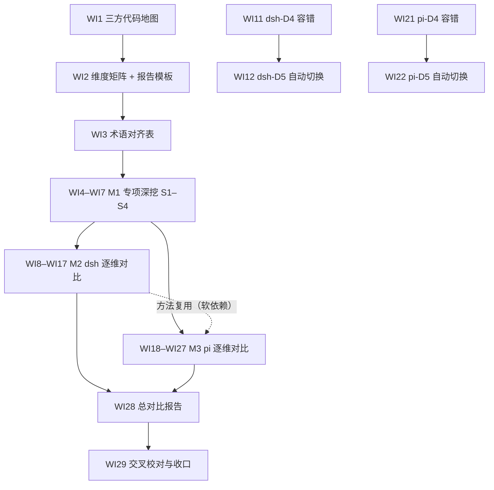

# nop-ai-agent 内在设计对比 Roadmap — deepseek-harness 与 pi

> Last updated: 2026-09-12
> Sources: 2026-09-12 三方代码实地探查（本 roadmap 全部代码锚点来自该次探查，执行时须按各仓库当前 HEAD 复核）；既有调研见 Framework / Platform Reuse
> 位置：本文件按仓库 roadmap 惯例存放于 `ai-dev/backlog/`；全部对比报告（Deliverable）产出至 ai-dev/analysis/compare-agent-design/（用户指定目录）。格式遵循 AGE 模板（attractor-guided-engineering-template）的 docs/backlog/00-roadmap-authoring-guide.md（frontmatter + checkbox 通道）。
> 书写约定：Deliverable 是尚未产出的未来报告，其路径一律用普通文本书写、**不加反引号**——check-doc-links 会把反引号路径当作必须已存在的仓库内链接校验；已存在的 owner / 参考文档路径保持反引号，持续受 checker 保护。

## Purpose

本 roadmap 编排一项**纯分析任务**：以 nop-ai-agent 为基准，逐项核对其与 `~/ai/deepseek-harness`（Part A）以及 `~/ai/pi`（Part B）在 agent 内在设计上的异同。终态：ai-dev/analysis/compare-agent-design/ 目录下三份基线产物 + 4 份专项深挖文档 + 20 份逐维对比报告 + 1 份总报告全部存在、代码锚点可复核、通过交叉一致性校对。

对比维度 D1–D10（权威定义与子机制拆解由 WI2 维度矩阵落定）：

- D1 内部 agent loop：主循环形态（turn/step/iteration 分层）、终止条件、迭代上限与延长、流式输出、输入注入/steering
- D2 扩展点：hook/中间件/waterfall/拦截器的类型与触发阶段、注册方式（声明式 DSL vs 代码）、veto/改写语义
- D3 事件类型与触发方式：事件词表与分类、发射点、订阅模型（emit/serial/waterfall、同步/异步）、持久化事件 vs 瞬时事件、UI 桥接
- D4 容错性：错误分类体系、重试策略与退避、部分失败与中断语义、abort/cancel、降级与恢复路径
- D5 自动切换：provider/model/账号故障转移、熔断与冷却、配额感知、模型分级路由、切换语义与 fail-loud
- D6 前缀缓存利用：缓存断点控制、前缀稳定性构造、压缩与缓存的交互、一次性调用是否写缓存、缓存命中观测
- D7 工具系统：声明与 schema、执行调度（并行/串行/屏障）、结果回填、工具调用修复、权限/沙箱
- D8 上下文工程与压缩：token 预算与压力检测、触发条件、策略分层、spill/引用式保真、产物形态（破坏性 vs 追加式）
- D9 会话持久化与恢复：session 数据模型、存储格式与后端、resume/fork/branch、checkpoint 与崩溃恢复
- D10 多代理与子代理：派生模型、深度预算、团队/编排、与主循环的隔离边界

专项深挖主题（M1，用户指定的四个机制级专题，三方覆盖，权威深挖）：

- S1 agent loop 具体执行流程：从输入进入到最终响应的逐步调用链，每阶段做什么、扩展点挂载在流程哪个位置
- S2 扩展点全量清单与能力语义：逐点标注触发时机、可以扩展什么、能力级别（仅监听 observe / 修改内容 transform / 否决跳过 veto / 中断轮次 abort-bail / 注入内容 inject）、同步异步与错误传播
- S3 同一扩展点上多个触发的顺序：排序来源（注册序/优先级/声明序）、分发语义（waterfall/serial/emit/链式）、顺序是否可预测可配置
- S4 不同扩展机制之间的协同：同一行为穿过多种扩展机制时的叠加顺序、冲突裁决、veto/中断的传播边界

范围边界（Non-Goals）：**只比较 agent 内在设计**。明确排除——插件动态更新/热重载（dsh 的 `cordis-host-runner`/`tool-cordis`/client HMR；pi 的 `/reload`、extension cache 失效、`pi install/update`）；UI/TUI 与 RPC 协议层；产品形态与部署；评测基准。总报告只产出对比结论与可吸收增量**建议**，不排实施计划（实施另开 roadmap/plan）。

## Work Item Status

> 唯一动态状态块。勾选 = 独立 closure audit 通过（见 Cross-Cutting 完成判定）。WI 编号全文件递增；顺序即执行顺序，AI 不重排。

### M0 — 对比基线

- [x] WI1 三方代码地图：nop-ai-agent / deepseek-harness / pi 的包结构、关键类与 load-bearing 文件清单，记录各仓库 HEAD commit（Deliverable: ai-dev/analysis/compare-agent-design/01-code-map.md; deps: 无; Owner: `ai-dev/design/nop-ai-agent/01-architecture-baseline.md`）
- [x] WI2 对比维度矩阵 D1–D10：每维度的子机制拆解、三方代码锚点、报告 6 节模板与裁定格式（Deliverable: ai-dev/analysis/compare-agent-design/00-dimension-matrix.md; deps: WI1; 参考: `ai-dev/analysis/00-analysis-writing-guide.md`）
- [ ] WI3 术语与概念对齐表：loop/turn/step/iteration、hook/middleware/waterfall、持久化事件 vs 瞬时事件、session/compaction/checkpoint/spill 等三方概念映射（Deliverable: ai-dev/analysis/compare-agent-design/02-terminology-map.md; deps: WI2）

### M1 — 专项深挖：执行流程与扩展机制（S1–S4，三方覆盖）

- [ ] WI4 S1 agent loop 具体执行流程逐步分解：三方各产出一条从输入进入到最终响应的完整调用链（阶段划分、每步职责、流式路径），流程图上逐点标注该阶段挂载的扩展点（Deliverable: ai-dev/analysis/compare-agent-design/03-flow-agent-loop.md; deps: WI3; nop 锚点: ReActAgentExecutor/LlmCallCoordinator/AgentToolDispatcher）
- [ ] WI5 S2 扩展点全量清单与能力语义：三方每个扩展点一行——触发时机、可扩展/可影响的内容、能力级别（observe/transform/veto/abort-bail/inject 分级，能力级别以代码实际行为为准，不以注释或文档为准）、同步异步、异常如何传播（Deliverable: ai-dev/analysis/compare-agent-design/04-extension-capability-matrix.md; deps: WI4）
- [ ] WI6 S3 同点多触发顺序：三方每个扩展点上多个实现共存的排序来源（注册顺序/优先级字段/DSL 声明顺序/订阅顺序）、该点的分发语义（waterfall 逐层包裹 / serial 顺序 await / emit 广播）、顺序对调用方的可预测性与可配置性（Deliverable: ai-dev/analysis/compare-agent-design/05-extension-ordering.md; deps: WI5）
- [ ] WI7 S4 跨扩展协同：同一行为穿过多种扩展机制时的组合语义——nop 的 lifecycle hook × execution middleware × filter chain × DSL 声明扩展，dsh 的 agent waterfall × tools waterfall × llm/stream × system-prompt，pi 的 AgentLoopConfig hook × ExtensionAPI event × registerProvider——叠加顺序、冲突裁决、veto/bail 的传播边界与终止范围（Deliverable: ai-dev/analysis/compare-agent-design/06-extension-composition.md; deps: WI5, WI6）

### M2 — deepseek-harness 逐维对比（Part A；范围排除其插件动态更新机制）

- [ ] WI8 D1 内部 agent loop：ReActAgentExecutor/AgentLoopGuard 迭代模型（maxIterations/ISustainer）vs ReactLoopAgent turn/step 模型（TurnEndReason、无固定步数上限、Inbox followup/steer/inject、chunk 持久化）；流程级细节引用 03 专项文档，只写对比增量（Deliverable: ai-dev/analysis/compare-agent-design/dsh-D1-agent-loop.md; deps: WI3, WI4; Owner: `ai-dev/design/nop-ai-agent/nop-ai-agent-react-engine.md`）
- [ ] WI9 D2 扩展点：12 个 AgentLifecyclePoint + 4 个 ExecutionPoint + filter chain + 66 接口扩展矩阵 vs `agent/pre-step`·`agent/request`·`agent/request-error`·`agent/turn-stopping` waterfall + `tools/*` waterfall + `llm/stream` + capability seams；能力级别与顺序语义引用 04/05/06 专项文档，只写对比增量（Deliverable: ai-dev/analysis/compare-agent-design/dsh-D2-extension-points.md; deps: WI3, WI5; Owner: `ai-dev/design/nop-ai-agent/03-extension-matrix.md`）
- [ ] WI10 D3 事件类型与触发方式：AgentEventType/IAgentEventPublisher + 异步消息信封（IMailbox/Topics）vs 48 类持久化 SessionEvent + Cordis emit/serial/waterfall 瞬时事件 + UI 桥接（Deliverable: ai-dev/analysis/compare-agent-design/dsh-D3-events.md; deps: WI3; Owner: `ai-dev/design/nop-ai-agent/02-execution-model.md`）
- [ ] WI11 D4 容错性：ErrorClassification/IRetryPolicy/三级失败升级/IDenialLedger vs HarnessError 稳定错误码 + `agent/request-error` 重试 waterfall + 持久化 `llm/retry` 事件 + 工具中止合成结果（Deliverable: ai-dev/analysis/compare-agent-design/dsh-D4-fault-tolerance.md; deps: WI3; Owner: `ai-dev/design/nop-ai-agent/nop-ai-agent-reliability.md`）
- [ ] WI12 D5 自动切换：LlmCallCoordinator 多通道（重试→熔断→账号链→ProviderFailoverChain→模型分级路由）vs dsh 无内置 failover——`agent/request` 逐步重写 provider/model + per-provider 重试策略 + 配额仅分类不转移（Deliverable: ai-dev/analysis/compare-agent-design/dsh-D5-auto-failover.md; deps: WI11; Owner: `ai-dev/design/nop-ai-agent/nop-ai-agent-reliability.md`）
- [ ] WI13 D6 前缀缓存利用：dsh 构造性前缀稳定（section 化静态 system prompt、动态上下文走 user 快照消息、压缩请求字节级重放复用 KV cache、`purpose` 标记辅助调用）vs nop 侧现状逐项核查（显式缓存断点/前缀稳定性约定是否存在）（Deliverable: ai-dev/analysis/compare-agent-design/dsh-D6-prefix-cache.md; deps: WI3; Owner: `ai-dev/design/nop-ai-agent/nop-ai-agent-context-compaction-economics.md`）
- [ ] WI14 D7 工具系统：tool.xdef DSL + AgentToolDispatcher 标签过滤 + IToolCallRepairer 修复链 vs defineTool 输出 schema/render/`isConcurrencySafe` + tools/pre-execute 审批 + Landlock/Seatbelt 沙箱 + code-mode（Deliverable: ai-dev/analysis/compare-agent-design/dsh-D7-tool-system.md; deps: WI3; Owner: `ai-dev/design/nop-ai-agent/04-tool-invocation.md`）
- [ ] WI15 D8 上下文工程与压缩：PipelineCompactor 分层 + short-ref 引用式 + spill store vs CompactionEngine seam（pressure/context-overflow 触发、token 预算保留、tool-pairing 平衡、spill policy）（Deliverable: ai-dev/analysis/compare-agent-design/dsh-D8-context-compaction.md; deps: WI3; Owner: `ai-dev/design/nop-ai-agent/nop-ai-agent-context-model.md`）
- [ ] WI16 D9 会话持久化与恢复：ISessionStore 三实现 + ICheckpointManager 体系（幂等键/发散检测）vs 追加式类型化事件日志 + fork 边界 + JSONL(zstd)/SQLite 双后端 + write-behind（Deliverable: ai-dev/analysis/compare-agent-design/dsh-D9-session-persistence.md; deps: WI3; Owner: `ai-dev/design/nop-ai-agent/nop-ai-agent-session-and-storage.md`）
- [ ] WI17 D10 多代理与子代理：team/actor/plan 全栈（FanOut/Reduction/调度守护进程/跨进程协调）vs `ctx.subagents` 6 provider + 深度预算 + 实验性 agent-team（Deliverable: ai-dev/analysis/compare-agent-design/dsh-D10-multi-agent.md; deps: WI3; Owner: `ai-dev/design/nop-ai-agent/nop-ai-agent-multi-agent.md`）

### M3 — pi 逐维对比（Part B；维度同 D1–D10）

M2 完成后执行可复用其方法与裁定口径（软依赖，不阻塞）。

- [ ] WI18 D1 内部 agent loop：agentLoop() 单层循环 + stopReason 终止 + steering/follow-up 队列 + 截断消息工具调用失败语义 vs nop 迭代模型；流程级细节引用 03 专项文档（Deliverable: ai-dev/analysis/compare-agent-design/pi-D1-agent-loop.md; deps: WI3, WI4; Owner: `ai-dev/design/nop-ai-agent/nop-ai-agent-react-engine.md`）
- [ ] WI19 D2 扩展点：AgentLoopConfig 配置级 hook（transformContext/beforeToolCall/afterToolCall/prepareNextTurn 等）+ ExtensionAPI 约 35 个 `pi.on` 事件 hook + registerTool/registerCommand/registerProvider vs nop 双层扩展；能力级别与顺序语义引用 04/05/06 专项文档（Deliverable: ai-dev/analysis/compare-agent-design/pi-D2-extension-points.md; deps: WI3, WI5; Owner: `ai-dev/design/nop-ai-agent/03-extension-matrix.md`）
- [ ] WI20 D3 事件类型与触发方式：AgentEvent 判别联合 + 顺序 await sink + AgentSessionEvent 扩展（auto_retry_* 等）+ JSONL/TUI 桥接 vs nop 事件体系（Deliverable: ai-dev/analysis/compare-agent-design/pi-D3-events.md; deps: WI3; Owner: `ai-dev/design/nop-ai-agent/02-execution-model.md`）
- [ ] WI21 D4 容错性：可重试/不可重试正则分类 + 传输层（SDK 镜像策略）与应用层（AgentSession 自动重试）双重重试 + 上下文溢出独立分类走压缩 + 错误工具结果回填 vs nop 错误规范化与重试（Deliverable: ai-dev/analysis/compare-agent-design/pi-D4-fault-tolerance.md; deps: WI3; Owner: `ai-dev/design/nop-ai-agent/nop-ai-agent-reliability.md`）
- [ ] WI22 D5 自动切换：pi 明确无内置切换——用户/扩展驱动 model_select + registerProvider 热注册 + per-call getApiKey + 配额不可重试 vs nop 多通道故障转移（Deliverable: ai-dev/analysis/compare-agent-design/pi-D5-auto-failover.md; deps: WI21; Owner: `ai-dev/design/nop-ai-agent/nop-ai-agent-reliability.md`）
- [ ] WI23 D6 前缀缓存利用：Anthropic cache_control 断点（system/最后工具定义/最后 user 消息）+ cacheRetention long/short/none + 工具集变化才重建 system prompt + 稳定工具序 + 一次性调用禁写缓存 + cache-stats 未命中观测 vs nop 侧现状逐项核查（Deliverable: ai-dev/analysis/compare-agent-design/pi-D6-prefix-cache.md; deps: WI3; Owner: `ai-dev/design/nop-ai-agent/nop-ai-agent-context-compaction-economics.md`）
- [ ] WI24 D7 工具系统：typebox schema + 默认并行/sequential 覆盖 + deferred tools（transcript 中途引入）+ 文件变更串行队列 + 权限留白给扩展 vs nop 工具体系（Deliverable: ai-dev/analysis/compare-agent-design/pi-D7-tool-system.md; deps: WI3; Owner: `ai-dev/design/nop-ai-agent/04-tool-invocation.md`）
- [ ] WI25 D8 上下文工程与压缩：threshold/overflow/manual 触发 + reserveTokens/keepRecentTokens 预算 + 追加式 CompactionEntry 非破坏重建 + branch summarization vs nop 分层压缩（Deliverable: ai-dev/analysis/compare-agent-design/pi-D8-context-compaction.md; deps: WI3; Owner: `ai-dev/design/nop-ai-agent/nop-ai-agent-context-compaction-economics.md`）
- [ ] WI26 D9 会话持久化与恢复：JSONL + id/parentId 会话树 + 类型化条目与版本迁移 + labels + SQLite 后端 + 上下文重建 vs nop session/checkpoint 体系（Deliverable: ai-dev/analysis/compare-agent-design/pi-D9-session-persistence.md; deps: WI3; Owner: `ai-dev/design/nop-ai-agent/nop-ai-agent-session-and-storage.md`）
- [ ] WI27 D10 多代理与子代理：pi 无内置（官方 example extension 形态）及其设计取舍 vs nop team 全栈（Deliverable: ai-dev/analysis/compare-agent-design/pi-D10-multi-agent.md; deps: WI3; Owner: `ai-dev/design/nop-ai-agent/nop-ai-agent-multi-agent.md`）

### M4 — 汇总与收口

- [ ] WI28 总对比报告：汇总 20 份维度报告与 4 份专项文档，产出全维度三方对照总表、结构性差异（范式级）清单、逐维裁定汇总与可吸收增量建议（仅建议）（Deliverable: ai-dev/analysis/compare-agent-design/99-overall-comparison.md; deps: WI4..WI27 全部; 参考: `ai-dev/analysis/agent-survey/agentscope-harness-vs-nop-ai-agent-comparison.md`）
- [ ] WI29 交叉一致性校对与收口：由独立子代理校对全部 28 个产物间的结论矛盾、锚点失效与模板缺失（含专项文档与 D1/D2 报告间的权威源一致性），修正后在总报告附录记录校对结论（Deliverable: ai-dev/analysis/compare-agent-design/99-overall-comparison.md 附录; deps: WI28）

## Framework / Platform Reuse

| Capability | Provider | Notes |
| --- | --- | --- |
| dsh 深度调研（较新） | `ai-dev/analysis/agent-survey/2026-08-13-deepseek-harness-analysis.md` | 2026-08 快照，M2 可增量引用；锚点须按当前 HEAD 复核 |
| pi 调研（已过期） | `ai-dev/analysis/agent-survey/2026-06-05-pi-agent-analysis.md`、`2026-06-05-pi-ecosystem-comparison.md` | pi 演进快（WIP harness、cache retention 等为新增量），必须按当前 HEAD 重核 |
| 对比报告格式先例 | `ai-dev/analysis/agent-survey/agentscope-harness-vs-nop-ai-agent-comparison.md` | 结论先行 + 勘误 + 对照表结构，WI28/WI2 参照 |
| 分析写作规范 | `ai-dev/analysis/00-analysis-writing-guide.md` | 所有报告写作前必读 |
| nop 侧设计基线 | `ai-dev/design/nop-ai-agent/`（54 篇；`03-extension-matrix.md` 索引 66 个扩展接口） | nop 侧 Owner doc，仍须与代码核对 |
| 对方一手架构文档 | dsh 仓库内 docs/architecture.md 与 docs/subsystems/*.md；pi 仓库内 packages/coding-agent/docs/extensions.md、docs/compaction.md、docs/session-format.md（外部仓库路径，不作本仓库链接） | 只作导航，结论必须落到代码锚点 |
| roadmap 机器校验 | AGE 模板 `tools/mission-driver/src/roadmap-check.mjs` | 本文件每次更新后运行，`passed: true` 才算有效 |
| 可选执行器 | `ai-dev/tools/mission-driver.sh`（若配置 mission） | 逐工作项 DRAFT→EXECUTE→closure audit 闭环；不强制 |

## Current Baseline

- 三方代码位置（2026-09-12 探查）：
  - nop-ai-agent：本仓库 `nop-ai/nop-ai-agent`（main java 536 文件）；agent runtime 在 `io.nop.ai.agent` 下 27 个包（engine 42 / plan 66 / security 74 / team 55 / reliability 30 等），LLM 可靠性层在 `nop-ai/nop-ai-core` 的 `reliability/`，provider 中立 API 在 `nop-ai/nop-ai-api`。
  - deepseek-harness：`~/ai/deepseek-harness`，pnpm 双层 monorepo，Cordis 插件框架（vendored）；核心在 `packages/core/{agent-loop,agent,session,tools,system-prompt,scope}` + `packages/llm/{llm,llm-retry,token-meter}` + `packages/compaction/*`。
  - pi：`~/ai/pi`，npm workspaces monorepo；核心在 `packages/agent`（agent-loop）、`packages/coding-agent`（AgentSession/扩展/会话/压缩）、`packages/ai`（多 provider 统一 API）。
- 既有调研与文档见 Reuse 表。**尚无任何一份 nop vs dsh / nop vs pi 的逐维对比报告**；报告目录 ai-dev/analysis/compare-agent-design/ 待 WI1 创建。
- 探查期初步假设（仅作为 M2/M3 的核对输入，不作为结论，逐维证实或证伪）：
  - dsh 与 pi 均无内置 provider 故障转移/熔断（dsh 用 waterfall 重写表达，pi 明确留白给扩展）；nop 是三者中唯一内置多通道切换的实现。
  - 三者的主循环都无硬性步数上限语义（nop 为 maxIterations + ISustainer 可延长；dsh/pi 以 stopReason/turn 语义终止）。
  - pi 拥有三者中最显式的 prefix-cache 工程化设计（断点 + TTL + 观测）；dsh 靠构造性稳定；nop 侧是否存在等价设计待 D6 核查。

## Dependency Graph

## Cross-Cutting

- 证据纪律：每条结论必须带代码锚点（仓库相对路径 + 类/函数名，必要时 `:line`）；对方仓库的设计文档只作导航，结论必须核对代码；每份报告头部记录被分析仓库的 HEAD commit 与分析日期。能力级别（observe/transform/veto/abort-bail/inject）必须以代码实际行为证明，不以注释、文档或类型名为准。
- 权威源约定：03–06 专项文档是执行流程、扩展点能力语义、同点顺序、跨扩展协同四个主题的权威深挖；dsh-D1/D2、pi-D1/D2 等维度报告引用专项结论，只写对比增量，不重复展开；若出现结论冲突，以专项文档为准并由 WI29 校对收敛。
- 报告模板契约（每份 D 报告固定 6 节，由 WI2 模板固化；专项文档 S1–S4 的章节结构由各自 deliverable 需求定义、在 WI2 模板中登记）：① 结论摘要（≤10 行）② nop 侧机制与锚点 ③ 对方侧机制与锚点 ④ 子机制逐项对照表 ⑤ 语义差异与取舍 ⑥ 裁定（nop 领先 / 对方领先 / 等价 / 双方均无 / 不可比）+ 可吸收增量建议（仅记录，不实施）。
- 语义对齐：Java 与 TS 范式差异统一按 WI3 术语表翻译，禁止直译制造伪差异；同一子机制双方皆无时裁定"双方均无"，不得硬比。
- closure audit（每个工作项的完成判定）：报告存在 + 模板结构完整 + 锚点抽查（每份报告 ≥5 个锚点可在对应仓库解析）+ 结论与对照表一致 + 全仓 check-doc-links 无 error；由独立子代理执行，通过后才勾选 checkbox。
- 验证面：纯分析任务，无代码变更，不涉及 mvn 构建与测试。每份报告产出后运行 `node ai-dev/tools/check-doc-links.mjs --strict` 保持 0 error（报告位于 ai-dev/analysis/ 历史目录，报告内部引用不做强检；本文件对未来交付物的引用按头部书写约定用普通文本）。本文件每次更新后运行 AGE 模板 `tools/mission-driver/src/roadmap-check.mjs`（指向本文件），`passed: true` 才算有效。
- 报告语言：中文行文，类名/函数名/术语保留英文原名；外部仓库路径以 `~/ai/...` 或仓库相对路径书写并注明仓库。

## Rules

- 状态只在本文件 `## Work Item Status` 的 checkbox 通道维护；不设第二状态面，里程碑无状态。
- WI 编号全文件唯一递增；执行顺序 = 文档顺序；AI 不重排优先级、不发明工作项；需新增/调整工作项时先提请人工确认。
- 本文件不写对比结论正文；结论一律落对应报告，本文件只维护完成状态与范围。
- 维度定义、子机制拆解与报告模板的 owner doc 是 00-dimension-matrix.md（WI2 产物）；其与本文件工作项行描述冲突时，先更新矩阵，再同步回写本文件。
- 书写约定（延续头部）：未来交付物路径不加反引号；已存在的仓库内文档路径用反引号，使 check-doc-links 对本文件持续可校验。
