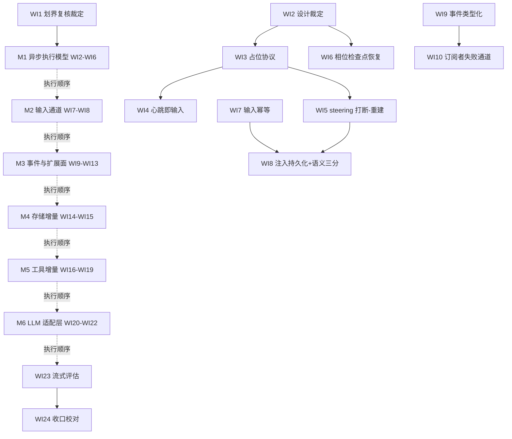

# nop-ai-agent 重构 Roadmap — dsh × unreal 比对综合

> Last updated: 2026-09-25
> Sources: `ai-dev/analysis/compare-agent-design/99-overall-comparison.md`（dsh/pi 三方总报告 ⑤ A–H 归组）；`ai-dev/analysis/2026-09/2026-09-25-unreal-agent-vs-nop-ai-agent-comparison.md`（unreal 比对新报告）；`ai-dev/backlog/nop-ai-agent-autonomous-execution-improvement-roadmap.md`（在途划界对象）
> 位置：本文件按仓库 roadmap 惯例存放于 `ai-dev/backlog/`。书写约定：未来交付物路径用普通文本书写、不加反引号；已存在的 owner / 参考文档路径用反引号，持续受 check-doc-links 保护。

## Purpose

本 roadmap 编排 nop-ai-agent 的**执行模型与基础设施重构**，综合 dsh（deepseek-harness）比对与 unreal-agent 比对的可吸收增量建议。与在途的 `ai-dev/backlog/nop-ai-agent-autonomous-execution-improvement-roadmap.md`（20 项，承接 D1/D4/D6/D8 的自主执行改进）划界并行；两份 roadmap 合计**承接或显式裁定处置** 99-总报告 ⑤ 节 A–H 全部归组建议 + unreal 独有增量——唯二的裁定处置出口：⑤-C-1 流式接通经 WI23 评估后裁定归属（本 roadmap 只评估不实施，立项则归 successor plan/roadmap）；⑤-E-3 正则归类器并入 WI22 交付范围。

**本 roadmap 承接**（autonomous roadmap 未覆盖的空间）：

- unreal 核心增量：异步工具执行模型（占位 tool result 协议、心跳即输入、steering 打断-重建、长时工具相位检查点与保守恢复）、外部输入 redelivery 幂等、per-provider 缓存键放置、缓存观测全 dialect 接线、工具输出预算 schema 内建、Retry-After 双源解析
- dsh/pi 未承接归组：⑤-C 事件类型化与订阅者失败通道、⑤-D 注入语义三分与持久化、⑤-F 扩展面治理（veto 收敛/修复差异审计/hook 白名单类型化）、⑤-G 会话存储增量、⑤-H 工具与多代理裁定项

**定位说明**：steering/注入在本 roadmap 中的定位不是 UI 交互，而是 channel 驱动自主 agent 的输入通道重构（飞书连接器等外部注入已是生产场景）；流式完整管线仍只评估不实施（与 autonomous roadmap 定位约束一致）。

**终态**：24 个工作项全部落地或显式裁定移出，每项通过独立 closure audit，owner docs 同步更新，回归测试全绿。

## Work Item Status

> 唯一动态状态块。勾选 = 独立 closure audit 通过（见 Cross-Cutting 完成判定）。WI 编号全文件递增；顺序即执行顺序，AI 不重排。WI1 为全文件前置：M1–M7 全部 WI 隐式依赖 WI1 的划界裁定，各 WI 正文 deps 不再重复标注。

### M0 — 划界复核与吸收裁定

- [ ] WI1 吸收候选基线复核与划界裁定：对 M1–M7 全部吸收候选按执行时 HEAD 复核（本文件基线快照 2026-09-25，autonomous roadmap 之后无相关代码落地），与 autonomous roadmap 20 项逐项去重裁定（本 roadmap 吸收 / 已落地无需做 / 移交 autonomous / 裁定移出）；必裁清单含：① pi-D4 建议 2"重试前摘除失败响应"复核（nop 失败响应是否本就不入上下文，若然登记已满足）；② WI20 与 autonomous WI8 的同靶合并裁定（两者均改 AnthropicDialect 请求侧 cache_control，裁定归属或合并执行）；③ WI21 与 autonomous WI3 的观测/消费分界复核（Deliverable: 裁定表一份——M1–M7 候选 × autonomous 20 项的裁定结论，落当日 log 条目并链接各 WI plan 的 Current Baseline；deps: 无；Owner: 本文件）

### M1 — 异步工具执行模型重构（unreal 核心增量，最大改造面）

> 来源：`ai-dev/analysis/2026-09/2026-09-25-unreal-agent-vs-nop-ai-agent-comparison.md` §1/§2/§4/§5
> 理由：长时工具阻塞整个 round、模型在等待期间无推理能力，是 nop 执行模型与三方对手的最大结构性差距；unreal 的占位协议是该问题的参考实现

- [ ] WI2 异步占位模式改造面评估与设计裁定：同步 round 内工具执行 → 异步占位模型的兼容性评估——与 maxIterations/ISustainer 预算、AgentToolDispatcher 并行调度、7-checkpoint 安全链（占位结果是否过 POST_CALL guardrail）、W3 双层中间件、溢出恢复环（autonomous WI5）的交互逐项裁定；含占位模式过渡策略裁定（全量切换 vs 按工具类型可选）；比对报告 Open Question ①（占位结果与 POST_CALL guardrail 兼容形态）在此收口，Open Question ②（steering 过渡策略）由 WI5 收口（Deliverable: ai-dev/design/nop-ai-agent/nop-ai-agent-async-tool-execution.md 新 owner doc + 裁定记录；deps: 无；Item Type: Decision）
- [ ] WI3 占位 tool result 协议：工具未完成时以"运行中"占位结果回流、真实结果到达后原位替换（同 callId 不堆积）、引导模型并行/等待语义文案；依赖 WI2 裁定形态（Deliverable: 代码变更 + 测试；deps: WI2；Owner: 新 owner doc + `ai-dev/design/nop-ai-agent/nop-ai-agent-react-engine.md`；来源: unreal 比对 §1）
- [ ] WI4 心跳即输入：长时工具等待超阈值时构造含运行中工具清单的心跳消息入上下文，模型可决定继续等待/放弃/并行（Deliverable: 代码变更 + 测试；deps: WI3；Owner: 新 owner doc + `ai-dev/design/nop-ai-agent/nop-ai-agent-react-engine.md`；来源: unreal 比对 §5）
- [ ] WI5 steering 打断-重建：mailbox 注入升级——在飞 LLM 请求可取消、新输入与未完成工具占位状态合流、迟到响应按 turn 边界丢弃；即 react-engine.md 已登记的 mid-round successor（现状为 round 边界 drain，2026-09-15 修复定档）；steering 过渡策略（全量切换 vs 按工具类型可选，比对报告 Open Question ②）在此收口（Deliverable: 代码变更 + 测试；deps: WI3；Owner: `ai-dev/design/nop-ai-agent/nop-ai-agent-react-engine.md`；来源: unreal 比对 §2 + `dsh-D1-agent-loop.md` ⑥-建议2）
- [ ] WI6 长时工具相位检查点 + 保守恢复纪律：bash/文件写类高副作用工具引入相位检查点（启动前/执行中/完成三相位以上），崩溃恢复按相位续跑或显式失败，"结果不可判定即失败"不盲目重跑；与 autonomous WI10（崩溃孤儿合成收尾）协同——该项合成收尾文本，本项相位级恢复（Deliverable: 代码变更 + 测试；deps: WI2；Owner: `ai-dev/design/nop-ai-agent/nop-ai-agent-reliability.md` + `ai-dev/design/nop-ai-agent/nop-ai-agent-session-and-storage.md`；来源: unreal 比对 §4）

### M2 — 输入通道与幂等

> 来源：unreal 比对 §3 + `dsh-D1-agent-loop.md` ⑥-建议2 / `pi-D1-agent-loop.md` ⑥-建议1 / `pi-D3-events.md` ⑥-建议2
> 理由：channel 场景消息重复投递会重复触发执行；注入语义混同导致 followup/打断/背景注入不可区分

- [ ] WI7 外部输入 redelivery 幂等：输入幂等键（session 级去重 + 持久化前置），契约对齐 at-least-once 投递 + 双层幂等；mailbox 体系（IMailbox/DeferredAckMailbox）扩展（Deliverable: 代码变更 + 测试；deps: 无；Owner: `ai-dev/design/nop-ai-agent/nop-ai-agent-session-and-storage.md`；来源: unreal 比对 §3）
- [ ] WI8 注入持久化 + 语义三分 + 队列事件化：followup（空闲追加）/ steer（打断合流）/ inject（背景注入不触发打断）三语义区分 + 注入事件入 session 历史 + 注入队列事件化（queue_update 式：入队/排空对消费者可见，对齐 pi-D3 建议 2 原义）；steer 语义消费 WI5 的打断通道（Deliverable: 代码变更 + 测试；deps: WI5, WI7；Owner: `ai-dev/design/nop-ai-agent/nop-ai-agent-react-engine.md` + `ai-dev/design/nop-ai-agent/nop-ai-agent-session-and-storage.md`；来源: `99-overall-comparison.md` ⑤-D）

### M3 — 事件与扩展面治理

> 来源：`99-overall-comparison.md` ⑤-C（事件部分）+ ⑤-F 全部
> 理由：事件 payload 无类型契约（消费者只能强转）与扩展面死配置是治理债，阻塞下游消费（观测/UI 桥接未来形态）

- [ ] WI9 AgentEvent payload 类型化 + ignorable 兼容：事件 payload 判别类型化 + 消费者可声明跳过未知事件的兼容契约（Deliverable: 代码变更 + 测试；deps: 无；Owner: `ai-dev/design/nop-ai-agent/02-execution-model.md`；来源: `dsh-D3-events.md` ⑥-建议1 + `pi-D3-events.md` ⑥-建议1）
- [ ] WI10 订阅者失败上报通道：订阅者处理失败不静默吞掉，提供上报路径与策略（Deliverable: 代码变更 + 测试；deps: WI9；Owner: `ai-dev/design/nop-ai-agent/02-execution-model.md`；来源: `pi-D2-extension-points.md` ⑥-建议1）
- [ ] WI11 veto 死配置收敛：hook 生命周期点 veto 合同收窄——AgentHookInvoker/HookResult 层与 agent.xdef lifecycle 映射中"声明了 veto 能力但无消费点位"的死配置要么实现消费要么类型收窄；live census 以执行时为准（dsh-D2 报告快照的 6 个 veto 点含已移除的 REASONING_CHUNK，需重做）（Deliverable: 代码变更/类型收窄 + 测试；deps: 无；Owner: `ai-dev/design/nop-ai-agent/03-extension-matrix.md`；来源: `dsh-D2-extension-points.md` ⑥-建议1）
- [ ] WI12 修复前后差异审计：IToolCallRepairer 修复链输出修复前后参数差异记录（可观测、可审计），与 7-checkpoint 安全链的"审批所见 vs 执行所用"一致性对齐（Deliverable: 代码变更 + 测试；deps: 无；Owner: `ai-dev/design/nop-ai-agent/04-tool-invocation.md`；来源: `dsh-D2-extension-points.md` ⑥-建议2 + `dsh-D7-tool-system.md` ⑥-建议3）
- [ ] WI13 hook 注册白名单类型化：hook 注册从字符串点白名单升级为类型化契约（Deliverable: 代码变更 + 测试；deps: 无；Owner: `ai-dev/design/nop-ai-agent/03-extension-matrix.md`；来源: `pi-D2-extension-points.md` ⑥-建议2）

### M4 — 会话存储增量

> 来源：`99-overall-comparison.md` ⑤-G
> 理由：nop 为快照+journal 范式——checkpoint journal 已是 append-only（`CheckpointJournalWriter.java:15-17`，只追加不重写），真正的全量重写在 **session 快照侧**（`FileBackedSessionStore.java:68-69` 每次 save 全量覆写 + DB CLOB 全量更新），大 session 下有写放大；压缩产物未条目化影响历史可解释性

- [ ] WI14 session 快照写路径增量化 + 条目版本化字段：靶点是 FileBackedSessionStore 全量覆写与 DB CLOB 全量更新（dsh-D9 建议 1 原靶点：消息级追加 + 周期快照压缩）；先裁定增量收益（nop 范式下快照是权威真相、追加条目仅是优化，收益不成立则登记移出），成立则实现消息级 append 写路径 + 条目版本化字段；checkpoint journal 已 append-only 不在本项范围（Deliverable: 裁定记录 + 代码变更 + 测试；deps: 无；Owner: `ai-dev/design/nop-ai-agent/nop-ai-agent-session-and-storage.md`；来源: `dsh-D9-session-persistence.md` ⑥-建议1 + `pi-D9-session-persistence.md` ⑥-建议1）
- [ ] WI15 压缩产物条目化：压缩产物以类型化条目落 session 历史（与既有 COMPACTION checkpoint + snapshot archive 裁定职责边界，避免双真相源）（Deliverable: 裁定记录 + 代码变更 + 测试；deps: 无；Owner: `ai-dev/design/nop-ai-agent/nop-ai-agent-session-and-storage.md`；来源: `pi-D9-session-persistence.md` ⑥-建议2）

### M5 — 工具系统增量

> 来源：`99-overall-comparison.md` ⑤-H（工具部分）+ unreal 比对 §7
> 理由：输出预算模型不可控是上下文膨胀的源头之一；并发标记与串行队列缺失使并行工具对同路径文件有竞态风险

- [ ] WI16 工具输出预算 schema 内建：tool.xdef 增加模型可调输出预算参数 + 统一截断协议（头尾保留 + 精确字节数 + 全文 spill 路径指针回填），与既有 spill store 打通；**波及面提示**：schema 参数改变全部工具暴露给 LLM 的定义面，与前缀缓存稳定目标（WI20 / autonomous WI1 工具排序）交互，plan 中必须评估前缀影响；tool.xdef 位于 nop-kernel/nop-xdefs，遵守 Cross-Cutting 平台级契约演进规则（Deliverable: 代码变更 + 测试；deps: 无；Owner: `ai-dev/design/nop-ai-agent/04-tool-invocation.md`；来源: unreal 比对 §7）
- [ ] WI17 并发安全标记 + 按路径串行队列：工具声明并发安全标记，不安全工具按路径亲和串行（同路径排队、异路径并行）；与既有 executeParallel Semaphore 上限（2026-09-15 落地）正交叠加（Deliverable: 代码变更 + 测试；deps: 无；Owner: `ai-dev/design/nop-ai-agent/04-tool-invocation.md`；来源: `dsh-D7-tool-system.md` ⑥-建议1 + `pi-D7-tool-system.md` ⑥-建议2）
- [ ] WI18 deferred 工具引入机制裁定：transcript 中途引入工具定义与前缀缓存稳定的冲突裁定——若冲突不可调和则裁定移出并记录（Deliverable: 裁定记录落 `ai-dev/design/nop-ai-agent/04-tool-invocation.md` 新增裁定小节（移出则含理由）；deps: 无；Item Type: Decision；Owner: 同左；来源: `pi-D7-tool-system.md` ⑥-建议1）
- [ ] WI19 continuable 子代理 + 传输抽象裁定：D10 是 nop 领先域（team.flow 编排全栈），dsh 的 continuable 子代理与传输抽象是否补强 nop 短板——裁定吸收/移出并记录（Deliverable: 裁定记录落 `ai-dev/design/nop-ai-agent/nop-ai-agent-multi-agent.md` 新增裁定小节（吸收则含实施项拆分）；deps: 无；Item Type: Decision；Owner: 同左；来源: `dsh-D10-multi-agent.md` ⑥-建议1/2 + `pi-D10-multi-agent.md` ⑥-建议1）

### M6 — LLM 适配层增量

> 来源：unreal 比对 §6/§9
> 理由：nop 缓存解析资产在位但请求侧无断点构造、无缓存键放置策略、观测面只有 Anthropic 一家；重试细节缺 message 级退避提示解析

- [ ] WI20 per-provider 缓存键放置框架：缓存键按 provider 放置策略（字段 / 会话亲和 header / TTL 断点）+ 请求侧断点引擎构造（替换 providerHints 手工透传）；与 autonomous WI8（cache_control 位置纠错）同靶（均改 AnthropicDialect 请求侧）——归属合并裁定在 WI1 必裁清单，先动工者落地、后动工者复核吸收（Deliverable: 代码变更 + 测试；deps: 软依赖 autonomous WI8 裁定结果；Owner: `ai-dev/design/nop-ai-agent/nop-ai-agent-context-compaction-economics.md` + `ai-dev/design/nop-ai-agent/nop-ai-agent-llm-layer.md`；来源: unreal 比对 §6）
- [ ] WI21 缓存观测全 dialect 接线：按现状分型——OpenAI/Ollama/Gemini 的 usage 解析已走 AbstractLlmDialect 通用通道（promptCacheHitTokensPath/promptCacheCreationTokensPath 配置），只需默认路径配置化；ResponsesDialect 自有 parseUsageFromResponses 需代码接入 cache 字段；另增 Usage Raw 原始保留（供方言翻译与审计）；补强 autonomous WI3（Anthropic 消费）为全 dialect 面（Deliverable: 配置默认化 + ResponsesDialect 代码变更 + 测试；deps: 无；Owner: `ai-dev/design/nop-ai-agent/nop-ai-agent-llm-layer.md`；来源: unreal 比对 §6）
- [ ] WI22 Retry-After 双源解析 + overloaded 长退避 + 正则归类器补充：响应头之外增加错误 message 文本退避提示解析（"try again in N s" 类）+ overloaded/slow_down 独立长退避曲线；**含 ⑤-E-3 归类器主体工作**——ErrorClassification 正则归类器补充（provider 非结构化文案归入规范码 + cause 链解包，提高跨 provider 兼容率，dsh-D4 建议 3 全量）；补强既有 StandardRetryPolicy retryAfterMs floor（Deliverable: 代码变更 + 测试；deps: 无；Owner: `ai-dev/design/nop-ai-agent/nop-ai-agent-reliability.md`；来源: unreal 比对 §9 + `dsh-D4-fault-tolerance.md` ⑥-建议3）

### M7 — 流式路径评估

- [ ] WI23 流式管线可行性评估 + 裁定：dsh 流式整流持久化范式对 nop 的改造面评估（REASONING_CHUNK 已于 2026-09-15 审计修复中移除，重引入需完整流式管线）；产出 Decision 报告裁定立项/不立项——**只评估不实施**，与 autonomous roadmap 定位约束一致；若裁定立项，实施归 successor plan/roadmap（本文件登记归属出口，不承接实施）（Deliverable: ai-dev/analysis/ 或 ai-dev/design/ 下裁定文档；deps: 无；Item Type: Decision；Owner: `ai-dev/design/nop-ai-agent/nop-ai-agent-react-engine.md`；来源: `99-overall-comparison.md` ⑤-C-1 + `dsh-D1-agent-loop.md` ⑥-建议1）

### M8 — 收口

- [ ] WI24 总收口报告 + 交叉校对：独立子代理校对本 roadmap 全部产物间结论一致性、与 autonomous roadmap 的划界无重复无遗漏、锚点有效；修正后在收口记录登记（Deliverable: 收口记录（本文件 Rules 通道 + 当日 log）；deps: WI1–WI23 全部）

## Dependency Graph

## Framework / Platform Reuse

| Capability | Provider | Notes |
| --- | --- | --- |
| dsh/pi 比对结论 | `ai-dev/analysis/compare-agent-design/99-overall-comparison.md` + 20 份维度报告 | ⑤ A–H 归组建议；⑤ 中 D6/D8/D4/D1 自主执行部分已由 autonomous roadmap 承接 |
| unreal 比对结论 | `ai-dev/analysis/2026-09/2026-09-25-unreal-agent-vs-nop-ai-agent-comparison.md` | 本 roadmap M1/M2/M6 的主要来源；外部仓库锚点 |
| 在途划界对象 | `ai-dev/backlog/nop-ai-agent-autonomous-execution-improvement-roadmap.md` | 20 项在途（D1/D4/D6/D8）；重叠裁定见 WI1/WI20 |
| nop 侧设计基线 | `ai-dev/design/nop-ai-agent/`（54 篇） | Owner docs；react-engine/reliability/session-and-storage/04-tool-invocation/03-extension-matrix/context-compaction-economics 为主要 owner |
| Plan 工作流 | `ai-dev/plans/00-plan-authoring-and-execution-guide.md` | 每个 WI 拟 plan 执行（含对抗性审查） |
| 分析写作规范 | `ai-dev/analysis/00-analysis-writing-guide.md` | WI23 裁定文档等产出前必读 |

## Current Baseline

- **比对基线**：dsh/pi 报告 2026-09-12（后续 4 轮 deep-audit 修复落地了一批 Remediation，报告快照需执行时复核）；unreal 比对 2026-09-25（HEAD `1b9f778453f4`）。
- **在途划界**：autonomous roadmap（2026-09-16，20 项全部未勾选，audit-rounds: 0）承接 ⑤-A（缓存基础）、⑤-B（溢出环）、⑤-E 的崩溃孤儿与取消分型（E-3 正则归类器归本 roadmap WI22）、D6 辅助调用治理、D8 压缩精度及若干 ⑤ 外的终态语义建议（max-tokens 粘性等）；本 roadmap 承接其余全部归组。
- **已核对资产**（2026-09-25 live spot check @ `571412f0b2`）：
  - `ChatUsage.cacheHitTokens/cacheCreationTokens/cacheMissTokens` 字段在位（nop-ai-api `ChatUsage.java:38-48`）；`copy()` 已保 totalTokens（2026-09-15 修复）。
  - `AnthropicDialect` 仅响应侧解析 cache usage（`:369-381`）；请求侧 `cache_control` 仅 providerHints 透传（`:603-604`），引擎不构造断点。开箱零缓存观测：`AbstractLlmDialect.parseUsage:411-418` 已有 promptCacheHitTokensPath/promptCacheCreationTokensPath 通用配置通道（OpenAI/Ollama/Gemini 的 usage 解析走此基类方法），但仓库内无任何 provider 配置设置该 path（开箱不生效）；`ResponsesDialect` 自有 `parseUsageFromResponses:465` 无缓存字段。
  - 错误分类无 overflow 通道（reliability 包 grep context_overflow/context_length_exceeded 零命中）——溢出恢复环整体缺失，由 autonomous WI4/WI5 承接。
  - REASONING_CHUNK 枚举已移除（plan 2026-09-15-1029-2，12→11 值）；重引入需完整流式管线（WI23 背景事实）。
  - steering 现状为 round 边界 drain（plan 2026-09-15-0116-1 Phase 4 定档文档语义，mid-round 为已登记 successor）；mailbox 体系在位（`io.nop.ai.agent.message` 包 IMailbox/DeferredAckMailbox/MailboxMessageHandler）。
  - `executeParallel` 已有 Semaphore 并发上限（plan 2026-09-15-0818-3）；无并发安全标记与路径亲和串行。
  - 工具输出截断散落各执行器，无 schema 级预算参数；spill store 与 read-ref 已落地（plan 2026-08-02-0900-1）。
- **审计收敛状态**：设计比对 roadmap 的 M5–M8 全部 P0/P1 与 Follow-up P2/P3 已收口（2026-09-15）；本 roadmap 不重复已修复面。

## Cross-Cutting

- **证据纪律**：每条执行结论必须带代码锚点（仓库相对路径 + 类/函数名，必要时 `:line`）；unreal/dsh 侧结论引用对应比对报告的锚点，执行时按对方仓库当前 HEAD 复核；能力语义以代码实际行为为准。
- **Protected Areas**：涉及 `nop-ai-api` 公共 API（ChatUsage/ChatMessage/ILlmDialect 等）变更的 WI 一律 plan-first + owner doc + 迁移说明；涉及 `nop-kernel/nop-xdefs` 下 ai schema（agent.xdef / tool.xdef，位于 nop-kernel 模块而非 nop-ai）的变更属平台级契约演进，同样 plan-first + owner doc + 迁移说明，验证面相应扩展 nop-xdefs；不触碰 `nop-core`/`nop-xlang` 内部与 `_gen/` 生成物。
- **Plan 工作流**：每个 WI 执行前按 `ai-dev/plans/00-plan-authoring-and-execution-guide.md` 拟 plan（含子代理对抗性审查循环），plan 完成后独立 closure audit，通过后勾选本文件 checkbox 并自动提交一次 git commit。
- **验证面**：代码变更 WI 需 `./mvnw test -pl nop-ai/nop-ai-agent -am` 通过（涉及 core/api/toolkit 时扩展模块列表）+ 新增回归测试覆盖新行为；纯裁定 WI（WI18/WI19/WI23）产出裁定文档并登记。每份文档产出后 `node ai-dev/tools/check-doc-links.mjs --strict` 保持 0 error。
- **协同规则**：与 autonomous roadmap 的重叠裁定（WI1 统一入口）；发现新的重叠/冲突时登记当日 log 并裁定归属，不重复立项、不重排对方工作项；两 roadmap 涉及同一文件（如 ReActAgentExecutor）时后动者先复核前者落地形态。
- **closure audit**：每个工作项的完成判定 = 独立子代理（fresh session）对照 live code 验证 exit criteria + owner doc 同步 + 测试在位；通过后才勾选 checkbox。
- **报告语言**：中文行文，类名/函数名/术语保留英文原名。

## Rules

- 状态只在本文件 `## Work Item Status` 的 checkbox 通道维护；不设第二状态面，里程碑无状态。
- WI 编号全文件唯一递增；执行顺序 = 文档顺序；AI 不重排优先级、不发明工作项；需新增/调整工作项时先提请人工确认。
- 本文件不写实现方案正文；设计裁定落 `ai-dev/design/`，执行细节落 plan，代码放源码。
- 划界规则：不得吸收已被 autonomous roadmap 承接的项（除非显式裁定移交并登记）；与 99-总报告 ⑤ A–H 的映射关系变动时同步更新本文件 Purpose。
- 每个 execution item 必须能归类为 `Fix`、`Decision`、`Proof`、`Follow-up`；已确认 live defect 不得降级为 Follow-up。
- `completed` 必须来自单独的 closure audit，不在完成最后一个编码 slice 的同时顺手宣布关闭。

## Authoring Review Record

> 本 roadmap 拟制过程按用户要求执行独立子代理对抗性审查循环，直至无 Blocker/Major 共识。

- **round 1**（2026-09-25，独立子代理 agent_463e0964-32ce-44b7-a85d-da17b1ec6d4c，fresh session）：裁定 REVISE——0 Blocker / 4 Major / 6 Minor。Major：① M4/WI14 前提错位（journal 实为 append-only，全量重写在 session 快照侧）；② "其余 dialect 零缓存观测"证据不实（AbstractLlmDialect 已有通用配置通道，开箱零配置才成立）；③ "完整承接 ⑤ A–H"声明两处不实（⑤-C-1 流式只评估、⑤-E-3 归类器主体丢失）；④ agent.xdef/tool.xdef 位于 nop-kernel/nop-xdefs 未纳入 Protected Areas。全部 10 项已修复（roadmap 10 处 + unreal 比对报告 1 处同步修正）。
- **round 2**（2026-09-25，独立子代理 agent_213c304c-b8c5-4562-b720-f79f80ea72c7，fresh session）：裁定 **CONSENSUS（可进入执行）**——round 1 全部修复逐项验证 PASS（含 8 个新锚点 live 复核精确），无 Blocker / 无 Major；自由发现 3 项 Minor 账目问题（WI2 Open Question 收口归属、Current Baseline ⑤-E 括注 taxonomy、上游 99 报告 ⑤-F dsh-D2 建议编号笔误）已在共识回填时一并修正；check-doc-links --strict 0 error；与 autonomous roadmap 20 项零未声明重复、⑤ A–H 映射按修复后口径无孤儿。

## Deep Audit Record

（尚无 deep-audit 轮次；audit-rounds: 0）
