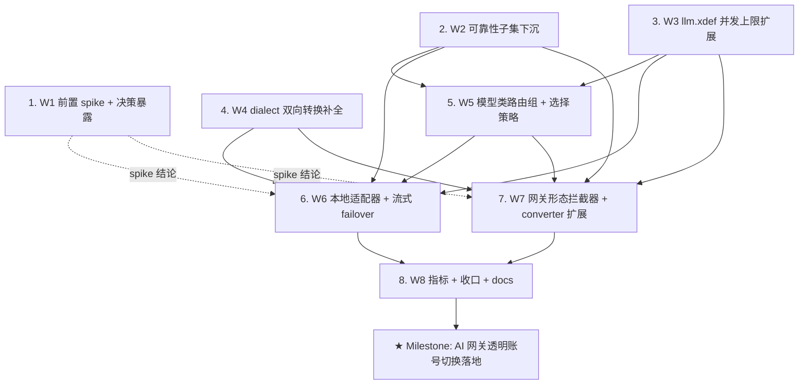

# AI 网关透明账号切换（Account Failover）Roadmap

> Status: active
> Last updated: 2026-08-14
> Sources（设计已达成共识——R1-R8 八轮独立审查 + 需求修订，实施前必读）：
> - `ai-dev/design/nop-ai-gateway/02-account-failover-requirement.md`（**权威来源**：需求规格，审查通过）
> - `ai-dev/design/nop-ai-gateway/01-architecture.md`（dialect 双向转换委托架构）
> - `ai-dev/design/nop-ai-agent/nop-ai-agent-reliability.md`（LLM 可靠性子集既有语义来源，W2 下沉后需同步）
> - `ai-dev/design/nop-ai-agent/nop-ai-llm-error-normalization-design.md`（双源错误分类）

**Why**：访问 AI 后端经常遇到限额/限流（429）、连接中断、超时、余额不足（402）、key 失效（401），需自动切换到另一个账号（可能同时切换模型与协议风格）且对前端透明。两种部署形态：nop-gateway 独立网关（拦截器链）与本地 `IChatService` 适配器（伪装本机接口）。核心不变式：**复用优先**——账号链/熔断/双源错误分类/凭证链全部复用既有机制，只新增缺口（流式 failover、两种形态、双向协议转换、并发限流、模型类路由组、动态选择策略、可靠性子集下沉）。mission 启动命令：`./ai-dev/tools/mission-driver.sh run nop-ai-gateway-failover`。

## Purpose

本 roadmap 驱动 AI 网关透明账号切换功能的落地，终止目标：两种形态（网关 + 本地适配器）均具备透明的账号/模型 failover、并发限流、双向协议转换能力，全部 W1-W8 通过独立 closure audit。不含实现细节——每个 `planned` 工作项由其执行 plan 拥有。

## Work Items

> **这是唯一动态状态块。状态只在这里更新。**
> 人工设定条目与顺序；AI 取第一个 `todo`，起草/执行计划，closure audit 通过后标 `done`。

- W1. 前置 spike：流式重订阅可行性验证 + 决策暴露（Q7：网关字节流层"缓冲 + 替换式重订阅"与 `StreamingProcessor`/`StreamingResponse` 路由期绑定的耦合验证；同时将 Q2（前端 model 参数语义）、Q5（RATE_LIMITED/TRANSIENT → 账号链切换偏离确认）暴露为人机决策点）：`done`
- W2. LLM 可靠性子集下沉 nop-ai-core（ThresholdBreaker/ICircuitBreaker/CircuitState/AccountChain/IAccountChainResolver/ProviderFailoverChain/ProviderFailoverQueue/IProviderFailoverQueue/IProviderFailoverChainResolver/LlmErrorClassifier/IRetryPolicy/StandardRetryPolicy/NoRetryPolicy/RetryContext/RetryDecision/RetryOutcome/AlwaysClosed/NoOpProviderFailoverQueue + NopAiAgentErrors/NopAiAgentException 迁移 + buildModelKey 移入；nop-ai-agent 调用方适配；既有测试迁移；nop-ai-agent-reliability.md 模块归属同步）：`todo`
- W3. llm.xdef 配置面扩展（`concurrencyLimit` 字段：provider 级缺省 + 账号级覆盖，缺省不限制零回归；protected area plan-first + codegen 再生成）：`todo`
- W4. ILlmDialect 双向转换补全（parseRequestBody 补全 Anthropic/Gemini/Ollama/Responses 五 dialect + buildResponse/buildStreamChunk 逐 dialect + javadoc/UOE 消息更新 + 双向转换测试）：`todo`
- W5. 模型类路由组 + 动态选择策略（nop-ai-core：model-class 数据结构与解析 + 选择策略接口 + 默认策略（健康度+并发感知+声明序）+ 规则策略（XLang 可选）；配置形态按 Q8 在 plan 阶段裁决；**粒度约束：若预估超出单 plan 规模（数据结构/接口/默认策略 与 游走/并发记账/规则策略 为两组可拆工作），plan-first 先行拆分裁定，不硬撑单文件**）：`todo`
- W6. 本地 IChatService 适配器 + 流式 failover（nop-ai-gateway：包装 ChatServiceImpl + accountKey/accountBaseUrl/model 下沉 + chunk 流层首段缓冲/重订阅）：`todo`
- W7. 网关形态：拦截器 + converter 扩展（nop-ai-gateway：IGatewayInterceptor 实现 + AiDialectBackendMessageConverter 流式扩展（stream=true）/per-request 动态 dialect/目标 provider LlmModel config + 字节流层缓冲/重订阅，依赖 W1 spike 结论）：`todo`
- W8. 可观测性指标 + 回归测试收口 + docs-for-ai 同步（切换次数/熔断状态/冷却/饱和指标契约；全链测试；使用文档）：`todo`
- ★ **Milestone: AI 网关透明账号切换落地**（W1-W8 全部 done）：`todo`

## Status values

| Status | Meaning |
| --- | --- |
| `todo` | 未开始，无计划 |
| `planned` | 有计划，通过独立 draft review |
| `done` | 完成，通过独立 closure audit |

> Milestone 状态是派生的：W1-W8 全部 done 时自动 done。

## Framework / platform reuse

| Capability | Provider | Notes |
| --- | --- | --- |
| 账号链 `<accounts>` | nop-ai-core `LlmConfigHelper.resolveAccountChain` + `{provider}.llm.xml` | 复用（W2 下沉后仍居 nop-ai-core） |
| 熔断三态 | nop-ai-agent `ThresholdBreaker`（W2 下沉 nop-ai-core） | 粒度 provider:model，不扩展 |
| 双源错误分类 | `ChatServiceImpl.parseErrorResponse`（响应级 errorMappings）+ `LlmErrorClassifier`（传输异常级） | 复用，不新建判定 |
| 凭证解析链 | `ChatServiceImpl` `accountKey > credentialId > resolveApiKey`（nop-credential 已接通） | 复用；备用账号 apiKey 直接下沉 accountKey |
| provider 链 | `llm-failover.xdef` + `ProviderFailoverChain`（W2 下沉后） | 模型类候选集内的跨 provider 通道 |
| 跨协议转换 | `AiDialectBackendMessageConverter` + `ILlmDialect`/`LlmDialectFactory`（W4 补全后） | converter 仅网关形态；本地形态经 ChatServiceImpl 内部选 dialect |
| 拦截器链 + 流式钩子 | nop-gateway `IGatewayInterceptor`（onStreamStart/Element/Error） | 网关形态载体，nop-gateway 保持零 nop-ai 依赖 |
| 流式响应 | nop-gateway `StreamingResponse` + `IGatewayContext` | 字节流层缓冲/重订阅载体（W1 验证） |
| 规则策略 DSL | XLang 规则 DSL（平台既有） | 可选实现，策略接口的另一种实现 |
| 配置热更新 | `ai-dev/design/nop-gateway/00-dynamic-configuration-design.md` | 显式 non-goal，仅作扩展点 |

## Current baseline

**Already shipped:**
- `<accounts>` 有序备用账号链 + 主账号凭证解析链（nop-ai-core，含 nop-credential 接入）
- `ThresholdBreaker` 三态熔断（provider:model 粒度）+ `LlmErrorClassifier` + `StandardRetryPolicy`
- 双源错误分类（`parseErrorResponse` + errorMappings，默认配置已含 QUOTA_EXCEEDED/AUTH_INVALID/RATE_LIMITED/NON_TRANSIENT 映射）
- `llm-failover.xdef` 跨 provider 故障转移声明（opt-in）
- `AiDialectBackendMessageConverter`（非流式，stream=false 硬编码，固定 frontendLlm/backendLlm bean 属性）
- nop-gateway `AiFailoverGatewayInterceptor`（非流式 URL 级 fallback，保持兼容不迁移）

**Main gaps（本 roadmap 关闭目标）:**
- ~~流式 failover（首段缓冲 + 从头重试）~~（W6/W7）
- ~~网关形态接入可靠性机制~~（W7）
- ~~本地 IChatService 适配器形态~~（W6）
- ~~双向协议转换（请求 + 响应方向）~~（W4）
- ~~账号并发限流（concurrencyLimit）~~（W3）
- ~~模型类路由组 + 动态选择策略~~（W5）
- ~~LLM 可靠性子集下沉（网关能力级不依赖 nop-ai-agent）~~（W2）
- ~~可观测性指标~~（W8）

## Stages

| # | Stage | Owner plan | Deps | Critical path | Reuse |
| --- | --- | --- | --- | --- | --- |
| 1 | W1 前置 spike + 决策暴露 | W1 plan | — | 否（先行，独立） | `StreamingProcessor`/`StreamingResponse` |
| 2 | W2 可靠性子集下沉 | W2 plan | — | **是**（W5/W6/W7 前置） | 既有 reliability 实现 |
| 3 | W3 llm.xdef 并发上限扩展 | W3 plan | — | **是**（W5/W6/W7 前置） | `llm.xdef` + codegen |
| 4 | W4 dialect 双向转换补全 | W4 plan | — | **是**（W6/W7 前置：非 OpenAI 后端切换依赖补全） | `ILlmDialect`/`LlmDialectFactory` |
| 5 | W5 模型类路由组 + 选择策略 | W5 plan | W2, W3 | **是** | `llm-failover.xdef`/`AccountChain` |
| 6 | W6 本地适配器 + 流式 failover | W6 plan | W1, W2, W3, W4, W5 | **是** | `ChatServiceImpl` 全链路 |
| 7 | W7 网关形态拦截器 + converter 扩展 | W7 plan | W1, W2, W3, W4, W5 | **是** | `IGatewayInterceptor`/converter |
| 8 | W8 指标 + 收口 + docs | W8 plan | W6, W7 | 否 | 既有指标设施 |
| ★ | **Milestone: 落地** | — | W1-W8 done | — | — |

## Stage details

### 1. W1 前置 spike + 决策暴露

> Status: see Work Items above

**Goal:** 验证流式重订阅机制可行（Q7），暴露 Q2/Q5 产品决策点。

**Deliverables:**
- SPIKE-01: 网关形态字节流层"首段缓冲 + 替换式重订阅"与 `StreamingProcessor`/`StreamingResponse` 路由期绑定的耦合验证结论（可行 / 不可行 + 替代机制建议）
- SPIKE-02: 本地形态 `Flow.Publisher` chunk 流层重订阅可行性确认（背压/取消语义下重订阅方案）
- SPIKE-03: Q2（前端 model 参数语义：路由覆盖 vs 保留）、Q5（RATE_LIMITED/TRANSIENT → 账号链切换偏离）决策点整理与暴露（人机决策）
- SPIKE-04: 结论回馈——若推翻需求文档假设，同步修订 `02-account-failover-requirement.md`（plan-first）

**Out of scope:** 任何实现代码（spike 仅验证与结论文档）。

**Module / area:** `nop-service-framework/nop-gateway/.../streaming/`、`nop-ai/nop-ai-api/.../chat/`（只读验证）。

### 2. W2 可靠性子集下沉

> Status: see Work Items above

**Goal:** 网关能力级不依赖 nop-ai-agent 的前提——LLM 可靠性子集移至 nop-ai-core。

**Deliverables:**
- SINK-01: `ThresholdBreaker`/`ICircuitBreaker`/`CircuitState`/`AccountChain`/`IAccountChainResolver`/`ProviderFailoverChain`/`ProviderFailoverQueue`/`IProviderFailoverQueue`/`IProviderFailoverChainResolver`/`LlmErrorClassifier`/`IRetryPolicy`/`StandardRetryPolicy`/`NoRetryPolicy`/`RetryContext`/`RetryDecision`/`RetryOutcome`/`AlwaysClosed`/`NoOpProviderFailoverQueue` 迁移至 nop-ai-core
- SINK-02: `NopAiAgentException`/`NopAiAgentErrors` → nop-ai-core 等价物（先例：`LlmErrorClassifier` 已用 `NopAiCoreErrors`）；`buildModelKey` 随迁（现为 `LlmCallCoordinator` static 方法）
- SINK-03: nop-ai-agent 既有调用方（`ReActAgentExecutor` 等）适配；既有测试迁移 + 全量回归（nop-ai-core/nop-ai-agent 双模块）
- SINK-04: `ai-dev/design/nop-ai-agent/nop-ai-agent-reliability.md` 模块归属同步；agent 引擎专用部分（Checkpoint*/GoalTracker/Sustainer/WaitCoordinator/CompactionAwareTruncation）留原处；`LlmCallCoordinator` 不迁移

**Out of scope:** 网关新能力实现（W5-W7）；agent 引擎专用可靠性机制改动。

**Module / area:** `nop-ai/nop-ai-agent/.../reliability/`（迁出）、`nop-ai/nop-ai-core/.../reliability/`（迁入，包名待定）、`nop-ai/nop-ai-agent/.../engine/LlmCallCoordinator.java`（仅调用适配）。

### 3. W3 llm.xdef 并发上限扩展

> Status: see Work Items above

**Goal:** `concurrencyLimit` 字段（provider 级缺省 + 账号级覆盖），并发限流配置面。

**Deliverables:**
- XDEF-01: `llm.xdef`（nop-kernel/nop-xdefs，protected area）新增 `concurrencyLimit`（provider 根元素缺省 + `<accounts>` 账号级覆盖；缺省 = 不限制）
- XDEF-02: `_LlmAccountModel` 等生成物经 codegen 再生成（禁止手编）；`LlmConfigHelper` 读取支持
- XDEF-03: 零回归验证：既有 `<accounts>` 配置与 `TestLlmConfigHelperAccountChain` 等测试不破坏

**Out of scope:** 并发计数/切换运行时（W5/W6/W7 消费）；其他账号字段扩展（权重/model 覆盖默认不扩展）。

**Module / area:** `nop-kernel/nop-xdefs/.../ai/llm.xdef`、`nop-ai/nop-ai-core`（_gen 再生成 + helper）。

### 4. W4 dialect 双向转换补全

> Status: see Work Items above

**Goal:** 任意前端格式 ↔ 任意 Provider 后端格式（请求 + 响应方向闭环）。

**Deliverables:**
- DLCT-01: `parseRequestBody` 补全 Anthropic/Gemini/Ollama/Responses 四 dialect（现仅 OpenAI，default 抛 UOE）
- DLCT-02: `buildResponse`/`buildStreamChunk` 逐 dialect 覆写（现仅 default 恒 OpenAI 格式）
- DLCT-03: `ILlmDialect` javadoc 与 UOE 消息文本同步（"one-way OpenAI→Provider only" 过时）；`01-architecture.md`"前端恒 OpenAI"假设同步修订
- DLCT-04: 双向转换参数化测试（每个 dialect × 请求/响应方向）

**Out of scope:** 网关流式请求体生成（W7 的 stream=true 扩展）；converter 动态 dialect 解析（W7）。

**Module / area:** `nop-ai/nop-ai-core/.../dialect/`（ILlmDialect 及 4+ dialect 实现）。

### 5. W5 模型类路由组 + 动态选择策略

> Status: see Work Items above

**Goal:** 模型按级别/类组织（每组候选 = 模型 + 账号组合），选择逻辑可插拔。

**Deliverables:**
- ROUTE-01: 模型类路由组数据结构与解析（nop-ai-core，§4.1 归属表；配置形态按 Q8 裁决：扩展 llm.xdef/llm-failover.xdef vs 新 model-class.xdef）
- ROUTE-02: 选择策略接口（输入：请求、候选集、健康状态（熔断/并发/冷却）、本轮已尝试候选；输出：选中候选）
- ROUTE-03: 默认策略（健康度 + 并发感知 + 声明序）；规则策略（XLang 规则 DSL，可选实现，IoC bean 绑定；**DSL 形态按 Q10 在 plan 阶段裁决，同 Q8 处理**）
- ROUTE-04: 候选集游走（类内 → provider 链扩展）+ 并发记账/全池饱和 fail-loud 语义（进程内状态）

**Out of scope:** 网关拦截器/本地适配器的编排（W6/W7 消费）；熔断键维度扩展（保持 provider:model）。

**Module / area:** `nop-ai/nop-ai-core`（model-class 模型 + 策略包）、`nop-kernel/nop-xdefs`（若 Q8 选新配置面）。

### 6. W6 本地适配器 + 流式 failover

> Status: see Work Items above

**Goal:** 无网关形态——`IChatService` 适配器（伪装本机接口）+ chunk 流层首段缓冲/重订阅。

**Deliverables:**
- LOCAL-01: 适配器实现 `IChatService`（nop-ai-api，非已废弃 `IAiChatService`），包装 `ChatServiceImpl`，账号切换经 `ChatOptions.accountKey/accountBaseUrl/model` 下沉
- LOCAL-02: 非流式切换/重试（分类 → 熔断记账 → 重新选择；不重建管线）
- LOCAL-03: 流式首段缓冲（前 N 元素/T 毫秒）+ 窗口内失败重订阅（消耗重试预算）+ 并发计数（流建立 +1 / 结束 -1）
- LOCAL-04: 适配器测试（非流式切换链、流式缓冲窗口内/外失败、全池饱和 fail-loud、并发释放）

**Out of scope:** 网关形态（W7）；converter 参与（本地形态经 ChatServiceImpl 内部选 dialect）。

**Module / area:** `nop-ai/nop-ai-gateway`（适配器实现 + beans 注册）。

### 7. W7 网关形态拦截器 + converter 扩展

> Status: see Work Items above

**Goal:** 独立网关形态——`IGatewayInterceptor` 集成可靠性机制 + converter 流式/动态 dialect。

**Deliverables:**
- GW-01: 拦截器实现（选择/切换/重试编排，语义同 W6；集成既有 `IGatewayInterceptor` 链）
- GW-02: `AiDialectBackendMessageConverter` 扩展：stream=true 请求体生成 + per-request 动态 dialect（按目标候选 apiStyle 经 `LlmDialectFactory`）+ 目标 provider 真实 `LlmModel` config（替换 `new LlmModel()`）
- GW-03: 字节流层首段缓冲 + 替换式重订阅（按 W1 spike 结论落地）；流式钩子并发计数
- GW-04: 网关测试（路由级 + 流式全链；`AiFailoverGatewayInterceptor` 保持兼容回归）

**Out of scope:** 本地形态（W6）；nop-gateway 超出 spike 结论范围的核心改动（最小通用改动——StreamingProcessor 缓冲/重执行扩展点 ± StreamingResponse publisher 可替换化——按 W1 spike 结论落地于 nop-gateway，零 nop-ai 依赖保持；拦截器在 nop-ai-gateway 实现）。

**Module / area:** `nop-ai/nop-ai-gateway`（拦截器 + converter 扩展 + beans 注册）、`nop-gateway`（**最小通用改动，按 W1 spike 结论（2026-08-15）：StreamingProcessor 缓冲/重执行扩展点 ± StreamingResponse publisher 可替换化；零 nop-ai 依赖保持**）。

### 8. W8 指标 + 收口 + docs

> Status: see Work Items above

**Goal:** 生产化收口——可观测性契约、全链回归、使用文档。

**Deliverables:**
- OBS-01: 指标契约（切换次数、熔断器状态迁移、冷却期计数、账号成功率/延迟、并发饱和指标）
- OBS-02: 全链回归测试（两种形态 × 非流式/流式 × 各触发分类）+ 既有测试零回归
- OBS-03: `docs-for-ai/` 使用文档（网关配置 + 本地适配器用法 + 模型类/账号配置示例）；`docs-for-ai/INDEX.md`/`source-anchors.md` 同步
- OBS-04: 需求文档状态收口（开放问题 Q2/Q5/Q7 处置结果回填）

**Out of scope:** 多实例状态共享/手动运维/余额配额感知（显式 non-goal）。

**Module / area:** `nop-ai/nop-ai-gateway`、`docs-for-ai/`。

## Dependency graph

## Cross-cutting concerns

| Concern | Notes |
| --- | --- |
| 复用优先不变式 | 任何 plan 不得新建第二套账号池/熔断/错误分类；发现"重新实现既有机制"即 plan 缺陷 |
| protected area | `llm.xdef`（nop-kernel/nop-xdefs）变更需 plan-first；`_gen`/`_*.java` 生成物禁止手编，经 codegen 再生成 |
| 下沉迁移影响（Q11） | W2 波及 nop-ai-agent 既有调用方与测试；逐类核对伴生类（RetryContext/RetryOutcome/AlwaysClosed 等），迁移后双模块全量回归 |
| 前置决策 | Q2（model 参数语义）、Q5（语义偏离确认）在 W6/W7 实现前必须收口（W1 暴露）；Q7 spike 结论决定 W7 流式实现方式 |
| 网关依赖纪律 | nop-gateway 保持零 nop-ai 依赖；converter/拦截器在 nop-ai-gateway 实现；`AiFailoverGatewayInterceptor` 保留兼容不迁移 |
| 错误分类一致性 | 双源分类（parseErrorResponse + LlmErrorClassifier）行为测试在 W6/W7/W8 各阶段回归，防分类管道漂移 |
| 验证基线 | 每 stage 后 `./mvnw test -pl :nop-ai-core,:nop-ai-gateway,:nop-ai-agent -am -T 1C` 绿 |
| 兼容性 | 零回归：`TestLlmConfigHelperAccountChain`、既有 reliability 测试、converter 既有测试、`AiFailoverGatewayInterceptor` 用法 |

## Rules

- 本文件是状态索引与粗粒度分解，不是执行计划；每个 `todo` 由执行 plan 拥有。
- 状态只在 Work Items 块更新；stage details 状态一律写"see Work Items above"。
- Milestone 是派生的：W1-W8 全部 `done` 前不得标 `done`。
- AI 取第一个 `todo` 起草计划，不跳过、不重排；计划经独立 draft review 后执行，closure 经独立审计后标 `done`。
- W1 spike 结论若推翻需求文档假设，必须先修订 `02-account-failover-requirement.md` 再继续（plan-first）。
- 复用优先是硬约束：发现既有机制被重复实现 = closure 拒绝。
