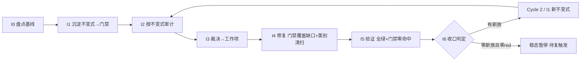

# nop-ai 不变式驱动的持续审计闭环（nop-ai Invariant-Driven Continuous Audit Loop）

> **产出方法**：`ai-dev/skills/invariant-loop-audit-prompt.md`；待经独立 fresh session 审查至共识。
> **驱动方**：`missions/nop-ai-invariant-loop.json`（范围：nop-ai 全模块组排除 MCP）
> **先例**：nop-chaos-flux `docs/backlog/ai-invariant-loop-roadmap.md`（首个闭环先例）
> **与既有线性 roadmap 的关系**：`audit-remediation-roadmap.md`（MR1-MR4/MV/MG 全 done，50/50）为**线性管道**——MG 产出为 lessons（含 Lesson 05 overclaimed closure、Lesson 08 ToolExecutor 安全边界）。本图为**闭环飞轮**——把 lessons 中识别的模式升级为可执行 CI 门禁。

## 目的

nop-ai 的 audit-remediation mission 已关闭（50/50 done），审计-修复本身已完成。问题不在于"还有未修的缺陷"，而在于**"已识别的失败模式未沉淀为防回退门禁"**——下次重构或新增方法时，同族缺陷会再次回归：

- **Secure-by-default 缺失族**：6 个兄弟实例——AUDIT-13-01/02/04（3 个 Default* 类）+ L23-SDI（4 个 Default* 类）+ AUDIT-14-01（runningExecutions putIfAbsent）+ AUDIT-09-01（NopAiAgentException 基类型）。新增 Default* 类时无门禁拦截缺 secure-default。
- **异步编排缺 timeout 族**：5 个兄弟——AUDIT-14-01（callAgent child timeout）/ -02（DBMessageService at-least-once）/ -03（LLM/tool orTimeout）/ -04（cached thread pool）/ -06（DbSessionTakeoverLock heartbeat）。新增编排入口时无门禁要求声明 timeout。
- **资源清理不对称族**：3 个兄弟——AR-02（3 个 entry-point asymmetric try/cleanup）/ AR-09（IAgentEngine AutoCloseable）/ AR-10（ICheckpointManager.remove default）。新增 entry-point 时无门禁要求对称清理。
- **虚假关闭族**：Lesson 05 整篇记录 3 次——MR2 overclaim（MA4.3 P1 未在 arm-index）/ MR1 overclaim（`_dao.beans.xml` 是 codegen 产物）/ MR3 overclaim（`DefaultAiChatExchangePersister` AES 从未提交）。无门禁验证 fix commit 的 real diff line > 0。
- **ToolExecutor 安全边界族**：Lesson 08 记录——SSRF / 路径逃逸同源 P1，集中区。新增 ToolExecutor 时无门禁要求安全边界声明。

根因 = **零可执行不变式门禁**（lessons 识别了模式但未自动化）。本闭环以**回归防护门禁**为主：把已识别的失败族沉淀为 CI 门禁，防重构回退；I2 审计为辅（验证门禁是否覆盖全部现存实例）。

## Loop Design

每个 Cycle 固定 7 步（同 nop-stream invariant-loop roadmap）。本模块的特殊性：mission 已关闭，Cycle 1 以 I1（门禁沉淀）和 I2（门禁覆盖审计）为主，I4 修复量预期较小（主要是门禁覆盖缺口补齐，而非大量新缺陷）。

## Work Item Status

> 唯一动态状态区。

| Work Item | 交付范围 | 状态 | 依赖 |
| --- | --- | --- | --- |
| Cycle 1 / I0. 不变式盘点与基线 | 从 6 deep + ARM + MR + Lesson 05/08 提取已知失败族 → 不变式目录（`ai-dev/audits/nop-ai-invariants/invariant-catalog.md`）；确认基线 = 当前零代码不变式门禁；枚举全部 Default* 类 / 编排入口 / ToolExecutor / entry-point 方法作为审计目标集 | `todo` | — |
| Cycle 1 / I1. 不变式沉淀（首批门禁） | 首批候选族：① Default* 类 secure-default 声明门禁——每个 IoC 注入的 Default* 类必须声明安全默认配置（ArchUnit / 注解扫描）；② 异步编排 timeout 声明门禁——每个编排入口（callAgent / runTurn / dispatch 等）必须声明 timeout（方法签名或注解穷举检查）；③ 资源清理对称性门禁——每个 entry-point 的 try/cleanup 对称性（JUnit / 静态扫描）；④ ToolExecutor 安全边界声明门禁——每个 ToolExecutor 实现必须声明安全边界（SSRF/路径逃逸防护）；⑤ Fix commit real-diff 验证门禁——fix commit 的 diff 不能为零实质行（防 overclaimed closure） | `todo` | I0 |
| Cycle 1 / I2. 不变式驱动审计 | 跑 I1 门禁 → red list（预期 = 门禁覆盖缺口，即已有但未声明 secure-default/timeout 的实例）+ 对抗探查 | `todo` | I1 |
| Cycle 1 / I3. 发现裁决 | red list 裁决 → P0/P1 派 I4；裁决表零悬挂 | `todo` | I2 |
| Cycle 1 / I4. 修复执行 | 门禁覆盖缺口补齐（已有实例补声明）+ 类别清扫 + test-first | `todo` | I3 |
| Cycle 1 / I5. 全量验证 | `./mvnw test -pl nop-ai -am -T 1C` + 门禁零命中 + full-green 记录 | `todo` | I4 |
| Cycle 1 / I6. 循环收口 | 统计 + 稳态判定 + 复触发条件登记（CI 变红 / 新增 Default* 类 / 周期复探）；closure 独立 fresh session | `todo` | I5 |

## Phase Details

### I0 — 不变式盘点与基线（仅 Cycle 1）

不变式目录 `ai-dev/audits/nop-ai-invariants/invariant-catalog.md`：每条含「陈述 / 覆盖失败族 / 历史 audit-finding-ID + Lesson 证据 / 检测方法」。审计目标集 = nop-ai 全部 Default* 类 / 编排入口（callAgent/runTurn/dispatch 等）/ ToolExecutor 实现 / 资源 entry-point 方法。

### I1 — 不变式沉淀

落地形式：① ArchUnit 规则（Default* 类 secure-default 注解检查，**需先引入 ArchUnit 依赖**）；② JUnit `@ParameterizedTest`（编排入口 timeout 声明穷举 + entry-point 清理对称性穷举）；③ `ai-dev/tools/*.mjs` 静态扫描（ToolExecutor 安全边界声明 + fix-commit real-diff 验证）。全部入 CI。

### I2–I6

同 nop-stream invariant-loop roadmap 的 I2–I6 方法论步骤，审计目标集换为 nop-ai 的 Default*/编排入口/ToolExecutor 面：

- **I2 审计目标**：跑 I1 五族门禁跨全部 Default* 类 / 编排入口 / ToolExecutor → red list（预期 = 门禁覆盖缺口）；对抗探查聚焦新增 Default* 子类与新编排入口。
- **I4 类别清扫面**：修任一 Default* 类的 secure-default 必 grep 全部 Default* 类；修任一编排入口的 timeout 必穷举全部编排入口。
- **I5 验证**：`./mvnw test -pl nop-ai -am -T 1C` + 五族门禁零命中。
- **I6 收口**：稳态判定 + 复触发条件（CI 变红 / 新增 Default* 类 / 周期复探）；closure 独立 fresh session。

## Dependency Graph

## Loop Rule

同 nop-stream invariant-loop roadmap，范围换为 nop-ai，结构变更触发条件换为"新增/重命名 Default* 类 / 编排入口 / ToolExecutor 实现"。

## Cross-Cutting

- **授权**：P0/P1 自动修复预授权；公共 API 变更执行前人工确认；新门禁入 CI 需 committed 回归测试。
- **范围独立**：与 `audit-remediation-roadmap.md`（已完成）范围不重叠，与 nop-stream/nop-metadata/nop-code 的 invariant-loop 范围不重叠。本图专注防回退门禁，不重复线性审计。
