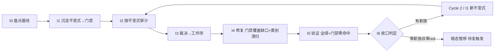

# nop-ai 不变式驱动的持续审计闭环（nop-ai Invariant-Driven Continuous Audit Loop）

> **产出方法**：`ai-dev/skills/invariant-loop-audit-prompt.md`；待经独立 fresh session 审查至共识。
> **驱动方**：`missions/nop-ai-invariant-loop.json`（范围：nop-ai 全模块组排除 MCP）
> **先例**：nop-chaos-flux 项目的 docs/backlog/ai-invariant-loop-roadmap.md（首个闭环先例，属外部项目，不在本仓库）
> **与既有线性 roadmap 的关系**：`audit-remediation-roadmap.md`（MR1-MR4/MV/MG 全 done，50/50）为**线性管道**——MG 产出为 lessons（含 Lesson 05 overclaimed closure、Lesson 08 ToolExecutor 安全边界）。本图为**闭环飞轮**——把 lessons 中识别的模式升级为可执行 CI 门禁。

## 目的

nop-ai 的 audit-remediation mission 已关闭（50/50 done），审计-修复本身已完成。问题不在于"还有未修的缺陷"，而在于**"已识别的失败模式未沉淀为防回退门禁"**——下次重构或新增方法时，同族缺陷会再次回归：

- **Secure-by-default 缺失族**：6 个兄弟实例——AUDIT-13-01/02/04（3 个 Default* 类）+ L23-SDI（4 个 Default* 类）+ AUDIT-14-01（runningExecutions putIfAbsent）+ AUDIT-09-01（NopAiAgentException 基类型）。新增 Default* 类时无门禁拦截缺 secure-default。
- **异步编排缺 timeout 族**：5 个兄弟——AUDIT-14-01（callAgent child timeout）/ -02（DBMessageService at-least-once）/ -03（LLM/tool orTimeout）/ -04（cached thread pool）/ -06（DbSessionTakeoverLock heartbeat）。新增编排入口时无门禁要求声明 timeout。
- **资源清理不对称族**：3 个兄弟——AR-02（3 个 entry-point asymmetric try/cleanup）/ AR-09（IAgentEngine AutoCloseable）/ AR-10（ICheckpointManager.remove default）。新增 entry-point 时无门禁要求对称清理。
- **虚假关闭族**：Lesson 05 整篇记录 3 次——MR2 overclaim（MA4.3 P1 未在 arm-index）/ MR1 overclaim（`_dao.beans.xml` 是 codegen 产物）/ MR3 overclaim（`DefaultAiChatExchangePersister` AES 从未提交）。无门禁验证 fix commit 的 real diff line > 0。
- **ToolExecutor 安全边界族**：Lesson 08 记录——SSRF / 路径逃逸同源 P1，集中区。新增 ToolExecutor 时无门禁要求安全边界声明。

根因 = **零可执行不变式门禁**（lessons 识别了模式但未自动化）。本闭环以**回归防护门禁**为主：把已识别的失败族沉淀为 CI 门禁，防重构回退；I2 审计为辅（验证门禁是否覆盖全部现存实例）。

## Loop Design

每个 Cycle 固定 7 步（同 nop-stream invariant-loop roadmap）。本模块的特殊性：mission 已关闭，Cycle 1 以 I1（门禁沉淀）和 I2（门禁覆盖审计）为主，I4 修复量预期较小（主要是门禁覆盖缺口补齐，而非大量新缺陷）。

## Work Item Status

> 唯一动态状态区。

| Work Item | 交付范围 | 状态 | 依赖 |
| --- | --- | --- | --- |
| Cycle 1 / I0. 不变式盘点与基线 | 从 6 deep + ARM + MR + Lesson 05/08 提取已知失败族 → 不变式目录（`ai-dev/audits/nop-ai-invariants/invariant-catalog.md`）；确认基线 = 当前零代码不变式门禁；枚举全部 Default* 类 / 编排入口 / ToolExecutor / entry-point 方法作为审计目标集 | `done` | — |
| Cycle 1 / I1. 不变式沉淀（首批门禁） | 首批候选族：① Default* 类 secure-default 声明门禁——每个 IoC 注入的 Default* 类必须声明安全默认配置（ArchUnit / 注解扫描）；② 异步编排 timeout 声明门禁——每个编排入口（callAgent / runTurn / dispatch 等）必须声明 timeout（方法签名或注解穷举检查）；③ 资源清理对称性门禁——每个 entry-point 的 try/cleanup 对称性（JUnit / 静态扫描）；④ ToolExecutor 安全边界声明门禁——每个 ToolExecutor 实现必须声明安全边界（SSRF/路径逃逸防护）；⑤ Fix commit real-diff 验证门禁——fix commit 的 diff 不能为零实质行（防 overclaimed closure） | `done` | I0 |
| Cycle 1 / I2. 不变式驱动审计 | 跑 I1 门禁 → red list（预期 = 门禁覆盖缺口，即已有但未声明 secure-default/timeout 的实例）+ 对抗探查 | `done` | I1 |
| Cycle 1 / I3. 发现裁决 | red list 裁决 → P0/P1 派 I4；裁决表零悬挂 | `done` | I2 |
| Cycle 1 / I4. 修复执行 | 门禁覆盖缺口补齐（已有实例补声明）+ 类别清扫 + test-first | `done` | I3 |
| Cycle 1 / I5. 全量验证 | `./mvnw test -pl nop-ai -am -T 1C` + 门禁零命中 + full-green 记录 | `done` | I4 |
| Cycle 1 / I6. 循环收口 | 统计 + 稳态判定 + 复触发条件登记（CI 变红 / 新增 Default* 类 / 周期复探）；closure 独立 fresh session。**Cycle 1 统计（2026-08-12 落盘）**：五族门禁 = INV-1~5（3 JUnit/ArchUnit + 2 mjs + CI job `invariant-gates`）；目标集表 33/17/30/8；red-list 44（门禁 39 + 探查 5）→ 裁决 44/44（37 fix-I4 + 1 watch + 6 N/A）→ I4 修复 5 commits → I5 full-green（三命令全绿，门禁零命中，known-gaps 5 N/A 零 drift）。**稳态判定（2026-08-12，消费 `2026-08-12-1700-1` 裁定 = watch-only residual）**：**零新族且零 red → 稳态暂停 待复触发**（复触发条件登记于 catalog §6；周期复探周期 = **30 天**，理由 = 扫描成本近似零：mjs 秒级 + 门禁随 mvn test，短周期发现窗口小）。Cycle 1 全 7 行 closed | `done` | I5 |
| Cycle 1 / I6 前置 — 探查工具化候选裁定（第六门禁族评估） | 评估 + 裁定落盘：`ai-dev/audits/nop-ai-invariants/sixth-gate-family-evaluation.md` + catalog §2 `INV-6 候选` 条 + 本注记。**裁定 = `watch-only residual`**（证据盘点结论：非高频；理由 = 机械可验证核心已由门禁①-④ 覆盖 + 行为级联动重审不可机械验证；复触发条件可判定，交 I6 复触发登记）。评估 plan = `ai-dev/plans/2026-08-12-1700-1-ai-invariant-sixth-gate-evaluation.md` | ✅ | I2/I5 遗留观察项 |
| Cycle 2 / AR-1 — AgentExecutorResolver 两参重载契约修复（`2026-08-12-1119` audit P1） | 修复 `AgentExecutorResolver` 两参重载静默丢参（plan `2026-08-12-2050-1`，已完成）：恢复 `resolveExecutor(model, toolAccessChecker, config.getPathAccessChecker())`（拆分前语义）+ `ReActAgentExecutor` package-private `getToolAccessCheckerForTest()` + 行为级 `==` 引用断言 + 负例验证（丢参→红/修复→绿）+ 9 类拆分参数传递完整性复查（118 方法对扫描 + 逐类人工核对，**零同类残留**；`TaskDispatchCoordinator` logger 为 AR-6 误报项已排除）；`./mvnw test -pl nop-ai/nop-ai-agent -am -T 1C` 3418 tests 0 failures | ✅ | `2026-08-12-1119` audit AR-1 |
| Cycle 2 / AR-2/3/4 — timeout 语义统一：超时 = 停止工作（`2026-08-12-1119` audit P1） | 收口 audit 总评方向 (3)（plan `2026-08-12-2050-2`，已完成）：**AR-2** SPAWN 双路径（`MemberFanOutDispatcher` SPAWN 分支 + `SpawnMemberAgentTaskStep` 单播）per-member timeout 经 `SpawnMemberRequest.memberExecTimeoutMs`（非接口变更）→ `DefaultMemberSpawner` 有界 `get()`（Timeout/Interrupted/Execution 显式 catch → `spawnFailed` 诚实失败）+ dispatcher 层 per-target orTimeout（阻塞 mock 场景 dispatch 有界返回）+ `TaskDispatchCoordinator.inFlightDispatches` 队列 drain 证明；**AR-3** orchestrator 整体 deadline 解耦 = `memberExecTimeoutMs × maxDepth` + 整体超时（unwrap 后 TimeoutException 限定）`ITaskRuntime.cancel(CANCEL_REASON_TIMEOUT)` 取消底层图；**AR-4** channel mode-1 fan-out 超时 cancel 原始 runAsync future + 显式 worker 线程中断（JDK CF.cancel 不中断运行中任务，实证）+ 合作型 listener 池线程释放；**门禁②升级**分支级代码计数判定（去注释/去字符串，`MemberFanOutDispatcher` 代码级 orTimeout = 2；channel 按 mode 拆条）+ 棘轮红/绿对照 + catalog §3.2 表 15/16/17 同步 + `SpawnMemberAgentTaskStep` not-applicable 登记；行为测试 8 新增全绿；`./mvnw test -pl nop-ai -am -T 1C` full-green（含全部五族门禁） | ✅ | `2026-08-12-1119` audit AR-2/AR-3/AR-4 |
| Cycle 2 / P2 — 引擎拆分残留（import 重复 AR-5 + logger 挂名 AR-6 + 超时 setter 校验不对称 AR-7）（`2026-08-12-1119` audit P2） | 引擎拆分（MA4.2-05）残留代码卫生收口（plan `2026-08-12-2311-1`，已完成）：**AR-5** nop-ai-agent 12 文件重复 import 全量去重（机械反查归零）+ 2 个测试文件（TestHookInReActLoop/TestFeishuConversationE2E）同型清理，受处理文件 check-import-order 零报错（模块 176 → 164 pre-existing 基线单调下降）；**AR-6** 8 个拆分类 Logger 归属修正 `getLogger(<本类>.class)`（`TaskDispatchCoordinator` 误报项不动）+ 5 个耦合测试类 appender 目标同步 `AgentStartupWarnings.class`（34 测试全绿）；**AR-7** 四个超时 setter 统一拒绝 `<=0`（`setLlmTimeoutMs`/`setToolTimeoutMs` 补校验，镜像既有两 setter）+ `@ParameterizedTest` 4 setter × {0,-1} 拒绝 + 正值接受（12 cases）+ catalog §2 INV-2 行锚点 `:145-147`→`:147-150` 修正 + 统一契约标注；逃生口（LlmCallCoordinator:606/AgentToolDispatcher:230/SingleTurnExecutor:132）登记 watch-only residual；`./mvnw test -pl nop-ai -am -T 1C` 8999 tests 0 failures | ✅ | `2026-08-12-1119` audit AR-5/AR-6/AR-7 |
| Cycle 2 / P2 — gate-1 负例 fixture 写入 `src/main` 的残留污染（AR-8）（`2026-08-12-1119` audit P2） | 测试基础设施卫生收口（plan `2026-08-12-2311-2`，已完成）：**AR-8** 两模块（nop-ai-agent + nop-ai-shell）gate-1 负例 fixture 从 `src/main/java/.../gatefixture` 迁到 `<module>/target/gate-fixture/`（写/扫/删共享 `FIXTURE_ROOT` 常量防漂移）+ `scanSourceTree(Path)` 参数化（无参重载保留供正例扫真实 `src/main/java`，排除规则原样复用）+ 清理升级为递归删除整个 fixture 目录；**中断残留模拟验证**（AR-8 核心价值主张直接证据）：`mvn clean` → 写独立类名残留 `DefaultKilledResidualFixture`（不删，模拟 kill -9）→ `mvn compile`（不带 clean）→ `find target/classes -name "*gatefixture*"` 零命中（残留不进产物）→ 残留在场正例单跑 + 全类全绿；正常路径 `git status` 零残留；`./mvnw test -pl nop-ai -am -T 1C` 4407 tests 0 failures | ✅ | `2026-08-12-1119` audit AR-8 |

## Phase Details

### I0 — 不变式盘点与基线（仅 Cycle 1）

不变式目录 `ai-dev/audits/nop-ai-invariants/invariant-catalog.md`：每条含「陈述 / 覆盖失败族 / 历史 audit-finding-ID + Lesson 证据 / 检测方法」。审计目标集 = nop-ai 全部 Default* 类 / 编排入口（callAgent/runTurn/dispatch 等）/ ToolExecutor 实现 / 资源 entry-point 方法。

### I1 — 不变式沉淀

落地形式：① ArchUnit 规则（Default* 类 secure-default 注解检查，**需先引入 ArchUnit 依赖**）；② JUnit `@ParameterizedTest`（编排入口 timeout 声明穷举 + entry-point 清理对称性穷举）；③ `ai-dev/tools/*.mjs` 静态扫描（ToolExecutor 安全边界声明 + fix-commit real-diff 验证）。全部入 CI。

### I2–I6

同 nop-stream invariant-loop roadmap 的 I2–I6 方法论步骤，审计目标集换为 nop-ai 的 Default*/编排入口/ToolExecutor 面：

- **I2 审计目标**：跑 I1 五族门禁跨全部 Default* 类 / 编排入口 / ToolExecutor → red list（预期 = 门禁覆盖缺口）；对抗探查聚焦新增 Default* 子类与新编排入口。
- **I4 类别清扫面**：修任一 Default* 类的 secure-default 必 grep 全部 Default* 类；修任一编排入口的 timeout 必穷举全部编排入口。
- **I5 验证**：`./mvnw test -pl nop-ai -am -T 1C` + 五族门禁零命中。
- **I6 收口**：稳态判定 + 复触发条件（CI 变红 / 新增 Default* 类 / 周期复探）；closure 独立 fresh session。

## Dependency Graph

## Loop Rule

同 nop-stream invariant-loop roadmap，范围换为 nop-ai，结构变更触发条件换为"新增/重命名 Default* 类 / 编排入口 / ToolExecutor 实现"。复触发条件登记唯一落点 = `ai-dev/audits/nop-ai-invariants/invariant-catalog.md` §6（四类基线 + watch 项 + 第六门禁族候选复评估触发条件，I6 收口定稿，本段只留指针）。

## Follow-up Backlog

> 来源：`ai-dev/audits/2026-08-12-1119-open-audit-nop-ai-invariant-loop.md`（open-ended adversarial audit）P2 findings，mission-driver 2026-08-12 分诊裁定（P2 不单独成 plan，登记本处保持可追溯）。P1（AR-1~4）已路由 plan `2026-08-12-2050-1` / `2026-08-12-2050-2`。

- [x] P2 [AR-5] `AgentCallDelegate` import 块三重复制（import-order 检查器实报 2 错）——来源 audit `2026-08-12-1119-open-audit-nop-ai-invariant-loop.md`；修复 = 删除两份重复 import 块，`node ai-dev/tools/check-import-order.mjs` 归零。**路由 plan `2026-08-12-2311-1`（Phase 1）**。
- [x] P2 [AR-6] 拆分类 Logger 挂名 `DefaultAgentEngine`（日志归属漂移）——来源 audit `2026-08-12-1119-open-audit-nop-ai-invariant-loop.md`；**live 复核修正（2026-08-12）**：audit 列 9 类中 `TaskDispatchCoordinator:37` 实为 `TeamTaskSchedulerDaemon.class`（正确，非误报项），其余 8 类（AgentExecutorResolver/AgentCallDelegate/AgentSessionLifecycle/AgentTeamBinder/AgentStartupWarnings/SessionLockRenewal/AgentSessionSupport/DefaultAgentEngineConfig）确为 `DefaultAgentEngine.class`；修复 = 8 类各改 `getLogger(X.class)`，**不动 TaskDispatchCoordinator**。**路由 plan `2026-08-12-2311-1`（Phase 2）**。
- [x] P2 [AR-7] `DefaultAgentEngineConfig` 超时 setter 校验不对称（仅 2/4 拒绝非正数，catalog 声称 4 个）——来源 audit `2026-08-12-1119-open-audit-nop-ai-invariant-loop.md`；修复 = 统一四个 setter 非正数校验或更正 catalog 语义（`setLlmTimeoutMs`/`setToolTimeoutMs` 行为相反需裁定）。**路由 plan `2026-08-12-2311-1`（Phase 3，裁定 = 统一拒绝 `<= 0`，catalog INV-2 同步）**。
- [x] P2 [AR-8] gate-1 负例测试把 fixture 写进 `src/main`（中断残留污染产物 + 门禁红）——来源 audit `2026-08-12-1119-open-audit-nop-ai-invariant-loop.md`（`TestInvariantGate1SecureDefault.java:247-262,315-327`、`TestInvariantGate1SecureDefaultShell.java:170-192`）；修复 = fixture 改写到模块 `<module>/target/gate-fixture/`（构建目录，不进产物、`mvn clean` 清除）并参数化扫描根，删除整个 fixture 目录而非单文件。**路由 plan `2026-08-12-2311-2`。已完成（2026-08-13）：两模块负例 fixture 迁至模块 build 目录（写/扫/删共享 `FIXTURE_ROOT` 常量）、`scanSourceTree(Path)` 参数化、递归目录删除；中断残留模拟验证通过（`mvn clean` → 写 `DefaultKilledResidualFixture` → `mvn compile` 产物零 gatefixture 类 → 门禁全绿）；全量 4407 tests 0 failures。**
- [x] P2 [AR-9] `dispatchTimeoutMs` javadoc 声称可由配置项控制但无任何接线（死旋钮）——来源 audit `2026-08-12-1119-open-audit-nop-ai-invariant-loop.md`（`ChannelMessageServiceImpl.java:96-100`）；修复 = `ai-gateway-defaults.beans.xml` 接线 `@cfg:nop.ai.gateway.channel.dispatchTimeoutMs|30000` property + IoC 接线验证测试（不更正 javadoc——接线兑现承诺）。**路由 plan `2026-08-12-2311-3`。已完成（2026-08-13）：`channelMessageService` bean 经 @cfg 接线（默认 30000），mode1/mode2 双 test beans.xml 镜像同步，`TestChannelMessageServiceIoC` 新增默认值 + `assignConfigValue` 覆盖值断言（反射观测 + finally 复位，4/4 绿）；独立 closure audit APPROVED（0 Blocker/0 Major）。**

## Cross-Cutting

- **授权**：P0/P1 自动修复预授权；**P2 自动修复授权为 plan 级裁定（I3 裁定，2026-08-12——mission json 原文仅 P0/P1 预授权，文本已同步）**；公共 API 变更执行前人工确认；新门禁入 CI 需 committed 回归测试。
- **范围独立**：与 `audit-remediation-roadmap.md`（已完成）范围不重叠，与 nop-stream/nop-metadata/nop-code 的 invariant-loop 范围不重叠。本图专注防回退门禁，不重复线性审计。
