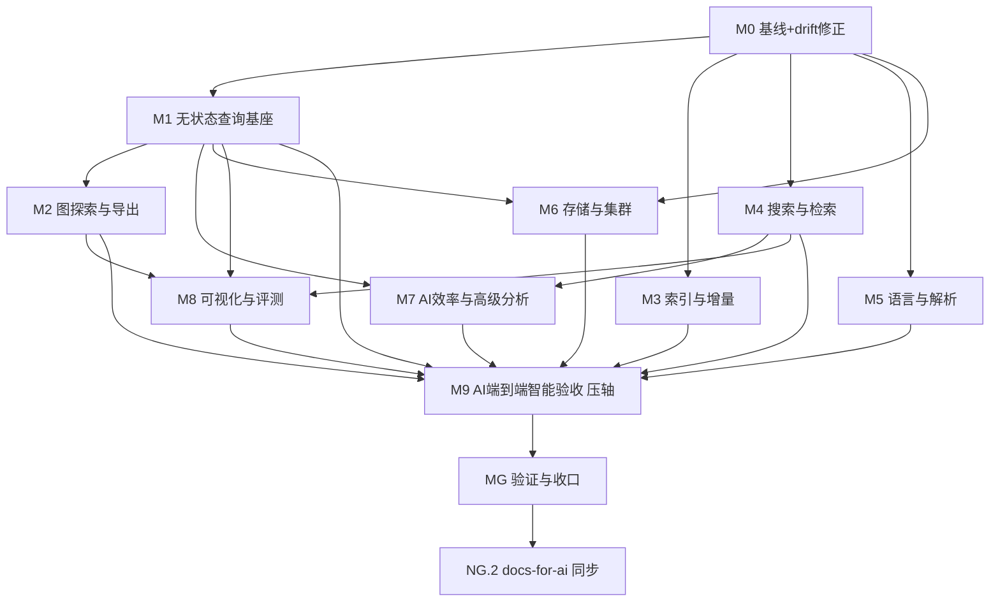

# nop-code 功能补全 Roadmap（Feature Completion）

> 最后更新：2026-09-23
> 来源：10 个开源 code graph 项目对标调研（`ai-dev/analysis/2026-09-23-codegraph-survey-vs-nop-code.md`）× `nop-code` 现状盘点 × 用户架构裁决（2026-09-23）
> 关联：
> - 设计权威：`ai-dev/design/nop-code/`（`00-vision.md` / `01-architecture-baseline.md` / `graph-discovery-and-export-design.md` / `query-api-design.md` / `semantic-edge-design.md` / `search-integration-design.md` / `flow-analysis-design.md` / `graph-analysis-design.md` / `ai-e2e-acceptance-design.md`）
> - 姊妹路线图（质量闭环，非功能）：`ai-dev/backlog/nop-code-invariant-loop-roadmap.md`
> - 上层依赖：`ai-dev/backlog/knowledge-rag-roadmap.md`（Embedding/向量后端）
> 位置：按仓库 roadmap 惯例存放于 `ai-dev/backlog/`。
> **使命**：完成后 nop-code 的**所有已知缺失功能**均已补齐；本文档是功能补全的唯一工作队列。
> 独立草案审查：待执行（见文末）

## 1. 目的

补齐 `nop-code`（Nop 平台代码索引与语义分析服务）相对成熟 code graph 工具的全部功能缺口，并落地用户于 2026-09-23 裁决的架构方向：

1. **不引入 MCP** —— GraphQL 已是通用 API 暴露协议（`docs-for-ai/02-core-guides/api-and-graphql.md` §7）。
2. **存储抽象复用现有 `IGraph`** —— `CallGraph`/`SymbolTable` 是内存实现，`CodeCallGraph` 是适配器；不新造接口。
3. **集群索引 + 无状态查询**（目标）—— 查询不在 JVM 内全量 rebuild；全局算法结果索引期物化。
4. **利用数据库图能力**（待决策）—— 评估 PostgreSQL 图索引或 Apache AGE；全局算法无法由递归 CTE 求得。
5. **框架适配不入核心** —— 框架模式经 SPI 可插拔，当前硬编码 Spring 待迁出。
6. **复用平台能力** —— nop-search（全文/向量/RRF）、nop-ai（LLM/嵌入）、nop-graph（图算法）不重建。
7. **压轴验收（M9）** —— 以 nop-entropy 自身为索引对象，端到端验证 nop-code 能有效支撑 AI 获取 Nop 平台知识、开发基于 Nop 的应用项目；这是"功能补全是否真正有效"的最终判据。

**范围外（明确不做）**：

| 范围外 | 理由 |
|--------|------|
| MCP 服务层 | GraphQL 已足够（用户裁决 + vision non-goal） |
| Hypergraph（超边） | 无明确用例；`flow_membership` 仅覆盖执行流特例（`graph-discovery-and-export-design.md` §四） |
| Obsidian Vault 导出 / 双链语法 | 特定工具格式（`graph-analysis-design.md` 已拒绝） |
| Elasticsearch | 嵌入式 Lucene（nop-search）足够 |
| IDE 集成 / LSP | vision non-goal，由专用 LSP 服务负责 |
| 代码生成 / 代码重构 | 只读索引服务（vision non-goal） |
| 运行时分析 / 性能剖析 | 聚焦静态结构分析（vision non-goal） |

## 2. Work Item Status

> **唯一动态状态区。** Milestone 仅为分组（无状态）。AI 按里程碑顺序取第一个 `todo`，起草 plan → 独立草案审查 → 执行 → 独立 closure audit 通过后标 `done`。

**汇总**：todo 36 · ready 0 · done 0

### M0 — 基线与文档-代码对齐

| Work Item | Status | Depends |
|-----------|--------|---------|
| N0.1 缺口跟踪矩阵与绿色基线（盘点全部缺失功能 + 文档 drift，在 `ai-dev/audits/` 下建立 nop-code-feature-gap-matrix 矩阵；跑 `./mvnw test -pl nop-code -am -T 1C` 确认基线） | todo | — |
| N0.2 文档-代码 drift 修正（审查发现的 7 处：`docs-for-ai/03-modules/nop-code.md` 废弃 `code-query` 权限；`query-api-design.md` 删除幻影 `CodeIndexApi` 段；`01-architecture-baseline.md` 幻影接口签名 `getPatterns()`/`EntryPointPattern`/`detect(...)` 等改为真实签名；`graph-analysis-design.md` `CommunityDetector`→`LeidenDetector`+`CommunityResult`；`semantic-edge-design.md` 去除 `DEL_FLAG` 声明；`docs-for-ai` dict 归属措辞；`CodeSymbolKind` 补 `ROUTE`） | todo | — |

### M1 — 无状态查询基座（所有查询类能力的硬前置）

| Work Item | Status | Depends |
|-----------|--------|---------|
| N1.1 `IGraph` 边属性投影增强（`CodeCallGraph` 当前只投影 CALLS 且不填 `Edge.attrs`；扩展为 typed edges：relationType/confidence/sourceFilePath/targetFilePath，覆盖 calls/inheritance/annotation/semantic） | todo | — |
| N1.2 全局算法结果持久化（社区/介数中心性/PageRank/入口点评分 → 新 ORM 表，索引期写入、查询期只读） | todo | N0.1 |
| N1.3 查询路径去全量 rebuild（图分析方法改用 N1.2 物化结果 + N1.1 边视图；移除 `CodeCacheManager` 内全量 rebuild 主路径） | todo | N1.1, N1.2 |
| N1.4 分析缓存语义对齐（`CodeCacheManager.AnalysisCache` 明确为物化结果的读缓存，失效策略对齐增量索引） | todo | N1.3 |

### M2 — 图探索与导出（设计已定：`graph-discovery-and-export-design.md`）

| Work Item | Status | Depends |
|-----------|--------|---------|
| N2.1 意外连接分析（`ISurprisingConnectionAnalyzer` + `NopCodeIndex__getSurprisingConnections`；复合惊奇评分，含降级模式与可配权重） | todo | N1.1, N1.2 |
| N2.2 图谱问题生成（`IGraphQuestionGenerator` + `NopCodeIndex__getExplorationQuestions`；机器可执行 `suggestedQuery` + `no_signal` 例外） | todo | N1.1, N1.2 |
| N2.3 图谱 Wiki 导出（`GraphWikiDTO` + `NopCodeIndex__exportGraphWiki`；标准 Markdown 互链，非 Obsidian） | todo | N1.2 |
| N2.4 自动重建触发（GraphQL mutation `triggerRebuildFromCommit` + repo→indexId 注册表 + 幂等/去抖；不做本地 watch / 内建 webhook） | todo | N1.3 |

### M3 — 索引与增量

| Work Item | Status | Depends |
|-----------|--------|---------|
| N3.1 增量依赖传播（变更文件 → 2-hop 受影响符号/文件；增强 `IncrementalDetector`） | todo | N1.3 |
| N3.2 边类型扩展（`CodeUsageKind` 增 `TESTED_BY`/`REFERENCES` + 提取器 + dict） | todo | — |

### M4 — 搜索与检索（复用 nop-search）

| Work Item | Status | Depends |
|-----------|--------|---------|
| N4.1 nop-search 引擎注入 + 索引同步（默认注入 `ISearchEngine`；索引写入时同步 `addDoc`；`CodeSearchService` 主路径从 DB LIKE 切至引擎） | todo | — |
| N4.2 向量嵌入生产实现（`ITextEmbedding` 实现，接 nop-ai 或外部 API） | todo | N4.1 |
| N4.3 混合搜索 RRF（`SearchType.HYBRID`：文本 + 向量 RRF 融合） | todo | N4.2 |

### M5 — 语言与解析

| Work Item | Status | Depends |
|-----------|--------|---------|
| N5.1 TypeScript 调用图补全（当前 `nop-code-lang-typescript` 无调用图） | todo | — |
| N5.2 框架适配迁出核心（`FlowDetector`/`JavaFileAnalyzer`/`DeadCodeDetector` 硬编码 Spring → `IEntryPointPatternProvider` SPI + IoC 注册） | todo | — |
| N5.3 DSL 驱动框架适配器（描述式路由/DI 模式 DSL，作为 N5.2 的远期演进） | todo | N5.2 |
| N5.4 语言扩展首批（Go / Rust / C#，基于 tree-sitter 绑定 + `ILanguageAdapter`） | todo | — |

### M6 — 存储与集群

| Work Item | Status | Depends |
|-----------|--------|---------|
| N6.1 数据库图后端选型决策（生产 DB + 可移植性边界；ltree/递归 CTE vs Apache AGE；局部下推 vs 全局物化边界） | todo | — |
| N6.2 `IGraph` 数据库实现（按 N6.1 决策实现第二 `IGraph` 后端，局部遍历下推） | todo | N6.1, N1.1 |
| N6.3 集群索引构建（源码分发/repo checkout 工作区 + 分片 + 原子发布 + 一致性模型） | todo | N6.1 |
| N6.4 多租户隔离与访问控制（per-index 源码访问控制、私有仓库凭据、`allowedLocalRoot` 细化为 per-index） | todo | N6.3 |

### M7 — AI 效率与高级分析

| Work Item | Status | Depends |
|-----------|--------|---------|
| N7.1 Token 效率（所有查询新增 `detailLevel` 参数 + `suggestedNextQueries` 字段） | todo | N1.3 |
| N7.2 语义边 LLM 增强（`LlmSemanticExtractor`，经 nop-ai；异步 + 成本预算 + 缓存） | todo | M4 |
| N7.3 GraphRAG 能力（社区/图数据暴露给 nop-ai-rag） | todo | N1.2 |
| N7.4 跨语言桥接（Swift↔ObjC / RN Bridge 类跨语言调用边；按需，非核心） | todo | N5.4 |

### M8 — 可视化与评测

| Work Item | Status | Depends |
|-----------|--------|---------|
| N8.1 交互式图可视化（D3.js/Cytoscape.js；前端消费 GraphML/JSON 导出） | todo | N1.1 |
| N8.2 导出格式扩展（Neo4j Cypher / 其他，与现有 GraphML/Mermaid/JSON/Markdown-Wiki 并列） | todo | N2.3 |
| N8.3 评测框架（token 效率 / 影响分析准确性 F1 / 搜索质量 MRR / 构建性能；JMH + ground-truth 项目） | todo | M1, M4 |

### M9 — AI 端到端智能验收（压轴）

> **目的**：以 nop-entropy 自身为索引对象，端到端验证 nop-code 能**有效支撑 AI 代理获取 Nop 平台知识、辅助开发基于 Nop 的应用**。这是功能补全的最终验收标准——所有 M1-M8 能力的价值以本里程碑的实测结论衡量。区别于 N8.3（工具自身指标），本里程碑测**任务级有效性**。验收契约见 `ai-dev/design/nop-code/ai-e2e-acceptance-design.md`。

| Work Item | Status | Depends |
|-----------|--------|---------|
| N9.1 自我索引与验收基线（用 nop-code 对 nop-entropy 全仓建索引：记录符号/边/文件规模、耗时、内存；定义验收 scenario 集、评分 rubric 与对照基线（仅用 grep/read 文件工具的 agent）；产出验收测试设计） | todo | M1-M8 |
| N9.2 场景 A：平台知识获取验收（20+ 覆盖平台核心领域的问题：BizModel/GraphQL、ORM/codegen、Delta、IoC、nop-wf、nop-task、nop-batch 等；AI 代理优先经 nop-code GraphQL 作答；评分=准确性对照 docs-for-ai ground truth + 引用正确性 + 工具调用数/token；与基线对照） | todo | N9.1 |
| N9.3 场景 B：应用开发辅助验收（给定 Nop 应用开发任务如"新增实体+CRUD 页面"、"实现审批流"、"编写 batch 任务"；AI 代理经 nop-code 定位平台模式/参考实现后完成任务；评分=构建/测试通过 + 平台合规（遵循 docs-for-ai 约定）+ 任务完成度；与基线对照） | todo | N9.1 |
| N9.4 验收报告与缺口回灌（汇总 N9.2/N9.3 指标，判定"有效用于"是否成立；识别 nop-code 知识盲区/失败模式 → 回灌为 roadmap 新 Work Item 或 `ai-dev/lessons/`；独立 closure audit） | todo | N9.2, N9.3 |

### MG — 验证与收口

| Work Item | Status | Depends |
|-----------|--------|---------|
| NG.1 全量验证 + 独立 closure audit（`./mvnw test -pl nop-code -am -T 1C` 全绿；逐 Work Item 对照缺口矩阵确认零残留） | todo | 全部（含 M9） |
| NG.2 docs-for-ai 同步（`03-modules/nop-code.md` + `INDEX.md` + `source-anchors.md` 终态化） | todo | NG.1 |

> Milestone 状态派生：其下全部 Work Item `done` 时自动 `done`。

## 3. 框架/平台复用

以下能力已存在，工作项**不得重建**：

| 能力 | 提供方式 |
|------|----------|
| 通用图算法（Leiden/LabelPropagation/介数中心性/BFS/PageRank/TarjanSCC/Impact/Export/Diff） | `nop-graph`（`nop-graph-api` 的 `IGraph`/`Edge` + `nop-graph-core`） |
| 存储抽象接口 | `io.nop.graph.api.IGraph`（`getOutEdges`/`getInEdges` + `Edge.attrs`） |
| 全文 + 向量 + RRF 混合搜索 | `nop-search`（`ISearchEngine`、`SearchType.TEXT/VECTOR/HYBRID`、`LuceneSearchEngine`） |
| LLM 调用 / 网关 / Agent / 嵌入 SPI | `nop-ai-core`、`nop-ai-gateway`、`nop-ai-agent`、`ITextEmbedding` |
| ORM / 增量指纹 | `nop-orm`、`OrmFingerprintStore` |
| GraphQL 暴露 | `IGraphQLEngine` + BizModel + xmeta（含 `/r/`、`/jsonrpc` 适配） |
| Java 精确解析 | JavaParser + SymbolSolver（`nop-code-lang-java`） |
| 多语言 AST | tree-sitter（`nop-code-lang-python`/`typescript`，及 `nop-treesitter` 纯 Java 运行时） |
| 图导出 | `nop-graph-core` `GraphExporter`（GraphML/Mermaid/JSON） |

## 4. 当前基线

- **已实现**：3 语言解析（Java/Python/TS，TS 无调用图）、通用图算法（经 `nop-graph`）、社区检测/关键节点/知识缺口/图导出/图快照对比、执行流/变更风险/死代码检测、确定性语义边（3 提取器）、启发式调用边（2 合成器）、GraphQL API（38+ 方法）、完整 xmeta、`IGraph` 存储抽象。
- **已知缺陷已修复**：`sourceCode` 返回 null、BizLoader `indexId` 硬编码 `"test"`（见 `query-api-design.md` §七，2026-09-23 校正）。
- **质量闭环**：由 `nop-code-invariant-loop-roadmap.md` 独立负责（OOM/去同步/删除契约/幂等四族门禁），本路线图不重复。

## 5. 里程碑依赖图

> M9 依赖全部 M1-M8：以 nop-entropy 自身为索引对象的端到端 AI 验收，是功能补全的压轴验证。MG 收口必须以 M9 通过为前提。

## 6. 横切关注点

- **执行模式**：Mission Driver 按文档顺序取第一个 `todo`；每 Work Item 起草 plan → 独立草案审查 → 执行 → 独立 closure audit → 标 `done`。
- **保护区域**：ORM 模型变更（N1.2/N3.2/N6.2）、跨模块 API、生成管线按 `AGENTS.md` 属 `plan-first`，执行前须 owner doc + 测试。
- **不做 MCP**：所有新能力经 GraphQL BizModel 暴露；不新建 MCP 服务、不新建自有 REST 端点（Nop 标准 `/r/`、`/jsonrpc` 适配除外）。
- **复用 `IGraph`**：不新造 `ICallGraph`/`ISymbolTable`。
- **文档同步**：涉及 API 变更时同步更新 `query-api-design.md` + `docs-for-ai/03-modules/nop-code.md`。
- **依赖外部路线图**：N4.2 依赖 `knowledge-rag-roadmap.md` 的 Embedding/向量后端；若未就绪则该 Work Item 保持 `todo`。
- **收口标准**：NG.1 必须以 N0.1 缺口矩阵为对照，逐项确认"零残留"，否则本路线图不可关闭。

## 7. 与其他 roadmap 的关系

| Roadmap | 关系 |
|---------|------|
| `nop-code-invariant-loop-roadmap.md` | 质量闭环（OOM/去同步/删除/幂等），与本路线图正交、不重叠 |
| `knowledge-rag-roadmap.md` | 上游依赖（Embedding/向量后端供 N4.2） |
| `nop-treesitter-roadmap.md` | 上游依赖（tree-sitter Java 运行时供 N5.4） |
| `ontology-semantic-roadmap.md` | 概念关联（语义边 LLM 增强可参考其语义层） |

## 8. 范围自检

- [ ] 覆盖对标调研 P0/P1/P2 全部建议（`ai-dev/analysis/2026-09-23-codegraph-survey-vs-nop-code.md` §8）
- [ ] 覆盖全部设计文档的"目标架构/待做"项（`01-architecture-baseline.md` §6.2、`graph-discovery-and-export-design.md`、`semantic-edge-design.md`、`search-integration-design.md`）
- [ ] 覆盖审查发现的全部文档-代码 drift（N0.2）
- [ ] **含 M9 端到端 AI 智能验收**：以 nop-entropy 自身为索引对象，验证平台知识获取 + 应用开发辅助两类场景的有效性
- [ ] 每个 Work Item 为单次 AI 会话可完成粒度，产物单一、可独立验证
- [ ] 工作项与设计文档的接口名一致（`IGraph`/`ISurprisingConnectionAnalyzer`/`IGraphQuestionGenerator`/`GraphWikiDTO` 等）
- [ ] 初始状态全 `todo`，无预填 `ready`/`done`
- [ ] 范围外清单与 vision non-goals 一致

## 9. M9 验收场景补充说明

M9 是"功能补全是否真正有效"的最终判据，不是又一组指标测试。其验收内涵：

| 验收问题 | 判据 |
|---------|------|
| nop-code 能否支撑 AI **获取 Nop 平台知识**？ | 场景 A 的答案准确率 + 引用正确率显著优于仅用 grep/read 的基线 |
| nop-code 能否支撑 AI **开发基于 Nop 的应用**？ | 场景 B 的任务完成率 + 构建/测试通过率 + 平台合规率达标 |
| nop-code 的探索能力（意外连接/问题生成/Wiki）是否被 AI 实际使用并受益？ | 验收日志中这些 API 的调用与增益证据 |
| 相对基线，token/工具调用效率是否有增益？ | 对照基线的相对效率比 |

**失败回灌**：若 M9 发现能力有效性不足，产出**不可**仅记录——必须回灌为新的 Work Item（补入本 roadmap，M9.4 负责）或 `ai-dev/lessons/`，直至复测通过。这是"确保完成后所有缺失功能都补充完毕"的闭环保证。
