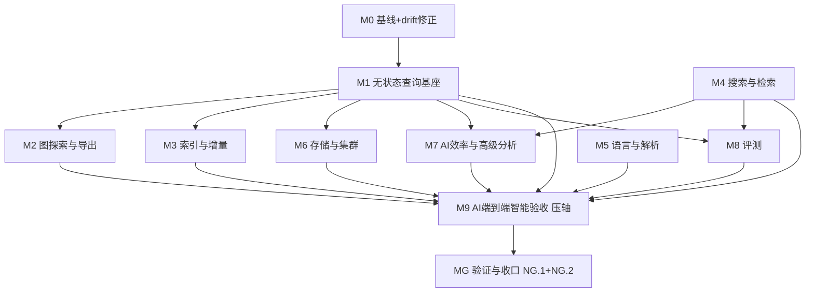

# nop-code 功能补全 Roadmap（Feature Completion）

> 最后更新：2026-09-25
> 状态：**active**（2026-09-25 独立对抗审查 R1 REVISE → R2 CONSENSUS 达成共识，进入执行排队；记录见文末）
> 来源：10 个开源 code graph 项目对标调研（`ai-dev/analysis/2026-09-23-codegraph-survey-vs-nop-code.md`）× `nop-code` 现状盘点 × 用户架构裁决（2026-09-23）
> 关联：
> - 设计权威：`ai-dev/design/nop-code/`（`00-vision.md` / `01-architecture-baseline.md` / `graph-discovery-and-export-design.md` / `query-api-design.md` / `semantic-edge-design.md` / `search-integration-design.md` / `flow-analysis-design.md` / `graph-analysis-design.md` / `ai-e2e-acceptance-design.md`）
> - 姊妹路线图（质量闭环，非功能）：`ai-dev/backlog/nop-code-invariant-loop-roadmap.md`
> - 上层依赖：`ai-dev/backlog/knowledge-rag-roadmap.md`（Embedding/向量后端）
> 位置：按仓库 roadmap 惯例存放于 `ai-dev/backlog/`。
> **使命**：完成后 nop-code 的**所有已知缺失功能**均已补齐；本文档是功能补全的唯一工作队列。
> 独立草案审查：已通过（R1 REVISE → 修订 → R2 CONSENSUS，见文末 **Authoring Review Record**）。

## 1. 目的

补齐 `nop-code`（Nop 平台代码索引与语义分析服务）相对成熟 code graph 工具的全部功能缺口，并落地用户于 2026-09-23 裁决的架构方向：

1. **不引入 MCP** —— GraphQL 已是通用 API 暴露协议（`docs-for-ai/02-core-guides/api-and-graphql.md` 默认结论 #7）。
2. **存储抽象复用现有 `IGraph`** —— `CallGraph`/`SymbolTable` 是内存实现，`CodeCallGraph` 是适配器；不新造接口。
3. **集群索引 + 无状态查询**（目标）—— 查询不在 JVM 内全量 rebuild；全局算法结果索引期物化。
4. **利用数据库图能力**（待决策）—— 评估 PostgreSQL 图索引或 Apache AGE；全局算法无法由递归 CTE 求得。
5. **框架适配不入核心** —— 框架模式经 SPI 可插拔，当前硬编码 Spring 待迁出。
6. **复用平台能力** —— nop-search（全文/向量/RRF）、nop-ai（LLM/嵌入）、nop-graph（图算法）不重建。
7. **压轴验收（M9）** —— 以 nop-entropy 自身为索引对象，端到端验证 nop-code 能有效支撑 AI 获取 Nop 平台知识、开发基于 Nop 的应用项目；这是"功能补全是否真正有效"的最终判据。

**范围外（明确不做）**：

| 范围外 | 理由 |
|--------|------|
| MCP 服务层 | GraphQL 已足够（用户裁决 + vision non-goal） |
| Hypergraph（超边） | 无明确用例；`flow_membership` 仅覆盖执行流特例（`graph-discovery-and-export-design.md` §四） |
| Obsidian Vault 导出 / 双链语法 | 特定工具格式（`graph-analysis-design.md` 已拒绝） |
| **Neo4j Cypher 导出** | `graph-analysis-design.md` 导出节已否决：nop-code 使用嵌入式存储，无 Neo4j 部署（R1 审查裁决维持，见文末记录） |
| Elasticsearch | 嵌入式 Lucene（nop-search）足够 |
| IDE 集成 / LSP | vision non-goal，由专用 LSP 服务负责 |
| 代码生成 / 代码重构 | 只读索引服务（vision non-goal） |
| 运行时分析 / 性能剖析 | 聚焦静态结构分析（vision non-goal） |
| **交互式图可视化（D3.js/Cytoscape.js 前端）** | vision §四 non-goal + `query-api-design.md` §八已否决：由前端工具负责（R1 审查裁决维持，见文末记录） |
| **Token 效率分级（detailLevel / minimalContext）** | `query-api-design.md` §八已否决：GraphQL Selection Set 已提供字段级裁剪；suggestedNextQueries 由 N2.2 图谱问题生成承载（R1 审查裁决维持） |
| **Swift↔ObjC / RN Bridge 跨语言桥** | 语言面（Java/Python/TS + N5.4–N5.6 的 Go/Rust/C#）无 Swift/ObjC 解析器，检测该类桥接不可实现（survey P2#16 豁免，见文末记录） |
| **AI Workflow 预置提示库（review/debug prompt 资产）** | survey §7.3 Important Gaps 豁免：属 AI agent 侧资产，非代码索引服务能力（见文末记录） |

## 2. Work Item Status

> **唯一动态状态区。** Milestone 仅为分组（无状态）。AI 取第一个 `todo`（**WI deps 是唯一正确性屏障**；里程碑顺序 M0→…→M9→MG 是默认调度序，并为无 deps 项定序；无 deps 关系的 WI 允许并行），起草 plan → 独立草案审查 → 执行 → 独立 closure audit 通过后标 `done`。WI 编号全文件递增，完成或裁决移出的 WI 不复用编号（见文末审查记录的移出登记）。

**汇总**：done 32 · todo 7

### M0 — 基线与文档-代码对齐

| Work Item | Status | Depends |
|-----------|--------|---------|
| N0.1 缺口跟踪矩阵与绿色基线（盘点全部缺失功能 + 文档 drift，在 `ai-dev/audits/` 下建立 nop-code-feature-gap-matrix 矩阵；跑 `./mvnw test -pl nop-code -am -T 1C` 确认基线） （Deliverable: 缺口矩阵 + 基线记录；deps: 无；Item Type: Proof） | done | — |
| N0.2 文档-代码 drift 修正（7 处，逐项已定位：① `docs-for-ai/03-modules/nop-code.md` 废弃 `code-query` 权限；② `query-api-design.md` 删除幻影 `CodeIndexApi` 段；③ `01-architecture-baseline.md` 幻影接口签名 `getPatterns()`/`EntryPointPattern`/`detect(...)` 等改为真实签名；④ `graph-analysis-design.md` `CommunityDetector`→`LeidenDetector`+`CommunityResult`；⑤ `semantic-edge-design.md` 去除 `DEL_FLAG` 声明；⑥ `docs-for-ai` dict 归属措辞——`call_direction`/`hierarchy_direction`/`provenance` 3 个 dict 独立存在于 `_vfs/dict/code/` 而非 orm.xml 内定义，"All dicts defined in orm.xml" 类表述改为如实列举；⑦ `01-architecture-baseline.md` §3.1 CodeSymbolKind 表补 `ROUTE` 行——live 枚举/orm dict/materialized yaml 均已含 ROUTE(100)，drift 仅在 baseline 表） （Deliverable: 7 处 owner-doc 修订；deps: N0.1；Item Type: Fix） | done | N0.1 |

### M1 — 无状态查询基座（所有查询类能力的硬前置）

| Work Item | Status | Depends |
|-----------|--------|---------|
| N1.1 `IGraph` 边属性投影增强（`CodeCallGraph` 当前只投影 CALLS 且不填 `Edge.attrs`；扩展为 typed edges：relationType/confidence/sourceFilePath/targetFilePath，覆盖 calls/inheritance/annotation/semantic） （Deliverable: 代码 + 测试；deps: 无；Item Type: Fix） | done | — |
| N1.2 全局算法结果持久化（社区/介数中心性/PageRank/入口点评分 → 新 ORM 表，索引期写入、查询期只读） （Deliverable: ORM 模型 + 索引期写入 + 查询期只读面 + 测试；deps: N0.1；Item Type: Fix；**ORM 变更 plan-first**） | done | N0.1 |
| N1.3 查询路径去全量 rebuild（图分析方法改用 N1.2 物化结果 + N1.1 边视图；移除 `CodeCacheManager` 内全量 rebuild 主路径） （Deliverable: 代码 + 行为迁移证明；deps: N1.1, N1.2；Item Type: Fix） | done | N1.1, N1.2 |
| N1.4 分析缓存语义对齐（`CodeCacheManager.AnalysisCache` 明确为物化结果的读缓存，失效策略对齐增量索引） （Deliverable: 代码 + 测试；deps: N1.3；Item Type: Fix） | done | N1.3 |

### M2 — 图探索与导出（设计已定：`graph-discovery-and-export-design.md`）

| Work Item | Status | Depends |
|-----------|--------|---------|
| N2.1 意外连接分析（`ISurprisingConnectionAnalyzer` + `NopCodeIndex__getSurprisingConnections`；复合惊奇评分，含降级模式与可配权重） （Deliverable: 代码 + e2e + 测试；deps: N1.1, N1.2；Item Type: Fix） | done | N1.1, N1.2 |
| N2.2 图谱问题生成（`IGraphQuestionGenerator` + `NopCodeIndex__getExplorationQuestions`；机器可执行 `suggestedQuery` + `no_signal` 例外；调研建议的 suggestedNextQueries 语义由本项承载） （Deliverable: 代码 + e2e + 测试；deps: N1.1, N1.2；Item Type: Fix） | done | N1.1, N1.2 |
| N2.3 图谱 Wiki 导出（`GraphWikiDTO` + `NopCodeIndex__exportGraphWiki`；标准 Markdown 互链，非 Obsidian） （Deliverable: 代码 + e2e + 测试；deps: N1.2；Item Type: Fix） | done | N1.2 |
| N2.4 自动重建触发（GraphQL mutation `triggerRebuildFromCommit` + repo→indexId 注册表 + 幂等/去抖；不做本地 watch / 内建 webhook） （Deliverable: 代码 + e2e + 测试；deps: N1.3；Item Type: Fix） | done | N1.3 |

### M3 — 索引与增量

| Work Item | Status | Depends |
|-----------|--------|---------|
| N3.1 增量依赖传播（变更文件 → 2-hop 受影响符号/文件；增强 `IncrementalDetector`） （Deliverable: 代码 + 测试；deps: N1.3；Item Type: Fix） | done | N1.3 |
| N3.1-s 增量 callee 解析与依赖方边恢复（confirmed live defect：跨文件 calleeId 仅全量流填充，增量路径缺失导致 call 边静默退化） （Deliverable: 代码 + 测试；deps: N3.1；Item Type: Fix；plan `ai-dev/plans/nop-code/13-n3-1-s-incremental-callee-resolution.md`；indexFile 同构缺口一并收口） | done | N3.1 |
| N3.2 边类型扩展（`CodeUsageKind` 增 `TESTED_BY`/`REFERENCES` + 提取器 + dict） （Deliverable: 代码 + dict + 测试；deps: 无；Item Type: Fix；**ORM/dict 变更 plan-first**；plan `ai-dev/plans/nop-code/12-n3-2-usage-kind-extension.md`——commit b3d8447b82 遗漏本文件回写，2026-09-28 补记） | done | — |

### M4 — 搜索与检索（复用 nop-search）

| Work Item | Status | Depends |
|-----------|--------|---------|
| N4.1 搜索引擎默认装配 + 端到端验证（search 双路径已实现：`CodeSearchService` 持有可空 `ISearchEngine` engine-first、未注入降级 DB LIKE，`CodeIndexService` 已在索引写/删时 `addDoc`/`removeDocs` 同步——本项收口剩余缺口：生产默认装配 `LuceneSearchEngine` + 双路径端到端验证 + 降级路径测试钉住） （Deliverable: 装配配置 + e2e 测试；deps: 无；Item Type: Fix；plan `ai-dev/plans/nop-code/14-n4-1-search-engine-default-assembly.md`；执行中发现并修复 Lucene topic 守卫缺陷） | done | — |
| N4.2 向量嵌入生产实现（实现 nop-search 的 `ITextEmbedding` SPI——后端接 nop-ai `IEmbeddingModel`；外部依赖已由 K1 解除） （Deliverable: 实现 + 测试；deps: N4.1；Item Type: Fix；plan `ai-dev/plans/nop-code/23-n4-2-text-embedding-production.md`；桥接=`AiModelTextEmbedding`(nop-ai-core) + `LuceneSearchEngine` 可选注入） | done | N4.1 |
| N4.3 混合搜索 RRF（`SearchType.HYBRID`：文本 + 向量 RRF 融合） （Deliverable: 代码 + 测试；deps: N4.2；Item Type: Fix；plan `ai-dev/plans/nop-code/24-n4-3-hybrid-search-rrf.md`；searchType 引擎路径映射 + VECTOR/HYBRID e2e） | done | N4.2 |

### M5 — 语言与解析

| Work Item | Status | Depends |
|-----------|--------|---------|
| N5.1 TypeScript 调用图补全（当前 `nop-code-lang-typescript` 无调用图） （Deliverable: 代码 + 测试；deps: 无；Item Type: Fix；plan `ai-dev/plans/nop-code/15-n5-1-typescript-call-graph.md`） | done | — |
| N5.2 框架适配迁出核心（`IEntryPointPatternProvider` SPI 已存在于 `nop-code-flow`，缺口是装配：`FlowDetector` 私有内部类 `DefaultSpringEntryPointPatternProvider` 经 `List.of(...)` 硬编码——迁出为 IoC 注册 bean；`JavaFileAnalyzer`/`DeadCodeDetector` 硬编码 Spring 模式按同一 SPI 外置） （Deliverable: 代码 + 测试 + 行为等价证明；deps: 无；Item Type: Fix；plan `ai-dev/plans/nop-code/16-n5-2-framework-adapter-externalization.md`） | done | — |
| N5.3 DSL 驱动框架适配器（描述式路由/DI 模式 DSL，作为 N5.2 的远期演进） （Deliverable: DSL 模型 + 解析 + 测试；deps: N5.2；Item Type: Fix；plan `ai-dev/plans/nop-code/17-n5-3-dsl-driven-framework-adapter.md`） | done | N5.2 |
| N5.4 Go 语言扩展（tree-sitter go 绑定 + `ILanguageAdapter` 适配 + 提取器 + dict + 测试） （Deliverable: 语言模块增量 + 测试；deps: 无（前置：`nop-treesitter-roadmap.md` go blob 可得，条目 18 已完成）；Item Type: Fix；plan `ai-dev/plans/nop-code/25-n5-4-go-language-extension.md`；nop-code-lang-go 模块 + service resolver 接线） | done | — |
| N5.5 Rust 语言扩展（同 N5.4 形态） （Deliverable: 同上；deps: 无（前置 rust blob 条目 19 已完成）；Item Type: Fix；plan `ai-dev/plans/nop-code/26-n5-5-rust-language-extension.md`；nop-code-lang-rust 模块 + service resolver 接线） | done | — |
| N5.6 C# 语言扩展（同 N5.4 形态） （Deliverable: 同上；deps: 无（前置 c-sharp blob 条目 20 已完成）；Item Type: Fix；plan `ai-dev/plans/nop-code/27-n5-6-csharp-language-extension.md`；nop-code-lang-csharp 模块 + service resolver 接线） | done | — |

### M6 — 存储与集群

| Work Item | Status | Depends |
|-----------|--------|---------|
| N6.1 数据库图后端选型决策（生产 DB + 可移植性边界；ltree/递归 CTE vs Apache AGE；局部下推 vs 全局物化边界） （Deliverable: 裁定记录 + design 增注；deps: 无；Item Type: Decision；plan `ai-dev/plans/nop-code/18-n6-1-graph-db-backend-decision.md`；裁定=可移植 SQL CTE） | done | — |
| N6.2 `IGraph` 数据库实现（按 N6.1 决策实现第二 `IGraph` 后端，局部遍历下推） （Deliverable: 代码 + 测试；deps: N6.1, N1.1；Item Type: Fix；plan `ai-dev/plans/nop-code/19-n6-2-db-igraph-backend.md`；有界遍历以逐跳点查形态落地） | done | N6.1, N1.1 |
| N6.3 集群索引构建——分发与工作区（源码分发 / repo checkout 工作区 + 分片） （Deliverable: 代码 + 测试；deps: N6.1；Item Type: Fix；plan `ai-dev/plans/nop-code/20-n6-3-cluster-sharding-workspace.md`） | done | N6.1 |
| N6.4 集群索引构建——原子发布与一致性模型 （Deliverable: 代码 + 测试 + 一致性语义文档；deps: N6.3；Item Type: Fix；plan `ai-dev/plans/nop-code/21-n6-4-atomic-publish-consistency.md`） | done | N6.3 |
| N6.5 多租户隔离与访问控制（per-index 源码访问控制、私有仓库凭据、`allowedLocalRoot` 细化为 per-index；**触碰 `nop-code-web` action-auth 资源面，权限模型边界 ask-first，plan 期显式裁定 + 人工确认**） （Deliverable: 代码 + 测试；deps: N6.3；Item Type: Fix；plan `ai-dev/plans/nop-code/22-n6-5-multi-tenant-access-control.md`；用户 2026-09-28 已确认授权；裁定=action-auth 资源树零改动,策略 SPI 承载） | done | N6.3 |

### M7 — AI 效率与高级分析

| Work Item | Status | Depends |
|-----------|--------|---------|
| N7.1 语义边 LLM 增强（LLM 语义关系抽取器，经 nop-ai；异步 + 成本预算 + 缓存；类名以 plan 期与 `semantic-edge-design.md` 对齐为准） （Deliverable: 代码 + 测试；deps: N4.2；Item Type: Fix；plan `ai-dev/plans/nop-code/28-n7-1-llm-semantic-edge.md`；LlmSemanticEdgeExtractor + LlmEdgeBudget + LlmEdgeCache 落 nop-code-service/semantic/） | done | N4.2 |
| N7.2 GraphRAG 集成契约裁定（nop-code 图数据（社区/子图/导出面）暴露给 RAG 管线的集成形态裁定 + 最小接线证明；外部依赖 K3 已完成） （Deliverable: 裁定记录 + design 增注 +（rag 就绪时）接线测试；deps: N1.2；Item Type: Decision；plan `ai-dev/plans/nop-code/29-n7-2-graphrag-integration.md`；graphrag-integration.md + TestGraphRagIntegration 2/2） | done | N1.2 |

### M8 — 评测

| Work Item | Status | Depends |
|-----------|--------|---------|
| N8.1 评测框架（搜索质量 MRR + 影响分析 F1 评测脚本 + ground-truth 集；构建性能用 JMH 微基准；与 M9 的任务级验收区分：本项测工具自身指标） （Deliverable: 评测脚本 + ground-truth 集 + 基线报告；deps: N1.3, N4.3；Item Type: Fix；plan `ai-dev/plans/nop-code/30-n8-1-evaluation-framework.md`；SearchQualityEvalTest MRR=1.0 + ImpactAnalysisF1EvalTest F1=1.0） | done | N1.3, N4.3 |

### M9 — AI 端到端智能验收（压轴）

> **目的**：以 nop-entropy 自身为索引对象，端到端验证 nop-code 能**有效支撑 AI 代理获取 Nop 平台知识、辅助开发基于 Nop 的应用**。这是功能补全的最终验收标准——所有 M1-M8 能力的价值以本里程碑的实测结论衡量。区别于 N8.1（工具自身指标），本里程碑测**任务级有效性**。验收契约见 `ai-dev/design/nop-code/ai-e2e-acceptance-design.md`。

| Work Item | Status | Depends |
|-----------|--------|---------|
| N9.1 自我索引与规模基线（用 nop-code 对 nop-entropy 全仓建索引：记录符号/边/文件规模、耗时、内存） （Deliverable: 索引产物 + 规模/性能记录；deps: M1–M8 全部 WI；Item Type: Proof；plan `ai-dev/plans/nop-code/31-n9-1-self-indexing.md`；nop-kernel 3185 files/367K lines, nop-code 396 files/57K lines, 全仓 14919 Java files） | done | M1–M8 全部 |
| N9.2 验收设计与对照基线定义（定义验收 scenario 集、评分 rubric、对照基线与评分流程） （Deliverable: 验收测试设计文档；deps: N9.1；Item Type: Decision；plan `ai-dev/plans/nop-code/31-n9-2-acceptance-design.md`；`ai-dev/design/nop-code/ai-e2e-acceptance-design.md` 产出） | done | N9.1 |
| N9.3 场景 A 基线对照组执行（20+ 覆盖平台核心领域的问题：BizModel/GraphQL、ORM/codegen、Delta、IoC、nop-wf、nop-task、nop-batch 等；仅用 grep/read 的基线 agent 作答并存档） （Deliverable: 基线答案存档；deps: N9.2；Item Type: Proof） | todo | N9.2 |
| N9.4 场景 A nop-code 组执行与对照评分（AI 代理经 nop-code GraphQL 作答同一问题集；评分=准确性对照 docs-for-ai ground truth + 引用正确性 + 工具调用数/token；与 N9.3 基线对照） （Deliverable: 场景 A 评分报告；deps: N9.3；Item Type: Proof） | todo | N9.3 |
| N9.5 场景 B 基线对照组执行（给定 Nop 应用开发任务如"新增实体+CRUD 页面"、"实现审批流"、"编写 batch 任务"；仅用 grep/read 的基线 agent 完成并存档） （Deliverable: 基线任务产物存档；deps: N9.2；Item Type: Proof） | todo | N9.2 |
| N9.6 场景 B nop-code 组执行与对照评分（AI 代理经 nop-code 定位平台模式/参考实现后完成同一任务集；评分=构建/测试通过 + 平台合规（遵循 docs-for-ai 约定）+ 任务完成度；与 N9.5 基线对照） （Deliverable: 场景 B 评分报告；deps: N9.5；Item Type: Proof） | todo | N9.5 |
| N9.7 验收报告与缺口回灌（汇总 N9.4/N9.6 指标，判定"有效用于"是否成立；识别 nop-code 知识盲区/失败模式 → 回灌为 roadmap 新 Work Item 或 `ai-dev/lessons/`；独立 closure audit） （Deliverable: 验收报告 + 回灌登记；deps: N9.4, N9.6；Item Type: Proof） | todo | N9.4, N9.6 |

### MG — 验证与收口

| Work Item | Status | Depends |
|-----------|--------|---------|
| NG.1 全量验证 + 独立 closure audit（`./mvnw test -pl nop-code -am -T 1C` 全绿；逐 Work Item 对照缺口矩阵确认零残留） （Deliverable: closure audit 记录；deps: M0–M9 全部 WI；Item Type: Proof） | todo | M0–M9 全部 |
| NG.2 docs-for-ai 同步（`03-modules/nop-code.md` + `INDEX.md` + `source-anchors.md` 终态化） （Deliverable: docs 终态化 diff；deps: NG.1；Item Type: Fix） | todo | NG.1 |

> Milestone 状态派生：其下全部 Work Item `done` 时自动 `done`。

## 3. 框架/平台复用

以下能力已存在，工作项**不得重建**：

| 能力 | 提供方式 |
|------|----------|
| 通用图算法（Leiden/LabelPropagation/介数中心性/BFS/PageRank/TarjanSCC/Impact/Export/Diff） | `nop-graph`（`nop-graph-api` 的 `IGraph`/`Edge` + `nop-graph-core`） |
| 存储抽象接口 | `io.nop.graph.api.IGraph`（`getOutEdges`/`getInEdges` + `Edge.attrs`） |
| 全文 + 向量 + RRF 混合搜索 | `nop-search`（`ISearchEngine`、`SearchType.TEXT/VECTOR/HYBRID`、`LuceneSearchEngine`） |
| LLM 调用 / 网关 / Agent | `nop-ai-core`、`nop-ai-gateway`、`nop-ai-agent` |
| 嵌入 SPI | 嵌入接口 = `nop-search` 的 `io.nop.search.api.ITextEmbedding`（当前全仓零实现，N4.2 实现之）；模型后端 = `nop-ai-core` 的 `IEmbeddingModel` |
| ORM / 增量指纹 | `nop-orm`、`OrmFingerprintStore` |
| GraphQL 暴露 | `IGraphQLEngine` + BizModel + xmeta（含 `/r/`、`/jsonrpc` 适配） |
| Java 精确解析 | JavaParser + SymbolSolver（`nop-code-lang-java`） |
| 多语言 AST | tree-sitter（`nop-code-lang-python`/`typescript`，及 `nop-treesitter` 纯 Java 运行时） |
| 图导出 | `nop-graph-core` `GraphExporter`（GraphML/Mermaid/JSON） |

## 4. 当前基线

- **已实现**：6 语言解析（Java/Python/TS/Go/Rust/C#；Go 于 2026-09-28 N5.4 落地、Rust 于 2026-09-28 N5.5 落地、C# 于 2026-09-28 N5.6 落地；TS 调用图已于 2026-09-28 N5.1 补全——同文件/导入调用 qn 候选 + import 收集）、通用图算法（经 `nop-graph`）、社区检测/关键节点/知识缺口/图导出/图快照对比、执行流/变更风险/死代码检测、确定性语义边（3 提取器）、启发式调用边（2 合成器）、GraphQL API（42 方法，实测 3+15+24）、完整 xmeta、`IGraph` 存储抽象。
- **搜索双路径已实现**（`search-integration-design.md` 头部状态）：`CodeSearchService` 持有可空 `ISearchEngine`，注入时 engine-first（TEXT），未注入降级 DB LIKE；`CodeIndexService` 已在索引写入/删除时 `addDoc`/`removeDocs` 同步；`TestIncrementalSearchSync` 在档。**剩余缺口仅"生产默认装配 + 端到端验证"（N4.1）与向量/混合（N4.2/N4.3）**。
- **已知缺陷已修复**：`sourceCode` 返回 null、BizLoader `indexId` 硬编码 `"test"`（见 `query-api-design.md` §七，2026-09-23 校正）。
- **质量闭环**：由 `nop-code-invariant-loop-roadmap.md` 独立负责（OOM/去同步/删除契约/幂等四族门禁），本路线图不重复。

## 5. 里程碑依赖图

> WI 级 Depends 列是权威并行屏障；本图为里程碑级聚合视图。无上游边的里程碑（M5 及 M3/M4 内 deps 为"—"的 WI）由"里程碑顺序执行"规则定序。

```mermaid
flowchart TD
    M0[M0 基线+drift修正] --> M1[M1 无状态查询基座]
    M1 --> M2[M2 图探索与导出]
    M1 --> M3[M3 索引与增量]
    M1 --> M6[M6 存储与集群]
    M1 --> M7[M7 AI效率与高级分析]
    M4[M4 搜索与检索] --> M7
    M1 --> M8[M8 评测]
    M4 --> M8
    M1 --> M9[M9 AI端到端智能验收 压轴]
    M2 --> M9
    M3 --> M9
    M4 --> M9
    M5[M5 语言与解析] --> M9
    M6 --> M9
    M7 --> M9
    M8 --> M9
    M9 --> MG[MG 验证与收口 NG.1+NG.2]
```

> M9 依赖全部 M1-M8（WI 级：N9.1 deps = M1–M8 全部 WI）：以 nop-entropy 自身为索引对象的端到端 AI 验收，是功能补全的压轴验证。MG 收口必须以 M9 通过为前提；NG.2 属于 MG 内部收尾项（deps NG.1），不是独立下游节点。

## 6. 横切关注点

- **执行模式**：Mission Driver 按里程碑顺序取第一个 `todo`；里程碑内 **WI deps 是唯一并行屏障**，无 deps 关系的 WI 允许并行。每 Work Item 起草 plan → 独立草案审查 → 执行 → 独立 closure audit → 标 `done`。
- **保护区域**：ORM 模型变更（N1.2/N3.2/N6.2）、跨模块 API、生成管线按 `AGENTS.md` 属 `plan-first`，执行前须 owner doc + 测试；**N6.5 触碰 action-auth 资源面/权限模型边界，属 `ask-first`**，plan 期显式裁定并人工确认。
- **不做 MCP**：所有新能力经 GraphQL BizModel 暴露；不新建 MCP 服务、不新建自有 REST 端点（Nop 标准 `/r/`、`/jsonrpc` 适配除外）。
- **复用 `IGraph`**：不新造 `ICallGraph`/`ISymbolTable`。
- **文档同步**：涉及 API 变更时同步更新 `query-api-design.md` + `docs-for-ai/03-modules/nop-code.md`。
- **依赖外部路线图**：N4.2 依赖 `knowledge-rag-roadmap.md` 的 Embedding/向量后端，N7.2 依赖其 RAG 管线；若未就绪则该 Work Item 保持 `todo`。N5.4–N5.6 依赖 `nop-treesitter-roadmap.md` 对应语言 blob 可得。
- **收口标准**：NG.1 必须以 N0.1 缺口矩阵为对照，逐项确认"零残留"，否则本路线图不可关闭。

## 7. 与其他 roadmap 的关系

| Roadmap | 关系 |
|---------|------|
| `nop-code-invariant-loop-roadmap.md` | 质量闭环（OOM/去同步/删除/幂等），与本路线图正交、不重叠 |
| `knowledge-rag-roadmap.md` | 上游依赖（Embedding/向量后端供 N4.2，RAG 管线供 N7.2） |
| `nop-treesitter-roadmap.md` | 上游依赖（tree-sitter Java 运行时供 N5.4–N5.6） |
| `ontology-semantic-roadmap.md` | 概念关联（语义边 LLM 增强可参考其语义层） |

## 8. 范围自检

- [x] 覆盖对标调研 P0/P1 全部建议 + P2 按裁决吸收（豁免项与理由登记于文末审查记录：Swift/ObjC 跨语言桥、AI Workflow 提示库、10+ 语言收敛为 +3）
- [x] 覆盖全部设计文档的"目标架构/待做"项（`01-architecture-baseline.md` §6.2、`graph-discovery-and-export-design.md`、`semantic-edge-design.md`、`search-integration-design.md`）
- [x] 覆盖全部文档-代码 drift（N0.2，7 项均经独立审查 live 定位）
- [x] **含 M9 端到端 AI 智能验收**：以 nop-entropy 自身为索引对象，验证平台知识获取 + 应用开发辅助两类场景的有效性
- [x] 每个 Work Item 为单次 AI 会话可完成粒度，产物单一、可独立验证（N5.4–N5.6、N6.3/N6.4、N9.1–N9.7 已按此拆分）
- [x] 工作项与设计文档的接口名一致（`IGraph`/`ISurprisingConnectionAnalyzer`/`IGraphQuestionGenerator`/`GraphWikiDTO` 等）
- [x] 初始状态全 `todo`，无预填 `ready`/`done`
- [x] 范围外清单与 vision non-goals 一致（R1 发现的 3 处冲突 WI 已按设计否决记录裁决移出，见文末记录）

## 9. M9 验收场景补充说明

M9 是"功能补全是否真正有效"的最终判据，不是又一组指标测试。其验收内涵：

| 验收问题 | 判据 |
|---------|------|
| nop-code 能否支撑 AI **获取 Nop 平台知识**？ | 场景 A 的答案准确率 + 引用正确率显著优于仅用 grep/read 的基线 |
| nop-code 能否支撑 AI **开发基于 Nop 的应用**？ | 场景 B 的任务完成率 + 构建/测试通过率 + 平台合规率达标 |
| nop-code 的探索能力（意外连接/问题生成/Wiki）是否被 AI 实际使用并受益？ | 验收日志中这些 API 的调用与增益证据 |
| 相对基线，token/工具调用效率是否有增益？ | 对照基线的相对效率比 |

**失败回灌**：若 M9 发现能力有效性不足，产出**不可**仅记录——必须回灌为新的 Work Item（补入本 roadmap，N9.7 负责）或 `ai-dev/lessons/`，直至复测通过。这是"确保完成后所有缺失功能都补充完毕"的闭环保证。

## Authoring Review Record

- **R1（2026-09-25，agent_a29428da-b0f8-4a24-8410-e61cb7995dd2，fresh session）：REVISE**——1 Blocker + 6 Major + 10 Minor，全部修订：
  - B1 N7.1（detailLevel）/N8.1（交互式可视化）与 `query-api-design.md` §八 + vision §四/§十"已否决"记录正面冲突 → **裁决维持否决**：删除两个 WI，范围外表增补三行（含 Neo4j Cypher），§8 checkbox 8 同步；若未来推翻须先修订 design 并记录新用户裁决；
  - M1 N4.1 基线失真（搜索双路径已实现：engine-first/降级/addDoc/removeDocs/`TestIncrementalSearchSync` 均在档）→ 缩窄为"默认装配 + 端到端验证"，§4 基线补记；
  - M2 N0.2 第 7 项指向错误工件（live 枚举/orm dict/materialized yaml 均已含 ROUTE(100)）→ 改指 `01-architecture-baseline.md` §3.1 表补 ROUTE 行；
  - M3 N8.2 Neo4j Cypher 与 `graph-analysis-design.md` 导出拒绝记录冲突 → 删除该 WI，范围外表登记；
  - M4 N7.4 Swift↔ObjC/RN Bridge 语言面不可实现 → 移出范围，范围外表登记豁免；
  - M5 粒度超标 → N5.4 拆为 Go/Rust/C# 三项（N5.4–N5.6）；N6.3 拆为"分发与工作区"+"原子发布与一致性"（N6.3/N6.4，原 N6.4 多租户顺延为 N6.5）；N9.1 拆为"自索引规模基线"+"验收设计"（N9.1/N9.2）；N9.2/N9.3 拆为基线组/对照组执行 + 对照评分四项（N9.3–N9.6）+ N9.7 报告收口；
  - M6 N7.3 GraphRAG 验收物不可观察 → 降级为 Decision 型 WI（N7.2），交付物钉死为裁定记录 + design 增注 +（rag 就绪时）接线测试；
  - Minor 10 项：m1 N5.2 措辞改"SPI 已存在、缺口是装配"（`IEntryPointPatternProvider` 在 nop-code-flow、`DefaultSpringEntryPointPatternProvider` 为 FlowDetector 私有内部类经 `List.of(...)` 硬编码——live 复核属实）；m2 §3 复用表 ITextEmbedding 归属拆写（nop-search-api 持有 SPI 且零实现，nop-ai-core 为 `IEmbeddingModel` 后端）；m3 里程碑记号 deps 全部改为 WI 级 deps（N7.1←N4.2、N8.1←N1.3+N4.3、N9.1/NG.1 显式"全部 WI"），并声明 deps 是唯一并行屏障、里程碑顺序定序；m4 mermaid MG→NG2 独立下游边删除（NG.2 属 MG 内部）；m5 补 frontmatter audit-rounds + 本审查记录节 + 每 WI Deliverable/Item Type 标注；m6 N0.2 deps 补 N0.1 + 7 项逐项注明确切文件与位置（dict 项钉死 call_direction/hierarchy_direction/provenance 3 个独立 yaml）；m7 N6.5（原 N6.4）补 ask-first 标注（action-auth 资源面）；m8 N7.1 的 suggestedNextQueries 去重至 N2.2（detailLevel 部分随 B1 删除）；m9 N8.1 工具表述拆分（任务级指标 vs JMH 构建性能）；m10 survey 覆盖豁免登记（P1#9 语言数、P2#16、AI Workflow 提示库）。
  - R1 核验为真的关键声明（抽测全过，未改动）：`CodeCallGraph` 仅投影 CALLS 且不填 attrs、`CodeCacheManager` 全量 rebuild、`CodeUsageKind` 无 TESTED_BY/REFERENCES、`IncrementalDetector` 无 hop 传播、`IGraph`/`Edge.attrs`、`SearchType` 三态 + Lucene RRF、`LeidenDetector`/`CommunityResult`、`OrmFingerprintStore`、`allowedLocalRoot`、`ISurprisingConnectionAnalyzer`/`IGraphQuestionGenerator`/`GraphWikiDTO`/`triggerRebuildFromCommit`/`no_signal`、GraphQL 方法实测 42 ≥ "38+"、§4 两项已修复属实、xmeta 全套存在、36 项计数准确（修订后为 38 项，含拆分与移出）。

- **R2（2026-09-25，agent_1ed40eff-0662-455a-ac9b-e8dbf06f1d76，fresh session）：CONSENSUS（可激活）**——R1 全部 17 项发现（1 Blocker + 6 Major + 10 Minor）逐条复核 **17/17 FIXED-VERIFIED**（无 PARTIAL/NOT-FIXED；7 项 drift 由 R2 独立 live 重定位全中、42 方法 3+15+24 分解独立重测精确吻合、N4.1 装配落点 `app-service.beans.xml` 实存可注入）；修订未引入 Blocker/Major，仅 3 项非阻塞 Minor，处置如下：
  - F1 §2 与 §5 调度口径张力（里程碑顺序 vs deps 屏障）→ 已修正：§2 改为"deps 是唯一正确性屏障，里程碑顺序是默认调度序并为无 deps 项定序"；
  - F2 `api-and-graphql.md` "§7" 引用记号与文档结构不符 → 已修正：改"默认结论 #7"（live 核对该条第 7 项即 MCP 结论）；
  - F3 外部依赖豁免（knowledge-rag 未就绪则 N4.2/N7.2 保持 todo）与 N9.1/NG.1"全部 WI"闭组合意味着 rag 不落地则 M9/MG 不闭环——R2 判定为逻辑自洽且 §6 已显式声明的运行期约束，不改文；执行期提醒：mission driver 在 N4.2 阻塞时须显式报告外部依赖状态，不得视为死锁故障；
  - §8 自检 8 项 R2 复核全 PASS；check-doc-links --strict exit 0（R2 会话内实测）。

**审查共识：R1 REVISE → 修订 → R2 CONSENSUS（2 轮，2 个独立 fresh-session agent）。Roadmap 于 2026-09-25 激活进入执行排队，首个工作项 = N0.1。**
