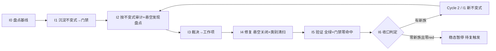

# nop-code 不变式驱动的持续审计闭环（nop-code Invariant-Driven Continuous Audit Loop）

> **产出方法**：`ai-dev/skills/invariant-loop-audit-prompt.md`；待经独立 fresh session 审查至共识。
> **驱动方**：`missions/nop-code-invariant-loop.json`（范围：nop-code 全模块组）
> **先例**：nop-chaos-flux 仓库的 `nop-chaos-flux/docs/backlog/ai-invariant-loop-roadmap.md`（首个闭环先例）
> **状态**：**Cycle 1 关闭——稳态暂停（分支 A）待复触发**（I6-revisit 2026-08-13 确定性稳态判定收口）。I0-I3 done；I4 `done*`（Phase 1-9 全部落地，Phase 4 ORM cascadeDelete ✅ successor 已落地 `2026-08-14-0707-1-nop-code-cascade-delete-successor.md`，Phase 9 @Auth 阻塞待人工确认）；I5 `done`（I4 Phase 1-9 全范围全量独立验证全绿）；I6 `done`（确定性稳态判定 = 分支 A 稳态暂停，见 `i6-cycle1-closure-report.md` §3.3）。下一行动 = 复触发条件驱动（§Loop Rule T1-T3；非主动恢复）。
> **与既有审计的关系**：`../skills/nop-code/audit-prompt.md`（模块专用补充审计维度）+ `nop-code-audit-2026-05-05.md` / `nop-code-audit-2026-05-10.md`（2 baseline）+ 13 轮 adversarial review（2026-05-25 至 2026-06-06，含同日 5 sub-round）为输入材料，不重复执行。

## 目的

nop-code 已被审计 **2 baseline + 13 轮 adversarial review**（2026-05-25 至 2026-06-06，含同日 r9-r13 五个 sub-round）。审计发现编号从 AR-94 推进到 AR-178+，大量悬空未关闭（无 mission / 无 roadmap 追踪收口）。同族缺陷在同日不同 sub-round 中重复出现：

- **OOM 族（加载全实体只为取字段）**：3 个兄弟——P1-4（初始审计：4 个冗余 Map 无 eviction）+ AR-168（r11：`CodeSearchService.buildFilePathCache` 同模式，有 `MAX_QUERY_RESULTS=10000` 限制）+ AR-177（r13：`getProjectFilePaths` 加载全 CLOB 实体只为取 `filePath`，**无任何限制**——AR-177 显式交叉引用 AR-168："对比 `buildFilePathCache`（AR-168），有同样的问题但有限制。此处无任何限制"）；
- **增量索引去同步族**：4+ 兄弟——AR-176（r13：`useLogicalDelete` vs `deleteIndex` 物理删除假设不一致）+ AR-178（r13：幂等性）+ AR-158~AR-169（r11：增量路径失效）+ AR-124~AR-144（r9：并发锁不完整）；
- **逻辑删除 vs 物理删除契约族**：AR-176——11 个实体中仅 1 个使用 `useLogicalDelete`，但删除代码假设统一物理删除（*"整个 ORM 模型中唯一使用 useLogicalDelete 的实体"*）。

根因 = **"修实例不修类别"**（AR-168 修了但 AR-177 同族漏到 r13）+ **反应式测试非穷举** + **无 mission 追踪收口**（审计发现悬空，无 MR/MV 闭环）+ **零可执行不变式门禁**。

**启动条件**：nop-code 重新激活（获得开发资源/优先级）后，本 roadmap 进入步骤 4 共识审查 → 执行。在此之前保持 `todo` 不变。

## Loop Design

每个 Cycle 固定 7 步（同 nop-stream invariant-loop roadmap）。

## Work Item Status

> 唯一动态状态区。

| Work Item | 交付范围 | 状态 | 依赖 |
| --- | --- | --- | --- |
| Cycle 1 / I0. 不变式盘点与基线 | 从 2 baseline + 13 轮 adversarial review 提取已知失败族 → 不变式目录（`ai-dev/audits/nop-code-invariants/invariant-catalog.md`）；盘点 AR-94→AR-178 悬空发现的当前 live 状态（哪些已修、哪些仍开放）；枚举全部 SearchService / IndexManager / CodeClassLoader / 删除路径方法作为审计目标集 | `done` | — |
| Cycle 1 / I1. 不变式沉淀（首批门禁） | 首批候选族：① 实体加载字段最小化门禁——加载实体列表只为取少量字段时必须用投影查询（SELECT field）而非全实体加载（静态扫描 + ArchUnit）；② 增量索引一致性门禁——`useLogicalDelete` 实体的删除路径必须走逻辑删除而非物理删除（ORM 模型 + service 方法交叉检查）；③ 增量索引幂等性门禁——每个索引更新操作必须可安全重试（JUnit 参数化穷举）；④ 查询结果上限门禁——每个全表/大表查询必须声明 LIMIT（防 OOM） | `done` | I0 |
| Cycle 1 / I2. 不变式驱动审计 | 跑 I1 门禁 → red list + 对抗探查 + 盘点 AR-94→AR-178 悬空发现哪些已被门禁覆盖、哪些仍需手动修复 | `done` | I1 |
| Cycle 1 / I3. 发现裁决 | red list + 悬空发现逐条裁决 → P0/P1 派 I4；裁决表零悬挂 | `done` | I2 |
| Cycle 1 / I4. 修复执行 | 悬空发现关闭 + 门禁覆盖缺口补齐 + 类别清扫 + test-first | `done*`（Phase 1-9 全部落地：query-limit/entity-field-min/idempotency/搜索同步/删除路径/缓存不变性/截断可观测/数据一致性/error-handling；Phase 4 ORM cascadeDelete ✅ successor 已落地 `2026-08-14-0707-1-nop-code-cascade-delete-successor.md`，Phase 9 @Auth 阻塞待人工确认，已落 service-layer 降级 / successor 派生） | I3 |
| Cycle 1 / I5. 全量验证 | `./mvnw test -pl nop-code -am -T 1C` + 门禁零命中 + full-green 记录 | `done`（I4 Phase 1-9 **全范围**全量独立验证全绿：模块测试 383 全绿、四族门禁 real-violation 0、棘轮 baseline per-family 0 NEW、Anti-Hollow 0 high/critical + 6 条 Phase 3-9 调用链连通；Phase 9 @Auth + Phase 4 ORM cascadeDelete 两项 gated 阻塞待人工确认，I5 验证已落地范围；record `i5-full-green-record.md` 已更新为全范围；稳态判定属 I6-revisit） | I4 |
| Cycle 1 / I6. 循环收口 | 统计 + 稳态判定 + 复触发条件登记；closure 独立 fresh session | `done`（统计+稳态判定程序+复触发条件+Cycle 2 后继派生+interim closure+**确定性稳态判定 = 分支 A 稳态暂停**，见 `i6-cycle1-closure-report.md` §3.3（I6-revisit）；前置条件 I4 全完成 + I5-reverify full-scope 全绿已满足；零新族确定性成立（22 AR-ID 逐条比对）+ 零 red；Cycle 1 正式关闭；Phase 9 @Auth + Phase 4 ORM cascadeDelete gated 阻塞待人工确认，successor path 已登记） | I5 |

## Phase Details

### I0 — 不变式盘点与基线（仅 Cycle 1）

不变式目录 `ai-dev/audits/nop-code-invariants/invariant-catalog.md`：每条含「陈述 / 覆盖失败族 / 历史 audit-finding-ID 证据 / 检测方法」。**特殊**：盘点 AR-94→AR-178 悬空发现的当前 live 状态（哪些已修、哪些仍开放），作为 I2/I3 的额外输入。审计目标集 = nop-code 全部 SearchService / IndexManager / CodeClassLoader / 删除路径方法。

### I1 — 不变式沉淀

落地形式：① JUnit `@ParameterizedTest`（增量索引幂等性穷举）；② `ai-dev/tools/*.mjs` 静态扫描（实体加载字段最小化检测 + 查询结果上限检测）；③ ORM 模型 + service 方法交叉检查（逻辑删除 vs 物理删除一致性，扩展 `check-*.mjs` 或 ArchUnit，**需先引入 ArchUnit 依赖**）。全部入 CI。

### I2–I6

同 nop-stream invariant-loop roadmap 的 I2–I6 方法论步骤，审计目标集换为 nop-code 的 SearchService/IndexManager/删除路径面：

- **I2 审计目标**：跑 I1 四族门禁 + 盘点 AR-94→AR-178 悬空发现 → red list + 悬空发现处置矩阵；对抗探查聚焦增量索引并发路径与 OOM 潜在点。
- **I4 类别清扫面**：修任一 SearchService 的全实体加载必 grep 全部 SearchService 方法；修任一删除路径必穷举全部 useLogicalDelete 实体的删除路径。
- **I5 验证**：`./mvnw test -pl nop-code -am -T 1C` + 四族门禁零命中。
- **I6 收口**：稳态判定 + 复触发条件（CI 变红 / 新增 SearchService 或 IndexManager / 周期复探）；closure 独立 fresh session。**Cycle 1 I6 已 final closure**（`i6-cycle1-closure-report.md`）：interim closure（统计+稳态判定程序+复触发条件+Cycle 2 后继派生）+ I6-revisit 确定性稳态判定 = **分支 A 稳态暂停**（前置条件 I4 全完成 + I5-reverify full-scope 全绿已满足；§3.3 零新族 22 AR-ID 逐条比对 + 零 red；§3.2 DEFERRED resolved）。Cycle 1 关闭，roadmap 进入稳态暂停待复触发。

## Dependency Graph

## Loop Rule

nop-code 专属复触发条件（I6 `i6-cycle1-closure-report.md` §4 登记）：

### Cycle 1 继续执行（T0 — 已 resolved）

- **T0（已 resolved，2026-08-13 I6-revisit）**：~~I4 Phase 3-9（WP-7/4/5/6/8/9/10）未完成 → 直接恢复 I4 执行~~。**现状**：I4 Phase 1-9 全部 completed（Phase 4 ORM cascadeDelete ✅ successor 已落地 `2026-08-14-0707-1-nop-code-cascade-delete-successor.md`，Phase 9 @Auth gated 阻塞待人工确认，已落 service-layer 降级 / successor 派生），I5-reverify full-scope 全绿，I6-revisit 确定性稳态判定 = 分支 A 稳态暂停。**T0 条件已消除，Cycle 1 关闭**。剩余 Phase 9 @Auth 为 Protected Area gated successor，不随 T0 自动关闭，待人工确认后由 successor plan 补齐。

### Cycle 2 / 稳态打破触发（稳态已建立，T1-T3 生效，≥3 条）

1. **CI 门禁变红**：`check-nop-code-invariants.mjs` strict/ratchet 模式报告 `[NEW]` 违规，或 `TestNopCodeIndexIdempotencyInvariant` red-list 锁变红（KNOWN_NON_IDEMPOTENT 新增）→ 启动新 Cycle 或退回 I4 修复。
2. **审计目标集结构变更**：新增/重命名 SearchService / IndexManager / CodeClassLoader / 删除路径方法（`audit-target-set.md` 6 服务类 + ORM 11 实体增删改）→ 重新激活 I0 盘点 → I1..I6。
3. **周期复探**：季度（或大版本发布后）主动重跑四族门禁 + I2 三面对抗探查（并发 / OOM / 跨文件孤儿+搜索去同步），即使门禁绿也探查新失败模式 → 若发现新族，派生 Cycle 2/I1。

## Cross-Cutting

- **启动门控**：本 roadmap 在 nop-code 获得开发资源后激活。激活后第一步是步骤 4 共识审查（独立 fresh session），确认 I0 盘点基线与当前 live code 一致（AR-94→AR-178 的修复状态可能已变化）。
- **授权**：P0/P1 自动修复预授权；ORM/API 模型变更执行前人工确认；新门禁入 CI 需 committed 回归测试（激活时确认 CI policy）。
- **范围独立**：与 nop-stream / nop-metadata / nop-ai 的 invariant-loop 范围不重叠。
