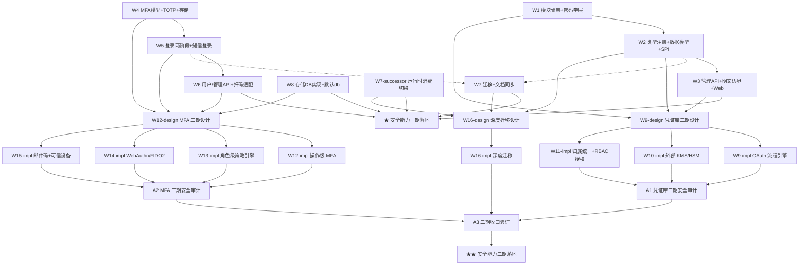

# 加密凭证库 + 多因子验证 Roadmap（nop-credential + nop-auth MFA）

> Status: active
> Last updated: 2026-08-14（**W12-design 执行收口（2026-08-14）：`02-mfa-phase2-design.md` 四主题设计产出 + 四小节独立 review + 独立 closure audit READY_TO_CLOSE → 标 `done`**；W12-impl ~ W15-impl 依赖解锁）
> Sources（设计已达成共识，实施前必读）：
> - `ai-dev/design/nop-credential/00-vision.md` + `01-architecture-baseline.md`（凭证库，三期审查达成共识）
> - `ai-dev/design/nop-auth/00-vision.md` + `01-architecture-baseline.md`（MFA，五期审查达成共识）

**Why**：geekai/n8n 对比调研（`~/ai/agent-survey/`）识别出平台两大真实差距——①无加密凭证库（NopAiModel.apiKey 明文存 DB、集成密钥明文配置）；②无短信验证码登录与多因子验证（MFA）。两份设计文档已定稿，本 roadmap 驱动其落地。

## Work Items

> **这是唯一动态状态块。状态只在这里更新。**
> 人工设定条目与顺序；AI 取第一个 `todo`，起草/执行计划，closure audit 通过后标 `done`。

- W1. nop-credential 模块骨架 + 密码学层（cv1 格式/密钥管理/主密钥配置）：`done` — plan: `ai-dev/plans/2026-08-12-0615-1-nop-credential-module-skeleton-and-crypto-layer.md`
- W2. nop-credential类型注册 + 数据模型 + 消费 SPI：`done` — plan: `ai-dev/plans/2026-08-12-0615-2-nop-credential-type-registry-data-model-spi.md`
- W3. nop-credential 管理 API + 明文边界 + Web 动态表单：`done` — plan: `ai-dev/plans/2026-08-12-0615-3-nop-credential-management-api-plaintext-boundary-web.md`
- W4. MFA 数据模型 + TOTP 验证器 + 存储组件（MfaChallengeStore/SmsCodeStore）：`done` — plan: `ai-dev/plans/2026-08-12-1229-1-mfa-data-model-totp-stores.md`
- W5. MFA 登录流程两阶段改造 + 短信验证码登录（loginType=5 + dict 修复）：`done` — plan: `ai-dev/plans/2026-08-12-1229-2-mfa-login-two-stage-sms-login.md`
- W6. MFA 用户自助/管理员 API + nop-ai-gateway 扫码适配：`done` — plan: `ai-dev/plans/2026-08-13-1118-1-mfa-user-admin-api-scan-adaptation.md`（4 Phase 全部落地：`NopAuthUserBizModel` bindMfa/confirmMfa/unbindMfa/generateRecoveryCodes/getMfaStatus + `resetUserMfa`（requireAdmin 运行时校验 + NopAuthOpLog 审计）；`ScanLoginResult` 新增 mfaRequired/challengeToken/mfaType/loginType 可选字段（向后兼容），`loginByScanAsync` 同步 try/catch 捕获 `ERR_AUTH_MFA_REQUIRED`；独立 closure audit 两轮收口——首轮 3 阻塞项（补日志 + 补 `TestMfaLoginE2E.testPasswordLoginMfaSmsFullChain` SMS 全链用例）处置后复核通过，证据见 plan Closure 段）
- W7. 存量迁移（NopAiModel.apiKey）+ docs-for-ai 同步：`done` — plan: `ai-dev/plans/2026-08-13-1118-2-legacy-migration-docs-sync.md`（Phase 1 仅依赖 W2 可先行；Phase 2/3 docs 引用 W6 live 产物，含 repo-observable W6 gate——**gate 已满足（2026-08-14 W6 closure 通过）**）
- W7-successor. NopAiModel.credentialId 运行时消费读取切换（credentialId → ICredentialProvider）+ 集成点裁决：`done` — plan: `ai-dev/plans/2026-08-13-1118-3-nop-ai-model-credential-runtime-consumption.md`（W7 deferred 项的最后一公里接线：IAiModelCredentialResolver SPI + AiModelCredentialResolverImpl + ChatServiceImpl 钩点，优先级链 accountKey > credentialId > resolveApiKey，强 fail-closed，引用计数 ai:NopAiModel:<id>）
- W8. **MFA 存储数据库实现 + store-type 默认 db**：`done` — plan: `ai-dev/plans/2026-08-13-0900-1-mfa-db-store-and-default-db.md`（用户 2026-08-13 裁决：缺省不使用 Redis；所有存储必须有基于数据库的实现——新增 `DbMfaChallengeStore`/`DbSmsCodeStore` 两 ORM 实体表 `nop_auth_mfa_challenge`/`nop_auth_sms_code`；默认 `store-type` 由 `local` 改 `db`；`MfaStoreProvider` 改 collect-beans name-prefix 声明式装配 + 条件式 Redis 注册守住类加载安全不变式 ai-dev/lessons/15）
- ★ **Milestone: 安全能力一期落地**（W1-W8 + W7-successor 全部 done）：`done`（2026-08-14，W6 closure audit 通过后 W1-W8 + W7-successor 全部 done，派生状态自动满足）

---

## 二期工作项（设计 → 实现交错，审计穿插；状态同为唯一动态状态块，2026-08-14 新增）

> 二期边界来源：`ai-dev/design/nop-credential/00-vision.md` §三/§四（归属统一/RBAC/OAuth/KMS）、`ai-dev/design/nop-auth/00-vision.md` §三 + `01-architecture-baseline.md` §四（操作级 MFA/角色级策略/WebAuthn/邮件码/可信设备）、一期各 W out-of-scope、W6 plan Non-Blocking Follow-ups。执行规则：每个 design 工作项先产出设计文档并 review，再进入对应 impl；**取第一个 `todo` 优先，组间交错仅在满足依赖下作为可选策略**（凭证库组 → MFA 组 → 迁移组），组内顺序执行；审计工作项在组内 impl 全部 done 后启动。范围说明：W6 plan 遗留的"绑定流程 provisioning URI 二维码生成"已裁定属前端业务层（`Successor Required: no`），不在本 roadmap 二期范围。**用户裁决（2026-08-14）：凭证模块不做租户隔离**——租户为 Nop 平台全局可开启能力；凭证归属只需统一"系统级 + 用户级"两种场景（同一密钥管理服务可能被多个外部系统共用，系统级凭证 = 共享/管理员管理，用户级凭证 = 个人私有）。

### 凭证库二期组（nop-credential）

- W9-design. 凭证库二期设计文档（OAuth 流程引擎 + 外部 KMS/HSM + 凭证归属统一（系统级/用户级）+ RBAC 细粒度授权 四主题合一设计，落 `ai-dev/design/nop-credential/02-phase2-design.md`）：`done` — plan: `ai-dev/plans/2026-08-14-2012-1-credential-phase2-design.md`（2026-08-14 执行收口：粒度裁决单文件；四主题小节各经独立 review 回修；usageScope 裁定废弃、归属由 scope/ownerId 承载；`OAuthLoginServiceImpl` 裁定仅协议级参照；独立 closure audit READY_TO_CLOSE，证据见 plan Closure 段。依赖：W1-W3 done。归属主题含用户裁决：不做租户隔离（平台全局能力），统一系统级/用户级两种归属，覆盖"多系统共用同一密钥管理服务"场景）
- W9-impl. OAuth 流程引擎实现（出站 OAuth 2.0 客户端：授权码换取/刷新闭环/自动续期。注意 `nop-auth-sso` `OAuthLoginServiceImpl` 为**入站 SSO 登录服务**（单一 `SsoConfig`），凭证库需要的是出站客户端——设计裁定仅**协议级参照**不组件级复用，见 `ai-dev/design/nop-credential/02-phase2-design.md` §三）：`done` — plan: `ai-dev/plans/2026-08-14-2342-1-credential-oauth-flow-engine.md`（2026-08-16 执行收口：authType=oauth2 类型声明扩展 + state 新 ORM 实体（`nop_credential_oauth_state`，DB 载体裁定回写设计 §八）+ 授权码闭环（发起 mutation 登录态 → publicAccess 单一回调 WebContentBean 跳转页 → token 加密回写保留字段，30x 偏离标注回写设计 §3.3）+ 惰性刷新（DB 行级锁跨副本互斥，并发刷新恰一次）+ saveCredential 分组写/保留字段拒绝 + disabled 全路径拒绝；一期契约锚点零回归。独立 closure audit 通过（发现并修复 1 个 Blocker：CredentialOAuthApiBizModel 未注册 beans 文件——NopIoC 无注解扫描，补注册 credential-defaults.beans.xml + 容器接线测试），证据见 plan Closure 段。依赖：W9-design done）
- W10-impl. 外部 KMS/HSM 集成实现（`ICredentialKeyProvider` 扩展 SPI：Vault/云 KMS 主密钥来源，本地文件/环境变量路径保留为默认实现）：`todo` — 依赖：W9-design
- W11-impl. 凭证归属统一（系统级/用户级）+ RBAC 细粒度授权实现（NopCredential 归属字段 scope/ownerId 落库；`ICredentialProvider` 消费侧归属+授权校验；BizModel 按归属过滤 CRUD；多系统共用密钥服务的归属语义）：`todo` — 依赖：W9-design
- A1-audit. 凭证库二期安全审计（明文边界回归/密钥轮换/多 key 并存/KMS 故障路径 fail-closed/授权与归属绕过对抗探查）：`todo` — 依赖：W9-impl, W10-impl, W11-impl

### MFA 二期组（nop-auth）

- W12-design. MFA 二期设计文档（操作级 MFA + 角色级强制策略 + 因子扩展（WebAuthn/邮件码/外部服务）+ 可信设备 四主题合一设计，落 `ai-dev/design/nop-auth/02-mfa-phase2-design.md`）：`done` — plan: `ai-dev/plans/2026-08-14-2012-2-mfa-phase2-design.md`（2026-08-14 执行收口：粒度裁决单文件；四主题小节各经独立 review 回修（6 Blocker + 15 Major + 23 Minor）；MfaType 裁决保持常量类不枚举化 + §5.3.0 白名单 10 处变更标注；操作级裁 @MfaRequired 注解 + executor 拦截 + MfaChallengeStore 场景化（scene/payload/verifiedAt）；角色策略裁持有约束模型（minMfaLevel + 三层判定矩阵 + 受限会话 + 登记 channel proof 防 enrollment attack）+ OAuth 一期遗留绕过修复纳入 W13；外部 MFA 服务 deferred；独立 closure audit READY_TO_CLOSE（10/10 内容级 live 锚点抽查 PASS），证据见 plan Closure 段。依赖：W4/W5/W6/W8 done）
- W12-impl. 操作级 MFA 实现（会话内敏感操作二次验证，请求级钩子；登录级 `mfaVerify` 链路复用）：`todo` — 依赖：W12-design
- W13-impl. 角色级 MFA 强制策略引擎实现（策略模型：存储/继承/评估，角色 → 强制因子映射；一期全局开关 + 用户级启用保留兼容）：`todo` — 依赖：W12-design
- W14-impl. WebAuthn/FIDO2 实现（MfaType 扩展位——live 为 `NopAuthMfaSetting.mfaType` VARCHAR 列 + `NopAuthConstants.MFA_TYPE_*` 字符串常量，非枚举，白名单校验点随 W12-design 清单更新；术语/枚举化裁决留 W12-design；外部 MFA 服务 Authy/Duo 评估后并入或显式 deferred）：`todo` — 依赖：W12-design
- W15-impl. 邮件验证码 + 可信设备实现（复用既有 `nop-integration-api` `IEmailSender`（腾讯实现已在）+ `TencentEmailSender`；可信设备/记住此设备：设备指纹 + 会话策略）：`todo` — 依赖：W12-design
- A2-audit. MFA 二期安全审计（因子强度/防重放/恢复通道/策略一致性/操作级钩子全路径覆盖）：`todo` — 依赖：W12-impl, W13-impl, W14-impl, W15-impl

### 迁移二期组（credentialId 深化）

- W16-design. nop-integration / nop-metadata credentialId 深度迁移设计（渠道密钥 / 数据源密码接入凭证库，参照 W7-successor 先例链）：`todo` — 依赖：W2, W7, W7-successor done
- W16-impl. nop-integration / nop-metadata 深度迁移实现：`todo` — 依赖：W16-design
- A3-audit. 二期收口全量验证 + 独立 closure audit（全量 build/test + 零明文回归断言 + 一期功能零回归）：`todo` — 依赖：全部二期 impl + A1/A2 done
- ★ **Milestone: 安全能力二期落地**（W9-W16 全部 done + A1/A2/A3 通过）：`todo` — 派生：W9-W16 + A1-A3

## Status values

| Status | Meaning |
| --- | --- |
| `todo` | 未开始，无计划 |
| `planned` | 有计划，通过独立 draft review |
| `done` | 完成，通过独立 closure audit |

> Milestone 状态是派生的：一期 = W1-W8 + W7-successor 全部 done 时自动 done；二期 = W9-W16 + A1-A3 全部 done 时自动 done。

## Framework / platform reuse

| Capability | Provider | Notes |
| --- | --- | --- |
| 对称加密原语 | `nop-commons` `AESTextCipher`（v1: 版本化密文） | 凭证密文 `cv1:{keyId}:{v1密文}` 包装复用，不重复造轮子 |
| 配置值加密 | `nop-config` `@sec:`（DefaultConfigValueEnhancer） | 配置文件静态密钥继续用 `@sec:`，凭证库只服务 DB 行级数据 |
| Redis 基础设施 | `nop-nosql`（INosqlKeyValueOperations/NosqlCache/INosqlRateLimiter/INosqlCounter） | MfaChallengeStore/SmsCodeStore 的 Redis 后端复用；原子计数用 INosqlCounter（设计 §3.3 裁决方案 A 默认） |
| 类型注册机制 | register-model.xml + xdsl-loader + `*.credential-type.xml` 实例文件 | 参照 `nop-ai-toolkit` 的 `ai-tool.register-model.xml` 惯例 |
| 短信发送 | `nop-integration-api` `ISmsSender`（腾讯/云片已有实现） | 短信验证码发送通道 |
| 邮件发送 | `nop-integration-api` `IEmailSender`（腾讯实现已有，`TencentEmailSender`） | 二期邮件验证码通道（无需新抽象） |
| OAuth 客户端 | `nop-auth-sso` `OAuthLoginServiceImpl`（授权码换取/Token 解析已实现，**入站 SSO 登录服务**） | 二期 OAuth 流程引擎为**出站**客户端，仅协议级参照（表单构造/Token 响应解析形态/grant 语义），不组件级复用（见 `02-phase2-design.md` §三） |
| 密码哈希 | `IPasswordEncoder`（BCrypt 加盐） | MFA 恢复码哈希存储 |
| 错误码/审计 | `NopAuthErrors` + `NopAuthOpLog` 机制 | MFA 登录/挑战审计 |
| BizModel/GraphQL | `CrudBizModel` + xmeta（`published=false` 明文边界） | 管理 API 与明文不暴露 |

## Current baseline

**Already shipped:**
- `nop-auth` 登录体系：用户名/邮箱/手机+密码（loginType 1/2/3）、SSO(4)、信道登录（20-23，飞书/钉钉/企微/Webhook）、图形验证码（`IVerifyCodeGenerator`）、失败计数、会话/token 签发（`LoginServiceImpl.loginAsync` + `createSessionForUserAsync`）
- `ISmsSender` 短信通道（腾讯/云片）
- `nop-nosql` Redis 基础设施（NosqlCache/INosqlCounter/INosqlRateLimiter）
- `AESTextCipher`（v1: 密文）+ `@sec:` 配置加密

**Main gaps (blocking this roadmap):**
- 无加密凭证库：`NopAiModel.apiKey` 明文列、nop-integration 密钥明文 `@cfg:` 注入、nop-metadata 数据源密码无加密存储
- 无短信验证码登录（无 loginType=5、无 SMS 验证码存储）
- 无 MFA（TOTP、恢复码、challenge 两阶段流程均不存在）
- `login-type.dict.yaml` 与 `AuthApiConstants` 不一致（SSO 4/10、缺 2/3）

## Stages

| # | Stage | Owner plan | Deps | Critical path | Reuse |
| --- | --- | --- | --- | --- | --- |
| 1 | nop-credential 模块骨架 + 密码学层 | plan W1 | — | **Yes** | AESTextCipher |
| 2 | nop-credential 类型注册 + 数据模型 + 消费 SPI | plan W2 | W1 | **Yes** | register-model 惯例 |
| 3 | nop-credential 管理 API + 明文边界 + Web | plan W3 | W2 | Yes | CrudBizModel/xmeta |
| 4 | MFA 数据模型 + TOTP + 存储组件 | plan W4 | — | **Yes**（可与 W1-W3 并行但顺序执行） | nop-nosql/BCrypt |
| 5 | MFA 登录流程两阶段改造 + 短信登录 | plan W5 | W4 | **Yes** | ISmsSender/IUserContextCache |
| 6 | MFA 用户自助/管理员 API + 扫码适配 | plan W6 | W5 | Yes | BizModel/ISessionBootstrap |
| 7 | 存量迁移 + docs-for-ai 同步 | plan W7 | W2 + W5 | No | — |
| ★ | 安全能力一期落地（milestone） | — | W1-W8 + W7-successor done | — | — |
| 8 | 凭证库二期设计（OAuth/KMS/归属统一+RBAC 四主题设计文档） | W9-design | W1-W3 done | — | nop-auth-sso 协议级参照 + RBAC 能力盘点 |
| 9 | OAuth 流程引擎实现 | W9-impl | W9-design | — | nop-auth-sso（仅协议级参照） |
| 10 | 外部 KMS/HSM 集成实现 | W10-impl | W9-design | — | — |
| 11 | 凭证归属统一 + RBAC 授权实现 | W11-impl | W9-design | — | nop-auth RBAC 先例 |
| 12 | 凭证库二期安全审计 | A1-audit | W9-11 impl done | — | — |
| 13 | MFA 二期设计（操作级/角色策略/因子扩展/可信设备四主题设计文档） | W12-design | W4-W8 done | — | — |
| 14 | 操作级 MFA 实现 | W12-impl | W12-design | — | — |
| 15 | 角色级 MFA 强制策略引擎实现 | W13-impl | W12-design | — | — |
| 16 | WebAuthn/FIDO2 实现 | W14-impl | W12-design | — | — |
| 17 | 邮件验证码 + 可信设备实现 | W15-impl | W12-design | — | IEmailSender 既有实现 |
| 18 | MFA 二期安全审计 | A2-audit | W12-15 impl done | — | — |
| 19 | 深度迁移设计（nop-integration/nop-metadata） | W16-design | W2/W7/W7-successor | — | W7-successor 先例链 |
| 20 | 深度迁移实现 | W16-impl | W16-design | — | — |
| 21 | 二期收口全量验证 + 独立 closure audit | A3-audit | 二期全 done | — | — |
| ★★ | 安全能力二期落地（milestone） | — | W9-W16 + A1-A3 | — | — |

## Stage details

### 1. nop-credential 模块骨架 + 密码学层

> Status: see Work Items above

**Goal:** 创建 `nop-credential` 独立可复用模块骨架（api/dao/meta/service/web + model/orm.xml），实现凭证密文格式与多密钥管理。

**Deliverables:**
- 模块 pom（参照 nop-retry/nop-file 惯例）+ 根 pom `<modules>` 注册
- `cv1:{keyId}:{v1密文}` 密文格式：`CredentialCipher`（解析 keyId 委托 `AESTextCipher` 解内层 v1 密文）+ `ICredentialKeyProvider`（active key + 多 key 并存）
- 主密钥来源：环境变量/独立配置文件（`NOP_CREDENTIAL_MASTER_KEYS` 或 `credential-keys.yaml`，格式 `keyId:passphrase`，keyId 限 `[A-Za-z0-9_-]`）
- `nop-credential-api` 骨架（零业务依赖：仅 nop-api-core/nop-commons）

**Out of scope:** 凭证类型注册、ORM 实体、BizModel（W2/W3）；归属统一/RBAC/OAuth/KMS（二期）

**Module / area:** `nop-credential/`（新建）、`nop-commons`（复用不修改）

### 2. nop-credential 类型注册 + 数据模型 + 消费 SPI

> Status: see Work Items above

**Goal:** 凭证类型声明式注册 + `NopCredential`/`NopCredentialUsage` 实体 + 消费 SPI。

**Deliverables:**
- `credential-type.xdef` 元模型 + register-model.xml（xdsl-loader fileType="credential-type.xml"）+ 示例类型实例文件（`_vfs/nop/credential/types/`）
- ORM 实体：`NopCredential`（data 加密列、status/deleted/usageScope/lastUsedAt/expireAt/testResult 等）+ `NopCredentialUsage`（credentialId + consumerRef 唯一约束）；model-first（`nop-credential/model/nop-credential.orm.xml` 源 → codegen → DDL 迁移，**禁止手编 `_gen/` 与 `_` 前缀文件**）
- `ICredentialProvider` SPI（接口在 api，实现+唯一解密点在 service）：getCredential/getCredentialData/testCredential/mask/registerUsage/unregisterUsage
- 软删除语义（fail-closed）+ 引用计数（registerUsage/unregisterUsage）
- xmeta：`data` 列 `published="false"`（明文边界结构性强制）

**Out of scope:** BizModel/GraphQL API、Web 页面（W3）

**Module / area:** `nop-credential/`（api/dao/meta + model/orm.xml）

### 3. nop-credential 管理 API + 明文边界 + Web 动态表单

> Status: see Work Items above

**Goal:** 管理 CRUD（GraphQL/REST）+ 动态表单页面，明文不跨出服务进程。

**Deliverables:**
- `NopCredentialBizModel`：save/delete/get/findPage/maskList/typeList/test/reencryptAll（data 恒脱敏，findPage 强制置空）
- 明文边界验证：REST/GraphQL 层无法取得明文（xmeta published=false + BizModel 层置空 + maskList 输出）
- Web 管理页（`nop-credential-web`）：AMIS 动态表单（typeList() 返回字段 schema → 前端动态渲染；字段 type 枚举 string/password/number/select/boolean/textarea，password 打码回显）
- `reencryptAll` 批量重加密（断点续跑，仅 admin）
- 测试：加密存储 round-trip、明文边界（GraphQL 不透明文）、引用计数删除拦截、动态表单 schema

**Out of scope:** RBAC 授权/归属统一（二期；租户隔离明确不做——租户为平台全局能力）

**Module / area:** `nop-credential/`（service/web）

### 4. MFA 数据模型 + TOTP 验证器 + 存储组件

> Status: see Work Items above

**Goal:** MFA 领域基础：数据模型 + RFC 6238 TOTP + challenge/短信码存储（Local + Redis 双实现）。

**Deliverables:**
- ORM 实体：`NopAuthMfaSetting`（userId PK/mfaType/secret 加密/status pending|enabled|disabled/bindToken/phone/lastVerifiedWindow/lastVerifiedAt）+ `NopAuthMfaRecoveryCode`（codeHash BCrypt 加盐/used/usedAt/expireAt）；`nop-auth/model/nop-auth.orm.xml` 源编辑 → codegen → DDL 迁移
- `TOTPAuthenticator`（RFC 6238：HMAC-SHA1/6 位/30s/±1 窗口；provisioning URI 生成；防重放基于 lastVerifiedWindow——通过时更新、拒绝时不更新）
- `MfaChallengeStore`（create/peek/incrFailCount/consume；peek 不刷新 TTL；Local 实现 + Redis 实现复用 nop-nosql；**原子计数裁决：默认复用 `INosqlCounter`（方案 A），若实施期裁定不可接受再扩展 `INosqlKeyValueOperations.incrementAsync`（方案 B，plan-first + 两个实现类同步）**——见设计 §3.3）
- `SmsCodeStore`（send/verify/consume；verify=校验+成功原子消费+失败内部计数；key=`login:{phone}`/`mfa:{userId}` 隔离；Redis 写走 putExAsync、读用不刷新 TTL 的 get——见设计 §3.3 写路径约束）
- 测试：TOTP 算法（RFC 向量/窗口偏差/防重放）、challenge 生命周期（peek/consume/超限作废）、SmsCodeStore 三态

**Out of scope:** 登录流程改造（W5）；绑定/解绑 API（W6）

**Module / area:** `nop-auth`（dao/model + nop-biz-auth-core）+ `nop-nosql`（复用）

### 5. MFA 登录流程两阶段改造 + 短信验证码登录

> Status: see Work Items above

**Goal:** 登录两阶段化（第一因子→challenge→第二因子）+ loginType=5 短信登录 + dict 修复。

**Deliverables:**
- `LoginServiceImpl.loginAsync` 改造：凭证校验 → `mfaConfig.enabled` 开关 → MFA 设置检查（status==enabled 口径）→ 因子等同分支（PHONE_SMS + mfaType==SMS 不重复验证）→ `MfaChallengeStore.create` → 抛 `ERR_AUTH_MFA_REQUIRED`（errorParams 携带 challengeToken/mfaType/loginType）
- `createSessionForUserAsync` 改造：SSO/信道同样拦截（loginType 参数化，审计不失真）
- `mfaVerify`：peek → setting 复核（null/!enabled 作废 challenge）→ recovery 分支（BCrypt 比对/used 统一 MFA_FAIL/成功后 consume + status=disabled 强制重绑）→ TOTP/SMS 分支（成功后 consume）→ 失败 incrFailCount 超限作废
- `completeLogin` 公共方法抽取（三处复用：loginAsync/createSessionForUserAsync/mfaVerify；含 autoLogout + runWithTenant；mfaVerify 成功路径 = buildUserContext → saveSession → 按 loginType 签发 accessToken 或 accessCode）
- `loginType=5`（`LOGIN_TYPE_PHONE_SMS`）：`sendSmsCode`/`sendMfaCode`/`mfaVerify` 接口（LoginApiBizModel，publicAccess）；短信发送限流（60s 间隔/日上限/IP 上限/防枚举统一响应）
- `login-type.dict.yaml` 修复：补 2/3/5 条目、SSO 统一为 4（以 `AuthApiConstants` 为准）；存量 loginType=10 迁移核对
- 配置项（`nop.auth.mfa.*`/`nop.auth.sms-code.*`）+ 错误码（`NopAuthErrors` 新增 MFA/SMS 系列）
- 测试：两阶段登录 E2E（密码→MFA→token）、短信登录 E2E、恢复码登录、失败计数分界、未启用 MFA 零回归

**Out of scope:** 绑定/解绑/恢复码管理 API（W6）；nop-ai-gateway 扫码适配（W6）

**Module / area:** `nop-auth`（service/biz + nop-biz-auth-api）

### 6. MFA 用户自助/管理员 API + nop-ai-gateway 扫码适配

> Status: see Work Items above

**Goal:** 用户自助绑定/解绑/恢复码 + 管理员重置 + 扫码登录 MFA 适配。

**Deliverables:**
- `NopAuthUserBizModel`：bindMfa（pending+bindToken）/confirmMfa（bindToken 定位+校验+enabled+生成恢复码）/unbindMfa（验证当前因子+作废恢复码）/generateRecoveryCodes（重置作废旧码）/getMfaStatus（不返回 secret）
- 管理员 `resetUserMfa`（NopAuthUserBizModel 或 NopAuthUserMaintenanceBizModel，admin 权限）
- `nop-ai-gateway` `ChannelLoginApiBizModel.loginByScan` 适配：捕获 `ERR_AUTH_MFA_REQUIRED` → `ScanLoginResult.mfaRequired`；扫码时序（手机输码 → mfaVerify → 返回 accessCode → PC 轮询 getLoginResultAsync）——**跨模块公共 API 变更，plan-first**
- 测试：绑定状态机 E2E（bindMfa→confirmMfa→登录拦截）、解绑/换绑原子性、恢复码重置、管理员重置、扫码 MFA 全链

**Out of scope:** WebAuthn/邮件验证码/操作级 MFA/可信设备（二期）

**Module / area:** `nop-auth`（service）+ `nop-ai-gateway`（跨模块）

### 7. 存量迁移 + docs-for-ai 同步

> Status: see Work Items above

**Goal:** 存量明文密钥迁移路径落地 + 平台文档同步。

**Deliverables:**
- `NopAiModel` 增加可选 `credentialId` 字段（关联凭证库），apiKey 列保留兼容；迁移工具/脚本 + 迁移文档
- nop-integration 静态密钥改用 `@sec:` 加密的说明文档（立即可做项）
- `docs-for-ai/03-modules/nop-auth.md` 补充 MFA 章节；`docs-for-ai/02-core-guides/auth-and-permissions.md` 补充两阶段登录说明；新增 docs-for-ai/03-modules/nop-credential.md（W7 待产出）
- 设计文档收口（Open Questions 全部关闭）+ `ai-dev/design/README.md` 索引更新
- `docs-for-ai/04-reference/source-anchors.md` 更新（若锚点变化）

**Out of scope:** nop-integration/nop-metadata 深度迁移（credentialId 引用，二期）

**Module / area:** `nop-ai`（model/dao）、`docs-for-ai/`、`ai-dev/`

### 8. 凭证库二期设计（W9-design）

> Status: see Work Items above

**Goal:** 一份设计文档收敛四个二期主题（OAuth 流程引擎 / 外部 KMS / 凭证归属统一（系统级+用户级）/ RBAC 细粒度授权），裁定各主题的实现边界与复用路径，供 W9-impl/W10-impl/W11-impl 执行。**分节产出：每主题独立小节 + 独立 review 门槛；预估超单 plan 规模时先行拆分裁定（plan-first）。**

**Deliverables:**
- `ai-dev/design/nop-credential/02-phase2-design.md`：OAuth 流程引擎（授权码换取/刷新闭环/自动续期；出站 OAuth 客户端——`OAuthLoginServiceImpl` 为入站 SSO 服务，仅协议级参照，见设计 §三；Token 加密存储语义不变）；外部 KMS/HSM 集成 SPI（`ICredentialKeyProvider` 扩展：Vault/云 KMS 主密钥来源，本地实现保留为默认，轮换/fail-closed 语义）；凭证归属统一（系统级 + 用户级：归属维度字段设计（`scope=system|user` + `ownerId`）、`ICredentialProvider` 用户上下文与消费侧归属校验、BizModel 按归属过滤 CRUD、`usageScope` 语义定稿（**裁定：废弃**——live 列无默认值、全仓库无取值消费，"一期占位（`instance`）"措辞与 live 不符；归属语义由新字段 scope/ownerId 承载）、同一密钥管理服务被多个外部系统共用的归属语义；**不做租户隔离**——租户为平台全局能力）；RBAC 细粒度授权（凭证级授权模型"谁可以用哪个凭证"、消费侧校验点、与归属模型的组合规则、与 nop-auth RBAC 复用边界）
- 各主题 out-of-scope / deferred 裁定 + 与一期密文格式 `cv1:` 的兼容性确认

**Module / area:** `ai-dev/design/nop-credential/`

### 9-11. 凭证库二期实现（W9-impl / W10-impl / W11-impl）

> Status: see Work Items above

**Goal:** 按 W9-design 落地三个主题的实现，每个 impl 工作项 = 一个 execution plan。

**Deliverables:**
- W9-impl：OAuth 流程引擎（凭证类型声明 OAuth 认证方式 → 授权码换取 → 刷新闭环 → Token 自动续期入库）
- W10-impl：外部 KMS/HSM 集成（新 `ICredentialKeyProvider` 实现类 + 配置切换 + KMS 故障 fail-closed 测试）
- W11-impl：凭证归属统一 + RBAC 细粒度授权（NopCredential 归属字段 ORM 变更（scope/ownerId）+ BizModel 按归属过滤 CRUD + `ICredentialProvider` 消费侧归属/授权校验 + 归属隔离测试；若执行时预估超出单 plan 规模（5-15 文件/200-500 行/1-4 phases），先行拆分裁定（plan-first），不硬撑单文件）

**Module / area:** `nop-credential/`（api/service）

### 12. 凭证库二期安全审计（A1-audit）

> Status: see Work Items above

**Goal:** 独立审计三个实现的安全属性与一期契约回归。

**Deliverables:** 明文边界回归、密钥轮换/多 key 并存、KMS 故障路径 fail-closed、授权绕过对抗探查、密文格式兼容性；finding 裁决表零悬挂。

### 13. MFA 二期设计（W12-design）

> Status: see Work Items above

**Goal:** 一份设计文档收敛四个二期主题（操作级 MFA / 角色级强制策略 / 因子扩展（WebAuthn + 邮件码 + 外部服务）/ 可信设备），供 W12-impl ~ W15-impl 执行。**分节产出：每主题独立小节 + 独立 review 门槛；预估超单 plan 规模时先行拆分裁定（plan-first）。**

**Deliverables:**
- `ai-dev/design/nop-auth/02-mfa-phase2-design.md`：操作级 MFA（请求级钩子、敏感操作清单、会话内二次验证与登录级链路复用）；角色级强制策略（策略模型：存储/继承/评估；与全局开关 + 用户级启用兼容）；因子扩展（MfaType 扩展/枚举化裁决（live 为 VARCHAR 列 + 字符串常量）、WebAuthn 挑战/断言、邮件码走既有 `IEmailSender`、外部服务 Authy/Duo 评估）；可信设备（设备指纹 + 会话策略、绑定入口）
- 各主题 out-of-scope / deferred 裁定 + 与 W4-W8 落地契约的兼容性确认

**Module / area:** `ai-dev/design/nop-auth/`

### 14-17. MFA 二期实现（W12-impl ~ W15-impl）

> Status: see Work Items above

**Goal:** 按 W12-design 落地四个主题，每个 impl 工作项 = 一个 execution plan。

**Deliverables:**
- W12-impl：操作级 MFA（请求级钩子接线 + 敏感操作清单 + E2E）
- W13-impl：角色级强制策略引擎（策略模型 + 评估 + 强制拦截 + 兼容测试）
- W14-impl：WebAuthn/FIDO2（挑战/断言验证 + 绑定/登录链路；外部服务评估结论并入或显式 deferred）
- W15-impl：邮件验证码（`IEmailSender` 接线 + 邮件码 store）+ 可信设备（指纹 + 会话策略）

**Module / area:** `nop-auth`（service/biz）+ `nop-integration-api`（复用）

### 18. MFA 二期安全审计（A2-audit）

> Status: see Work Items above

**Goal:** 独立审计四个实现的安全属性与一期契约回归。

**Deliverables:** 因子强度评估、防重放、恢复通道、策略一致性、操作级钩子全路径覆盖、登录级链路零回归；finding 裁决表零悬挂。

### 19-20. 深度迁移二期（W16-design / W16-impl）

> Status: see Work Items above

**Goal:** nop-integration 渠道密钥与 nop-metadata 数据源密码接入凭证库（一期只迁移了 `NopAiModel.apiKey`）。

**Deliverables:**
- W16-design：迁移方案（引用点枚举、优先级链、fail-closed、回滚路径；参照 W7-successor `IAiModelCredentialResolver` 先例链）
- W16-impl：两模块接线实现 + 迁移工具 + 文档同步

**Module / area:** `nop-integration/`、`nop-metadata/`、`nop-credential/`

### 21. 二期收口验证（A3-audit）

> Status: see Work Items above

**Goal:** 二期全量收口：全量 build/test、零明文回归断言、一期功能零回归、二期 milestone 派生判定；独立 fresh session closure audit。

## Dependency graph

## Cross-cutting concerns

| Concern | Notes |
| --- | --- |
| 生成文件纪律 | 所有 ORM 变更走 `model/*.orm.xml` 源 → codegen → DDL 迁移；**禁止手编 `_gen/` 与 `_` 前缀文件**（AGENTS.md 硬停止规则） |
| Protected Area | `ISessionBootstrap`/`LoginApi`/`LoginResult`/`ScanLoginResult`/`INosqlKeyValueOperations` 均为跨模块公共 API，变更需 plan-first + migration plan |
| 明文边界 | 凭证明文与 TOTP secret 只存在于服务进程内；REST/GraphQL 结构性不可达（xmeta published=false + BizModel 层置空） |
| 兼容性 | 未启用 MFA 用户登录流程零感知；凭证库不破坏既有 `@sec:` 配置加密 |
| 验证命令 | W1 落地前 `nop-credential` 模块不存在，`-pl nop-credential` 会失败——W1 计划实施后需更新 mission commands 加入 `nop-credential`；test 范围 `nop-auth,nop-ai-gateway,nop-nosql -am` 覆盖 MFA 全链 |
| 设计引用 | 实施前完整读取两份设计文档（W1-W3 读 nop-credential、W4-W6 读 nop-auth）——设计含实施裁决点（Redis 原子计数方案 A/B、动态表单字段枚举等），以设计文档为准 |
| 二期跨模块公共 API / ORM | W9-impl（OAuth 引擎）/ W11-impl（NopCredential 归属字段 ORM 变更）/ W12-impl（请求级钩子）/ W13-impl（角色→因子策略新 ORM 实体）/ W14-impl（MfaType 扩展）/ W15-impl（可信设备指纹新实体/列）/ W16-impl（nop-integration/nop-metadata 接线）均可能触碰跨模块公共 API 或 ORM 模型（Protected Area），实施前 plan-first + migration note（同 W6 `ScanLoginResult` 先例） |
| 二期审计门禁 | A1/A2/A3 审计工作项走独立 fresh session；finding 裁决表零悬挂；P0/P1 不静默降级 |

## Rules

- 本文件是状态索引与粗分解，不是执行计划；每个 `planned` 条目由其 execution plan 所有
- 状态只在 Work Items 块更新；milestone 是派生的（一期 = W1-W8 + W7-successor 全 done；二期 = W9-W16 + A1-A3 全 done）
- 每个 W 的规模 = 一个 execution plan 可完成（5-15 文件、200-500 行、1-4 phases）
- AI 取第一个 `todo`，不跳序、不重新仲裁优先级；closure audit 未过不标 done
- 禁止在 stage details 中放 checkbox 或实现步骤
- 二期规则：design 工作项先行（产出设计文档 + review 通过后才标 done）；**默认取第一个 `todo` 顺序执行，组间交错仅在满足依赖下作为可选策略**；impl 按组内顺序执行；审计工作项（A1/A2/A3）在对应 impl 全部 done 后启动，closure audit 通过前对应里程碑不标记 done
