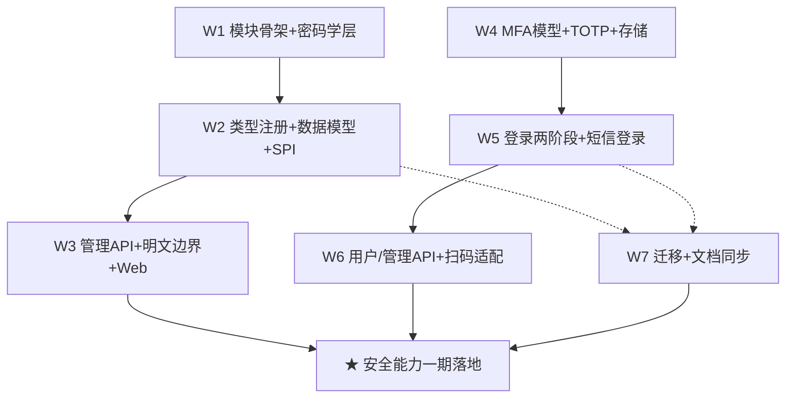

# 加密凭证库 + 多因子验证 Roadmap（nop-credential + nop-auth MFA）

> Status: active
> Last updated: 2026-08-10
> Sources（设计已达成共识，实施前必读）：
> - `ai-dev/design/nop-credential/00-vision.md` + `01-architecture-baseline.md`（凭证库，三期审查达成共识）
> - `ai-dev/design/nop-auth/00-vision.md` + `01-architecture-baseline.md`（MFA，五期审查达成共识）

**Why**：geekai/n8n 对比调研（`~/ai/agent-survey/`）识别出平台两大真实差距——①无加密凭证库（NopAiModel.apiKey 明文存 DB、集成密钥明文配置）；②无短信验证码登录与多因子验证（MFA）。两份设计文档已定稿，本 roadmap 驱动其落地。

## Work Items

> **这是唯一动态状态块。状态只在这里更新。**
> 人工设定条目与顺序；AI 取第一个 `todo`，起草/执行计划，closure audit 通过后标 `done`。

- W1. nop-credential 模块骨架 + 密码学层（cv1 格式/密钥管理/主密钥配置）：`done` — plan: `ai-dev/plans/2026-08-12-0615-1-nop-credential-module-skeleton-and-crypto-layer.md`
- W2. nop-credential类型注册 + 数据模型 + 消费 SPI：`done` — plan: `ai-dev/plans/2026-08-12-0615-2-nop-credential-type-registry-data-model-spi.md`
- W3. nop-credential 管理 API + 明文边界 + Web 动态表单：`done` — plan: `ai-dev/plans/2026-08-12-0615-3-nop-credential-management-api-plaintext-boundary-web.md`
- W4. MFA 数据模型 + TOTP 验证器 + 存储组件（MfaChallengeStore/SmsCodeStore）：`done` — plan: `ai-dev/plans/2026-08-12-1229-1-mfa-data-model-totp-stores.md`
- W5. MFA 登录流程两阶段改造 + 短信验证码登录（loginType=5 + dict 修复）：`planned` — plan: `ai-dev/plans/2026-08-12-1229-2-mfa-login-two-stage-sms-login.md`
- W6. MFA 用户自助/管理员 API + nop-ai-gateway 扫码适配：`todo`
- W7. 存量迁移（NopAiModel.apiKey）+ docs-for-ai 同步：`todo`
- ★ **Milestone: 安全能力一期落地**（W1-W7 全部 done）：`todo`

## Status values

| Status | Meaning |
| --- | --- |
| `todo` | 未开始，无计划 |
| `planned` | 有计划，通过独立 draft review |
| `done` | 完成，通过独立 closure audit |

> Milestone 状态是派生的：W1-W7 全部 done 时自动 done。

## Framework / platform reuse

| Capability | Provider | Notes |
| --- | --- | --- |
| 对称加密原语 | `nop-commons` `AESTextCipher`（v1: 版本化密文） | 凭证密文 `cv1:{keyId}:{v1密文}` 包装复用，不重复造轮子 |
| 配置值加密 | `nop-config` `@sec:`（DefaultConfigValueEnhancer） | 配置文件静态密钥继续用 `@sec:`，凭证库只服务 DB 行级数据 |
| Redis 基础设施 | `nop-nosql`（INosqlKeyValueOperations/NosqlCache/INosqlRateLimiter/INosqlCounter） | MfaChallengeStore/SmsCodeStore 的 Redis 后端复用；原子计数用 INosqlCounter（设计 §3.3 裁决方案 A 默认） |
| 类型注册机制 | register-model.xml + xdsl-loader + `*.credential-type.xml` 实例文件 | 参照 `nop-ai-toolkit` 的 `ai-tool.register-model.xml` 惯例 |
| 短信发送 | `nop-integration-api` `ISmsSender`（腾讯/云片已有实现） | 短信验证码发送通道 |
| 密码哈希 | `IPasswordEncoder`（BCrypt 加盐） | MFA 恢复码哈希存储 |
| 错误码/审计 | `NopAuthErrors` + `NopAuthOpLog` 机制 | MFA 登录/挑战审计 |
| BizModel/GraphQL | `CrudBizModel` + xmeta（`published=false` 明文边界） | 管理 API 与明文不暴露 |

## Current baseline

**Already shipped:**
- `nop-auth` 登录体系：用户名/邮箱/手机+密码（loginType 1/2/3）、SSO(4)、信道登录（20-23，飞书/钉钉/企微/Webhook）、图形验证码（`IVerifyCodeGenerator`）、失败计数、会话/token 签发（`LoginServiceImpl.loginAsync` + `createSessionForUserAsync`）
- `ISmsSender` 短信通道（腾讯/云片）
- `nop-nosql` Redis 基础设施（NosqlCache/INosqlCounter/INosqlRateLimiter）
- `AESTextCipher`（v1: 密文）+ `@sec:` 配置加密

**Main gaps (blocking this roadmap):**
- 无加密凭证库：`NopAiModel.apiKey` 明文列、nop-integration 密钥明文 `@cfg:` 注入、nop-metadata 数据源密码无加密存储
- 无短信验证码登录（无 loginType=5、无 SMS 验证码存储）
- 无 MFA（TOTP、恢复码、challenge 两阶段流程均不存在）
- `login-type.dict.yaml` 与 `AuthApiConstants` 不一致（SSO 4/10、缺 2/3）

## Stages

| # | Stage | Owner plan | Deps | Critical path | Reuse |
| --- | --- | --- | --- | --- | --- |
| 1 | nop-credential 模块骨架 + 密码学层 | plan W1 | — | **Yes** | AESTextCipher |
| 2 | nop-credential 类型注册 + 数据模型 + 消费 SPI | plan W2 | W1 | **Yes** | register-model 惯例 |
| 3 | nop-credential 管理 API + 明文边界 + Web | plan W3 | W2 | Yes | CrudBizModel/xmeta |
| 4 | MFA 数据模型 + TOTP + 存储组件 | plan W4 | — | **Yes**（可与 W1-W3 并行但顺序执行） | nop-nosql/BCrypt |
| 5 | MFA 登录流程两阶段改造 + 短信登录 | plan W5 | W4 | **Yes** | ISmsSender/IUserContextCache |
| 6 | MFA 用户自助/管理员 API + 扫码适配 | plan W6 | W5 | Yes | BizModel/ISessionBootstrap |
| 7 | 存量迁移 + docs-for-ai 同步 | plan W7 | W2 + W5 | No | — |
| ★ | 安全能力一期落地（milestone） | — | W1-W7 done | — | — |

## Stage details

### 1. nop-credential 模块骨架 + 密码学层

> Status: see Work Items above

**Goal:** 创建 `nop-credential` 独立可复用模块骨架（api/dao/meta/service/web + model/orm.xml），实现凭证密文格式与多密钥管理。

**Deliverables:**
- 模块 pom（参照 nop-retry/nop-file 惯例）+ 根 pom `<modules>` 注册
- `cv1:{keyId}:{v1密文}` 密文格式：`CredentialCipher`（解析 keyId 委托 `AESTextCipher` 解内层 v1 密文）+ `ICredentialKeyProvider`（active key + 多 key 并存）
- 主密钥来源：环境变量/独立配置文件（`NOP_CREDENTIAL_MASTER_KEYS` 或 `credential-keys.yaml`，格式 `keyId:passphrase`，keyId 限 `[A-Za-z0-9_-]`）
- `nop-credential-api` 骨架（零业务依赖：仅 nop-api-core/nop-commons）

**Out of scope:** 凭证类型注册、ORM 实体、BizModel（W2/W3）；RBAC/OAuth/KMS（二期）

**Module / area:** `nop-credential/`（新建）、`nop-commons`（复用不修改）

### 2. nop-credential 类型注册 + 数据模型 + 消费 SPI

> Status: see Work Items above

**Goal:** 凭证类型声明式注册 + `NopCredential`/`NopCredentialUsage` 实体 + 消费 SPI。

**Deliverables:**
- `credential-type.xdef` 元模型 + register-model.xml（xdsl-loader fileType="credential-type.xml"）+ 示例类型实例文件（`_vfs/nop/credential/types/`）
- ORM 实体：`NopCredential`（data 加密列、status/deleted/usageScope/lastUsedAt/expireAt/testResult 等）+ `NopCredentialUsage`（credentialId + consumerRef 唯一约束）；model-first（`model/nop-credential.orm.xml` 源 → codegen → DDL 迁移，**禁止手编 `_gen/` 与 `_` 前缀文件**）
- `ICredentialProvider` SPI（接口在 api，实现+唯一解密点在 service）：getCredential/getCredentialData/testCredential/mask/registerUsage/unregisterUsage
- 软删除语义（fail-closed）+ 引用计数（registerUsage/unregisterUsage）
- xmeta：`data` 列 `published="false"`（明文边界结构性强制）

**Out of scope:** BizModel/GraphQL API、Web 页面（W3）

**Module / area:** `nop-credential/`（api/dao/meta + model/orm.xml）

### 3. nop-credential 管理 API + 明文边界 + Web 动态表单

> Status: see Work Items above

**Goal:** 管理 CRUD（GraphQL/REST）+ 动态表单页面，明文不跨出服务进程。

**Deliverables:**
- `NopCredentialBizModel`：save/delete/get/findPage/maskList/typeList/test/reencryptAll（data 恒脱敏，findPage 强制置空）
- 明文边界验证：REST/GraphQL 层无法取得明文（xmeta published=false + BizModel 层置空 + maskList 输出）
- Web 管理页（`nop-credential-web`）：AMIS 动态表单（typeList() 返回字段 schema → 前端动态渲染；字段 type 枚举 string/password/number/select/boolean/textarea，password 打码回显）
- `reencryptAll` 批量重加密（断点续跑，仅 admin）
- 测试：加密存储 round-trip、明文边界（GraphQL 不透明文）、引用计数删除拦截、动态表单 schema

**Out of scope:** RBAC 授权/租户隔离（二期）

**Module / area:** `nop-credential/`（service/web）

### 4. MFA 数据模型 + TOTP 验证器 + 存储组件

> Status: see Work Items above

**Goal:** MFA 领域基础：数据模型 + RFC 6238 TOTP + challenge/短信码存储（Local + Redis 双实现）。

**Deliverables:**
- ORM 实体：`NopAuthMfaSetting`（userId PK/mfaType/secret 加密/status pending|enabled|disabled/bindToken/phone/lastVerifiedWindow/lastVerifiedAt）+ `NopAuthMfaRecoveryCode`（codeHash BCrypt 加盐/used/usedAt/expireAt）；`nop-auth/model/nop-auth.orm.xml` 源编辑 → codegen → DDL 迁移
- `TOTPAuthenticator`（RFC 6238：HMAC-SHA1/6 位/30s/±1 窗口；provisioning URI 生成；防重放基于 lastVerifiedWindow——通过时更新、拒绝时不更新）
- `MfaChallengeStore`（create/peek/incrFailCount/consume；peek 不刷新 TTL；Local 实现 + Redis 实现复用 nop-nosql；**原子计数裁决：默认复用 `INosqlCounter`（方案 A），若实施期裁定不可接受再扩展 `INosqlKeyValueOperations.incrementAsync`（方案 B，plan-first + 两个实现类同步）**——见设计 §3.3）
- `SmsCodeStore`（send/verify/consume；verify=校验+成功原子消费+失败内部计数；key=`login:{phone}`/`mfa:{userId}` 隔离；Redis 写走 putExAsync、读用不刷新 TTL 的 get——见设计 §3.3 写路径约束）
- 测试：TOTP 算法（RFC 向量/窗口偏差/防重放）、challenge 生命周期（peek/consume/超限作废）、SmsCodeStore 三态

**Out of scope:** 登录流程改造（W5）；绑定/解绑 API（W6）

**Module / area:** `nop-auth`（dao/model + nop-biz-auth-core）+ `nop-nosql`（复用）

### 5. MFA 登录流程两阶段改造 + 短信验证码登录

> Status: see Work Items above

**Goal:** 登录两阶段化（第一因子→challenge→第二因子）+ loginType=5 短信登录 + dict 修复。

**Deliverables:**
- `LoginServiceImpl.loginAsync` 改造：凭证校验 → `mfaConfig.enabled` 开关 → MFA 设置检查（status==enabled 口径）→ 因子等同分支（PHONE_SMS + mfaType==SMS 不重复验证）→ `MfaChallengeStore.create` → 抛 `ERR_AUTH_MFA_REQUIRED`（errorParams 携带 challengeToken/mfaType/loginType）
- `createSessionForUserAsync` 改造：SSO/信道同样拦截（loginType 参数化，审计不失真）
- `mfaVerify`：peek → setting 复核（null/!enabled 作废 challenge）→ recovery 分支（BCrypt 比对/used 统一 MFA_FAIL/成功后 consume + status=disabled 强制重绑）→ TOTP/SMS 分支（成功后 consume）→ 失败 incrFailCount 超限作废
- `completeLogin` 公共方法抽取（三处复用：loginAsync/createSessionForUserAsync/mfaVerify；含 autoLogout + runWithTenant；mfaVerify 成功路径 = buildUserContext → saveSession → 按 loginType 签发 accessToken 或 accessCode）
- `loginType=5`（`LOGIN_TYPE_PHONE_SMS`）：`sendSmsCode`/`sendMfaCode`/`mfaVerify` 接口（LoginApiBizModel，publicAccess）；短信发送限流（60s 间隔/日上限/IP 上限/防枚举统一响应）
- `login-type.dict.yaml` 修复：补 2/3/5 条目、SSO 统一为 4（以 `AuthApiConstants` 为准）；存量 loginType=10 迁移核对
- 配置项（`nop.auth.mfa.*`/`nop.auth.sms-code.*`）+ 错误码（`NopAuthErrors` 新增 MFA/SMS 系列）
- 测试：两阶段登录 E2E（密码→MFA→token）、短信登录 E2E、恢复码登录、失败计数分界、未启用 MFA 零回归

**Out of scope:** 绑定/解绑/恢复码管理 API（W6）；nop-ai-gateway 扫码适配（W6）

**Module / area:** `nop-auth`（service/biz + nop-biz-auth-api）

### 6. MFA 用户自助/管理员 API + nop-ai-gateway 扫码适配

> Status: see Work Items above

**Goal:** 用户自助绑定/解绑/恢复码 + 管理员重置 + 扫码登录 MFA 适配。

**Deliverables:**
- `NopAuthUserBizModel`：bindMfa（pending+bindToken）/confirmMfa（bindToken 定位+校验+enabled+生成恢复码）/unbindMfa（验证当前因子+作废恢复码）/generateRecoveryCodes（重置作废旧码）/getMfaStatus（不返回 secret）
- 管理员 `resetUserMfa`（NopAuthUserBizModel 或 NopAuthUserMaintenanceBizModel，admin 权限）
- `nop-ai-gateway` `ChannelLoginApiBizModel.loginByScan` 适配：捕获 `ERR_AUTH_MFA_REQUIRED` → `ScanLoginResult.mfaRequired`；扫码时序（手机输码 → mfaVerify → 返回 accessCode → PC 轮询 getLoginResultAsync）——**跨模块公共 API 变更，plan-first**
- 测试：绑定状态机 E2E（bindMfa→confirmMfa→登录拦截）、解绑/换绑原子性、恢复码重置、管理员重置、扫码 MFA 全链

**Out of scope:** WebAuthn/邮件验证码/操作级 MFA/可信设备（二期）

**Module / area:** `nop-auth`（service）+ `nop-ai-gateway`（跨模块）

### 7. 存量迁移 + docs-for-ai 同步

> Status: see Work Items above

**Goal:** 存量明文密钥迁移路径落地 + 平台文档同步。

**Deliverables:**
- `NopAiModel` 增加可选 `credentialId` 字段（关联凭证库），apiKey 列保留兼容；迁移工具/脚本 + 迁移文档
- nop-integration 静态密钥改用 `@sec:` 加密的说明文档（立即可做项）
- `docs-for-ai/03-modules/nop-auth.md` 补充 MFA 章节；`docs-for-ai/02-core-guides/auth-and-permissions.md` 补充两阶段登录说明；新增 `docs-for-ai/03-modules/nop-credential.md`
- 设计文档收口（Open Questions 全部关闭）+ `ai-dev/design/README.md` 索引更新
- `docs-for-ai/04-reference/source-anchors.md` 更新（若锚点变化）

**Out of scope:** nop-integration/nop-metadata 深度迁移（credentialId 引用，二期）

**Module / area:** `nop-ai`（model/dao）、`docs-for-ai/`、`ai-dev/`

## Dependency graph

## Cross-cutting concerns

| Concern | Notes |
| --- | --- |
| 生成文件纪律 | 所有 ORM 变更走 `model/*.orm.xml` 源 → codegen → DDL 迁移；**禁止手编 `_gen/` 与 `_` 前缀文件**（AGENTS.md 硬停止规则） |
| Protected Area | `ISessionBootstrap`/`LoginApi`/`LoginResult`/`ScanLoginResult`/`INosqlKeyValueOperations` 均为跨模块公共 API，变更需 plan-first + migration plan |
| 明文边界 | 凭证明文与 TOTP secret 只存在于服务进程内；REST/GraphQL 结构性不可达（xmeta published=false + BizModel 层置空） |
| 兼容性 | 未启用 MFA 用户登录流程零感知；凭证库不破坏既有 `@sec:` 配置加密 |
| 验证命令 | W1 落地前 `nop-credential` 模块不存在，`-pl nop-credential` 会失败——W1 计划实施后需更新 mission commands 加入 `nop-credential`；test 范围 `nop-auth,nop-ai-gateway,nop-nosql -am` 覆盖 MFA 全链 |
| 设计引用 | 实施前完整读取两份设计文档（W1-W3 读 nop-credential、W4-W6 读 nop-auth）——设计含实施裁决点（Redis 原子计数方案 A/B、动态表单字段枚举等），以设计文档为准 |

## Rules

- 本文件是状态索引与粗分解，不是执行计划；每个 `planned` 条目由其 execution plan 所有
- 状态只在 Work Items 块更新；milestone 是派生的（W1-W7 全部 done 才 done）
- 每个 W 的规模 = 一个 execution plan 可完成（5-15 文件、200-500 行、1-4 phases）
- AI 取第一个 `todo`，不跳序、不重新仲裁优先级；closure audit 未过不标 done
- 禁止在 stage details 中放 checkbox 或实现步骤
