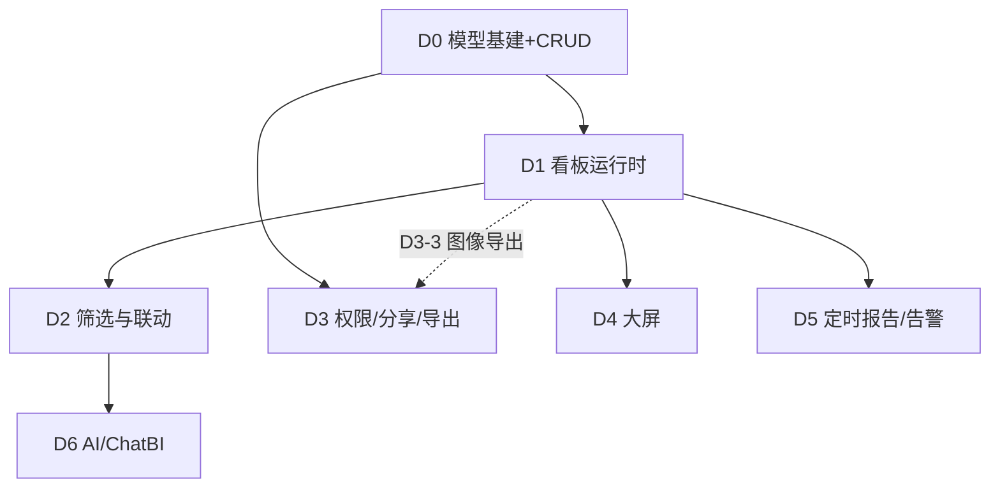

# nop-datav 实现 Roadmap

> Last updated: 2026-08-15（EXECUTE 轮：D1-4 plan `2026-08-15-1134-1` 已 completed — flux dashboard editor 布局对齐后端交付：契约定稿 runtime-design.md §九（11 项裁定）+ `exportDashboardLayout`/`saveDashboardLayout` action（reconcile 增删改 + dataBinding 唯一保护区 + 绑定保留 + AlertRule 级联 + 校验失败零落库）+ 编解码器 `DashboardLayoutCodec` + 5 错误码 + 独立上界配置 + 30 新测试（13 导出 + 14 保存 + 3 E2E roundtrip），530/0/0 datav-service 全绿；独立 closure audit CLOSABLE。此前：DRAFT_PLANS 轮：最后两个 `todo` 项 D1-4/D2-4 转 `planned`——flux 侧阻塞解除（dashboard editor `flux-renderers-dashboard` full-green + dashboard-filter 编排约定落地），起草后端对齐 plans `2026-08-15-1134-1`（布局导出/保存回写 + roundtrip E2E）与 `2026-08-15-1134-2`（筛选定义产出 + date-range/widget/URL 契约），各经三轮独立对抗性审查后 active；deferred 项复核：nop-retry 重试仍 blocked（平台无本地 IRpcServiceInvoker 未解除，re-trigger 条件见 plan `2026-08-14-1510-2`）、图像导出/缩略图仍 blocked（无后端渲染内核）、按看板显式用户授权 successor 未触发（本轮不纳入）。此前：D1-2 deferred follow-up — 批量面板查询性能（并行 + 缓存）plan `2026-08-15-0004-3` 已 completed — `getDashboardData` 面板查询有界并行（共享 `GlobalExecutors.globalWorker()` + 请求内 Semaphore parallelism=4，worker 任务 `runInNewSession` + 每任务 context 拷贝防 TransactionRegistry 并发损坏；D3/D4 语义不变式与顺序版逐条等价）+ 查询结果缓存（平台 `io.nop.commons.cache` LocalCache 单节点语义，键=数据集身份+求值后参数+rowLimit，TTL-only staleness 契约（默认 30s），失败/无数据集条目不缓存，行数准入上界不截断；纠正「数据集查询缓存复用 nop-report」空洞前提——nop-report 无数据集查询缓存抽象已核实）；6 配置项（并行默认开/缓存默认关，关闭均回归现状等价）；设计定稿 runtime-design.md §八（裁定 P1–P5，supersede §4.4 顺序执行与 §五并行拒绝）；15 新测试（6 并行 + 8 缓存 + 1 E2E），500/0/0 datav-service 全绿；独立 closure audit CLOSABLE。此前：D3-2 deferred follow-up — 分享访问安全加固（速率限制 + 访问统计）plan `2026-08-15-0004-2` 已 completed — `getSharedDashboard` 匿名访问路径两级限流 + 访问统计收口：R1 组合键 `shareToken|来源IP`（`getRequestClientIp` 读 `nop-client-addr`，无 IP 退化 token 单维显式记录）；R2 进程内 LocalCache 容量上界（max-keys 10000）+ 单节点语义/集群边界显式记录；R3 密码失败 5 次/窗口锁定（失败专用计数，缺密码不计，成功清账，锁定期间正确密码也被拒）+ 总速率 60 次/窗口，窗口 600s，开关关闭逐字节等价；R5 限流先于 token 查库（被拒请求零 DB，探测超限后 TOKEN_NOT_FOUND 翻转 RATE_LIMITED）；R6 自定义固定窗口计数 + 锁定时间戳状态机（拒绝裸 DefaultRateLimiter）；R4 share 实体聚合列 visitCount/lastVisitTime（ORM 源模型 + 再生成链路，拒绝 audit-patterns 明细留痕主形态）+ 定向 SQL `COALESCE(VISIT_COUNT,0)+1` 原子自增（无 version bump/不触碰审计列，仅成功访问计数，写失败 WARN fail-open）+ listShares 自动暴露；新增 guard bean `nopDatavShareAccessGuard`（时钟 seam，测试 fake 时钟推进窗口零 sleep）+ 2 错误码（share-rate-limited/share-password-locked 含 retryAfterSeconds）+ 5 配置项；设计定稿 permission-sharing-design.md「访问限流与访问统计」（裁定 R1–R6）；11 新测试（7 限流 + 3 统计 + 1 E2E 全生命周期），485/0/0 datav-service 全绿；独立 closure audit CLOSABLE。此前：D6-1 deferred follow-up — ChatBI 会话历史持久化（多轮对话）plan `2026-08-15-0004-1` 已 completed — `chatToQuery` 新增可选 `sessionId` 参数（缺省单轮逐字节等价；携带时归属校验 → S2 双上界截断历史注入（max-turns 10/max-chars 20000 取小、最老优先丢弃）→ 执行 → 本轮问答落库）；新增自有实体 NopDatavChatSession/NopDatavChatMessage（seq 每会话严格递增 + UK，拒绝复用 nop-ai NopAiSession 实体族避免 nop-ai-dao 依赖）；4 个会话管理 action（createChatSession/listChatSessions/getChatSessionHistory/deleteChatSession，owner=userName 归属隔离，CRUD 权限点仅绑 admin 镜像 D1 先例）+ 2 错误码 + 2 配置项；设计定稿 ai-design.md §10（裁定 S1–S5）；24 新测试（9 focused + 7 管理 + 7 RBAC 运行时 + 1 E2E），474/0/0 datav-service 全绿；独立 closure audit CLOSABLE。此前：D1-2/D2-1 deferred follow-up — 批量面板数据查询 plan `2026-08-14-2020-2` 已 completed — 新增 `NopDatavDashboardBizModel.getDashboardData(dashboardId, params, panelIds?)` 批量查询 action（@BizQuery + @Auth，D1 归属看板视角）：requireEntity live 校验（D5，发布非前置）→ 看板级筛选经 DashboardFilterResolver 一次求值统一映射到各面板（与逐面板 resolveFilterValues + getPanelData 组合语义等价）→ 按 sortOrder 加载面板（D2：可选 panelIds 子集，条目跟随 sortOrder + 重复去重，不存在/跨看板 id 整体抛 ERR_DATAV_PANEL_NOT_IN_DASHBOARD）→ 上限校验先于任何查询（D4：`nop.datav.dashboard-query.max-panels` 默认 50，超限抛 ERR_DATAV_DASHBOARD_PANEL_LIMIT_EXCEEDED）→ 顺序迭代复用 PanelDataBinder（D3：仅 NopException 捕获为面板级失败条目 success=false+errorCode+errorMessage，含无数据集面板 hasDataset=false 条目，与 exportDashboard 排除语义有意区分）；新 DTO DashboardDataResult/DashboardPanelDataItem（io.nop.datav.biz）+ biz 接口声明 + 权限点 FNPT:NopDatavDashboard:getDashboardData（admin,user，镜像 getPanelData）+ 2 错误码 + 1 配置项；设计定稿 runtime-design.md §四（原 §四-§六顺延为 §五-§七）+ linkage-design.md 三处过期陈述同步（「不引入批量查询」绝对化契约移除）；并行/缓存裁定 deferred（optimization candidate）；7 新测试（6 focused + 1 E2E），450/0/0 datav-service 全绿；独立 closure audit CLOSABLE 8/8 PASS。此前：D3-2 deferred follow-up — 删除生命周期级联 plan `2026-08-14-2020-1` 已 completed — 看板/大屏/面板/规则/任务删除收口为完整删除生命周期：Dashboard/Screen BizModel 覆写 4 参 `doDeleteEntity`（D5 裁定，delete/batchDelete/deleteByQuery 均收敛）级联处理子对象（Panel/Tab/DatasetRef/FilterState/ScreenWidget 物理删除，Dashboard/ScreenSnapshot 级联删除 D1）+ 全部分享逻辑吊销 enabled=0（D2）+ 关联 ReportTask/AlertRule 置 DISABLED 并即时 unregister（D3）；Gap #3 修复（标准 delete 路径只调 2 参 deprecated afterEntityChange，3 参覆写不触发 → AlertRule/ReportTask BizModel 改挂 doDeleteEntity 即时注销）；getSharedDashboard 看板存活防御（新错误码 ERR_DATAV_SHARE_DASHBOARD_NOT_FOUND）；审计 pattern 补 `NopDatavDashboardShare__*`；设计定稿 permission-sharing-design.md「删除生命周期与分享吊销」+ schedule-report-design.md §26；10 新测试（9 DeleteLifecycle + 1 share 审计），443/0/0 datav-service 全绿；独立 closure audit CLOSABLE 11/11 PASS。此前：D5/D3 deferred follow-up — 周期性 stuck-task 恢复 plan `2026-08-14-1510-1` 已 completed — 新增 `NopDatavStuckTaskScanner` 周期 job（默认 10 min 间隔/60 min 阈值，可配置 enabled/interval/timeout）+ 两类 recovery 带阈值 `scanStuck(int)`（交付 startTime/导出 createTime 基准），关闭「worker 线程因 JVM Error 死亡 → stuck 直到重启」gap；重启 @PostConstruct 无阈值全量恢复不变式保持；retry plan `2026-08-14-1510-2` 仍 deferred（正交）；设计定稿 `schedule-report-design.md` §25；9 新测试（含 fireNow beanMethod 接线 + 慢执行竞态），433/0/0 datav-service 全绿；独立 closure audit CLOSABLE 10/10 PASS。此前：P2 audit backlog cleanup plan `2026-08-14-0950-1` 已 completed — Dim09-03 导出错误码语义 + Dim04-01/02 ScreenSnapshot ORM 契约（mandatory+UK 命名）+ AR-1 nop-datav-core 孤儿模块删除 + AR-2 nop-datav-chart 空壳模块删除 + AR-7 ChatBI 数据集查询 status 下推 SQL + 2 minor nits；423/0/0 datav-service 全绿含 2 新测试；`nop-datav-audit-followups.md` 全部 17 items + 2 nits ✅ resolved；D5 reliability defect remediation plan `2026-08-14-0937-2` 已 completed — Dim14-03 通知顺序修复 + Dim14-04/Dim09-05 调度器异常分类 + Dim09-02 结构化错误码 + Dim16-02/Dim16-03 错误路径测试；409/0/0 datav-service 全绿含 7 新测试；D5-1/D5-2 deferred successor — IM/渠道推送 plan `2026-08-14-0937-1` 已 completed — sendReport/sendAlert 对 notifyChannels=["im"] 经 IChannelMessageService.sendToUser 真实发送（Decision A 格式分区 + Decision B 渠道聚合 + Decision C 无附件），UnsupportedOperationException 移除；403/0/0 datav-service 全绿含 7 新 IM 测试；D6-2（AI 大屏生成）plan 1516-2 已 completed；D6-1 successor（NL→看板生成）plan 1516-1 已 completed；D6 全 done；D5 全 done；D4 全 done；D1-4/D2-4 前端仍 blocked 于 flux）
> Sources: `ai-dev/analysis/2026-08/2026-08-09-nop-datav-function-analysis.md`（功能设计分析）
> 前端配套：`nop-chaos-flux` BI 控件族（chart/pivot-table/stat-tile/map/dashboard editor 计划）
> 目标：将 nop-datav 从空壳实现为「BI 看板/大屏的模型层 + 运行时编排」（数据源/数据集/查询复用 nop-report + nop-metadata + EQL）

## Purpose

本文是 nop-datav 的长期开发路线图，覆盖看板核心、联动协作、大屏三个阶段的全部工作项。每个 work item 是一个 execution plan 的合理交付范围。

AI 或维护者读完本文即知哪些工作项已启动（`todo`）、已计划（`planned`）、已完成（`done`），无需重走全部设计文档。引擎按文档顺序取首个 `todo` 项推进（D0 优先）。

**本文是编排层（index layer），不是 execution plan，也不是设计契约。** 设计契约看各工作项的 design doc（`ai-dev/design/nop-datav/`）。阶段标题（Dn）为组织视图，无独立状态——唯一动态状态区是下方 Work Items 列表。

## Work Items

> **全文件唯一的动态状态块。状态只在这里更新。**
> 状态流转：`todo`（引擎拾取，按文档顺序取首项）→ `planned`（draft review 通过）→ `done`（closure audit 通过）。引擎合法状态集为 `{todo, ready, planned, done}`；后续阶段（D1-D6）虽未启动但亦标 `todo`，靠文档顺序保证 D0 优先。
> 人/AI 分工：人设定 work item 及顺序；AI 取第一个 `todo` 项，draft/execute plan，closure audit 通过后写回 `done`。

### D0 — 模型基建与看板 CRUD

> 依赖：nop-metadata 维度/度量模型（已有）、nop-report 数据集 API（已有）、nop-auth 权限模型（已有）
> 设计契约：`ai-dev/design/nop-datav/model-design.md`（D0-3 产出）

- D0-1. 数据模型设计（`NopDatavDashboard`/`NopDatavPanel`/`NopDatavDashboardTab`/`NopDatavDatasetRef` ORM 模型，参考 Grafana Dashboard JSON + DataEase `data_visualization_info` + Metabase 三表；关联 nop-metadata dimension/measure 作为字段映射元数据来源）: `done`
- D0-2. CRUD 服务（GraphQL CRUD，nop 标准 crud 模式 + 发布/快照，DataEase Snapshot 参考：主表管权限、快照表管内容）: `done`
- D0-3. 设计文档定稿（`model-design.md`：含与 nop-report 数据集/nop-metadata 的关系、拒绝的替代方案）: `done`
- D0-4. 单元测试 + AutoTest 覆盖: `done`

验收：看板/面板/数据集引用 CRUD 可用；发布/快照语义落地；design doc 与 live 模型一致。

### D1 — 看板运行时（面板渲染 + 数据绑定 + 刷新）

> 依赖：D0；前端 nop-chaos-flux dashboard editor / chart / pivot-table / stat-tile / map（flux 侧计划）
> 设计契约：`ai-dev/design/nop-datav/runtime-design.md`（D1 时产出）

- D1-1. 面板渲染协议（组件注册表 chart/pivot-table/stat-tile/map/table/text/iframe + 组件配置 JSON schema，参考 JimuReport option 透传 + DataEase 字段映射）: `done`
- D1-2. 数据绑定管线（面板 → 数据集引用 → 参数求值 → EQL/数据集查询 → 结果回传，复用 nop-report 数据集执行 + 缓存。**边界：仅模型侧解析 + 查询委托/回传，不含前端渲染**；若参数求值（template-tag/类型转换）复杂化则拆为「参数求值」与「查询委托/回传」两 plan）: `done` ✅（plan `ai-dev/plans/nop-datav/2026-08-10-1000-2-dashboard-runtime-panel-data-binding-refresh.md` 等（D1-2/D2-1 批量查询 `2026-08-14-2020-2`）；deferred follow-up「批量面板查询性能（并行 + 缓存）」已由 plan `2026-08-15-0004-3` 落地 — getDashboardData 有界并行 + LocalCache 结果缓存，设计 runtime-design.md §八；「复用 nop-report 缓存」前提已纠正为按 nop 标准缓存抽象自接入）
- D1-3. 刷新机制（面板级 enable/interval，DataEase refreshViewEnable 参考 + 手动刷新 API）: `done`
- D1-4. 前端集成（flux dashboard editor 布局 JSON 与 nop-datav `layoutJson` 双向对齐，flux 侧落地后对接）: `done` ✅（plan `ai-dev/plans/nop-datav/2026-08-15-1134-1-flux-dashboard-editor-layout-alignment.md` completed — 布局对齐契约定稿 runtime-design.md §九（面板身份/名字列派生/类型词表（flux↔registry 恒等 + PanelTypeMapping 复用，html 显式拒绝）/几何与网格 layoutConfig 钉死（json-4000 容量判据）/存量无几何默认布局合成/props↔panelConfig（dataBinding 唯一保护区）/保存载荷布局对象/tabs v1 平铺/绑定 source 一等描述且保存永不消费/独立上界 `nop.datav.dashboard-layout.max-panels`/roundtrip 等价判据）+ `exportDashboardLayout`（@BizQuery admin,user）与 `saveDashboardLayout`（@BizMutation admin，两阶段：纯校验先行=失败零落库；reconcile 增删改 + 删除面板 AlertRule 级联置 DISABLED）+ 编解码器 `DashboardLayoutCodec` + 5 新错误码 + 30 新测试（13 导出 + 14 保存 + 3 E2E roundtrip 含 getDashboardData 接线与发布回归），530/0/0 datav-service 全绿；flux 编辑器实际对接为外部后续（非本仓库 debt））
- D1-5. 端到端（看板创建 → 面板配置 → 数据渲染 → 刷新 全链路）: `done`

验收：面板可渲染 chart/pivot/stat-tile 数据；参数化数据集查询正确；刷新生效。

### D2 — 全局筛选与联动

> 依赖：D1
> 设计契约：`ai-dev/design/nop-datav/linkage-design.md`（D2 时产出）

- D2-1. 全局筛选参数（看板级参数定义 + 面板级参数映射，Metabase parameters → parameter_mappings 参考 + URL 同步）: `done`
- D2-2. 图表联动三件套（联动 + 跳转 + 外部参数注入，DataEase LinkageService/LinkJump/LinkOuterParams 参考）: `done`
- D2-3. 联动状态服务（filter_state 保存/恢复，Superset filter_state API 参考）: `done`
- D2-4. 前端（flux dashboard-filter 约定与 nop-datav 参数模型对齐）: `planned` ✅（flux 侧 dashboard-filter 编排约定已落地（`nop-chaos-flux:docs/components/dashboard-filter/design.md` + 走查单测 4 条）；后端对齐 plan `ai-dev/plans/nop-datav/2026-08-15-1134-2-flux-dashboard-filter-param-alignment.md` active：契约定稿（date-range 转换归属/delimiter+valueFormat 钉死/widget 词表+options 来源/URL 同步）+ 筛选定义产出 API + 闭环 E2E；与 D1-4 软顺序可独立先行；flux 渲染为外部后续）

验收：看板级筛选改变所有绑定面板；图表点击联动 + 跳转 + 外部参数可用；刷新后筛选状态保持。

### D3 — 权限、分享与导出

> 依赖：D0；D3-3 图像导出（PDF/PNG）隐含依赖 D1（已渲染快照）；nop-auth（复用）、nop-report 导出管线（复用）
> 设计契约：`ai-dev/design/nop-datav/permission-sharing-design.md`（D3 时产出）

- D3-1. 看板权限（角色/用户级权限 + 数据权限行级，Superset RLS 参考，接入 nop-auth）: `done` ✅（plan `ai-dev/plans/nop-datav/2026-08-10-1100-1-dashboard-permission-and-audit-log.md`）
- D3-2. 分享（公共链接 + 密码 + 有效期，AJ-Report `report_share` 参考；嵌入可选，Metabase embedding 参考）: `done` ✅（plan `ai-dev/plans/nop-datav/2026-08-10-1100-2-dashboard-sharing.md`）
- D3-3. 导出（看板/面板导出 PDF/PNG/Excel，异步任务 + 限额，DataEase 导出中心参考。**注意：数据导出 CSV/Excel 仅依赖 D0 + nop-report；图像导出 PDF/PNG 需已渲染的看板快照，隐含依赖 D1 运行时**）: `done`（数据导出 CSV/Excel） ✅（plan `ai-dev/plans/nop-datav/2026-08-10-1130-1-dashboard-panel-data-export.md` 已完成；图像导出 PDF/PNG out-of-scope，显式拒绝，待渲染能力落地后的后继 plan）
- D3-4. 操作日志（nop-auth 操作日志接入）: `done` ✅（与 D3-1 同 plan，纯配置启用 `GraphQLAuditLogger`）

验收：权限矩阵生效；分享链接按有效期/密码校验；导出异步可用。

### D4 — 大屏（自由画布 + 装饰组件 + 轮播/适配）

> 依赖：D1；优先级低于 D2/D3（看板核心优先）
> 设计契约：`ai-dev/design/nop-datav/screen-design.md`（D4 时产出）

- D4-1. 自由画布布局（x/y/w/h 画布 JSON + 屏幕适配 heightFirst/full/keep，DataEase screenAdaptor 参考；辅助线/标尺可选，DataRoom 参考）: `done` ✅（plan `ai-dev/plans/nop-datav/2026-08-10-1130-2-screen-free-canvas-layout.md` 已完成 — 独立三实体 NopDatavScreen/ScreenWidget/ScreenSnapshot + dict `datav/screen-adaptor` + 自由画布布局协议 `ScreenLayoutParser`（widget 越界/未知组件运行时校验）+ `getScreenLayout` API（读已发布快照，经 PanelComponentRegistry.requireComponent 接线）+ publish/getPublished/rollback 复用 D0 模式 + 大屏 action `@Auth` + owner RLS；32 新测试，216/0/0 全绿；装饰组件 D4-2/主题 D4-3/发布生命周期 D4-4/前端渲染 各为独立 plan）
- D4-2. 装饰/媒体组件族（装饰边框/滚动文字/时间时钟/视频/流媒体/轮播 Tab，DataEase de-* 族参考。**边界：仅组件注册表 + 配置 schema，渲染走 nop-chaos-flux；不含媒体代理/流后端实现**）: `done` ✅（plan `ai-dev/plans/nop-datav/2026-08-10-1200-1-screen-decorative-media-components.md` 已完成 — 6 类装饰/媒体组件（decorative-border/scroll-text/time-clock/video/stream/carousel-tab，均 needsDataset=false）登记进既有 PanelComponentRegistry（共 14 类）+ PanelComponentMeta 扩展携带命名配置区域描述符（向后兼容）+ `NopDatavScreenBizModel.getComponentTypes` API（@BizQuery，admin,user 可读，返回类型清单+配置区域描述符）+ `nop-datav.action-auth.xml` 增配权限点；端到端验证 6 类装饰 widget 经 getScreenLayout → ScreenLayoutParser → requireComponent 运行时连通；6 新测试，222/0/0 全绿；前端渲染走 flux out-of-scope）
- D4-3. 大屏主题（主题色板 + 背景，JimuReport theme/sysDefColor 参考）: `done` ✅（plan `ai-dev/plans/nop-datav/2026-08-10-1200-2-screen-theme-palette.md` 已完成 — 复用 D4-1 预留 backgroundConfig 列定义其内容结构 `{palette:{命名色}, background:{type,value}}`（不新增 ORM 列）+ ScreenThemeConfig（dao）+ ScreenThemeParser（service）实现 backgroundConfig → 结构化 theme 解析（palette 缺省值填充 + background type/value 缺省 + 含主题键但值非法显式抛 ERR_DATAV_INVALID_THEME_CONFIG）+ ScreenLayoutConfig 新增 theme 字段（additive，Canvas.backgroundConfig 原样透传不破坏 D4-1 契约）+ widget.widgetConfig.theme 命名引用解析期替换为 palette 实际色值放入 widget.resolvedTheme（styleOptions 不被自动改写）+ screen-design.md §11 最终结论；向后兼容：legacy 自由格式 backgroundConfig 不报错、原样透传；22 新测试，245/0/0 全绿；前端渲染走 flux out-of-scope）
- D4-4. 发布生命周期（暂存/发布/历史/缩略图，DataRoom 参考简化版）: `done` ✅（plan `ai-dev/plans/nop-datav/2026-08-10-1200-3-screen-publish-lifecycle.md` 已完成 — 4 新 action（getScreenSnapshotHistory 历史浏览返元信息列表/getScreenLayoutByVersion 指定版本布局查看/getScreenDraftLayout 草稿预览/setScreenThumbnail 缩略图设置）+ NopDatavScreen 主表新增 thumbnail 列（precision 4000，文件记录引用 ID 或 data URL）+ ScreenLayoutParser 增 `parse(String, String)` content overload（草稿预览复用 serializeScreenContent+parse，不经快照表落盘；既有 snapshot overload 委托新 overload）+ ScreenSnapshotHistory DTO + serializeScreenContent 只读附带 thumbnail 到快照 JSON + 4 个新 action 权限点（历史/版本布局 admin,user；草稿预览/缩略图设置 admin）；缩略图写入唯一性裁定（仅 setScreenThumbnail 写入，publish 不触碰 thumbnail）；screen-design.md §12 最终结论；10 新测试，255/0/0 全绿；缩略图图像生成走 flux out-of-scope）

验收：大屏可自由布局 + 装饰组件 + 轮播 + 全屏适配；发布/回滚可用。

### D5 — 定时报告与轻量告警

> 依赖：D1；nop-job 调度（复用）、nop-message 通知（复用）
> 设计契约：`ai-dev/design/nop-datav/schedule-report-design.md`（D5 时产出）

- D5-1. 定时报告（看板快照定时生成 + 发送邮件/IM，Superset 定时报告参考，crontab + grace）: `done` ✅（plan `ai-dev/plans/nop-datav/2026-08-10-1230-1-scheduled-report-generation-and-delivery.md` 已完成 — 渲染时机=调度触发时复用 PanelDataExporter 取当前 panel 表实时数据 render-at-execution；通知走 nop-integration(IEmailSender)+nop-sys(NopSysNoticeTemplate) 非 nop-message；调度=beanMethod invoker+可空注入 IJobScheduler 镜像 MetaQualityCheckpointScheduler；新增 NopDatavReportTask/NopDatavReportDelivery 实体 + NopDatavReportScheduler/ReportDeliveryExecutor/NotificationSender/NopDatavReportDeliveryRecovery；邮件端到端打通；IM 渠道 successor plan `2026-08-14-0937-1-im-channel-notification-integration.md` 已落地（IChannelMessageService.sendToUser 文本通知，无附件）；固定版本快照/集群rpc 裁定 deferred；13 新测试，268/0/0 datav-service 全绿；独立 closure audit PASS 15/15 gates）
- D5-2. 轻量告警（面板数据阈值条件 + 通知渠道，Redash Alert 参考：operator/value + rearm 冷静期）: `done` ✅（plan `ai-dev/plans/nop-datav/2026-08-10-1230-2-lightweight-alert-threshold-rearm-notification.md` 已完成 — 复用 D5-1 调度范式+通知抽象（sendAlert 本计划定义，告警专用错误码自建）；新增 NopDatavAlertRule/NopDatavAlertState 实体 + AlertEvaluator/NopDatavAlertScheduler/AlertAggregator/AlertThresholdComparator；两态状态机 OK/TRIGGERED（RESOLVED=TRIGGERED→OK 瞬态恢复通知）+ rearm 冷静期；thresholdValue+thresholdValue2 支持 between；valueField+aggregation 标量聚合；邮件端到端打通；IM 渠道 successor plan `2026-08-14-0937-1-im-channel-notification-integration.md` 已落地；多面板组合/历史持久化/多级阈值 裁定 deferred；52 新测试，320/0/0 datav-service 全绿；独立 closure audit PASS 15/15 gates）

验收：定时报告生成并送达；阈值告警触发与恢复通知正确。

### D6 — AI/ChatBI 接入（nop-ai）

> 依赖：D2（参数/联动语义稳定）；nop-ai 生态（已有）
> 设计契约：`ai-dev/design/nop-datav/ai-design.md`（D6 时产出）

- D6-1. ChatBI（自然语言 → 数据集查询/看板生成，DataEase SQL 助手 / Metabase Metabot 参考，nop-ai agent 接入）: `done` ✅（核心查询 plan `2026-08-10-1300-1` + NL→看板生成 successor plan `2026-08-10-1516-1-nl-dashboard-panel-generation.md` 均完成 — 循环泛化将 D6-1 查询专用 ChatBiToolCallingLoop 泛化为查询+生成两路径共享（裁定 L，4 泛化点：注入式 system prompt + 可插拔 ToolResultHandler + 泛化 ChatBiResult.createdEntityId + operator 传递）；新增 datav-generate-dashboard 工具 + DatavGenerateDashboardExecutor（裁定 G-O：operator 强转传递/草稿语义/DatasetRef 去重/显式校验失败/8 类组件边界/dsMeta 共享 helper/IOrmTemplate 事务无半成品）+ DatasetMetaParser + chatToDashboard(@BizMutation @Auth) action；设计文档 ai-design.md §8 增补裁定 G-O；349/0/0 datav-service 全绿含 16 新测试；deferred follow-up「会话历史持久化（多轮对话）」已由 plan `2026-08-15-0004-1` 落地 — chatToQuery 会话化 + NopDatavChatSession/ChatMessage 实体 + 4 会话管理 action，设计 ai-design.md §10，474/0/0 全绿）
- D6-2. AI 大屏生成（可选，MCP Tool 暴露组件/配置，DataRoom ai-generation 参考）: `done` ✅（plan `ai-dev/plans/nop-datav/2026-08-10-1516-2-ai-screen-generation.md` 完成 — 复用 1516-1 的「创作型工具 + chatToXxx 编排 + operator 传递 + 泛化循环」模式面向大屏自由画布；新增 datav-list-component-types 工具（14 类组件发现，裁定 O 独立 executor）+ datav-generate-screen 工具（DatavGenerateScreenExecutor：裁定 N 直存 sid 不经 DatasetRef / 裁定 L 越界 mandatory throw 对齐 screen-design §7.1 / 裁定 M 装饰组件 datasetSid 忽略 / 裁定 P displayName 回退 screenName / 裁定 Q screenName UK 冲突显式错误）+ chatToScreen(@BizMutation @Auth) action + SCREEN_SYSTEM_PROMPT（含禁止 SQL + 草稿 + 不越界约束）；设计文档 ai-design.md §9 增补裁定 L–Q；378/0/0 datav-service 全绿含 29 新测试）

验收：对话生成看板/查询可用；配置经 nop-ai 管线执行。

## 依赖关系

阶段顺序（推荐优先级，非严格线性依赖——并行可能性见上图依赖图）：D0 → D1 → D2/D3 → D4 → D5 → D6；D2 与 D3 可并行，D4+ 不阻塞看板核心。

## Framework / platform reuse（防重建）

> nop-datav 是「模型层 + 运行时编排」，底层数据/渲染/调度/通知能力一律复用既有平台模块，禁止重建。

| 能力 | Provider（复用） | nop-datav 侧职责 |
|------|------------------|------------------|
| 数据源 / 数据集 / EQL 查询 / 数据集缓存 | nop-report | 仅做数据集引用 + 参数映射，不重建数据源管理 |
| 维度 / 度量 / 语义层 / 字段映射元数据 | nop-metadata | 引用 dimension/measure 作为字段映射来源 |
| 权限 / 角色用户 / 行级数据权限 / 操作日志 | nop-auth | 接入权限模型 + RLS，不自建权限体系 |
| 定时调度 | nop-job | 仅注册报表/告警任务，不重建调度器 |
| 通知渠道（邮件/IM） | nop-message | 仅触发通知，不重建通知管线 |
| 前端渲染（chart/pivot/stat-tile/map/dashboard editor） | nop-chaos-flux | 仅做布局 JSON + 配置 schema，渲染走 flux renderers |
| 导出管线 | nop-report | 仅编排异步导出任务 + 限额，不重建导出内核 |

## Cross-cutting concerns（跨阶段陷阱，起草 plan 时避坑）

| 关注点 | 约定 | 来源 |
|--------|------|------|
| 错误处理 | 框架核心/公共 API 用 `NopException` + `ErrorCode` + `.param(...)`；模块内部可用模块级异常类，禁用裸 `RuntimeException`，错误消息用英文 | `docs-for-ai/02-core-guides/error-handling.md` |
| 缓存策略 | 查询结果缓存按 nop 标准缓存抽象（`io.nop.commons.cache`，进程内 LocalCache，单节点语义）接入 nop-datav 自有路径（先例：getDashboardData 批量路径，runtime-design.md §八），不复用/不重建 nop-report 缓存（nop-report 无数据集查询缓存抽象，2026-08-15 已核实） | runtime-design.md §8.3 |
| ORM 模型变更 | 属 plan-first 区域，经 DRAFT→REVIEW→EXEC→CLOSURE_AUDIT；编辑 `model/*.orm.xml` 源模型而非生成物 `_*.xml`/`_gen/` | AGENTS.md Protected Areas |
| 前后端版本兼容 | `layoutJson` / 组件配置 JSON schema 需向前兼容；flux 侧控件族版本与 nop-datav 协议对齐 | D1-4 / D4 |
| 国际化 | displayName、错误码消息遵循 nop i18n 约定 | nop 平台标准 |

## 验证策略（roadmap 级）

- 每个 D 阶段独立 design doc + execution plan（`ai-dev/plans/nop-datav/`），closure 走独立审计。
- 端到端验证载体：`nop-demo` 或 `nop-app-erp` 的 BI 看板示例（区域销售分析 + 门店地图 + 经营 KPI），与 flux 侧 dashboard editor/pivot-table/map 落地联动。

## Non-Goals（roadmap 明确不做）

- 数据源/数据集管理重建（复用 nop-report）。
- 渲染引擎重建（走 nop-chaos-flux renderers）。
- 流式数据集（WebSocket/MQTT，DataRoom 独有，按需评估）。
- 填报/协同编辑（JimuReport/SpringReport 域，另行评估）。
