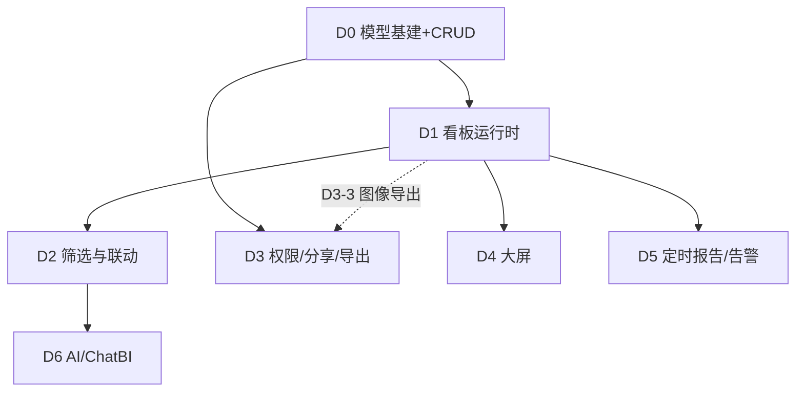

# nop-datav 实现 Roadmap

> Last updated: 2026-08-10（D3-3 导出、D4-1 大屏自由画布 经两轮 plan review 通过，置 `planned`；D1-4/D2-4 前端仍 blocked 于 flux）
> Sources: `ai-dev/analysis/2026-08/2026-08-09-nop-datav-function-analysis.md`（功能设计分析）
> 前端配套：`nop-chaos-flux` BI 控件族（chart/pivot-table/stat-tile/map/dashboard editor 计划）
> 目标：将 nop-datav 从空壳实现为「BI 看板/大屏的模型层 + 运行时编排」（数据源/数据集/查询复用 nop-report + nop-metadata + EQL）

## Purpose

本文是 nop-datav 的长期开发路线图，覆盖看板核心、联动协作、大屏三个阶段的全部工作项。每个 work item 是一个 execution plan 的合理交付范围。

AI 或维护者读完本文即知哪些工作项已启动（`todo`）、已计划（`planned`）、已完成（`done`），无需重走全部设计文档。引擎按文档顺序取首个 `todo` 项推进（D0 优先）。

**本文是编排层（index layer），不是 execution plan，也不是设计契约。** 设计契约看各工作项的 design doc（`ai-dev/design/nop-datav/`）。阶段标题（Dn）为组织视图，无独立状态——唯一动态状态区是下方 Work Items 列表。

## Work Items

> **全文件唯一的动态状态块。状态只在这里更新。**
> 状态流转：`todo`（引擎拾取，按文档顺序取首项）→ `planned`（draft review 通过）→ `done`（closure audit 通过）。引擎合法状态集为 `{todo, ready, planned, done}`；后续阶段（D1-D6）虽未启动但亦标 `todo`，靠文档顺序保证 D0 优先。
> 人/AI 分工：人设定 work item 及顺序；AI 取第一个 `todo` 项，draft/execute plan，closure audit 通过后写回 `done`。

### D0 — 模型基建与看板 CRUD

> 依赖：nop-metadata 维度/度量模型（已有）、nop-report 数据集 API（已有）、nop-auth 权限模型（已有）
> 设计契约：`ai-dev/design/nop-datav/model-design.md`（D0-3 产出）

- D0-1. 数据模型设计（`NopDatavDashboard`/`NopDatavPanel`/`NopDatavDashboardTab`/`NopDatavDatasetRef` ORM 模型，参考 Grafana Dashboard JSON + DataEase `data_visualization_info` + Metabase 三表；关联 nop-metadata dimension/measure 作为字段映射元数据来源）: `done`
- D0-2. CRUD 服务（GraphQL CRUD，nop 标准 crud 模式 + 发布/快照，DataEase Snapshot 参考：主表管权限、快照表管内容）: `done`
- D0-3. 设计文档定稿（`model-design.md`：含与 nop-report 数据集/nop-metadata 的关系、拒绝的替代方案）: `done`
- D0-4. 单元测试 + AutoTest 覆盖: `done`

验收：看板/面板/数据集引用 CRUD 可用；发布/快照语义落地；design doc 与 live 模型一致。

### D1 — 看板运行时（面板渲染 + 数据绑定 + 刷新）

> 依赖：D0；前端 nop-chaos-flux dashboard editor / chart / pivot-table / stat-tile / map（flux 侧计划）
> 设计契约：`ai-dev/design/nop-datav/runtime-design.md`（D1 时产出）

- D1-1. 面板渲染协议（组件注册表 chart/pivot-table/stat-tile/map/table/text/iframe + 组件配置 JSON schema，参考 JimuReport option 透传 + DataEase 字段映射）: `done`
- D1-2. 数据绑定管线（面板 → 数据集引用 → 参数求值 → EQL/数据集查询 → 结果回传，复用 nop-report 数据集执行 + 缓存。**边界：仅模型侧解析 + 查询委托/回传，不含前端渲染**；若参数求值（template-tag/类型转换）复杂化则拆为「参数求值」与「查询委托/回传」两 plan）: `done`
- D1-3. 刷新机制（面板级 enable/interval，DataEase refreshViewEnable 参考 + 手动刷新 API）: `done`
- D1-4. 前端集成（flux dashboard editor 布局 JSON 与 nop-datav `layoutJson` 双向对齐，flux 侧落地后对接）: `todo`
- D1-5. 端到端（看板创建 → 面板配置 → 数据渲染 → 刷新 全链路）: `done`

验收：面板可渲染 chart/pivot/stat-tile 数据；参数化数据集查询正确；刷新生效。

### D2 — 全局筛选与联动

> 依赖：D1
> 设计契约：`ai-dev/design/nop-datav/linkage-design.md`（D2 时产出）

- D2-1. 全局筛选参数（看板级参数定义 + 面板级参数映射，Metabase parameters → parameter_mappings 参考 + URL 同步）: `done`
- D2-2. 图表联动三件套（联动 + 跳转 + 外部参数注入，DataEase LinkageService/LinkJump/LinkOuterParams 参考）: `done`
- D2-3. 联动状态服务（filter_state 保存/恢复，Superset filter_state API 参考）: `done`
- D2-4. 前端（flux dashboard-filter 约定与 nop-datav 参数模型对齐）: `todo`

验收：看板级筛选改变所有绑定面板；图表点击联动 + 跳转 + 外部参数可用；刷新后筛选状态保持。

### D3 — 权限、分享与导出

> 依赖：D0；D3-3 图像导出（PDF/PNG）隐含依赖 D1（已渲染快照）；nop-auth（复用）、nop-report 导出管线（复用）
> 设计契约：`ai-dev/design/nop-datav/permission-sharing-design.md`（D3 时产出）

- D3-1. 看板权限（角色/用户级权限 + 数据权限行级，Superset RLS 参考，接入 nop-auth）: `done` ✅（plan `ai-dev/plans/nop-datav/2026-08-10-1100-1-dashboard-permission-and-audit-log.md`）
- D3-2. 分享（公共链接 + 密码 + 有效期，AJ-Report `report_share` 参考；嵌入可选，Metabase embedding 参考）: `done` ✅（plan `ai-dev/plans/nop-datav/2026-08-10-1100-2-dashboard-sharing.md`）
- D3-3. 导出（看板/面板导出 PDF/PNG/Excel，异步任务 + 限额，DataEase 导出中心参考。**注意：数据导出 CSV/Excel 仅依赖 D0 + nop-report；图像导出 PDF/PNG 需已渲染的看板快照，隐含依赖 D1 运行时**）: `done`（数据导出 CSV/Excel） ✅（plan `ai-dev/plans/nop-datav/2026-08-10-1130-1-dashboard-panel-data-export.md` 已完成；图像导出 PDF/PNG out-of-scope，显式拒绝，待渲染能力落地后的后继 plan）
- D3-4. 操作日志（nop-auth 操作日志接入）: `done` ✅（与 D3-1 同 plan，纯配置启用 `GraphQLAuditLogger`）

验收：权限矩阵生效；分享链接按有效期/密码校验；导出异步可用。

### D4 — 大屏（自由画布 + 装饰组件 + 轮播/适配）

> 依赖：D1；优先级低于 D2/D3（看板核心优先）
> 设计契约：`ai-dev/design/nop-datav/screen-design.md`（D4 时产出）

- D4-1. 自由画布布局（x/y/w/h 画布 JSON + 屏幕适配 heightFirst/full/keep，DataEase screenAdaptor 参考；辅助线/标尺可选，DataRoom 参考）: `done` ✅（plan `ai-dev/plans/nop-datav/2026-08-10-1130-2-screen-free-canvas-layout.md` 已完成 — 独立三实体 NopDatavScreen/ScreenWidget/ScreenSnapshot + dict `datav/screen-adaptor` + 自由画布布局协议 `ScreenLayoutParser`（widget 越界/未知组件运行时校验）+ `getScreenLayout` API（读已发布快照，经 PanelComponentRegistry.requireComponent 接线）+ publish/getPublished/rollback 复用 D0 模式 + 大屏 action `@Auth` + owner RLS；32 新测试，216/0/0 全绿；装饰组件 D4-2/主题 D4-3/发布生命周期 D4-4/前端渲染 各为独立 plan）
- D4-2. 装饰/媒体组件族（装饰边框/滚动文字/时间时钟/视频/流媒体/轮播 Tab，DataEase de-* 族参考。**边界：仅组件注册表 + 配置 schema，渲染走 nop-chaos-flux；不含媒体代理/流后端实现**）: `todo`
- D4-3. 大屏主题（主题色板 + 背景，JimuReport theme/sysDefColor 参考）: `todo`
- D4-4. 发布生命周期（暂存/发布/历史/缩略图，DataRoom 参考简化版）: `todo`

验收：大屏可自由布局 + 装饰组件 + 轮播 + 全屏适配；发布/回滚可用。

### D5 — 定时报告与轻量告警

> 依赖：D1；nop-job 调度（复用）、nop-message 通知（复用）
> 设计契约：`ai-dev/design/nop-datav/schedule-report-design.md`（D5 时产出）

- D5-1. 定时报告（看板快照定时生成 + 发送邮件/IM，Superset 定时报告参考，crontab + grace）: `todo`
- D5-2. 轻量告警（面板数据阈值条件 + 通知渠道，Redash Alert 参考：operator/value + rearm 冷静期）: `todo`

验收：定时报告生成并送达；阈值告警触发与恢复通知正确。

### D6 — AI/ChatBI 接入（nop-ai）

> 依赖：D2（参数/联动语义稳定）；nop-ai 生态（已有）
> 设计契约：`ai-dev/design/nop-datav/ai-design.md`（D6 时产出）

- D6-1. ChatBI（自然语言 → 数据集查询/看板生成，DataEase SQL 助手 / Metabase Metabot 参考，nop-ai agent 接入）: `todo`
- D6-2. AI 大屏生成（可选，MCP Tool 暴露组件/配置，DataRoom ai-generation 参考）: `todo`

验收：对话生成看板/查询可用；配置经 nop-ai 管线执行。

## 依赖关系

阶段顺序（推荐优先级，非严格线性依赖——并行可能性见上图依赖图）：D0 → D1 → D2/D3 → D4 → D5 → D6；D2 与 D3 可并行，D4+ 不阻塞看板核心。

## Framework / platform reuse（防重建）

> nop-datav 是「模型层 + 运行时编排」，底层数据/渲染/调度/通知能力一律复用既有平台模块，禁止重建。

| 能力 | Provider（复用） | nop-datav 侧职责 |
|------|------------------|------------------|
| 数据源 / 数据集 / EQL 查询 / 数据集缓存 | nop-report | 仅做数据集引用 + 参数映射，不重建数据源管理 |
| 维度 / 度量 / 语义层 / 字段映射元数据 | nop-metadata | 引用 dimension/measure 作为字段映射来源 |
| 权限 / 角色用户 / 行级数据权限 / 操作日志 | nop-auth | 接入权限模型 + RLS，不自建权限体系 |
| 定时调度 | nop-job | 仅注册报表/告警任务，不重建调度器 |
| 通知渠道（邮件/IM） | nop-message | 仅触发通知，不重建通知管线 |
| 前端渲染（chart/pivot/stat-tile/map/dashboard editor） | nop-chaos-flux | 仅做布局 JSON + 配置 schema，渲染走 flux renderers |
| 导出管线 | nop-report | 仅编排异步导出任务 + 限额，不重建导出内核 |

## Cross-cutting concerns（跨阶段陷阱，起草 plan 时避坑）

| 关注点 | 约定 | 来源 |
|--------|------|------|
| 错误处理 | 框架核心/公共 API 用 `NopException` + `ErrorCode` + `.param(...)`；模块内部可用模块级异常类，禁用裸 `RuntimeException`，错误消息用英文 | `docs-for-ai/02-core-guides/error-handling.md` |
| 缓存策略 | 数据集查询缓存复用 nop-report；看板/面板配置缓存按 nop 标准缓存抽象，不自行造缓存层 | function-analysis §缓存 |
| ORM 模型变更 | 属 plan-first 区域，经 DRAFT→REVIEW→EXEC→CLOSURE_AUDIT；编辑 `model/*.orm.xml` 源模型而非生成物 `_*.xml`/`_gen/` | AGENTS.md Protected Areas |
| 前后端版本兼容 | `layoutJson` / 组件配置 JSON schema 需向前兼容；flux 侧控件族版本与 nop-datav 协议对齐 | D1-4 / D4 |
| 国际化 | displayName、错误码消息遵循 nop i18n 约定 | nop 平台标准 |

## 验证策略（roadmap 级）

- 每个 D 阶段独立 design doc + execution plan（`ai-dev/plans/nop-datav/`），closure 走独立审计。
- 端到端验证载体：`nop-demo` 或 `nop-app-erp` 的 BI 看板示例（区域销售分析 + 门店地图 + 经营 KPI），与 flux 侧 dashboard editor/pivot-table/map 落地联动。

## Non-Goals（roadmap 明确不做）

- 数据源/数据集管理重建（复用 nop-report）。
- 渲染引擎重建（走 nop-chaos-flux renderers）。
- 流式数据集（WebSocket/MQTT，DataRoom 独有，按需评估）。
- 填报/协同编辑（JimuReport/SpringReport 域，另行评估）。
