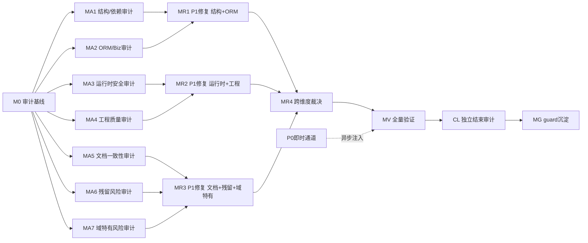

# 审计-修复路线图：nop-metadata 全模块组

> 最后更新：2026-08-05（v12 — MR3 R3.0 展开 + R3.1-R3.20 修复收口（plan-2026-08-05-0746-2）：R3.0 done + 19 项修复 done（P0-MA7.1-01 注入 / P1-MA7.2-01/MA7.5-01/MA7.6-01/MA7.6-02 / P2 家族 13 项 in-scope / 文档批量 / 命名 / helper 收敛 / 版权头 / AutoTest 增量 / UK constraint 36 个 model-first）+ 5 项 P2 裁决 deferred（R3.20，Successor 显式）；v11 的 MA7 审计收口记录保持不变
> 来源：`ai-dev/skills/audit-remediation-roadmap-authoring-prompt.md`
> 目标模块组：nop-metadata（8 子模块，~283 main Java / ~97 test Java）
> 模块组成：`nop-metadata-api`（32 main）、`nop-metadata-core`（2）、`nop-metadata-codegen`（0）、`nop-metadata-dao`（120）、`nop-metadata-meta`（0）、`nop-metadata-service`（128 main + 94 test）、`nop-metadata-web`（0）、`nop-metadata-app`（1）
> 复杂度评分：**S 级**（子模块 8 ≥ 5、main Java 283 ≥ 200、实体 39 ≥ 15 — 三项均超 S 阈值）

## 目的

对 nop-metadata 模块组实施全面审计-修复闭环：

1. 覆盖最近一轮审计（2026-07-23）的盲区：14 个未审计维度、xbiz 文件、web 模块、deploy/app 模块、绿色基线未验证
2. 覆盖 2026-07-19~07-23 四轮审计中**从未独立复核**的 finding（07-23 全部 36 项处于"待复核"状态）
3. 验证 07-19~07-23 期间已修复项的**修复到位性**（含 dao→core 依赖、I*Biz 接口、错误码迁移、DTO 迁移 blocked 项）
4. 覆盖元数据/联邦查询域特有风险维度（SQL/表达式注入、凭据管理、withConnection 数据权限绕过、血缘大图性能、导入引擎安全、调度可靠性、工作流集成）
5. P0 即时通道 + P1 批量修复；每个工作项产出后经独立 closure audit 验证

本路线图只处理 P0 和 P1。P2/P3 记录为 deferred successor。不包含实现细节；每个 `todo` 工作项由独立 execution plan 承载。

## Work Item Status

### M0 — 审计编排基线

| # | Work Item | Status | Owner Doc | Deps | Skill |
|---|-----------|--------|-----------|------|-------|
| 0.1 | 生成审计维度矩阵 | done | `ai-dev/audits/arm-audit-dimension-matrix-nop-metadata.md` | — | `audit-remediation-roadmap-authoring-prompt.md`（步骤 1） |
| 0.2 | 初始化 arm-index（nop-metadata） | done | `ai-dev/audits/arm-index-nop-metadata.md` | 0.1 | `audit-remediation-roadmap-authoring-prompt.md`（§6.1） |
| 0.3 | 汇聚未闭包发现清单 | done | `ai-dev/audits/arm-unclosed-findings-nop-metadata.md` | 0.2 | `audit-remediation-roadmap-authoring-prompt.md`（步骤 2） |
| 0.4 | 运行绿色基线验证 | done | — | 0.3 | none（手动命令） |

### MA1 — 结构与依赖审计（api + core + codegen）

| # | Work Item | Status | Owner Doc | Deps | Skill |
|---|-----------|--------|-----------|------|-------|
| 1.1 | api/core 依赖图与模块边界 | done | `ai-dev/design/nop-metadata/01-architecture-baseline.md`（报告：`ai-dev/audits/2026-08-04-0900-arm-MA1.1-nop-metadata-dependency-graph.md`） | 0.4 | `deep-audit-prompts.md`（维度 01） |
| 1.2 | 模块职责与文件边界（8 子模块） | done | —（报告：`ai-dev/audits/2026-08-04-0900-arm-MA1.2-nop-metadata-module-boundary.md`） | 0.4 | `deep-audit-prompts.md`（维度 02） |
| 1.3 | API 表面积与契约一致性 | done | `nop-metadata/nop-metadata-api/` + `nop-metadata/nop-metadata-dao/src/main/java/io/nop/metadata/biz/`（报告：`ai-dev/audits/2026-08-04-0900-arm-MA1.3-nop-metadata-api-contract.md`） | 0.4 | `deep-audit-prompts.md`（维度 03） |
| 1.4 | Delta 定制合规性 | done | `nop-metadata/*/src/main/resources/_vfs/`（报告：`ai-dev/audits/2026-08-04-0900-arm-MA1.4-nop-metadata-delta.md`） | 0.4 | `deep-audit-prompts.md`（维度 06） |

### MA2 — ORM/BizModel/服务层审计（dao + meta + service）

| # | Work Item | Status | Owner Doc | Deps | Skill |
|---|-----------|--------|-----------|------|-------|
| 2.1 | ORM 模型与实体设计审计（39 实体） | done | `nop-metadata/model/nop-metadata.orm.xml`（报告：`ai-dev/audits/2026-08-04-0935-arm-MA2.1-nop-metadata-orm-model.md`） | 0.4 | `orm-model-audit-prompt.md` |
| 2.2 | 生成管线完整性审计 | done | `nop-metadata/model/`（报告：`ai-dev/audits/2026-08-04-0935-arm-MA2.2-nop-metadata-pipeline.md`） | 0.4 | `deep-audit-prompts.md`（维度 05） |
| 2.3 | BizModel 规范遵循审计（42 个） | done | `nop-metadata/nop-metadata-service/src/main/java/io/nop/metadata/service/entity/`（报告：`ai-dev/audits/2026-08-04-0935-arm-MA2.3-nop-metadata-bizmodel.md`） | 0.4 | `deep-audit-prompts.md`（维度 07） |
| 2.4 | IoC 与 Bean 配置审计 | done | `nop-metadata/*/src/main/resources/_vfs/**/*.beans.xml`（报告：`ai-dev/audits/2026-08-04-0935-arm-MA2.4-nop-metadata-ioc.md`） | 0.4 | `deep-audit-prompts.md`（维度 08） |

### MA3 — 运行时与安全审计（service + web）

| # | Work Item | Status | Owner Doc | Deps | Skill |
|---|-----------|--------|-----------|------|-------|
| 3.1 | XDSL 与 XLang 正确性（含 xbiz/xwf） | done | `nop-metadata/nop-metadata-service/src/main/resources/_vfs/`（报告：`ai-dev/audits/2026-08-04-1136-arm-MA3.1-nop-metadata-xdsl.md`） | 0.4 | `deep-audit-prompts.md`（维度 10） |
| 3.2 | GraphQL 与 API 层审计 | done | `nop-metadata/nop-metadata-service/` + `nop-metadata/nop-metadata-api/`（报告：`ai-dev/audits/2026-08-04-1156-arm-MA3.2-nop-metadata-graphql.md`） | 0.4 | `deep-audit-prompts.md`（维度 12） |
| 3.3 | 安全与权限模型审计（@Auth/数据鉴权/withConnection 旁路面） | done | `nop-metadata/nop-metadata-service/src/main/java/io/nop/metadata/service/`（报告：`ai-dev/audits/2026-08-04-1204-arm-MA3.3-nop-metadata-security.md`） | 0.4 | `deep-audit-prompts.md`（维度 13） |
| 3.4 | 异步与事务模式审计（质量检查点 cron、事件 dispatch） | done | —（报告：`ai-dev/audits/2026-08-04-1212-arm-MA3.4-nop-metadata-async-txn.md`） | 0.4 | `deep-audit-prompts.md`（维度 14） |

### MA4 — 工程质量审计（全模块）

| # | Work Item | Status | Owner Doc | Deps | Skill |
|---|-----------|--------|-----------|------|-------|
| 4.1 | 错误处理与错误码审计（前缀迁移残余） | done | `nop-metadata/*/src/main/java/**/*Errors.java` | 0.4 | `deep-audit-prompts.md`（维度 09） |
| 4.2 | 类型安全与泛型使用（机械维度，整域） | done | — | 0.4 | `deep-audit-prompts.md`（维度 15） |
| 4.3 | 测试覆盖与质量 — 核心执行域（query/aggregation/lineage/sqlview） | done | `nop-metadata/nop-metadata-service/src/test/` | 0.4 | `deep-audit-prompts.md`（维度 16） |
| 4.4 | 测试覆盖与质量 — 其余域（import/datasource/quality/reconciliation/semantic/search/contract/event） | done | `nop-metadata/nop-metadata-service/src/test/` | 0.4 | `deep-audit-prompts.md`（维度 16） |
| 4.5 | 代码风格与规范（机械维度，整域） | done | — | 0.4 | `deep-audit-prompts.md`（维度 17） |
| 4.6 | 单元测试有效性 — 核心执行域 | done | `nop-metadata/nop-metadata-service/src/test/` | 0.4 | `deep-audit-prompts.md`（维度 21）+ `unit-test-antipatterns.md` |
| 4.7 | 单元测试有效性 — 其余域 | done | `nop-metadata/nop-metadata-service/src/test/` | 0.4 | `deep-audit-prompts.md`（维度 21）+ `unit-test-antipatterns.md` |

### MA5 — 文档与一致性审计（全模块）

| # | Work Item | Status | Owner Doc | Deps | Skill |
|---|-----------|--------|-----------|------|-------|
| 5.1 | 设计文档-代码 drift（ai-dev/design/nop-metadata/ 17 篇） | done | `ai-dev/design/nop-metadata/` | 0.4 | `design-doc-audit-prompt.md` |
| 5.2 | docs-for-ai 文档-代码一致性 | done | `docs-for-ai/03-modules/nop-metadata.md` + `docs-for-ai/01-repo-map/module-groups.md` | 0.4 | `deep-audit-prompts.md`（维度 18） |
| 5.3 | 命名与术语一致性 | done | — | 0.4 | `deep-audit-prompts.md`（维度 19） |
| 5.4 | 跨模块契约一致性（nop-sys/nop-auth/nop-wf/nop-code 依赖面） | done | `docs-for-ai/01-repo-map/module-groups.md` | 0.4 | `cross-module-dependency-audit-prompt.md` |

### MA6 — 残留风险审计专项（全模块）

| # | Work Item | Status | Owner Doc | Deps | Skill |
|---|-----------|--------|-----------|------|-------|
| 6.1 | 空壳实现扫描（H01） | done | —（报告：`ai-dev/audits/2026-08-04-1748-arm-MA6.1-nop-metadata-hollow-scan.md`） | 0.4 | `open-ended-adversarial-review-prompt.md` |
| 6.2 | 静默跳过检测（H02） | done | —（报告：`ai-dev/audits/2026-08-04-1748-arm-MA6.2-nop-metadata-silent-noop.md`） | 0.4 | `open-ended-adversarial-review-prompt.md` |
| 6.3 | 接线完整性验证（H03） | done | —（报告：`ai-dev/audits/2026-08-04-1530-arm-MA6.3-nop-metadata-wiring.md`） | 0.4 | `open-ended-adversarial-review-prompt.md` |
| 6.4 | 敏感信息泄露扫描（H05，含 JDBC 凭据/连接串） | done | —（报告：`ai-dev/audits/2026-08-04-1748-arm-MA6.4-nop-metadata-sensitive-leak.md`） | 0.4 | `open-ended-adversarial-review-prompt.md` |
| 6.5 | 测试隔离性审查（H06） | done | —（报告：`ai-dev/audits/2026-08-04-1748-arm-MA6.5-nop-metadata-test-isolation.md`） | 0.4 | `open-ended-adversarial-review-prompt.md` |
| 6.6 | 既有修复验证（H07，07-19~07-23 已修复项） | done | `ai-dev/audits/arm-unclosed-findings-nop-metadata.md`（报告：`ai-dev/audits/2026-08-04-1748-arm-MA6.6-nop-metadata-fix-verification.md`） | 0.3 | `closure-audit-prompt.md` |

### MA7 — 元数据域特有风险审计（全模块）

| # | Work Item | Status | Owner Doc | Deps | Skill |
|---|-----------|--------|-----------|------|-------|
| 7.1 | SQL/表达式注入面（custom_sql、expression measure、join 注入点、分词黑名单绕过） | done | `nop-metadata/nop-metadata-service/src/main/java/io/nop/metadata/service/` | 0.4 | `open-ended-adversarial-review-prompt.md` |
| 7.2 | 凭据管理与联邦查询数据权限（connectionConfig 凭据、withConnection 直查旁路） | done | `nop-metadata/nop-metadata-service/src/main/java/io/nop/metadata/service/connection/` | 0.4 | `open-ended-adversarial-review-prompt.md` |
| 7.3 | 导入引擎与元数据同步安全（ORM XML 解析、外部表同步、多 schema） | done | `nop-metadata/nop-metadata-service/src/main/java/io/nop/metadata/service/` | 0.4 | `open-ended-adversarial-review-prompt.md` |
| 7.4 | 血缘大图与查询性能（BFS 遍历、N+1、聚合内存上限） | done | `nop-metadata/nop-metadata-service/src/main/java/io/nop/metadata/service/lineage/` + `query/` | 0.4 | `open-ended-adversarial-review-prompt.md` |
| 7.5 | 调度与事件可靠性（质量检查点 cron、事件脱敏、幂等） | done | `nop-metadata/nop-metadata-service/src/main/java/io/nop/metadata/service/quality/` + `event/` | 0.4 | `open-ended-adversarial-review-prompt.md` |
| 7.6 | 工作流与审批集成（nop-wf 集成、webhook SSRF allowlist、失败路径） | done | `nop-metadata/nop-metadata-service/src/main/resources/_vfs/`（.xwf）+ `nop-metadata/nop-metadata-service/src/main/java/io/nop/metadata/service/contract/` | 0.4 | `open-ended-adversarial-review-prompt.md` |

### MR1 — P1 批量修复（第一批：结构 + ORM/Biz）

| # | Work Item | Status | Owner Doc | Deps | Skill |
|---|-----------|--------|-----------|------|-------|
| R1.0 | MA1+MA2 P1 发现汇总、排序并展开为具体修复工作项行 | done | `ai-dev/audits/arm-index-nop-metadata.md` §P1 | MA1+MA2 done | none（展开器） |
| R1.1 | P1-MA1-001 修复：NopMetaSearch.xmeta schema type `io.nop.metadata.core.dto.SearchHitDTO`→`io.nop.metadata.api.dto.SearchHitDTO` + GraphQL 字段选择回归测试（schema 类型解析 + e2e 查询） | done | `nop-metadata/nop-metadata-service/src/main/resources/_vfs/nop/metadata/model/NopMetaSearch/NopMetaSearch.xmeta`（R2.10 已移至 model/ 可达路径） | P1-MA1-001 | 本 plan（2026-08-04-1004-3） |
| R1.2 | P2-MA2-01/02 修复（**MA2.1 裁决例外**：MA2.1 报告显式开辟裁决通道；防后续 MR 把"修 P2"当默认先例）：显式 `tagLabels`（NopMetaTag/NopMetaGlossaryTerm）/`dataProducts`（NopMetaBusinessDomain）to-many 声明（cascadeDelete + displayName 双语 + tagSet="pub,ref-pub" + joinRightDisplayProp） | done | `nop-metadata/model/nop-metadata.orm.xml` | P2-MA2-01, P2-MA2-02 | 本 plan（2026-08-04-1004-3） |
| R1.3 | P2-MA2-03 修复（**MA2.1 裁决例外**）：SQL 保留字列 code 改名（NopMetaEntityField.primaryField `PRIMARY`→`IS_PRIMARY` / NopMetaEntityUniqueKey.constraintName `CONSTRAINT`→`CONSTRAINT_NAME`；裁决依据 Oracle DDL 未引号事实） | done | `nop-metadata/model/nop-metadata.orm.xml` + `nop-metadata/deploy/sql/**` | P2-MA2-03 | 本 plan（2026-08-04-1004-3） |

### MR2 — P1 批量修复（第二批：运行时 + 工程）

| # | Work Item | Status | Owner Doc | Deps | Skill |
|---|-----------|--------|-----------|------|-------|
| R2.0 | MA3+MA4 P1 发现汇总、排序并展开 | done | `ai-dev/audits/arm-index-nop-metadata.md` §P1 | MA3+MA4 done | none（展开器） |
| R2.1 | P1-MA3-001 修复：3 个 xwf（metaDataContractApproval/qualityBreachApproval/tagLabelConfirmApproval）迁移至 `/nop/wf/` 解析器可达路径 + listener 重写为 c:script（无 xlib import 依赖，MA7.6-06 修正原「x:config import wf-approval.xlib」描述）+ 删除 appState 非法属性；随修 MA3.1-04（start 悬空）/05（`${wfRt.status}`→`${wfRt.wf.status}`）/06（c:script 4 个不存在 API 重写 + eventPattern 修正）；xwf 模型加载 + 启动/审批流转 e2e 测试（容器内 wf engine bean 可用性验证，不可用按降级链并记录理由） | done | `nop-metadata/nop-metadata-service/src/main/resources/_vfs/nop/wf/`（迁移后）+ `_vfs/nop/metadata/wf/`（迁移前） | P1-MA3-001, MA3.1-04, MA3.1-05, MA3.1-06 | 本 plan（2026-08-04-1543-3） |
| R2.2 | P1-MA3-002 修复：approve/reject 单一事实源裁定 = **XPL（workflow 路径）**——保留层 `NopMetaDataContract.xbiz` 增加 approve/reject XPL override（含 DRAFT→ACTIVE→DEPRECATED→RETIRED 状态生命周期 + remark 前缀 + updateEntity，参照 NopMetaTagLabel.xbiz 做法），删除 Java approve/reject + `INopMetaDataContractBiz` 接口方法（Protected Area plan-first 声明，本 plan 即裁决载体），契约测试 `TestNopMetaBizInterfaceCompleteness:85-86` 更新 + 补 XPL 正路径语义断言；随修 MA3.1-08（**重新裁定：`_` 生成 xbiz 的 approval-support extends 为 codegen 模板对 use-approval 实体的标准产出（`_{entityModel.shortName}.xbiz.xgen`，commit 270b2b536），ORM tagSet="use-approval" 为事实源，非手改违规——维持生成产物原状，保留层 multi-extends 保持 保留层>生成层>approval-support 优先级链**）；GraphQL 正路径测试（DRAFT→ACTIVE 经 approve 可达） | done | `nop-metadata/nop-metadata-service/src/main/resources/_vfs/nop/metadata/model/NopMetaDataContract/` + `NopMetaTagLabel/` + `NopMetaDataContractBizModel.java` + `INopMetaDataContractBiz.java` + 测试 | P1-MA3-002, MA3.1-08 | 本 plan（2026-08-04-1543-3） |
| R2.3 | P1-MA4-401/701 修复：judgeByRuleId 空洞测试重写为行为断言（真实 ruleId → status 语义 + 非存在 ruleId → 错误码），证明核心逻辑改动会被捕获 | done | `nop-metadata/nop-metadata-service/src/test/java/io/nop/metadata/service/TestNopMetaQualityRuleBizModel.java` | P1-MA4-401 | 本 plan（2026-08-04-1543-3） |
| R2.4 | P1-MA4-601 修复：7 个 AggregationProcessor 测试类 21 个空壳测试（instanceof/canInstantiate/NPE-on-null）改造为最小行为测试（execute() 真实语义断言：unsupported-table-type/entity-not-registered/self-join 错误码等），同源 P2-MA4-301 一并 | done | `nop-metadata/nop-metadata-service/src/test/java/io/nop/metadata/service/query/Test*AggregationProcessor.java`（7 个） | P1-MA4-601, P2-MA4-301 | 本 plan（2026-08-04-1543-3） |
| R2.5 | 20-01 修复：`OrmModelImporter.java:58,68` `System.currentTimeMillis()` → `CoreMetrics.currentTimeMillis()`/`currentTimestamp()`（时钟锚点），扩展 `TestCoreMetricsUsage` 扫描范围至 `nop-metadata-dao/src/main`（回归保护） | done | `nop-metadata/nop-metadata-dao/src/main/java/io/nop/metadata/dao/model/OrmModelImporter.java` + `TestCoreMetricsUsage.java` | `2026-07-19-1118#维度20-01` | 本 plan（2026-08-04-1543-3） |
| R2.6 | 07-003 裁决（getEntityById 残余 16 处/11 文件）：A 类豁免 2 处不动（CREATE 快照，id!=null 守卫）；B 类 6 处 + C 类 10 处**登记豁免清单**（显式 null 检查 + 域特定 ErrorCode fail-fast 已等价 requireEntity 语义；requireEntityById 通用错误码反而劣化错误信息；被引用实体为元数据目录内部实体、主实体 requireEntity 已校验——数据鉴权语义保持）；豁免清单写入 arm-index + roadmap 本行 | done（裁决） | `ai-dev/audits/arm-index-nop-metadata.md` §P2 | `2026-07-23-0714#维度07-003` | 本 plan（2026-08-04-1543-3） |
| R2.7 | 07-004 裁决（DTO `List<Map<String,Object>>` 未类型化）：**deferred**——实际行结构为扁平 alias-key Map（measure/dimension 别名→值），`AggregationRowDTO` 嵌套 dimensions/measures 结构与执行器产出不匹配（MA4.2 复核，零引用）不可复用；强类型化需先定义行结构契约（改变 GraphQL items 输出形状=破坏性变更）；当前 0 消费方强转，风险低；Successor: MR4 跨维度裁决 | done（裁决） | `ai-dev/audits/arm-index-nop-metadata.md` §P2 | `2026-07-23-0714#维度07-004` | 本 plan（2026-08-04-1543-3） |
| R2.8 | 11-04 修复：`QualityResultWriter.append` 落盘前 status 字典（PASS/FAIL/ERROR/SKIP）/fail-fast 显式校验（参照 xmeta dict 语义，service 层显式字段校验），非法 status 抛 NopMetadataException + ErrorCode；带单元测试 | done | `nop-metadata/nop-metadata-service/src/main/java/io/nop/metadata/service/quality/QualityResultWriter.java` + 测试 | `2026-07-23-0714#维度11-04` | 本 plan（2026-08-04-1543-3） |
| R2.9 | 07-03 裁决（queryAggregation 11 参数未用 @RequestBean）：**deferred**——改造涉及三件套（`INopMetaTableBiz` 镜像签名 / `TestNopMetaBizInterfaceCompleteness:54` 契约测试 / GraphQL rpc 参数结构）同步，属破坏性公开契约变更；11 参签名功能完整、契约测试钉死为有意契约；无 live defect；Successor: MR4 跨维度裁决 | done（裁决） | `ai-dev/audits/arm-index-nop-metadata.md` §P2 | `2026-07-21-2039#维度07-03` | 本 plan（2026-08-04-1543-3） |
| R2.10 | P2-MA3-01 修复：`NopMetaSearch.xmeta` 移至 model/ 扫描根可达位置（`_vfs/nop/metadata/model/NopMetaSearch/`）+ `NopMetaSearchBizModel` 假 javadoc 修正 | done | `nop-metadata/nop-metadata-service/src/main/resources/_vfs/nop/metadata/model/NopMetaSearch/NopMetaSearch.xmeta`（已迁移）+ `NopMetaSearchBizModel.java` | P2-MA3-01 | 本 plan（2026-08-04-1543-3） |
| R2.11 | P2-MA4-001/002 修复：2 处静默吞异常补 LOG.warn（`NopMetaTagLabelBizModel.getWfNameFromMeta` catch、`SqlViewFieldTypeInferrer.safeProductName` catch） | done | `NopMetaTagLabelBizModel.java` + `SqlViewFieldTypeInferrer.java` | P2-MA4-001, P2-MA4-002 | 本 plan（2026-08-04-1543-3） |
| R2.12 | P2-MA4-101 修复：`CheckpointExtConfig` 强类型 DTO 死代码处置——`MetaQualityCheckpointScheduler.readScheduleCron` + `NopMetaQualityCheckpointBizModel.readAutoScoreConfig` 改用 `JsonTool.parseBeanFromText(json, CheckpointExtConfig.class)`（DTO 字段 schedule/autoScore 与消费键一致） | done | `MetaQualityCheckpointScheduler.java` + `NopMetaQualityCheckpointBizModel.java` | P2-MA4-101 | 本 plan（2026-08-04-1543-3） |
| R2.13 | P2-MA4-303 修复：分页测试补首行内容断言（offset 生效验证，防 AR-04 类 bug 复发） | done | `TestNopMetaTableQueryBizModel.java` 等 | P2-MA4-303 | 本 plan（2026-08-04-1543-3） |
| R2.14 | P2-MA3-02 裁决（entity 路径数据查询绕过 data-auth 过滤合并）：**deferred**——裸 DAO/EQL 路径合并 `AuthHelper.appendFilter` 需跨 3 个 executor 查询管线设计（CrudBizModel:381 合并点不适用于裸 SQL/JDBC 路径）；当前 `enable-data-auth` 双开关默认 false 且 app 未配置（MA3.3 复核实证），无实际暴露；Successor: MR4 或专门 data-auth plan | done（裁决） | `ai-dev/audits/arm-index-nop-metadata.md` §P2 | P2-MA3-02 | 本 plan（2026-08-04-1543-3） |
| R2.15 | P2-MA3-03 裁决（upsertExternalTable schema 维度未进 DB UK）：**deferred**——需 ORM 模型变更（Protected Area, plan-first）+ UK 语义/null 处理/DDL 迁移 + deploy/sql 再生成；当前单 schema 部署无影响；Successor: MR3/DDL 管线（与 P2-MA6.6-001 DDL 零 UK 发射同族） | done（裁决） | `ai-dev/audits/arm-index-nop-metadata.md` §P2 | P2-MA3-03 | 本 plan（2026-08-04-1543-3） |
| R2.16 | P2-MA4-501 裁决（`*Service` 命名违规 2 处：NopMetaSearchService/QualityAlertWorkflowService）：**deferred**——改名涉及 beans.xml bean id + 19 文件引用 + xwf c:script import 全量同步，纯命名规范项无功能影响；Successor: MR3 命名治理批次（与 02-01 家族合并） | done（裁决） | `ai-dev/audits/arm-index-nop-metadata.md` §P2 | P2-MA4-501 | 本 plan（2026-08-04-1543-3） |
| R2.17 | P2-MA4-602 裁决（helper 镜像测试 30+ 方法跨 4 文件重复）：**deferred**——safeAlias/aggSqlOf 镜像收敛为单一 helper 测试文件属纯测试重组（P1-MA4-601 修复后文件主体已改造成行为测试，残余镜像无功能风险）；Successor: MR3 测试治理批次 | done（裁决） | `ai-dev/audits/arm-index-nop-metadata.md` §P2 | P2-MA4-602 | 本 plan（2026-08-04-1543-3） |
| R2.18 | MA4.5 版权头剥离（154 文件）裁决：**deferred**——纯机械风格项，154 文件批量剥离独立批次；MA4.5 报告自身裁定"最终裁定归 roadmap/MR2 决策层"，本 plan 裁决 deferred 并记录；Successor: MR3 风格治理批次 | done（裁决） | `ai-dev/audits/arm-index-nop-metadata.md` §P2 | MA4.5 | 本 plan（2026-08-04-1543-3） |
| R2.19 | AutoTest 增量（16-01）裁决：**deferred**——快照录制依赖专门录制会话工具链，本 plan 以行为断言测试覆盖关键流（更严格）；Successor: MR3 测试工程批次 | done（裁决） | `ai-dev/audits/arm-index-nop-metadata.md` §P2 | `2026-07-23-0714#维度16-01` | 本 plan（2026-08-04-1543-3） |

### MR3 — P1 批量修复（第三批：文档 + 残留风险 + 域特有）

| # | Work Item | Status | Owner Doc | Deps | Skill |
|---|-----------|--------|-----------|------|-------|
| R3.0 | MA5+MA6+MA7 P1 发现汇总、排序并展开 | done（plan-2026-08-05-0746-2 Phase 1） | `ai-dev/audits/arm-index-nop-metadata.md` §P1 | MA5+MA6+MA7 done | none（展开器） |
| R3.1 | **P0-MA7.1-01 修复**：queryAggregation HAVING 注入（AggregationHelper.nameResolverFor 移除非标识符原样透传 → 未命中 nameToExpr 即抛 `ERR_AGGR_HAVING_UNKNOWN_NAME`；expr 产物显式标记与原始用户 name 区分）——query 级只读权限可利用的 SQL 注入，P0 即时通道 | done（plan-2026-08-05-0746-2 Phase 3） | `nop-metadata/nop-metadata-service/src/main/java/io/nop/metadata/service/query/AggregationHelper.java` + `FilterToSqlTranslator.java` | P0-MA7.1-01 | 本 plan（2026-08-05-0746-2） |
| R3.2 | **P1-MA7.2-01 修复**：AR-02 主机白名单 userinfo/IPv6 旁路（`extractHost` 剥离 `...@` + 处理 `[::1]`/IPv4-mapped；与 webhook extractWebhookHost 对齐）——SSRF 回归缺口 | done（plan-2026-08-05-0746-2 Phase 3） | `nop-metadata/nop-metadata-service/src/main/java/io/nop/metadata/service/connection/MetaDataSourceConnectionProcessor.java` + `TestMetaDataSourceConnectionSecurity` | P1-MA7.2-01 | 本 plan（2026-08-05-0746-2） |
| R3.3 | **P1-MA7.5-01 修复**：cron job 首次 checkpoint 级错误后永久死亡（executeScheduledCheckpoint 业务错误转 LOG.error + 存活返回，修复配置可复活） | done（plan-2026-08-05-0746-2 Phase 3） | `nop-metadata/nop-metadata-service/src/main/java/io/nop/metadata/service/quality/MetaQualityCheckpointScheduler.java` | P1-MA7.5-01 | 本 plan（2026-08-05-0746-2） |
| R3.4 | **P1-MA7.6-01 修复**：3 条流 *end listener 增加结束原因判定（`wfRt.wf.record.appState !== 'disagree'` 才 approve）——驳回即通过/发起人自批回归（R2.1 引入） | done（plan-2026-08-05-0746-2 Phase 3） | `_vfs/nop/wf/metaDataContractApproval/v1.xwf` + `tagLabelConfirmApproval/v1.xwf` | P1-MA7.6-01 | 本 plan（2026-08-05-0746-2） |
| R3.5 | **P1-MA7.6-02 修复**：QualityAlertWorkflowService.createAlertWorkflow 增加 IServiceContext 参数 + ContextProvider 兜底（null ctx → WfRuntime NPE → 告警流静默不创建）；补容器内启动测试（R3.15 改名后为 QualityAlertWorkflowProcessor） | done（plan-2026-08-05-0746-2 Phase 3） | `nop-metadata/nop-metadata-service/src/main/java/io/nop/metadata/service/quality/QualityAlertWorkflowProcessor.java` + 测试 | P1-MA7.6-02 | 本 plan（2026-08-05-0746-2） |
| R3.6 | **P2-MA5-401 修复（must-fix，不可降级 deferred）**：`NopMetaTagLabelBizModel.getWfNameFromMeta` getProp 恒 null → 根属性访问（对照 approval-support.xbiz:30）；自动提审正路径测试 | done（plan-2026-08-05-0746-2 Phase 3） | `nop-metadata/nop-metadata-service/src/main/java/io/nop/metadata/service/entity/NopMetaTagLabelBizModel.java` + 测试 | P2-MA5-401（归属更正：MR2 未裁决 → MR3 承接） | 本 plan（2026-08-05-0746-2） |
| R3.7 | **文档 drift 批量修复**：P2-MA5-101..184（25 项 design 文档，按 MA5.1 报告 P2 表逐项）+ P2-MA5-201..205（5 项 docs-for-ai）+ MA7.6-06（R2.1 "x:config import" 描述漂移 3 处文本）+ MA7.6-07（TestNopMetadataWorkflowModels javadoc） | done（plan-2026-08-05-0746-2 Phase 2） | `ai-dev/design/nop-metadata/`（17 篇）+ `docs-for-ai/03-modules/nop-metadata.md` + `docs-for-ai/01-repo-map/module-groups.md` + `docs-for-ai/04-reference/source-anchors.md` | P2-MA5-101..184, P2-MA5-201..205, MA7.6-06, MA7.6-07 | 本 plan（2026-08-05-0746-2） |
| R3.8 | **P2-MA6.1-001 修复**：AggregationRowDTO 死 DTO 移除（api 模块公共面变更 plan-first 声明——零引用零消费者，迁移影响 = none；api-dto-spec.md P3-MA5-185 同步） | done（plan-2026-08-05-0746-2 Phase 3） | `nop-metadata/nop-metadata-api/.../dto/AggregationRowDTO.java` | P2-MA6.1-001 | 本 plan（2026-08-05-0746-2） |
| R3.9 | **P2-MA6.2-002 修复**：MetaTableProfiler 空串统计失真（真实 SQLException 记 0 + LOG.warn，仅类型不支持静默） | done（plan-2026-08-05-0746-2 Phase 3） | `nop-metadata/nop-metadata-service/src/main/java/io/nop/metadata/service/profiling/MetaTableProfiler.java` | P2-MA6.2-002 | 本 plan（2026-08-05-0746-2） |
| R3.10 | **P2-MA6.5-001/004 修复**：测试隔离——meta_q_sql 外置 H2 库拆分独立库名 + 假时钟 try/finally 恢复 | done（plan-2026-08-05-0746-2 Phase 3） | `TestNopMetaQualityRuleBizModel.java` + `TestNopMetaTableQueryBizModel.java` | P2-MA6.5-001, P2-MA6.5-004 | 本 plan（2026-08-05-0746-2） |
| R3.11 | **P2-MA7.1-02 修复**：custom_sql 关键字黑名单 token 级校验（空白/注释/反引号变体 + 缺项 COPY/PG_READ_FILE 等） | done（plan-2026-08-05-0746-2 Phase 3） | `nop-metadata/nop-metadata-service/src/main/java/io/nop/metadata/service/quality/MetaQualityRuleExecutor.java` + 测试 | P2-MA7.1-02 | 本 plan（2026-08-05-0746-2） |
| R3.12 | **P2-MA7.4-02/03/04 修复**：列血缘同批重复键去重 + queryTableData 缺省 limit/上限 + 跨库合并产物上限 | done（plan-2026-08-05-0746-2 Phase 3） | `NopMetaLineageEdgeQueryAction.java` + `NopMetaTableBizModel.java`/`NopMetaTableQueryAction.java` + `MetaJoinExecutor.java`/`CrossDbJoinMerger.java` | P2-MA7.4-02, P2-MA7.4-03, P2-MA7.4-04 | 本 plan（2026-08-05-0746-2） |
| R3.13 | **P2-MA7.5-02/03 修复**：检查点摘要 errorCount 补计异常规则 + cron 非法值残留旧 job 清理（addJob 失败先 removeJob） | done（plan-2026-08-05-0746-2 Phase 3） | `MetaQualityCheckpointExecutor.java` + `MetaQualityCheckpointScheduler.java` | P2-MA7.5-02, P2-MA7.5-03 | 本 plan（2026-08-05-0746-2） |
| R3.14 | **P2-MA7.6-03/04/05 修复**：qualityBreachApproval verify 失败路径（reJudge try/catch → reject + ruleId 缺失 → reject）+ SSRF isInternalHost IP 记法变体（0.0.0.0/十进制/八进制/IPv4-mapped 解析校验）+ MetaContractChecker 无 Catalog + SLA 配置 → slaFresh=false | done（plan-2026-08-05-0746-2 Phase 3） | `qualityBreachApproval/v1.xwf` + `CheckpointActionDispatcher.java` + `nop-metadata/nop-metadata-service/src/main/java/io/nop/metadata/service/contract/MetaContractChecker.java` | P2-MA7.6-03, P2-MA7.6-04, P2-MA7.6-05 | 本 plan（2026-08-05-0746-2） |
| R3.15 | **P2-MA4-501 修复**：`*Service` 命名改名（NopMetaSearchService → NopMetaSearchProcessor / QualityAlertWorkflowService → QualityAlertWorkflowProcessor；beans.xml bean id + 19 文件引用 + xwf c:script 全量同步 + 接线验证） | done（plan-2026-08-05-0746-2 Phase 3） | `nop-metadata/nop-metadata-service/src/main/java/io/nop/metadata/service/search/` + `nop-metadata/nop-metadata-service/src/main/java/io/nop/metadata/service/quality/` + `app-service.beans.xml` + 全部引用文件 | P2-MA4-501 | 本 plan（2026-08-05-0746-2） |
| R3.16 | **P2-MA4-602 修复**：helper 镜像测试收敛（safeAlias/aggSqlOf 跨 4 文件逐字复制 → 单一 helper 测试文件） | done（plan-2026-08-05-0746-2 Phase 3） | `nop-metadata/nop-metadata-service/src/test/java/io/nop/metadata/service/query/Test*AggregationProcessor.java`（4 个） | P2-MA4-602 | 本 plan（2026-08-05-0746-2） |
| R3.17 | **MA4.5 版权头剥离**：154 文件批量剥离（机械操作，逐文件核对无内容误伤） | done（plan-2026-08-05-0746-2 Phase 3） | `nop-metadata/*/src/main/java/**` + `src/test/java/**`（154 文件） | MA4.5 | 本 plan（2026-08-05-0746-2） |
| R3.18 | **AutoTest 16-01 增量**：按 `docs-for-ai/02-core-guides/testing.md` §快照录制（JunitAutoTestCase + RECORDING/CHECKING 模式）新增核心流快照测试 | done（plan-2026-08-05-0746-2 Phase 3） | `nop-metadata/nop-metadata-service/src/test/`（新增 AutoTest 类） | `2026-07-23-0714#维度16-01` | 本 plan（2026-08-05-0746-2） |
| R3.19 | **P2-MA6.6-001 + MA7.3-01 修复（model-first，Protected Area plan-first——本 plan 即裁决载体）**：36 个 unique-key 补 `constraint` 属性（计数勘误：MA7.3 报告 69 为含 `<unique-keys>` 容器标签的 grep 口径，实为 36 个 UK 元素）；**双重存储相容性裁决**——UK_NOP_META_ORM_MODEL_MODULE_NAME 补 isDelta 列维度（列已存在）、UK_NOP_META_TABLE_MODULE_NAME 补 isDelta 列维度（NopMetaTable 需新增 isDelta 列，镜像兄弟实体）+ persistModelGraph/upsertExternalTable 同步 isDelta；deploy/sql 三方言 DDL 再生成 + DdlSqlCreator 断言测试 | done（plan-2026-08-05-0746-2 Phase 4） | `nop-metadata/model/nop-metadata.orm.xml` + `deploy/sql/**` + `OrmModelImporter.java` | P2-MA6.6-001, MA7.3-01, P2-MA7.4-01 | 本 plan（2026-08-05-0746-2） |
| R3.20 | **P2 裁决 deferred 批次（终态登记，Successor 显式）**：P2-MA5-301（dataSource 双拼写，GraphQL 破坏性契约变更，Successor: MR4 跨维度裁决，沿 07-003/R2.9 先例）、P2-MA3-03（metaSchema 进 UK，null 语义需列契约变更+迁移，Successor: MR4 多 schema 裁决）、P2-MA7.2-02（entity 自定义查询 data-auth，条件激活双开关默认 false，Successor: MR4/专门 data-auth plan，沿 R2.14 先例）、P2-MA7.5-04（调度器事务回滚副作用，MA7.5-01 修复后放大器消除，Successor: MR4/专门调度 plan）、P2-MA7.5-05（无幂等键，需 ORM 变更+分布式锁设计，Successor: MR4/专门调度 plan） | done（plan-2026-08-05-0746-2 Phase 1 裁决） | `ai-dev/audits/arm-index-nop-metadata.md` §P2 | P2-MA5-301, P2-MA3-03, P2-MA7.2-02, P2-MA7.5-04, P2-MA7.5-05 | 本 plan（2026-08-05-0746-2） |
| R3.x | MR3 P1 修复执行（R3.1-R3.20 具体行，见上） | done（plan-2026-08-05-0746-2） | — | R3.0 | 按具体修复工作项确定 |

**R3.0 展开器裁决记录（plan-2026-08-05-0746-2 Phase 1）**：
- 归属更正 6 项（报告归属标 MR2、MR2 未裁决、MR3 承接）：P2-MA5-301、P2-MA5-401（MA7.6-08 已先更正）、P2-MA6.1-001、P2-MA6.2-002、P2-MA6.5-001、P2-MA6.5-004 —— 均登记 arm-index 更正记录；P2-MA6.6-001 归属本即 MR3 不属此类
- P2 候选裁决：in-scope 修复 13 项（R3.1-R3.19 中 P2 部分：401/MA6.1-001/MA6.2-002/MA6.5-001/004/MA7.1-02/MA7.4-02/03/04/MA7.5-02/03/MA7.6-03/04/05 + 501/602/MA4.5/16-01/MA6.6-001）；deferred 5 项（R3.20，每项带 Why Not Blocking Closure + Successor，见 arm-index §P2）；**P1 项与已确认 live defect（P2-MA5-401）无 deferred 选项**
- 双拼写裁决：P2-MA5-301 维持 deferred（统一拼写 = GraphQL 公开字段名破坏性变更 + 契约测试 + 消费方同步；命名不一致非 live defect；沿 07-003/R2.9 破坏性契约变更先例；Successor: MR4）
- MA7.3-01 计数勘误：`rg -c '<unique-key'` 的 69 含 33 个 `<unique-keys>` 容器标签；实际 UK 元素 36 个（`grep -o '<unique-key name='` 去重 36），与计划 "36 个 UK" 口径一致，roadmap 以 36 为准
- MA7.2-02 裁决依据：与 R2.14（P2-MA3-02）同族——entity 路径合并 appendFilter 需跨 3 executor 查询管线设计；enable-data-auth 双开关默认 false + app 未配置（MA3.3 复核实证）无实际暴露；Successor: MR4 或专门 data-auth plan

### MR4 — 跨维度裁决

| # | Work Item | Status | Owner Doc | Deps | Skill |
|---|-----------|--------|-----------|------|-------|
| R4.1 | 跨维度 P1 裁决与冲突修复 | done（plan-2026-08-05-1408-1：MR4 跨维度裁决完成——8 项 Successor: MR4 项终局裁决（全部终局 deferred，0 提升）+ 跨维度 P1 无冲突核对） | `ai-dev/audits/arm-index-nop-metadata.md` | MR1+MR2+MR3 done | `closure-audit-prompt.md` |
| R4.2 | 多 schema 支持专项（P2-MA3-03 终局 successor：metaSchema null 语义裁定 → UK 列维度扩展或 schema 维度列契约变更 + 存量迁移，model-first，plan-first 声明） | todo | `nop-metadata/model/nop-metadata.orm.xml` | R4.1 done | `orm-model-audit-prompt.md` |
| R4.3 | 调度可靠性专项（P2-MA7.5-05 终局 successor：检查点执行幂等——runId/checkpointId 列 + 复合 UK（ORM 变更 Protected Area）+ 执行入口运行标记/分布式锁设计） | todo | `nop-metadata/model/nop-metadata.orm.xml` + `nop-metadata/nop-metadata-service/src/main/java/io/nop/metadata/service/quality/` | R4.1 done | `open-ended-adversarial-review-prompt.md` |

**R4.1 裁决记录（plan-2026-08-05-1408-1 Phase 1 骨架，Phase 2 终局填写）**：

- 裁决对象：8 项 Successor: MR4 deferred 项（R2.7〔07-004〕/R2.9〔07-03〕/R2.14〔P2-MA3-02〕/R2.15+R3.20〔P2-MA3-03，去重计 1〕/R3.20〔P2-MA5-301〕/R3.20〔P2-MA7.2-02〕/R3.20〔P2-MA7.5-04〕/R3.20〔P2-MA7.5-05〕），与 arm-index §P2/roadmap 各行 Successor 声明逐一核对无遗漏无重复
- 裁决时限：2026-08-05（MR4 执行批次）；每项经 live 复核后终局裁决（终局 deferred 三类归类 / 提升修复），跨维度 P1 冲突核对结论 + 逐项 Why Not Blocking Closure 见下方「MR4 终局裁决记录」

**MR4 终局裁决记录（2026-08-05 live 复核，8 项全部终局 deferred，0 提升）**：

| 项 | 终局归类 | Why Not Blocking Closure（live 复核依据） | Successor Required | 对应 arm-index 行 |
|----|---------|------------------------------------------|--------------------|-------------------|
| P2-MA3-02（R2.14，data-auth 族） | watch-only residual | 双开关全关：`nop.auth.use-data-auth-table` 默认 false（NopAuthConfigs.java:69-70）+ `nop.auth.enable-data-auth`（enableDataAuth）默认 false（biz-defaults.beans.xml:16）+ application.yaml:17 仅配 data-auth-config-path 未开开关；DefaultDataAuthChecker isUseTenant 判定链两路均 false；裸 DAO/EQL 路径实证（NopMetaTableBizModel.queryTableData:208/queryJoinData:234/queryAggregation:254 零 appendFilter，CrudBizModel:381 合并点对裸 JDBC 不适用）——激活条件未满足无实际暴露 | no | `P2-MA3-02` 行 |
| P2-MA7.2-02（R3.20，data-auth 族） | watch-only residual | 与 P2-MA3-02 同族同依据：entity 自定义查询走同一批裸 DAO/EQL 执行器；双开关仍全关（本次 live 复核：application.yaml 未开启 + CFG 默认 false + 判定链实证），沿 R2.14 先例 | no | `P2-MA7.2-02` 行 |
| P2-MA5-301（R3.20，双拼写） | out-of-scope improvement | orm.xml:383 dataSourceId / :392 datasourceType 仍在；统一拼写 = 实体 prop 改名 = GraphQL 公开字段破坏性变更 + Java getter 全模块同步 + 页面（_NopMetaDataSource.view.xml:34）同步；契约测试 TestNopMetaBizInterfaceCompleteness 无该字段断言，命名不一致非 live defect（沿 07-003/R2.9 先例） | no | `P2-MA5-301` 行 |
| P2-MA3-03（R2.15+R3.20，metaSchema ∉ UK） | out-of-scope improvement | orm.xml:1310 metaSchema 可空列；UK_NOP_META_TABLE_MODULE_NAME（:1316-1317，R3.19 补 constraint 后）= (metaModuleId, tableName, isDelta) 不含 metaSchema；全模型无 UK_NOP_META_EXTERNAL_TABLE_*；upsertExternalTable（NopMetaDataSourceBizModel:428）Java 层 schema 匹配，多 schema 同名表必然撞 UK；修复需先裁定 null 语义（可空列 unique 允许多 NULL）+ 列契约变更 + 存量迁移 + ORM Protected Area；当前单 schema 部署无影响 | yes → R4.2（多 schema 支持专项） | `P2-MA3-03` 行 |
| R2.7（07-004，未类型化 List\<Map\>） | watch-only residual | AggregationRowDTO 全仓 0 命中（R3.8 已移除）；AggregationResultDTO.getItems() 返回扁平 alias-key Map（api/dto/AggregationResultDTO.java:22）；全部消费方按 Map 迭代（TestNopMetaJoinBizModel:72 等），0 强转；web 页面无直接消费；强类型化 = items 输出形状破坏性变更，无新消费方出现 | no | `2026-07-23-0714#维度07-004` 行 |
| R2.9（07-03，11 参签名） | out-of-scope improvement | INopMetaTableBiz.java:75 11 参签名仍在；契约测试钉死（TestNopMetaBizInterfaceCompleteness.java:47 `queryAggregation`, 11；:54 为 importOrmModel 旧引用已勘误）；DTO 化需接口/契约测试/GraphQL rpc 三件套同步 = 破坏性公开契约变更；11 参功能完整无 live defect | no | `2026-07-21-2039#维度07-03` 行 |
| P2-MA7.5-04（R3.20，事务回滚副作用） | watch-only residual | MA7.5-01 修复实证（executeScheduledCheckpoint:201-221 catch → LOG.error + buildErrorResult 存活返回）放大器已消除；残余路径：save 回滚 → job 指向不存在 checkpoint → 错误日志噪音 + 重存自愈（registerCheckpoint 幂等）；delete 回滚 → job 移除 checkpoint 仍在 → 重启自愈（init() @PostConstruct:129-130 scanner 重注册）；register/unregister 失败已有 LOG.warn；低概率 + 可自愈 + 无外部副作用，无残余放大路径 | no | `P2-MA7.5-04` 行 |
| P2-MA7.5-05（R3.20，无幂等键） | out-of-scope improvement | NopMetaQualityResult 无 checkpointId/runId 列无业务 UK（orm.xml:2034-2094），QualityResultWriter 恒新增行，无运行标记；平台 LocalJobScheduler WAITING 门 + fireNow running 检查覆盖单 JVM 自重叠；残余面（手动双击重复结果/重复 webhook + 多实例无分布式锁）需配置触发或多实例扩展，非当前单实例 supported baseline 活跃缺陷路径；修复 = ORM 变更（Protected Area）+ 分布式锁设计 | yes → R4.3（调度可靠性专项） | `P2-MA7.5-05` 行 |

- **跨维度 P1 冲突核对结论：无跨维度冲突**——(a) 双拼写 vs 契约测试：契约测试仅断言方法签名不含字段断言；(b) P2-MA3-03 vs R3.19 UK 修复：R3.19 补 constraint + isDelta 维度，metaSchema 仍不在 UK，语义不变无冲突；(c) data-auth 两 finding 与当前激活状态一致（双开关 false）；(d) P0/P1 全部终态可追溯（P0：MA7.1-01 fixed + 3 历史 P0 done；P1：9 fixed + 2 watch-only）
- **无已确认 live defect 被降级为 deferred**（8 项逐项声明：均为命名规范/设计面/条件激活/低概率自愈类，非活跃缺陷路径）
- **提升项：0**（纯裁决计划，Phase 3 无代码变更；构建验证由 MV V.1 承接）

### MV — 全量验证

| # | Work Item | Status | Owner Doc | Deps | Skill |
|---|-----------|--------|-----------|------|-------|
| V.1 | 全量 build + test | done（plan-2026-08-05-1408-2 Phase 1：`./mvnw clean install -DskipTests -pl nop-metadata -am -T 1C` BUILD SUCCESS（22.2s）+ `./mvnw test -pl nop-metadata -am -T 1C` BUILD SUCCESS（3:16），nop-metadata 子树 **858 tests / 0 failures / 0 errors / 0 skipped**（service 857 + web 1；与 MR3 857/0 基线、MR4 858 收口一致）；pre-existing 两项本跑均绿，RefactorWf.refactorName 未复现；0 新失败无归因） | — | MR4 done | none |
| V.2 | 独立子代理 closure audit | done（plan-2026-08-05-1408-2 Phase 2：独立子代理 fresh session task `ses_02f355fa8ffeNDYHj3BHpcml4X` audit 完成，结论 READY_TO_CLOSE——P0 追踪矩阵 4/4 PASS + P1 12/12 PASS（10 fixed + 2 watch-only）+ Anti-Hollow 4/4 PASS + deferred 分类 8/8 PASS；0 untraceable；3 条 Minor 观察显式记录为非阻塞；追踪矩阵写入 arm-index `## MV audit 段`） | `ai-dev/audits/arm-index-nop-metadata.md` | V.1 | `closure-audit-prompt.md` |
| V.3 | 所有 P0/P1 finding 可追溯至修复或 deferred | done（plan-2026-08-05-1408-2 Phase 3：追踪矩阵完整性核对通过——P0 4 行全部终态（1 fixed + 3 done）、P1 12 行全部终态（10 fixed + 2 watch-only）、P2 终局 8 项全部终态（4 watch-only residual + 4 out-of-scope improvement，2 项带 Successor R4.2/R4.3）；无 untraceable finding、无终态悬置；V.2 问题清单 3 条 Minor 全部处置为显式非阻塞；MG 输入清单（G.1/G.2/G.3 候选）已记录） | `ai-dev/audits/arm-index-nop-metadata.md` | V.2 | `closure-audit-prompt.md` |

### MG — Guard 与知识沉淀

| # | Work Item | Status | Owner Doc | Deps | Skill |
|---|-----------|--------|-----------|------|-------|
| G.1 | 新失败模式提升为 lessons | todo | `ai-dev/lessons/` | MV done | none |
| G.2 | 重复审计维度提升为 skills/ 新提示 | todo | `ai-dev/skills/` | MV done | none |
| G.3 | 更新 docs-for-ai/ 和 design 文档 | todo | `docs-for-ai/` + `ai-dev/design/nop-metadata/` | MV done | none |

## 框架/平台复用

| 能力 | 提供方式 |
|------|----------|
| 21 维度深度审计 | `ai-dev/skills/deep-audit-prompts.md` |
| ORM 模型审计 | `ai-dev/skills/orm-model-audit-prompt.md` |
| 跨模块依赖审计 | `ai-dev/skills/cross-module-dependency-audit-prompt.md` |
| 设计文档审计 | `ai-dev/skills/design-doc-audit-prompt.md` |
| 开放式对抗审查 | `ai-dev/skills/open-ended-adversarial-review-prompt.md` |
| 单元测试反模式 | `ai-dev/skills/unit-test-antipatterns.md` |
| 平台合规审计 | `ai-dev/skills/nop-platform-conformance-audit-prompt.md` |
| Closure audit | `ai-dev/skills/closure-audit-prompt.md` |
| 构建验证 | `./mvnw clean install -DskipTests -pl nop-metadata -am -T 1C` |
| 测试验证 | `./mvnw test -pl nop-metadata -am -T 1C` |
| 历史审计基线 | `ai-dev/audits/2026-07-19-1118-*` / `2026-07-20-1554-deep-audit-nop-metadata/` / `2026-07-20-1816-*` / `2026-07-21-2039-*` / `2026-07-23-0714-*` |

## 当前基线（2026-08-04 快照，M0.4 绿色基线验证后）

**绿色基线（M0.4，2026-08-04 实测）：**

- 构建：`./mvnw clean install -DskipTests -pl nop-metadata -am -T 1C` → BUILD SUCCESS（35s）
- 测试：`./mvnw test -pl nop-metadata -am -T 1C` → BUILD SUCCESS（3:50）
- 测试计数（口径：nop-metadata 8 子模块 surefire 汇总）：**813 tests / 0 failures / 0 errors / 0 skipped**（service 812 + web 1；88 份报告文件；@NopTest 文件 service 49 / 全模块 50；AutoTest 快照 5 类；实体 39；@BizModel service main 41 处注解、含测试 42）。reactor 范围 `-pl nop-metadata -am` 含全部 8 子模块及上游依赖模块（nop-biz/nop-auth/nop-wf/nop-job/nop-search/nop-dyn 等），上游模块测试同样全绿。
- 与旧基线（2026-07-23 记录 833+）差异说明：813 为 nop-metadata 子树 surefire 精确计数，833 为旧时点不同范围/文件口径；两者均为 0 failures。后续 MA 计划以 **813/0** 为可比基线（命令、范围、口径同上）。
- 基线记录出处：`ai-dev/logs/2026/08-04.md` §M0.4

**已闭环的审计-修复历史**（本 roadmap 不重复审计，M0.3 未闭包清单负责归集残余项）：

- 四轮历史审计：07-19（multi+open）、07-20-1554（21 维度 deep，41 发现→34 唯一，6 组去重合并）、07-20-1816（multi 3 维度：01/04/07）、07-21（multi 8 维度）、07-23（multi 7 维度，36 发现 = 1 P1 + 14 P2 + 21 P3/P4，全部"待复核"）
- 修复 plan 状态：04-18、292-306、308-313 及 2026-07-16~07-23 各阶段 plan 全部 completed；**307（DTO 迁移）header 标 completed 但 Phase 1 实为 blocked/deferred，M0.3 必须纳入其残余项**
- 2026-07-31 抽查验证已修复：I*Biz 接口补齐（executeReconciliation/confirmMatch/batchConfirmMatches 已在接口声明）、xmlns:ioc 已补、dao→core 编译依赖已移除、MetaAggregationExecutor 3468→264 行（已拆 Processor）
- 测试基线：`./mvnw test -pl nop-metadata -am` → 833+ tests / 0 failures（2026-07-23 记录）

**主要缺口（本 roadmap 处理对象，详见各历史审计报告）：**

- 07-23 审计 36 项 finding 全部"待复核"，且当时未跑绿色基线、未做独立复核（`ai-dev/audits/2026-07-23-0714-multi-audit-nop-metadata/summary.md`）
- 07-20 deep audit 共识 P1/P2 残余项：@Auth 细粒度权限（共识降级 P3）、ErrorCode `nop.err.` 前缀迁移（14 文件已迁移）、Map 返回型 API（21 方法/8 BizModel）、MetaJoinExecutor 大文件（07-20 审计记录 1012 行，当前 743 行）——见 `ai-dev/audits/2026-07-20-1554-deep-audit-nop-metadata/summary.md`
- AutoTest 快照覆盖仍偏低：94 个测试文件中仅 5 个 AutoTest（07-23 审计口径 82/1，此后新增 4 个；基线见 `ai-dev/audits/2026-07-23-0714-multi-audit-nop-metadata/summary.md`）
- 已知盲区（07-23 自评）：xbiz 文件、web 模块页面资源、deploy/app 配置、质量调度（cron）与事件链路、搜索索引隔离、导入引擎安全、联邦查询 withConnection 数据权限面

## 审计维度矩阵

M0.1 产出 `ai-dev/audits/arm-audit-dimension-matrix-nop-metadata.md`：二维表（行 = 审计维度，列 = 8 子模块），单元格标注 `✅ 已审计且无 finding`（引用历史审计文件）/ `⚠️ 已审计但有未闭包 finding`（引用 finding 编号）/ `❓ 未审计`（本 roadmap 新审计工作项来源）/ `N/A`。矩阵覆盖三个来源：

1. **已有 skill 维度**：`deep-audit-prompts.md` 21 维度 + `orm-model-audit-prompt.md` + `cross-module-dependency-audit-prompt.md` + `design-doc-audit-prompt.md`
2. **残留风险新维度**：空壳实现、静默跳过、接线完整性、敏感信息泄露、测试隔离性、既有修复验证（06-19~07-23 修复到位性）
3. **元数据域特有风险**：SQL/表达式注入面、凭据与 withConnection 数据权限、导入引擎安全、血缘/查询性能、调度与事件可靠性、工作流集成

## 里程碑

| 里程碑 | 依赖 | 产出 |
|--------|------|------|
| M0 | 无 | 维度矩阵 + arm-index + 未闭包清单 + 绿色基线 |
| MA1 | M0 | 审计报告（api/core/codegen 结构） |
| MA2 | M0 | 审计报告（ORM, BizModel, 服务层） |
| MA3 | M0 | 审计报告（XDSL, GraphQL, 安全, 异步事务） |
| MA4 | M0 | 审计报告（工程质量 7 项） |
| MA5 | M0 | 审计报告（文档与一致性） |
| MA6 | M0 | 审计报告（残留风险 6 项） |
| MA7 | M0 | 审计报告（元数据域特有风险 6 项） |
| MR1 | MA1+MA2 | 修复代码 + 测试 |
| MR2 | MA3+MA4 | 修复代码 + 测试 |
| MR3 | MA5+MA6+MA7 | 修复代码 + 测试 |
| MR4 | MR1+MR2+MR3 | 裁决文档（无冲突时直接 done） |
| MV | MR1+MR2+MR3+MR4 | 验证报告 + closure audit |
| MG | MV | lessons + skills + docs |

## Work Item Details

> **状态**：所有工作项状态见上方 Work Item Status 表（唯一动态状态块），此处不重复。
> **Closure audit**：每个审计工作项的 plan 必须包含"产出审计报告 + 更新 arm-index + 独立 closure audit 通过"作为结束子步骤；修复工作项必须包含"修复验证 + 绿色基线保持 + 独立 closure audit 通过"。closure audit 未通过不得标记 done。

### M0
- **0.1**: 按 `audit-remediation-roadmap-authoring-prompt.md` 步骤 1 生成审计维度矩阵（三个来源），存 `ai-dev/audits/arm-audit-dimension-matrix-nop-metadata.md`
- **0.2**: 初始化 `ai-dev/audits/arm-index-nop-metadata.md`（报告清单 + P0 追踪 + P1 汇总骨架；不触碰既有 nop-ai `arm-index.md`）
- **0.3**: 遍历四轮历史审计（07-19/07-20×2/07-21/07-23）+ 全部已 completed 修复 plan（含 307 残余项），汇聚未闭包 P0/P1 发现清单，存 `ai-dev/audits/arm-unclosed-findings-nop-metadata.md`
- **0.4**: 运行 `./mvnw clean install -DskipTests -pl nop-metadata -am -T 1C` + `./mvnw test -pl nop-metadata -am -T 1C`

### MA1 — 结构与依赖审计
- **1.1**: api/core 模块依赖图合规性（dao→core 历史违规回归验证、-api 依赖缺失、零引用依赖）
- **1.2**: 8 子模块职责与文件边界（api 32 / dao 120 / service 128 文件职责、core 过轻问题、codegen/meta/web 边界）
- **1.3**: nop-metadata-api DTO/接口 与 I*Biz 接口契约收敛性（@BizMutation 声明、Map 返回类型、IServiceContext 参数）
- **1.4**: Delta 文件位置、x:extends 使用合规性（2026-07-20 审计结论"无 Delta"需回归确认）

### MA2 — ORM/BizModel/服务层审计
- **2.1**: 39 实体 ORM 建模合规性（字段类型、关系、cascade-delete、域使用、displayName、dict 跨模块引用）
- **2.2**: model→codegen→dao→meta→service→web 生成链路完整性（39:39:39:39 一致性回归）
- **2.3**: 42 个 CrudBizModel 规范遵循（注解、继承、setEntityName、requireEntity 数据鉴权、delete 覆盖 @Name）
- **2.4**: beans.xml 注入方式（无 private 字段注入）、生成文件边界、CRUD 生成禁用意图复核

### MA3 — 运行时与安全
- **3.1**: xbiz/xmeta/xwf/XDSL 解析正确性（07-23 盲区：xbiz 从未审计）
- **3.2**: GraphQL schema 暴露面、mutation 方法安全、Map 返回对 selection 的影响
- **3.3**: 安全模型（@Auth 细粒度权限现状、requireEntity 绕过面、withConnection 直查旁路、webhook allowlist 回归）
- **3.4**: 异步/事务（质量检查点 cron 调度、dispatchActions post-commit 语义、upsert 竞态）

### MA4 — 工程质量
- **4.1**: 错误处理（NopMetadataException String 构造器、ErrorCode `nop.err.` 前缀迁移残余、ARG_* 常量、消息可读性）
- **4.2**: 类型安全与泛型（Raw type、unchecked cast、泛型擦除）— 机械维度整域单工作项
- **4.3/4.4**: 测试覆盖与质量（覆盖率缺口、断言强度、AutoTest 快照缺口）— S 级行为维度按功能域拆 2 片
- **4.5**: 代码风格（命名、导入分组、注释、版权头残余）— 机械维度整域
- **4.6/4.7**: 单元测试有效性（测试捕获能力、sleep 反模式、重复 CRUD 测试、数据鉴权测试真实性）— 按功能域拆 2 片

### MA5 — 文档与一致性
- **5.1**: `ai-dev/design/nop-metadata/` 17 篇设计文档与代码 drift（architecture-baseline 为权威基线）
- **5.2**: `docs-for-ai/03-modules/nop-metadata.md` + module-groups.md 与代码一致性
- **5.3**: 命名与术语一致性（跨模块同概念同一名称、AutoClassificationService 等命名规范）
- **5.4**: 跨模块契约（nop-sys/nop-auth/nop-wf/nop-code 依赖面、dict 跨模块引用、querySpace 路由）

### MA6 — 残留风险
- **6.1**: 空壳实现扫描（接口有声明无实现、方法体空、throw UnsupportedOperationException）
- **6.2**: 静默跳过检测（空 catch、catch-and-swallow、MetaQualityScorer catch→return null 类模式、条件不满足静默返回）
- **6.3**: 接线完整性（beans.xml bean class 存在性、@Inject 对应 bean、生成文件与手写文件边界）
- **6.4**: 敏感信息泄露（JDBC URL/密码/令牌/API Key 在日志、错误消息、配置、测试夹具中泄露；连接串脱敏链路回归）
- **6.5**: 测试隔离性（测试间共享状态、静态字段污染、并发测试）
- **6.6**: 既有修复验证（对 0.3 清单中已标修复项抽样核验 fix 到位性 + 回归测试存在性）

### MA7 — 元数据域特有风险
- **7.1**: SQL/表达式注入（ExpressionMeasureValidator 黑名单绕过路径、custom_sql 分词黑名单、join 注入点、参数绑定顺序、跨库内存过滤）
- **7.2**: 凭据管理与数据权限（connectionConfig 加密/脱敏、withConnection 直查绕过 ORM data-auth、多租户数据源隔离）
- **7.3**: 导入引擎安全（ORM XML 解析（XXE/实体膨胀）、外部表同步、manifest 快照、多 schema 支持）
- **7.4**: 性能（血缘大图 BFS 遍历深度、列级血缘边数爆炸、N+1 查询、聚合内存上限、检查点扫描性能）— 开放式对抗审查
- **7.5**: 调度与事件（cron 调度可靠性、事件脱敏（sourceSql/buildSql sensitive 标记）、幂等、失败重试）
- **7.6**: 工作流集成（.xwf 审批流、webhook SSRF allowlist、QualityAlertWorkflowService 失败路径、nop-wf 依赖完整性）

### MR1-MR3
每个 MR 含 R*.0 展开器工作项 + 具体修复工作项。R*.0 的 plan 产物 = 向 roadmap 追加具体修复工作项行；**展开的 R*.x 行必须引用对应审计 finding 编号（`P<级别>-<里程碑>-<序号>`）作为 Deps**。

### MR4
无跨维度冲突时直接标记 done 并注明"无冲突"。

### MV
全量 build + test + 独立子代理 closure audit（验证所有 P0/P1 finding 可追溯至修复或 deferred，追踪矩阵写入 arm-index）。

### MG
失败模式提升为 lessons + 重复维度提升为 skills + 更新 docs-for-ai/ 与 design 文档。

## 依赖图

## 横切关注点

- **执行模式（串行）**：Mission Driver 按文档顺序取第一个 todo
- **P0 即时通道**：审计中发现 P0 当即处理（就地修复或异步注入修复 plan），不得留到 MR 批量修复
- **报告归档**：每份审计报告使用 `arm-` 前缀（`ai-dev/audits/YYYY-MM-DD-HHmm-arm-<milestone>-nop-metadata-<dimension>.md`），产出即更新 arm-index-nop-metadata.md
- **Finding ID 规范**：`P<级别>-<里程碑>-<序号>`，如 `P0-MA1-001`
- **绿色基线保持**：每个 MR 结束时全量 build 通过
- **R*.0 展开机制**：MR1-MR3 使用展开器工作项
- **Closure audit 强制**：每个工作项完成后必须由独立子代理做 closure audit，通过后方可标记 done
- **审计 plan 的 BUILD_VERIFY**：审计 plan 不改代码，BUILD_VERIFY 跑 `mvn test` 确认无回归

## 规则

1. 本 roadmap 只处理 P0 和 P1。P2/P3 记录为 deferred successor
2. 审计 plan 产物 = 审计报告（`ai-dev/audits/arm-*.md`，nop-metadata 专用 `arm-*-nop-metadata.md` 命名）+ 索引更新
3. 修复 plan 产物 = 代码变更 + 测试
4. MA 与 MR 严格分离（P0 例外，走即时通道）
5. 初始全 `todo`，里程碑无状态；状态只允许改 Work Item Status 表
6. 每个工作项标记 done 前必须经独立 closure audit
7. 既有审计文件不动——`ai-dev/audits/` 下非 `arm-*nop-metadata*` 的历史审计（含 nop-ai 的 `arm-index.md`）仅作基线引用，禁止覆盖
8. Finding ID 格式：`P<级别>-<里程碑>-<序号>`
9. 手编生成产物（`_gen/`、`_*.xml`、`_app.orm.xml`）仍禁止——改源模型（`nop-metadata/model/nop-metadata.orm.xml`）后经 `mvn clean install -DskipTests` 重新生成（见 AGENTS.md）
