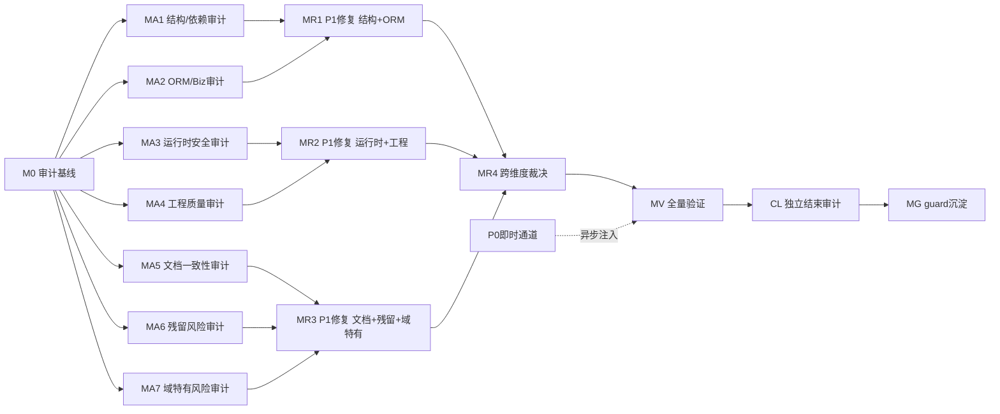

# 审计-修复路线图：nop-metadata 全模块组

> 最后更新：2026-08-04（v5 — MA2 四行 done：4 份审计报告产出，2 项 P2 新增归 MR1/MR2 裁决，7 项 P3 新增归 MR2/deferred）
> 来源：`ai-dev/skills/audit-remediation-roadmap-authoring-prompt.md`
> 目标模块组：nop-metadata（8 子模块，~283 main Java / ~97 test Java）
> 模块组成：`nop-metadata-api`（32 main）、`nop-metadata-core`（2）、`nop-metadata-codegen`（0）、`nop-metadata-dao`（120）、`nop-metadata-meta`（0）、`nop-metadata-service`（128 main + 94 test）、`nop-metadata-web`（0）、`nop-metadata-app`（1）
> 复杂度评分：**S 级**（子模块 8 ≥ 5、main Java 283 ≥ 200、实体 39 ≥ 15 — 三项均超 S 阈值）

## 目的

对 nop-metadata 模块组实施全面审计-修复闭环：

1. 覆盖最近一轮审计（2026-07-23）的盲区：14 个未审计维度、xbiz 文件、web 模块、deploy/app 模块、绿色基线未验证
2. 覆盖 2026-07-19~07-23 四轮审计中**从未独立复核**的 finding（07-23 全部 36 项处于"待复核"状态）
3. 验证 07-19~07-23 期间已修复项的**修复到位性**（含 dao→core 依赖、I*Biz 接口、错误码迁移、DTO 迁移 blocked 项）
4. 覆盖元数据/联邦查询域特有风险维度（SQL/表达式注入、凭据管理、withConnection 数据权限绕过、血缘大图性能、导入引擎安全、调度可靠性、工作流集成）
5. P0 即时通道 + P1 批量修复；每个工作项产出后经独立 closure audit 验证

本路线图只处理 P0 和 P1。P2/P3 记录为 deferred successor。不包含实现细节；每个 `todo` 工作项由独立 execution plan 承载。

## Work Item Status

### M0 — 审计编排基线

| # | Work Item | Status | Owner Doc | Deps | Skill |
|---|-----------|--------|-----------|------|-------|
| 0.1 | 生成审计维度矩阵 | done | `ai-dev/audits/arm-audit-dimension-matrix-nop-metadata.md` | — | `audit-remediation-roadmap-authoring-prompt.md`（步骤 1） |
| 0.2 | 初始化 arm-index（nop-metadata） | done | `ai-dev/audits/arm-index-nop-metadata.md` | 0.1 | `audit-remediation-roadmap-authoring-prompt.md`（§6.1） |
| 0.3 | 汇聚未闭包发现清单 | done | `ai-dev/audits/arm-unclosed-findings-nop-metadata.md` | 0.2 | `audit-remediation-roadmap-authoring-prompt.md`（步骤 2） |
| 0.4 | 运行绿色基线验证 | done | — | 0.3 | none（手动命令） |

### MA1 — 结构与依赖审计（api + core + codegen）

| # | Work Item | Status | Owner Doc | Deps | Skill |
|---|-----------|--------|-----------|------|-------|
| 1.1 | api/core 依赖图与模块边界 | done | `ai-dev/design/nop-metadata/01-architecture-baseline.md`（报告：`ai-dev/audits/2026-08-04-0900-arm-MA1.1-nop-metadata-dependency-graph.md`） | 0.4 | `deep-audit-prompts.md`（维度 01） |
| 1.2 | 模块职责与文件边界（8 子模块） | done | —（报告：`ai-dev/audits/2026-08-04-0900-arm-MA1.2-nop-metadata-module-boundary.md`） | 0.4 | `deep-audit-prompts.md`（维度 02） |
| 1.3 | API 表面积与契约一致性 | done | `nop-metadata/nop-metadata-api/` + `nop-metadata/nop-metadata-dao/src/main/java/io/nop/metadata/biz/`（报告：`ai-dev/audits/2026-08-04-0900-arm-MA1.3-nop-metadata-api-contract.md`） | 0.4 | `deep-audit-prompts.md`（维度 03） |
| 1.4 | Delta 定制合规性 | done | `nop-metadata/*/src/main/resources/_vfs/`（报告：`ai-dev/audits/2026-08-04-0900-arm-MA1.4-nop-metadata-delta.md`） | 0.4 | `deep-audit-prompts.md`（维度 06） |

### MA2 — ORM/BizModel/服务层审计（dao + meta + service）

| # | Work Item | Status | Owner Doc | Deps | Skill |
|---|-----------|--------|-----------|------|-------|
| 2.1 | ORM 模型与实体设计审计（39 实体） | done | `nop-metadata/model/nop-metadata.orm.xml`（报告：`ai-dev/audits/2026-08-04-0935-arm-MA2.1-nop-metadata-orm-model.md`） | 0.4 | `orm-model-audit-prompt.md` |
| 2.2 | 生成管线完整性审计 | done | `nop-metadata/model/`（报告：`ai-dev/audits/2026-08-04-0935-arm-MA2.2-nop-metadata-pipeline.md`） | 0.4 | `deep-audit-prompts.md`（维度 05） |
| 2.3 | BizModel 规范遵循审计（42 个） | done | `nop-metadata/nop-metadata-service/src/main/java/io/nop/metadata/service/entity/`（报告：`ai-dev/audits/2026-08-04-0935-arm-MA2.3-nop-metadata-bizmodel.md`） | 0.4 | `deep-audit-prompts.md`（维度 07） |
| 2.4 | IoC 与 Bean 配置审计 | done | `nop-metadata/*/src/main/resources/_vfs/**/*.beans.xml`（报告：`ai-dev/audits/2026-08-04-0935-arm-MA2.4-nop-metadata-ioc.md`） | 0.4 | `deep-audit-prompts.md`（维度 08） |

### MA3 — 运行时与安全审计（service + web）

| # | Work Item | Status | Owner Doc | Deps | Skill |
|---|-----------|--------|-----------|------|-------|
| 3.1 | XDSL 与 XLang 正确性（含 xbiz/xwf） | todo | `nop-metadata/nop-metadata-service/src/main/resources/_vfs/` | 0.4 | `deep-audit-prompts.md`（维度 10） |
| 3.2 | GraphQL 与 API 层审计 | todo | `nop-metadata/nop-metadata-service/` + `nop-metadata/nop-metadata-api/` | 0.4 | `deep-audit-prompts.md`（维度 12） |
| 3.3 | 安全与权限模型审计（@Auth/数据鉴权/withConnection 旁路面） | todo | `nop-metadata/nop-metadata-service/src/main/java/io/nop/metadata/service/` | 0.4 | `deep-audit-prompts.md`（维度 13） |
| 3.4 | 异步与事务模式审计（质量检查点 cron、事件 dispatch） | todo | — | 0.4 | `deep-audit-prompts.md`（维度 14） |

### MA4 — 工程质量审计（全模块）

| # | Work Item | Status | Owner Doc | Deps | Skill |
|---|-----------|--------|-----------|------|-------|
| 4.1 | 错误处理与错误码审计（前缀迁移残余） | todo | `nop-metadata/*/src/main/java/**/*Errors.java` | 0.4 | `deep-audit-prompts.md`（维度 09） |
| 4.2 | 类型安全与泛型使用（机械维度，整域） | todo | — | 0.4 | `deep-audit-prompts.md`（维度 15） |
| 4.3 | 测试覆盖与质量 — 核心执行域（query/aggregation/lineage/sqlview） | todo | `nop-metadata/nop-metadata-service/src/test/` | 0.4 | `deep-audit-prompts.md`（维度 16） |
| 4.4 | 测试覆盖与质量 — 其余域（import/datasource/quality/reconciliation/semantic/search/contract/event） | todo | `nop-metadata/nop-metadata-service/src/test/` | 0.4 | `deep-audit-prompts.md`（维度 16） |
| 4.5 | 代码风格与规范（机械维度，整域） | todo | — | 0.4 | `deep-audit-prompts.md`（维度 17） |
| 4.6 | 单元测试有效性 — 核心执行域 | todo | `nop-metadata/nop-metadata-service/src/test/` | 0.4 | `deep-audit-prompts.md`（维度 21）+ `unit-test-antipatterns.md` |
| 4.7 | 单元测试有效性 — 其余域 | todo | `nop-metadata/nop-metadata-service/src/test/` | 0.4 | `deep-audit-prompts.md`（维度 21）+ `unit-test-antipatterns.md` |

### MA5 — 文档与一致性审计（全模块）

| # | Work Item | Status | Owner Doc | Deps | Skill |
|---|-----------|--------|-----------|------|-------|
| 5.1 | 设计文档-代码 drift（ai-dev/design/nop-metadata/ 17 篇） | todo | `ai-dev/design/nop-metadata/` | 0.4 | `design-doc-audit-prompt.md` |
| 5.2 | docs-for-ai 文档-代码一致性 | todo | `docs-for-ai/03-modules/nop-metadata.md` + `docs-for-ai/01-repo-map/module-groups.md` | 0.4 | `deep-audit-prompts.md`（维度 18） |
| 5.3 | 命名与术语一致性 | todo | — | 0.4 | `deep-audit-prompts.md`（维度 19） |
| 5.4 | 跨模块契约一致性（nop-sys/nop-auth/nop-wf/nop-code 依赖面） | todo | `docs-for-ai/01-repo-map/module-groups.md` | 0.4 | `cross-module-dependency-audit-prompt.md` |

### MA6 — 残留风险审计专项（全模块）

| # | Work Item | Status | Owner Doc | Deps | Skill |
|---|-----------|--------|-----------|------|-------|
| 6.1 | 空壳实现扫描（H01） | todo | — | 0.4 | `open-ended-adversarial-review-prompt.md` |
| 6.2 | 静默跳过检测（H02） | todo | — | 0.4 | `open-ended-adversarial-review-prompt.md` |
| 6.3 | 接线完整性验证（H03） | todo | — | 0.4 | `open-ended-adversarial-review-prompt.md` |
| 6.4 | 敏感信息泄露扫描（H05，含 JDBC 凭据/连接串） | todo | — | 0.4 | `open-ended-adversarial-review-prompt.md` |
| 6.5 | 测试隔离性审查（H06） | todo | — | 0.4 | `open-ended-adversarial-review-prompt.md` |
| 6.6 | 既有修复验证（H07，07-19~07-23 已修复项） | todo | `ai-dev/audits/arm-unclosed-findings-nop-metadata.md` | 0.3 | `closure-audit-prompt.md` |

### MA7 — 元数据域特有风险审计（全模块）

| # | Work Item | Status | Owner Doc | Deps | Skill |
|---|-----------|--------|-----------|------|-------|
| 7.1 | SQL/表达式注入面（custom_sql、expression measure、join 注入点、分词黑名单绕过） | todo | `nop-metadata/nop-metadata-service/src/main/java/io/nop/metadata/service/` | 0.4 | `open-ended-adversarial-review-prompt.md` |
| 7.2 | 凭据管理与联邦查询数据权限（connectionConfig 凭据、withConnection 直查旁路） | todo | `nop-metadata/nop-metadata-service/src/main/java/io/nop/metadata/service/connection/` | 0.4 | `open-ended-adversarial-review-prompt.md` |
| 7.3 | 导入引擎与元数据同步安全（ORM XML 解析、外部表同步、多 schema） | todo | `nop-metadata/nop-metadata-service/src/main/java/io/nop/metadata/service/` | 0.4 | `open-ended-adversarial-review-prompt.md` |
| 7.4 | 血缘大图与查询性能（BFS 遍历、N+1、聚合内存上限） | todo | `nop-metadata/nop-metadata-service/src/main/java/io/nop/metadata/service/lineage/` + `query/` | 0.4 | `open-ended-adversarial-review-prompt.md` |
| 7.5 | 调度与事件可靠性（质量检查点 cron、事件脱敏、幂等） | todo | `nop-metadata/nop-metadata-service/src/main/java/io/nop/metadata/service/quality/` + `event/` | 0.4 | `open-ended-adversarial-review-prompt.md` |
| 7.6 | 工作流与审批集成（nop-wf 集成、webhook SSRF allowlist、失败路径） | todo | `nop-metadata/nop-metadata-service/src/main/resources/_vfs/`（.xwf）+ `nop-metadata/nop-metadata-service/src/main/java/io/nop/metadata/service/contract/` | 0.4 | `open-ended-adversarial-review-prompt.md` |

### MR1 — P1 批量修复（第一批：结构 + ORM/Biz）

| # | Work Item | Status | Owner Doc | Deps | Skill |
|---|-----------|--------|-----------|------|-------|
| R1.0 | MA1+MA2 P1 发现汇总、排序并展开为具体修复工作项行 | todo | `ai-dev/audits/arm-index-nop-metadata.md` §P1 | MA1+MA2 done | none（展开器） |
| R1.x | MA1+MA2 修复（展开后逐项追加） | todo | — | R1.0 | 按具体修复工作项确定 |

### MR2 — P1 批量修复（第二批：运行时 + 工程）

| # | Work Item | Status | Owner Doc | Deps | Skill |
|---|-----------|--------|-----------|------|-------|
| R2.0 | MA3+MA4 P1 发现汇总、排序并展开 | todo | `ai-dev/audits/arm-index-nop-metadata.md` §P1 | MA3+MA4 done | none（展开器） |
| R2.x | MR2 P1 修复执行 | todo | — | R2.0 | 按具体修复工作项确定 |

### MR3 — P1 批量修复（第三批：文档 + 残留风险 + 域特有）

| # | Work Item | Status | Owner Doc | Deps | Skill |
|---|-----------|--------|-----------|------|-------|
| R3.0 | MA5+MA6+MA7 P1 发现汇总、排序并展开 | todo | `ai-dev/audits/arm-index-nop-metadata.md` §P1 | MA5+MA6+MA7 done | none（展开器） |
| R3.x | MR3 P1 修复执行 | todo | — | R3.0 | 按具体修复工作项确定 |

### MR4 — 跨维度裁决

| # | Work Item | Status | Owner Doc | Deps | Skill |
|---|-----------|--------|-----------|------|-------|
| R4.1 | 跨维度 P1 裁决与冲突修复 | todo | `ai-dev/audits/arm-index-nop-metadata.md` | MR1+MR2+MR3 done | `closure-audit-prompt.md` |

### MV — 全量验证

| # | Work Item | Status | Owner Doc | Deps | Skill |
|---|-----------|--------|-----------|------|-------|
| V.1 | 全量 build + test | todo | — | MR4 done | none |
| V.2 | 独立子代理 closure audit | todo | `ai-dev/audits/arm-index-nop-metadata.md` | V.1 | `closure-audit-prompt.md` |
| V.3 | 所有 P0/P1 finding 可追溯至修复或 deferred | todo | `ai-dev/audits/arm-index-nop-metadata.md` | V.2 | `closure-audit-prompt.md` |

### MG — Guard 与知识沉淀

| # | Work Item | Status | Owner Doc | Deps | Skill |
|---|-----------|--------|-----------|------|-------|
| G.1 | 新失败模式提升为 lessons | todo | `ai-dev/lessons/` | MV done | none |
| G.2 | 重复审计维度提升为 skills/ 新提示 | todo | `ai-dev/skills/` | MV done | none |
| G.3 | 更新 docs-for-ai/ 和 design 文档 | todo | `docs-for-ai/` + `ai-dev/design/nop-metadata/` | MV done | none |

## 框架/平台复用

| 能力 | 提供方式 |
|------|----------|
| 21 维度深度审计 | `ai-dev/skills/deep-audit-prompts.md` |
| ORM 模型审计 | `ai-dev/skills/orm-model-audit-prompt.md` |
| 跨模块依赖审计 | `ai-dev/skills/cross-module-dependency-audit-prompt.md` |
| 设计文档审计 | `ai-dev/skills/design-doc-audit-prompt.md` |
| 开放式对抗审查 | `ai-dev/skills/open-ended-adversarial-review-prompt.md` |
| 单元测试反模式 | `ai-dev/skills/unit-test-antipatterns.md` |
| 平台合规审计 | `ai-dev/skills/nop-platform-conformance-audit-prompt.md` |
| Closure audit | `ai-dev/skills/closure-audit-prompt.md` |
| 构建验证 | `./mvnw clean install -DskipTests -pl nop-metadata -am -T 1C` |
| 测试验证 | `./mvnw test -pl nop-metadata -am -T 1C` |
| 历史审计基线 | `ai-dev/audits/2026-07-19-1118-*` / `2026-07-20-1554-deep-audit-nop-metadata/` / `2026-07-20-1816-*` / `2026-07-21-2039-*` / `2026-07-23-0714-*` |

## 当前基线（2026-08-04 快照，M0.4 绿色基线验证后）

**绿色基线（M0.4，2026-08-04 实测）：**

- 构建：`./mvnw clean install -DskipTests -pl nop-metadata -am -T 1C` → BUILD SUCCESS（35s）
- 测试：`./mvnw test -pl nop-metadata -am -T 1C` → BUILD SUCCESS（3:50）
- 测试计数（口径：nop-metadata 8 子模块 surefire 汇总）：**813 tests / 0 failures / 0 errors / 0 skipped**（service 812 + web 1；88 份报告文件；@NopTest 文件 service 49 / 全模块 50；AutoTest 快照 5 类；实体 39；@BizModel service main 41 处注解、含测试 42）。reactor 范围 `-pl nop-metadata -am` 含全部 8 子模块及上游依赖模块（nop-biz/nop-auth/nop-wf/nop-job/nop-search/nop-dyn 等），上游模块测试同样全绿。
- 与旧基线（2026-07-23 记录 833+）差异说明：813 为 nop-metadata 子树 surefire 精确计数，833 为旧时点不同范围/文件口径；两者均为 0 failures。后续 MA 计划以 **813/0** 为可比基线（命令、范围、口径同上）。
- 基线记录出处：`ai-dev/logs/2026/08-04.md` §M0.4

**已闭环的审计-修复历史**（本 roadmap 不重复审计，M0.3 未闭包清单负责归集残余项）：

- 四轮历史审计：07-19（multi+open）、07-20-1554（21 维度 deep，41 发现→34 唯一，6 组去重合并）、07-20-1816（multi 3 维度：01/04/07）、07-21（multi 8 维度）、07-23（multi 7 维度，36 发现 = 1 P1 + 14 P2 + 21 P3/P4，全部"待复核"）
- 修复 plan 状态：04-18、292-306、308-313 及 2026-07-16~07-23 各阶段 plan 全部 completed；**307（DTO 迁移）header 标 completed 但 Phase 1 实为 blocked/deferred，M0.3 必须纳入其残余项**
- 2026-07-31 抽查验证已修复：I*Biz 接口补齐（executeReconciliation/confirmMatch/batchConfirmMatches 已在接口声明）、xmlns:ioc 已补、dao→core 编译依赖已移除、MetaAggregationExecutor 3468→264 行（已拆 Processor）
- 测试基线：`./mvnw test -pl nop-metadata -am` → 833+ tests / 0 failures（2026-07-23 记录）

**主要缺口（本 roadmap 处理对象，详见各历史审计报告）：**

- 07-23 审计 36 项 finding 全部"待复核"，且当时未跑绿色基线、未做独立复核（`ai-dev/audits/2026-07-23-0714-multi-audit-nop-metadata/summary.md`）
- 07-20 deep audit 共识 P1/P2 残余项：@Auth 细粒度权限（共识降级 P3）、ErrorCode `nop.err.` 前缀迁移（14 文件已迁移）、Map 返回型 API（21 方法/8 BizModel）、MetaJoinExecutor 大文件（07-20 审计记录 1012 行，当前 743 行）——见 `ai-dev/audits/2026-07-20-1554-deep-audit-nop-metadata/summary.md`
- AutoTest 快照覆盖仍偏低：94 个测试文件中仅 5 个 AutoTest（07-23 审计口径 82/1，此后新增 4 个；基线见 `ai-dev/audits/2026-07-23-0714-multi-audit-nop-metadata/summary.md`）
- 已知盲区（07-23 自评）：xbiz 文件、web 模块页面资源、deploy/app 配置、质量调度（cron）与事件链路、搜索索引隔离、导入引擎安全、联邦查询 withConnection 数据权限面

## 审计维度矩阵

M0.1 产出 `ai-dev/audits/arm-audit-dimension-matrix-nop-metadata.md`：二维表（行 = 审计维度，列 = 8 子模块），单元格标注 `✅ 已审计且无 finding`（引用历史审计文件）/ `⚠️ 已审计但有未闭包 finding`（引用 finding 编号）/ `❓ 未审计`（本 roadmap 新审计工作项来源）/ `N/A`。矩阵覆盖三个来源：

1. **已有 skill 维度**：`deep-audit-prompts.md` 21 维度 + `orm-model-audit-prompt.md` + `cross-module-dependency-audit-prompt.md` + `design-doc-audit-prompt.md`
2. **残留风险新维度**：空壳实现、静默跳过、接线完整性、敏感信息泄露、测试隔离性、既有修复验证（06-19~07-23 修复到位性）
3. **元数据域特有风险**：SQL/表达式注入面、凭据与 withConnection 数据权限、导入引擎安全、血缘/查询性能、调度与事件可靠性、工作流集成

## 里程碑

| 里程碑 | 依赖 | 产出 |
|--------|------|------|
| M0 | 无 | 维度矩阵 + arm-index + 未闭包清单 + 绿色基线 |
| MA1 | M0 | 审计报告（api/core/codegen 结构） |
| MA2 | M0 | 审计报告（ORM, BizModel, 服务层） |
| MA3 | M0 | 审计报告（XDSL, GraphQL, 安全, 异步事务） |
| MA4 | M0 | 审计报告（工程质量 7 项） |
| MA5 | M0 | 审计报告（文档与一致性） |
| MA6 | M0 | 审计报告（残留风险 6 项） |
| MA7 | M0 | 审计报告（元数据域特有风险 6 项） |
| MR1 | MA1+MA2 | 修复代码 + 测试 |
| MR2 | MA3+MA4 | 修复代码 + 测试 |
| MR3 | MA5+MA6+MA7 | 修复代码 + 测试 |
| MR4 | MR1+MR2+MR3 | 裁决文档（无冲突时直接 done） |
| MV | MR1+MR2+MR3+MR4 | 验证报告 + closure audit |
| MG | MV | lessons + skills + docs |

## Work Item Details

> **状态**：所有工作项状态见上方 Work Item Status 表（唯一动态状态块），此处不重复。
> **Closure audit**：每个审计工作项的 plan 必须包含"产出审计报告 + 更新 arm-index + 独立 closure audit 通过"作为结束子步骤；修复工作项必须包含"修复验证 + 绿色基线保持 + 独立 closure audit 通过"。closure audit 未通过不得标记 done。

### M0
- **0.1**: 按 `audit-remediation-roadmap-authoring-prompt.md` 步骤 1 生成审计维度矩阵（三个来源），存 `ai-dev/audits/arm-audit-dimension-matrix-nop-metadata.md`
- **0.2**: 初始化 `ai-dev/audits/arm-index-nop-metadata.md`（报告清单 + P0 追踪 + P1 汇总骨架；不触碰既有 nop-ai `arm-index.md`）
- **0.3**: 遍历四轮历史审计（07-19/07-20×2/07-21/07-23）+ 全部已 completed 修复 plan（含 307 残余项），汇聚未闭包 P0/P1 发现清单，存 `ai-dev/audits/arm-unclosed-findings-nop-metadata.md`
- **0.4**: 运行 `./mvnw clean install -DskipTests -pl nop-metadata -am -T 1C` + `./mvnw test -pl nop-metadata -am -T 1C`

### MA1 — 结构与依赖审计
- **1.1**: api/core 模块依赖图合规性（dao→core 历史违规回归验证、-api 依赖缺失、零引用依赖）
- **1.2**: 8 子模块职责与文件边界（api 32 / dao 120 / service 128 文件职责、core 过轻问题、codegen/meta/web 边界）
- **1.3**: nop-metadata-api DTO/接口 与 I*Biz 接口契约收敛性（@BizMutation 声明、Map 返回类型、IServiceContext 参数）
- **1.4**: Delta 文件位置、x:extends 使用合规性（2026-07-20 审计结论"无 Delta"需回归确认）

### MA2 — ORM/BizModel/服务层审计
- **2.1**: 39 实体 ORM 建模合规性（字段类型、关系、cascade-delete、域使用、displayName、dict 跨模块引用）
- **2.2**: model→codegen→dao→meta→service→web 生成链路完整性（39:39:39:39 一致性回归）
- **2.3**: 42 个 CrudBizModel 规范遵循（注解、继承、setEntityName、requireEntity 数据鉴权、delete 覆盖 @Name）
- **2.4**: beans.xml 注入方式（无 private 字段注入）、生成文件边界、CRUD 生成禁用意图复核

### MA3 — 运行时与安全
- **3.1**: xbiz/xmeta/xwf/XDSL 解析正确性（07-23 盲区：xbiz 从未审计）
- **3.2**: GraphQL schema 暴露面、mutation 方法安全、Map 返回对 selection 的影响
- **3.3**: 安全模型（@Auth 细粒度权限现状、requireEntity 绕过面、withConnection 直查旁路、webhook allowlist 回归）
- **3.4**: 异步/事务（质量检查点 cron 调度、dispatchActions post-commit 语义、upsert 竞态）

### MA4 — 工程质量
- **4.1**: 错误处理（NopMetadataException String 构造器、ErrorCode `nop.err.` 前缀迁移残余、ARG_* 常量、消息可读性）
- **4.2**: 类型安全与泛型（Raw type、unchecked cast、泛型擦除）— 机械维度整域单工作项
- **4.3/4.4**: 测试覆盖与质量（覆盖率缺口、断言强度、AutoTest 快照缺口）— S 级行为维度按功能域拆 2 片
- **4.5**: 代码风格（命名、导入分组、注释、版权头残余）— 机械维度整域
- **4.6/4.7**: 单元测试有效性（测试捕获能力、sleep 反模式、重复 CRUD 测试、数据鉴权测试真实性）— 按功能域拆 2 片

### MA5 — 文档与一致性
- **5.1**: `ai-dev/design/nop-metadata/` 17 篇设计文档与代码 drift（architecture-baseline 为权威基线）
- **5.2**: `docs-for-ai/03-modules/nop-metadata.md` + module-groups.md 与代码一致性
- **5.3**: 命名与术语一致性（跨模块同概念同一名称、AutoClassificationService 等命名规范）
- **5.4**: 跨模块契约（nop-sys/nop-auth/nop-wf/nop-code 依赖面、dict 跨模块引用、querySpace 路由）

### MA6 — 残留风险
- **6.1**: 空壳实现扫描（接口有声明无实现、方法体空、throw UnsupportedOperationException）
- **6.2**: 静默跳过检测（空 catch、catch-and-swallow、MetaQualityScorer catch→return null 类模式、条件不满足静默返回）
- **6.3**: 接线完整性（beans.xml bean class 存在性、@Inject 对应 bean、生成文件与手写文件边界）
- **6.4**: 敏感信息泄露（JDBC URL/密码/令牌/API Key 在日志、错误消息、配置、测试夹具中泄露；连接串脱敏链路回归）
- **6.5**: 测试隔离性（测试间共享状态、静态字段污染、并发测试）
- **6.6**: 既有修复验证（对 0.3 清单中已标修复项抽样核验 fix 到位性 + 回归测试存在性）

### MA7 — 元数据域特有风险
- **7.1**: SQL/表达式注入（ExpressionMeasureValidator 黑名单绕过路径、custom_sql 分词黑名单、join 注入点、参数绑定顺序、跨库内存过滤）
- **7.2**: 凭据管理与数据权限（connectionConfig 加密/脱敏、withConnection 直查绕过 ORM data-auth、多租户数据源隔离）
- **7.3**: 导入引擎安全（ORM XML 解析（XXE/实体膨胀）、外部表同步、manifest 快照、多 schema 支持）
- **7.4**: 性能（血缘大图 BFS 遍历深度、列级血缘边数爆炸、N+1 查询、聚合内存上限、检查点扫描性能）— 开放式对抗审查
- **7.5**: 调度与事件（cron 调度可靠性、事件脱敏（sourceSql/buildSql sensitive 标记）、幂等、失败重试）
- **7.6**: 工作流集成（.xwf 审批流、webhook SSRF allowlist、QualityAlertWorkflowService 失败路径、nop-wf 依赖完整性）

### MR1-MR3
每个 MR 含 R*.0 展开器工作项 + 具体修复工作项。R*.0 的 plan 产物 = 向 roadmap 追加具体修复工作项行；**展开的 R*.x 行必须引用对应审计 finding 编号（`P<级别>-<里程碑>-<序号>`）作为 Deps**。

### MR4
无跨维度冲突时直接标记 done 并注明"无冲突"。

### MV
全量 build + test + 独立子代理 closure audit（验证所有 P0/P1 finding 可追溯至修复或 deferred，追踪矩阵写入 arm-index）。

### MG
失败模式提升为 lessons + 重复维度提升为 skills + 更新 docs-for-ai/ 与 design 文档。

## 依赖图

## 横切关注点

- **执行模式（串行）**：Mission Driver 按文档顺序取第一个 todo
- **P0 即时通道**：审计中发现 P0 当即处理（就地修复或异步注入修复 plan），不得留到 MR 批量修复
- **报告归档**：每份审计报告使用 `arm-` 前缀（`ai-dev/audits/YYYY-MM-DD-HHmm-arm-<milestone>-nop-metadata-<dimension>.md`），产出即更新 arm-index-nop-metadata.md
- **Finding ID 规范**：`P<级别>-<里程碑>-<序号>`，如 `P0-MA1-001`
- **绿色基线保持**：每个 MR 结束时全量 build 通过
- **R*.0 展开机制**：MR1-MR3 使用展开器工作项
- **Closure audit 强制**：每个工作项完成后必须由独立子代理做 closure audit，通过后方可标记 done
- **审计 plan 的 BUILD_VERIFY**：审计 plan 不改代码，BUILD_VERIFY 跑 `mvn test` 确认无回归

## 规则

1. 本 roadmap 只处理 P0 和 P1。P2/P3 记录为 deferred successor
2. 审计 plan 产物 = 审计报告（`ai-dev/audits/arm-*.md`，nop-metadata 专用 `arm-*-nop-metadata.md` 命名）+ 索引更新
3. 修复 plan 产物 = 代码变更 + 测试
4. MA 与 MR 严格分离（P0 例外，走即时通道）
5. 初始全 `todo`，里程碑无状态；状态只允许改 Work Item Status 表
6. 每个工作项标记 done 前必须经独立 closure audit
7. 既有审计文件不动——`ai-dev/audits/` 下非 `arm-*nop-metadata*` 的历史审计（含 nop-ai 的 `arm-index.md`）仅作基线引用，禁止覆盖
8. Finding ID 格式：`P<级别>-<里程碑>-<序号>`
9. 手编生成产物（`_gen/`、`_*.xml`、`_app.orm.xml`）仍禁止——改源模型（`nop-metadata/model/nop-metadata.orm.xml`）后经 `mvn clean install -DskipTests` 重新生成（见 AGENTS.md）
