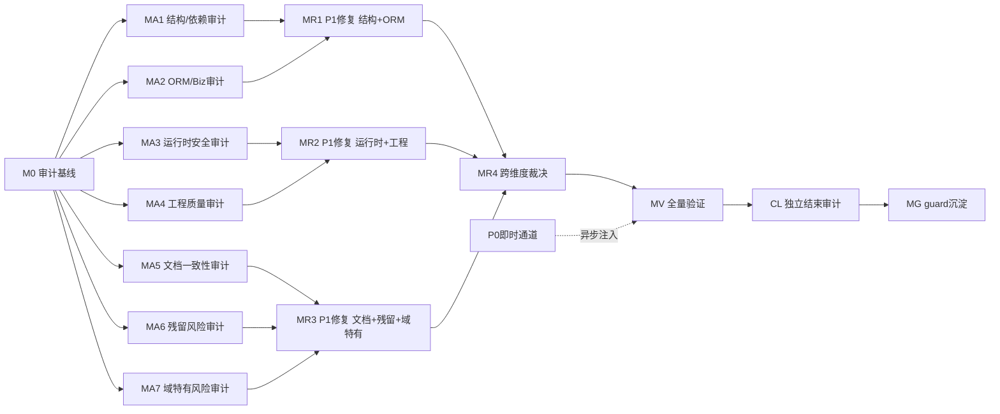

> 最后更新：2026-08-06（v32 — **MR8 R8.4 行整体 done（R8.4b 收口，plan-2026-08-06-1228-2 全 6 Phase）**：AR-17 + AR-23①②⑨⑩ 五项调度/导入/事件/索引正确性缺陷全部落地——AR-17 syncExternalTables 部分持久化契约文档化（docs-for-ai §失败路径 + design §2.5.1）+ scan 级失败事件面（try/catch 包 withConnection 块，REQUIRES_NEW 独立事务发布事件后重抛——事件行不随外层回滚消失；失败注入机制裁定 = 反射替换 private final structureReader）；AR-23① delete 先删后摘 cron（删除失败调度保留 + fail-loud；残余 commit 窗口与残留 cron 噪音两项裁定）；AR-23② 重建前清理（全量 removeTopic 一次 / 部分类型级枚举 removeDocs，枚举上限 10000 watch-only 裁定）；AR-23⑨ manifest 排除 DRAFTING（not-eq 保留 DEPRECATED 裁定）；AR-23⑩ 事件快照 Map 分支脱敏（大小写敏感与 ORM 分支对齐裁定 + 冲突测试 re-adjudication）；判别性测试 +11 red→green 实测（git stash 逐项 red），`./mvnw test -pl nop-metadata -am -T 1C` **nop-metadata 1049/0 全绿**（service 1048 + web 1；R8.4a 1037 基线 + 11，全 reactor 5249/0、72 skipped 与 R8.4a VERIFY 5238/0 + 11 一致）；check-plan-checklist/check-doc-links/scan-hollow 全 0；docs-for-ai §失败路径 + design §2.5.1 已同步；独立子 agent closure audit READY_TO_CLOSE；R8.4 行整体 done，MR8 里程碑全行收口。prior v31（MR8 R8.4a 收口）保持不变）# 审计-修复路线图：nop-metadata 全模块组

> 最后更新：2026-08-06（v31 — **MR8 R8.4a 收口（plan-2026-08-06-1228-1 全 5 Phase）**：AR-20 + AR-21 + AR-22 三项查询/标注/契约正确性缺陷全部落地——AR-20a buildOrderByClause 方言感知（MySQL 上不再产出 NULLS FIRST/LAST 语法错误：与 MySQL 默认一致时省略子句、无法表达组合显式 ERR_AGGR_ORDER_BY_NULLS_UNSUPPORTED fail-fast；Mixed/ExternalExternal ORDER BY 构建移入 withConnection lambda；ORM 路径无方言 API 显式裁定保持 H2 语义拼子句 + Deferred 登记）；AR-20b 跨库 join 整型族（Byte/Short/Integer/Long/BigInteger）数值等值键兼容（stringKey 匹配必然同串，INT vs BIGINT 不再误拒；非整型 BigDecimal/String 仍拒绝）+ 既有 testTypeMismatchIntegerVsLongThrowsExplicitly re-adjudication；AR-21 自动化标注三层吞错处置（内层 catch-all → 显式新码 ERR_TAG_LABEL_SAVE_FAILED、suggestTags 用户路径 fail-loud 到请求边界、propagateEdge 后台路径 per-edge 隔离 + LOG.error 可观测；无绑定分类移除 lexicographically-first 全局回退）；AR-22 SLA 时间单位补 week/w + 未知单位显式抛既有 ERR_CONTRACT_SLA_INVALID（不再静默按毫秒）；判别性测试 +21 red→green 实测（git stash 逐项 red），`./mvnw test -pl nop-metadata -am -T 1C` **1037/0 全绿**（1016 基线 + 21）；check-plan-checklist/check-doc-links/scan-hollow 全 0；docs 复核 No owner-doc update required；独立子 agent closure audit READY_TO_CLOSE；R8.4 行 R8.4a 子项 → fixed，R8.4 行整体 done 待 R8.4b（plan-2026-08-06-1228-2，AR-17 + AR-23①②⑨⑩）收口。prior v30（MR8 R8.3 收口）保持不变）
> 来源：`ai-dev/skills/audit-remediation-roadmap-authoring-prompt.md`
> 目标模块组：nop-metadata（8 子模块，~283 main Java / ~97 test Java）
> 模块组成：`nop-metadata-api`（32 main）、`nop-metadata-core`（2）、`nop-metadata-codegen`（0）、`nop-metadata-dao`（120）、`nop-metadata-meta`（0）、`nop-metadata-service`（128 main + 94 test）、`nop-metadata-web`（0）、`nop-metadata-app`（1）
> 复杂度评分：**S 级**（子模块 8 ≥ 5、main Java 283 ≥ 200、实体 39 ≥ 15 — 三项均超 S 阈值）

## 目的

对 nop-metadata 模块组实施全面审计-修复闭环：

1. 覆盖最近一轮审计（2026-07-23）的盲区：14 个未审计维度、xbiz 文件、web 模块、deploy/app 模块、绿色基线未验证
2. 覆盖 2026-07-19~07-23 四轮审计中**从未独立复核**的 finding（07-23 全部 36 项处于"待复核"状态）
3. 验证 07-19~07-23 期间已修复项的**修复到位性**（含 dao→core 依赖、I*Biz 接口、错误码迁移、DTO 迁移 blocked 项）
4. 覆盖元数据/联邦查询域特有风险维度（SQL/表达式注入、凭据管理、withConnection 数据权限绕过、血缘大图性能、导入引擎安全、调度可靠性、工作流集成）
5. P0 即时通道 + P1 批量修复；每个工作项产出后经独立 closure audit 验证

本路线图只处理 P0 和 P1。P2/P3 记录为 deferred successor。不包含实现细节；每个 `todo` 工作项由独立 execution plan 承载。

## Work Item Status

### M0 — 审计编排基线

| # | Work Item | Status | Owner Doc | Deps | Skill |
|---|-----------|--------|-----------|------|-------|
| 0.1 | 生成审计维度矩阵 | done | `ai-dev/audits/arm-audit-dimension-matrix-nop-metadata.md` | — | `audit-remediation-roadmap-authoring-prompt.md`（步骤 1） |
| 0.2 | 初始化 arm-index（nop-metadata） | done | `ai-dev/audits/arm-index-nop-metadata.md` | 0.1 | `audit-remediation-roadmap-authoring-prompt.md`（§6.1） |
| 0.3 | 汇聚未闭包发现清单 | done | `ai-dev/audits/arm-unclosed-findings-nop-metadata.md` | 0.2 | `audit-remediation-roadmap-authoring-prompt.md`（步骤 2） |
| 0.4 | 运行绿色基线验证 | done | — | 0.3 | none（手动命令） |

### MA1 — 结构与依赖审计（api + core + codegen）

| # | Work Item | Status | Owner Doc | Deps | Skill |
|---|-----------|--------|-----------|------|-------|
| 1.1 | api/core 依赖图与模块边界 | done | `ai-dev/design/nop-metadata/01-architecture-baseline.md`（报告：`ai-dev/audits/2026-08-04-0900-arm-MA1.1-nop-metadata-dependency-graph.md`） | 0.4 | `deep-audit-prompts.md`（维度 01） |
| 1.2 | 模块职责与文件边界（8 子模块） | done | —（报告：`ai-dev/audits/2026-08-04-0900-arm-MA1.2-nop-metadata-module-boundary.md`） | 0.4 | `deep-audit-prompts.md`（维度 02） |
| 1.3 | API 表面积与契约一致性 | done | `nop-metadata/nop-metadata-api/` + `nop-metadata/nop-metadata-dao/src/main/java/io/nop/metadata/biz/`（报告：`ai-dev/audits/2026-08-04-0900-arm-MA1.3-nop-metadata-api-contract.md`） | 0.4 | `deep-audit-prompts.md`（维度 03） |
| 1.4 | Delta 定制合规性 | done | `nop-metadata/*/src/main/resources/_vfs/`（报告：`ai-dev/audits/2026-08-04-0900-arm-MA1.4-nop-metadata-delta.md`） | 0.4 | `deep-audit-prompts.md`（维度 06） |

### MA2 — ORM/BizModel/服务层审计（dao + meta + service）

| # | Work Item | Status | Owner Doc | Deps | Skill |
|---|-----------|--------|-----------|------|-------|
| 2.1 | ORM 模型与实体设计审计（39 实体） | done | `nop-metadata/model/nop-metadata.orm.xml`（报告：`ai-dev/audits/2026-08-04-0935-arm-MA2.1-nop-metadata-orm-model.md`） | 0.4 | `orm-model-audit-prompt.md` |
| 2.2 | 生成管线完整性审计 | done | `nop-metadata/model/`（报告：`ai-dev/audits/2026-08-04-0935-arm-MA2.2-nop-metadata-pipeline.md`） | 0.4 | `deep-audit-prompts.md`（维度 05） |
| 2.3 | BizModel 规范遵循审计（42 个） | done | `nop-metadata/nop-metadata-service/src/main/java/io/nop/metadata/service/entity/`（报告：`ai-dev/audits/2026-08-04-0935-arm-MA2.3-nop-metadata-bizmodel.md`） | 0.4 | `deep-audit-prompts.md`（维度 07） |
| 2.4 | IoC 与 Bean 配置审计 | done | `nop-metadata/*/src/main/resources/_vfs/**/*.beans.xml`（报告：`ai-dev/audits/2026-08-04-0935-arm-MA2.4-nop-metadata-ioc.md`） | 0.4 | `deep-audit-prompts.md`（维度 08） |

### MA3 — 运行时与安全审计（service + web）

| # | Work Item | Status | Owner Doc | Deps | Skill |
|---|-----------|--------|-----------|------|-------|
| 3.1 | XDSL 与 XLang 正确性（含 xbiz/xwf） | done | `nop-metadata/nop-metadata-service/src/main/resources/_vfs/`（报告：`ai-dev/audits/2026-08-04-1136-arm-MA3.1-nop-metadata-xdsl.md`） | 0.4 | `deep-audit-prompts.md`（维度 10） |
| 3.2 | GraphQL 与 API 层审计 | done | `nop-metadata/nop-metadata-service/` + `nop-metadata/nop-metadata-api/`（报告：`ai-dev/audits/2026-08-04-1156-arm-MA3.2-nop-metadata-graphql.md`） | 0.4 | `deep-audit-prompts.md`（维度 12） |
| 3.3 | 安全与权限模型审计（@Auth/数据鉴权/withConnection 旁路面） | done | `nop-metadata/nop-metadata-service/src/main/java/io/nop/metadata/service/`（报告：`ai-dev/audits/2026-08-04-1204-arm-MA3.3-nop-metadata-security.md`） | 0.4 | `deep-audit-prompts.md`（维度 13） |
| 3.4 | 异步与事务模式审计（质量检查点 cron、事件 dispatch） | done | —（报告：`ai-dev/audits/2026-08-04-1212-arm-MA3.4-nop-metadata-async-txn.md`） | 0.4 | `deep-audit-prompts.md`（维度 14） |

### MA4 — 工程质量审计（全模块）

| # | Work Item | Status | Owner Doc | Deps | Skill |
|---|-----------|--------|-----------|------|-------|
| 4.1 | 错误处理与错误码审计（前缀迁移残余） | done | `nop-metadata/*/src/main/java/**/*Errors.java` | 0.4 | `deep-audit-prompts.md`（维度 09） |
| 4.2 | 类型安全与泛型使用（机械维度，整域） | done | — | 0.4 | `deep-audit-prompts.md`（维度 15） |
| 4.3 | 测试覆盖与质量 — 核心执行域（query/aggregation/lineage/sqlview） | done | `nop-metadata/nop-metadata-service/src/test/` | 0.4 | `deep-audit-prompts.md`（维度 16） |
| 4.4 | 测试覆盖与质量 — 其余域（import/datasource/quality/reconciliation/semantic/search/contract/event） | done | `nop-metadata/nop-metadata-service/src/test/` | 0.4 | `deep-audit-prompts.md`（维度 16） |
| 4.5 | 代码风格与规范（机械维度，整域） | done | — | 0.4 | `deep-audit-prompts.md`（维度 17） |
| 4.6 | 单元测试有效性 — 核心执行域 | done | `nop-metadata/nop-metadata-service/src/test/` | 0.4 | `deep-audit-prompts.md`（维度 21）+ `unit-test-antipatterns.md` |
| 4.7 | 单元测试有效性 — 其余域 | done | `nop-metadata/nop-metadata-service/src/test/` | 0.4 | `deep-audit-prompts.md`（维度 21）+ `unit-test-antipatterns.md` |

### MA5 — 文档与一致性审计（全模块）

| # | Work Item | Status | Owner Doc | Deps | Skill |
|---|-----------|--------|-----------|------|-------|
| 5.1 | 设计文档-代码 drift（ai-dev/design/nop-metadata/ 17 篇） | done | `ai-dev/design/nop-metadata/` | 0.4 | `design-doc-audit-prompt.md` |
| 5.2 | docs-for-ai 文档-代码一致性 | done | `docs-for-ai/03-modules/nop-metadata.md` + `docs-for-ai/01-repo-map/module-groups.md` | 0.4 | `deep-audit-prompts.md`（维度 18） |
| 5.3 | 命名与术语一致性 | done | — | 0.4 | `deep-audit-prompts.md`（维度 19） |
| 5.4 | 跨模块契约一致性（nop-sys/nop-auth/nop-wf/nop-code 依赖面） | done | `docs-for-ai/01-repo-map/module-groups.md` | 0.4 | `cross-module-dependency-audit-prompt.md` |

### MA6 — 残留风险审计专项（全模块）

| # | Work Item | Status | Owner Doc | Deps | Skill |
|---|-----------|--------|-----------|------|-------|
| 6.1 | 空壳实现扫描（H01） | done | —（报告：`ai-dev/audits/2026-08-04-1748-arm-MA6.1-nop-metadata-hollow-scan.md`） | 0.4 | `open-ended-adversarial-review-prompt.md` |
| 6.2 | 静默跳过检测（H02） | done | —（报告：`ai-dev/audits/2026-08-04-1748-arm-MA6.2-nop-metadata-silent-noop.md`） | 0.4 | `open-ended-adversarial-review-prompt.md` |
| 6.3 | 接线完整性验证（H03） | done | —（报告：`ai-dev/audits/2026-08-04-1530-arm-MA6.3-nop-metadata-wiring.md`） | 0.4 | `open-ended-adversarial-review-prompt.md` |
| 6.4 | 敏感信息泄露扫描（H05，含 JDBC 凭据/连接串） | done | —（报告：`ai-dev/audits/2026-08-04-1748-arm-MA6.4-nop-metadata-sensitive-leak.md`） | 0.4 | `open-ended-adversarial-review-prompt.md` |
| 6.5 | 测试隔离性审查（H06） | done | —（报告：`ai-dev/audits/2026-08-04-1748-arm-MA6.5-nop-metadata-test-isolation.md`） | 0.4 | `open-ended-adversarial-review-prompt.md` |
| 6.6 | 既有修复验证（H07，07-19~07-23 已修复项） | done | `ai-dev/audits/arm-unclosed-findings-nop-metadata.md`（报告：`ai-dev/audits/2026-08-04-1748-arm-MA6.6-nop-metadata-fix-verification.md`） | 0.3 | `closure-audit-prompt.md` |

### MA7 — 元数据域特有风险审计（全模块）

| # | Work Item | Status | Owner Doc | Deps | Skill |
|---|-----------|--------|-----------|------|-------|
| 7.1 | SQL/表达式注入面（custom_sql、expression measure、join 注入点、分词黑名单绕过） | done | `nop-metadata/nop-metadata-service/src/main/java/io/nop/metadata/service/` | 0.4 | `open-ended-adversarial-review-prompt.md` |
| 7.2 | 凭据管理与联邦查询数据权限（connectionConfig 凭据、withConnection 直查旁路） | done | `nop-metadata/nop-metadata-service/src/main/java/io/nop/metadata/service/connection/` | 0.4 | `open-ended-adversarial-review-prompt.md` |
| 7.3 | 导入引擎与元数据同步安全（ORM XML 解析、外部表同步、多 schema） | done | `nop-metadata/nop-metadata-service/src/main/java/io/nop/metadata/service/` | 0.4 | `open-ended-adversarial-review-prompt.md` |
| 7.4 | 血缘大图与查询性能（BFS 遍历、N+1、聚合内存上限） | done | `nop-metadata/nop-metadata-service/src/main/java/io/nop/metadata/service/lineage/` + `query/` | 0.4 | `open-ended-adversarial-review-prompt.md` |
| 7.5 | 调度与事件可靠性（质量检查点 cron、事件脱敏、幂等） | done | `nop-metadata/nop-metadata-service/src/main/java/io/nop/metadata/service/quality/` + `event/` | 0.4 | `open-ended-adversarial-review-prompt.md` |
| 7.6 | 工作流与审批集成（nop-wf 集成、webhook SSRF allowlist、失败路径） | done | `nop-metadata/nop-metadata-service/src/main/resources/_vfs/`（.xwf）+ `nop-metadata/nop-metadata-service/src/main/java/io/nop/metadata/service/contract/` | 0.4 | `open-ended-adversarial-review-prompt.md` |

### MR1 — P1 批量修复（第一批：结构 + ORM/Biz）

| # | Work Item | Status | Owner Doc | Deps | Skill |
|---|-----------|--------|-----------|------|-------|
| R1.0 | MA1+MA2 P1 发现汇总、排序并展开为具体修复工作项行 | done | `ai-dev/audits/arm-index-nop-metadata.md` §P1 | MA1+MA2 done | none（展开器） |
| R1.1 | P1-MA1-001 修复：NopMetaSearch.xmeta schema type `io.nop.metadata.core.dto.SearchHitDTO`→`io.nop.metadata.api.dto.SearchHitDTO` + GraphQL 字段选择回归测试（schema 类型解析 + e2e 查询） | done | `nop-metadata/nop-metadata-service/src/main/resources/_vfs/nop/metadata/model/NopMetaSearch/NopMetaSearch.xmeta`（R2.10 已移至 model/ 可达路径） | P1-MA1-001 | 本 plan（2026-08-04-1004-3） |
| R1.2 | P2-MA2-01/02 修复（**MA2.1 裁决例外**：MA2.1 报告显式开辟裁决通道；防后续 MR 把"修 P2"当默认先例）：显式 `tagLabels`（NopMetaTag/NopMetaGlossaryTerm）/`dataProducts`（NopMetaBusinessDomain）to-many 声明（cascadeDelete + displayName 双语 + tagSet="pub,ref-pub" + joinRightDisplayProp） | done | `nop-metadata/model/nop-metadata.orm.xml` | P2-MA2-01, P2-MA2-02 | 本 plan（2026-08-04-1004-3） |
| R1.3 | P2-MA2-03 修复（**MA2.1 裁决例外**）：SQL 保留字列 code 改名（NopMetaEntityField.primaryField `PRIMARY`→`IS_PRIMARY` / NopMetaEntityUniqueKey.constraintName `CONSTRAINT`→`CONSTRAINT_NAME`；裁决依据 Oracle DDL 未引号事实） | done | `nop-metadata/model/nop-metadata.orm.xml` + `nop-metadata/deploy/sql/**` | P2-MA2-03 | 本 plan（2026-08-04-1004-3） |

### MR2 — P1 批量修复（第二批：运行时 + 工程）

| # | Work Item | Status | Owner Doc | Deps | Skill |
|---|-----------|--------|-----------|------|-------|
| R2.0 | MA3+MA4 P1 发现汇总、排序并展开 | done | `ai-dev/audits/arm-index-nop-metadata.md` §P1 | MA3+MA4 done | none（展开器） |
| R2.1 | P1-MA3-001 修复：3 个 xwf（metaDataContractApproval/qualityBreachApproval/tagLabelConfirmApproval）迁移至 `/nop/wf/` 解析器可达路径 + listener 重写为 c:script（无 xlib import 依赖，MA7.6-06 修正原「x:config import wf-approval.xlib」描述）+ 删除 appState 非法属性；随修 MA3.1-04（start 悬空）/05（`${wfRt.status}`→`${wfRt.wf.status}`）/06（c:script 4 个不存在 API 重写 + eventPattern 修正）；xwf 模型加载 + 启动/审批流转 e2e 测试（容器内 wf engine bean 可用性验证，不可用按降级链并记录理由） | done | `nop-metadata/nop-metadata-service/src/main/resources/_vfs/nop/wf/`（迁移后）+ `_vfs/nop/metadata/wf/`（迁移前） | P1-MA3-001, MA3.1-04, MA3.1-05, MA3.1-06 | 本 plan（2026-08-04-1543-3） |
| R2.2 | P1-MA3-002 修复：approve/reject 单一事实源裁定 = **XPL（workflow 路径）**——保留层 `NopMetaDataContract.xbiz` 增加 approve/reject XPL override（含 DRAFT→ACTIVE→DEPRECATED→RETIRED 状态生命周期 + remark 前缀 + updateEntity，参照 NopMetaTagLabel.xbiz 做法），删除 Java approve/reject + `INopMetaDataContractBiz` 接口方法（Protected Area plan-first 声明，本 plan 即裁决载体），契约测试 `TestNopMetaBizInterfaceCompleteness:85-86` 更新 + 补 XPL 正路径语义断言；随修 MA3.1-08（**重新裁定：`_` 生成 xbiz 的 approval-support extends 为 codegen 模板对 use-approval 实体的标准产出（`_{entityModel.shortName}.xbiz.xgen`，commit 270b2b536），ORM tagSet="use-approval" 为事实源，非手改违规——维持生成产物原状，保留层 multi-extends 保持 保留层>生成层>approval-support 优先级链**）；GraphQL 正路径测试（DRAFT→ACTIVE 经 approve 可达） | done | `nop-metadata/nop-metadata-service/src/main/resources/_vfs/nop/metadata/model/NopMetaDataContract/` + `NopMetaTagLabel/` + `NopMetaDataContractBizModel.java` + `INopMetaDataContractBiz.java` + 测试 | P1-MA3-002, MA3.1-08 | 本 plan（2026-08-04-1543-3） |
| R2.3 | P1-MA4-401/701 修复：judgeByRuleId 空洞测试重写为行为断言（真实 ruleId → status 语义 + 非存在 ruleId → 错误码），证明核心逻辑改动会被捕获 | done | `nop-metadata/nop-metadata-service/src/test/java/io/nop/metadata/service/TestNopMetaQualityRuleBizModel.java` | P1-MA4-401 | 本 plan（2026-08-04-1543-3） |
| R2.4 | P1-MA4-601 修复：7 个 AggregationProcessor 测试类 21 个空壳测试（instanceof/canInstantiate/NPE-on-null）改造为最小行为测试（execute() 真实语义断言：unsupported-table-type/entity-not-registered/self-join 错误码等），同源 P2-MA4-301 一并 | done | `nop-metadata/nop-metadata-service/src/test/java/io/nop/metadata/service/query/Test*AggregationProcessor.java`（7 个） | P1-MA4-601, P2-MA4-301 | 本 plan（2026-08-04-1543-3） |
| R2.5 | 20-01 修复：`OrmModelImporter.java:58,68` `System.currentTimeMillis()` → `CoreMetrics.currentTimeMillis()`/`currentTimestamp()`（时钟锚点），扩展 `TestCoreMetricsUsage` 扫描范围至 `nop-metadata-dao/src/main`（回归保护） | done | `nop-metadata/nop-metadata-dao/src/main/java/io/nop/metadata/dao/model/OrmModelImporter.java` + `TestCoreMetricsUsage.java` | `2026-07-19-1118#维度20-01` | 本 plan（2026-08-04-1543-3） |
| R2.6 | 07-003 裁决（getEntityById 残余 16 处/11 文件）：A 类豁免 2 处不动（CREATE 快照，id!=null 守卫）；B 类 6 处 + C 类 10 处**登记豁免清单**（显式 null 检查 + 域特定 ErrorCode fail-fast 已等价 requireEntity 语义；requireEntityById 通用错误码反而劣化错误信息；被引用实体为元数据目录内部实体、主实体 requireEntity 已校验——数据鉴权语义保持）；豁免清单写入 arm-index + roadmap 本行 | done（裁决） | `ai-dev/audits/arm-index-nop-metadata.md` §P2 | `2026-07-23-0714#维度07-003` | 本 plan（2026-08-04-1543-3） |
| R2.7 | 07-004 裁决（DTO `List<Map<String,Object>>` 未类型化）：**deferred**——实际行结构为扁平 alias-key Map（measure/dimension 别名→值），`AggregationRowDTO` 嵌套 dimensions/measures 结构与执行器产出不匹配（MA4.2 复核，零引用）不可复用；强类型化需先定义行结构契约（改变 GraphQL items 输出形状=破坏性变更）；当前 0 消费方强转，风险低；Successor: MR4 跨维度裁决 | done（裁决） | `ai-dev/audits/arm-index-nop-metadata.md` §P2 | `2026-07-23-0714#维度07-004` | 本 plan（2026-08-04-1543-3） |
| R2.8 | 11-04 修复：`QualityResultWriter.append` 落盘前 status 字典（PASS/FAIL/ERROR/SKIP）/fail-fast 显式校验（参照 xmeta dict 语义，service 层显式字段校验），非法 status 抛 NopMetadataException + ErrorCode；带单元测试 | done | `nop-metadata/nop-metadata-service/src/main/java/io/nop/metadata/service/quality/QualityResultWriter.java` + 测试 | `2026-07-23-0714#维度11-04` | 本 plan（2026-08-04-1543-3） |
| R2.9 | 07-03 裁决（queryAggregation 11 参数未用 @RequestBean）：**deferred**——改造涉及三件套（`INopMetaTableBiz` 镜像签名 / `TestNopMetaBizInterfaceCompleteness:54` 契约测试 / GraphQL rpc 参数结构）同步，属破坏性公开契约变更；11 参签名功能完整、契约测试钉死为有意契约；无 live defect；Successor: MR4 跨维度裁决 | done（裁决） | `ai-dev/audits/arm-index-nop-metadata.md` §P2 | `2026-07-21-2039#维度07-03` | 本 plan（2026-08-04-1543-3） |
| R2.10 | P2-MA3-01 修复：`NopMetaSearch.xmeta` 移至 model/ 扫描根可达位置（`_vfs/nop/metadata/model/NopMetaSearch/`）+ `NopMetaSearchBizModel` 假 javadoc 修正 | done | `nop-metadata/nop-metadata-service/src/main/resources/_vfs/nop/metadata/model/NopMetaSearch/NopMetaSearch.xmeta`（已迁移）+ `NopMetaSearchBizModel.java` | P2-MA3-01 | 本 plan（2026-08-04-1543-3） |
| R2.11 | P2-MA4-001/002 修复：2 处静默吞异常补 LOG.warn（`NopMetaTagLabelBizModel.getWfNameFromMeta` catch、`SqlViewFieldTypeInferrer.safeProductName` catch） | done | `NopMetaTagLabelBizModel.java` + `SqlViewFieldTypeInferrer.java` | P2-MA4-001, P2-MA4-002 | 本 plan（2026-08-04-1543-3） |
| R2.12 | P2-MA4-101 修复：`CheckpointExtConfig` 强类型 DTO 死代码处置——`MetaQualityCheckpointScheduler.readScheduleCron` + `NopMetaQualityCheckpointBizModel.readAutoScoreConfig` 改用 `JsonTool.parseBeanFromText(json, CheckpointExtConfig.class)`（DTO 字段 schedule/autoScore 与消费键一致） | done | `MetaQualityCheckpointScheduler.java` + `NopMetaQualityCheckpointBizModel.java` | P2-MA4-101 | 本 plan（2026-08-04-1543-3） |
| R2.13 | P2-MA4-303 修复：分页测试补首行内容断言（offset 生效验证，防 AR-04 类 bug 复发） | done | `TestNopMetaTableQueryBizModel.java` 等 | P2-MA4-303 | 本 plan（2026-08-04-1543-3） |
| R2.14 | P2-MA3-02 裁决（entity 路径数据查询绕过 data-auth 过滤合并）：**deferred**——裸 DAO/EQL 路径合并 `AuthHelper.appendFilter` 需跨 3 个 executor 查询管线设计（CrudBizModel:381 合并点不适用于裸 SQL/JDBC 路径）；当前 `enable-data-auth` 双开关默认 false 且 app 未配置（MA3.3 复核实证），无实际暴露；Successor: MR4 或专门 data-auth plan | done（裁决） | `ai-dev/audits/arm-index-nop-metadata.md` §P2 | P2-MA3-02 | 本 plan（2026-08-04-1543-3） |
| R2.15 | P2-MA3-03 裁决（upsertExternalTable schema 维度未进 DB UK）：**deferred**——需 ORM 模型变更（Protected Area, plan-first）+ UK 语义/null 处理/DDL 迁移 + deploy/sql 再生成；当前单 schema 部署无影响；Successor: MR3/DDL 管线（与 P2-MA6.6-001 DDL 零 UK 发射同族） | done（裁决） | `ai-dev/audits/arm-index-nop-metadata.md` §P2 | P2-MA3-03 | 本 plan（2026-08-04-1543-3） |
| R2.16 | P2-MA4-501 裁决（`*Service` 命名违规 2 处：NopMetaSearchService/QualityAlertWorkflowService）：**deferred**——改名涉及 beans.xml bean id + 19 文件引用 + xwf c:script import 全量同步，纯命名规范项无功能影响；Successor: MR3 命名治理批次（与 02-01 家族合并） | done（裁决） | `ai-dev/audits/arm-index-nop-metadata.md` §P2 | P2-MA4-501 | 本 plan（2026-08-04-1543-3） |
| R2.17 | P2-MA4-602 裁决（helper 镜像测试 30+ 方法跨 4 文件重复）：**deferred**——safeAlias/aggSqlOf 镜像收敛为单一 helper 测试文件属纯测试重组（P1-MA4-601 修复后文件主体已改造成行为测试，残余镜像无功能风险）；Successor: MR3 测试治理批次 | done（裁决） | `ai-dev/audits/arm-index-nop-metadata.md` §P2 | P2-MA4-602 | 本 plan（2026-08-04-1543-3） |
| R2.18 | MA4.5 版权头剥离（154 文件）裁决：**deferred**——纯机械风格项，154 文件批量剥离独立批次；MA4.5 报告自身裁定"最终裁定归 roadmap/MR2 决策层"，本 plan 裁决 deferred 并记录；Successor: MR3 风格治理批次 | done（裁决） | `ai-dev/audits/arm-index-nop-metadata.md` §P2 | MA4.5 | 本 plan（2026-08-04-1543-3） |
| R2.19 | AutoTest 增量（16-01）裁决：**deferred**——快照录制依赖专门录制会话工具链，本 plan 以行为断言测试覆盖关键流（更严格）；Successor: MR3 测试工程批次 | done（裁决） | `ai-dev/audits/arm-index-nop-metadata.md` §P2 | `2026-07-23-0714#维度16-01` | 本 plan（2026-08-04-1543-3） |

### MR3 — P1 批量修复（第三批：文档 + 残留风险 + 域特有）

| # | Work Item | Status | Owner Doc | Deps | Skill |
|---|-----------|--------|-----------|------|-------|
| R3.0 | MA5+MA6+MA7 P1 发现汇总、排序并展开 | done（plan-2026-08-05-0746-2 Phase 1） | `ai-dev/audits/arm-index-nop-metadata.md` §P1 | MA5+MA6+MA7 done | none（展开器） |
| R3.1 | **P0-MA7.1-01 修复**：queryAggregation HAVING 注入（AggregationHelper.nameResolverFor 移除非标识符原样透传 → 未命中 nameToExpr 即抛 `ERR_AGGR_HAVING_UNKNOWN_NAME`；expr 产物显式标记与原始用户 name 区分）——query 级只读权限可利用的 SQL 注入，P0 即时通道 | done（plan-2026-08-05-0746-2 Phase 3） | `nop-metadata/nop-metadata-service/src/main/java/io/nop/metadata/service/query/AggregationHelper.java` + `FilterToSqlTranslator.java` | P0-MA7.1-01 | 本 plan（2026-08-05-0746-2） |
| R3.2 | **P1-MA7.2-01 修复**：AR-02 主机白名单 userinfo/IPv6 旁路（`extractHost` 剥离 `...@` + 处理 `[::1]`/IPv4-mapped；与 webhook extractWebhookHost 对齐）——SSRF 回归缺口 | done（plan-2026-08-05-0746-2 Phase 3） | `nop-metadata/nop-metadata-service/src/main/java/io/nop/metadata/service/connection/MetaDataSourceConnectionProcessor.java` + `TestMetaDataSourceConnectionSecurity` | P1-MA7.2-01 | 本 plan（2026-08-05-0746-2） |
| R3.3 | **P1-MA7.5-01 修复**：cron job 首次 checkpoint 级错误后永久死亡（executeScheduledCheckpoint 业务错误转 LOG.error + 存活返回，修复配置可复活） | done（plan-2026-08-05-0746-2 Phase 3） | `nop-metadata/nop-metadata-service/src/main/java/io/nop/metadata/service/quality/MetaQualityCheckpointScheduler.java` | P1-MA7.5-01 | 本 plan（2026-08-05-0746-2） |
| R3.4 | **P1-MA7.6-01 修复**：3 条流 *end listener 增加结束原因判定（`wfRt.wf.record.appState !== 'disagree'` 才 approve）——驳回即通过/发起人自批回归（R2.1 引入） | done（plan-2026-08-05-0746-2 Phase 3） | `_vfs/nop/wf/metaDataContractApproval/v1.xwf` + `tagLabelConfirmApproval/v1.xwf` | P1-MA7.6-01 | 本 plan（2026-08-05-0746-2） |
| R3.5 | **P1-MA7.6-02 修复**：QualityAlertWorkflowService.createAlertWorkflow 增加 IServiceContext 参数 + ContextProvider 兜底（null ctx → WfRuntime NPE → 告警流静默不创建）；补容器内启动测试（R3.15 改名后为 QualityAlertWorkflowProcessor） | done（plan-2026-08-05-0746-2 Phase 3） | `nop-metadata/nop-metadata-service/src/main/java/io/nop/metadata/service/quality/QualityAlertWorkflowProcessor.java` + 测试 | P1-MA7.6-02 | 本 plan（2026-08-05-0746-2） |
| R3.6 | **P2-MA5-401 修复（must-fix，不可降级 deferred）**：`NopMetaTagLabelBizModel.getWfNameFromMeta` getProp 恒 null → 根属性访问（对照 approval-support.xbiz:30）；自动提审正路径测试 | done（plan-2026-08-05-0746-2 Phase 3） | `nop-metadata/nop-metadata-service/src/main/java/io/nop/metadata/service/entity/NopMetaTagLabelBizModel.java` + 测试 | P2-MA5-401（归属更正：MR2 未裁决 → MR3 承接） | 本 plan（2026-08-05-0746-2） |
| R3.7 | **文档 drift 批量修复**：P2-MA5-101..184（25 项 design 文档，按 MA5.1 报告 P2 表逐项）+ P2-MA5-201..205（5 项 docs-for-ai）+ MA7.6-06（R2.1 "x:config import" 描述漂移 3 处文本）+ MA7.6-07（TestNopMetadataWorkflowModels javadoc） | done（plan-2026-08-05-0746-2 Phase 2） | `ai-dev/design/nop-metadata/`（17 篇）+ `docs-for-ai/03-modules/nop-metadata.md` + `docs-for-ai/01-repo-map/module-groups.md` + `docs-for-ai/04-reference/source-anchors.md` | P2-MA5-101..184, P2-MA5-201..205, MA7.6-06, MA7.6-07 | 本 plan（2026-08-05-0746-2） |
| R3.8 | **P2-MA6.1-001 修复**：AggregationRowDTO 死 DTO 移除（api 模块公共面变更 plan-first 声明——零引用零消费者，迁移影响 = none；api-dto-spec.md P3-MA5-185 同步） | done（plan-2026-08-05-0746-2 Phase 3） | `nop-metadata/nop-metadata-api/.../dto/AggregationRowDTO.java` | P2-MA6.1-001 | 本 plan（2026-08-05-0746-2） |
| R3.9 | **P2-MA6.2-002 修复**：MetaTableProfiler 空串统计失真（真实 SQLException 记 0 + LOG.warn，仅类型不支持静默） | done（plan-2026-08-05-0746-2 Phase 3） | `nop-metadata/nop-metadata-service/src/main/java/io/nop/metadata/service/profiling/MetaTableProfiler.java` | P2-MA6.2-002 | 本 plan（2026-08-05-0746-2） |
| R3.10 | **P2-MA6.5-001/004 修复**：测试隔离——meta_q_sql 外置 H2 库拆分独立库名 + 假时钟 try/finally 恢复 | done（plan-2026-08-05-0746-2 Phase 3） | `TestNopMetaQualityRuleBizModel.java` + `TestNopMetaTableQueryBizModel.java` | P2-MA6.5-001, P2-MA6.5-004 | 本 plan（2026-08-05-0746-2） |
| R3.11 | **P2-MA7.1-02 修复**：custom_sql 关键字黑名单 token 级校验（空白/注释/反引号变体 + 缺项 COPY/PG_READ_FILE 等） | done（plan-2026-08-05-0746-2 Phase 3） | `nop-metadata/nop-metadata-service/src/main/java/io/nop/metadata/service/quality/MetaQualityRuleExecutor.java` + 测试 | P2-MA7.1-02 | 本 plan（2026-08-05-0746-2） |
| R3.12 | **P2-MA7.4-02/03/04 修复**：列血缘同批重复键去重 + queryTableData 缺省 limit/上限 + 跨库合并产物上限 | done（plan-2026-08-05-0746-2 Phase 3） | `NopMetaLineageEdgeQueryAction.java` + `NopMetaTableBizModel.java`/`NopMetaTableQueryAction.java` + `MetaJoinExecutor.java`/`CrossDbJoinMerger.java` | P2-MA7.4-02, P2-MA7.4-03, P2-MA7.4-04 | 本 plan（2026-08-05-0746-2） |
| R3.13 | **P2-MA7.5-02/03 修复**：检查点摘要 errorCount 补计异常规则 + cron 非法值残留旧 job 清理（addJob 失败先 removeJob） | done（plan-2026-08-05-0746-2 Phase 3） | `MetaQualityCheckpointExecutor.java` + `MetaQualityCheckpointScheduler.java` | P2-MA7.5-02, P2-MA7.5-03 | 本 plan（2026-08-05-0746-2） |
| R3.14 | **P2-MA7.6-03/04/05 修复**：qualityBreachApproval verify 失败路径（reJudge try/catch → reject + ruleId 缺失 → reject）+ SSRF isInternalHost IP 记法变体（0.0.0.0/十进制/八进制/IPv4-mapped 解析校验）+ MetaContractChecker 无 Catalog + SLA 配置 → slaFresh=false | done（plan-2026-08-05-0746-2 Phase 3；**AR-06 治理纠正（plan-2026-08-06-0553-3 Phase 2）：MA7.6-05 子项为虚假关闭——commit 9b769490e 对该文件 diff 仅删版权头（real diff 0 行），slaFresh=false 从未落地；已由 R7.3 实际修复**） | `qualityBreachApproval/v1.xwf` + `CheckpointActionDispatcher.java` + `nop-metadata/nop-metadata-service/src/main/java/io/nop/metadata/service/contract/MetaContractChecker.java` | P2-MA7.6-03, P2-MA7.6-04, P2-MA7.6-05 | 本 plan（2026-08-05-0746-2）+ AR-06 纠正（2026-08-06-0553-3） |
| R3.15 | **P2-MA4-501 修复**：`*Service` 命名改名（NopMetaSearchService → NopMetaSearchProcessor / QualityAlertWorkflowService → QualityAlertWorkflowProcessor；beans.xml bean id + 19 文件引用 + xwf c:script 全量同步 + 接线验证） | done（plan-2026-08-05-0746-2 Phase 3） | `nop-metadata/nop-metadata-service/src/main/java/io/nop/metadata/service/search/` + `nop-metadata/nop-metadata-service/src/main/java/io/nop/metadata/service/quality/` + `app-service.beans.xml` + 全部引用文件 | P2-MA4-501 | 本 plan（2026-08-05-0746-2） |
| R3.16 | **P2-MA4-602 修复**：helper 镜像测试收敛（safeAlias/aggSqlOf 跨 4 文件逐字复制 → 单一 helper 测试文件） | done（plan-2026-08-05-0746-2 Phase 3） | `nop-metadata/nop-metadata-service/src/test/java/io/nop/metadata/service/query/Test*AggregationProcessor.java`（4 个） | P2-MA4-602 | 本 plan（2026-08-05-0746-2） |
| R3.17 | **MA4.5 版权头剥离**：154 文件批量剥离（机械操作，逐文件核对无内容误伤） | done（plan-2026-08-05-0746-2 Phase 3） | `nop-metadata/*/src/main/java/**` + `src/test/java/**`（154 文件） | MA4.5 | 本 plan（2026-08-05-0746-2） |
| R3.18 | **AutoTest 16-01 增量**：按 `docs-for-ai/02-core-guides/testing.md` §快照录制（JunitAutoTestCase + RECORDING/CHECKING 模式）新增核心流快照测试 | done（plan-2026-08-05-0746-2 Phase 3） | `nop-metadata/nop-metadata-service/src/test/`（新增 AutoTest 类） | `2026-07-23-0714#维度16-01` | 本 plan（2026-08-05-0746-2） |
| R3.19 | **P2-MA6.6-001 + MA7.3-01 修复（model-first，Protected Area plan-first——本 plan 即裁决载体）**：36 个 unique-key 补 `constraint` 属性（计数勘误：MA7.3 报告 69 为含 `<unique-keys>` 容器标签的 grep 口径，实为 36 个 UK 元素）；**双重存储相容性裁决**——UK_NOP_META_ORM_MODEL_MODULE_NAME 补 isDelta 列维度（列已存在）、UK_NOP_META_TABLE_MODULE_NAME 补 isDelta 列维度（NopMetaTable 需新增 isDelta 列，镜像兄弟实体）+ persistModelGraph/upsertExternalTable 同步 isDelta；deploy/sql 三方言 DDL 再生成 + DdlSqlCreator 断言测试 | done（plan-2026-08-05-0746-2 Phase 4） | `nop-metadata/model/nop-metadata.orm.xml` + `deploy/sql/**` + `OrmModelImporter.java` | P2-MA6.6-001, MA7.3-01, P2-MA7.4-01 | 本 plan（2026-08-05-0746-2） |
| R3.20 | **P2 裁决 deferred 批次（终态登记，Successor 显式）**：P2-MA5-301（dataSource 双拼写，GraphQL 破坏性契约变更，Successor: MR4 跨维度裁决，沿 07-003/R2.9 先例）、P2-MA3-03（metaSchema 进 UK，null 语义需列契约变更+迁移，Successor: MR4 多 schema 裁决）、P2-MA7.2-02（entity 自定义查询 data-auth，条件激活双开关默认 false，Successor: MR4/专门 data-auth plan，沿 R2.14 先例）、P2-MA7.5-04（调度器事务回滚副作用，MA7.5-01 修复后放大器消除，Successor: MR4/专门调度 plan）、P2-MA7.5-05（无幂等键，需 ORM 变更+分布式锁设计，Successor: MR4/专门调度 plan） | done（plan-2026-08-05-0746-2 Phase 1 裁决） | `ai-dev/audits/arm-index-nop-metadata.md` §P2 | P2-MA5-301, P2-MA3-03, P2-MA7.2-02, P2-MA7.5-04, P2-MA7.5-05 | 本 plan（2026-08-05-0746-2） |
| R3.x | MR3 P1 修复执行（R3.1-R3.20 具体行，见上） | done（plan-2026-08-05-0746-2） | — | R3.0 | 按具体修复工作项确定 |

**R3.0 展开器裁决记录（plan-2026-08-05-0746-2 Phase 1）**：
- 归属更正 6 项（报告归属标 MR2、MR2 未裁决、MR3 承接）：P2-MA5-301、P2-MA5-401（MA7.6-08 已先更正）、P2-MA6.1-001、P2-MA6.2-002、P2-MA6.5-001、P2-MA6.5-004 —— 均登记 arm-index 更正记录；P2-MA6.6-001 归属本即 MR3 不属此类
- P2 候选裁决：in-scope 修复 13 项（R3.1-R3.19 中 P2 部分：401/MA6.1-001/MA6.2-002/MA6.5-001/004/MA7.1-02/MA7.4-02/03/04/MA7.5-02/03/MA7.6-03/04/05 + 501/602/MA4.5/16-01/MA6.6-001）；deferred 5 项（R3.20，每项带 Why Not Blocking Closure + Successor，见 arm-index §P2）；**P1 项与已确认 live defect（P2-MA5-401）无 deferred 选项**
- 双拼写裁决：P2-MA5-301 维持 deferred（统一拼写 = GraphQL 公开字段名破坏性变更 + 契约测试 + 消费方同步；命名不一致非 live defect；沿 07-003/R2.9 破坏性契约变更先例；Successor: MR4）
- MA7.3-01 计数勘误：`rg -c '<unique-key'` 的 69 含 33 个 `<unique-keys>` 容器标签；实际 UK 元素 36 个（`grep -o '<unique-key name='` 去重 36），与计划 "36 个 UK" 口径一致，roadmap 以 36 为准
- MA7.2-02 裁决依据：与 R2.14（P2-MA3-02）同族——entity 路径合并 appendFilter 需跨 3 executor 查询管线设计；enable-data-auth 双开关默认 false + app 未配置（MA3.3 复核实证）无实际暴露；Successor: MR4 或专门 data-auth plan

### MR4 — 跨维度裁决

| # | Work Item | Status | Owner Doc | Deps | Skill |
|---|-----------|--------|-----------|------|-------|
| R4.1 | 跨维度 P1 裁决与冲突修复 | done（plan-2026-08-05-1408-1：MR4 跨维度裁决完成——8 项 Successor: MR4 项终局裁决（全部终局 deferred，0 提升）+ 跨维度 P1 无冲突核对） | `ai-dev/audits/arm-index-nop-metadata.md` | MR1+MR2+MR3 done | `closure-audit-prompt.md` |
| R4.2 | 多 schema 支持专项（P2-MA3-03 终局 successor：metaSchema null 语义裁定 → UK 列维度扩展或 schema 维度列契约变更 + 存量迁移，model-first，plan-first 声明） | done（plan-2026-08-05-1625-1：null 语义裁定 = 路径 A（保持可空）→ UK_NOP_META_TABLE_MODULE_NAME 扩展为 (metaModuleId, tableName, isDelta, metaSchema) model-first 落地 + 三方言 DDL/_add_tenant tenant 变体再生成同步 + 存量非租户升级 ALTER SQL（upgrade-nop-meta-table-uk.sql 三方言）+ upsertExternalTable 归一化存储对齐 + createSqlTable find-or-fail 守卫（sql-view-table-exists 错误码）+ 多 schema e2e 回归测试（860/0 全绿）） | `nop-metadata/model/nop-metadata.orm.xml` | R4.1 done | `orm-model-audit-prompt.md` |
| R4.3 | 调度可靠性专项（P2-MA7.5-05 终局 successor：检查点执行幂等——runId/checkpointId 列 + 复合 UK（ORM 变更 Protected Area）+ 执行入口运行标记/分布式锁设计） | done（plan-2026-08-05-1625-2：运行期（concurrent）重复触发幂等落地——runId=UUID 入口一次生成 + checkpointId/runId 可空列（propId 16/17，model-first）+ 复合 UK `UK_NOP_META_QUALITY_RESULT_CP_RUN_RULE (checkpointId, runId, qualityRuleId)`（constraint 属性 + 三方言 DDL/_add_tenant 再生成 + upgrade-nop-meta-quality-result-uk.sql 升级 SQL，可空列 NULL 不参与 UK 冲突判定无迁移）；执行入口 per-checkpoint 运行标记（进程内锁，非阻塞 putIfAbsent 命中 fail-fast `ERR_CHECKPOINT_ALREADY_RUNNING`，最外层 finally 释放覆盖 executor+autoScore+dispatchActions）；`CheckpointExecutionResultDTO` 新增 runId 字段（nop-metadata-api 确定性扩展）+ summary 携带 + scheduler buildErrorResult 同步；cron 并发被拒按错误码降级 WARN（MA7.5-01 存活语义保持）；`QualityResultWriter.append` 增 checkpointId/runId（单规则路径 null）；测试 e2e 落盘断言 + 同 runId UK 拒绝 + 并发 fail-fast（dispatch 窗口）+ 单规则 null 回归 + DDL 三方言断言（860 → 867/0 全绿）；顺序重复执行时序语义保留；分布式锁裁定不做（单实例 baseline）） | `nop-metadata/model/nop-metadata.orm.xml` + `nop-metadata/nop-metadata-service/src/main/java/io/nop/metadata/service/quality/` | R4.1 done | `open-ended-adversarial-review-prompt.md` |

**R4.1 裁决记录（plan-2026-08-05-1408-1 Phase 1 骨架，Phase 2 终局填写）**：

- 裁决对象：8 项 Successor: MR4 deferred 项（R2.7〔07-004〕/R2.9〔07-03〕/R2.14〔P2-MA3-02〕/R2.15+R3.20〔P2-MA3-03，去重计 1〕/R3.20〔P2-MA5-301〕/R3.20〔P2-MA7.2-02〕/R3.20〔P2-MA7.5-04〕/R3.20〔P2-MA7.5-05〕），与 arm-index §P2/roadmap 各行 Successor 声明逐一核对无遗漏无重复
- 裁决时限：2026-08-05（MR4 执行批次）；每项经 live 复核后终局裁决（终局 deferred 三类归类 / 提升修复），跨维度 P1 冲突核对结论 + 逐项 Why Not Blocking Closure 见下方「MR4 终局裁决记录」

**MR4 终局裁决记录（2026-08-05 live 复核，8 项全部终局 deferred，0 提升）**：

| 项 | 终局归类 | Why Not Blocking Closure（live 复核依据） | Successor Required | 对应 arm-index 行 |
|----|---------|------------------------------------------|--------------------|-------------------|
| P2-MA3-02（R2.14，data-auth 族） | watch-only residual | 双开关全关：`nop.auth.use-data-auth-table` 默认 false（NopAuthConfigs.java:69-70）+ `nop.auth.enable-data-auth`（enableDataAuth）默认 false（biz-defaults.beans.xml:16）+ application.yaml:17 仅配 data-auth-config-path 未开开关；DefaultDataAuthChecker isUseTenant 判定链两路均 false；裸 DAO/EQL 路径实证（NopMetaTableBizModel.queryTableData:208/queryJoinData:234/queryAggregation:254 零 appendFilter，CrudBizModel:381 合并点对裸 JDBC 不适用）——激活条件未满足无实际暴露 | no | `P2-MA3-02` 行 |
| P2-MA7.2-02（R3.20，data-auth 族） | watch-only residual | 与 P2-MA3-02 同族同依据：entity 自定义查询走同一批裸 DAO/EQL 执行器；双开关仍全关（本次 live 复核：application.yaml 未开启 + CFG 默认 false + 判定链实证），沿 R2.14 先例 | no | `P2-MA7.2-02` 行 |
| P2-MA5-301（R3.20，双拼写） | out-of-scope improvement | orm.xml:383 dataSourceId / :392 datasourceType 仍在；统一拼写 = 实体 prop 改名 = GraphQL 公开字段破坏性变更 + Java getter 全模块同步 + 页面（_NopMetaDataSource.view.xml:34）同步；契约测试 TestNopMetaBizInterfaceCompleteness 无该字段断言，命名不一致非 live defect（沿 07-003/R2.9 先例） | no | `P2-MA5-301` 行 |
| P2-MA3-03（R2.15+R3.20，metaSchema ∉ UK） | out-of-scope improvement | orm.xml:1310 metaSchema 可空列；UK_NOP_META_TABLE_MODULE_NAME（:1316-1317，R3.19 补 constraint 后）= (metaModuleId, tableName, isDelta) 不含 metaSchema；全模型无 UK_NOP_META_EXTERNAL_TABLE_*；upsertExternalTable（NopMetaDataSourceBizModel:428）Java 层 schema 匹配，多 schema 同名表必然撞 UK；修复需先裁定 null 语义（可空列 unique 允许多 NULL）+ 列契约变更 + 存量迁移 + ORM Protected Area；当前单 schema 部署无影响 | yes → R4.2（多 schema 支持专项） | `P2-MA3-03` 行 |
| R2.7（07-004，未类型化 List\<Map\>） | watch-only residual | AggregationRowDTO 全仓 0 命中（R3.8 已移除）；AggregationResultDTO.getItems() 返回扁平 alias-key Map（api/dto/AggregationResultDTO.java:22）；全部消费方按 Map 迭代（TestNopMetaJoinBizModel:72 等），0 强转；web 页面无直接消费；强类型化 = items 输出形状破坏性变更，无新消费方出现 | no | `2026-07-23-0714#维度07-004` 行 |
| R2.9（07-03，11 参签名） | out-of-scope improvement | INopMetaTableBiz.java:75 11 参签名仍在；契约测试钉死（TestNopMetaBizInterfaceCompleteness.java:47 `queryAggregation`, 11；:54 为 importOrmModel 旧引用已勘误）；DTO 化需接口/契约测试/GraphQL rpc 三件套同步 = 破坏性公开契约变更；11 参功能完整无 live defect | no | `2026-07-21-2039#维度07-03` 行 |
| P2-MA7.5-04（R3.20，事务回滚副作用） | watch-only residual | MA7.5-01 修复实证（executeScheduledCheckpoint:201-221 catch → LOG.error + buildErrorResult 存活返回）放大器已消除；残余路径：save 回滚 → job 指向不存在 checkpoint → 错误日志噪音 + 重存自愈（registerCheckpoint 幂等）；delete 回滚 → job 移除 checkpoint 仍在 → 重启自愈（init() @PostConstruct:129-130 scanner 重注册）；register/unregister 失败已有 LOG.warn；低概率 + 可自愈 + 无外部副作用，无残余放大路径 | no | `P2-MA7.5-04` 行 |
| P2-MA7.5-05（R3.20，无幂等键） | out-of-scope improvement | NopMetaQualityResult 无 checkpointId/runId 列无业务 UK（orm.xml:2034-2094），QualityResultWriter 恒新增行，无运行标记；平台 LocalJobScheduler WAITING 门 + fireNow running 检查覆盖单 JVM 自重叠；残余面（手动双击重复结果/重复 webhook + 多实例无分布式锁）需配置触发或多实例扩展，非当前单实例 supported baseline 活跃缺陷路径；修复 = ORM 变更（Protected Area）+ 分布式锁设计 | yes → R4.3（调度可靠性专项） | `P2-MA7.5-05` 行 |

- **跨维度 P1 冲突核对结论：无跨维度冲突**——(a) 双拼写 vs 契约测试：契约测试仅断言方法签名不含字段断言；(b) P2-MA3-03 vs R3.19 UK 修复：R3.19 补 constraint + isDelta 维度，metaSchema 仍不在 UK，语义不变无冲突；(c) data-auth 两 finding 与当前激活状态一致（双开关 false）；(d) P0/P1 全部终态可追溯（P0：MA7.1-01 fixed + 3 历史 P0 done；P1：9 fixed + 2 watch-only）
- **无已确认 live defect 被降级为 deferred**（8 项逐项声明：均为命名规范/设计面/条件激活/低概率自愈类，非活跃缺陷路径）
- **提升项：0**（纯裁决计划，Phase 3 无代码变更；构建验证由 MV V.1 承接）

### MV — 全量验证

| # | Work Item | Status | Owner Doc | Deps | Skill |
|---|-----------|--------|-----------|------|-------|
| V.1 | 全量 build + test | done（plan-2026-08-05-1408-2 Phase 1：`./mvnw clean install -DskipTests -pl nop-metadata -am -T 1C` BUILD SUCCESS（22.2s）+ `./mvnw test -pl nop-metadata -am -T 1C` BUILD SUCCESS（3:16），nop-metadata 子树 **858 tests / 0 failures / 0 errors / 0 skipped**（service 857 + web 1；与 MR3 857/0 基线、MR4 858 收口一致）；pre-existing 两项本跑均绿，RefactorWf.refactorName 未复现；0 新失败无归因） | — | MR4 done | none |
| V.2 | 独立子代理 closure audit | done（plan-2026-08-05-1408-2 Phase 2：独立子代理 fresh session task `ses_02f355fa8ffeNDYHj3BHpcml4X` audit 完成，结论 READY_TO_CLOSE——P0 追踪矩阵 4/4 PASS + P1 12/12 PASS（10 fixed + 2 watch-only）+ Anti-Hollow 4/4 PASS + deferred 分类 8/8 PASS；0 untraceable；3 条 Minor 观察显式记录为非阻塞；追踪矩阵写入 arm-index `## MV audit 段`） | `ai-dev/audits/arm-index-nop-metadata.md` | V.1 | `closure-audit-prompt.md` |
| V.3 | 所有 P0/P1 finding 可追溯至修复或 deferred | done（plan-2026-08-05-1408-2 Phase 3：追踪矩阵完整性核对通过——P0 4 行全部终态（1 fixed + 3 done）、P1 12 行全部终态（10 fixed + 2 watch-only）、P2 终局 8 项全部终态（4 watch-only residual + 4 out-of-scope improvement，2 项带 Successor R4.2/R4.3）；无 untraceable finding、无终态悬置；V.2 问题清单 3 条 Minor 全部处置为显式非阻塞；MG 输入清单（G.1/G.2/G.3 候选）已记录） | `ai-dev/audits/arm-index-nop-metadata.md` | V.2 | `closure-audit-prompt.md` |

### MR5 — 2026-08-05 两轮新审计 P1 批量修复（SSRF / 血缘 API / 文档+治理）

| # | Work Item | Status | Owner Doc | Deps | Skill |
|---|-----------|--------|-----------|------|-------|
| R5.1 | **P1-01/P1-02/AR-01/AR-02 修复（SSRF 主机校验归一化统一）**：共享 `HostSecurityUtil`（JDK 严格十进制 + 1-4 段位移 + mod 2^32 截断语义 + 0x fail-closed 超集，纯确定性不触发 DNS）→ `MetaDataSourceConnectionProcessor.isInternalHost` + `CheckpointActionDispatcher.isInternalHost` 双侧接线（删除各自重复实现，废弃 inet_aton 八进制）；行为反向变更声明：172.16~31 二段形式与 0177.0.0.1 由拦截变放行（向 JDK 语义收敛）；回归测试：TestHostSecurityUtil（16）+ TestMetaDataSourceConnectionSecurity（+3）+ TestCheckpointActionDispatcherWebhookSsrf（+3，testOctalDottedIpv4Blocked 改写为放行断言） | done（plan-2026-08-05-1842-1 Phase 1-3，`./mvnw test -pl nop-metadata -am -T 1C` 889/0 全绿） | `nop-metadata/nop-metadata-service/src/main/java/io/nop/metadata/service/security/HostSecurityUtil.java` + `nop-metadata/nop-metadata-service/src/main/java/io/nop/metadata/service/connection/MetaDataSourceConnectionProcessor.java` + `nop-metadata/nop-metadata-service/src/main/java/io/nop/metadata/service/quality/CheckpointActionDispatcher.java` + 3 个测试文件 | P1-01, P1-02, AR-01, AR-02 | 本 plan（2026-08-05-1842-1） |
| R5.2 | P1-03/AR-03 修复（血缘公开 API 显式错误） | done（plan-2026-08-05-1842-2 Phase 1-3：BizModel 边界 errors 非空即抛（表级 ERR_LINEAGE_SQL_PARSE_FAILED / 列级 ERR_COL_LINEAGE_SQL_PARSE_FAILED，param metaTableId + error 细节）+ 表级空 sourceSql 与列级统一抛 ERR_LINEAGE_SQL_SOURCE_EMPTY（守卫前置 try + 消息文案通用化）；TestNopMetaLineageEdgeBizModel +5（非法 SQL hasError+data=null 区分断言 / 空 SQL 两级一致 / BizModel 直接调用异常 param 接线断言），`./mvnw test -pl nop-metadata -am -T 1C` 894/0 全绿） | `nop-metadata/nop-metadata-service/src/main/java/io/nop/metadata/service/entity/NopMetaLineageEdgeBizModel.java` + `NopMetaLineageEdgeQueryAction.java` + `LineageErrors.java` + `TestNopMetaLineageEdgeBizModel.java` | P1-03, AR-03 | 本 plan（2026-08-05-1842-2） |
| R5.3 | P1-04/05/06 + AR-04/05 修复（文档契约漂移 + 审计追踪登记） | done（plan-2026-08-05-1842-3 Phase 1-3：文档契约漂移三修——实体表格 21→39 补全（表名与 orm.xml 39/39 一致）/ source-anchors.md META-004 枚举修正（direct/derived/aggregated）/ I*Biz 全称断言例外声明（裁定 (b)：NopMetaSearchBizModel Pseudo-BizModel 无接口）；11 个 P1 全部登记入 arm-index P1 汇总表（轮次限定 ID `2026-08-05-0655#P1-xx`/`#AR-0x`，grep 11 项）+ 本 MR5 段 + arm-unclosed-findings 登记段（AR-05 治理缺口闭合，MV "12/12 PASS" 口径修复）；`node ai-dev/tools/check-doc-links.mjs --strict` 0 errors；独立子 agent closure audit PASS） | `ai-dev/audits/arm-index-nop-metadata.md` + `docs-for-ai/03-modules/nop-metadata.md` + `docs-for-ai/04-reference/source-anchors.md` + `ai-dev/audits/arm-unclosed-findings-nop-metadata.md` | P1-04, P1-05, P1-06, AR-04, AR-05 | plan（2026-08-05-1842-3） |

### MR6 — Follow-up Backlog 提级修复（安全 + 正确性收口）

> 来源：Follow-up Backlog 32 条（P2-01~27 + AR-06~10，2026-08-05 两轮审计登记；**计数勘误：header 原写 33 条为错误计数，实际 32 条**，R6.0 收口时纠正）。mission 规则「P2 不驱动 remediation plan」在此经 R6.0 裁决器显式豁免——安全与正确性类提级为 P1 执行（沿 MR5 先例，规则 1 的显式裁决通道）；纯风格/测试质量/文档类 20 条终局归类（watch-only / out-of-scope / docs 一次性清理），不进入修复队列。

| # | Work Item | Status | Owner Doc | Deps | Skill |
|---|-----------|--------|-----------|------|-------|
| R6.0 | MR6 展开器：Backlog 32 条逐项裁决——安全类提级 4 条（P2-10/11/12/13）、正确性类提级 5 条（P2-06/07/09 + AR-07/08）、日志类提级 3 条（P2-01/02/04），共 12 条提级（归属 R6.1~R6.5 行）；其余 20 条终局归类（watch-only / out-of-scope / docs 批量，归属 R6.6 行，含 AR-06 从提级清单移出补入 R6.6），裁决记录登记 roadmap 本段 + arm-index §P2（MR6 裁决记录段） | done（plan-2026-08-05-2154-1：32 条全部终态——12 提级 + 20 归类，0 悬置；每条附提级依据 / Why Not Blocking Closure，见下方「R6.0 裁决记录」；计数勘误 33/10/22 → 32/12/20） | `ai-dev/audits/arm-index-nop-metadata.md` §P2 | MR5 done | none（展开器） |
| R6.1 | P2-10/13 修复：custom_sql 黑名单补全（pg_read_binary_file / RUNSCRIPT / PG_LS_LOGDIR / PG_LS_WALDIR / PG_STAT_FILE / SCRIPT 等）+ ExpressionMeasureValidator 死条目处理（分词机制不可命中 → 修正或删除）+ 绕过回归测试 | done（plan-2026-08-05-2157-1 Phase 1-3：`CUSTOM_SQL_FORBIDDEN_WORDS` 17→23 项补全（judge 公开入口 6 绕过向量回归，`TestMetaQualityRuleExecutorCustomSqlSandbox` 12→13，`ERR_QUALITY_CUSTOM_SQL_BLOCKED` + sqlHash 接线断言）；ExpressionMeasureValidator 死条目裁定路径 A 拆分（KEYWORD_BLACKLIST 增 SET/TRANSACTION/INTO/OUTFILE/DUMPFILE，FUNCTION_BLACKLIST 删 2 死条目，`TestExpressionMeasureValidator` 24→29，reason 断言对裁定中立 + TRANSACTION 独立向量 + 负例）；注释与实现一致；arm-index §P2 P2-10/P2-13 → fixed；`./mvnw test -pl nop-metadata -am -T 1C` 901/0 全绿；check-doc-links/check-plan-checklist/scan-hollow 全 0；独立子 agent closure audit PASS） | `nop-metadata/nop-metadata-service/src/main/java/io/nop/metadata/service/quality/MetaQualityRuleExecutor.java` + `nop-metadata/nop-metadata-service/src/main/java/io/nop/metadata/service/field/ExpressionMeasureValidator.java` | R6.0 done | 本 plan |
| R6.2 | P2-11/12 修复：webhook 重定向跟随显式禁用（fail-closed，不依赖 HttpClientConfig 默认）+ rawJdbcUrl 明文凭据从错误参数中移除（脱敏，不入日志/错误响应）+ 回归测试 | done（plan-2026-08-05-2157-2 Phase 1-3：webhook 重定向 fail-closed——路径 A 裁定（显式配置门禁[唯一合格路径] + 3xx 显式拒绝[互补面]）落地：`CheckpointActionDispatcher.configureRedirectPolicy(boolean)` setter + per-dispatchWebhook 门禁（`nop.http.client.follow-redirects=true` 时 fetch 前显式抛 `ERR_CHECKPOINT_WEBHOOK_REDIRECT_NOT_ALLOWED`）+ fetch 后 3xx 显式拒绝（reason 标记 redirect，不落入隐含非 2xx 分支）；BizModel `@InjectValue("@cfg:nop.http.client.follow-redirects|false")` 接线；`TestCheckpointActionDispatcherWebhookSsrf` 19→22（301/302/307/308 拒绝 + 门禁 fail-closed + 缺省/显式 false 正常投递）；rawJdbcUrl 凭据脱敏——三处 `.param(ARG_RAW_JDBC_URL, jdbcUrl)` 移除 + `NopMetadataArgs.ARG_RAW_JDBC_URL` 常量删除（grep 0 消费方）；`TestMetaDataSourceConnectionSecurity` 25→27（testErrorResponseContainsRedactedUrl 改写为 rawJdbcUrl 参数不存在断言 + 参数/主机路径各补 1 条无凭据断言）；arm-index §P2 P2-11/P2-12 → fixed；`./mvnw test -pl nop-metadata -am -T 1C` 906/0 全绿；check-doc-links/check-plan-checklist/scan-hollow 全 0；独立子 agent closure audit PASS） | `nop-metadata/nop-metadata-service/src/main/java/io/nop/metadata/service/quality/CheckpointActionDispatcher.java` + `nop-metadata/nop-metadata-service/src/main/java/io/nop/metadata/service/connection/MetaDataSourceConnectionProcessor.java` | R6.0 done | 本 plan |
| R6.3 | AR-07/08 修复：可空 META_SCHEMA 入 UK 后 NULL-schema 重复行不再被拦截（find-then-insert 竞态）→ 原子 upsert 或空串占位；createSqlTable 重复守卫缺 isDelta/schema 过滤（误报 ERR_SQL_VIEW_TABLE_EXISTS）→ 补过滤 + 回归测试 | done（plan-2026-08-05-2157-3 Phase 1-3：AR-07 组合裁定落地路径 C'——per-key 锁（`EXTERNAL_TABLE_UPSERT_LOCKS`，按 (metaModuleId, tableName, normalizedSchema) 键持锁）+ 每表 `REQUIRES_NEW` 独立事务提交（`upsertExternalTableGuarded`），锁跨 find→insert→flush→commit（执行期裁定调整：路径 C 原样锁定不跨 commit 时后到线程独立事务 find 不可见先到未提交行，竞态保留——故锁内独立事务提交，并发失败方收敛为 update 不报错不追加）；判别性测试 `TestNopMetaTableConcurrentNullSchemaUpsert`（新建，20 轮并发双插，TABLE_SCHEM 置 null 走真实 NULL-schema 分支——未修复代码 20/20 轮 2 行 0 错误静默重复 → 修复后 20/20 轮 1 行 0 错误）；AR-08 守卫补 `eq(isDelta,0)` + `isNull(metaSchema)` 逐字对齐 4 列 UK（非 null/空串归一），`TestNopMetaTableBizModel` 23→26（delta 行/异 schema 行不误报 + 真重复仍 fail-fast）；无 ORM/DDL 变更（路径 C' 不落哨兵值）；arm-index §P2 AR-07/AR-08 → fixed；`./mvnw test -pl nop-metadata/nop-metadata-service -am -T 1C` 909/0 全绿（预存在 rocksdb 性能 flaky 单跑复绿）；check-doc-links/check-plan-checklist/scan-hollow 全 0；独立子 agent closure audit PASS） | `nop-metadata/nop-metadata-service/src/main/java/io/nop/metadata/service/entity/NopMetaDataSourceBizModel.java` + `nop-metadata/nop-metadata-service/src/main/java/io/nop/metadata/service/entity/NopMetaTableBizModel.java` | R6.0 done | 本 plan |
| R6.4 | P2-06/07/09 修复（fail-loud）：AggregationHelper.checkTableExists 把 getTables SQLException 归类为"表不可见"→ 区分错误与不存在；parseDeltaModel 解析失败静默降级 delta=full → fail-fast；TagLabel 提审失败仅 warn 无用户感知 → 用户侧可见错误 + 回归测试 | done（plan-2026-08-06-0105-1 Phase 1-3：P2-06 显式抛 `AggregationErrors.ERR_AGGR_TABLE_VISIBILITY_CHECK_FAILED`（cause 保留，仅空结果返回 false），`TestAggregationHelperTableVisibility` 新建 5/5（getTables SQLException → errorCode + cause 链 / 空结果 false / 有行 true / 首探错误 fail-fast / MixedSameDbJoinAggregationProcessor.execute() 端到端传播，不落 ERR_FIELD_RESOLVE_NO_FIELDS）；P2-07 parseDeltaModel fail-fast 抛 `ModuleErrors.ERR_MODEL_DELTA_PARSE_FAILED`（cause 保留，LOG.warn 留证），事务回滚实证（GraphQL @BizMutation 事务包装覆盖 orm().save(module)，失败后 module/orm-model 均 total=0），fixture 规格执行注记——原 duplicate-key 窄窗口实测不成立（delta 内部重复 key 在 merge 阶段 ChildNodeMap.addByUniqueAttr 即抛，full load 永远先死），改为实测窄窗口 partial-override（base 含实体 + delta 部分覆盖缺 mandatory tableName → FULL OK + FILTERED FAIL），`testImportOrmModelMalformedDeltaFailsFast`（getErrorCode 判别）+ `testImportOrmModelsBatchMalformedDelta`（per-path 隔离）新增；P2-09 提审失败 fail-loud 抛 `MiscErrors.ERR_TAG_LABEL_SUBMIT_APPROVAL_FAILED`（cause 保留），save 事务回滚标签不落库（`testDerivedLabelApprovalFailureFailsLoud` 判别性失败路径 invalid-status，零 mock），测试环境缺口修复（autotest 无操作人致 wf 启动失败被旧代码吞掉 = 旧"SUBMITTED 断言"假绿；按 AbstractWorkflowTestCase.newServiceContext 先例注入真实用户，正路径现为真实提审成功）；`./mvnw test -pl nop-metadata -am -T 1C` 919/0 全绿；check-doc-links/check-plan-checklist/scan-hollow 全 0；独立子 agent closure audit PASS） | `nop-metadata/nop-metadata-service/src/main/java/io/nop/metadata/service/query/AggregationHelper.java` + `nop-metadata/nop-metadata-service/src/main/java/io/nop/metadata/service/entity/NopMetaModuleBizModel.java` + `nop-metadata/nop-metadata-service/src/main/java/io/nop/metadata/service/entity/NopMetaTagLabelBizModel.java` | R6.0 done | 本 plan |
| R6.5 | P2-01/02/04 修复（异常链与日志）：NopMetaSearchProcessor fail-closed 分支保留原始异常链 + 日志；AutoClassificationProcessor 正则编译失败日志；MetaQualityCheckpointExecutor/Scorer/BizModel/Scheduler 4 处 catch 后补日志 + 回归测试 | done（plan-2026-08-06-0105-2 Phase 1-3：P2-01 `addToIndex`/`removeFromIndex` fail-closed 分支改 `NopMetadataException(错误码, e)`（cause 保留）+ LOG.error 提到分支判断前（fail-open/fail-closed 两路径均留 ERROR 根因），TestNopMetaSearchProcessor 8→11（`assertSame` 恒等断言 + `getErrorCode()` 精确断言 + ListAppender LOG.error 断言，fail-open 不回归）；P2-02 Pattern.compile catch 补 LOG.warn（pattern + classificationId + ruleIndex + throwable，沿 :99-102 先例）+ 方法级 `Set`（key=classificationId|pattern）单次调用内去重防刷屏，`testAutoClassifyInvalidPatternSkippedValidRuleStillWorks`（TestMetadataPropagationUnit，正路径从零搭建：非法规则跳过 + 合法规则生效 + WARN 含 pattern + 去重计数==1）；P2-04 四处 catch 全补 LOG.warn（throwable 末参，默认值语义保持）——parseValidations 改签名加 checkpointId 参数（唯一调用点传 cp.getCheckpointId()）、MetaQualityScorer 补 slf4j import + LOG 静态字段（ruleId 上下文）、readAutoScoreConfig 记 checkpointId（默认开启）、readRegisteredCron 记 checkpointId（`read-registered-cron-failed` 前缀对齐 :322/:294）；测试：TestNopMetaQualityCheckpointBizModel 23→25（corrupt validations → raw impl 精确断言 ERR_CHECKPOINT_NO_RULES + WARN；corrupt extConfig → autoScore=true + 评分落盘 + WARN）+ 新建 TestMetaQualityScorer 1/1（CUSTOM_SQL + corrupt extConfig → consistency=100 静态映射回退 + WARN）+ 新建 TestMetaQualityCheckpointSchedulerCronReadFailure 1/1（mock addJob + getJobDetail 抛 → 不外抛 + WARN）；arm-index §P2 P2-01/02/04 → fixed；`./mvnw test -pl nop-metadata -am -T 1C` 925/0 全绿（预存在 rocksdb 性能 flaky 单跑复绿 2/2，非本 plan 引入，按 R6.3 降级口径记录）；check-doc-links/check-plan-checklist/scan-hollow 全 0；独立子 agent closure audit PASS） | `nop-metadata/nop-metadata-service/src/main/java/io/nop/metadata/service/search/NopMetaSearchProcessor.java` + `nop-metadata/nop-metadata-service/src/main/java/io/nop/metadata/service/entity/AutoClassificationProcessor.java` + `nop-metadata/nop-metadata-service/src/main/java/io/nop/metadata/service/quality/`（executor/scorer/scheduler）+ `nop-metadata/nop-metadata-service/src/main/java/io/nop/metadata/service/entity/NopMetaQualityCheckpointBizModel.java` | R6.0 done | 本 plan（2026-08-06-0105-2） |
| R6.6 | 终局归类批量（**20 条**，勘误前 22）：P2-03（错误码死码）→ 裁定「修入 R6.6 批量」（删 21 死码 + ERR_RECON_PARSE_PROPERTIES_FAILED 二选一落地）；P2-05（param 双风格）→ watch-only；P2-08（REGEXP 方言 SKIP）→ docs 补例外说明；P2-14~21（测试质量 8 条）→ watch-only（不阻塞）；P2-22/23/24/26（文档 4 条）→ 并入 docs sweep；P2-25/27（pom 2 条）→ watch-only；AR-06（sourceTables 语义相反）→ watch-only（0 消费方，**R6.0 提级清单移出补入本行**）；AR-09 → docs（多 schema 段）+ watch-only（runId DTO 不一致）；AR-10 → 状态确认（P2-01/04/12 仍 live 已随提级处置） | done（plan-2026-08-06-0105-3 全 3 Phase：**有动作 8 条全部落地**——P2-03 21 死码删除（6 Errors 文件）+ ERR_RECON_PARSE_PROPERTIES_FAILED 裁定 (b)（删定义 + `LocalReconciliationProcessor.parseProperties` javadoc 文档化降级语义）+ 测试同步（TestNopMetadataErrorsCentralized 3 断言删 + 构造器断言换存活码 ERR_MODULE_NOT_FOUND；TestNopMetaTagLabelApproval 删 ERR_TAG_LABEL_NOT_FOUND 断言与 testNotFoundError）+ design 文档死码引用修正（01-architecture-baseline.md:1137/:1244 → D10 内存 GROUP BY 现行行为、aggregation-processor-split.md:194 错误码列表删死码、12-data-contract-and-governance-workflow.md:351 历史记录显式豁免），全仓 grep 0 残留；docs sweep 6 项（P2-08/P2-22/P2-23/P2-24/P2-26/AR-09 多 schema 段）落地 `docs-for-ai/03-modules/nop-metadata.md` + 5 处 orm.xml 行号锚点改稳定引用；**纯登记 12 条**（P2-05/P2-14~21/P2-25/27/AR-06 watch-only 终态确认 + AR-10 状态确认：P2-01/P2-04 R6.5 fixed、P2-12 R6.2 fixed 均已核实）；arm-index §P2 20 条全量终态 + roadmap R6.6 → done；`./mvnw test -pl nop-metadata -am -T 1C` **923/0 全绿**（R6.5 925 减 2 个随删码删除的测试方法）；check-doc-links --strict exit 0（0 errors）+ check-plan-checklist --strict exit 0 + scan-hollow --severity high exit 0；独立子 agent closure audit PASS） | `ai-dev/audits/arm-index-nop-metadata.md` §P2 | R6.0 done | none（裁决） |

**R6.0 裁决记录（plan-2026-08-05-2154-1，2026-08-05 live 复核）**：

- **提级 12 条（归属 R6.1~R6.5 对应行，全部经 live 代码复核确认提级依据，无翻案、无静默跳过）**：
  - 安全类 4 条 → R6.1/R6.2：**P2-10**（custom_sql 黑名单 `MetaQualityRuleExecutor.java:67-83` 实证缺 PG_READ_BINARY_FILE/RUNSCRIPT/PG_LS_LOGDIR/PG_LS_WALDIR/PG_STAT_FILE/SCRIPT；分词（:368 非字母数字分割、下划线保留）使这些名称成单 token，当前集合不命中即原样执行——已知绕过面，代码注释 :323 自认需阶段性审查；补 6 token + 回归测试成本近零）→ **R6.1**；**P2-13**（`ExpressionMeasureValidator.java:63` KEYWORD_BLACKLIST "SET TRANSACTION" 双 token 条目 vs scanBlacklist :469-489 仅单 IDENTIFIER token 匹配永不命中；:79 FUNCTION_BLACKLIST "INTO OUTFILE/DUMPFILE" 需 word 后跟 `(` 才成 FUNCTION_CALL（:412-413）亦永不命中——死条目误导维护者以为该面已覆盖，修正/删除成本低）→ **R6.1**；**P2-11**（`CheckpointActionDispatcher.java:207-215` dispatchWebhook 构建 HttpRequest 未设置重定向策略；平台 `HttpClientConfig.java:33` followRedirects 默认 false（JdkHttpClient.java:92 → Redirect.NEVER / OkHttpClientProvider.java:111 → false），HttpRequest 无 per-request 重定向字段——一旦部署全局开启即 302 跳转目标不复核的经典重定向绕过，防御纵深缺口）→ **R6.2**；**P2-12**（`MetaDataSourceConnectionProcessor.java:225-247` 三处错误路径均 `.param(ARG_RAW_JDBC_URL, jdbcUrl)` 原始 URL（可含 user:pass@ 明文凭据）与脱敏 param 并存；`TestMetaDataSourceConnectionSecurity.java:341-343` 明确断言 rawJdbcUrl 含完整凭据 URL——NopException params 随异常序列化进日志/错误响应，凭据落盘面真实）→ **R6.2**
  - 正确性类 5 条 → R6.3/R6.4：**AR-07**（R4.2 后 UK=(metaModuleId, tableName, isDelta, metaSchema) 含可空列；`NopMetaDataSourceBizModel.java:428-468` upsertExternalTable find-then-insert 非原子；NULL-schema 并发同名表两插皆成功（NULL≠NULL 不参与 UK 冲突判定）——DB 层防线移除且 Java 层无法兜底，静默重复行）→ **R6.3**；**AR-08**（`NopMetaTableBizModel.java:164-173` createSqlTable 守卫仅按 (metaModuleId, tableName) 查重无 isDelta/schema 过滤，比 4 列 UK 更严——已导入 delta 行/异 schema 行存在时误报 ERR_SQL_VIEW_TABLE_EXISTS，DB 本身允许共存）→ **R6.3**；**P2-06**（`AggregationHelper.java:496-506` checkTableExists catch SQLException → LOG.warn + 返回 false——连接中断/权限缺失等真实故障被错误分类为业务性"表不可见"（ERR_FIELD_RESOLVE_NO_FIELDS 语义漂移））→ **R6.4**；**P2-07**（`NopMetaModuleBizModel.java:217-234` parseDeltaModel catch → LOG.warn + 降级 fullModel——x:extends 存在时 delta=full 语义不等价，delta 覆盖声明丢失，数据完整性风险）→ **R6.4**；**P2-09**（`NopMetaTagLabelBizModel.java:128-129` 提审失败仅 LOG.warn 继续——标签保存成功但永不进入审批流，用户侧零感知，业务链路静默中断）→ **R6.4**
  - 日志类 3 条 → R6.5（低成本 + 诊断收益）：**P2-01**（`NopMetaSearchProcessor.java:56-66/:77-87` fail-closed 分支 throw 不带 cause 无日志，索引故障根因完全丢失）；**P2-02**（`AutoClassificationProcessor.java:129-134` 正则编译失败 catch → continue 无日志，非法正则使规则永久失效且不可观测；同文件 :99-102 有 LOG.warn 先例风格不一致）；**P2-04**（4 处 catch 静默返回默认值：`MetaQualityCheckpointExecutor.java:349-358`→emptyList / `MetaQualityScorer.java:249-264`→null / `NopMetaQualityCheckpointBizModel.java:351-364`→true / `MetaQualityCheckpointScheduler.java:253-261`→null——配置损坏与"用户没配"无法区分；同模块 Scheduler:320-323 有 LOG.warn 先例）
- **终局归类 20 条（归属 R6.6，每条附 Why Not Blocking Closure）**：
  - **P2-03**（21 个错误码死码 + ERR_RECON_PARSE_PROPERTIES_FAILED 契约漂移）——**单独裁定：修入 R6.6 批量（不另开专项）**；归类 out-of-scope improvement（清理项）。Why Not Blocking Closure：死码零引用零行为影响（live 复核脚本 211 定义 vs 191 使用，21 个死码与审计清单逐一相符），无运行时缺陷；RECON 路径有 LOG.warn 留证非静默吞异常；R6.6 执行时删除 21 死码 + ERR_RECON_PARSE_PROPERTIES_FAILED 二选一落地（实现改抛该码，或删除定义并文档化降级行为），脚本复核防误删
  - **P2-05**（.param() 双风格）——watch-only residual。Why Not Blocking：现阶段占位符 100% 匹配（审计脚本 0 缺失；live 复核 567 裸串 vs 181 ARG_* 并存），无运行时缺陷，纯维护性风险（拼错运行时才暴露）；渐进统一非阻塞
  - **P2-08**（judgeRegex 方言 SKIP）——docs batch。Why Not Blocking：SKIP + LOG.warn + reason details 完全可见（`MetaQualityRuleExecutor.java:540-547` 实证），质量规则领域合理语义建模，非静默跳过；仅与模块文档字面"显式抛"表述有张力，R6.6 补例外说明
  - **P2-14~21（测试质量 8 条）**——全部 watch-only residual（不阻塞）。Why Not Blocking（逐条）：P2-14 错标快照（聚合核心逻辑由 TestAggregation* 65 测端到端约束，仅命名误导）；P2-15 trivial 镜像（覆盖缺口非运行时缺陷）；P2-16 纯常量镜像（同文件反射扫描 testAllErrorsUseNopErrPrefix 独立价值保留）；P2-17 手工清单（新实体漏同步的保护力退化风险，非当前缺陷）；P2-18 页面冒烟（0 页面也通过为测试强度问题，web 模块 1 测试）；P2-19 死分支弱断言（断言退化无运行时影响）；P2-20 脆弱扫描（正则无 DOTALL/user.dir 依赖为测试稳健性问题，有真实约束力——mock 时钟门禁）；P2-21 反射私有 + MockHttpClient 双通道（当前生产只走同步 fetch，潜伏风险未激活；私有方法直测为安全逻辑合理取舍）
  - **P2-22/23/24/26（文档 4 条）**——docs batch（并入 docs sweep）。Why Not Blocking：P2-22 行号锚点失效（引用对象列名/约束仍正确，纯锚点格式）；P2-23 I*Biz 包路径表述（接口存在性与签名 100% 核实通过，纯表述）；P2-24 items List\<Map\> 例外（DTO javadoc 已声明，仅规范文档缺一句）；P2-26 依赖表缺 test-scope（compile 依赖 100% 一致，仅信息不完整）
  - **P2-25/27（pom 2 条）**——watch-only residual。Why Not Blocking：P2-25 nop-dataset 经 nop-core 传递（内核固定依赖，风险为零）；P2-27 dao test-scope 声明 nop-metadata-codegen 无 src/test（与 nop-auth-dao 一致的标准仓库模式，供 precompile 代码生成用）
  - **AR-06**（sourceTables 字段语义与名称相反）——单独裁决 + **归属纠正**：R6.0 提级清单（v16 起草误将 AR-06 列入"安全类提级"）删除，补入 R6.6 行。归类 watch-only residual。Why Not Blocking Closure：全仓 grep 0 消费方（仅 `LineageExtractResultDTO.java` 定义 + `NopMetaLineageEdgeBizModel.java:130` 赋值点），无实际暴露；修复 = 增 resolved 列表字段或删字段 = api 公共面变更，无需求驱动
  - **AR-09**（runId 未进 cron 错误路径 DTO + R4.2 多 schema 语义未进模块文档）——归类 docs batch（主）+ watch-only residual（DTO 面）。Why Not Blocking：`buildErrorResult`（`MetaQualityCheckpointScheduler.java:242-250`）缺 setRunId 无运行时缺陷（错误路径 DTO 仅消费方展示执行错误）；docs-for-ai 模块文档零 metaSchema/多 schema 提及（live 复核实证）——R6.6 补多 schema 段（含 upgrade SQL 部署说明）
  - **AR-10**（先前 P2 批状态确认）——状态确认项，归类 watch-only residual（确认动作本身非缺陷）。Why Not Blocking：live 复核确认 P2-01/P2-04/P2-12 仍 live（无代码变更，git log 实证）——该三项已随 12 条提级进入修复队列（P2-01/04 → R6.5、P2-12 → R6.2），AR-10 使命完成，无独立修复项
- **计数勘误**：header "33 条" → **32 条**（P2-01~27 = 27 条 + AR-06~10 = 5 条）；R6.0 行"提级 10" → **12**、"归类 22" → **20**；AR-06 移出安全类提级清单（v16 误列入）；R6.6 行"22 条" → **20** 并补入 AR-06——与 Follow-up Backlog 表 32 行一致
- **无静默跳过**：12 条提级候选全部 live 复核（代码路径 + 影响面逐条记录于上方），无任何候选因"没时间"被降级为归类（Minimum Rules #24）；无已确认 live defect / contract drift 被静默降级到 non-blocking 区域（20 条归类项逐条声明）

### MR7 — 2026-08-05-2157 open-audit P0/P1 批量修复（SSRF 变体 / custom_sql 沙箱 / 查询质量·导入正确性）

> 来源：`ai-dev/audits/2026-08-05-2157-open-audit-nop-metadata-audit-remediation.md`（1 P0 + 9 P1 → 3 个 plan；AR-11~23 P2 批已登记 `## Follow-up Backlog`）。执行顺序 {1}→{2}→{3} 独立执行（安全面优先，无依赖关系）。

| # | Work Item | Status | Owner Doc | Deps | Skill |
|---|-----------|--------|-----------|------|-------|
| R7.1 | **AR-02/AR-03 修复（SSRF 残余变体收口）**：无括号 IPv6（`::1:3306` / `fe80::1:3306` / `::ffff:127.0.0.1:3306` / 大写 `FE80::1:3306`）+ FQDN 尾点（`localhost.` / `a.localhost.` / `127.0.0.1.` / `0.0.0.0.`）host 校验归一化——HostSecurityUtil 统一剥离一个尾点 + 无括号 IPv6 带端口主动判读（头部 16 字节 IPv6 或 4 字节 `::ffff:` mapped 才剥离，递归复用自身判内网单一事实源）；extractHost / extractWebhookHost 双侧 lastIndexOf 剥离（尾部纯数字 + 头部 IP 字面量才取头部，否则回退首冒号分割维持单冒号语义，绝不把含端口整体串交给 util）；allowlist 语义核对（精确匹配发生在归一化之后） | done（plan-2026-08-06-0553-1 Phase 1-2：red 先于修复判别性落地——TestHostSecurityUtil +5 三类（red→green 3 方法实测先红后绿 / keep-green / 反例）、TestMetaDataSourceConnectionSecurity +6（真实入口 testConnect 断言 + 大写变体）、新建 connection 包 seam 测试 3（反例 + allowlist 两测）、TestCheckpointActionDispatcherWebhookSsrf +5（含大写变体）；独立 closure audit 两轮——第 1 轮发现 isIpLiteral 小写限定致 `FE80::1:3306` 大写绕过 → 修复 `[0-9a-fA-F:.]` + 双侧回归，第 2 轮 READY_TO_CLOSE；`./mvnw test -pl nop-metadata -am -T 1C` **942/0 全绿**（基线 923 + 19）；check-plan-checklist/check-doc-links/scan-hollow 全 0；独立子 agent closure audit PASS） | `nop-metadata/nop-metadata-service/src/main/java/io/nop/metadata/service/security/HostSecurityUtil.java` + `.../connection/MetaDataSourceConnectionProcessor.java` + `.../quality/CheckpointActionDispatcher.java` + 4 个测试文件 | MR6 done | 本 plan（2026-08-06-0553-1） |
| R7.2 | **AR-04/AR-05 修复（custom_sql 沙箱 DML/TCL + H2 文件族）**：custom_sql 只读沙箱对 DML/TCL（INSERT/UPDATE/DELETE/MERGE/REPLACE + COMMIT/ROLLBACK/SAVEPOINT/SET/TRANSACTION + RENAME/LOCK/UNLOCK 逐项对齐 ExpressionMeasureValidator.KEYWORD_BLACKLIST）显式拒绝 + H2 文件读写族（FILE_READ/FILE_WRITE/BACKUP/CSVWRITE/CSVREAD + LOAD XML 序列）拦截，补判别性回归 | done（plan-2026-08-06-0553-2 Phase 1-2：red 先于修复判别性落地——测试 +6（testDmlStatementsBlocked / testCteWrappedDmlBlockedViaJudgeEntry / testTclAndRenameLockUnlockBlocked / testH2FileFamilyBlocked / testH2FileReadBlockedViaJudgeEntry / testSafeSqlWithoutBlacklistedWordsAllowed），修复前 focused 19/5 实测全红；CUSTOM_SQL_FORBIDDEN_WORDS 补 18 词（DML 5 + TCL 5 + RENAME/LOCK/UNLOCK 3 + H2 文件族 5，INTO/OUTFILE/DUMPFILE 由既有序列覆盖）+ CUSTOM_SQL_FORBIDDEN_SEQUENCES 补 {"LOAD","XML"}；javadoc 两处修正（黑名单 javadoc "全覆盖"过度声明 → 逐项清单、validateCustomSqlSandbox javadoc "MERGE/REPLACE 不在当前集合内"未来时表述删除）；CTE-DML/FILE_READ/CSVREAD 经 judge() 公开入口接线验证（sqlHash 参数证据）；`./mvnw test -pl nop-metadata -am -T 1C` **949/0 全绿**（基线 943 + 新增 6；nop-stream 两次预存在 flaky 单跑复绿，非本 plan 引入）；check-plan-checklist/check-doc-links/scan-hollow 全 0；独立子 agent closure audit（fresh session `ses_02bc83e55ffe1zn9XNBx2AISEl`）READY_TO_CLOSE 12 项全 PASS——含 Anti-Hollow 调用链连通实证（judge → judgeCustomSql :289 沙箱校验先于 :295 querySingleValue/executeQuery）） | `nop-metadata/nop-metadata-service/src/main/java/io/nop/metadata/service/quality/MetaQualityRuleExecutor.java` + `TestMetaQualityRuleExecutorCustomSqlSandbox.java` | R7.1 done | 本 plan（2026-08-06-0553-2） |
| R7.3 | **AR-01/AR-06/AR-07/AR-08/AR-09/AR-10 修复（查询/质量/导入正确性批）**：JOIN 分页双绑、SLA 虚假关闭、schema 漂移、导入三态、limit 归一化、MySQL 粒度 + 回归测试 | done（plan-2026-08-06-0553-3 全 3 Phase：AR-01 P0 三处双绑修复（MetaJoinExecutor.executeSameDbTableJoin / ExternalExternalJoinAggregationProcessor / MixedSameDbJoinAggregationProcessor 删除 params.add，executeJdbcQuery 统一绑定；entity-entity 正确路径未动）+ AR-09 limit 归一化裁定落地（新错误码 ERR_PAGINATION_LIMIT_INVALID 入口显式拒绝 + 缺省有界 1000 + truncate long 运算 defense-in-depth + queryTableData 差异文档化）+ AR-06 SLA 无 Catalog 静默 PASS 实际修复（R3.14 虚假关闭——commit 9b769490e diff 仅版权头，git 逐行核验 real_diff 0 行——slaFresh=false + 死分支删除 + "no Catalog data" 可诊断消息 + arm-index 纠正 + R3.x claimed-fixed 18 文件抽查 17 REAL_DIFF / 1 COPYRIGHT_ONLY 无其他虚假关闭）+ AR-07 检查点 resolveDefaultSchema 回退 metaSchema（两入口同一物理表 + javadoc 同步）+ AR-10 MySQL quarter/week 模板语义修正 + translate 改文本替换（顺带修复旧模板 String.format %Y 格式符运行时必炸）+ AR-08 导入 per-path REQUIRES_NEW 独立事务（DB+索引+事件三态一致，失败反向 removeDocs 对账）+ 级联删除索引清理（Module/Entity delete 收集子 id removeFromIndex）；判别性测试 +17 red→green（P0 双绑 3 SQLException / 截断 4 IllegalArgumentException / SLA 2 静默 PASS / schema 2 传透 / 模板 3 / 导入三态 2 分裂，修复前 focused 实测全红，导入两测用 git checkout 旧代码实测 red）；独立 closure audit（fresh session `ses_02b95ac6affekrnpZrVP2KjuBh`）READY_TO_CLOSE——Exit Criteria/Closure Gates 全 PASS + Anti-Hollow 调用链逐链追踪（normalizeJoinQueryLimit 活路径、indexImportedDocs 在事务 lambda 内、测试走 GraphQL/BizModel/executor 真实入口）；`./mvnw test -pl nop-metadata -am -T 1C` **970/0 全绿**（基线 923 + 47 含 R7.1/2 新增）+ check-plan-checklist/check-doc-links/scan-hollow 全 0；plan completed + roadmap R7.3 → done） | `nop-metadata/nop-metadata-service/src/main/java/io/nop/metadata/service/query/` + `.../contract/` + `.../quality/` + `.../entity/` + `docs-for-ai/03-modules/nop-metadata.md` | R7.1 done | 本 plan（2026-08-06-0553-3） |

### MR8 — 2026-08-05-2157 open-audit P2 批（AR-11~23）裁决 + 提级修复展开

> 来源：`ai-dev/audits/2026-08-05-2157-open-audit-nop-metadata-audit-remediation.md`（AR-11~23，13 条 P2）+ roadmap `## Follow-up Backlog`（AR-11~23 登记行）。mission 规则「P2 不驱动 remediation plan」经 **R8.0 裁决器显式豁免**（沿 MR6 R6.0 先例，规则 1 的显式裁决通道）：安全与正确性类提级为 P1 执行，归类项终局记录。本段 = 裁决记录 + R8.x 修复工作项行（后续 R8.x 修复 plan 在本段 R8.0 done 后另行起草，Deps = R8.0 done）。

| # | Work Item | Status | Owner Doc | Deps | Skill |
|---|-----------|--------|-----------|------|-------|
| R8.0 | MR8 展开器：AR-11~23 共 13 条逐项裁决——11 条提级候选（AR-16 安全 + AR-11/12/13/14/15/18/19/20/21/22 正确性/诊断）全部 live 复核确认提级（0 翻案）+ AR-17 契约 drift 按 live 证据提级（事件缺失面）+ AR-23 杂项批 10 子项逐项裁决（7 提级：①⑤⑨②③④⑩；3 归类：⑥⑦ optimization candidate + ⑧ watch-only residual——**live 复核翻案：UK_NOP_META_MANIFEST_MODULE_VER（orm.xml:2246 constraint）+ UK_NOP_META_MODULE_ID_VER（orm.xml:299 constraint）R3.19 已在位，三方言 DDL 实证，read-then-insert 竞态由 DB UK fail-loud 保护，无静默重复**）；裁决记录登记本段「R8.0 裁决记录」+ arm-index §P2（MR8 裁决记录段） | done（plan-2026-08-06-0832-1：13 条全部终态——**提级 19 + 归类 3，0 悬置**；每条附 live 复核依据 / Why Not Blocking Closure，见下方；无已确认 live defect / contract drift 被静默降级） | `ai-dev/audits/arm-index-nop-metadata.md` §P2 | MR7 done | none（展开器） |
| R8.1 | 质量执行/评分正确性组修复：AR-11（judgeRegex 方言判定过宽——MySQL 真实正则错误误判 SKIP 静默消失；**行为收紧须同步 docs-for-ai §regex 规则方言例外（P2-08）说明——SKIP 仅保留给真实方言不支持场景**）、AR-12（cpId==null 在 try 外抛错 + 错用 ERR_CHECKPOINT_SCHEDULER_INVALID_CRON，违反 MA7.5-01 不外抛契约）、AR-13（`{ruleKey}` 占位恒无法解析 + expectPassWhen 错误上下文为字面量）、AR-14（抛异常规则不写 ERROR 结果行 → autoScore 复用陈旧结果 + DTO totalRuleCount/ruleResults 从不填充 + 缺 skipCount 字段）、AR-15（freshness 负年龄恒 PASS，钳制/暴露原始差值） | done（plan-2026-08-06-0914-1 全 4 Phase：**AR-11** isRegexpUnsupported 子串启发式 → 签名集合匹配（REGEXP_UNSUPPORTED_SIGNATURES = not supported / unknown function / syntax error at or near（PG 真实签名）），MySQL "Got error...regexp" / H2 "syntax" 字面量 → 显式 ERROR + docs P2-08 例外说明收窄；**AR-12** cpId==null 分支移入 try 内 + 新错误码 ERR_CHECKPOINT_MISSING_ID（删语义不符的 INVALID_CRON 死码）+ buildErrorResult 复用，全路径不外抛（MA7.5-01）；**AR-13** ErrorCode 声明 `{ruleKey}` → `{sqlHash}`（ARG_SQL_HASH）+ throw 点 `.param(sqlHash)` 替代 `.param("sql")`（脱敏）+ evalExpectPassWhen 增加 ruleKey 参数替换 `<evalExpectPassWhen>` 字面量；**AR-14** 异常规则 catch 中 clearSession 之后补写 ERROR 结果行 + flush + 非 database 异常规则表进 affectedTableIds（本次 run autoScore 用 ERROR 行重算）+ summary 补 totalRuleCount/skipCount + CheckpointExecutionResultDTO 新增 skipCount + QualityRuleResultDTO 确定性新增 status/message（nop-metadata-api 两扩展 plan-first）+ BizModel 映射契约填充 ruleResults（条目数 = totalRuleCount）；**AR-15** 负年龄 fail-loud（`age<0` → FAIL + details.rawAgeMinutes + "in the future" 诊断消息）；判别性测试 +16 red→green 实测（freshness 3 / regex dialect 6 / error params 3 / cron-read-failure +1 / scheduler e2e +1 / checkpoint BizModel +2，git stash 逐项 red 实证）；`./mvnw test -pl nop-metadata -am -T 1C` **986/0 全绿**（R7.3 970 基线 + 16）；check-plan-checklist/check-doc-links/scan-hollow 全 0；独立子 agent closure audit READY_TO_CLOSE） | `MetaQualityRuleExecutor.java` + `MetaQualityCheckpointScheduler.java` + `MetaQualityCheckpointExecutor.java` + `MetaQualityScorer.java` + `QualityErrors.java` + `CheckpointExecutionResultDTO.java` + `QualityRuleResultDTO.java`（nop-metadata-api）+ `NopMetaQualityCheckpointBizModel.java` + docs-for-ai/03-modules/nop-metadata.md + 相关测试 | R8.0 done | 本 plan（2026-08-06-0914-1） |
| R8.2 | 诊断与日志组修复：AR-16（三处 LOG.info 完整 SQL/custom_sql 字面量——sqlHash 替代或 DEBUG 降级，沿 R6.2 rawJdbcUrl 治理先例）、AR-23③（索引 refresh 失败仅 warn 不入 IndexResult，搜索静默陈旧）、AR-23⑤（ExternalTableStructureReader getTables 扫描异常统一误报 ERR_DIALECT_NOT_SUPPORTED（product "unknown"）+ NULL 精度归 0）、AR-23④（搜索 limit 负数直通引擎无显式错误码） | done（plan-2026-08-06-0914-2 全 4 Phase：**AR-16** 裁定方案 (a) sqlHash——queryLong/queryTimestamp 新增 sqlHashOf 计算、custom_sql 复用既有，三处 LOG.info 只输出 sqlHash（完整 SQL 降 DEBUG），判别性测试 3/3 red→green（INFO 日志不含 13800138000/张小明 字面量 + 含 sqlHash）；**AR-23③** refreshBlocking 失败写入 IndexResult（failed += 1 非 docs.size() + errors 含 refresh 信息 + indexed 如实）+ 判别性测试 1 red→green（修复前 failed=0 静默）；**AR-23⑤** 新错误码 ERR_EXTERNAL_TABLE_SCAN_FAILED（真实 productName + 异常消息，不再 "unknown"）+ getDatabaseProductName 失败同归类 + 方言门禁 ERR_DATASOURCE_TYPE_NOT_SUPPORTED 不误伤 + ERR_DIALECT_NOT_SUPPORTED 0 引用死码删除（沿 INVALID_CRON 先例）+ ExternalColumnInfo.precision/scale int→Integer（service DTO plan-first；NULL 不再归 0；serializeColumns JSON null 兼容实证；MetaTableFieldResolver buildSql 消费方 0 引用核实）+ 判别性测试 4 red→green + serializeColumns 兼容 2；**AR-23④** 新错误码 ERR_SEARCH_LIMIT_INVALID（沿 AR-09 先例，limit<0 显式拒绝不直通引擎）+ 判别性测试 2 red→green（修复前 NPE 直通引擎）+ limit null/50/200 语义回归；判别性测试 **+11 red→green 实测**；`./mvnw test -pl nop-metadata -am -T 1C` **997/0 全绿**（R8.1 986 基线 + 11）；check-plan-checklist/check-doc-links/scan-hollow 全 0；docs-for-ai nop-metadata.md §失败路径 + searchMetadata limit 契约 + IndexResult refresh 语义同步；独立子 agent closure audit READY_TO_CLOSE；R8.2 → done） | `MetaQualityRuleExecutor.java` + `NopMetaIndexBuilder.java` + `ExternalTableStructureReader.java` + `ExternalColumnInfo.java` + `NopMetaDataSourceBizModel.java` + `NopMetaSearchBizModel.java` + `NopMetadataErrors.java` + 相关测试 | R8.0 done | 本 plan（2026-08-06-0914-2） |
| R8.3 | 导入与内存过滤正确性组修复：AR-18（buildJoinConditionsJson 手拼 JSON 不转义（含 buildIndexColumnsJson 同型）+ buildSql 反序列化未类型化裸 ClassCastException）、AR-19（MemoryFilterEvaluator LIKE 正则元字符未转义 / null 比较语义与 SQL 相反 / 空 or 节点相反——与 FilterToSqlTranslator 对齐） | done（plan-2026-08-06-0914-3 全 3 Phase：**AR-18a** OrmModelImporter 两处手拼 JSON → `JsonTool.stringify` 结构化序列化（`"`/`\` 特殊字符不再产出非法 JSON，持久化格式不变，普通值产物同构）；**AR-18b** MetaTableFieldResolver buildSql 反序列化逐元素 `instanceof Map` 校验（含 null 元素）→ 复用既有错误码 `ERR_FIELD_RESOLVE_EXTERNAL_BUILD_SQL_INVALID` + 新参数 `elementIndex`（消息模板同步）+ 解析异常 cause 保留（不再裸 ClassCastException/NPE、不再透传 raw scan 错误码）；**AR-19** MemoryFilterEvaluator 三值逻辑重写——(a) LIKE 先转义正则元字符（`%`/`_` 保留）再替换 `%`→`.*`/`_`→`.`；(b) 比较任一侧 null → UNKNOWN（eq/ne/gt/ge/lt/le/like/in/between，仅 is-null/not-null 判空）+ IN 列表含 null 不参与匹配、BETWEEN 单边 null 边界单边比较、NOT 按 SQL 三值传播（NOT UNKNOWN=UNKNOWN）、行保留条件 = 恰 TRUE；(c) 空 and/or 节点 → 无过滤恒真；判别性测试 **+19 red→green 实测**（Phase 1 10：import JSON 5（2 非法 JSON red + 格式兼容 3）+ buildSql 5（CCE/NPE/raw error red 3 + 正路径 2）；Phase 2 9：LIKE 转义+通配 2 / NULL 三值 5 / 空 or/and/not 1 / IN+BETWEEN 各 1——修复前 13/13 red 实测（7 单元 + 2 JSON + 2 buildSql + 2 e2e 场景），其中 7 单元 + 2 JSON + 2 buildSql = 11 判别性 red 实测）；**端到端一致性**：`testCrossDbMemoryHavingMatchesSameDbSqlPath`——同一份 fact/dim 数据在跨库内存路径（external↔external 分属两数据源 + having ge+LIKE）与同库 SQL 路径产出一致结果集（Minimum Rules #22）；`./mvnw test -pl nop-metadata -am -T 1C` **1016/0 全绿**（R8.2 997 基线 + 19）；check-plan-checklist/check-doc-links/scan-hollow 全 0；docs 复核结论 `No owner-doc update required`（查询分页契约段为 limit/offset 语义与 filter 求值无关）；独立子 agent closure audit READY_TO_CLOSE；R8.3 → done） | `OrmModelImporter.java`（nop-metadata-dao）+ `MetaTableFieldResolver.java` + `MemoryFilterEvaluator.java` + `FieldErrors.java` + `NopMetadataArgs.java` + 相关测试 | R8.0 done | 本 plan（2026-08-06-0914-3） |
| R8.4 | 杂项正确性组修复：AR-20（MySQL 上 NULLS FIRST/LAST 无条件拼接 + 跨库 join 键精确类比较 INT vs BIGINT 误拒）、AR-21（自动化标注 catch-all 吞 R6.4 fail-loud + 无绑定分类时全局 lexicographically-first 回退）、AR-22（SLA 未知时间单位静默按毫秒解析）、AR-17（syncExternalTables scan 级失败部分持久化 + 异常上抛 + 事件缺失——事件发布后置或失败仍发布 + 语义文档化）、AR-23①（delete 先摘 cron 后提交——删除失败丢调度）、AR-23②（索引重建不清陈旧文档——rebuild 前 topic 级清理）、AR-23⑨（manifest 解析跨 DRAFTING 模块——buildGlobalClassNameToModuleId 无 status 过滤）、AR-23⑩（事件快照 Map 分支跳过敏感列脱敏——AR-07 契约缺口） | **R8.4a done**（plan-2026-08-06-1228-1 全 5 Phase：**AR-20 → fixed**（commit `f829c11d5`）——buildOrderByClause 方言感知（新码 ERR_AGGR_ORDER_BY_NULLS_UNSUPPORTED，MySQL 默认一致省略 / 无法表达 fail-fast；Mixed/ExternalExternal ORDER BY 构建移入 lambda；ORM 路径裁定保持 H2 语义 + Deferred 登记）+ 跨库 join 整型族兼容（stringKey 同串论证，非整型仍拒绝，既有测试 re-adjudication 记录 arm-index §P2）+ INT vs BIGINT 跨库 e2e；**AR-21 → fixed**（commit `f829c11d5`）——三层吞错处置（新码 ERR_TAG_LABEL_SAVE_FAILED；suggestTags fail-loud 到请求边界；propagateEdge per-edge 隔离 + LOG.error；无绑定分类回退移除）+ TestMetadataPropagationIntegration 注入真实用户（R6.4 环境缺口）；**AR-22 → fixed**（commit `f829c11d5`）——week/w 补入映射 + 未知单位显式 ERR_CONTRACT_SLA_INVALID（复用既有码）；判别性测试 +21 red→green 实测，`./mvnw test -pl nop-metadata -am -T 1C` **1037/0 全绿**（1016 基线 + 21）；check-plan-checklist/check-doc-links/scan-hollow 全 0；docs 复核 No owner-doc update required；独立子 agent closure audit READY_TO_CLOSE）+ **R8.4b done**（plan-2026-08-06-1228-2 全 6 Phase：**AR-17 → fixed**——syncExternalTables 部分持久化契约文档化（docs-for-ai §失败路径 + design §2.5.1）+ scan 级失败事件面（try/catch 包 withConnection 块 → REQUIRES_NEW 独立事务发布事件 → 重抛原异常；事件行不随外层回滚消失；两项裁定：失败事件行为 = 路径 (a) 仍发布、失败注入机制 = 反射替换 private final structureReader）；**AR-23① → fixed**——delete 先 `super.delete` 成功再摘 cron（删除失败异常传播 + 调度保留，日志键 unregister-before→after-delete-failed；两项裁定：残余 commit 窗口接受 + 残留 cron 噪音已接受成本）；**AR-23② → fixed**——buildFullIndex 重建前清理（全量 rebuild removeTopic 循环前一次；部分重建类型级空 query + tags 枚举 removeDocs；清理失败显式反映 IndexResult；枚举上限 10000 watch-only 裁定）；**AR-23⑨ → fixed**——buildGlobalClassNameToModuleId `not-eq(DRAFTING)` 过滤（DEPRECATED 保留可解析裁定）；**AR-23⑩ → fixed**——buildEntitySnapshot Map 分支敏感列脱敏（大小写敏感与 ORM 分支对齐裁定 + testMapEntityPathUnchanged re-adjudication）；判别性测试 +11 red→green 实测（git stash 逐项 red），`./mvnw test -pl nop-metadata -am -T 1C` **nop-metadata 1049/0 全绿**（service 1048 + web 1，R8.4a 1037 基线 + 11；全 reactor 5249/0、72 skipped）；check-plan-checklist/check-doc-links/scan-hollow 全 0；docs-for-ai §失败路径 + design §2.5.1 已同步；独立子 agent closure audit READY_TO_CLOSE）——**R8.4 行整体 done，MR8 里程碑全行收口** | `AggregationHelper.java` + `CrossDbJoinMerger.java` + `AutoClassificationProcessor.java` + `LineageTagPropagationProcessor.java` + `MetaContractChecker.java` + `NopMetaDataSourceBizModel.java` + `NopMetaQualityCheckpointBizModel.java` + `NopMetaIndexBuilder.java` + `NopMetaModuleBizModel.java` + `MetaModelChangedEventPublisher.java` + 相关测试 | R8.0 done | plan-2026-08-06-1228-1（R8.4a）+ plan-2026-08-06-1228-2（R8.4b） |

**R8.0 裁决记录（plan-2026-08-06-0832-1，2026-08-06 live 复核）**：

- **提级 19 项（归属 R8.1~R8.4 对应行，全部经 live 代码复核确认提级依据，无翻案、无静默跳过）**：
  - 安全类 2 项：**AR-16**（`MetaQualityRuleExecutor.java:631,647,669` 三处 `LOG.info` 完整 SQL/custom_sql 字面量——queryLong/queryTimestamp 日志含源 SQL 内嵌字面量、querySingleValue 日志含 custom_sql 原始文本（敏感字面量姓名/卡号可落盘）；R6.2 已治理 rawJdbcUrl 同类面，本面未治理；custom_sql 路径已有 sqlHash（:286-287）可替代）→ **R8.2**；**AR-23⑩**（`MetaModelChangedEventPublisher.java:201-203` buildEntitySnapshot Map 分支原样拷贝——AR-07 敏感列脱敏契约缺口：publishEvent/buildSnapshot 签名参数为 `Object`，传 Map 的调用方合法绕过脱敏；当前 0 调用方走 Map 分支（全部传 ORM 实体）但为 API 级契约缺口，修复成本近零）→ **R8.4**
  - 正确性/诊断类 17 项：**AR-11**（`MetaQualityRuleExecutor.java:725-733` isRegexpUnsupported 子串启发式 `contains("regexp")||contains("syntax")||function&&not found`——MySQL（支持 REGEXP）非法 pattern 报错 "Got error ... from regexp" 含 "regexp" 被误判 SKIP，失败规则静默消失；P2-08 文档化例外仅覆盖"方言不支持"，此处被放大到规则级 bug）→ **R8.1**；**AR-12**（`MetaQualityCheckpointScheduler.java:201-208` cpId==null 在 try（:209）外抛 `ERR_CHECKPOINT_SCHEDULER_INVALID_CRON`——遗留/损坏 job 参数命中即逃逸到 invoker 永久 FAILED，恰是 MA7.5-01 消除的失败模式 + 错误码不符）→ **R8.1**；**AR-13**（`QualityErrors.java:16-22` ERR_QUALITY_SQL_NO_ROW/FAILED 声明 `{ruleKey}` 占位但 throw 点（:634-642）只设 sql/error 从不设 ruleKey——占位恒渲染为字面量；`MetaQualityRuleExecutor.java:720` evalExpectPassWhen 错误上下文为字面量 `<evalExpectPassWhen>`，错误不可归属）→ **R8.1**；**AR-14**（`MetaQualityCheckpointExecutor.java:156-164` 异常规则只进 errors 列表不写 ERROR 结果行 → `MetaQualityScorer.java:130,315` findLatestResult 复用陈旧行（可能旧 PASS）→ 失败运行后评分仍显健康；`CheckpointExecutionResultDTO.java:22,28` totalRuleCount/ruleResults 在检查点路径从不填充（setRuleResults 全仓 0 调用点，setTotalRuleCount 仅单规则路径 :223）+ 无 skipCount 字段，计数不可对账）→ **R8.1**；**AR-15**（`MetaQualityRuleExecutor.java:735-740` ageMinutesFromNow = (now-ts)/60000 可负（DB 时钟超前/未来时间戳），:250-253 `ageMinutes > maxAgeMinutes` 判 FAIL——负值恒 PASS 掩盖新鲜度违约）→ **R8.1**；**AR-18**（`OrmModelImporter.java:208-216` buildJoinConditionsJson 手拼 JSON 不转义（left/right 含 `"`/`\` 产出非法 JSON 静默入库；buildIndexColumnsJson :218-227 同型）；`MetaTableFieldResolver.java:339-359` `(List<Map<String,Object>>) parsed` 未类型化——元素非 Map 时 :367 `col.get` 裸 ClassCastException，违反显式 ErrorCode 契约）→ **R8.3**；**AR-19**（`MemoryFilterEvaluator.java:101-110` LIKE `%`→`.*`/`_`→`.` 后直接 matches，字面量元字符（`.`/`(`/`+`）未转义匹配面扩大；:223-246 compareValues null→±1 与 SQL 比较相反（`HAVING x<100` NULL 组内存保留 SQL 排除）；:171-174 空 or 节点=false vs SQL=TRUE）→ **R8.3**；**AR-20**（`AggregationHelper.java:342-345` 无方言判断拼接 `NULLS FIRST/LAST`——MySQL 语法错误；`CrossDbJoinMerger.java:122-159` join 键 `Class.equals` 精确类比较——INT(Integer) vs BIGINT(Long) 数值相等误拒）→ **R8.4**；**AR-21**（`AutoClassificationProcessor.java` doCreateAutomatedLabel catch→LOG.error+null + `LineageTagPropagationProcessor.java:177-188` 同型 catch-all——R6.4 提审 fail-loud 在自动化标注路径被吞，标签 Suggested 落库但审批流静默不建；无绑定分类时 `allEnabled.sort(lexicographic).get(0)` 全局回退套任意表）→ **R8.4**；**AR-22**（`MetaContractChecker.java:358-361` toDurationMillis default 分支 `MILLISECONDS`——`{"interval":1,"unit":"week"}` → 1ms → 恒 stale，管理员配置笔误零错误信号）→ **R8.4**；**AR-17**（`NopMetaDataSourceBizModel.java:508-521` per-key 锁 + REQUIRES_NEW 每表独立提交实证；scan 级失败（structureReader.read 抛/连接中断）时已同步表持久化 + 异常上抛 + `publishEventWithSnapshots`（:207）不达——事件缺失；模块文档 §失败路径（docs-for-ai/03-modules/nop-metadata.md:211）只声明 per-row 隔离未声明原子性变化；per-table 失败仍收集继续+事件照发，事件缺失窗口仅 scan 级失败；重试幂等收敛无数据损坏——但事件缺失使下游（manifest/搜索/外部系统事件消费者）失同步，修复成本低）→ **R8.4**；**AR-23①**（`NopMetaQualityCheckpointBizModel.java:265-292` delete override 先 `notifySchedulerUnregister` 后 `super.delete`——删除失败（DB 错误）时 cron 已摘除，检查点仍在但调度静默丢失，恢复需重新 save/enable）→ **R8.4**；**AR-23②**（`NopMetaIndexBuilder.java:55-120` buildFullIndex 只 addDocs 无 rebuild 前 topic 清理——删除实体/转换跳过行的陈旧文档永久残留，重建后搜索仍返回幽灵）→ **R8.4**；**AR-23③**（`NopMetaIndexBuilder.java:108-112` refreshBlocking 失败仅 LOG.warn——索引未刷新但 IndexResult 仍报 indexed=N 成功，搜索静默陈旧）→ **R8.2**；**AR-23④**（`NopMetaSearchBizModel.java:66-70` searchMetadata limit 只钳上限不拒负数——负 limit 直通引擎，无显式错误码）→ **R8.2**；**AR-23⑤**（`ExternalTableStructureReader.java:81-84` getTables 扫描 SQLException 统一抛 ERR_DIALECT_NOT_SUPPORTED（product "unknown"）——连接中断/权限缺失等真实故障误归类不可诊断；:155-158 safeInt NULL 精度归 0 静默）→ **R8.2**；**AR-23⑨**（`NopMetaModuleBizModel.java:618-638` buildGlobalClassNameToModuleId `moduleDao.findAll()` 无 status 过滤——RELEASED 模块 manifest 可解析到 DRAFTING 模块实体，下游消费未发布元数据）→ **R8.4**
- **终局归类 3 项（归属 R8.0 行，每条附 Why Not Blocking Closure）**：
  - **AR-23⑥**（reconciliation 每行全量候选池 + 无长度上限 levenshtein）——**optimization candidate**。Why Not Blocking Closure：`LocalReconciliationProcessor.java:92-102` loadCandidates 按 entityType+identifierSpace 全量加载候选、:137-163 levenshteinDistance O(n×m) 无长度上限——性能面 O(rows×candidates×len²)，但对账为用户显式触发的低频运维批量操作，元数据目录规模受限，无正确性缺陷；无规模实测证据表明活跃缺陷路径（计划默认：性能类缺省 optimization candidate）
  - **AR-23⑦**（profiler 整列载入内存）——**optimization candidate**。Why Not Blocking Closure：`MetaTableProfiler.java:260-275` loadSortedDoubles 全列载入 List<Double>——profileTable 为用户显式单表触发，median/percentile 需排序值；超大表 OOM 时异常 fail-loud（无数据损坏），非默认自动执行路径
  - **AR-23⑧**（模块版本 read-then-insert 竞态）——**watch-only residual**（**live 复核翻案**）。Why Not Blocking Closure：审计主张"无唯一约束"已过期——`UK_NOP_META_MANIFEST_MODULE_VER (metaModuleId, manifestVersion)`（orm.xml:2246 constraint=）+ `UK_NOP_META_MODULE_ID_VER (moduleId, moduleVersion)`（orm.xml:299 constraint=）R3.19 36 UK constraint 批已在位，三方言 DDL 实证（deploy/sql/{mysql,postgresql,oracle}/_create_*.sql 含 constraint UK_）；并发 read-then-insert 败者由 DB UK fail-loud 拒绝（无静默重复无损坏），重试收敛；残余 = 并发败者收到显式错误而非收敛（非幂等），非活跃静默缺陷路径
- **无静默跳过 / 无降级**：13 条全部 live 复核（代码路径 + 影响面逐条记录于上方），无任何候选因"没时间"被降级（Minimum Rules #15/#16 + Anti-Slacking Rule）；3 项归类逐条声明 Why Not Blocking Closure（性能 2 + DB 防线在位的竞态 1），无已确认 live defect / contract drift 被静默降级（AR-17/AR-23①⑤⑨②③④⑩ 全部提级）
- **分组建议（供后续 R8.x plan 起草引用，含既有文档契约交互复核）**：R8.1 质量执行/评分正确性组（AR-11/12/13/14/15——修复 AR-11 行为收紧时须同步 `docs-for-ai/03-modules/nop-metadata.md` §regex 规则方言例外（P2-08）说明，SKIP 仅保留给真实方言不支持场景）；R8.2 诊断与日志组（AR-16 + AR-23③⑤④）；R8.3 导入与内存过滤组（AR-18/19——AR-19 对齐 FilterToSqlTranslator 语义时须同步 docs「查询分页契约」相邻段语义表述）；R8.4 杂项正确性组（AR-20/21/22/17 + AR-23①②⑨⑩）

### MG — Guard 与知识沉淀

| # | Work Item | Status | Owner Doc | Deps | Skill |
|---|-----------|--------|-----------|------|-------|
| G.1 | 新失败模式提升为 lessons | done（plan-2026-08-05-1408-3 WS1：新增 09-14 六条 lessons（DDL 零 UK 发射 / 补日志≠修根因 / 审计计数口径 / xwf listener 结束判定 / 空洞断言测试 / 条件激活旁路面），覆盖矩阵无重复，README 索引同步） | `ai-dev/lessons/` | MV done | none |
| G.2 | 重复审计维度提升为 skills/ 新提示 | done（plan-2026-08-05-1408-3 WS2：deep-audit-prompts.md 新增维度 22（xwf 流程语义）+ 维度 13 补 SSRF/白名单双向断言 + 共享前缀计数口径；orm-model-audit-prompt.md 补 UK DDL 物化 + model-first 落地；closure-audit-prompt.md 补 anti-hollow 调用链；roadmap-authoring 补 P2 裁决通道记录；无新增文件） | `ai-dev/skills/` | MV done | none |
| G.3 | 更新 docs-for-ai/ 和 design 文档 | done（plan-2026-08-05-1408-3 WS3：MR4 契约影响 = 无；R3.15 改名 / R3.8 DTO 计数 / R3.19 IS_DELTA 新 drift + P3 影响理解项 30+ 修复；docs-for-ai 三文件复核一致；check-doc-links --strict exit 0） | `docs-for-ai/` + `ai-dev/design/nop-metadata/` | MV done | none |

## 框架/平台复用

| 能力 | 提供方式 |
|------|----------|
| 21 维度深度审计 | `ai-dev/skills/deep-audit-prompts.md` |
| ORM 模型审计 | `ai-dev/skills/orm-model-audit-prompt.md` |
| 跨模块依赖审计 | `ai-dev/skills/cross-module-dependency-audit-prompt.md` |
| 设计文档审计 | `ai-dev/skills/design-doc-audit-prompt.md` |
| 开放式对抗审查 | `ai-dev/skills/open-ended-adversarial-review-prompt.md` |
| 单元测试反模式 | `ai-dev/skills/unit-test-antipatterns.md` |
| 平台合规审计 | `ai-dev/skills/nop-platform-conformance-audit-prompt.md` |
| Closure audit | `ai-dev/skills/closure-audit-prompt.md` |
| 构建验证 | `./mvnw clean install -DskipTests -pl nop-metadata -am -T 1C` |
| 测试验证 | `./mvnw test -pl nop-metadata -am -T 1C` |
| 历史审计基线 | `ai-dev/audits/2026-07-19-1118-*` / `2026-07-20-1554-deep-audit-nop-metadata/` / `2026-07-20-1816-*` / `2026-07-21-2039-*` / `2026-07-23-0714-*` |

## 当前基线（2026-08-04 快照，M0.4 绿色基线验证后）

**绿色基线（M0.4，2026-08-04 实测）：**

- 构建：`./mvnw clean install -DskipTests -pl nop-metadata -am -T 1C` → BUILD SUCCESS（35s）
- 测试：`./mvnw test -pl nop-metadata -am -T 1C` → BUILD SUCCESS（3:50）
- 测试计数（口径：nop-metadata 8 子模块 surefire 汇总）：**813 tests / 0 failures / 0 errors / 0 skipped**（service 812 + web 1；88 份报告文件；@NopTest 文件 service 49 / 全模块 50；AutoTest 快照 5 类；实体 39；@BizModel service main 41 处注解、含测试 42）。reactor 范围 `-pl nop-metadata -am` 含全部 8 子模块及上游依赖模块（nop-biz/nop-auth/nop-wf/nop-job/nop-search/nop-dyn 等），上游模块测试同样全绿。
- 与旧基线（2026-07-23 记录 833+）差异说明：813 为 nop-metadata 子树 surefire 精确计数，833 为旧时点不同范围/文件口径；两者均为 0 failures。后续 MA 计划以 **813/0** 为可比基线（命令、范围、口径同上）。
- 基线记录出处：`ai-dev/logs/2026/08-04.md` §M0.4

**已闭环的审计-修复历史**（本 roadmap 不重复审计，M0.3 未闭包清单负责归集残余项）：

- 四轮历史审计：07-19（multi+open）、07-20-1554（21 维度 deep，41 发现→34 唯一，6 组去重合并）、07-20-1816（multi 3 维度：01/04/07）、07-21（multi 8 维度）、07-23（multi 7 维度，36 发现 = 1 P1 + 14 P2 + 21 P3/P4，全部"待复核"）
- 修复 plan 状态：04-18、292-306、308-313 及 2026-07-16~07-23 各阶段 plan 全部 completed；**307（DTO 迁移）header 标 completed 但 Phase 1 实为 blocked/deferred，M0.3 必须纳入其残余项**
- 2026-07-31 抽查验证已修复：I*Biz 接口补齐（executeReconciliation/confirmMatch/batchConfirmMatches 已在接口声明）、xmlns:ioc 已补、dao→core 编译依赖已移除、MetaAggregationExecutor 3468→264 行（已拆 Processor）
- 测试基线：`./mvnw test -pl nop-metadata -am` → 833+ tests / 0 failures（2026-07-23 记录）

**主要缺口（本 roadmap 处理对象，详见各历史审计报告）：**

- 07-23 审计 36 项 finding 全部"待复核"，且当时未跑绿色基线、未做独立复核（`ai-dev/audits/2026-07-23-0714-multi-audit-nop-metadata/summary.md`）
- 07-20 deep audit 共识 P1/P2 残余项：@Auth 细粒度权限（共识降级 P3）、ErrorCode `nop.err.` 前缀迁移（14 文件已迁移）、Map 返回型 API（21 方法/8 BizModel）、MetaJoinExecutor 大文件（07-20 审计记录 1012 行，当前 743 行）——见 `ai-dev/audits/2026-07-20-1554-deep-audit-nop-metadata/summary.md`
- AutoTest 快照覆盖仍偏低：94 个测试文件中仅 5 个 AutoTest（07-23 审计口径 82/1，此后新增 4 个；基线见 `ai-dev/audits/2026-07-23-0714-multi-audit-nop-metadata/summary.md`）
- 已知盲区（07-23 自评）：xbiz 文件、web 模块页面资源、deploy/app 配置、质量调度（cron）与事件链路、搜索索引隔离、导入引擎安全、联邦查询 withConnection 数据权限面

## 审计维度矩阵

M0.1 产出 `ai-dev/audits/arm-audit-dimension-matrix-nop-metadata.md`：二维表（行 = 审计维度，列 = 8 子模块），单元格标注 `✅ 已审计且无 finding`（引用历史审计文件）/ `⚠️ 已审计但有未闭包 finding`（引用 finding 编号）/ `❓ 未审计`（本 roadmap 新审计工作项来源）/ `N/A`。矩阵覆盖三个来源：

1. **已有 skill 维度**：`deep-audit-prompts.md` 21 维度 + `orm-model-audit-prompt.md` + `cross-module-dependency-audit-prompt.md` + `design-doc-audit-prompt.md`
2. **残留风险新维度**：空壳实现、静默跳过、接线完整性、敏感信息泄露、测试隔离性、既有修复验证（06-19~07-23 修复到位性）
3. **元数据域特有风险**：SQL/表达式注入面、凭据与 withConnection 数据权限、导入引擎安全、血缘/查询性能、调度与事件可靠性、工作流集成

## 里程碑

| 里程碑 | 依赖 | 产出 |
|--------|------|------|
| M0 | 无 | 维度矩阵 + arm-index + 未闭包清单 + 绿色基线 |
| MA1 | M0 | 审计报告（api/core/codegen 结构） |
| MA2 | M0 | 审计报告（ORM, BizModel, 服务层） |
| MA3 | M0 | 审计报告（XDSL, GraphQL, 安全, 异步事务） |
| MA4 | M0 | 审计报告（工程质量 7 项） |
| MA5 | M0 | 审计报告（文档与一致性） |
| MA6 | M0 | 审计报告（残留风险 6 项） |
| MA7 | M0 | 审计报告（元数据域特有风险 6 项） |
| MR1 | MA1+MA2 | 修复代码 + 测试 |
| MR2 | MA3+MA4 | 修复代码 + 测试 |
| MR3 | MA5+MA6+MA7 | 修复代码 + 测试 |
| MR4 | MR1+MR2+MR3 | 裁决文档（无冲突时直接 done） |
| MR5 | MV+MG | 2026-08-05 新审计 P1 修复（SSRF/血缘 API/文档） |
| MR6 | MR5 | Backlog 提级修复（安全 + 正确性收口） |
| MR7 | MR6 | 2026-08-05-2157 open-audit P0/P1 批量修复（SSRF 变体 / custom_sql 沙箱 / 查询质量·导入正确性） |
| MR8 | MR7 | AR-11~23 裁决记录（R8.0 done，提级 19 + 归类 3，0 悬置）+ R8.x 修复工作项（R8.1 done——AR-11~15 五项落地，986/0 全绿；R8.2 done——AR-16 + AR-23③⑤④ 四项诊断与日志修复，997/0 全绿；R8.3 done——AR-18 + AR-19 两项导入与内存过滤正确性修复，1016/0 全绿；R8.4a done——AR-20/21/22 三项查询/标注/契约正确性修复，1037/0 全绿（plan-2026-08-06-1228-1）；R8.4b done——AR-17 + AR-23①②⑨⑩ 五项调度/导入/事件/索引正确性修复，1049/0 全绿（plan-2026-08-06-1228-2），R8.4 行整体 done——MR8 里程碑全行收口） |
| MV | MR1+MR2+MR3+MR4 | 验证报告 + closure audit |
| MG | MV | lessons + skills + docs |

## Work Item Details

> **状态**：所有工作项状态见上方 Work Item Status 表（唯一动态状态块），此处不重复。
> **Closure audit**：每个审计工作项的 plan 必须包含"产出审计报告 + 更新 arm-index + 独立 closure audit 通过"作为结束子步骤；修复工作项必须包含"修复验证 + 绿色基线保持 + 独立 closure audit 通过"。closure audit 未通过不得标记 done。

### M0
- **0.1**: 按 `audit-remediation-roadmap-authoring-prompt.md` 步骤 1 生成审计维度矩阵（三个来源），存 `ai-dev/audits/arm-audit-dimension-matrix-nop-metadata.md`
- **0.2**: 初始化 `ai-dev/audits/arm-index-nop-metadata.md`（报告清单 + P0 追踪 + P1 汇总骨架；不触碰既有 nop-ai `arm-index.md`）
- **0.3**: 遍历四轮历史审计（07-19/07-20×2/07-21/07-23）+ 全部已 completed 修复 plan（含 307 残余项），汇聚未闭包 P0/P1 发现清单，存 `ai-dev/audits/arm-unclosed-findings-nop-metadata.md`
- **0.4**: 运行 `./mvnw clean install -DskipTests -pl nop-metadata -am -T 1C` + `./mvnw test -pl nop-metadata -am -T 1C`

### MA1 — 结构与依赖审计
- **1.1**: api/core 模块依赖图合规性（dao→core 历史违规回归验证、-api 依赖缺失、零引用依赖）
- **1.2**: 8 子模块职责与文件边界（api 32 / dao 120 / service 128 文件职责、core 过轻问题、codegen/meta/web 边界）
- **1.3**: nop-metadata-api DTO/接口 与 I*Biz 接口契约收敛性（@BizMutation 声明、Map 返回类型、IServiceContext 参数）
- **1.4**: Delta 文件位置、x:extends 使用合规性（2026-07-20 审计结论"无 Delta"需回归确认）

### MA2 — ORM/BizModel/服务层审计
- **2.1**: 39 实体 ORM 建模合规性（字段类型、关系、cascade-delete、域使用、displayName、dict 跨模块引用）
- **2.2**: model→codegen→dao→meta→service→web 生成链路完整性（39:39:39:39 一致性回归）
- **2.3**: 42 个 CrudBizModel 规范遵循（注解、继承、setEntityName、requireEntity 数据鉴权、delete 覆盖 @Name）
- **2.4**: beans.xml 注入方式（无 private 字段注入）、生成文件边界、CRUD 生成禁用意图复核

### MA3 — 运行时与安全
- **3.1**: xbiz/xmeta/xwf/XDSL 解析正确性（07-23 盲区：xbiz 从未审计）
- **3.2**: GraphQL schema 暴露面、mutation 方法安全、Map 返回对 selection 的影响
- **3.3**: 安全模型（@Auth 细粒度权限现状、requireEntity 绕过面、withConnection 直查旁路、webhook allowlist 回归）
- **3.4**: 异步/事务（质量检查点 cron 调度、dispatchActions post-commit 语义、upsert 竞态）

### MA4 — 工程质量
- **4.1**: 错误处理（NopMetadataException String 构造器、ErrorCode `nop.err.` 前缀迁移残余、ARG_* 常量、消息可读性）
- **4.2**: 类型安全与泛型（Raw type、unchecked cast、泛型擦除）— 机械维度整域单工作项
- **4.3/4.4**: 测试覆盖与质量（覆盖率缺口、断言强度、AutoTest 快照缺口）— S 级行为维度按功能域拆 2 片
- **4.5**: 代码风格（命名、导入分组、注释、版权头残余）— 机械维度整域
- **4.6/4.7**: 单元测试有效性（测试捕获能力、sleep 反模式、重复 CRUD 测试、数据鉴权测试真实性）— 按功能域拆 2 片

### MA5 — 文档与一致性
- **5.1**: `ai-dev/design/nop-metadata/` 17 篇设计文档与代码 drift（architecture-baseline 为权威基线）
- **5.2**: `docs-for-ai/03-modules/nop-metadata.md` + module-groups.md 与代码一致性
- **5.3**: 命名与术语一致性（跨模块同概念同一名称、AutoClassificationService 等命名规范）
- **5.4**: 跨模块契约（nop-sys/nop-auth/nop-wf/nop-code 依赖面、dict 跨模块引用、querySpace 路由）

### MA6 — 残留风险
- **6.1**: 空壳实现扫描（接口有声明无实现、方法体空、throw UnsupportedOperationException）
- **6.2**: 静默跳过检测（空 catch、catch-and-swallow、MetaQualityScorer catch→return null 类模式、条件不满足静默返回）
- **6.3**: 接线完整性（beans.xml bean class 存在性、@Inject 对应 bean、生成文件与手写文件边界）
- **6.4**: 敏感信息泄露（JDBC URL/密码/令牌/API Key 在日志、错误消息、配置、测试夹具中泄露；连接串脱敏链路回归）
- **6.5**: 测试隔离性（测试间共享状态、静态字段污染、并发测试）
- **6.6**: 既有修复验证（对 0.3 清单中已标修复项抽样核验 fix 到位性 + 回归测试存在性）

### MA7 — 元数据域特有风险
- **7.1**: SQL/表达式注入（ExpressionMeasureValidator 黑名单绕过路径、custom_sql 分词黑名单、join 注入点、参数绑定顺序、跨库内存过滤）
- **7.2**: 凭据管理与数据权限（connectionConfig 加密/脱敏、withConnection 直查绕过 ORM data-auth、多租户数据源隔离）
- **7.3**: 导入引擎安全（ORM XML 解析（XXE/实体膨胀）、外部表同步、manifest 快照、多 schema 支持）
- **7.4**: 性能（血缘大图 BFS 遍历深度、列级血缘边数爆炸、N+1 查询、聚合内存上限、检查点扫描性能）— 开放式对抗审查
- **7.5**: 调度与事件（cron 调度可靠性、事件脱敏（sourceSql/buildSql sensitive 标记）、幂等、失败重试）
- **7.6**: 工作流集成（.xwf 审批流、webhook SSRF allowlist、QualityAlertWorkflowService 失败路径、nop-wf 依赖完整性）

### MR1-MR3
每个 MR 含 R*.0 展开器工作项 + 具体修复工作项。R*.0 的 plan 产物 = 向 roadmap 追加具体修复工作项行；**展开的 R*.x 行必须引用对应审计 finding 编号（`P<级别>-<里程碑>-<序号>`）作为 Deps**。

### MR4
无跨维度冲突时直接标记 done 并注明"无冲突"。

### MV
全量 build + test + 独立子代理 closure audit（验证所有 P0/P1 finding 可追溯至修复或 deferred，追踪矩阵写入 arm-index）。

### MG
失败模式提升为 lessons + 重复维度提升为 skills + 更新 docs-for-ai/ 与 design 文档。

## 依赖图

## 横切关注点

- **执行模式（串行）**：Mission Driver 按文档顺序取第一个 todo
- **P0 即时通道**：审计中发现 P0 当即处理（就地修复或异步注入修复 plan），不得留到 MR 批量修复
- **报告归档**：每份审计报告使用 `arm-` 前缀（`ai-dev/audits/YYYY-MM-DD-HHmm-arm-<milestone>-nop-metadata-<dimension>.md`），产出即更新 arm-index-nop-metadata.md
- **Finding ID 规范**：`P<级别>-<里程碑>-<序号>`，如 `P0-MA1-001`
- **绿色基线保持**：每个 MR 结束时全量 build 通过
- **R*.0 展开机制**：MR1-MR3 使用展开器工作项
- **Closure audit 强制**：每个工作项完成后必须由独立子代理做 closure audit，通过后方可标记 done
- **审计 plan 的 BUILD_VERIFY**：审计 plan 不改代码，BUILD_VERIFY 跑 `mvn test` 确认无回归

## 规则

1. 本 roadmap 只处理 P0 和 P1。P2/P3 记录为 deferred successor
2. 审计 plan 产物 = 审计报告（`ai-dev/audits/arm-*.md`，nop-metadata 专用 `arm-*-nop-metadata.md` 命名）+ 索引更新
3. 修复 plan 产物 = 代码变更 + 测试
4. MA 与 MR 严格分离（P0 例外，走即时通道）
5. 初始全 `todo`，里程碑无状态；状态只允许改 Work Item Status 表
6. 每个工作项标记 done 前必须经独立 closure audit
7. 既有审计文件不动——`ai-dev/audits/` 下非 `arm-*nop-metadata*` 的历史审计（含 nop-ai 的 `arm-index.md`）仅作基线引用，禁止覆盖
8. Finding ID 格式：`P<级别>-<里程碑>-<序号>`
9. 手编生成产物（`_gen/`、`_*.xml`、`_app.orm.xml`）仍禁止——改源模型（`nop-metadata/model/nop-metadata.orm.xml`）后经 `mvn clean install -DskipTests` 重新生成（见 AGENTS.md）

## Follow-up Backlog

> P2 批次登记区（mission 规则：P2 不驱动 remediation plan，仅登记跟踪；来源审计路径随行标注）。
> 登记批次：2026-08-05 两轮审计——`ai-dev/audits/2026-08-05-0655-multi-audit-nop-metadata-audit-remediation.md`（P2-01~27）+ `ai-dev/audits/2026-08-05-0655-open-audit-nop-metadata-audit-remediation.md`（AR-06~10）+ `ai-dev/audits/2026-08-05-2157-open-audit-nop-metadata-audit-remediation.md`（AR-11~23，2026-08-06 DRAFT_PLANS 轮登记；AR-01~10 为 P0/P1 已入计划 `2026-08-06-0553-{1,2,3}`）。

| 编号 | 标题 | 来源 | 状态 |
|------|------|------|------|
| P2-01 | NopMetaSearchProcessor fail-closed 分支丢失原始异常链且无日志（`NopMetaSearchProcessor.java:56-66,77-87`） | multi-audit 2026-08-05-0655 | backlog |
| P2-02 | AutoClassificationProcessor 正则编译失败静默 continue 无日志（`AutoClassificationProcessor.java:129-134`） | multi-audit 2026-08-05-0655 | backlog |
| P2-03 | 21 个错误码死码（含 ERR_RECON_PARSE_PROPERTIES_FAILED 契约漂移） | multi-audit 2026-08-05-0655 | backlog |
| P2-04 | 4 处辅助函数 catch 后无日志静默返回默认值（MetaQualityCheckpointExecutor/Scorer/BizModel/Scheduler） | multi-audit 2026-08-05-0655 | backlog |
| P2-05 | .param() 键 399 处裸字符串 vs ~120 处 ARG_* 常量双风格并存 | multi-audit 2026-08-05-0655 | backlog |
| P2-06 | AggregationHelper.checkTableExists 将 getTables SQLException 归类为"表不可见"（`AggregationHelper.java:496-506`） | multi-audit 2026-08-05-0655 | backlog |
| P2-07 | NopMetaModuleBizModel.parseDeltaModel 解析失败降级 delta=full | multi-audit 2026-08-05-0655 | backlog |
| P2-08 | judgeRegex 对"方言不支持 REGEXP"用 SKIP 状态（建议模块文档补例外说明） | multi-audit 2026-08-05-0655 | backlog |
| P2-09 | NopMetaTagLabelBizModel 提审失败仅 LOG.warn 继续，用户侧无感知 | multi-audit 2026-08-05-0655 | backlog |
| P2-10 | custom_sql 黑名单已知遗漏（pg_read_binary_file / RUNSCRIPT / PG_LS_LOGDIR / PG_LS_WALDIR / PG_STAT_FILE / SCRIPT 等） | multi-audit 2026-08-05-0655 | backlog |
| P2-11 | webhook 请求未显式关闭重定向跟随（依赖 HttpClientConfig 默认 false） | multi-audit 2026-08-05-0655 | backlog |
| P2-12 | rawJdbcUrl（含明文凭据）作为错误参数保留可能进入日志/错误响应 | multi-audit 2026-08-05-0655 | backlog |
| P2-13 | ExpressionMeasureValidator 两个黑名单条目因分词机制永远无法命中（死条目） | multi-audit 2026-08-05-0655 | backlog |
| P2-14 | TestAutoNopMetaAggregationCrud 错标快照测试（实际 NopMetaModule__findPage） | multi-audit 2026-08-05-0655 | backlog |
| P2-15 | NopMetadataHelperTest.testToSearchableDoc* 只镜像 trivial 字段复制 | multi-audit 2026-08-05-0655 | backlog |
| P2-16 | TestNopMetadataErrorsCentralized.testArgConstantsIntroduced 纯常量镜像 | multi-audit 2026-08-05-0655 | backlog |
| P2-17 | TestAllEntitiesHaveBizModels 手工维护 39 实体清单（建议反射扫描） | multi-audit 2026-08-05-0655 | backlog |
| P2-18 | NopMetadataWebPagesTest 纯页面编译冒烟且无法检测页面被删空 | multi-audit 2026-08-05-0655 | backlog |
| P2-19 | testToErrorMessageNopException 死分支 + 弱断言 | multi-audit 2026-08-05-0655 | backlog |
| P2-20 | TestCoreMetricsUsage 脆弱的源码静态扫描测试（正则无 DOTALL） | multi-audit 2026-08-05-0655 | backlog |
| P2-21 | 反射测私有方法 + MockHttpClient 双通道行为不一致（潜伏） | multi-audit 2026-08-05-0655 | backlog |
| P2-22 | ai-dev 设计文档 orm.xml 行号锚点全部失效 | multi-audit 2026-08-05-0655 | backlog |
| P2-23 | 模块文档 I*Biz 接口包路径表述易误读（`nop-metadata-dao/.../biz/`） | multi-audit 2026-08-05-0655 | backlog |
| P2-24 | 模块文档未声明 items 为 List<Map<String,Object>> 的合理例外 | multi-audit 2026-08-05-0655 | backlog |
| P2-25 | service pom 未直接声明 nop-dataset（经 nop-core 传递） | multi-audit 2026-08-05-0655 | backlog |
| P2-26 | 模块文档依赖表未记录 test-scope 基建依赖 | multi-audit 2026-08-05-0655 | backlog |
| P2-27 | dao 模块 test-scope 声明 nop-metadata-codegen 但无 src/test 目录 | multi-audit 2026-08-05-0655 | backlog |
| AR-06 | LineageExtractResultDTO.sourceTables 被填充为 unresolved 列表（字段语义与名称相反，0 消费方） | open-audit 2026-08-05-0655 | backlog |
| AR-07 | R4.2 可空 META_SCHEMA 入 UK 后 DB 层不再拦截 NULL-schema 重复行（find-then-insert 竞态退化，建议原子 upsert 或空串占位） | open-audit 2026-08-05-0655 | backlog |
| AR-08 | createSqlTable 重复守卫查询缺 isDelta/schema 过滤，比 4 列 UK 更严（误报 ERR_SQL_VIEW_TABLE_EXISTS） | open-audit 2026-08-05-0655 | backlog |
| AR-09 | R4.3 cron 错误路径 DTO 不携带 runId；R4.2 多 schema 语义未进模块文档 | open-audit 2026-08-05-0655 | backlog |
| AR-10 | 先前 P2 批仍 open 状态确认（P2-01/P2-04/P2-12 抽查仍 live，无代码变更） | open-audit 2026-08-05-0655 | backlog |
| AR-11 | judgeRegex 方言判定启发式过宽——MySQL 上真实正则错误（报错含 "regexp"）被误判 SKIP 静默消失（`MetaQualityRuleExecutor.java:710-718`；P2-08 文档化例外被意外放大到规则级 bug） | open-audit 2026-08-05-2157 | backlog |
| AR-12 | 调度器 cpId==null 分支在 try 外抛错且用错错误码（`MetaQualityCheckpointScheduler.java:201-207` 抛 ERR_CHECKPOINT_SCHEDULER_INVALID_CRON，违反 MA7.5-01 "不外抛"契约，job 永久 FAILED） | open-audit 2026-08-05-2157 | backlog |
| AR-13 | 质量 SQL 错误码参数名不匹配（QualityErrors `{ruleKey}` 占位恒无法解析）+ expectPassWhen 错误上下文为字面量占位符（`MetaQualityRuleExecutor.java:619-627,701-706`） | open-audit 2026-08-05-2157 | backlog |
| AR-14 | 抛异常规则不写结果行 → autoScore 复用陈旧结果；skipCount/executedCount 语义不可对账（`MetaQualityCheckpointExecutor.java:155-163`、`MetaQualityScorer.java:129-145`、DTO 缺 totalRuleCount/ruleResults） | open-audit 2026-08-05-2157 | backlog |
| AR-15 | freshness 负年龄恒 PASS（时钟偏移/未来时间戳掩盖新鲜度违约，`MetaQualityRuleExecutor.java:720-725,238-241`） | open-audit 2026-08-05-2157 | backlog |
| AR-16 | 完整 SQL（含 custom_sql 字面量）以 INFO 级写日志（`MetaQualityRuleExecutor.java:616,632,654`；R6.2 刚治理 rawJdbcUrl，同类面未治理） | open-audit 2026-08-05-2157 | backlog |
| AR-17 | R6.3 per-key 锁 + REQUIRES_NEW 改变 syncExternalTables 原子性契约（中途失败时已同步表持久化、异常上抛、事件缺失；`NopMetaDataSourceBizModel.java:508-519`，未文档化） | open-audit 2026-08-05-2157 | backlog |
| AR-18 | 导入内容手拼 JSON 不转义（`OrmModelImporter.java:208-216`）+ buildSql 反序列化未类型化裸 ClassCastException（`MetaTableFieldResolver.java:340-359`） | open-audit 2026-08-05-2157 | backlog |
| AR-19 | 跨库内存过滤与 SQL 路径语义漂移——LIKE 正则转义缺失 / NULL 比较相反 / 空 or 节点相反（`MemoryFilterEvaluator.java:101-110,223-246,171-181`） | open-audit 2026-08-05-2157 | backlog |
| AR-20 | MySQL 上 NULLS FIRST/LAST 无条件拼接（语法错误）+ 跨库 join 键类型精确类比较（INT vs BIGINT 误拒）（`AggregationHelper.java:342-345`、`CrossDbJoinMerger.java:122-159`） | open-audit 2026-08-05-2157 | backlog |
| AR-21 | R6.4 fail-loud 在自动化标注路径被 catch-all 吞掉 + 无绑定分类时全局回退 lexicographically-first（`AutoClassificationProcessor.java:218-228,260-271`、`LineageTagPropagationProcessor.java:177-188`） | open-audit 2026-08-05-2157 | backlog |
| AR-22 | SLA 未知时间单位静默按毫秒解析（week 变 1ms → 恒 stale，`MetaContractChecker.java:353-355`） | open-audit 2026-08-05-2157 | backlog |
| AR-23 | 杂项批：delete 先摘 cron 后提交（删除失败丢调度）/ 索引重建不清陈旧文档、refresh 失败仅 warn、搜索 limit 负数直通引擎 / ExternalTableStructureReader 异常统一 ERR_DIALECT_NOT_SUPPORTED + NULL 精度归 0 / reconciliation 全量候选池 + 无长度上限 levenshtein / profiler 整列载入内存 / 模块版本 read-then-insert 无唯一约束竞态 / manifest 跨 DRAFTING 模块解析 / 事件快照 Map 分支跳过敏感列脱敏（各文件行号见审计原文） | open-audit 2026-08-05-2157 | backlog |
