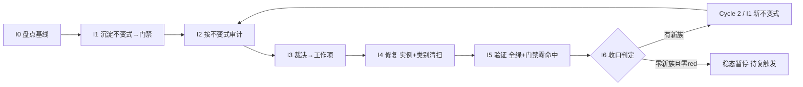

# nop-metadata 不变式驱动的持续审计闭环（nop-metadata Invariant-Driven Continuous Audit Loop）

> **产出方法**：`ai-dev/skills/invariant-loop-audit-prompt.md`（诊断→选型→拟制→共识审查）；待经独立 fresh session 审查至共识。
> **驱动方**：`missions/nop-metadata-invariant-loop.json`（范围：nop-metadata 全模块组 8 子模块 39 实体；授权/commitFormat/Loop Rule 见该 mission description）
> **先例**：nop-chaos-flux 仓库的 docs/backlog/ai-invariant-loop-roadmap.md（首个闭环先例；该路径位于 nop-chaos-flux 仓库，非本仓库路径）
> **与既有线性 roadmap 的关系**：`nop-metadata-audit-remediation-roadmap.md`（MA1-MA7 + MR1-MR8 全 done，v32）为**线性管道**——MG 产出为 lessons 文档。本图为**闭环飞轮**——I6 产出为可执行 CI 门禁。

## 目的

nop-metadata 已被审计 **5 轮 multi+open + ARM MA1-MA7（21 维）+ MR1-MR8**（含 R6.1-R6.6/R7.3/R8.1-R8.4b 子轮），审计体量在 nop-entropy 中仅次于 nop-stream。arm-index 中已出现**显式的"先例链"交叉引用**——审计者自己跟踪"同一族缺陷在不同轮次被沿先例补兄弟"：

- **静默吞异常族（silent-swallow / fail-loud）**：≥7 个兄弟实例横跨多轮——P2-06/07/09（R6.4，AggregationHelper / NopMetaModuleBizModel / NopMetaTagLabelBizModel 3 处）+ P2-01/02/04（R6.5，NopMetaSearchProcessor / AutoClassificationProcessor / MetaQualityCheckpointExecutor 3 处）+ AR-21（R8.4a，AutoClassificationProcessor 再次 + LineageTagPropagation）；
- **Limit 负值校验族**：AR-09（R6.6，`ERR_PAGINATION_LIMIT_INVALID`）→ AR-23④（R8.2，`ERR_SEARCH_LIMIT_INVALID`，审计原文*"沿 AR-09 先例"*——第二个点显式引用第一个为先例）；
- **敏感字面量脱敏族**：R6.2 P2-12（`ARG_RAW_JDBC_URL` 移除）→ R8.2 AR-16（SQL 字面量 → sqlHash，*"与 R6.2 P2-12 脱敏一致"*——跨引用）；
- **DDL / unique-key 静默缺失族**：Lesson 09 记录——36 个 `<unique-key>` 在 `nop-metadata.orm.xml` 中**曾缺** `constraint` 属性，DDL 静默生成零 UNIQUE 约束（系统性遗漏，非个例）；**已由 R3.19（commit `9b769490e`）补齐 36 处**——但 Lesson 09 仅建议手工 grep 检查，**未自动化为 CI 门禁**，下次新增 unique-key 仍可遗漏；
- **虚假关闭族（overclaimed closure）**：arm-index MR7 R7.3 核查发现 R3.14 P2-MA7.6-05（AR-06）声称已修复（commit `9b769490e` 标注 `"MA7.6-05：slaFresh=false"`），但 git 逐行核对**该文件的 commit diff real diff lines = 0**（只有版权头变更）——修复从未落地，需 R7.3 实际补做。

根因 = **"修实例不修类别"**（先例链就是"沿先例补兄弟"的显式表现）+ **反应式测试非穷举** + **MG 产出为 lessons 文档而非 CI 门禁**（Lesson 09 建议"手工 grep `unique-key` 检查 `constraint`"，但未自动化为 check 脚本）。

## Loop Design

每个 Cycle 固定 7 步（同 nop-stream invariant-loop roadmap，此处不重复方法论描述）。

## Work Item Status

> 唯一动态状态区。

| Work Item | 交付范围 | 状态 | 依赖 |
| --- | --- | --- | --- |
| Cycle 1 / I0. 不变式盘点与基线 | 从 5 轮 + ARM 21 维 + MR8 子轮审计提取已知失败模式族 → 不变式目录（`ai-dev/audits/nop-metadata-invariants/invariant-catalog.md`）；确认基线 = 当前零代码不变式门禁；枚举全部 service/processor/bizmodel 方法 + ORM 模型 entity/unique-key 作为审计目标集 | ✅ `done`（plan `2026-08-13-1930-1`，2026-08-13 completed） | — |
| Cycle 1 / I1. 不变式沉淀（首批门禁） | 首批候选族（I0 确认后定稿）：① 静默吞异常门禁——每个 service-tier 方法的 catch 块必须 rethrow 或附加 ErrorCode 到 NopException（`ai-dev/tools/check-silent-swallow.mjs` 静态扫描 + JUnit）；② `<unique-key>` constraint 完备性门禁——`ai-dev/tools/check-orm-unique-key-constraint.mjs` 扫描全部 orm.xml，缺 constraint 即红（Lesson 09 建议自动化）；③ Limit 负值校验门禁——每个接受 limit 参数的 public 方法必须 reject 负值（JUnit 参数化穷举 limit-taking 方法集）；④ 敏感字面量脱敏门禁——error/log message 中不得出现 raw JDBC URL / SQL literal（`check-sensitive-literal-leak.mjs`） | ✅ `done`（plan `2026-08-13-1930-2`，2026-08-13 completed；初始 red list 81 项） | I0 |
| Cycle 1 / I2. 不变式驱动审计 | ① 跑 I1 门禁 → red list；② 对抗探查聚焦盲区（新 processor / 新 bizmodel / 跨模块调用链）；③ 标注已知族或新族 | ✅ `done`（plan `2026-08-13-1930-3`，2026-08-13 completed；正式 red list 81 项 = I1 快照零漂移，对抗探查 5 方向 0 新族） | I1 |
| Cycle 1 / I3. 发现裁决与工作项拟制 | red list 逐条裁决 → P0/P1 派 I4；新族派 Cycle 2 / I1；裁决表零悬挂 | ✅ `done`（plan `2026-08-13-1930-3`，2026-08-13 completed；裁决零悬挂 81/81：80 silent-swallow→P1/I4、1 limit→P1/I4+人工确认、0 新族） | I2 |
| Cycle 1 / I4. 修复执行（实例 + 类别清扫 + 测试） | 强制类别清扫（修任一 processor 的 catch 必 grep 全部 processor 的 catch）+ test-first + 门禁复跑零命中 | ✅ `done`（plan `2026-08-13-1930-4`，2026-08-13 completed；80 silent-swallow 全 formalize，gate exit 0，1081 tests 全绿；Phase 4 limit L1 按超时机制拆 successor plan） | I3 |
| Cycle 1 / I5. 全量验证与门禁零命中 | `./mvnw test -pl nop-metadata -am -T 1C` + 门禁零命中 + full-green 记录 | ✅ `done`（plan `2026-08-13-1930-5`，2026-08-14 completed；4 门禁零命中 + 1086 tests 0 failures + 81→0 棘轮全清） | I4 |
| Cycle 1 / I6. 循环收口与下一轮触发判定 | 统计 + 稳态判定 + 复触发条件登记；closure 独立 fresh session | ✅ `done`（plan `2026-08-13-1930-5`，2026-08-14 completed；稳态暂停 + 候选不变式 watch-only + hard-gate CI 接入 + closure audit 16/16 PASS） | I5 |
| Cycle 2 / 再审计 remediation. 安全攻击面闭环（F1/F2/AR-04） | F1 HAVING 注入回归 + F2 多主机 SSRF 绕过 + AR-04 POJO 脱敏缺口 | ✅ `done`（plan `2026-08-14-0707-1`，2026-08-14 completed；3 confirmed live defect 全收口，对抗性测试钉死） | 再审计 |
| Cycle 2 / 再审计 remediation. 静默错算与契约缺口闭环（AR-01/AR-02/AR-03/F4） | AR-01 SLA 分数截断 + AR-02 SLA NFE 逃逸 + AR-03 内存 group-key 控制字符碰撞 + F4 `selection` 参数契约（显式 no-op） | ✅ `done`（plan `2026-08-14-0707-2`，2026-08-14 completed；4 confirmed live defect/contract drift 全收口，回归/对抗测试钉死，1103 tests 全绿） | 再审计 |
| Cycle 2 / 再审计 remediation. INV-LIMIT 默认 surefire 防御纵深（F3） | F3 残留：移除 `TestLimitNegativeValueInvariant` 的默认 surefire `<excludes>`（陈旧前提已失效——底层 limit 缺陷已修），使其回归默认 surefire，与 CI `invariant-gate` job 形成 defense-in-depth 双重运行 | ✅ `done`（plan `2026-08-14-0707-3`，2026-08-14 completed；排除清理 + 测试 Javadoc/脚本注释/owner-doc 同步双重运行，1106 tests 全绿，Anti-Hollow 验证默认 surefire 实跑 4 tests 0 failures） | 再审计 |
| Cycle 2 / I1. silent-wrong-result 不变式沉淀（门禁入 CI） | 5 子族评估裁定（locale / narrowing-cast / contains-分类 / 分隔符-key / Number→BigDecimal 精度）→ 可执行门禁 `check-silent-wrong-result.mjs`（1 扫描器 × 5 规则 + baseline 对账 + 放行注释）+ 初始 red list 快照（`initial-red-list-cycle2.md` + `baseline-cycle2/`）+ 聚合入口 4→5 门禁 CI 棘轮扩展 | ✅ `done`（plan `2026-08-15-0820-1`，2026-08-15 completed；5/5 子族裁定静态扫描可机械化 + 2 watch-only 候选维持；快照 67 命中/61 键（40/0/19/6/2）；模式 b 接入聚合入口与 CI；closure audit approved 0 Blocker/0 Major） | Cycle 2 再审计 |
| Cycle 2 / I2+I3（invariant-loop）. 不变式驱动审计与裁决 | gate 5 正式运行 → 正式 red list（`formal-red-list-cycle2`，与 I1' 快照漂移核对）+ 对抗探查（watch-only 族专属方向 + 候选清单全覆盖）+ 零悬挂裁决（`adjudication-table-cycle2`：P1/FP/优化候选重裁/新族四态） | ✅ `done`（plan `2026-08-15-0820-2`，2026-08-15 completed；正式 red list 67 命中零漂移；对抗探查 10 方向 0 新族；裁决 67 = 46 P1 + 21 FP + 0 维持 + 0 新族，优化候选旧裁定 2 条推翻转 P1；FP 标注方式 (a) baseline 驻留） | I1' |
| Cycle 2 / I4+I5+I6（invariant-loop）. 修复执行 + 全量验证 + 循环收口 | P1 类别清扫修复（test-first + 权威分母核对）+ FP 处置落地 + 门禁终态（baseline 重写为已批准豁免清单）+ 棘轮记录 + Cycle 2 统计/稳态判定/复触发登记/独立 closure audit | ✅ `done`（plan `2026-08-15-0820-3`，2026-08-15 completed；46/46 P1 修复（locale 40 Locale.ROOT 含 2 安全缺陷、C8 exact-match、D1/D5/D6 结构性键、E1/E2 AR-10 路由）+ 31 例新增测试（10 断言修复前红实证 + tr-TR GraphQL e2e）；1207 tests 0 failures；baseline 终态 21 FP 命中/16 键豁免清单（保持模式 b）+ hard-gate 注入 proof；棘轮 67 = 修复 46 + 驻留 21 + successor 0；稳态暂停（0 新族），复触发条件已核对） | I2'+I3' |

## Phase Details

### I0 — 不变式盘点与基线（仅 Cycle 1）

不变式目录 `ai-dev/audits/nop-metadata-invariants/invariant-catalog.md`：每条含「陈述 / 覆盖失败族 / 历史 audit-finding-ID 证据 / 检测方法」。审计目标集 = nop-metadata 全部 service/processor/bizmodel 方法 + 39 实体的 ORM 模型声明。

### I1 — 不变式沉淀

落地形式：① JUnit 5 `@ParameterizedTest`（方法表驱动）+ 表完备性门禁；② `ai-dev/tools/check-*.mjs` 静态扫描器（ORM 模型完整性、敏感字面量脱敏）；③ ArchUnit 规则（service 层 catch 行为约束）。全部入 CI。

### I2–I6

同 nop-stream invariant-loop roadmap 的 I2–I6 方法论步骤（门禁审计 → 对抗探查 → 裁决 → 类别清扫修复 → 全量验证 → 收口稳态判定），审计目标集换为 nop-metadata 的 processor/bizmodel/ORM 模型面：

- **I2 审计目标**：跑 I1 四族门禁跨全部 service/processor/bizmodel 方法 + ORM 模型 → red list；对抗探查聚焦新 processor / 新 bizmodel / 跨模块调用链的 catch 吞异常与 limit 校验盲区。
- **I4 类别清扫面**：修任一 processor 的 catch 必 grep 全部 processor 的 catch；修任一 unique-key 的 constraint 必核对全部 ORM entity 的 unique-key；修任一 limit 入口必穷举全部 limit-taking public 方法。
- **I5 验证**：`./mvnw test -pl nop-metadata -am -T 1C` + 四族门禁零命中 + full-green 记录。
- **I6 收口**：统计门禁数/red list/新族数；稳态判定 + 复触发条件登记（CI 变红 / 新增 processor 或 bizmodel / 周期复探）；closure 独立 fresh session。

## Dependency Graph

## Loop Rule

同 nop-stream invariant-loop roadmap 的 Loop Rule，范围换为 nop-metadata，结构变更触发条件换为"新增/重命名 processor / bizmodel / ORM entity"。

## Cross-Cutting

- **授权**：P0/P1 自动修复预授权；ORM/API 模型变更执行前人工确认（改源模型 `*.orm.xml` / `*.api.xml` 而非改 `_gen/` 生成产物）；新门禁入 CI 需 committed 回归测试。
- **范围独立**：本图专注 nop-metadata 不变式沉淀与防回退，与 `nop-metadata-audit-remediation-roadmap.md`（已完成线性审计-修复）范围不重叠。

## Follow-up Backlog

> 来源：2026-08-14 不变式闭环再审计（multi + open）。P2 项不入独立 remediation plan，仅登记待后续清扫。每项标注源审计路径以保持可追溯。

### 安全硬化族
- **F5** `jdbcUrl` 危险参数 blocklist 缺类加载参数（`socketFactory`/`statementInterceptors`/PG `sslFactory`/`options=`）。源：`ai-dev/audits/2026-08-14-0707-multi-audit-nop-metadata-invariant-loop.md`（F5） — ✅ Fixed（plan `2026-08-14-1133-1` Phase 1：`DANGEROUS_URL_TOKENS` 补 5 token + 对抗测试）
- **F6** `redactJdbcUrl` 对含 `@` 的口令截断不全。源：同上（F6） — ✅ Fixed（plan `2026-08-14-1133-1` Phase 1：`lastIndexOf('@')` 定位 + 对抗测试）
- **F7** 空/畸形主机 fail-open（`jdbc:mysql:///db` / `jdbc:mysql://:3306/db`）。源：同上（F7） — ✅ Fixed（plan `2026-08-14-1133-1` Phase 2：`isPlausibleHostShape` 形状校验 enforced fail-closed + 对抗测试）
- **F8** `isInternalIpv6Literal` 触发 DNS（违反"不触发 DNS"类契约）。源：同上（F8） — ✅ Fixed（plan `2026-08-14-1133-1` Phase 2：charset 前置过滤 + 对抗测试）
- **F9** `custom_sql` blocklist 缺 PG `DO`/`WITH`(CTE)/`PG_CATALOG`/`PG_SLEEP`。源：同上（F9） — ✅ Fixed（plan `2026-08-14-1133-1` Phase 3：补 5 关键字 + DRY 裁定 + WITH tradeoff 记录 + 对抗测试）

### ORM 模型族（性能/卫生）
- **F10** `NopMetaModelChangedEvent` 缺 `entityId` 审计日志索引。源：同上（F10） — ✅ Fixed（plan `2026-08-14-1448-3`：`IX_NOP_META_EVENT_TYPE_TIME` 列清单扩展为 `(entityType, entityId, changeTime)`）
- **F11** 四个软外键列未建索引（`sourceModuleId`/`baseEntityId`/`entityFieldId`×2）。源：同上（F11） — ✅ Fixed（plan `2026-08-14-1448-3`：新增 `IX_NOP_META_DOMAIN_SOURCE_MODULE` / `IX_NOP_META_TABLE_BASE_ENTITY` / `IX_NOP_META_DIM_ENTITY_FIELD` / `IX_NOP_META_MEASURE_ENTITY_FIELD`）
- **F12** `NopMetaQualityResult.runId` 不在任何索引前导列。源：同上（F12） — ✅ Fixed（plan `2026-08-14-1448-3`：新增 `IX_NOP_META_QRESULT_RUN(runId, executeTime)`）
- **F13** `meta/quality-trend-direction` dict 缺兄弟 dict 的"retained for Java constants"注释。源：同上（F13） — ⚠️ False positive（plan `2026-08-14-1448-3` 范围裁定：`nop-metadata.orm.xml:104-105` 注释已同时覆盖 `checkpoint-action-type` 与 `quality-trend-direction`，注释早已存在，无需修复）

### API/文档/代码卫生族
- **F14** `KeyValueDTO` 死 DTO（零生产引用）。源：同上（F14） — ✅ Fixed（plan `2026-08-14-1448-1`：删除 KeyValueDTO.java + 测试引用，全仓 `rg -n KeyValueDTO` 零残留）
- **F15** owner-doc IBiz 方法表对 5 个接口不够精确。源：同上（F15） — ✅ Fixed（plan `2026-08-14-1448-1`：5 接口展开为显式方法名，与 live `INopMeta*Biz` 接口逐一核对）
- **F16** 死代码 `NopMetaQualityRuleBizModel.resolveDataSourceOrThrow`。源：同上（F16） — ✅ Fixed（plan `2026-08-14-1448-1`：删除死方法 + 同步 MetaDataSourceResolver javadoc 真值表述，MetaTableReferenceResolver 同名方法保留）
- **F17** `safeProductName` 重复 7×（含 1 死实例）。源：同上（F17） — ✅ Fixed（plan `2026-08-14-1448-2`：5 活副本 + 1 死副本删除，调用点全部改走 `AggregationHelper.safeProductName` 规范入口（static import 接线），全仓 `rg "private static String safeProductName"` 零命中）
- **F18** 空壳测试 `TestNopMetaDtoResults.testDtoJsonRoundTripAllTypes`。源：同上（F18） — ✅ Fixed（plan `2026-08-14-1448-1`：6 DTO 改为真实 round-trip，stringify→parseBeanFromText→断言关键字段，命名与行为一致）
- **F19** `TestAllEntitiesHaveBizModels` 用硬编码实体清单（守卫可被绕过）。源：同上（F19） — ✅ Fixed（plan `2026-08-14-1448-1`：硬编码 list 改为 ORM 注册表动态发现（IOrmTemplate.getEntityModels + 包过滤 + `_gen` 基类过滤）+ ≥39 sanity 断言）

### 静默错算/精度族（建议下轮 Cycle 2 / I1 评估"silent-wrong-result"不变式）

- **AR-05** Profiler `isNumericType` 子串匹配误分类几何/布尔列。源：`ai-dev/audits/2026-08-14-0707-open-audit-nop-metadata-invariant-loop.md`（AR-05） — ✅ Fixed（plan `2026-08-14-1133-2` Phase 1：`NUMERIC_TYPE_NAMES` exact-match `Set.of` 替代 substring contains；移除 BOOLEAN/BIT；`TestMetaTableProfilerClassification` 9 例）
- **AR-06** Profiler `probeNumeric` 把连接/权限失败塌缩为"string stats"（MA6.2-002 同族新 site）。源：同上（AR-06） — ✅ Fixed（plan `2026-08-14-1133-2` Phase 2：`isInfrastructureFailure` 区分 infra(08*/28*/42*+消息线索→WARN) 与类型不匹配(→DEBUG)，仍 return false；`TestMetaTableProfilerProbeNumeric` 5 例含 08006 代理 WARN 断言）
- **AR-10** `toBigDecimal` 对 Long>2^53 丢精度 + String 数值静默跳过。源：同上（AR-10） — ✅ Fixed（plan `2026-08-14-1133-2` Phase 3：整数 longValue 无损 / 浮点 doubleValue / String 解析；`TestCrossDbInMemoryAggregationProcessor` +7 例含 SumAcc 精度+String 接线）

### lineage/manifest 正确性族
- **AR-07** `SqlSourceTableExtractor` 按 simple name 去重 → 跨 schema 同名表塌缩。源：同上（AR-07） — ✅ Fixed（plan `2026-08-14-1133-3` Phase 1：去重 key 由 `simple` 改为 `full`（schema-qualified 名）；`TestSqlSourceTableExtractor` 4 例跨 schema 去重）
- **AR-08** `SqlSourceTableExtractor` 把 CTE 名报为物理源表（误报）。源：同上（AR-08） — ✅ Fixed（plan `2026-08-14-1133-3` Phase 1：`collectCteNames` 预遍历收集 CTE 名并排除；`TestSqlSourceTableExtractor` 9 例 CTE 排除含遮蔽/大小写不敏感）
- **AR-09** `MetaManifestBuilder.addEdge` 无去重 → 重复关系产重复图边。源：同上（AR-09） — ✅ Fixed（plan `2026-08-14-1133-3` Phase 2：`addEdge` 去重 + 自环过滤，childMap 统一经 `addEdge`；`TestMetaManifestBuilder` 4 例含 parentMap/childMap 双向验证）

### reconciliation / 方言 / 诊断 / 死码族
- **AR-11** `SqlViewFieldTypeInferrer` 未剥尾 `;` → 误导型推断失败。源：同上（AR-11） — ✅ Fixed（plan `2026-08-14-1133-3` Phase 3：包装前 `trim()` + `while` 循环剥尾分号；H2 实跑 2 例）
- **AR-12** `LocalReconciliationProcessor.score` 默认 locale `toLowerCase`（Turkish-I 风险）。源：同上（AR-12） — ✅ Fixed（plan `2026-08-14-1133-3` Phase 3：`toLowerCase(Locale.ROOT)`；`TestLocalReconciliationProcessorLocale` 3 例含 tr-TR locale 验证）
- **AR-13** `ReconciliationExecutor.execute` 忽略 candidate `limit` → 无界序列化。源：同上（AR-13） — ✅ Fixed（plan `2026-08-14-1133-3` Phase 3：传入 `DEFAULT_CANDIDATE_LIMIT=50`（非 null）；`TestReconciliationExecutorLimit` 3 例含大候选池有界验证）
- **AR-14** 死码/诊断退化批次（`MetaAggregationExecutor` 死 LOG、`resolveEntityFieldColumn` 死参、`safeProductName` null→误归因、`SqlSelectFieldExtractor` 错误 param、`MetaManifestBuilder` 脆弱 `SimpleDateFormat`）。源：同上（AR-14） — ✅ Fixed（plan `2026-08-14-1448-2`：死 LOG 删除；`propToCol` 死参移除（Map 本体保留）；safeProductName SQLException → infra fail-loud（新 `ERR_AGGR_DB_PRODUCT_NAME_FAILED`，不再误归因 unsupported-dialect）；`resolveProjections` 增 `sql` 形参、错误 param 为真实 SQL 文本；`SimpleDateFormat` → 不可变 `DateTimeFormatter`（UTC）输出等价）

### Cycle 2 / I2' 对抗探查观察（watch-only，非缺陷）
- **OBS-01** `MetaTableProfiler.toLong:548` latent-form（`s == null ? 0L : Long.parseLong(s.trim())` 的 null→0 伪造形态 + parseLong 裸 NFE 逃逸形态；调用面 `queryLong` 5 个调用点全为 COUNT 族 → 两风险路径当前均不可达）。源：`ai-dev/audits/nop-metadata-invariants/adversarial-probing-notes-cycle2.md`（方向 6） — ⚠️ watch-only（Why Not Blocking：COUNT 语义下结果恒非 null 恒整数，无 live 缺陷；约束条件 = `queryLong` 接入可空/非整数聚合（SUM/MIN/MAX）前必须先 ErrorCode 化该回退路径）
