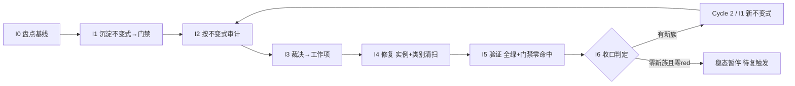

# nop-metadata 不变式驱动的持续审计闭环（nop-metadata Invariant-Driven Continuous Audit Loop）

> **产出方法**：`ai-dev/skills/invariant-loop-audit-prompt.md`（诊断→选型→拟制→共识审查）；待经独立 fresh session 审查至共识。
> **驱动方**：`missions/nop-metadata-invariant-loop.json`（范围：nop-metadata 全模块组 8 子模块 39 实体；授权/commitFormat/Loop Rule 见该 mission description）
> **先例**：nop-chaos-flux 仓库的 docs/backlog/ai-invariant-loop-roadmap.md（首个闭环先例；该路径位于 nop-chaos-flux 仓库，非本仓库路径）
> **与既有线性 roadmap 的关系**：`nop-metadata-audit-remediation-roadmap.md`（MA1-MA7 + MR1-MR8 全 done，v32）为**线性管道**——MG 产出为 lessons 文档。本图为**闭环飞轮**——I6 产出为可执行 CI 门禁。

## 目的

nop-metadata 已被审计 **5 轮 multi+open + ARM MA1-MA7（21 维）+ MR1-MR8**（含 R6.1-R6.6/R7.3/R8.1-R8.4b 子轮），审计体量在 nop-entropy 中仅次于 nop-stream。arm-index 中已出现**显式的"先例链"交叉引用**——审计者自己跟踪"同一族缺陷在不同轮次被沿先例补兄弟"：

- **静默吞异常族（silent-swallow / fail-loud）**：≥7 个兄弟实例横跨多轮——P2-06/07/09（R6.4，AggregationHelper / NopMetaModuleBizModel / NopMetaTagLabelBizModel 3 处）+ P2-01/02/04（R6.5，NopMetaSearchProcessor / AutoClassificationProcessor / MetaQualityCheckpointExecutor 3 处）+ AR-21（R8.4a，AutoClassificationProcessor 再次 + LineageTagPropagation）；
- **Limit 负值校验族**：AR-09（R6.6，`ERR_PAGINATION_LIMIT_INVALID`）→ AR-23④（R8.2，`ERR_SEARCH_LIMIT_INVALID`，审计原文*"沿 AR-09 先例"*——第二个点显式引用第一个为先例）；
- **敏感字面量脱敏族**：R6.2 P2-12（`ARG_RAW_JDBC_URL` 移除）→ R8.2 AR-16（SQL 字面量 → sqlHash，*"与 R6.2 P2-12 脱敏一致"*——跨引用）；
- **DDL / unique-key 静默缺失族**：Lesson 09 记录——36 个 `<unique-key>` 在 `nop-metadata.orm.xml` 中**曾缺** `constraint` 属性，DDL 静默生成零 UNIQUE 约束（系统性遗漏，非个例）；**已由 R3.19（commit `9b769490e`）补齐 36 处**——但 Lesson 09 仅建议手工 grep 检查，**未自动化为 CI 门禁**，下次新增 unique-key 仍可遗漏；
- **虚假关闭族（overclaimed closure）**：arm-index MR7 R7.3 核查发现 R3.14 P2-MA7.6-05（AR-06）声称已修复（commit `9b769490e` 标注 `"MA7.6-05：slaFresh=false"`），但 git 逐行核对**该文件的 commit diff real diff lines = 0**（只有版权头变更）——修复从未落地，需 R7.3 实际补做。

根因 = **"修实例不修类别"**（先例链就是"沿先例补兄弟"的显式表现）+ **反应式测试非穷举** + **MG 产出为 lessons 文档而非 CI 门禁**（Lesson 09 建议"手工 grep `unique-key` 检查 `constraint`"，但未自动化为 check 脚本）。

## Loop Design

每个 Cycle 固定 7 步（同 nop-stream invariant-loop roadmap，此处不重复方法论描述）。

## Work Item Status

> 唯一动态状态区。

| Work Item | 交付范围 | 状态 | 依赖 |
| --- | --- | --- | --- |
| Cycle 1 / I0. 不变式盘点与基线 | 从 5 轮 + ARM 21 维 + MR8 子轮审计提取已知失败模式族 → 不变式目录（`ai-dev/audits/nop-metadata-invariants/invariant-catalog.md`）；确认基线 = 当前零代码不变式门禁；枚举全部 service/processor/bizmodel 方法 + ORM 模型 entity/unique-key 作为审计目标集 | ✅ `done`（plan `2026-08-13-1930-1`，2026-08-13 completed） | — |
| Cycle 1 / I1. 不变式沉淀（首批门禁） | 首批候选族（I0 确认后定稿）：① 静默吞异常门禁——每个 service-tier 方法的 catch 块必须 rethrow 或附加 ErrorCode 到 NopException（`ai-dev/tools/check-silent-swallow.mjs` 静态扫描 + JUnit）；② `<unique-key>` constraint 完备性门禁——`ai-dev/tools/check-orm-unique-key-constraint.mjs` 扫描全部 orm.xml，缺 constraint 即红（Lesson 09 建议自动化）；③ Limit 负值校验门禁——每个接受 limit 参数的 public 方法必须 reject 负值（JUnit 参数化穷举 limit-taking 方法集）；④ 敏感字面量脱敏门禁——error/log message 中不得出现 raw JDBC URL / SQL literal（`check-sensitive-literal-leak.mjs`） | ✅ `done`（plan `2026-08-13-1930-2`，2026-08-13 completed；初始 red list 81 项） | I0 |
| Cycle 1 / I2. 不变式驱动审计 | ① 跑 I1 门禁 → red list；② 对抗探查聚焦盲区（新 processor / 新 bizmodel / 跨模块调用链）；③ 标注已知族或新族 | ✅ `done`（plan `2026-08-13-1930-3`，2026-08-13 completed；正式 red list 81 项 = I1 快照零漂移，对抗探查 5 方向 0 新族） | I1 |
| Cycle 1 / I3. 发现裁决与工作项拟制 | red list 逐条裁决 → P0/P1 派 I4；新族派 Cycle 2 / I1；裁决表零悬挂 | ✅ `done`（plan `2026-08-13-1930-3`，2026-08-13 completed；裁决零悬挂 81/81：80 silent-swallow→P1/I4、1 limit→P1/I4+人工确认、0 新族） | I2 |
| Cycle 1 / I4. 修复执行（实例 + 类别清扫 + 测试） | 强制类别清扫（修任一 processor 的 catch 必 grep 全部 processor 的 catch）+ test-first + 门禁复跑零命中 | ✅ `done`（plan `2026-08-13-1930-4`，2026-08-13 completed；80 silent-swallow 全 formalize，gate exit 0，1081 tests 全绿；Phase 4 limit L1 按超时机制拆 successor plan） | I3 |
| Cycle 1 / I5. 全量验证与门禁零命中 | `./mvnw test -pl nop-metadata -am -T 1C` + 门禁零命中 + full-green 记录 | ✅ `done`（plan `2026-08-13-1930-5`，2026-08-14 completed；4 门禁零命中 + 1086 tests 0 failures + 81→0 棘轮全清） | I4 |
| Cycle 1 / I6. 循环收口与下一轮触发判定 | 统计 + 稳态判定 + 复触发条件登记；closure 独立 fresh session | ✅ `done`（plan `2026-08-13-1930-5`，2026-08-14 completed；稳态暂停 + 候选不变式 watch-only + hard-gate CI 接入 + closure audit 16/16 PASS） | I5 |
| Cycle 2 / 再审计 remediation. 安全攻击面闭环（F1/F2/AR-04） | F1 HAVING 注入回归 + F2 多主机 SSRF 绕过 + AR-04 POJO 脱敏缺口 | ✅ `done`（plan `2026-08-14-0707-1`，2026-08-14 completed；3 confirmed live defect 全收口，对抗性测试钉死） | 再审计 |
| Cycle 2 / 再审计 remediation. 静默错算与契约缺口闭环（AR-01/AR-02/AR-03/F4） | AR-01 SLA 分数截断 + AR-02 SLA NFE 逃逸 + AR-03 内存 group-key 控制字符碰撞 + F4 `selection` 参数契约（显式 no-op） | ✅ `done`（plan `2026-08-14-0707-2`，2026-08-14 completed；4 confirmed live defect/contract drift 全收口，回归/对抗测试钉死，1103 tests 全绿） | 再审计 |
| Cycle 2 / 再审计 remediation. INV-LIMIT 默认 surefire 防御纵深（F3） | F3 残留：移除 `TestLimitNegativeValueInvariant` 的默认 surefire `<excludes>`（陈旧前提已失效——底层 limit 缺陷已修），使其回归默认 surefire，与 CI `invariant-gate` job 形成 defense-in-depth 双重运行 | ✅ `done`（plan `2026-08-14-0707-3`，2026-08-14 completed；排除清理 + 测试 Javadoc/脚本注释/owner-doc 同步双重运行，1106 tests 全绿，Anti-Hollow 验证默认 surefire 实跑 4 tests 0 failures） | 再审计 |
| Cycle 2 / I1. silent-wrong-result 不变式沉淀（门禁入 CI） | 5 子族评估裁定（locale / narrowing-cast / contains-分类 / 分隔符-key / Number→BigDecimal 精度）→ 可执行门禁 `check-silent-wrong-result.mjs`（1 扫描器 × 5 规则 + baseline 对账 + 放行注释）+ 初始 red list 快照（`initial-red-list-cycle2.md` + `baseline-cycle2/`）+ 聚合入口 4→5 门禁 CI 棘轮扩展 | ✅ `done`（plan `2026-08-15-0820-1`，2026-08-15 completed；5/5 子族裁定静态扫描可机械化 + 2 watch-only 候选维持；快照 67 命中/61 键（40/0/19/6/2）；模式 b 接入聚合入口与 CI；closure audit approved 0 Blocker/0 Major） | Cycle 2 再审计 |
| Cycle 2 / I2+I3（invariant-loop）. 不变式驱动审计与裁决 | gate 5 正式运行 → 正式 red list（`formal-red-list-cycle2`，与 I1' 快照漂移核对）+ 对抗探查（watch-only 族专属方向 + 候选清单全覆盖）+ 零悬挂裁决（`adjudication-table-cycle2`：P1/FP/优化候选重裁/新族四态） | ✅ `done`（plan `2026-08-15-0820-2`，2026-08-15 completed；正式 red list 67 命中零漂移；对抗探查 10 方向 0 新族；裁决 67 = 46 P1 + 21 FP + 0 维持 + 0 新族，优化候选旧裁定 2 条推翻转 P1；FP 标注方式 (a) baseline 驻留） | I1' |
| Cycle 2 / I4+I5+I6（invariant-loop）. 修复执行 + 全量验证 + 循环收口 | P1 类别清扫修复（test-first + 权威分母核对）+ FP 处置落地 + 门禁终态（baseline 重写为已批准豁免清单）+ 棘轮记录 + Cycle 2 统计/稳态判定/复触发登记/独立 closure audit | ✅ `done`（plan `2026-08-15-0820-3`，2026-08-15 completed；46/46 P1 修复（locale 40 Locale.ROOT 含 2 安全缺陷、C8 exact-match、D1/D5/D6 结构性键、E1/E2 AR-10 路由）+ 31 例新增测试（10 断言修复前红实证 + tr-TR GraphQL e2e）；1207 tests 0 failures；baseline 终态 21 FP 命中/16 键豁免清单（保持模式 b）+ hard-gate 注入 proof；棘轮 67 = 修复 46 + 驻留 21 + successor 0；稳态暂停（0 新族），复触发条件已核对） | I2'+I3' |
| Cycle 3 / 再审计 remediation. SSRF 主机提取 + sql 日志脱敏（P0 + P1-8） | F2 双绕过向量（MySQL hostless 属性组隐式 localhost + PG query `host=` 覆盖）fail-closed + 4 实机向量回归 + sql 路径 8 处 INFO sqlHash 化 | ✅ `done`（plan `2026-08-15-1913-1`，2026-08-15 completed；hostless 哨兵+validateJdbcUrl 集中抛出 + query host=/hostaddr= 提取校验（pgjdbc 语义：percent-decode/大小写不敏感/多值逐校验）；对抗回归 +4 例（4 实机向量+9 变体+3 不误伤）；sql 路径 11 处 INFO sqlHash 化（8 确认+2 profiler 同源+1 形态统一，rg 门禁零命中）+ `TestSqlPathLogRedaction` 双入口；1211 tests 0 failures；closure audit approved 12/12） | 2026-08-15 multi-audit |
| Cycle 3 / 再审计 remediation. API 写路径与契约语义（P1-1/3/4/5/2） | connectionConfig 受控写路径恢复 + lineage sourceTables 契约修正 + DataProduct linkAsset 聚合根校验与属主管线 + owner 文档 I*Biz 清单补齐 | ✅ `done`（plan `2026-08-15-1913-2`，2026-08-16 completed；5 P1 全收口：connectionConfig insertable/updatable 恢复 + add 表单 + save→testConnection 端到端、sourceTables 三路径 resolved 填充（指标级=宿主表裁定）、linkAsset/unlinkAsset requireEntity + TagLabel 属主 save 管线（接线验证 approveStatus=SUBMITTED）、14 接口零漂移；12 新测试 + closure audit approved 11/11） | 2026-08-15 multi-audit |
| Cycle 3 / 再审计 remediation. 错误码参数与守卫测试（P1-6/7/9） | 11 处识别性参数补齐 + 方言门禁键错配修正 + INV-LIMIT 假绿行修复 + INV-ERROR-PARAM 门禁沉淀 | ✅ `done`（plan `2026-08-15-1913-3`，2026-08-16 completed；P1-6/P1-7/P1-9 全收口：11 活点 + 1 清扫增量 + 3 变量形态缺参点三轨修复（5 个定点新错误码，零占位符削除）、requireSupportedProductName 键改 ARG_DATASOURCE_TYPE（方案 A）、INV-LIMIT 4 行全钉精确错误码 + 变异验证；INV-ERROR-PARAM 零命中 hard-gate 入 6-guard 聚合链 + catalog + owner doc；7 新测试 + closure audit approved 13/13） | 2026-08-15 multi-audit |

## Phase Details

### I0 — 不变式盘点与基线（仅 Cycle 1）

不变式目录 `ai-dev/audits/nop-metadata-invariants/invariant-catalog.md`：每条含「陈述 / 覆盖失败族 / 历史 audit-finding-ID 证据 / 检测方法」。审计目标集 = nop-metadata 全部 service/processor/bizmodel 方法 + 39 实体的 ORM 模型声明。

### I1 — 不变式沉淀

落地形式：① JUnit 5 `@ParameterizedTest`（方法表驱动）+ 表完备性门禁；② `ai-dev/tools/check-*.mjs` 静态扫描器（ORM 模型完整性、敏感字面量脱敏）；③ ArchUnit 规则（service 层 catch 行为约束）。全部入 CI。

### I2–I6

同 nop-stream invariant-loop roadmap 的 I2–I6 方法论步骤（门禁审计 → 对抗探查 → 裁决 → 类别清扫修复 → 全量验证 → 收口稳态判定），审计目标集换为 nop-metadata 的 processor/bizmodel/ORM 模型面：

- **I2 审计目标**：跑 I1 四族门禁跨全部 service/processor/bizmodel 方法 + ORM 模型 → red list；对抗探查聚焦新 processor / 新 bizmodel / 跨模块调用链的 catch 吞异常与 limit 校验盲区。
- **I4 类别清扫面**：修任一 processor 的 catch 必 grep 全部 processor 的 catch；修任一 unique-key 的 constraint 必核对全部 ORM entity 的 unique-key；修任一 limit 入口必穷举全部 limit-taking public 方法。
- **I5 验证**：`./mvnw test -pl nop-metadata -am -T 1C` + 四族门禁零命中 + full-green 记录。
- **I6 收口**：统计门禁数/red list/新族数；稳态判定 + 复触发条件登记（CI 变红 / 新增 processor 或 bizmodel / 周期复探）；closure 独立 fresh session。

## Dependency Graph

## Loop Rule

同 nop-stream invariant-loop roadmap 的 Loop Rule，范围换为 nop-metadata，结构变更触发条件换为"新增/重命名 processor / bizmodel / ORM entity"。

## Cross-Cutting

- **授权**：P0/P1 自动修复预授权；ORM/API 模型变更执行前人工确认（改源模型 `*.orm.xml` / `*.api.xml` 而非改 `_gen/` 生成产物）；新门禁入 CI 需 committed 回归测试。
- **范围独立**：本图专注 nop-metadata 不变式沉淀与防回退，与 `nop-metadata-audit-remediation-roadmap.md`（已完成线性审计-修复）范围不重叠。

## Follow-up Backlog

> 来源：2026-08-14 不变式闭环再审计（multi + open）。P2 项不入独立 remediation plan，仅登记待后续清扫。每项标注源审计路径以保持可追溯。

### 安全硬化族
- **F5** `jdbcUrl` 危险参数 blocklist 缺类加载参数（`socketFactory`/`statementInterceptors`/PG `sslFactory`/`options=`）。源：`ai-dev/audits/2026-08-14-0707-multi-audit-nop-metadata-invariant-loop.md`（F5） — ✅ Fixed（plan `2026-08-14-1133-1` Phase 1：`DANGEROUS_URL_TOKENS` 补 5 token + 对抗测试）
- **F6** `redactJdbcUrl` 对含 `@` 的口令截断不全。源：同上（F6） — ✅ Fixed（plan `2026-08-14-1133-1` Phase 1：`lastIndexOf('@')` 定位 + 对抗测试）
- **F7** 空/畸形主机 fail-open（`jdbc:mysql:///db` / `jdbc:mysql://:3306/db`）。源：同上（F7） — ✅ Fixed（plan `2026-08-14-1133-1` Phase 2：`isPlausibleHostShape` 形状校验 enforced fail-closed + 对抗测试）
- **F8** `isInternalIpv6Literal` 触发 DNS（违反"不触发 DNS"类契约）。源：同上（F8） — ✅ Fixed（plan `2026-08-14-1133-1` Phase 2：charset 前置过滤 + 对抗测试）
- **F9** `custom_sql` blocklist 缺 PG `DO`/`WITH`(CTE)/`PG_CATALOG`/`PG_SLEEP`。源：同上（F9） — ✅ Fixed（plan `2026-08-14-1133-1` Phase 3：补 5 关键字 + DRY 裁定 + WITH tradeoff 记录 + 对抗测试）

### ORM 模型族（性能/卫生）
- **F10** `NopMetaModelChangedEvent` 缺 `entityId` 审计日志索引。源：同上（F10） — ✅ Fixed（plan `2026-08-14-1448-3`：`IX_NOP_META_EVENT_TYPE_TIME` 列清单扩展为 `(entityType, entityId, changeTime)`）
- **F11** 四个软外键列未建索引（`sourceModuleId`/`baseEntityId`/`entityFieldId`×2）。源：同上（F11） — ✅ Fixed（plan `2026-08-14-1448-3`：新增 `IX_NOP_META_DOMAIN_SOURCE_MODULE` / `IX_NOP_META_TABLE_BASE_ENTITY` / `IX_NOP_META_DIM_ENTITY_FIELD` / `IX_NOP_META_MEASURE_ENTITY_FIELD`）
- **F12** `NopMetaQualityResult.runId` 不在任何索引前导列。源：同上（F12） — ✅ Fixed（plan `2026-08-14-1448-3`：新增 `IX_NOP_META_QRESULT_RUN(runId, executeTime)`）
- **F13** `meta/quality-trend-direction` dict 缺兄弟 dict 的"retained for Java constants"注释。源：同上（F13） — ⚠️ False positive（plan `2026-08-14-1448-3` 范围裁定：`nop-metadata.orm.xml:104-105` 注释已同时覆盖 `checkpoint-action-type` 与 `quality-trend-direction`，注释早已存在，无需修复）

### API/文档/代码卫生族
- **F14** `KeyValueDTO` 死 DTO（零生产引用）。源：同上（F14） — ✅ Fixed（plan `2026-08-14-1448-1`：删除 KeyValueDTO.java + 测试引用，全仓 `rg -n KeyValueDTO` 零残留）
- **F15** owner-doc IBiz 方法表对 5 个接口不够精确。源：同上（F15） — ✅ Fixed（plan `2026-08-14-1448-1`：5 接口展开为显式方法名，与 live `INopMeta*Biz` 接口逐一核对）
- **F16** 死代码 `NopMetaQualityRuleBizModel.resolveDataSourceOrThrow`。源：同上（F16） — ✅ Fixed（plan `2026-08-14-1448-1`：删除死方法 + 同步 MetaDataSourceResolver javadoc 真值表述，MetaTableReferenceResolver 同名方法保留）
- **F17** `safeProductName` 重复 7×（含 1 死实例）。源：同上（F17） — ✅ Fixed（plan `2026-08-14-1448-2`：5 活副本 + 1 死副本删除，调用点全部改走 `AggregationHelper.safeProductName` 规范入口（static import 接线），全仓 `rg "private static String safeProductName"` 零命中）
- **F18** 空壳测试 `TestNopMetaDtoResults.testDtoJsonRoundTripAllTypes`。源：同上（F18） — ✅ Fixed（plan `2026-08-14-1448-1`：6 DTO 改为真实 round-trip，stringify→parseBeanFromText→断言关键字段，命名与行为一致）
- **F19** `TestAllEntitiesHaveBizModels` 用硬编码实体清单（守卫可被绕过）。源：同上（F19） — ✅ Fixed（plan `2026-08-14-1448-1`：硬编码 list 改为 ORM 注册表动态发现（IOrmTemplate.getEntityModels + 包过滤 + `_gen` 基类过滤）+ ≥39 sanity 断言）

### 静默错算/精度族（建议下轮 Cycle 2 / I1 评估"silent-wrong-result"不变式）

- **AR-05** Profiler `isNumericType` 子串匹配误分类几何/布尔列。源：`ai-dev/audits/2026-08-14-0707-open-audit-nop-metadata-invariant-loop.md`（AR-05） — ✅ Fixed（plan `2026-08-14-1133-2` Phase 1：`NUMERIC_TYPE_NAMES` exact-match `Set.of` 替代 substring contains；移除 BOOLEAN/BIT；`TestMetaTableProfilerClassification` 9 例）
- **AR-06** Profiler `probeNumeric` 把连接/权限失败塌缩为"string stats"（MA6.2-002 同族新 site）。源：同上（AR-06） — ✅ Fixed（plan `2026-08-14-1133-2` Phase 2：`isInfrastructureFailure` 区分 infra(08*/28*/42*+消息线索→WARN) 与类型不匹配(→DEBUG)，仍 return false；`TestMetaTableProfilerProbeNumeric` 5 例含 08006 代理 WARN 断言）
- **AR-10** `toBigDecimal` 对 Long>2^53 丢精度 + String 数值静默跳过。源：同上（AR-10） — ✅ Fixed（plan `2026-08-14-1133-2` Phase 3：整数 longValue 无损 / 浮点 doubleValue / String 解析；`TestCrossDbInMemoryAggregationProcessor` +7 例含 SumAcc 精度+String 接线）

### lineage/manifest 正确性族
- **AR-07** `SqlSourceTableExtractor` 按 simple name 去重 → 跨 schema 同名表塌缩。源：同上（AR-07） — ✅ Fixed（plan `2026-08-14-1133-3` Phase 1：去重 key 由 `simple` 改为 `full`（schema-qualified 名）；`TestSqlSourceTableExtractor` 4 例跨 schema 去重）
- **AR-08** `SqlSourceTableExtractor` 把 CTE 名报为物理源表（误报）。源：同上（AR-08） — ✅ Fixed（plan `2026-08-14-1133-3` Phase 1：`collectCteNames` 预遍历收集 CTE 名并排除；`TestSqlSourceTableExtractor` 9 例 CTE 排除含遮蔽/大小写不敏感）
- **AR-09** `MetaManifestBuilder.addEdge` 无去重 → 重复关系产重复图边。源：同上（AR-09） — ✅ Fixed（plan `2026-08-14-1133-3` Phase 2：`addEdge` 去重 + 自环过滤，childMap 统一经 `addEdge`；`TestMetaManifestBuilder` 4 例含 parentMap/childMap 双向验证）

### reconciliation / 方言 / 诊断 / 死码族
- **AR-11** `SqlViewFieldTypeInferrer` 未剥尾 `;` → 误导型推断失败。源：同上（AR-11） — ✅ Fixed（plan `2026-08-14-1133-3` Phase 3：包装前 `trim()` + `while` 循环剥尾分号；H2 实跑 2 例）
- **AR-12** `LocalReconciliationProcessor.score` 默认 locale `toLowerCase`（Turkish-I 风险）。源：同上（AR-12） — ✅ Fixed（plan `2026-08-14-1133-3` Phase 3：`toLowerCase(Locale.ROOT)`；`TestLocalReconciliationProcessorLocale` 3 例含 tr-TR locale 验证）
- **AR-13** `ReconciliationExecutor.execute` 忽略 candidate `limit` → 无界序列化。源：同上（AR-13） — ✅ Fixed（plan `2026-08-14-1133-3` Phase 3：传入 `DEFAULT_CANDIDATE_LIMIT=50`（非 null）；`TestReconciliationExecutorLimit` 3 例含大候选池有界验证）
- **AR-14** 死码/诊断退化批次（`MetaAggregationExecutor` 死 LOG、`resolveEntityFieldColumn` 死参、`safeProductName` null→误归因、`SqlSelectFieldExtractor` 错误 param、`MetaManifestBuilder` 脆弱 `SimpleDateFormat`）。源：同上（AR-14） — ✅ Fixed（plan `2026-08-14-1448-2`：死 LOG 删除；`propToCol` 死参移除（Map 本体保留）；safeProductName SQLException → infra fail-loud（新 `ERR_AGGR_DB_PRODUCT_NAME_FAILED`，不再误归因 unsupported-dialect）；`resolveProjections` 增 `sql` 形参、错误 param 为真实 SQL 文本；`SimpleDateFormat` → 不可变 `DateTimeFormatter`（UTC）输出等价）

### Cycle 2 / I2' 对抗探查观察（watch-only，非缺陷）
- **OBS-01** `MetaTableProfiler.toLong:548` latent-form（`s == null ? 0L : Long.parseLong(s.trim())` 的 null→0 伪造形态 + parseLong 裸 NFE 逃逸形态；调用面 `queryLong` 5 个调用点全为 COUNT 族 → 两风险路径当前均不可达）。源：`ai-dev/audits/nop-metadata-invariants/adversarial-probing-notes-cycle2.md`（方向 6） — ⚠️ watch-only（Why Not Blocking：COUNT 语义下结果恒非 null 恒整数，无 live 缺陷；约束条件 = `queryLong` 接入可空/非整数聚合（SUM/MIN/MAX）前必须先 ErrorCode 化该回退路径）

### 2026-08-15 multi-audit P2 遗留（35 项，不入独立 remediation plan）

> 源：`ai-dev/audits/2026-08-15-0559-multi-audit-nop-metadata-invariant-loop.md`（下述 P2-xx 编号均指该文件「P2 发现」表；其中 P2-01/02/03 为初审 P1 经复核降级项，P2-05 等含裁定需求项建议下轮派生时优先裁决）。

**数据完整性 / ORM 族**
- **P2-01** TagLabel UK `(entityType,entityId,tagId,source)` 缺 glossaryTermId，GLOSSARY 来源行 NULL 互异不受唯一约束（限脏数据累积，非核心不变式失效） — ✅ Fixed（plan `2026-08-16-0920-1` 裁决选项 ii：保留现 UK + `NopMetaTagLabelBizModel` save/update 双入口应用层查重守卫（source=Glossary && tagId NULL && glossaryTermId 非 NULL 按 `(entityType,entityId,source,glossaryTermId,tagId IS NULL)` 查重，自排除，fail-loud `nop.err.metadata.tag-label-duplicate-glossary-term`）；裸扩列 NULL-distinct 双输排除、哨兵方案排除（''/NULL 双键反面裁定 + update 绕过 + Oracle ''≡NULL）；零 DDL 变更不交付升级 SQL；测试 5 例先红后绿）
- **P2-26** `NopMetaQualityResult.checkpointId` 无关系弱引用，checkpoint 删除产生孤儿结果行（与 rule→results 级联不对称，是否保留历史需裁定） — ✅ Fixed（plan `2026-08-16-0920-2`：裁定 = 补显式双向关系（结果侧 `checkpoint` to-one + 检查点侧 `qualityResults` to-many **无 cascadeDelete**，沿 soft-FK 惯例零 DDL 变更）——检查点删除后结果行**无条件保留（历史事实语义）**，与 rule→results 级联的刻意不对称在模型注释显式化；非级联 to-many 沿 joinAsLeft/childTerms 文件内先例；唯一写位点 QualityResultWriter:58 insert-only 复核确认；测试 = 删除保留 + 双向关系可查询（TestNopMetaStateFieldGuard 2 例））
- **P2-27** `NopMetaTableJoin` 源模型注释陈旧：描述已被 D1 裁定推翻的行级互斥不变式（`nop-metadata.orm.xml:1687-1693`，注释被 codegen 读者持续消费） — ✅ Fixed（plan `2026-08-16-0920-3`：注释改写为**端点级互斥真值**（对齐架构基线 §2.5.2 D4 / plan `2026-07-17-0700-1` Phase 1 D1——audit :242 无限定「D1」即指此裁定，引用已修正为可追溯形式；Cycle 2 裁决表 D1 为时间上不可能的误匹配对象，非交叉引用断裂）；live 语义 = 每侧端点独立 XOR + mandatory（`validateJoinSide:113-138`）、无跨侧约束，混合行（left=entity/right=table）合法且无测试覆盖（watch-only residual）；随行收口 0549-1 移出项 = 根元素补齐 6 个 xmlns 前缀声明（对齐 `_app.orm.xml` 生成物形态，`xmllint --noout` 零输出）；再生零结构 diff、UK 门禁 exit 0）
- **P2-28** `NopMetaBusinessDomain` UK (parentDomainId,name) 对根域重名不生效（NULL-distinct，仅根域失守） — ✅ Fixed（plan `2026-08-16-0920-1`：不改 UK + `NopMetaBusinessDomainBizModel` save/update 根域重名守卫（`(parentDomainId IS NULL, name)` 查重，自排除，fail-loud `nop.err.metadata.business-domain-duplicate-root-name`）+ 模型注释文档化 NULL-distinct 限制；sentinel UK 改造经影响面评估否决（IS NULL 消费面迁移+存量 UPDATE+Oracle ''≡NULL）；测试 4 例先红后绿）
- **P2-29** `NopMetaGlossaryTerm`/`NopMetaTag` 双重 UK 冗余（全局 FQN UK 已蕴含 per-parent UK，冗余索引+语义漂移陷阱） — ✅ Fixed（plan `2026-08-16-0920-1`：删冗余 per-scope UK `UK_NOP_META_GLOSSARY_TERM_G_FQN`/`UK_NOP_META_TAG_CLS_FQN`，保留全局 FQN UK——非 NULL FQN 全局唯一蕴含 per-scope 唯一，行为零变化；消费者 `findTagByFQN` 结果集恒同、scope 查询由既有 IX 承载；再生三方言 `_create_`/`_add_tenant_` 一致（unique 计数 42→40 / 41→39）+ 三方言 `upgrade-nop-meta-fqn-uk.sql`（DROP ×2 无数据前置）；测试 = DDL 发射新 UK 集 + H2 全局 FQN 重复仍拒 + NULL FQN 共存 4 例）
- **P2-34** 2 个 dict 声明零引用（quality-trend-direction/checkpoint-action-type，语义载体是 JSON 列无法挂载，死元数据） — ✅ Fixed（plan `2026-08-16-0920-3` 裁定 **keep**（零模型变更）：维持维度04-005 保留裁定，2026-08-15「零引用死元数据」系**漏计**——只查 column `ext:dict` 挂载，漏计 codegen 常量消费（`_NopMetadataCoreConstants.java:309-334` 与 dict option 一一对应；自然实验 ×2：`07-23.md:27` dict 暂移除时 clean build codegen 删常量 / `07-17.md:695` 新增 dict regen 增 3 常量）+ 活消费者 ×3（`CheckpointActionDispatcher:180-184` / `MetaQualityCheckpointExecutor:382-384` / `MetaQualityScorer:299-303`）+ `_vfs/dict/meta/*.dict.yaml` 运行时注册表发布 + `_app.orm.xml:112/:118` 副本 + i18n 键（`en/_nop-metadata.i18n.yaml:1008-1009,:1104-1110`）；audit :249 引用瑕疵一并落档——`:124` 实为 reconciliation-status（自身保留注释 `:122-123`），checkpoint-action-type 实际在 `:106`；两历史裁定冲突显式收敛 = 保留维度04-005（2026-08-04 MA2.1 复核维持）+ 漏计更正）

**安全 / 脱敏 / 防御纵深族**
- **P2-04** KEYWORD_BLACKLIST 对函数调用形态（`REPLACE(`/`TRUNCATE(`）跳过关键字检查（hardening 项非漏洞） — ✅ Fixed（plan `2026-08-16-0226-1` Phase 4：26 条目枚举核对——函数同形词仅 REPLACE/TRUNCATE/INSERT；裁定显式化入 KEYWORD_BLACKLIST/scanBlacklist javadoc + invariant-catalog 增补注记 + 钉死测试 3 例 9 向量（函数过/语句拒/FUNCTION_BLACKLIST 拒），走 validateStatic 生产入口；黑名单与扫描逻辑零改动）
- **P2-05** NopMetaTable 等元数据实体无行级数据权限，外部数据可达性依赖 ORM 条件装配隐式过滤（8 实体白名单为显式裁定；边界待产品级裁定）
- **P2-06** webhook 侧主机提取无 F7 同款形状校验，null/畸形主机静默跳过（lucky fail-closed，防御纵深不对称） — ✅ Fixed（plan `2026-08-16-0226-1` Phase 1：`validateWebhookUrl` 新增 `isPlausibleWebhookHostShape` 形状校验 fail-closed（null/空/`/`前缀/纯端口/`(`/`%` 全拒，reason="implausible host shape"）；对抗测试 6 畸形向量 + 5 合法向量零误伤，`TestCheckpointActionDispatcher*` 39/39）
- **P2-07** custom_sql 全文写入 QualityResult.details 落库，与 AR-16 日志脱敏语义不一致（持久化面 vs 日志面分歧） — ✅ Fixed（plan `2026-08-16-0226-1` Phase 3：删除 details.sql 持久化（全文权威源在规则本体 sqlExpression/params.sql），details 只留 sqlHash 与 AR-16 日志面同口径；PASS/FAIL/ERROR 三路径"details 无原文"+对账断言 5 例；`rg 'put\("sql"'` main 零命中）
- **P2-08** SQLException 原始消息未过滤进 error param，驱动回显可击穿 jdbcUrl 脱敏（低概率条件泄漏） — ✅ Fixed（plan `2026-08-16-0226-1` Phase 2：新增 `redactJdbcUrlsInText`（jdbc:\S+ 匹配+尾标点剥离+redactJdbcUrl 回填）接入 newNopConnectException/MetaQualityRuleExecutor.messageOf（6 面）；parseConnectionConfig 实测 Nop 解析器回显无锚定片段改抑制+cause；24 站点枚举裁定清单入 daily log；F6 边界（query 口令/Oracle thin）钉死防复发；新增测试 11 例）
- **P2-33** 审批流/状态机字段未收紧 updatable，标准 update 可绕过保留层守卫（TagLabel/DataContract/QualityResult 三处同族；与平台基线一致，应显式裁定） — ✅ Fixed（plan `2026-08-16-0920-2`：写路径分层盘点证实 5 字段全部存在内部 writer 经标准实体 flush（reJudge/approval-support.xbiz/两实体 delta xbiz）→ ORM `updatable="false"` 全部不可用（flush 抛 ERR_ORM_ENTITY_PROP_NOT_UPDATABLE）；逐字段唯一裁定 = 三实体 delta xmeta props override `updatable="false"`（GraphQL `__update` 静默丢弃语义）+ insert 面逐字段 Why-Not 落档（3 个 ORM-mandatory 无 default + TagLabel.state 内部缺省注入经 insert 面 + approveStatus×2 为 submitForApproval 守卫输入/既有回归判别器）；双路径区分力测试 5 字段全覆盖 + 变异验证（移除 state override 即红）；审批/翻转焦点测试 43 例全绿）

**错误处理 / 诊断族**
- **P2-09** 6 个 throw 点缺 `{error}` 附注参数，描述尾部渲染字面 `-- {error}`（识别性参数齐备，仅附注性缺失） — ✅ Fixed（plan `2026-08-16-0226-2` Phase 2：live 重扫 7 处全部补齐 `.param(ARG_ERROR, NopMetadataHelper.toErrorMessage(e))`（或文件内 messageOf 等价）；门禁 `EXEMPT_PLACEHOLDERS` 豁免收口（`{error}` 形态进 hard-gate）+ fixture 期望翻转；focused 测试 2 例（checkTableExists 代表点 + buildSnapshot 触发路径），其余点静态守护）
- **P2-10** 17 个 ErrorCode define 声明参数与描述占位符不一致 + 2 个死错误码（运行时未断裂，声明面契约漂移） — ✅ Fixed（plan `2026-08-16-0226-2` Phase 1：门禁新增 define 面两规则（ARG 值对称差 + 死码 dead/test-only 分类，fixture 钉死）；重扫 17 对称差（throw 点实传键 → 描述补占位符）+ 7 死码删除（重扫超出基线 5 个，Javadoc `{@link}` 陈旧引用一并如实化）；规则零命中入聚合链）
- **P2-11** `.param()` 键 454 处字面量 vs 199 处 ARG_* 常量双轨混用（当前键值一致，是 P1-6/P2-10 潜伏的结构土壤） — ⚖️ 已裁定 deferred（plan `2026-08-16-0226-2` Phase 5：classification = optimization candidate；键值一致性由 INV-ERROR-PARAM hard-gate 守护（键值错配即红，fixture key-mismatch 钉死区分力），双轨零用户可见行为差异；收口时点实测 580 字面量 / 226 ARG（qualified 208 + bare 18）；全量常量化 ~580 处机械改写 churn 大行为收益零，Successor = no（如需要可从本条目派生 codemod 计划））
- **P2-12** ErrorCode 描述全英文且 i18n 零覆盖，与 error-handling.md「define 描述用中文」规则冲突（需 ask-first 裁定后单向收敛）
- **P2-13** `throw new SQLException` 作方法内控制流哨兵，与模块自身裁定惯例相悖（无泄漏无静默，形态一致性） — ✅ Fixed（plan `2026-08-16-0226-2` Phase 3：judgeRange/judgeRegex 2 处哨兵删除，no-row 改内联显式 ERROR 判定 + 无 throwable 显式 ERROR 日志；judgment 逐字段等价对照记录入 daily log；新增 `TestMetaQualityRuleExecutorNoRowBranch` 2 例（此前无直接覆盖）；`rg 'throw new SQLException'` main 零命中）
- **P2-14** 并发拒绝降级 WARN 未把异常对象作为 logger 末参数（内容合规，仅形式违约） — ✅ Fixed（plan `2026-08-16-0226-2` Phase 4：WARN 追加 `, e` 末参；新增 `testP214ConcurrentRejectionWarnCarriesThrowable`（阻塞 webhook 钉锁 harness + ListAppender 断言 `getThrowableProxy() != null` 且不误升 ERROR））

**BizModel 行为 / 契约形态族**
- **P2-18** `testConnection` 只读探测标注 `@BizMutation`（接口+实现一致错；同模块同类探测均正确用 @BizQuery） — ✅ Fixed（plan `2026-08-16-0226-3` Phase 4：接口+实现双面 `@BizMutation`→`@BizQuery`；6 处测试 mutation→query 同步（`rg '@BizMutation'.testConnection` Java 零命中）；授权面核对裁定入档——`ReflectionBizModelBuilder:334` 默认权限串 `:mutation`→`:query` 兜底翻转，仅授 `:query` 的只读角色新获权（SSRF 触发面部署侧须知），建议配细粒度功能点；operation 翻转兼容性+授权面结论写入 owner doc 安全契约段；datasource 族 67/67 绿）
- **P2-19** 6 个 save override 缺 null-data 防护，NPE 抢先于基类 `ERR_BIZ_EMPTY_DATA_FOR_SAVE`（两种行为并存） — ✅ Fixed（plan `2026-08-16-0226-3` Phase 2：6 处先解引用 override + Module/Table/Tag 三处既有防护**全部统一提前委托形态**（`isEmptyMap → super.save` 首行），12 个 save override 单一形态；`TestSaveOverrideNullDataGuard` 9 override × null/empty 两场景错误码精确断言）
- **P2-20** CheckpointExecutionResultDTO.executionResults/executionErrors 为 List<Map> 且与 ruleResults 数据重复（类型化版本已并存） — ✅ Fixed（plan `2026-08-16-0549-2` Phase 2：live 复核证伪审计"纯冗余"简述——类型化 `errors` 从未被填充、`ruleResults` 为 6→3 键有损投影、scheduler 只写不读；经字段级等价/损失对照表逐键裁定后**变体 a+b+c 全键承接 + 移除两 List<Map> 字段**（QualityRuleResultDTO += ruleName/actualValue/expectedValue；ErrorDTO += source/refType/refValue，code/detail 沿标识符惯例；生产者 mapRuleResults 6 键全承接 + mapErrorEntries 填类型化 errors；Scheduler buildErrorResult 直接构造 ErrorDTO）；消费面清点 = 零外部消费（web/e2e/xmeta 零命中）无可迁移面；测试断言重写为类型化逐键等价（强度不降反升）；`rg executionResults|executionErrors` 零命中；裁决 + 迁移面结论落档 owner doc §4）
- **P2-21** DataProduct 三方法手工字符串拼接 JSON（无转义，非常规 ID 导致 JSON 损坏；应统一 JsonTool） — ✅ Fixed（plan `2026-08-16-0226-3` Phase 1：三处换 `JsonTool.stringify(Map.of("dataProductId", …))`；对抗测试 3 例（坏字符 ID 端到端 round-trip + 正常 ID 逐字节等价 + 幂等）；存量坏行裁定≈0 影响面不迁移）
- **P2-22** NopMetaQualityResultBizModel.approve 为无字段变更的 no-op updateEntity（javadoc 声称重新判定；真实 re-judge 在工作流侧） — ✅ Fixed（plan `2026-08-16-0226-3` Phase 5：终态 (a)——工作流 live 事实核対（re-judge 在 verify 步骤 c:script 无条件先于流程结束；xwf 未挂 notifyResult listener，approve 为挂点保留）；无效果 updateEntity 删除 + javadoc 真值化；`TestNopMetaQualityResultApprove` 2 例钉死（approve 零副作用 + reject 真实变更对照））
- **P2-23** NopMetaReconciliationResultBizModel 死代码 toInt/toStr + 死错误码分支（类型化 DTO 遗留） — ✅ Fixed（plan `2026-08-16-0226-2` Phase 4：toInt/toStr + 不可达 throw 删除，2 处 `invariant-ok: dead code P2-23` 豁免随之消除；连带 `ERR_RECON_INVALID_SELECTION` 定义（删后零引用留证）+ 孤儿 `ARG_VALUE` 常量一并删除；define 数量净变化 -8 = 7 个 define 面死码 + 1 个连带死码）
- **P2-24** computeQualityScore 以空 lambda 调 doSave，绕过 xbiz 可覆盖的 defaultPrepareSave（cron 自动评分链路绕过宿主定制） — ✅ Fixed（plan `2026-08-16-0226-3` Phase 3：换 `this::invokeDefaultPrepareSave`（与基类 save 同形态）；接线测试经测试 delta xbiz `<action>` 覆盖 + GraphQL 入口 + remark 哨兵副作用断言（变异验证区分力实证：回退空 lambda 即红））
- **P2-25** queryJoinData（6 参）/queryAggregation（10 参）超出 5 参数规则未用 @RequestBean（签名为 AR-09/F4 裁定契约，应为文档裁定例外） — ✅ Fixed（plan `2026-08-16-0226-3` Phase 6：owner doc API 契约段例外裁定落档（沿既有"例外裁定"表述先例）；service-layer.md 无例外登记机制 → 模块 owner doc 局部登记；签名不迁移，理由=对外 GraphQL 契约稳定性；doc-links 17→17 零新增）

**IoC / 架构债务族**
- **P2-02** NopMetaQualityCheckpointBizModel ↔ MetaQualityCheckpointScheduler 双向 @Inject 真循环（默认 allow-cycle 下零故障，仅未来严格模式爆炸——架构债务） — ✅ Fixed（plan `2026-08-16-0549-3` Phase 1：BizModel 侧移除 scheduler `@Inject` 字段，改懒解析 seam `lookupScheduler()`（按 BEAN_NAME 经 `BeanContainer.tryGetBean`，null-on-missing 与 @Nullable 注入语义无损对齐）；scheduler→bizmodel setter `@Inject` 保留——环收敛单向；接线测试双态新增（GraphQL 真实入口 job 出现/消失 + spy 覆写 seam null 跳过不抛），变异验证 seam 恒 null → 测试红（区分力实证）；既有反射前置断言重写为 assertSame 接线断言（强度不降反升）；service 1264/0/0）
- **P2-03** OrmModelImporter（253 行模型映射）驻留 dao 模块（nop-auth-dao/nop-wf-dao 先例充分；真实缺口是 owner 文档模块结构表漏列 model/ 子包） — ✅ Fixed（plan `2026-08-16-0549-3` Phase 3：裁定落档 owner doc——维持 dao 驻留（依赖方向论据 + 同形先例 `nop-wf-dao` `DaoWorkflowModelLoader`；`nop-auth-dao` 不作同形先例——无严格同形物）；模块结构表 dao 行补 `dao/model/OrmModelImporter`；doc-links 17 = pre-existing 基线零新增）
- **P2-30** save override Javadoc 与实际注入方式自相矛盾（声称 tryGetBean 懒查找避环，实为直接 @Inject，误导 P2-02 修复决策） — ✅ Fixed（plan `2026-08-16-0549-3` Phase 1：两处矛盾 javadoc 收敛单一真值——字段 javadoc（原称"取代 tryGetBean 反模式、IoC 注入"）随字段移除改写为 seam javadoc（懒解析 + 断环理由）；save override javadoc 改为与终态一致的 `lookupScheduler()` 表述；文件内 tryGetBean 表述全部与 live 代码一致）
- **P2-31** Scheduler BEAN_NAME 注释引用不存在的 beans 文件（实际注册于 app-service.beans.xml） — ✅ Fixed（plan `2026-08-16-0549-3` Phase 2：注释指向 live 唯一注册点 `app-service.beans.xml` 的 `metaQualityCheckpointScheduler`（:40）+ `ioc:default="true"` 宿主可覆盖语义注明；`rg app-quality-scheduler.beans.xml` 零命中；compile 通过）

**文档 / 元数据 / 测试卫生族**
- **P2-15** owner 文档 DTO 计数漂移：两处宣称 31 个 @DataBean，实际 30 个（`docs-for-ai/03-modules/nop-metadata.md:207,259`） — ✅ Fixed（plan `2026-08-16-0549-1` Phase 1：live 重扫 `rg -l "@DataBean" …/api/dto/ | wc -l` = 30，owner doc 两处 31→30）
- **P2-16** `_templates/README.md:7`（nop-metadata-meta）文件计数 32 vs 实际 39（实体扩容后说明未同步） — ✅ Fixed（plan `2026-08-16-0549-1` Phase 2：README 计数 32→39（`_NopMeta*` 口径，非全目录 40）；模板集与 ORM 39 实体双向差集为空（无孤儿模板，`_MetadataPropagation.json` 为非实体模板）；watch-only 裁定维持，`_templates/` 零增删）
- **P2-17** TestNopMetaBizInterfaceCompleteness 覆盖 12/14 非空接口且断言强度不足（当前无实际漂移，程序化强校验通过） — ✅ Fixed（plan `2026-08-16-0549-2` Phase 1：live 重扫非空 = 14，补 ReconciliationConfig/ReconciliationResult 两接口逐方法断言（14/14）；新增程序化全集守卫（文件系统扫描 biz 包源目录 + 反射方法集 + COVERAGE 真值表双向相等 + ≥14 sanity）——新增接口/新增自定义方法未登记即红（F19 族盲区封堵），变异验证红→绿双向实证（新接口向量 + 清单删方法向量）；owner doc IBiz 表增补守卫表述）
- **P2-32** NopMetaSearch.xmeta 使用未声明的 i18n-en 命名空间前缀 + 无 i18n 抽取配套（运行时可加载但按 XML 规范畸形） — ✅ Fixed（plan `2026-08-16-0549-1` Phase 3：根元素补 `xmlns:i18n-en="i18n-en"`（对齐本模块 `_NopMeta*.xmeta` 生成物先例），xmllint 零 namespace error（前形态显式报错对照留证）；en/zh i18n key 缺失现状登记不补译（如需补译随 P2-12 ask-first 轮次）；搜索测试 41/41 无回归）
- **P2-35** 杂项聚合（AggregationHelper 938 行混装、nop-search-lucene compile+optional 应为 test、io.nop.wf.api 未显式声明 nop-wf-api、NopMetaSearch.xmeta/.xwf 未入 owner 文档模块结构表、source-anchors META-001 行数 268→274、TestAggregationHelper 无 @Test 虚增计数、TestLimitTargetSetCompleteness 计数正则单一形态、TestCoreMetricsUsage 注释剥离正则假阴性洞、TestNopMetadataErrorsCentralized 镜像断言、testCrossDbAliasOf 仅 assertNotNull、TestNopMetaDtoResults 首方法无 parse-back） — ✅ Fixed（plan `2026-08-16-0549-1`：文档/依赖/结构裁定子项——模块结构表补 NopMetaSearch xmeta 行 + `_vfs/nop/wf/` 3 审批流 xwf 行（live 无 NopMetaSearch.xwf）、source-anchors META-001 去 268 行数字面量（改"纯分派器"职责表述，不随行数漂移）、`nop-wf-api` 显式声明（nop-bom:1084 托管，无版本号）、`nop-search-lucene` 裁定 test scope（main 零 lucene import 实证 + 测试仅 import io.nop.search.api；宿主自引 impl，pom 注释 + owner doc 部署提示同步）、AggregationHelper 952 行混装显式裁定 optimization candidate（Why Not Blocking：6 hard-gate + 1259 测试守护，可维护性长尾非正确性缺陷；Successor=no）；测试子项 6 项归 plan `2026-08-16-0549-2`——TestAggregationHelper 更名 AggregationTestHelper（消 Test* 命名误导，非计数膨胀）；limit 计数正则扩全书写形态（样例单测红→绿：旧 1/4 → 新 4/4）；注释剥离换状态机（多行块注释完整剥离 + 字面量内 // 不误剥，样例单测红→绿）；ErrorsCentralized 镜像断言改字面量真值 + 10 接口硬编码清单改源码目录动态枚举 + 集中化接线断言；testCrossDbAliasOf 三态值断言；testDtoJsonRoundTrip 补 parse-back（含 P2-20 新增 DTO 字段 round-trip）；**全部子项收口**）
