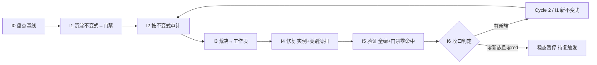

# nop-metadata 不变式驱动的持续审计闭环（nop-metadata Invariant-Driven Continuous Audit Loop）

> **产出方法**：`ai-dev/skills/invariant-loop-audit-prompt.md`（诊断→选型→拟制→共识审查）；待经独立 fresh session 审查至共识。
> **驱动方**：`missions/nop-metadata-invariant-loop.json`（范围：nop-metadata 全模块组 8 子模块 39 实体；授权/commitFormat/Loop Rule 见该 mission description）
> **先例**：nop-chaos-flux `docs/backlog/ai-invariant-loop-roadmap.md`（首个闭环先例）
> **与既有线性 roadmap 的关系**：`nop-metadata-audit-remediation-roadmap.md`（MA1-MA7 + MR1-MR8 全 done，v32）为**线性管道**——MG 产出为 lessons 文档。本图为**闭环飞轮**——I6 产出为可执行 CI 门禁。

## 目的

nop-metadata 已被审计 **5 轮 multi+open + ARM MA1-MA7（21 维）+ MR1-MR8**（含 R6.1-R6.6/R7.3/R8.1-R8.4b 子轮），审计体量在 nop-entropy 中仅次于 nop-stream。arm-index 中已出现**显式的"先例链"交叉引用**——审计者自己跟踪"同一族缺陷在不同轮次被沿先例补兄弟"：

- **静默吞异常族（silent-swallow / fail-loud）**：≥7 个兄弟实例横跨多轮——P2-06/07/09（R6.4，AggregationHelper / NopMetaModuleBizModel / NopMetaTagLabelBizModel 3 处）+ P2-01/02/04（R6.5，NopMetaSearchProcessor / AutoClassificationProcessor / MetaQualityCheckpointExecutor 3 处）+ AR-21（R8.4a，AutoClassificationProcessor 再次 + LineageTagPropagation）；
- **Limit 负值校验族**：AR-09（R6.6，`ERR_PAGINATION_LIMIT_INVALID`）→ AR-23④（R8.2，`ERR_SEARCH_LIMIT_INVALID`，审计原文*"沿 AR-09 先例"*——第二个点显式引用第一个为先例）；
- **敏感字面量脱敏族**：R6.2 P2-12（`ARG_RAW_JDBC_URL` 移除）→ R8.2 AR-16（SQL 字面量 → sqlHash，*"与 R6.2 P2-12 脱敏一致"*——跨引用）；
- **DDL / unique-key 静默缺失族**：Lesson 09 记录——36 个 `<unique-key>` 在 `nop-metadata.orm.xml` 中**曾缺** `constraint` 属性，DDL 静默生成零 UNIQUE 约束（系统性遗漏，非个例）；**已由 R3.19（commit `9b769490e`）补齐 36 处**——但 Lesson 09 仅建议手工 grep 检查，**未自动化为 CI 门禁**，下次新增 unique-key 仍可遗漏；
- **虚假关闭族（overclaimed closure）**：arm-index MR7 R7.3 核查发现 R3.14 P2-MA7.6-05（AR-06）声称已修复（commit `9b769490e` 标注 `"MA7.6-05：slaFresh=false"`），但 git 逐行核对**该文件的 commit diff real diff lines = 0**（只有版权头变更）——修复从未落地，需 R7.3 实际补做。

根因 = **"修实例不修类别"**（先例链就是"沿先例补兄弟"的显式表现）+ **反应式测试非穷举** + **MG 产出为 lessons 文档而非 CI 门禁**（Lesson 09 建议"手工 grep `unique-key` 检查 `constraint`"，但未自动化为 check 脚本）。

## Loop Design

每个 Cycle 固定 7 步（同 nop-stream invariant-loop roadmap，此处不重复方法论描述）。

## Work Item Status

> 唯一动态状态区。

| Work Item | 交付范围 | 状态 | 依赖 |
| --- | --- | --- | --- |
| Cycle 1 / I0. 不变式盘点与基线 | 从 5 轮 + ARM 21 维 + MR8 子轮审计提取已知失败模式族 → 不变式目录（`ai-dev/audits/nop-metadata-invariants/invariant-catalog.md`）；确认基线 = 当前零代码不变式门禁；枚举全部 service/processor/bizmodel 方法 + ORM 模型 entity/unique-key 作为审计目标集 | ✅ `done`（plan `2026-08-13-1930-1`，2026-08-13 completed） | — |
| Cycle 1 / I1. 不变式沉淀（首批门禁） | 首批候选族（I0 确认后定稿）：① 静默吞异常门禁——每个 service-tier 方法的 catch 块必须 rethrow 或附加 ErrorCode 到 NopException（`ai-dev/tools/check-silent-swallow.mjs` 静态扫描 + JUnit）；② `<unique-key>` constraint 完备性门禁——`ai-dev/tools/check-orm-unique-key-constraint.mjs` 扫描全部 orm.xml，缺 constraint 即红（Lesson 09 建议自动化）；③ Limit 负值校验门禁——每个接受 limit 参数的 public 方法必须 reject 负值（JUnit 参数化穷举 limit-taking 方法集）；④ 敏感字面量脱敏门禁——error/log message 中不得出现 raw JDBC URL / SQL literal（`check-sensitive-literal-leak.mjs`） | `planned`（plan `2026-08-13-1930-2`） | I0 |
| Cycle 1 / I2. 不变式驱动审计 | ① 跑 I1 门禁 → red list；② 对抗探查聚焦盲区（新 processor / 新 bizmodel / 跨模块调用链）；③ 标注已知族或新族 | `planned`（与 I3 合并于 plan `2026-08-13-1930-3`） | I1 |
| Cycle 1 / I3. 发现裁决与工作项拟制 | red list 逐条裁决 → P0/P1 派 I4；新族派 Cycle 2 / I1；裁决表零悬挂 | `planned`（与 I2 合并于 plan `2026-08-13-1930-3`） | I2 |
| Cycle 1 / I4. 修复执行（实例 + 类别清扫 + 测试） | 强制类别清扫（修任一 processor 的 catch 必 grep 全部 processor 的 catch）+ test-first + 门禁复跑零命中 | `todo` | I3 |
| Cycle 1 / I5. 全量验证与门禁零命中 | `./mvnw test -pl nop-metadata -am -T 1C` + 门禁零命中 + full-green 记录 | `todo` | I4 |
| Cycle 1 / I6. 循环收口与下一轮触发判定 | 统计 + 稳态判定 + 复触发条件登记；closure 独立 fresh session | `todo` | I5 |

## Phase Details

### I0 — 不变式盘点与基线（仅 Cycle 1）

不变式目录 `ai-dev/audits/nop-metadata-invariants/invariant-catalog.md`：每条含「陈述 / 覆盖失败族 / 历史 audit-finding-ID 证据 / 检测方法」。审计目标集 = nop-metadata 全部 service/processor/bizmodel 方法 + 39 实体的 ORM 模型声明。

### I1 — 不变式沉淀

落地形式：① JUnit 5 `@ParameterizedTest`（方法表驱动）+ 表完备性门禁；② `ai-dev/tools/check-*.mjs` 静态扫描器（ORM 模型完整性、敏感字面量脱敏）；③ ArchUnit 规则（service 层 catch 行为约束）。全部入 CI。

### I2–I6

同 nop-stream invariant-loop roadmap 的 I2–I6 方法论步骤（门禁审计 → 对抗探查 → 裁决 → 类别清扫修复 → 全量验证 → 收口稳态判定），审计目标集换为 nop-metadata 的 processor/bizmodel/ORM 模型面：

- **I2 审计目标**：跑 I1 四族门禁跨全部 service/processor/bizmodel 方法 + ORM 模型 → red list；对抗探查聚焦新 processor / 新 bizmodel / 跨模块调用链的 catch 吞异常与 limit 校验盲区。
- **I4 类别清扫面**：修任一 processor 的 catch 必 grep 全部 processor 的 catch；修任一 unique-key 的 constraint 必核对全部 ORM entity 的 unique-key；修任一 limit 入口必穷举全部 limit-taking public 方法。
- **I5 验证**：`./mvnw test -pl nop-metadata -am -T 1C` + 四族门禁零命中 + full-green 记录。
- **I6 收口**：统计门禁数/red list/新族数；稳态判定 + 复触发条件登记（CI 变红 / 新增 processor 或 bizmodel / 周期复探）；closure 独立 fresh session。

## Dependency Graph

## Loop Rule

同 nop-stream invariant-loop roadmap 的 Loop Rule，范围换为 nop-metadata，结构变更触发条件换为"新增/重命名 processor / bizmodel / ORM entity"。

## Cross-Cutting

- **授权**：P0/P1 自动修复预授权；ORM/API 模型变更执行前人工确认（改源模型 `*.orm.xml` / `*.api.xml` 而非改 `_gen/` 生成产物）；新门禁入 CI 需 committed 回归测试。
- **范围独立**：本图专注 nop-metadata 不变式沉淀与防回退，与 `nop-metadata-audit-remediation-roadmap.md`（已完成线性审计-修复）范围不重叠。
