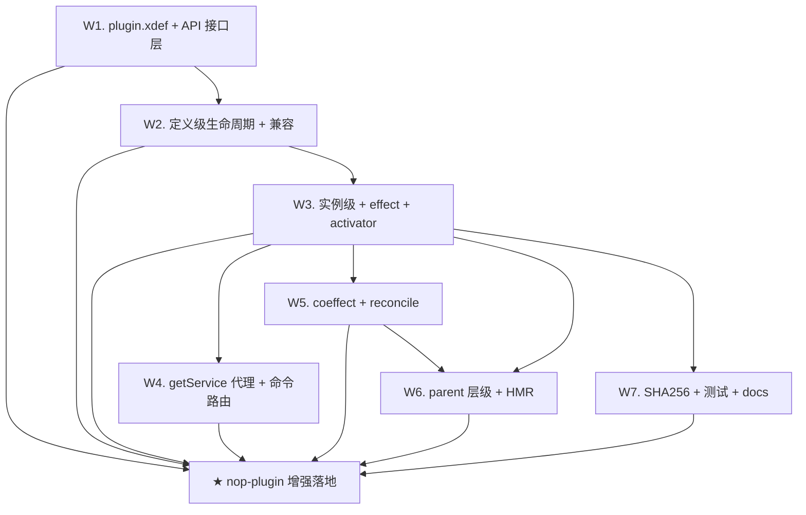

# nop-plugin 增强落地 Roadmap（plugin 框架与 IoC 解耦 + 多实例 + coeffect + HMR）

> Status: active
> Last updated: 2026-08-14
> Sources（设计已达成共识——七轮独立审查 + 用户多轮纠正，实施前必读）：
> - `ai-dev/design/nop-plugin/00-vision.md`（核心原则：plugin 框架与 IoC 解耦；多实例为设计目标）
> - `ai-dev/design/nop-plugin/01-architecture-baseline.md`（架构基线：两层状态机、接口契约、coeffect、HMR——**权威来源**）
> - `ai-dev/design/nop-plugin/02-dsh-usage-coverage.md`（dsh 用法覆盖评估）
> - `ai-dev/design/nop-plugin/03-coeffect-and-agent-example.md`（coeffect + agent 组装示例）
> - `ai-dev/design/nop-plugin/04-interface-comparison.md`（与 dsh 接口逐项对比）
> - `ai-dev/design/nop-plugin/05-artifact-loading-design.md`（artifact 加载 + SHA256 补齐）
> - `ai-dev/discussions/2026-08/2026-08-14-nop-plugin-design-revision.md`（16 轮修正过程与纠正记录）

**Why**：DeepSeek Harness（dsh/Cordis）调研识别出 nop-plugin 与现代 plugin 框架的差距——加载即激活耦合、effect 不可观测、无运行时条件激活、无 HMR、多实例缺失。设计经七轮独立审查与用户 11 条纠正达成共识，本 roadmap 驱动其落地。mission 启动命令：`./ai-dev/tools/mission-driver.sh run nop-plugin-enhancement`。

## Work Items

> **这是唯一动态状态块。状态只在这里更新。**
> 人工设定条目与顺序；AI 取第一个 `todo`，起草/执行计划，closure audit 通过后标 `done`。

- W1. plugin.xdef + API 接口层（plugin 专属 schema + nop-plugin-api 新接口含 IPluginContext，零依赖可编译验证）：`done`
- W2. 定义级生命周期 + 双轨来源 + 旧插件兼容（loadPlugin/unloadPlugin 分离、isStateMachineAware 双路径、AbstractPlugin 改造）：`done`
- W3. 实例级生命周期 + effect + activator（createInstance/destroy/activate/deactivate、实例配置域独立 IConfigProvider、IPluginScope 实现、activate 返回值自动注册）：`done`
- W4. getService 生命周期代理 + per-instance 命令路由（强类型代理、INACTIVE 快速失败、primary 多候选规则、invokeCommand 路由）：`done`
- W5. coeffect + reconcile（spec 解析、定义级+实例级评估、环检测、配置订阅自动触发）：`done`
- W6. parent 层级 + HMR（服务查找沿链回退、级联销毁、配置层叠；reloadPlugin 配置快照重建）：`done`
- W7. artifact SHA256 校验补齐 + 测试补全 + docs-for-ai 同步（HttpPluginResourceResolver 补校验、quiescence/多实例隔离测试、使用文档）：`planned`
- ★ **Milestone: nop-plugin 增强落地**（W1-W7 全部 done）：`todo`

## Status values

| Status | Meaning |
| --- | --- |
| `todo` | 未开始，无计划 |
| `planned` | 有计划，通过独立 draft review |
| `done` | 完成，通过独立 closure audit |

> Milestone 状态是派生的：W1-W7 全部 done 时自动 done。

## Framework / platform reuse

| Capability | Provider | Notes |
| --- | --- | --- |
| 子容器装配 | `nop-ioc` `AppBeanContainerLoader.loadFromResource(id, resource, parent)` / `BeanContainerImpl.buildNewInstance` | 实例化实现层复用（API 层不引用）；stop→singletonScope.close→destroyBean 链路已有 |
| 实例配置域载体 | `BeanContainerImpl.setConfigProvider`（可注入 `IConfigProvider`） | per-instance 独立 provider（全局+实例配置合并视图），不写全局 AppConfig |
| XDSL 管线 | `DslModelParser` + XDef（`AbstractDslModel`） | plugin.xdef 走标准 Delta/校验管线；loader 依赖追踪失效已有（ResourceComponentManager） |
| artifact 下载 | `HttpPluginResourceResolver` + `IHttpClient`（nop-http-api） | 已有 IHttpClient 注入 + cacheDir + URL 模板 + tmp/move；**需补 SHA256**（05 设计） |
| 类隔离 | `PluginClassLoader`（super parent=JDK CL；经 `shouldImportClass` 模式匹配将平台类路由到 importClassLoader，plugin 类从 jar） | 现状已支持"plugin 用平台全部类、自己类从 jar"；本 roadmap 不改动它 |
| bean 定位 | `BeanContainerImpl.getBeanByType`（primary 语义已有：`BeanModel.primary`） | getService 多候选规则复用 primary |
| 生命周期回调 | `@PostConstruct`/`ILifeCycle`/`<ioc:destroy>` | 子容器内 bean 清理（实现细节，不进 API） |
| 配置订阅 | `DefaultConfigProvider.subscribeChange` | 实现层 reconcile 自动触发（API 层零依赖保持） |

## Current baseline

**Already shipped:**
- `IPluginManager.loadPlugin/unloadPlugin`（加载即激活——本 roadmap 改造对象）
- `AbstractPlugin`：plugin=子容器（`loadFromResource(parent=宿主)`）、卸载=stop→自动 destroy
- `PluginClassLoader` 类隔离 + `HttpPluginResourceResolver`（IHttpClient 下载，**无校验**）
- `IPlugin.invokeCommand`（命令分发经 bean name）
- beans.xml 完整 XDSL（节点级 Delta）——结构层基础已有

**Main gaps (blocking this roadmap):**
- 加载与激活耦合（无 LOADED 未激活态）——01 §三
- 无 IPluginScope（effect 不可观测、无 quiescence 断言）——01 §四
- 无 coeffect（`<ioc:condition>` 仅 build 时）——01 §五
- 无 HMR 编排——01 §六
- 无多实例（instanceKey/parent/实例配置域）——01 §三/§七
- API 依赖现状：`IPlugin` 等接口已零依赖 IoC（保持并固化为约束）
- `HttpPluginResourceResolver` Javadoc 声称 SHA256 校验但**代码未实现**——05 §五

## Stages

| # | Stage | Owner plan | Deps | Critical path | Reuse |
| --- | --- | --- | --- | --- | --- |
| 1 | plugin.xdef + API 接口层 | plan W1 | — | **Yes** | XDSL 管线/DslModelParser |
| 2 | 定义级生命周期 + 兼容 | plan W2 | W1 | **Yes** | AppBeanContainerLoader/AbstractPlugin |
| 3 | 实例级生命周期 + effect + activator | plan W3 | W2 | **Yes** | setConfigProvider/LifeCycle |
| 4 | getService 代理 + per-instance 命令 | plan W4 | W3 | Yes | getBeanByType primary |
| 5 | coeffect + reconcile | plan W5 | W3 | **Yes** | subscribeChange |
| 6 | parent 层级 + HMR | plan W6 | W3 + W5 | Yes | loader 依赖追踪 |
| 7 | SHA256 补齐 + 测试 + docs 同步 | plan W7 | W3（可与 W4-W6 并行） | No | — |
| ★ | nop-plugin 增强落地（milestone） | — | W1-W7 done | — | — |

## Stage details

### 1. plugin.xdef + API 接口层

> Status: see Work Items above

**Goal:** 建立 plugin 专属结构层 schema 与零依赖 API 契约（全部后续工作的地基）。

**Deliverables:**
- plugin.xdef（`_vfs/nop/schema/plugin/plugin.xdef`）：`requires`/`if-property`/`activator` 原生属性 + `<beans>` 子元素（复用 bean 定义模型）；不改 beans.xdef
- `nop-plugin-api` 新接口：`IPluginInstance`/`IPluginScope`/`IPluginActivator`（`activate(scope, config)` 返回 `Disposable`）/`IPluginContext`（实例 registry + reconcile 契约，纯 JDK 类型保持零依赖）/`Disposable`（自定函数式接口）/`PluginState`/`InstanceState` 枚举
- `IPlugin` 增强 default 方法（`load/unload/getState/getInstance/getInstances/isStateMachineAware`）+ 既有方法态语义
- api 模块零依赖编译验证（不 import `io.nop.ioc`/`io.nop.xlang`）

**Out of scope:** 任何实现（W2+）、beans.xdef 修改（明确不做）。

**Module / area:** `nop-plugin-manager/_vfs/...`（xdef）、`nop-plugin-api/src/...`。

### 2. 定义级生命周期 + 双轨来源 + 旧插件兼容

> Status: see Work Items above

**Goal:** loadPlugin 与激活解耦（UNLOADED→LOADED），存量插件无感兼容。

**Deliverables:**
- `PluginManagerImpl`：load/unload 按 plugin.xdef 定义驱动（本地 VFS `*.plugin.xml` / uber jar 双轨，按 id 类型路由）
- `AbstractPlugin` 改造：start/stop 收敛为 load+createInstance / destroy+unload 的 default 封装；`AppConfig.assignConfigValue` 全局写入仅保留在兼容路径
- `isStateMachineAware` 检测 + 非 aware 旧插件回退路径（start 语义=load+activate）
- uber jar 路径经 `IPluginResourceResolver` 接线到新状态机

**Out of scope:** 实例生命周期细节（W3）。

**Module / area:** `nop-plugin-manager/impl`、`nop-plugin-support/AbstractPlugin`。

### 3. 实例级生命周期 + effect + activator

> Status: see Work Items above

**Goal:** createInstance/destroy/activate/deactivate 全链路 + effect 自管理 + 参数传递激活。

**Deliverables:**
- `PluginInstanceImpl`：固定实例对象、destroy 只销毁内部（scope.close 先于子容器 stop）、in-flight 单飞串行化、同 key 重复抛异常
- 实例配置域：per-instance `IConfigProvider`（全局+实例配置合并视图）注入子容器；`instance.getConfig()` 任何态可读
- `PluginScopeImpl`：effect/effects(LIFO close)/close 幂等 + getService/getServices（委托实例代理，多候选规则同设计 7.2）；activate 返回值非 null 自动 `scope.effect(returned)`
- activator 调用链：实例化子容器→定位 activator bean→`activate(scope, config)`；deactivate→activate 重跑
- unload 守卫：unload 定义前须 destroy 全部实例（有实例抛异常，设计 01 §三不变量）

**Out of scope:** instance.getService 生命周期代理的生成（W4）、coeffect（W5）。

**Module / area:** `nop-plugin-manager`（或 support）、`PluginClassLoader` 不变。

### 4. getService 生命周期代理 + per-instance 命令路由

> Status: see Work Items above

**Goal:** 强类型服务访问 + 多实例命令隔离。

**Deliverables:**
- getService(Class)/getServices(Class)：primary 优先→唯一实现→多候选抛异常；生命周期绑定代理（deactivate/destroy 后抛 INACTIVE）
- `IPluginInstance.invokeCommand/invokeCommandAsync`（路由到本实例子容器，复用现有命令 bean 分发）
- `IPlugin.invokeCommand` 兼容规则：仅实例数=1 时路由，多实例抛明确异常

**Out of scope:** coeffect（W5）；scope.getService 已随 W3 实现，此处仅测试校验。

**Module / area:** `nop-plugin-manager`（代理生成）。

### 5. coeffect + reconcile

> Status: see Work Items above

**Goal:** 定义级+实例级条件激活，运行时动态。

**Deliverables:**
- coeffect spec 解析（plugin.xdef 的 requires/if-property）
- `IPluginContext.reconcile()`（由 PluginManagerImpl 实现，不另起独立 Impl 类）：定义级（能否派生实例）+ 实例级（基于 instance 配置域，实时合并视图 + 全局回退）；迭代到不动点 + 静态环检测；失败置回并重试（超阈值暂停）
- 实现层配置订阅（subscribeChange）自动触发 reconcile（API 层只暴露显式 reconcile()）
- activatePlugin 对应语义：createInstance 定义级不满足 no-op 返回 null

**Out of scope:** HMR（W6）。

**Module / area:** `nop-plugin-manager`。

### 6. parent 层级 + HMR

> Status: see Work Items above

**Goal:** subagent 层级实例化 + 定义变更热重载。

**Deliverables:**
- createInstance(parent)：服务查找沿链回退（子容器 parent=父实例容器→宿主）、destroy 父级联 destroy 子、配置层叠（子覆盖父）
- reloadPlugin：destroy 全部实例→unload→load→按 createInstance 配置快照重建→reconcile（快照由 manager 持有——第七轮 P2-A 裁决点）
- loader 依赖追踪接线（plugin.plugin.xml 变更→失效→reload 编排）

**Out of scope:** 多租户配置命名空间（实例配置域已覆盖基础）。

**Module / area:** `nop-plugin-manager`。

### 7. SHA256 补齐 + 测试补全 + docs-for-ai 同步

> Status: see Work Items above

**Goal:** 安全底线补齐 + 质量门 + 使用者文档。

**Deliverables:**
- `HttpPluginResourceResolver` 补 SHA256：下载后 move 前校验（`.sha256` 文件/响应 header）、fail-fast、缓存重验（05 §五/§六）
- 测试：quiescence 断言（effects 清空）、多实例隔离（agent-1/agent-2）、coeffect 依赖链激活/去激活、HMR reload、兼容路径回归
- `docs-for-ai/` plugin 使用文档（两态/多实例/coeffect/getService/activator）+ INDEX 登记

**Out of scope:** 远程仓库元数据服务（hash 分发方式实现时最小化）。

**Module / area:** `nop-plugin-manager/resolver`、`nop-plugin-*` tests、`docs-for-ai/`。

## Dependency graph

## Cross-cutting concerns

| Concern | Notes |
| --- | --- |
| Verification baseline | 每 stage 后：`./mvnw test -pl :nop-plugin-api,:nop-plugin-manager,:nop-plugin-support -am -T 1C` 绿 |
| API 零依赖不变式 | 每个 plan 的 closure 必须验证 api 模块不 import `io.nop.ioc`/`io.nop.xlang`（00 §五成功标准 4） |
| IoC 只作实现层 | 任何公开接口不得出现 `IBeanContainer`/`BeansModel`；子容器/destroy 是实现细节（01 §一） |
| effect 自管理 | IPluginScope 不观测 IoC 内部；可逆性由 scope 自证（01 §四） |
| 参数传递模式 | activator 必须 `activate(scope, config)` 双参数，禁止字段注入 scope（why-springbatch-is-bad.md §3.1） |
| 兼容不破坏 | 存量第三方 IPlugin 实现（仅 start/stop）必须继续工作（isStateMachineAware 双路径） |
| 待裁决点（第七轮放行条件） | P2-A HMR 配置快照（W6 裁决）、P2-B 重复 key（已定：抛异常）、P2-C updateConfig×实例合并视图（W3/W5 裁决）、P2-D deactivate 父实例语义（W6 裁决） |
| 设计文档为权威 | 接口语义以 `01-architecture-baseline.md` 为准；plan 与实现冲突时回读设计 |
| Protected Area 程序性标注 | `nop-plugin-api` 公共 API 变更命中 AGENTS.md "跨模块公共 API → plan-first"；mission 流程（plan 起草 + 独立 draft review）即 plan-first 的满足形式，default 方法保证二进制兼容 |

## Rules

- This file is a state index and coarse decomposition, not an execution plan.
- Each `planned` stage is owned by its execution plan.
- Status changes happen only in the Work Items block at the top.
- Milestones are derived: W1-W7 must all be `done` before the milestone is marked `done`.
