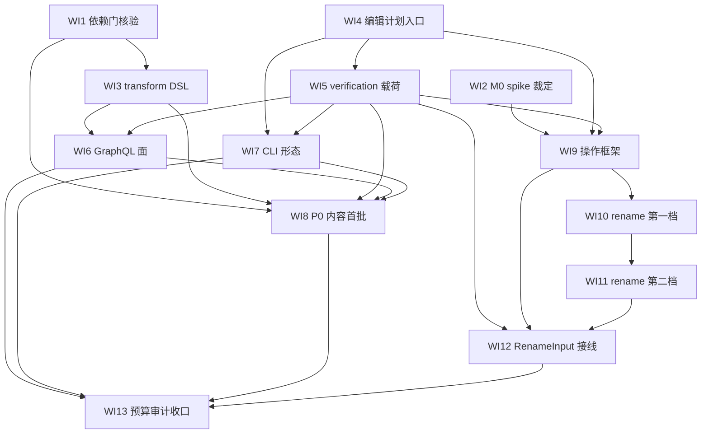

# nop-refactor Roadmap — AI-First 代码修改工具链（P0 codemod + P1 rename）

> Last updated: 2026-09-25
> Design authority: `ai-dev/design/nop-refactor/`（00-vision.md / 01-architecture-baseline.md / README.md）；跨域约束：`ai-dev/design/self-contained-design.md`
> 背景（过程记录，结论以 design 为准）：`ai-dev/analysis/2026-09/2026-09-25d-tree-sitter-refactor-feasibility-and-nop-lint-relationship.md`、`ai-dev/analysis/2026-09/2026-09-25e-jdt-java-refactoring-catalog-and-nop-path.md`（两文头部增注标记了被后续裁定作废的条款）
> 位置：按仓库 roadmap 惯例存放于 `ai-dev/backlog/`。书写约定：未来交付物路径用普通文本书写、不加反引号；已存在的 owner / 参考文档路径用反引号，持续受 check-doc-links 保护。

## Purpose

本 roadmap 编排 refactor 能力的实现——按 `ai-dev/design/nop-refactor/00-vision.md` 的三项用户裁定（AI-first/GraphQL-first 非 LSP、自完备能力源、复杂度预算 + 性价比门）收敛出的范围：

- **P0 codemod 面**（性价比最高）：批量 pattern 改写 + 统一 self-verification 反馈载荷，复用 nop-lint 存量（pattern DSL、fix 机制、Reporter、GraphQL 先例），新增量集中在契约面
- **P1 rename**（唯一入预算的语义级操作）：rename 阶梯（第一档：局部变量/参数，单文件内；第二档：字段/非虚方法/类型，模块内符号域）
- **明确不做**（vision §四 Non-Goals / §六 拒绝项）：LSP 面、交互式向导、结构变换型重构机器（extract/inline/change signature/move 族）、外部引擎（jdt.ls 桥、OpenRewrite 包装——违反 `ai-dev/design/self-contained-design.md`）

**复杂度预算**：总复杂度不超过 nop-lint 模块族量级（上界锚点：main Java 约 2.2 万行 / 6 模块，2026-09-25 实测 21,927 行；预期实际落点 3 模块、约 4-6k 行——超预算砍功能，不加预算）。**终态**：全部 WI 落地或显式裁定移出，每项通过独立 closure audit，AI agent 可经 GraphQL 完成 preview → 自检 diff/verification → apply 的无人工闭环。

模块拓扑（baseline §二，最终 Maven 布局在 plan 期裁定、不超预算）：nop-refactor-core（操作框架 + 编辑计划 + verification）+ nop-refactor-java（Java 符号解析适配）+ nop-refactor-graphql（Refactor__* 契约面）。

**执行路径统一裁定（防双引擎漂移）**：baseline §一.3 的 check/plan/apply/verify 四段契约对 codemod 与 rename **同等适用**——codemod 面在 WI9 框架存在前先落地（复用 WI4 应用入口 + WI5 载荷），WI9 的职责是把这条已验证的路径**框架化**而非另建第二实现；WI9 的 closure 验收必须包含"rename 与 codemod 共用同一 plan/apply/verify 机制"的接线证明。

## Work Item Status

> 唯一动态状态块。勾选 = 独立 closure audit 通过（完成判定见 Cross-Cutting）。WI 编号全文件递增；编号顺序为依赖拓扑序，**无 deps 关系的 WI 允许并行**（见 Rules）。每个 WI 以独立 plan 承载（对抗性 draft review + 独立 closure audit，见 `ai-dev/plans/00-plan-authoring-and-execution-guide.md`）。

### M0 — 依赖门与符号域裁定

- [ ] WI1 外部依赖门核验：核验 nop-lint 质量优化 plan 11（TemplateFix 多捕获 NPE C2 + DefUseChain 遮蔽 C1）已达 completed——plan 11 是 **WI8（fix 模板内容走 TemplateFix 渲染路径）**的正确性前置；WI10/WI11 的 rename 不消费 DefUseChain（走 ScopeAnalyzer/引用搜索），不受此门约束（Deliverable: 核验结论落当日 log；deps: 无；Item Type: Proof）
- [ ] WI2 M0 spike——JavaParser SymbolSolver classpath 覆盖率实测 + P1 范围裁定：在 nop-entropy 自身（Maven 多模块）实测跨模块类型解析率；据实测数字裁定 P1 rename 符号域（v1 单模块内 / classpath 可达域）与引用搜索落点（操作器内嵌轻量索引 vs nop-code 查询面，baseline §七 open question 的收口点）；**交付落点**：spike 代码/脚本落 `_tmp/`（不进模块），裁定记录与覆盖率数字落当日 log + analysis 文档，WI9 plan 起草时转录进其 Current Baseline（Deliverable: spike 脚本 + 裁定记录；deps: 无；Item Type: Decision）

### M1 — P0 codemod 面（复用 nop-lint 存量，新增量集中契约面）

- [ ] WI3 transform 语义裁定与 DSL 落地："只改不报"的 transform 规则形态（fix 载体与 severity 脱钩；批量安全的模板面）——xdef/RuleDslModel/RuleDslParser 扩展，既有组合面 fail-closed 矩阵保持（fix+xscript、XML+fix 拒绝面不放松）；plan 期必须裁定的子项：transform 规则是否仍产 Diagnostic 与结果计数形态、与 BaselineEngine/抑制尾的交互、autoFixable 元数据语义；design 01/03 增注（Deliverable: 代码 + 测试 + `ai-dev/design/nop-lint/01-pattern-dsl.md`、`03-execution-engine.md` 增注；deps: WI1；Item Type: Decision + Fix）
- [ ] WI4 编辑计划应用入口：抽出"per-file 编辑计划 + 冲突合并 + 原子写 + 重解析守卫 + 回滚"的诊断无关应用入口——落点裁定（refactor-core 只读消费 nop-lint-core fix 类 vs nop-lint-core 新增公共入口，零行为变化为硬约束：ConsoleReporter golden 字节不变 + nop-lint 全模块测试绿）（Deliverable: 代码 + 行为不变证明；deps: 无，可与 WI3 并行；Item Type: Decision + Fix）
- [ ] WI5 RefactorResult verification 载荷：被改文件重解析（parseOk / errorNodeCount，经 nop-treesitter）+ 残留 lint（可配规则子集，经 nop-lint 引擎）+ stats（文件数/编辑数/耗时档位）+ nonApplied 分类枚举（conflict / out-of-scope / unresolved-target）；字段契约 = baseline §四，不得缩水（Deliverable: 代码 + 载荷契约测试；deps: WI4；Item Type: Fix）
- [ ] WI6 nop-refactor-graphql：按 baseline §三 裁定的四 action 契约落地——Refactor__previewRewrite / Refactor__applyRewrite（RewriteInput：规则集/pattern + 目标文件集合）；无状态重执行语义（apply 重算编辑计划后原子落盘）；资源 cap fail-closed 沿 Lint__checkSource 先例；GraphQLEngine RPC 端到端真调证明（Deliverable: 模块 + e2e 测试 + baseline 增注；deps: WI3, WI5；Item Type: Fix）
- [ ] WI7 CLI 批处理形态：同一引擎的 preview（UnifiedDiff 输出，复用 Reporter 面）/ apply（stats 汇总）；**退出码三态**：0 = 全部可应用/已全部应用、1 = 存在 nonApplied（部分未应用/未落盘）、2 = 错误（解析/加载/IO）；CLI 不引入第二套语义（Deliverable: 代码 + e2e；deps: WI4, WI5；Item Type: Fix）
- [ ] WI8 P0 内容首批：62 条生产规则中高价值机械可修规则的 fix 模板补货 + 演示 transform 规则集；**终态闭环的 closure 责任归属本项**——验收必须含"演示规则集经 GraphQL 入口（Refactor__previewRewrite → Refactor__applyRewrite）端到端走通 AI 闭环"，CLI 入口为同型补充证明；**选取准则必须随 plan 发布**（按性价比打分：AI 使用频率 × pattern 可表达性 ÷ 模板复杂度），每条带 before/after fixture 与 verify 断言（Deliverable: 规则 YAML + RuleTester/verify fixtures + GraphQL 闭环 e2e；deps: WI1, WI3, WI5, WI6, WI7；Item Type: Fix）

### M2 — P1 rename（阶梯式符号域扩大，边界按 WI2 裁定）

- [ ] WI9 操作框架骨架：check/plan/apply/verify 四段契约的框架化——**复用 WI4 应用入口与 WI5 载荷**（验收含接线证明：rename 与 codemod 走同一 plan/apply/verify 机制，无第二执行路径）+ 符号解析适配 SPI（语言无关 core，Java 适配先行；nop-java-parser 消费）；四段最小实现，不做 LTK 式 Undo/脚本/participants（Deliverable: nop-refactor-core/java + 测试 + 接线证明；deps: WI2, WI4, WI5；Item Type: Fix）
- [ ] WI10 rename 阶梯第一档：局部变量 + 参数（**单文件内**，JavaParser + ScopeAnalyzer 语义——审计已确认 ScopeAnalyzer.resolve 正确；文件内引用改写；名字冲突 fail-closed 进 nonApplied）；verify 含简化引用计数断言（rename 前后目标符号引用数一致，symbolIntact 的 WI10 前身形态）（Deliverable: 代码 + fixtures；deps: WI9；Item Type: Fix）
- [ ] WI11 rename 阶梯第二档：字段 + 非虚方法 + 类型（**模块内符号域**，跨文件引用按 WI2 裁定的搜索落点改写；**import 语句与限定名（FQN）引用同步更新**；verify 含 stale-import 检查——残留旧 FQN import/引用按失败处理，不得出现"parseOk=true 但代码已损坏"的静默破坏；跨模块引用按裁定显式 nonApplied 或支持，不静默漏改）（Deliverable: 代码 + fixtures；deps: WI10；Item Type: Fix）
- [ ] WI12 RenameInput GraphQL 接线 + e2e：Refactor__previewRename / Refactor__applyRename；目标定位（FQN 或 文件+字节偏移，无光标概念）+ symbolIntact 正式语义（改写前后目标符号引用计数一致，消费 RefactorResult 契约）+ GraphQLEngine RPC 端到端（Deliverable: 代码 + e2e；deps: WI5, WI9, WI11；Item Type: Fix）

### M3 — 预算收口

- [ ] WI13 复杂度预算审计 + 收口：**计数口径钉死**——main Java（src/main/java，排除生成物与测试）× 模块清单（nop-refactor-core/java/graphql + 对 nop-lint 侧的增量行单列归属），对照上界锚点 2.2 万行记录（超线则裁剪功能并回写 design）；docs-for-ai 模块文档新建 + design 增注对齐 live；能力目录（操作清单 × verification 契约）发布（Deliverable: 审计记录 + docs；deps: M1+M2 全部 WI；Item Type: Proof）

## Dependency Graph

## Framework / Platform Reuse

| 能力 | 提供方 | 约束 |
| --- | --- | --- |
| 语法解析 / 重解析验证 / ERROR 计数 | `nop-treesitter`（TSParser / TSTree.source / blob 内置 java/ts/tsx） | 只读消费，零行为修改 |
| pattern 匹配 / 规则 DSL / xdef 加载 | `nop-lint-core`（SourcePatternCompiler、RuleDslParser、lint-rule.xdef、XDSL 管线） | transform 扩展走既有解析链，fail-closed 矩阵不放松 |
| 编辑应用机制（冲突合并/原子写/回滚/UnifiedDiff） | `nop-lint-core` fix 包（Fixer / FixApplier / UnifiedDiff） | 经 WI4 抽出的入口消费，golden 字节不变 |
| 残留诊断复核 | `nop-lint` 引擎（可配规则子集） | 复用既有 profile/统计面 |
| Java 符号/作用域语义 | `nop-utils/nop-java-parser`（JavaParser + SymbolSolver）+ nop-lint-java ScopeAnalyzer 语义 | WI2 实测覆盖率决定可用边界 |
| 引用搜索（候选） | nop-code 查询面 | WI2 裁定是否采用；不引入外部索引器 |
| GraphQL biz 形态 / 资源 cap 先例 | `nop-lint-graphql`（@BizModel 布局、Lint__checkSource cap/fail-closed） | 命名沿 Obj__action 大写惯例 |

## Current Baseline

- **设计完备且用户裁定**（2026-09-25 三项裁定沉淀于 `ai-dev/design/nop-refactor/`）；**refactor 实现尚不存在**（无 nop-refactor 模块）。
- nop-lint 存量可用：pattern DSL 引擎、fix 管线（roadmap item 25）、GraphQL 面（item 38）、CLI/Reporter（item 39）、62 条生产规则——全部 autoFixable=false（P0 内容机会）；质量优化 plan 07–09 已 completed、plan 10 active（在途）、plan 11–14 为 draft（2026-09-25 快照，live 为准），其中 plan 11 是 WI8 的前置（WI1 门）。
- 预算锚点实测：nop-lint 族 main Java 21,927 行 / 6 模块（2026-09-25 实测，口径见 vision §三.9）。
- 外部生态结论（背景）：语法级 codemod 用 byte-range 替换是业界标准（ast-grep 同型）；语义级 rename 需编译器级符号解析，Java 侧 = JavaParser SymbolSolver（覆盖率待 WI2 实测）。

## Cross-Cutting（每个 WI 的完成判定）

- 独立 plan 承载 + 对抗性 draft review + 独立 closure audit（`ai-dev/plans/00-plan-authoring-and-execution-guide.md` 全部最小规则适用，含 Anti-Hollow / 端到端验证 / 接线验证 / 无静默跳过 / 新功能必有测试）。
- 设计约束回扣：每 WI closure audit 显式核对 vision 原则 1–9 未被违反（GraphQL-first 无状态、self-verification 载荷不缩水、自完备、复杂度预算、fail-closed）。
- **上游扩展承载形态**：WI3（nop-lint DSL 扩展）与 WI4（如落点为 nop-lint-core 新增入口）属 baseline §七"确需上游扩展"——其 WI plan（含对抗审查记录）+ 对应 design 文档增注即该条所指的 design 记录，无需单独立卷。
- 性价比门：预算内新操作才可立项；结构性扩张（新增第四模块/超预算行数）须先修订 design 并由用户裁定。

## Rules

- 状态只在 `## Work Item Status` 的 checkbox 通道维护，不设第二状态面；WI 编号全文件递增不重排。
- **编号顺序为依赖拓扑序；无 deps 关系的 WI 允许并行**（deps 是唯一并行屏障，编号不是）。
- deps 未完成的 WI 不得开工；WI1 是门禁型 Proof——未通过时其下游（WI3、WI8）保持 todo。
- 行为红线：nop-lint / nop-treesitter / nop-code 零行为修改（golden 字节不变 + 全测试绿是每 WI closure audit 的固定核对项）。

## Authoring Review Record

- **R1（2026-09-25，agent_43be271e-88b5-42de-86ae-8f1fb79b972b，fresh session）：REVISE**——4 Major + 11 Minor，全部修订：
  - Major-1 GraphQL input union 不可实现 → baseline §三 改判四 action 契约（preview/apply × rewrite/rename，共享 RefactorResult），WI6/WI12 同步；
  - Major-2 字段 rename 符号域自相矛盾（"文件内改写"对跨文件字段不成立）→ 阶梯重划：WI10 收窄为局部变量/参数（单文件），字段上移 WI11 模块域；
  - Major-3 类型 rename 缺 import/FQN 更新 → WI11 显式纳入 + verify 增加 stale-import 检查；
  - Major-4 P0 路径绕开四段契约的双引擎风险 → Purpose 显式裁定：WI9 框架化既有路径，验收含"无第二执行路径"接线证明；
  - Minor（11 项）：WI2 交付落点钉死（log + `_tmp/`，WI9 plan 转录）；plan 10–14 状态措辞按 live 修正；WI1 门禁理由收窄至 WI8（rename 不消费 DefUseChain）；WI8 选取准则随 plan 发布 + deps 补齐；WI12 deps 补 WI5；WI13 计数口径钉死；锚点数字修正为实测 21,927 行（vision/baseline 同步）；上游扩展承载形态句加入 Cross-Cutting；WI7 退出码三态钉死；Rules 并行措辞改拓扑序；WI10/WI11 引入引用计数断言/stale-import 检查（symbolIntact 前身）。

- **R2（2026-09-25，agent_9e21d183-46a3-471b-82fe-90d72804e92c，fresh session）：REVISE**——R1 全部 4 Major + 11 Minor 复核为 FIXED-VERIFIED（锚点 21,927 独立重算吻合、13 WI 编号逐边核验为有效拓扑序）；新发现 2 Major + 4 Minor，全部修订：
  - Major-A WI9 deps 遗漏 WI5（"复用 WI5 载荷"的接线裁定不被依赖闭包强制）→ deps 补 WI5 + 图补边 WI5 --> WI9；
  - Major-B WI8 文本/deps 矛盾 + 终态"GraphQL 无人工闭环"无 closure 归属 → 采纳修法 (a)：WI8 deps 补 WI6，验收显式含"演示规则集经 Refactor__previewRewrite → applyRewrite 端到端闭环"（终态证明归属 WI8 closure）；图补边 WI6 --> WI8、WI8 --> WI13；
  - Minor-C baseline §五 残留旧 action 名 → 已改 previewRewrite/applyRewrite 及 rename 对；
  - Minor-D plan 状态快照失真 → 改为"plan 07–09 completed、plan 10 active（在途）、plan 11–14 draft（2026-09-25 快照，live 为准）"（R2 报告称 plan 10 completed 系误读，本机复核 `Plan Status: active`）；
  - Minor-E 依赖图缺 WI8 --> WI13 边 → 已补；
  - Minor-F R1 记录计数 10→11 → 已修正。

- **R3（2026-09-25，agent_43a58be7-5473-4ae4-9980-3e78e8b7d5f8，fresh session）：CONSENSUS**——R2 六项修复逐条 FIXED-VERIFIED（含 live 复核 plan 快照逐号吻合、baseline 裸名正则零命中）；13 WI 的 deps/依赖图/拓扑序/审查记录四方逐边互洽（23 条边双向核对通过，WI13 对 M1+M2 的覆盖经传递闭包验证完备）；无 Blocker/Major。一条非阻塞观察（WI1 下游措辞）已顺手修正（"下游（WI8）"→"下游（WI3、WI8）"）。共识达成，roadmap 进入执行排队。

**审查共识：R1 REVISE → 修订 → R2 REVISE → 修订 → R3 CONSENSUS（3 轮，3 个独立 fresh-session agent）。**
