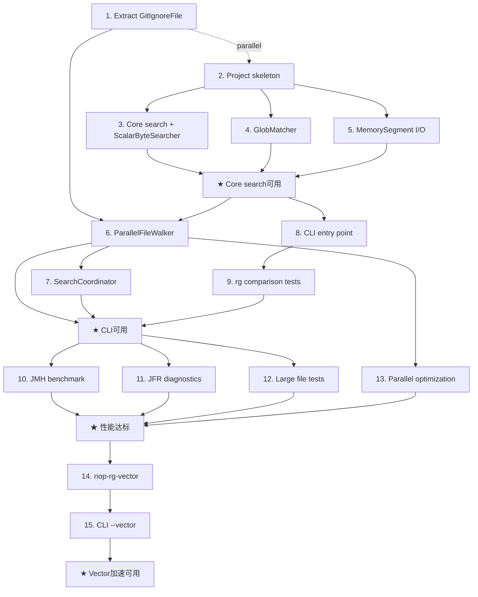

# nop-rg 高性能文件搜索工具 Roadmap

> Last updated: 2026-09-18
> Sources: `ai-dev/design/nop-rg/00-vision.md` (Vision), `ai-dev/design/nop-rg/01-architecture-baseline.md` (Architecture Baseline)

## Purpose

This roadmap tracks the implementation of nop-rg, a high-performance file search tool for the Nop platform, providing grep (content search) and glob (filename pattern matching) capabilities equivalent to ripgrep. Terminal goal:标量搜索性能达到原生 rg 的 50%+，CLI 可用，所有核心功能有测试覆盖，JFR 性能诊断可用。

Does not contain implementation details. Each `planned` stage is owned by its execution plan.

## Work Items

> **This is the only dynamic state block. Update status only here.**

### Wave 1: Foundation

- 1. Extract GitIgnoreFile to nop-core: `done`
- 2. nop-rg project skeleton (parent POM, BOM, core module): `done`
- 3. Core search interfaces + ScalarByteSearcher (BMH): `done`
- 4. GlobMatcher (two-pointer greedy): `done`
- 5. MemorySegment + Arena I/O layer: `done`
- ★ **Milestone: Core search可用** (unlocks when 2 + 3 + 4 + 5 done): `done`

### Wave 2: Integration

- 6. ParallelFileWalker (dedicated ExecutorService): `done`
- 7. SearchCoordinator (search orchestration): `done`
- 8. CLI entry point + argument parsing: `done`
- 9. System rg comparison integration tests: `done`
- ★ **Milestone: CLI可用** (unlocks when 6 + 7 + 8 + 9 done): `done`

### Wave 3: Performance

- 10. JMH benchmark module (nop-rg-benchmark): `done`
- 11. JFR performance diagnostics (--jfr switch): `done`
- 12. Large file (>1GB) correctness + stability tests: `done`
- 13. Parallel search optimization (work-stealing collection): `done`
- ★ **Milestone: 性能达标** (unlocks when 10 + 11 + 12 + 13 done): `done`

### Wave 4: Optional Acceleration

- 14. nop-rg-vector module (Vector API framework + fallback): `todo`
- 15. CLI --vector switch integration: `todo`
- ★ **Milestone: Vector加速可用** (unlocks when 14 + 15 done): `todo`

## Status values

| Status | Meaning |
| --- | --- |
| `todo` | Not started, no plan |
| `planned` | Has execution plan, passed draft review |
| `done` | Complete, passed closure audit |

> Milestone status is derived: when all dependency work items are `done`, the milestone auto-flips to `done`.

## Framework / platform reuse

| Capability | Provider | Notes |
| --- | --- | --- |
| .gitignore 解析 | `GitIgnoreFile` (from `nop-ai-code-analyzer`, extract to `nop-core` `io.nop.core.git`) | 417 lines, complete gitignore semantics (`*`, `**`, `?`, `[...]`, `!`, `/` anchoring) |
| Path matching | `AntPathMatcher` (`nop-commons`) | Ant-style glob — reference only; rg-compatible `--glob` semantics come from `GlobMatcher` (stage 4), not AntPathMatcher |
| I/O utilities | `VirtualFileSystem` / `IResource` (`nop-core`) | Used by GitIgnoreFile for resource access |
| Error handling | `NopException` / `ErrorCode` (`nop-core`) | Standard Nop error pattern |
| Testing | JUnit 5 + `nop-autotest` | Existing test infrastructure |
| Benchmarks | JMH | Standard Java microbenchmark harness |
| Performance diagnostics | JFR (JDK built-in) | Zero extra dependency, production-low-overhead |

## Current baseline

**Already shipped:**
- `GitIgnoreFile.java` at `nop-ai/nop-ai-skills/nop-ai-code-analyzer/.../git/GitIgnoreFile.java` — complete gitignore parser (417 lines, hand-rolled, no JGit dependency)
- `AntPathMatcher` at `nop-kernel/nop-commons/.../path/AntPathMatcher.java` — Ant-style path matching
- `nop-utils/nop-commons-java21` — higher-JDK module gated by JDK-activation profile (`nop-utils` POM `java21-modules`, JDK ≥ 21) — the precedent nop-rg follows for its JDK 22 gating

**Main gaps:**
- No file content search (grep) capability in Nop platform
- No glob-based file discovery tool
- GitIgnoreFile is buried in `nop-ai-code-analyzer`, not reusable as a common library (it implements `Predicate<IResource>` against `nop-core`'s `VirtualFileSystem`, so it can only move up into `nop-core` — not down into `nop-commons`)
- No JFR-based performance diagnostics tooling

## Stages

| # | Stage | Owner plan | Deps | Critical path | Reuse |
| --- | --- | --- | --- | --- | --- |
| 1 | Extract GitIgnoreFile to nop-core | TBD plan | — | No (parallel) | existing `GitIgnoreFile` |
| 2 | nop-rg project skeleton | TBD plan | — | No (parallel) | root POM pattern |
| 3 | Core search interfaces + ScalarByteSearcher | TBD plan | 2 | **Yes** | — |
| 4 | GlobMatcher | TBD plan | 2 | No | `AntPathMatcher` (reference) |
| 5 | MemorySegment + Arena I/O layer | TBD plan | 2 | **Yes** | — |
| ★ | Core search可用 (milestone) | — | 2+3+4+5 | — | — |
| 6 | ParallelFileWalker | TBD plan | 1 + ★ | No | `GitIgnoreFile` (nop-core) |
| 7 | SearchCoordinator | TBD plan | 6 | **Yes** | — |
| 8 | CLI entry point | TBD plan | ★ | No | — |
| 9 | System rg comparison tests | TBD plan | 8 | No | — |
| ★ | CLI可用 (milestone) | — | 6+7+8+9 | — | — |
| 10 | JMH benchmark module | TBD plan | ★ | No | JMH |
| 11 | JFR performance diagnostics | TBD plan | ★ | No | JFR |
| 12 | Large file tests | TBD plan | ★ | No | — |
| 13 | Parallel search optimization | TBD plan | 6 | No | — |
| ★ | 性能达标 (milestone) | — | 10+11+12+13 | — | — |
| 14 | nop-rg-vector module | TBD plan | ★ | No | jdk.incubator.vector |
| 15 | CLI --vector switch | TBD plan | 8+14 | No | — |
| ★ | Vector加速可用 (milestone) | — | 14+15 | — | — |

## Stage details

### 1. Extract GitIgnoreFile to nop-core

> Status: see Work Items above

**Goal:** 将 `GitIgnoreFile.java` 从 `nop-ai-code-analyzer` 抽取到 `nop-core`（新包 `io.nop.core.git`），使其成为可复用的公共库。保持 API 兼容，更新现有消费者的 import 路径。

**Deliverables:**
- GIT-01: 在 `nop-core` 中创建 `io.nop.core.git` 包，移入 `GitIgnoreFile` 及其内部类（该类实现 `Predicate<IResource>`，依赖 `io.nop.core.resource` 的 `IResource`/`VirtualFileSystem`/`ResourceHelper`，只能上移到 `nop-core`；不可放 `nop-commons` —— nop-core 依赖 nop-commons，反向依赖成环；也不可放 `nop-utils/nop-git` —— 该模块绑定 JGit）
- GIT-02: 更新 `nop-ai-code-analyzer` 的 `GitProject` 改为使用 `nop-core` 的 `GitIgnoreFile`
- GIT-03: 更新 `nop-cli-core` 的 `CliFileCommand` 改为使用 `nop-core` 的 `GitIgnoreFile`
- GIT-04: 为 `GitIgnoreFile` 补充单元测试（当前无测试）

**Out of scope:** nop-rg 的搜索功能（stage 3+）。

**Protected area:** 涉及 `nop-core`（AGENTS.md Protected Area：框架核心引擎），执行计划需按 plan-first 流程审核。

**Module / area:** `nop-kernel/nop-core/`, `nop-ai/nop-ai-skills/nop-ai-code-analyzer/`, `nop-runner/nop-cli-core/`

### 2. nop-rg project skeleton

> Status: see Work Items above

**Goal:** 创建 nop-rg 模块组骨架，包括父 POM、BOM、core 模块。JDK 22+ 直接在 pom.xml 中指定；挂入根 reactor 采用 JDK 激活 profile 门控（复用 `nop-utils` `java21-modules` 模式）。

**Deliverables:**
- SKEL-01: 创建 `nop-rg/` 父 POM（packaging=pom），通过 JDK ≥ 22 激活的 profile 加入根 POM `<modules>`（JDK < 22 构建自动跳过，不阻断全局构建）
- SKEL-02: 创建 `nop-rg-bom` 模块
- SKEL-03: 创建 `nop-rg-core` 模块，`maven.compiler.release=22`，包结构定义

**Out of scope:** 具体搜索实现（stage 3-5）。

**Module / area:** `nop-rg/`

### 3. Core search interfaces + ScalarByteSearcher

> Status: see Work Items above

**Goal:** 定义搜索策略接口，实现标量 Boyer-Moore-Horspool 搜索（最罕见字节启发式）。

**Deliverables:**
- SRCH-01: `ByteSearchStrategy` 接口定义
- SRCH-02: `ScalarByteSearcher` 实现 — BMH + 最罕见字节锚点选择
- SRCH-03: `SearchRequest` / `SearchResult` / `MatchResult` 数据类
- SRCH-04: 单元测试 — 空模式、单字节、多字节模式、跨块边界

**Out of scope:** Vector 加速（stage 14）。

**Module / area:** nop-rg/nop-rg-core/src/main/java/io/nop/rg/core/search/（规划落位，随对应 Stage 创建）

### 4. GlobMatcher

> Status: see Work Items above

**Goal:** 实现专用两指针贪心 Glob 匹配器，支持 `**`、`?`、`[]`、`!` 反转。

**Deliverables:**
- GLOB-01: `GlobMatcher` — 两指针贪心算法，segment-level 和 path-level 匹配
- GLOB-02: `CompiledGlob` — 模式编译缓存（ConcurrentHashMap）
- GLOB-03: 单元测试 — 边界测试（`**`、`?`、`[]`、`!`、空模式、长路径）

**Out of scope:** 性能优化（stage 13）。

**Module / area:** nop-rg/nop-rg-core/src/main/java/io/nop/rg/core/glob/（规划落位，随对应 Stage 创建）

### 5. MemorySegment + Arena I/O layer

> Status: see Work Items above

**Goal:** 实现基于 FFM API 的内存映射文件读取，支持大文件分块映射。

**Deliverables:**
- IO-01: `MappedFileReader` — MemorySegment + Arena 内存映射，try-with-resources 确定性释放
- IO-02: `ChunkedFileReader` — 大文件分块映射（256MB chunk），跨块边界 overlap 扫描
- IO-03: 单元测试 — 小文件、大文件、跨块边界匹配

**Out of scope:** 性能调优（stage 10-13）。

**Module / area:** nop-rg/nop-rg-core/src/main/java/io/nop/rg/core/io/（规划落位，随对应 Stage 创建）

### 6. ParallelFileWalker

> Status: see Work Items above

**Goal:** 实现专用 ExecutorService 并行文件遍历，支持 glob 过滤和 gitignore 规则。

**Deliverables:**
- WALK-01: `ParallelFileWalker` — 专用线程池，work-stealing 收集匹配文件
- WALK-02: 集成 `GitIgnoreFile`（来自 nop-core）进行文件过滤
- WALK-03: 并行度控制开关（`--threads N`）

**Out of scope:** 搜索功能（stage 3-5）。

**Module / area:** nop-rg/nop-rg-core/src/main/java/io/nop/rg/core/walk/（规划落位，随对应 Stage 创建）

### 7. SearchCoordinator

> Status: see Work Items above

**Goal:** 实现搜索流程编排：glob 过滤 → 文件遍历 → 内容搜索 → 结果聚合。

**Deliverables:**
- COORD-01: `SearchCoordinator` — 完整搜索流程编排
- COORD-02: 策略选择逻辑（根据开关选择 Scalar/Vector/Regex 搜索器）
- COORD-03: 端到端集成测试 — 从搜索入口到结果输出的完整路径验证

**Out of scope:** CLI 集成（stage 8）。

**Module / area:** nop-rg/nop-rg-core/src/main/java/io/nop/rg/core/coordinator/（规划落位，随对应 Stage 创建）

### 8. CLI entry point

> Status: see Work Items above

**Goal:** 实现命令行入口，参数解析，JSON 输出（兼容 `rg --json`）。

**Deliverables:**
- CLI-01: 参数解析（-g glob、-i 忽略大小写、-c 计数、-l 仅文件名、--json、--no-ignore、--delegate-rg）
- CLI-02: JSON 输出格式（兼容 rg --json messages 格式）
- CLI-03: `--delegate-rg` 委托系统 rg 执行（ProcessBuilder）
- CLI-04: 基本 CLI 集成测试

**Out of scope:** 性能开关（--threads、--jfr、--vector）在各自 stage 中添加。

**Module / area:** nop-rg/nop-rg-cli/（规划落位，随对应 Stage 创建）

### 9. System rg comparison tests

> Status: see Work Items above

**Goal:** 编写与系统 rg 的对比测试，验证 nop-rg 搜索结果与 rg 一致。

**Deliverables:**
- TEST-01: 对比测试框架 — 在同一目录下执行 nop-rg 和 rg，比较结果
- TEST-02: 覆盖基本搜索、glob 过滤、忽略大小写、gitignore 等场景
- TEST-03: 测试结果验证 — 匹配行号、匹配内容、文件列表一致性

**Out of scope:** 性能对比（stage 10）。

**Module / area:** nop-rg/nop-rg-cli/src/test/（规划落位，随对应 Stage 创建）

### 10. JMH benchmark module

> Status: see Work Items above

**Goal:** 创建 JMH 基准测试模块，量化搜索性能。

**Deliverables:**
- JMH-01: 创建 `nop-rg-benchmark` 模块
- JMH-02: 标量搜索吞吐量基准（ops/sec）
- JMH-03: Glob 匹配吞吐量基准
- JMH-04: 端到端搜索基准（不同文件大小）
- JMH-05: 与系统 rg 的性能对比基准

**Out of scope:** 优化（stage 13）。

**Module / area:** nop-rg/nop-rg-benchmark/（规划落位，随对应 Stage 创建）

### 11. JFR performance diagnostics

> Status: see Work Items above

**Goal:** 集成 JFR 性能诊断，提供 `--jfr` 开关记录搜索过程的 CPU/内存/I/O 事件。

**Deliverables:**
- JFR-01: `nop-rg-jfr.jfc` 配置文件（ExecutionSample、AllocationInNewTLAB、FileRead 等）
- JFR-02: CLI `--jfr <output-path>` 开关实现
- JFR-03: JFR 录制启停逻辑，搜索结束后自动 dump
- JFR-04: 使用文档 — 如何用 JMC 分析 JFR 记录

**Out of scope:** JFR 数据可视化（使用 JMC 工具）。

**Module / area:** nop-rg/nop-rg-cli/（规划落位，随对应 Stage 创建）

### 12. Large file tests

> Status: see Work Items above

**Goal:** 验证大文件（>1GB）搜索的正确性和稳定性。

**Deliverables:**
- LRG-01: 大文件生成工具（生成 >1GB 测试文件）
- LRG-02: 大文件搜索正确性测试（匹配结果一致性）
- LRG-03: 大文件搜索稳定性测试（无 OOM、无文件锁残留）
- LRG-04: 分块映射跨块边界测试

**Out of scope:** 性能优化。

**Module / area:** nop-rg/nop-rg-core/src/test/（规划落位，随对应 Stage 创建）

### 13. Parallel search optimization

> Status: see Work Items above

**Goal:** 优化并行搜索路径，使用 work-stealing 收集替代 CopyOnWriteArrayList。

**Deliverables:**
- OPT-01: 替换 CopyOnWriteArrayList 为 work-stealing 收集模式（勘误：Wave 2 实现为 ConcurrentLinkedQueue+自旋等待而非 CopyOnWriteArrayList；Wave 3 落地为 ForkJoinPool work-stealing，以 live 为准）
- OPT-02: 多文件并行内容搜索（parallelStream 或专用搜索线程池）
- OPT-03: 并行度动态调整（根据文件数量和大小）

**Out of scope:** Vector 加速（stage 14）。

**Module / area:** nop-rg/nop-rg-core/（规划落位，随对应 Stage 创建）

### 14. nop-rg-vector module

> Status: see Work Items above

**Goal:** 实现 Vector API 加速的搜索框架，运行时检测可用性并自动降级。

**Deliverables:**
- VEC-01: 创建 `nop-rg-vector` 模块
- VEC-02: `VectorByteSearcher` — 运行时检测 Vector API 可用性，不可用时降级到 ScalarByteSearcher
- VEC-03: SIMD 加速的 `findFirstByte` 和 `findPattern`
- VEC-04: 降级测试（JDK < 25 时自动降级）

**Out of scope:** SIMD 深度优化（需要 JDK 25+ 环境验证）。

**Module / area:** nop-rg/nop-rg-vector/（规划落位，随对应 Stage 创建）

### 15. CLI --vector switch

> Status: see Work Items above

**Goal:** 在 CLI 中添加 `--vector` 开关，控制搜索策略选择。

**Deliverables:**
- VSW-01: `--vector` CLI 参数解析
- VSW-02: SearchCoordinator 策略选择集成
- VSW-03: 集成测试 — --vector 模式下搜索结果与标量模式一致

**Out of scope:** 性能对比测试（stage 10）。

**Module / area:** nop-rg/nop-rg-cli/（规划落位，随对应 Stage 创建）

## Dependency graph

## Cross-cutting concerns

| Concern | Notes |
| --- | --- |
| JDK 版本 | `nop-rg-core` 强制 JDK 22+，pom.xml 直接指定 `maven.compiler.release=22`；nop-rg 挂入根 reactor 复用 JDK 激活 profile 门控（同 `nop-utils` `java21-modules` 模式），JDK < 22 构建自动跳过 |
| .gitignore 语义一致性 | 复用 `GitIgnoreFile`（`nop-core` `io.nop.core.git`），不自实现，确保与 nop-cli-core、nop-ai-code-analyzer 行为一致 |
| 性能诊断 | JFR 作为首选诊断工具（零依赖、生产可用），JMH 作为微基准工具 |
| 与系统 rg 兼容 | JSON 输出格式兼容 `rg --json`，`--delegate-rg` 可委托系统 rg |
| 资源安全 | 所有 MemorySegment 通过 Arena 管理，try-with-resources 确定性释放 |
| 测试覆盖 | 每个 stage 必须有对应测试，与系统 rg 的对比测试作为集成验证 |

## Rules

- This file is a state index and coarse decomposition, not an execution plan.
- Each `planned` stage is owned by its execution plan.
- Status changes happen only in the Work Items block at the top.
- Milestones are derived: all dependency work items must be `done` before the milestone is marked `done`.
- nop-rg requires JDK 22+ (`maven.compiler.release=22` set directly in pom.xml; no lower-JDK degrade path). nop-rg enters the root reactor through a JDK ≥ 22 activation profile (same pattern as `nop-utils` `java21-modules`), so JDK < 22 builds skip it instead of failing.
- GitIgnoreFile must land in `nop-core` (`io.nop.core.git`) before stage 6 — the first stage that consumes it. Stage 1 itself runs in parallel with the nop-rg skeleton.
