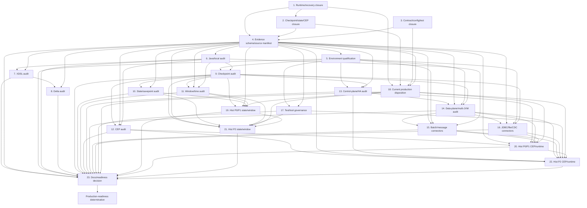

# nop-stream 独立深度审计路线图

> Last updated: 2026-08-08
> Sources: `ai-dev/analysis/2026-08/2026-08-06-nop-stream-audit-baseline-and-roadmap-analysis.md` (primary), `ai-dev/backlog/nop-stream-production-roadmap.md` (implementation ownership), `ai-dev/audits/nop-stream-production/2026-08-02-2107-*.md` (current confirmed findings)

## Purpose

本路线图独立验证 nop-stream 是否实现其设计目标和预计用途。它不重复 production roadmap 的建设工作，不把历史 `done` 或组件测试视为生产语义证明；每个审计项必须形成可复核的 capability evidence 和已发现问题的明确 owner。

Does not contain implementation details. Each `planned` stage is owned by its execution plan.

## Work Items

> **This is the only dynamic state block. Update status only here.**
> Work items 1-3 reference existing remediation plans. Their roadmap item becomes `done` only after the referenced plan has independent closure-audit evidence.

- 1. Coordinator、运行时并发与恢复缺陷收口: `planned`
- 2. Checkpoint、state backend 与 CEP 状态缺陷收口: `done`
- 3. 契约、IoC 配置与测试完整性缺陷收口: `done`
- 4. 审计 evidence schema、source-manifest 与 finding corpus: `done`
- 5. 审计环境资格与 gated-evidence 契约: `done`
- 6. Java API、graph 和 LOCAL execution 审计: `todo`
- 7. XDSL StreamModel 入口审计: `todo`
- 8. Delta StreamModel 入口审计: `todo`
- 9. Checkpoint、barrier 与恢复语义审计: `todo`
- 10. State backend、savepoint 与 rescale 审计: `todo`
- 11. Window、watermark 与 timer 审计: `todo`
- 12. CEP/NFA/SharedBuffer 审计: `todo`
- 13. Control plane、HA 与 fencing 审计: `todo`
- 14. Data plane 与真实多 JVM recovery 审计: `todo`
- 15. Batch/message connector capability 审计: `todo`
- 16. JDBC/file/CDC connector external-effect 审计: `todo`
- 17. 测试有效性与审计工具治理: `todo`
- 18. 当前 production finding disposition: `todo`
- 19. 历史 P0/P1 checkpoint/state/window finding disposition: `todo`
- 20. 历史 P0/P1 CEP/connector/runtime finding disposition: `todo`
- 21. 历史 P2 core/state/window finding disposition: `todo`
- 22. 历史 P2 CEP/connector/runtime finding disposition: `todo`
- 23. 文档契约与 production-readiness 判定: `todo`
- ★ 独立 production-readiness 判定（4-23 均完成且无未归属 P0/P1 或 required lane blocked）: not yet reached

## Status Values

| Status | Meaning |
| --- | --- |
| `todo` | Not started, no plan |
| `planned` | Has execution plan, passed independent draft review |
| `done` | Complete, passed closure audit |

## Framework / Platform Reuse

| Capability | Provider | Audit rule |
| --- | --- | --- |
| State/checkpoint storage | `ICheckpointStorage`, LocalFile/JDBC | Test failure, retention and recovery semantics, not class existence |
| State backend | Memory and `nop-stream-rocksdb` | Verify schema, key-group, incremental and cleanup paths |
| Control plane | `nop-rpc`, `IStream*RpcService` | Verify actual cross JVM invocation and fencing |
| Data plane | `IMessageService`, wire codec SPI | Verify record/barrier/watermark transport and backend limitations |
| HA/discovery | leader elector, ClusterRegistry, platform discovery | Verify leader transition and source-of-truth boundaries |
| Connectors | batch, JDBC, Debezium, file, message services | Verify declared guarantees against real source/sink behavior |
| Delta/XDSL | Nop XDSL and Delta loading | Verify same supported semantics as Java entry path |

## Current Baseline

**Implementation roadmap:** `ai-dev/backlog/nop-stream-production-roadmap.md` contains the current product construction history and many completed stages. It remains the owner of construction work.

**Blocking active work:**
- Items 1-3 map one-to-one to `ai-dev/plans/nop-stream-production/2026-08-04-2300-{1,2,3}-*.md`; all are active and must complete first.

**Audit baseline:**
- Design documents specify a broad target, but current-state statements conflict across documents.
- Historical audits show repeated hollow-implementation and test-effectiveness blind spots.
- Latest audit findings demonstrate that production issues remain after prior roadmap stages were marked done.
- Item 4 must freeze the source manifests, finding corpus, evidence-row schema, coverage rules and validators before any capability claim is audited. Each domain item owns enumeration and classification of its bounded manifest slice.
- Item 5 must qualify each external/gated environment before a later item can treat its result as completion evidence.

## Stages

| # | Stage | Owner plan | Deps | Critical path | Reuse |
| --- | --- | --- | --- | --- | --- |
| 1 | Runtime/recovery defect closure | `2026-08-04-2300-1-coordinator-runtime-concurrency-recovery-hardening.md` | — | **Yes** | existing mailbox/recovery design |
| 2 | Checkpoint/state/CEP defect closure | `2026-08-04-2300-2-checkpoint-state-backend-cep-correctness.md` | 1 | **Yes** | RocksDB, JDBC, CEP implementations |
| 3 | Contract/config/test defect closure | `2026-08-04-2300-3-contract-drift-config-test-integrity.md` | — | **Yes** | Nop IoC and existing test infrastructure |
| 4 | Evidence schema, source manifest and finding corpus | successor audit plan | 1, 2, 3 | **Yes** | analysis baseline and live code |
| 5 | Environment qualification and gated evidence | successor audit plan | 4 | **Yes** | existing multi-JVM and connector fixtures |
| 6 | Java API, graph and LOCAL execution audit | successor audit plan | 4 | **Yes** | core execution E2E fixtures |
| 7 | XDSL StreamModel entry audit | successor audit plan | 4, 6 | No | flow model and DSL fixtures |
| 8 | Delta StreamModel entry audit | successor audit plan | 4, 7 | No | Nop Delta fixtures |
| 9 | Checkpoint, barrier and recovery audit | successor audit plan | 4, 5, 6 | **Yes** | checkpoint fixtures |
| 10 | State backend, savepoint and rescale audit | successor audit plan | 4, 5, 9 | **Yes** | memory/RocksDB/key-group fixtures |
| 11 | Window, watermark and timer audit | successor audit plan | 4, 6, 9 | No | window/time fixtures |
| 12 | CEP/NFA/SharedBuffer audit | successor audit plan | 4, 6, 9 | No | CEP fixtures and fraud example |
| 13 | Control plane, HA and fencing audit | successor audit plan | 4, 5, 9 | **Yes** | RPC/leader-election fixtures |
| 14 | Data plane and multi-JVM recovery audit | successor audit plan | 4, 5, 9, 13 | **Yes** | MiniStreamCluster and IMessageService |
| 15 | Batch/message connector capability audit | successor audit plan | 4, 5, 6, 14 | No | batch and message connector fixtures |
| 16 | JDBC/file/CDC external-effect audit | successor audit plan | 4, 5, 9, 14 | No | JDBC/file/Debezium fixtures |
| 17 | Test effectiveness and audit-tool governance | successor audit plan | 4, 5 | No | audit tools and test inventory |
| 18 | Current production finding disposition | successor audit plan | 1, 2, 3, 4 | **Yes** | frozen current-production corpus |
| 19 | Historical P0/P1 checkpoint/state/window disposition | successor audit plan | 4, 9, 10, 11, 18 | No | frozen high-priority corpus slice |
| 20 | Historical P0/P1 CEP/connector/runtime disposition | successor audit plan | 4, 12, 13, 14, 15, 16, 18 | No | frozen high-priority corpus slice |
| 21 | Historical P2 core/state/window disposition | successor audit plan | 4, 9, 10, 11, 17, 18, 19 | No | frozen P2 corpus slice |
| 22 | Historical P2 CEP/connector/runtime disposition | successor audit plan | 4, 12, 13, 14, 15, 16, 17, 18, 20 | No | frozen P2 corpus slice |
| 23 | Documentation contract and readiness decision | successor audit plan | 4, 5, 6, 7, 8, 9, 10, 11, 12, 13, 14, 15, 16, 17, 18, 19, 20, 21, 22 | No | owner docs and evidence corpus |

> `Deps` lists direct hard prerequisites. The Mermaid graph below contains every direct dependency in this table; transitive reachability does not replace a listed direct edge.

### 1. Runtime/recovery defect closure

> Status: see Work Items above

**Goal:** Close the confirmed recovery race, InputGate ownership, permit accounting and zombie task defects before any readiness claim.

**Deliverables:** The active plan's focused concurrency tests, E2E recovery evidence and independent closure audit.

**Out of scope:** New audit findings not covered by the active plan.

**Module / area:** `nop-stream-core`, `nop-stream-runtime`.

### 2. Checkpoint/state/CEP defect closure

> Status: see Work Items above

**Goal:** Close the confirmed incremental state, JDBC persistence and SharedBuffer correctness defects.

**Deliverables:** The active plan's fail-fast, cleanup, PostgreSQL and CEP branching evidence plus closure audit.

**Out of scope:** Backlog P2 items unless reclassified by live evidence.

**Module / area:** `nop-stream-runtime`, `nop-stream-rocksdb`, `nop-stream-cep`.

### 3. Contract/config/test defect closure

> Status: see Work Items above

**Goal:** Make SPI/design claims, IoC discovery and retained tests truthful and executable.

**Deliverables:** The active plan's contract reconciliation, `_module` discovery test and meaningful test evidence.

**Out of scope:** Broad documentation rewrite beyond the identified contract drift.

**Module / area:** `nop-stream-core`, `nop-stream-runtime`, `ai-dev/design/nop-stream/`.

### 4. Audit evidence schema, source manifest and finding corpus

> Status: see Work Items above

**Goal:** Freeze the finite source manifests, finding corpus, evidence-row schema, classification vocabulary and validation rules before making any capability claim.

**Deliverables:** A bounded source-manifest containing exact paths, selection commands and expected denominators for Java public types/methods, XDSL nodes, Delta model surfaces, beans/SPI, connector factories/configuration, examples and test lanes; explicit inclusion/exclusion rules for generated source, `@Internal` SPI and example modules; a frozen finding corpus enumerating exact audit reports, finding IDs, anchors and totals, partitioned into items 18-22; evidence-row schema containing inventory ID, source/anchor, declared guarantee, implementation anchor, runtime wiring, positive proof, rejection proof, environment class, required-lane flag, finding ID and disposition; a validator that rejects missing/unknown fields and mismatched manifest/corpus counts; classifications `e2e-proved`, `component-only`, `unverified`, `fail-fast`, `non-goal`, `residual-risk`, `blocked`. Domain items 6-16 enumerate and classify only their assigned manifest slices.

**Out of scope:** Enumerating all capability rows, product implementation, or a readiness conclusion.

**Module / area:** all `nop-stream` modules and owner documentation.

### 5. Environment qualification and gated evidence

> Status: see Work Items above

**Goal:** Establish which test environments can produce reproducible audit evidence and how an unavailable external backend is honestly reported.

**Deliverables:** Qualification record for local unit/in-process integration, multi-JVM, H2/PostgreSQL, Kafka/Pulsar and Debezium lanes; exact invocation/precondition, provisioning/credential isolation/cleanup/timeout/artifact retention and owner; positive expected result; `blocked` disposition when a required service is unavailable; rule that a gated test is evidence only when actually executed in its qualified lane. The required-lane flag comes from the declared capability/guarantee in item 4's manifest. A domain audit may close with blocked rows only when its evidence rows classify them `blocked`; it may not classify them `e2e-proved`. Any required blocked row blocks item 23 from a ready verdict and blocks the readiness milestone.

**Out of scope:** Product correctness conclusions other than test-environment viability.

**Module / area:** test infrastructure, `nop-stream-runtime`, connector integration fixtures.

### 6. Java API, graph and LOCAL execution audit

> Status: see Work Items above

**Goal:** Verify Java API construction, graph/plan compilation and LOCAL execution from supported source to sink.

**Deliverables:** Source-to-sink traces for supported DataStream operations; graph/plan and operator lifecycle evidence; fan-out, partition and parallelism evidence; explicit equivalence criteria for topology, stable identity and recovery inputs; fail-fast proof for unsupported two-input/side-output forms.

**Out of scope:** XDSL/Delta entry behavior, checkpoint recovery, remote execution and connector guarantees.

**Module / area:** `nop-stream-core`, LOCAL runtime fixtures.

### 7. XDSL StreamModel entry audit

> Status: see Work Items above

**Goal:** Verify every supported `.stream.xml` construct compiles through the declared StreamModel path and preserves the supported Java execution semantics.

**Deliverables:** XDSL-node inventory disposition; XDSL-to-model-to-Java/graph trace; supported topology and stable-identity equivalence evidence; explicit fail-fast coverage for unsupported XDSL nodes.

**Out of scope:** Delta overlay behavior, distributed recovery and implementation changes.

**Module / area:** `nop-stream-flow`, `nop-stream-core`.

### 8. Delta StreamModel entry audit

> Status: see Work Items above

**Goal:** Verify the declared Delta overlay forms alter only supported StreamModel semantics and preserve the XDSL/Java contract where intended.

**Deliverables:** Delta-path inventory; model/fingerprint/topology and runtime effect evidence for each supported overlay form; explicit no-effect-by-design and fail-fast classifications.

**Out of scope:** New Delta features and connector behavior.

**Module / area:** `nop-stream-flow`, Delta fixtures and owner documentation.

### 9. Checkpoint, barrier and recovery audit

> Status: see Work Items above

**Goal:** Verify checkpoint lifecycle and recovery behavior independently of backend-specific state representation.

**Deliverables:** Expected-classification matrix for aligned, unaligned, multi-epoch and their supported/rejected combinations; barrier-to-manifest-to-recovery traces; abort/cancel and sink commit-cut evidence; explicit fail-fast evidence for unsupported combinations such as unaligned rescale.

**Out of scope:** State backend encoding, window/CEP semantic results and distributed leader/data-plane transport.

**Module / area:** `nop-stream-core`, `nop-stream-runtime`.

### 10. State backend, savepoint and rescale audit

> Status: see Work Items above

**Goal:** Verify memory/RocksDB state, savepoint compatibility, migration, incremental-state integrity and key-group rescale behavior.

**Deliverables:** State-type and backend matrix; full/incremental snapshot/restore evidence; schema/key-layout/migration rejection evidence; TTL/retention/segment cleanup dispositions; savepoint and supported rescale result evidence.

**Out of scope:** Barrier coordination, window output semantics and CEP matching behavior.

**Module / area:** `nop-stream-core`, `nop-stream-rocksdb`, `nop-stream-runtime` storage.

### 11. Window, watermark and timer audit

> Status: see Work Items above

**Goal:** Verify window result, watermark, pane and timer semantics, including recovery interaction.

**Deliverables:** Event/processing-time, session merge, trigger/evictor, late-data and timer checkpoint/restore evidence; explicit classification for dormant multi-input facilities without a supported consumer.

**Out of scope:** CEP NFA, state backend encoding and data-plane transport.

**Module / area:** `nop-stream-core`, window runtime implementation.

### 12. CEP/NFA/SharedBuffer audit

> Status: see Work Items above

**Goal:** Verify CEP public entry paths, NFA matching, timeout, skip strategies, SharedBuffer lifetime and checkpoint continuation.

**Deliverables:** Linear and branching-pattern evidence; overlapping release/refcount checks; watermark/processing-time timeout evidence; state recovery continuation evidence; fraud-example scope classification.

**Out of scope:** General window behavior and new CEP feature development.

**Module / area:** `nop-stream-cep`, `nop-stream-fraud-example`.

### 13. Control plane, HA and fencing audit

> Status: see Work Items above

**Goal:** Verify coordinator RPC, leader transitions, task assignment, fencing and global/region recovery control semantics.

**Deliverables:** Control-plane entry-to-effect traces; duplicate/recovery/race tests; leadership loss/regain and stale-command rejection evidence; local versus distributed recovery boundary.

**Out of scope:** Data-plane payload delivery and connector external effects.

**Module / area:** `nop-stream-runtime` coordinator, task manager and cluster packages.

### 14. Data plane and multi-JVM recovery audit

> Status: see Work Items above

**Goal:** Verify true process-boundary record, barrier and watermark delivery plus failure recovery using a qualified environment.

**Deliverables:** Deployment-descriptor reconstruction evidence; data-plane wire-codec/backend evidence; process kill/restart, stale-attempt fencing and recovered sink-result evidence; distinction from embedded tests.

**Out of scope:** Connector-specific source/sink guarantee claims.

**Module / area:** `nop-stream-runtime`, `nop-stream-core` transport, MiniStreamCluster fixtures.

### 15. Batch/message connector capability audit

> Status: see Work Items above

**Goal:** Verify batch and message connectors report only guarantees they can actually provide on qualified backends.

**Deliverables:** Per-connector source/sink capability matrix; replay/cursor/error/termination evidence; message backend limitation and fail-fast evidence; references to item 14 transport proof without re-auditing it.

**Out of scope:** JDBC/file transaction effects and CDC offset semantics.

**Module / area:** connector, connector-batch and message integration.

### 16. JDBC/file/CDC connector external-effect audit

> Status: see Work Items above

**Goal:** Verify transactional external effects and source offset recovery at real failure cuts.

**Deliverables:** JDBC/file 2PC commit/abort/retry evidence; CDC offset restore evidence; exact label validation for strict/effectively/at-least-once; external-system lane results from item 5.

**Out of scope:** Adding unsupported connectors or re-auditing generic data-plane transport.

**Module / area:** connector-jdbc, connector-debezium, connector file sink.

### 17. Test effectiveness and audit-tool governance

> Status: see Work Items above

**Goal:** Ensure the audit evidence itself is trustworthy and critical behavior has non-vacuous regression protection.

**Deliverables:** A finite critical-test registry derived from manifest slices used by items 6-16; one disposition for every registered disabled/gated/hollow test; a required negative or mutation-style control for each registered critical behavior; audit-tool positive controls that produce a known finding; test-environment evidence policy compliance.

**Out of scope:** Domain-specific result correctness already owned by items 6-16.

**Module / area:** all test trees and `ai-dev/tools/`.

### 18. Current production finding disposition

> Status: see Work Items above

**Goal:** Freeze and dispose of the current production audit corpus without confusing it with older audit eras.

**Deliverables:** Disposition for every row in item 4's frozen current-production corpus with finding ID, source path/anchor, severity, live-revalidation evidence, disposition, residual rationale and active/successor plan path; every row gets exactly one of `revalidated`, `stale`, `active/successor owner`, `residual-risk` or `blocked`.

**Out of scope:** Product changes except separately planned confirmed live defects.

**Module / area:** production audit records, active plans and live module code.

### 19. Historical P0/P1 checkpoint/state/window finding disposition

> Status: see Work Items above

**Goal:** Revalidate and dispose of the frozen historical P0/P1 corpus slice assigned to checkpoint, state and window/time.

**Deliverables:** Live revalidation and exactly one disposition for every item 4 corpus row in this technical slice; owner plan for every still-live defect; distinction between a fix that remains valid and a finding invalidated by later architecture change.

**Out of scope:** CEP/connector/runtime P0/P1, P2 corpus and documentation rewriting.

**Module / area:** historical audit summaries, completed-plan closure evidence and domain audit outputs.

### 20. Historical P0/P1 CEP/connector/runtime finding disposition

> Status: see Work Items above

**Goal:** Revalidate and dispose of the frozen historical P0/P1 corpus slice assigned to CEP, connector and runtime/distributed execution.

**Deliverables:** Live revalidation and exactly one disposition for every item 4 corpus row in this technical slice; owner plan for every still-live defect; distinction between a fix that remains valid and a finding invalidated by later architecture change.

**Out of scope:** checkpoint/state/window P0/P1, P2 corpus and documentation rewriting.

**Module / area:** historical audit records, CEP, connectors and runtime modules.

### 21. Historical P2 core/state/window finding disposition

> Status: see Work Items above

**Goal:** Dispose of the item 4 frozen P2 corpus slice assigned to core, state and window/time without silently accepting correctness or resource risks.

**Deliverables:** Live revalidation and exactly one disposition for every row in this bounded slice; every `residual-risk` includes explicit non-blocking rationale and owner/watch path; any P2 reclassified as live P0/P1 receives an active or successor plan.

**Out of scope:** CEP/connector/runtime P2 and implementing residual fixes not confirmed by revalidation.

**Module / area:** historical audit records, core, state and window modules.

### 22. Historical P2 CEP/connector/runtime finding disposition

> Status: see Work Items above

**Goal:** Dispose of the item 4 frozen P2 corpus slice assigned to CEP, connector and runtime/distributed execution.

**Deliverables:** Live revalidation and exactly one disposition for every row in this bounded slice; every `residual-risk` includes explicit non-blocking rationale and owner/watch path; any P2 reclassified as live P0/P1 receives an active or successor plan.

**Out of scope:** core/state/window P2 and implementing residual fixes not confirmed by revalidation.

**Module / area:** historical audit records, CEP, connector and runtime modules.

### 23. Documentation contract and readiness decision

> Status: see Work Items above

**Goal:** Reconcile owner documentation to independently proven capability rows and make a bounded readiness decision.

**Deliverables:** Owner-document manifest covering `docs-for-ai/INDEX.md`, `docs-for-ai/01-repo-map/module-groups.md`, `docs-for-ai/04-reference/source-anchors.md` and `ai-dev/design/nop-stream/*.md`; docs-for-ai/design/source-anchor corrections for proven contract drift; validator proving every manifest document was reviewed; readiness report listing all `e2e-proved`, `component-only`, `fail-fast`, `non-goal`, `residual-risk` and `blocked` rows; decision is `ready only for enumerated e2e-proved capability/environment pairs` or `not ready` with owners for blockers. A `ready` verdict is forbidden when any required-lane row remains `blocked`.

**Out of scope:** Rewriting completed historical plans solely for template conformance.

**Module / area:** `docs-for-ai/`, `ai-dev/design/nop-stream/`, evidence corpus.

## Dependency Graph

## Cross-Cutting Concerns

| Concern | Rule |
| --- | --- |
| Anti-hollow evidence | Each positive claim needs public entry, runtime wiring and result assertion. |
| Failure semantics | Checkpoint/connector/HA claims require fault injection or recovery evidence. |
| Environment | Clearly separate unit, in-process integration, gated external service and true multi-JVM results. |
| Documentation | Design is target-state evidence; docs-for-ai is usage contract; neither outranks live code for current behavior. |
| Finding ownership | Every historical P0/P1/P2 finding gets exactly one disposition; confirmed live P0/P1 require an active/successor plan, and P2 requires an explicit non-blocking rationale before residual acceptance. |
| Tool validity | Static scanners require a positive control before their zero-result output is accepted as evidence. |

## Rules

- This file is a state index and coarse decomposition, not an execution plan.
- Status changes occur only in the Work Items block.
- Items 1-3 retain their existing active plans; do not create duplicate remediation plans.
- Audit reports are evidence, not closure. A confirmed defect must be assigned to a new plan or an existing active plan.
- The production-readiness milestone is derived only when items 4-23 are done, no confirmed P0/P1 finding lacks an owner, and no required capability lane is blocked.
