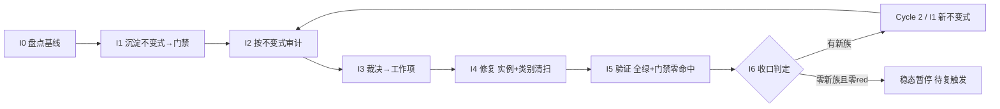

# nop-stream 不变式驱动的持续审计闭环（nop-stream Invariant-Driven Continuous Audit Loop）

> **产出方法**：`ai-dev/skills/invariant-loop-audit-prompt.md`（诊断→选型→拟制→共识审查）；待经独立 fresh session 审查至共识。
> **驱动方**：`missions/nop-stream-invariant-loop.json`（范围：nop-stream 全模块组；授权/commitFormat/Loop Rule 见该 mission description）
> **先例**：nop-chaos-flux 的 ai-invariant-loop-roadmap.md（docs/backlog 下，首个闭环先例，Cycle 1+2 完成后稳态暂停；该文件位于 nop-chaos-flux 独立 worktree，本仓库内不可解析——跨仓先例引用，非本仓文档链接）
> **与既有线性 roadmap 的关系**：`nop-stream-production-roadmap.md`（活跃建设，40/43 done）、`nop-stream-independent-audit-roadmap.md`（23 阶段 done）、`nop-stream-flink-comparison-roadmap.md`（16/21 done）均为**线性管道**——MG 产出为文档。本图为**闭环飞轮**——I6 产出为可执行 CI 门禁。两者不互斥：线性管道先行铺面，闭环飞轮后续治根。

## 目的

nop-stream 已被审计 **21 轮**（5 deep + 16 adversarial r1–r16）+ **23 阶段独立审计**，是 nop-entropy 全仓**被审计次数最多的模块**。每轮都在**同一家族的新路径**上发现缺陷——但**这些缺陷最终都被修了**（live code 已含修复）。问题不是"缺陷修不掉"，而是**"每族都要历经多轮审计才完整捕获全部兄弟实例"**：

- **WindowAggregationOperator 粘合层族**历经 R8（resolveKey 反向 / timestamp drop）→ R13（`#` 分隔符 / mergeWindow 覆写）→ R14（`:` 分隔符）→ R15（无 trigger.onMerge）→ R16（allowedLateness 死 API / multi-target add）**至少 7+ 个兄弟实例，横跨 5 轮审计**才逐步发现；
- **TwoPhaseCommitSinkFunction 并发族**：R16 AR-1（`saveState()` 无锁 → CME）+ R16 AR-11（`setPendingCommits()` 接受任意 Map）——R16 summary 自列"形成级联"；
- **Checkpoint ID/存储族**：R16 AR-5（idCounter 未更新）/ AR-10（checkpointSuccessMap 泄漏）/ AR-15（storage 按文件名排序）/ AR-16（CANCEL trigger）4 兄弟；
- **CEP/NFA/SharedBuffer 族**：R16 AR-6（清除非 start 状态）/ AR-7（DeweyNumber int 溢出）/ AR-8（Lockable 双重释放）/ AR-12（NFA 无界）+ R8 AR-66 共 5 兄弟；
- **ClusterRegistry 不一致族**：AR-9（JDBC 设 lease=0）+ AR-18（InMemory 忽略 per-renewal timeout）——"两个实现语义不一致"。

R16 summary 自身描述了"WindowAggregationOperator 粘合层"为质量风险：*"是否有其他参数被类似地遗忘传递？"*——**审计者自己标记了打地鼠模式**。

根因 = **"修实例不修类别"** + **反应式测试（per-bug）非穷举** + **零可执行不变式门禁**（`ai-dev/tools/check-nop-stream-audit-manifest.mjs` 57KB 仅验证审计证据 schema，不验证代码不变式）。

本路线图把修-漏-再修的循环**改造为自驱动飞轮**：把已知失败模式**沉淀为可执行不变式门禁**（入 CI，回归自动被抓）→ 按不变式**确定性审计**全部方法 → 裁决 → 修复（强制类别清扫）→ 新失败类再沉淀为新不变式。

## Loop Design（循环方法论，非 phase）

每个 Cycle 固定 7 步，I0 仅 Cycle 1 有：

```
I0 盘点基线 → I1 沉淀不变式(→门禁入CI) → I2 按不变式审计(跑门禁+对抗探查) → I3 裁决→工作项
    → I4 修复(实例+类别清扫+测试) → I5 验证(全绿+门禁零命中) → I6 收口(新失败类?→下轮 I1; 否则稳态)
```

- **自动化边界**：I1/I2/I5 的门禁部分完全自动化（CI 连续跑）；I2 的对抗探查 + I3 裁决为半自动（每轮一次）；I4 修复预授权 P0/P1 自动执行（同 audit-remediation 纪律）。
- **棘轮规则**：不变式门禁只增不减；弱化/豁免需人工确认并留痕。
- **稳态与复触发**：一轮 I2 零新违背且零新不变式类 → 循环暂停；触发复跑：① CI 任一不变式门禁变红；② nop-stream 核心类结构变更（新增/重命名 Operator/SinkFunction/Checkpoint 机制）；③ 周期复探（默认每 major release 或季度，取早）。

## Work Item Status

> 唯一动态状态区。状态流转：`todo` → `planned`（draft review 通过）→ `done`（closure audit 通过，不得提前）。

| Work Item | 交付范围 | 状态 | 依赖 |
| --- | --- | --- | --- |
| Cycle 1 / I0. 不变式盘点与基线 | 从 21 轮审计提取已知失败模式族 → 不变式目录（`ai-dev/audits/nop-stream-invariants/invariant-catalog.md`，每条：不变式陈述、覆盖失败族、历史审计证据 `finding-ID`/`文件:行`、检测方法）；确认基线 = 当前零代码不变式门禁；枚举全部变更型方法/类（Operator 族 / SinkFunction 族 / Checkpoint 机制 / CEP NFA / ClusterRegistry）作为审计目标集 | `done` | — |
| Cycle 1 / I1. 不变式沉淀（首批门禁） | 将首批不变式落为参数化穷举测试 + 门禁脚本 + 表完备性门禁。首批候选族（I0 确认后定稿）：① WindowAggregationOperator 构造参数完备性（每个构造器参数列表必须 round-trip 全部 WindowedStreamImpl 字段）；② Collections.synchronizedMap/Xxx 字段迭代点必须在 synchronized 块内；③ Checkpoint idCounter 更新原子性；④ CEP SharedBuffer/Lockable 释放对称性；⑤ ClusterRegistry 多实现语义一致性（lease timeout）。门禁入 CI（JUnit `@ParameterizedTest` + `ai-dev/tools/check-nop-stream-invariants.mjs`） | `done` | I0 |
| Cycle 1 / I2. 不变式驱动审计 | ① 跑 I1 门禁跨全部方法 → red list（确定性）；② 对抗探查聚焦门禁未表达盲区（新交错组合、refactor 引入新方法、跨 Operator 参数遗漏）；③ 标注每条发现属已知族或新族 | `done` | I1 |
| Cycle 1 / I3. 发现裁决与工作项拟制 | red list 逐条裁决（P0/P1/P2/P3）→ P0/P1 派 I4；新族派 Cycle 2 / I1（Loop Rule）；裁决表零悬挂 | `planned` | I2 |
| Cycle 1 / I4. 修复执行（实例 + 类别清扫 + 测试） | 强制类别清扫（修任一 Operator/SinkFunction 必 grep 全部同类兄弟）+ test-first（先红后绿）+ 不变式门禁复跑零命中；WindowAggregationOperator 族历史案例作为回归基线 | `todo` | I3 |
| Cycle 1 / I5. 全量验证与门禁零命中 | `./mvnw test -pl nop-stream -am -T 1C` + 门禁零命中 + 相关 e2e；full-green 记录 | `todo` | I4 |
| Cycle 1 / I6. 循环收口与下一轮触发判定 | 统计本轮门禁数/red list/新族数；有新族 → 派 Cycle 2（Loop Rule）；无新族且 red list 零 → 稳态暂停 + 登记复触发条件；closure 独立 fresh session | `todo` | I5 |

## Phase Details

### I0 — 不变式盘点与基线（仅 Cycle 1）

不变式目录 `ai-dev/audits/nop-stream-invariants/invariant-catalog.md`：每条不变式含「陈述 / 覆盖失败族 / 历史 audit-finding-ID 证据 / 检测方法（JUnit / 静态扫描 / ArchUnit）」。审计目标集 = nop-stream 全部变更型类/方法。

### I1 — 不变式沉淀（每 Cycle 一批门禁）

把不变式落为：① JUnit 5 `@ParameterizedTest`（方法/类表驱动，单文件集中）+ 表完备性门禁（新增类不入表即红）；② 静态可 grep 的不变式补 `ai-dev/tools/check-nop-stream-invariants.mjs` 扫描器；③ committed 回归测试。设计文档补「不变式」节。

### I2 — 不变式驱动审计

① 门禁跑全方法 → red list；② 对抗探查（`open-ended-adversarial-review-prompt.md`）聚焦盲区；③ 标注已知族或新族。

### I3 — 发现裁决

red list → P0/P1 入 I4；新族 → Cycle 2 / I1；P2/P3 入 Follow-up Backlog。裁决表零悬挂。

### I4 — 修复执行

类别清扫强制：修任一 Operator 必 grep 全部同类兄弟；test-first 先红后绿；门禁复跑零命中。

### I5 — 全量验证

`./mvnw test` + 门禁零命中 + e2e；full-green 记 `ai-dev/logs/`。

### I6 — 循环收口

统计门禁数/red list/新族数；稳态判定 + 复触发条件登记；closure 独立 fresh session。

## Dependency Graph



## Loop Rule（自动派生与稳态规则）

- **新族强制沉淀**：I2/I3 发现的任一"新失败类"→ I6 必须派生 Cycle N+1 / I1，**AI 可自动追加**（预授权，PD-n 先例链），追加时附「触发证据 = 发现 `文件:行` + 不变式陈述」回写本表。
- **棘轮**：已沉淀的不变式门禁只增不减；弱化/删除/豁免需人工确认 + 留痕 + committed 回归测试同步。
- **稳态暂停与复触发**：一轮零新族且 red list 零 → 稳态暂停；复触发三选一：① CI 该门禁变红；② nop-stream 核心类结构变更（新增/重命名 Operator/SinkFunction/Checkpoint 机制）；③ 周期复探。
- **类别清扫强制**：I4 修任一实例必须 grep 全类兄弟；只修报到的实例 = 未完成。
- **范围独立**：本图专注 nop-stream 不变式沉淀与防回退，与 `nop-stream-production-roadmap.md`（功能建设）/ `nop-stream-independent-audit-roadmap.md`（一次性深度审计）范围不重叠。

## Cross-Cutting

- **授权**：P0/P1 自动修复预授权（同 audit-remediation 先例）；结构性重构（公共 API、模块边界、Operator 接口变更）执行前人工确认；新不变式门禁入 CI 视为 check 脚本变更，需 committed 回归测试。
- **可推广性**：本方法论适用于任何有状态子系统。nop-metadata / nop-ai / nop-code 另立各自的 invariant-loop roadmap（范围独立）。
