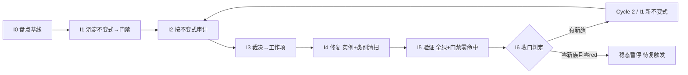

# nop-stream 不变式驱动的持续审计闭环（nop-stream Invariant-Driven Continuous Audit Loop）

> **产出方法**：`ai-dev/skills/invariant-loop-audit-prompt.md`（诊断→选型→拟制→共识审查）；待经独立 fresh session 审查至共识。
> **驱动方**：`missions/nop-stream-invariant-loop.json`（范围：nop-stream 全模块组；授权/commitFormat/Loop Rule 见该 mission description）
> **先例**：nop-chaos-flux 的 ai-invariant-loop-roadmap.md（docs/backlog 下，首个闭环先例，Cycle 1+2 完成后稳态暂停；该文件位于 nop-chaos-flux 独立 worktree，本仓库内不可解析——跨仓先例引用，非本仓文档链接）
> **与既有线性 roadmap 的关系**：`nop-stream-production-roadmap.md`（活跃建设，40/43 done）、`nop-stream-independent-audit-roadmap.md`（23 阶段 done）、`nop-stream-flink-comparison-roadmap.md`（16/21 done）均为**线性管道**——MG 产出为文档。本图为**闭环飞轮**——I6 产出为可执行 CI 门禁。两者不互斥：线性管道先行铺面，闭环飞轮后续治根。

## 目的

nop-stream 已被审计 **21 轮**（5 deep + 16 adversarial r1–r16）+ **23 阶段独立审计**，是 nop-entropy 全仓**被审计次数最多的模块**。每轮都在**同一家族的新路径**上发现缺陷——但**这些缺陷最终都被修了**（live code 已含修复）。问题不是"缺陷修不掉"，而是**"每族都要历经多轮审计才完整捕获全部兄弟实例"**：

- **WindowAggregationOperator 粘合层族**历经 R8（resolveKey 反向 / timestamp drop）→ R13（`#` 分隔符 / mergeWindow 覆写）→ R14（`:` 分隔符）→ R15（无 trigger.onMerge）→ R16（allowedLateness 死 API / multi-target add）**至少 7+ 个兄弟实例，横跨 5 轮审计**才逐步发现；
- **TwoPhaseCommitSinkFunction 并发族**：R16 AR-1（`saveState()` 无锁 → CME）+ R16 AR-11（`setPendingCommits()` 接受任意 Map）——R16 summary 自列"形成级联"；
- **Checkpoint ID/存储族**：R16 AR-5（idCounter 未更新）/ AR-10（checkpointSuccessMap 泄漏）/ AR-15（storage 按文件名排序）/ AR-16（CANCEL trigger）4 兄弟；
- **CEP/NFA/SharedBuffer 族**：R16 AR-6（清除非 start 状态）/ AR-7（DeweyNumber int 溢出）/ AR-8（Lockable 双重释放）/ AR-12（NFA 无界）+ R8 AR-66 共 5 兄弟；
- **ClusterRegistry 不一致族**：AR-9（JDBC 设 lease=0）+ AR-18（InMemory 忽略 per-renewal timeout）——"两个实现语义不一致"。

R16 summary 自身描述了"WindowAggregationOperator 粘合层"为质量风险：*"是否有其他参数被类似地遗忘传递？"*——**审计者自己标记了打地鼠模式**。

根因 = **"修实例不修类别"** + **反应式测试（per-bug）非穷举** + **零可执行不变式门禁**（`ai-dev/tools/check-nop-stream-audit-manifest.mjs` 57KB 仅验证审计证据 schema，不验证代码不变式）。

本路线图把修-漏-再修的循环**改造为自驱动飞轮**：把已知失败模式**沉淀为可执行不变式门禁**（入 CI，回归自动被抓）→ 按不变式**确定性审计**全部方法 → 裁决 → 修复（强制类别清扫）→ 新失败类再沉淀为新不变式。

## Loop Design（循环方法论，非 phase）

每个 Cycle 固定 7 步，I0 仅 Cycle 1 有：

```
I0 盘点基线 → I1 沉淀不变式(→门禁入CI) → I2 按不变式审计(跑门禁+对抗探查) → I3 裁决→工作项
    → I4 修复(实例+类别清扫+测试) → I5 验证(全绿+门禁零命中) → I6 收口(新失败类?→下轮 I1; 否则稳态)
```

- **自动化边界**：I1/I2/I5 的门禁部分完全自动化（CI 连续跑）；I2 的对抗探查 + I3 裁决为半自动（每轮一次）；I4 修复预授权 P0/P1 自动执行（同 audit-remediation 纪律）。
- **棘轮规则**：不变式门禁只增不减；弱化/豁免需人工确认并留痕。
- **稳态与复触发**：一轮 I2 零新违背且零新不变式类 → 循环暂停；触发复跑：① CI 任一不变式门禁变红；② nop-stream 核心类结构变更（新增/重命名 Operator/SinkFunction/Checkpoint 机制）；③ 周期复探（默认每 major release 或季度，取早）。

## Work Item Status

> 唯一动态状态区。状态流转：`todo` → `planned`（draft review 通过）→ `done`（closure audit 通过，不得提前）。

| Work Item | 交付范围 | 状态 | 依赖 |
| --- | --- | --- | --- |
| Cycle 1 / I0. 不变式盘点与基线 | 从 21 轮审计提取已知失败模式族 → 不变式目录（`ai-dev/audits/nop-stream-invariants/invariant-catalog.md`，每条：不变式陈述、覆盖失败族、历史审计证据 `finding-ID`/`文件:行`、检测方法）；确认基线 = 当前零代码不变式门禁；枚举全部变更型方法/类（Operator 族 / SinkFunction 族 / Checkpoint 机制 / CEP NFA / ClusterRegistry）作为审计目标集 | `done` | — |
| Cycle 1 / I1. 不变式沉淀（首批门禁） | 将首批不变式落为参数化穷举测试 + 门禁脚本 + 表完备性门禁。首批候选族（I0 确认后定稿）：① WindowAggregationOperator 构造参数完备性（每个构造器参数列表必须 round-trip 全部 WindowedStreamImpl 字段）；② Collections.synchronizedMap/Xxx 字段迭代点必须在 synchronized 块内；③ Checkpoint idCounter 更新原子性；④ CEP SharedBuffer/Lockable 释放对称性；⑤ ClusterRegistry 多实现语义一致性（lease timeout）。门禁入 CI（JUnit `@ParameterizedTest` + `ai-dev/tools/check-nop-stream-invariants.mjs`） | `done` | I0 |
| Cycle 1 / I2. 不变式驱动审计 | ① 跑 I1 门禁跨全部方法 → red list（确定性）；② 对抗探查聚焦门禁未表达盲区（新交错组合、refactor 引入新方法、跨 Operator 参数遗漏）；③ 标注每条发现属已知族或新族 | `done` | I1 |
| Cycle 1 / I3. 发现裁决与工作项拟制 | red list 逐条裁决（P0/P1/P2/P3）→ P0/P1 派 I4；新族派 Cycle 2 / I1（Loop Rule）；裁决表零悬挂 | `done` | I2 |
| Cycle 1 / I4. 修复执行（实例 + 类别清扫 + 测试） | 强制类别清扫（修任一 Operator/SinkFunction 必 grep 全部同类兄弟）+ test-first（先红后绿）+ 不变式门禁复跑零命中；WindowAggregationOperator 族历史案例作为回归基线。**执行结果（plan `2026-08-12-1217-5`）**：RL-1..7 全部修复（含 RL-3 backlog 触发闭合）；四族类别清扫证据在案；92 门禁 + 全量 `-am` 全绿；mjs pins 清零 | `done` | I3 |
| Cycle 1 / I5. 全量验证与门禁零命中 | `./mvnw test -pl nop-stream -am -T 1C` + 门禁零命中 + 相关 e2e；full-green 记录。**执行结果（plan `2026-08-12-1217-6`）**：2822 tests / 0 failures 全绿；mjs all exit 0（pins 0）；JUnit 9 门禁类 92 tests 0 failures；e2e 6/6 + 7/7；零新失败；full-green 记录 + `cycle1-I6-input.md` 落档（I6 输入唯一落点） | `done` | I4 |
| Cycle 1 / I6. 循环收口与下一轮触发判定 | 统计本轮门禁数/red list/新族数；有新族 → 派 Cycle 2（Loop Rule）；无新族且 red list 零 → 稳态暂停 + 登记复触发条件；closure 独立 fresh session。**执行结果（plan `2026-08-12-1217-7`）**：收口统计与 `cycle1-I6-input.md` 一致（2822 tests / 0 failures；门禁 9 类 / 92 tests；pin 0）；red list 零悬挂（7/7 + RL-3 闭合）；PD-15 裁定正式新族（输出契约族）→ Cycle 2 派生（I1–I6 六行）；跨 task side-output 缺口双层裁决（interim fail-fast 预授权分派 Cycle 2 / I4 + 线协议 `HG-01` 人工确认门）；复触发登记 | `done` | I5 |
| Cycle 2 / I1. 不变式沉淀（输出契约族门禁） | PD-15 输出契约族不变式 #6 沉淀为一等门禁并入 CI：JUnit `TestOutputContractInvariant`（全 main `Output` 实现类 `collect(OutputTag,X)` 行为三态穷举：转发 / fail-fast / 已知违约 pin）+ 类级枚举完备性（新增 main `Output` 实现类不入注册表即红）+ 发射点注册表（6 发射点全覆盖，新增即红）+ mjs `scan-output-contract` 子命令 + committed 回归测试；跨 task 已知违约实例以过渡 pin 登记（关联 `HG-01`，移除 = Cycle 2 / I4 interim fail-fast 落地后）。**触发证据（PD-15 先例链）**：不变式「任何 `Output.collect(OutputTag, X)` 调用必须被转发到注册的 side-output 消费者，不得静默丢弃；无注册消费者 → fail-fast」；发现 `文件:行` = `ChainingOutput.java:84-86`（原始丢弃点）→ live 发射点 `ProcessOperator.java:111/:134` / `WindowOperator.java:1030/:1860` / `CepOperator.java:483/:777`；派生说明 = I3 登记（adjudication-table.md §4 PD-15）→ I4 修复基线 `b20fcd0e1`（`ChainingOutput.java:111` 转发 + fail-fast）→ I6 裁定正式新族（adjudication-table.md §I6）。**执行结果（plan `2026-08-12-1217-8`）**：JUnit 门禁 10 类 / 102 tests / 0 failures（新增 TestOutputContractInvariant 10 用例）+ mjs `all` exit 0（scan-output-contract V1–V5）+ E2E 3/3；过渡 pin 2 条（RWO/BRWO，`HG-01` 关联，removalTrigger 在案）；`cycle2-I1-input.md` 落档（Cycle 2 统计唯一落点）；catalog #6 定稿 + core-design.md §6.1 不变式节 | `done` | I6 |
| Cycle 2 / I2. 不变式驱动审计 | ① 跑 I1 门禁跨全部 `Output` 实现类与发射点 → 确定性 red list；② 对抗探查聚焦门禁未表达盲区（透传目标敏感分类、嵌套类方法体解析、注册/接线时序）；③ 标注已知族或新族。**执行结果（plan `2026-08-12-1217-09`）**：mjs `all` exit 0（5 命令）+ JUnit 门禁 10 类 / 102 tests / 0 failures + E2E 3/3 + 全量 2832 tests / 0 failures；确定性 red list（C2-RL-1 RWO / C2-RL-2 BRWO / C2-RL-3 措辞过 claim）+ 2 条过渡 pin 复核均维持 + 聚焦探查 5 发现（C2-PR-1..5，无新独立族，2 个不变式扩展候选供 I6）；`red-list.md` 权威化（零悬挂）移交 I3；`cycle2-I2-probing-report.md` 新建落档 | `done` | I1 |
| Cycle 2 / I3. 发现裁决与工作项拟制 | red list 逐条裁决（P0/P1/P2/P3）→ P0/P1 派 I4（含跨 task interim fail-fast 预授权确认，I6 预裁决输入，见 adjudication-table.md §I6）；新族派 Cycle 3 / I1（Loop Rule）；裁决表零悬挂。**执行结果（plan `2026-08-12-1217-10`）**：裁决表 Cycle 2 节落档（adjudication-table.md §7-§10，8 条目零悬挂：C2-RL-1/2 = P1 派 I4（interim fail-fast，信封通过无人工确认门）/ C2-RL-3 = P3 backlog / C2-PR-1/2/5 = 关闭（非 defect）/ C2-PR-3/4 = P3 backlog）；interim fail-fast 预授权确认（§7.3 信封复核通过，WI-C2-1 派发六要素齐全含收尾三连）；无新族显式声明 + C2-PR-2/5 扩展候选移交 I6；Follow-up Backlog 新增 2 条；独立共识审查 8/8 PASS + closure audit 8/8 PASS | `done` | I2 |
| Cycle 2 / I4. 修复执行 | 跨 task interim fail-fast 修复（`RecordWriterOutput` / `BroadcastingRecordWriterOutput` `collect(OutputTag)` 空体 → 抛 `ERR_STREAM_SIDE_OUTPUT_NO_CONSUMER` 风格异常；类内部行为修复，private 嵌套类、`Output` 接口零变更，同 RL-7 先例）+ 注册表分类更新 + 过渡 pin 移除；test-first 先红后绿；类别清扫（全 `Output` 实现类兄弟）。**执行结果（plan `2026-08-12-1217-11`）**：RWO/BRWO `collect(OutputTag)` fail-fast 落地（`ERR_STREAM_SIDE_OUTPUT_NO_CONSUMER` + `ARG_OUTPUT_TAG`/`ARG_DETAIL`，commit `88bc0270c`）；注册表分类迁移 `pinned-known-violation` → `fail-fast`（含 `TimestampedCollector` disposition 同步）；过渡 pin 2 条移除（留痕在案）；JUnit 断言翻转 + 跨 task E2E 第 4 用例（RWO 1 writer + BRWO 2 writers，4/4 绿）；类别清扫零遗留（4 实现类 + 6 发射点 + 接线链）；门禁复跑零命中（JUnit 门禁子集 102 tests / 0 failures + mjs `all` exit 0 pins 0）+ core 1428 / runtime 805 全量回归绿；文档收口（core-design §6.1 / red-list / logs）；独立 closure audit 10/10 PASS | `done` | I3 |
| Cycle 2 / I5. 全量验证与门禁零命中 | `./mvnw test -pl nop-stream -am -T 1C` + 门禁零命中 + 相关 e2e；full-green 记录 + 下轮输入落档。**执行结果（plan `2026-08-12-1217-12`）**：全量 2833 tests / 0 failures 全绿（core 1428 / runtime 805 / cep 320 / rocksdb 83 / connector 35 / connector-jdbc 32 / connector-batch 35 / connector-debezium 19 / flow 51 / fraud-example 25）；mjs `all` exit 0（pin 0，无 unpinned / 无 stale）；JUnit 门禁 10 类 102 tests 0 failures（含 I4 翻转/新增用例）；e2e 复跑绿（`TestSideOutputChainingE2E` 4/4 含跨 task fail-fast 第 4 用例 + Window E2E 6/6 + 7/7）；零新失败；E2E 发射点覆盖事实核实在案（仅 WindowOperator:1030 有 E2E 覆盖，其余 5 发射点无——P3 backlog 处置不变，注册表措辞未改）；full-green 记录 + `cycle2-I6-input.md` 落档（I6 输入唯一落点） | `done` | I4 |
| Cycle 2 / I6. 循环收口 | 统计/稳态判定；`HG-01` 线协议支持如获人工批准另立 plan（Successor）；closure 独立 fresh session。**执行结果（plan `2026-08-12-1217-13`）**：收口统计与 `cycle2-I6-input.md` 一致（2833 tests / 0 failures；门禁 10 类 / 102 tests；pin 0 + mjs all exit 0）；red list 零悬挂（C2-RL-1/2 修复 `88bc0270c` + C2-RL-3 P3 已裁决）；新族数 = 0 → **稳态暂停**（C2-PR-2 / C2-PR-5 扩展候选均裁定维持稳态，显式依据见 adjudication-table.md §11）；`HG-01` 未获人工批准 → 维持 `pending human confirmation` 待办登记（四重保护性覆盖复核在案），不登记 Successor；复触发条件登记（三选一 + C2-PR-2 形态出现 + `HG-01` 人工批准）；独立 closure audit（fresh session）通过，evidence 写入 plan Closure 段 | `done` | I5 |
| Cycle 3 / I1. 不变式沉淀（生产 wiring 存在性门禁） | 将运行时服务注入完整性族不变式（不变式 #7）沉淀为一等门禁并入 CI：接线点注册表 `ai-dev/audits/nop-stream-invariants/wiring-registry.json`（服务注入 API × 生产接线点（文件:行 + 注入时机）× 消费方类枚举 × test-only 豁免）+ JUnit `TestWiringExistenceInvariant`（core：API 面完备性（新注入 API 不入表即红）+ 生产接线运行时连通断言（Rule #23）+ 无服务 fail-fast 行为）+ mjs `scan-wiring` 子命令（V1 仅测试注入检测（注入 API 在 main 零调用点即红）/ V2 消费方枚举完备性（新增 main getter 调用类不入表即红）/ V3 失效接线点 / V4 新注入 API / V5 失效消费方）+ committed 回归测试 + self-test fixtures。**触发证据（open-audit P0-01/P1-02 先例链）**：不变式「任何被 main 代码消费的运行时服务（`ProcessingTimeService` / `TimerServiceManager` / state backend / snapshot 回调等）注入 API 必须存在生产接线点；仅被测试代码注入（测试 mock 规避、生产零调用）→ 违约」；发现 `文件:行` = `CepOperator.java:347`（`open()` → `registerCacheStatisticsTimer` :356-368 → `getProcessingTimeService().getCurrentProcessingTime()` :366 生产路径 null NPE）与 `WindowOperator.java:479`（PT 窗口永不触发面）；测试规避机制 = 13 个测试类 mock 注入 + 私有静态 `setProcessingTimeService` 包装器；修复基线 = plan `2026-08-13-0132-1`（`StreamTaskInvokable.setupProcessingTimeServices` :456-477 生产接线）；派生说明 = roadmap Follow-up Backlog「生产 wiring 存在性不变式门禁沉淀（Cycle 3 / I1 派生候选）」条目（触发条件 = plan 1 执行收口后按 Loop Rule 评估，已满足，2026-08-13 正式派生）。**执行结果（plan `2026-08-13-0805-1`）**：JUnit 门禁 11 类 / 112 tests / 0 failures（新增 `TestWiringExistenceInvariant` 10 用例，先红后绿证据在案）+ mjs `all` exit 0（含 `scan-wiring` V1–V5，self-test 正反例覆盖）+ E2E 3/3 + 4/4（含 PT 无服务 fail-fast 断言复核）+ 全量 2895 tests / 0 failures；`cycle3-I1-input.md` 落档（Cycle 3 统计唯一落点）；catalog #7 定稿（已沉淀）+ core-design.md §6.1 不变式节；`internal-creation` 裁定（`setKeyedStateBackend`/`setOperatorStateBackend` main 零调用点 = design-intent 内部创建，V1 carve-out 附理由受棘轮约束，非静默豁免）；pin 0 | `done` | — |
| Cycle 3 / I2. 不变式驱动审计 | ① 跑 I1 门禁跨全部服务注入 API 与消费方类 → 确定性 red list（仅测试注入实例 / 接线点漂移 / 新消费方 / 行为漂移二分）；② 对抗探查聚焦门禁未表达盲区（checkpoint/watermark 服务同族"仅测试注入"实例复探（plan `2026-08-13-0132-1` Non-Blocking 登记，复探时评估）、注入/恢复时序组合面（open-audit 总评 P0-02 组合爆炸教训）、恢复路径行为盲区（open-audit 总评第 2 盲区）、`TimestampsAndWatermarksOperator` watch-only residual 复核）+ P2 backlog 触发条件评估（复探触发时评估适用项）；③ 标注每条发现属已知族（#7 wiring 族）或新族。**执行结果（plan `2026-08-13-0805-2`）**：门禁全绿无新违规（mjs all exit 0 六命令 + JUnit 11 类 112 tests 0 failures + pin 0 维持 + E2E 8/8）；注册表裁定 9/9 维持零漂移（7 API + 9 接线点 + 消费方 3 类 11 行 + internal-creation carve-out 复核成立）；同族复探 = checkpoint/watermark/其他 `set*Service` 零 P0-01 同形态新实例（plan `2026-08-13-0132-1` Non-Blocking 登记可闭合）+ `TimestampsAndWatermarksOperator` 守卫复核 plan 1 裁定成立；时序组合面/恢复路径核查无缺口；P2 触发评估 10+23 条完整在案（open-audit P2-01..08 触发 → C3-RL-4..8、P2-09 claim 过期（multi P0-01 已解决）、P2-10 不触发；multi P2-11/01/03/05 触发 → C3-RL-9、其余不触发维持 backlog）；red list 权威化 C3-RL-1..10 零悬挂移交 I3（`red-list.md` Cycle 3 / I2 版 + `cycle3-I2-probing-report.md` 落档，Cycle 2/1 历史版附录保留）；无新族候选（全部归属已知族 #7 或既有 backlog 批次）；独立 closure audit APPROVE | `done` | I1 |
| Cycle 3 / I3. 发现裁决与工作项拟制 | red list 逐条裁决（P0/P1/P2/P3）→ P0/P1 派 I4（按族组织 + 类别清扫范围 + 测试要求 + 收尾三连）；新族派 Cycle 4 / I1（Loop Rule，PD-n 先例链）；P2/P3 入 Follow-up Backlog；裁决表零悬挂。**执行结果（plan `2026-08-13-0805-3`）**：裁决表 Cycle 3 节落档（adjudication-table.md §12-§16，10 red list + 8 探查发现零悬挂：C3-RL-1/2/3 = 记录性关闭 / C3-RL-4/5/6/7/8/9 = **P2 升级登记 backlog**（C3-RL-8 经独立共识审查修正 P1→P2——触发面分析：size==1 ⟹ start state 无超时通知义务，对齐 I2「潜伏地雷」定性）/ C3-RL-10 = 关闭 + backlog 修订（multi P0-01 已解决）；**显式声明无 P0/P1 项 → I4 不立 plan**（直接进入 I5 或 I6 判定）；仅测试注入复探零新实例关闭（C3-PR-1）+ 守卫 residual 维持 watch-only（C3-PR-2）；无新独立族显式声明（§14，无 PD-16 派生登记，编号规则复核 max(14,15)+1=16）；Follow-up Backlog 升级 6 条（open-audit 8 + multi 4 条目内）+ 修订 1 条；独立共识审查（首轮 REJECT 2 Major 修复后重审 APPROVE-WITH-MINORS）+ closure audit APPROVE-WITH-MINORS（2 Minor 已处置） | `done` | I2 |
| Cycle 3 / I5. 全量验证与门禁零命中 | `./mvnw test -pl nop-stream -am -T 1C` + 门禁零命中 + 相关 e2e；full-green 记录 + 下轮输入落档。**执行结果（plan `2026-08-13-1040-1`）**：全量 2895 tests / 0 failures 全绿（core 1465 / runtime 821 / cep 327 / rocksdb 85 / connector 35 / connector-jdbc 32 / connector-batch 35 / connector-debezium 19 / flow 51 / fraud-example 25，skipped 10 既有环境依赖跳过；与 I1 全量回归基线精确一致）；mjs `all` exit 0（pin 0，无 unpinned / 无 stale，六命令 inventory / sync / scan-iterations / scan-output-contract / scan-wiring / self-test）；JUnit 门禁 11 类 112 tests 0 failures（含 I1 新增 `TestWiringExistenceInvariant` 10 用例，与 I1 门禁基线精确一致）；e2e 复跑绿（PT 3/3 + CEP 4/4 + Supervision 1/1 = 8/8）；backlog 触发评估零触发（纯验证无类别清扫动作）；零新失败（新族数 0，I3 §14 显式声明一致）；full-green 记录 + `cycle3-I6-input.md` 落档（I6 输入唯一落点，含计数口径 + Cycle 3 执行路径事实 I1→I2→I3→I5→I6） | `done` | I3 |
| Cycle 3 / I6. 循环收口与下一轮触发判定 | 收口统计确认（`cycle3-I6-input.md` 唯一落点 ↔ on-disk surefire）；red list 零悬挂确认（C3-RL-1..10 全裁决 + C3-PR-1..8 全处置）；按 Loop Rule 裁定 Cycle 4 / I1 派生与否；`HG-01` 状态复核与处置登记；复触发条件登记；roadmap 行追加 + 状态流转；独立 fresh session closure。**执行结果（plan `2026-08-13-1040-2`）**：收口统计与 `cycle3-I6-input.md` 一致（2895 tests / 0 failures；门禁 11 类 / 112 tests；pin 0 + mjs all exit 0 实测；报告 mtime 在 I5 执行窗口内）；red list 零悬挂（C3-RL-1..10 全裁决在案 + C3-PR-1..8 全处置；backlog 升级登记与 I3 §15 一致）；新族数 = 0 → **稳态暂停**（Cycle 4 不派生，显式依据见 adjudication-table.md §17.2——I3 §14 无新独立族 + I5 零新失败 + 门禁面完整 + 循环机器重量与收益不匹配）；`HG-01` 未获人工批准 → 维持 `pending human confirmation` 待办登记（四重保护性覆盖复核在案），不登记 Successor；复触发条件登记（三选一 + C3-RL-8 CEP 面触发条件 + C2-PR-2 形态出现 + `HG-01` 人工批准）；独立 closure audit（fresh session）通过，evidence 写入 plan Closure 段 | `done` | I5 |

## Phase Details

### I0 — 不变式盘点与基线（仅 Cycle 1）

不变式目录 `ai-dev/audits/nop-stream-invariants/invariant-catalog.md`：每条不变式含「陈述 / 覆盖失败族 / 历史 audit-finding-ID 证据 / 检测方法（JUnit / 静态扫描 / ArchUnit）」。审计目标集 = nop-stream 全部变更型类/方法。

### I1 — 不变式沉淀（每 Cycle 一批门禁）

把不变式落为：① JUnit 5 `@ParameterizedTest`（方法/类表驱动，单文件集中）+ 表完备性门禁（新增类不入表即红）；② 静态可 grep 的不变式补 `ai-dev/tools/check-nop-stream-invariants.mjs` 扫描器；③ committed 回归测试。设计文档补「不变式」节。

### I2 — 不变式驱动审计

① 门禁跑全方法 → red list；② 对抗探查（`open-ended-adversarial-review-prompt.md`）聚焦盲区；③ 标注已知族或新族。

### I3 — 发现裁决

red list → P0/P1 入 I4；新族 → Cycle 2 / I1；P2/P3 入 Follow-up Backlog。裁决表零悬挂。

### I4 — 修复执行

类别清扫强制：修任一 Operator 必 grep 全部同类兄弟；test-first 先红后绿；门禁复跑零命中。

### I5 — 全量验证

`./mvnw test` + 门禁零命中 + e2e；full-green 记 `ai-dev/logs/`。

### I6 — 循环收口

统计门禁数/red list/新族数；稳态判定 + 复触发条件登记；closure 独立 fresh session。

Cycle 1 / I6 裁定摘要（2026-08-12，plan `2026-08-12-1217-7`）：PD-15 输出契约族裁定正式新族 → 依 Loop Rule 派生 Cycle 2（I1–I6 六行已追加，I1 附触发证据）；跨 task side-output 缺口双层裁决 = interim fail-fast 预授权分派 Cycle 2 / I4（类内部行为修复，自动信封）+ 线协议结构性重构 = `HG-01` 人工确认门（执行门未过，登记待办，非延期非降级）；Cycle 2 / I1 门禁范围裁定（三态分类 + 类级枚举完备性 + call-site 注册表 + 过渡 pin）见 adjudication-table.md §I6；Cycle 2 触发原因 = 新族沉淀 + `HG-01` 人工确认门；复触发三选一继续生效。

Cycle 2 / I6 裁定摘要（2026-08-12，plan `2026-08-12-1217-13`）：收口统计与 `cycle2-I6-input.md` 一致（2833 tests / 0 failures；门禁 10 类 / 102 tests；pin 0 + mjs all exit 0 实测）；red list 零悬挂（C2-RL-1/2 修复 `88bc0270c` 在案 + C2-RL-3 P3 已裁决）；新族数 = 0 → **稳态暂停裁定**（C2-PR-2 / C2-PR-5 扩展候选均裁定维持稳态，显式依据见 adjudication-table.md §11——零实例 / 控制面非数据丢失 + `HG-01` 执行门未过 + 循环机器重量与收益不匹配）；`HG-01` 未获人工批准（全仓无批准记录）→ 维持 `pending human confirmation` 待办登记（四重保护性覆盖复核在案），不登记 Successor；复触发条件登记（三选一 + C2-PR-2 形态出现 + `HG-01` 人工批准），Cycle 2 循环暂停，roadmap I6 行 `done`（closure audit 通过后）。

Cycle 3 / I6 裁定摘要（2026-08-13，plan `2026-08-13-1040-2`）：收口统计与 `cycle3-I6-input.md` 一致（2895 tests / 0 failures；门禁 11 类 / 112 tests；pin 0 + mjs all exit 0 实测；on-disk surefire 逐模块一致 + 报告 mtime 在 I5 执行窗口内）；red list 零悬挂（C3-RL-1..10 全裁决在案——3 记录性关闭 + 6 P2 backlog 升级 + 1 关闭 + backlog 修订；C3-PR-1..8 全显式处置）；新族数 = 0 → **稳态暂停裁定**（Cycle 4 不派生，显式依据见 adjudication-table.md §17.2：I3 §14 显式无新独立族 + I5 零新失败 + C3-PR-2 watch-only residual 不构成派生输入 + 门禁面完整（11 类 / 112 tests + scan-wiring V1–V5）+ 循环机器重量与收益不匹配 + 复触发可覆盖）；Cycle 3 执行路径事实 = I1→I2→I3→I5→I6（I4 不立 plan）；`HG-01` 未获人工批准（全仓无批准记录）→ 维持 `pending human confirmation` 待办登记（四重保护性覆盖复核在案），不登记 Successor；复触发条件登记（三选一 + C3-RL-8 CEP 面触发条件 = I4/I5 类别清扫（CEP 面）或 per-state windowTimes 使用面扩展或复探 + C2-PR-2 形态出现 + `HG-01` 人工批准），Cycle 3 循环暂停。

## Dependency Graph



## Loop Rule（自动派生与稳态规则）

- **新族强制沉淀**：I2/I3 发现的任一"新失败类"→ I6 必须派生 Cycle N+1 / I1，**AI 可自动追加**（预授权，PD-n 先例链），追加时附「触发证据 = 发现 `文件:行` + 不变式陈述」回写本表。
- **棘轮**：已沉淀的不变式门禁只增不减；弱化/删除/豁免需人工确认 + 留痕 + committed 回归测试同步。
- **稳态暂停与复触发**：一轮零新族且 red list 零 → 稳态暂停；复触发三选一：① CI 该门禁变红；② nop-stream 核心类结构变更（新增/重命名 Operator/SinkFunction/Checkpoint 机制）；③ 周期复探。
- **Cycle 2 触发登记（2026-08-12，I6 落档）**：Cycle 2 触发原因 = 新族沉淀（PD-15 输出契约族，正式新族）+ 跨 task side-output 缺口（已确认契约缺口，执行门 = 人工确认待办 `HG-01`）。三选一复触发继续生效（① CI 任一不变式门禁变红；② nop-stream 核心类结构变更；③ 周期复探）；**人工确认待办的触发** = 人工批准跨 task side-output 线协议结构性变更（`HG-01`，登记见 Follow-up Backlog）。
- **Cycle 2 / I6 稳态登记（2026-08-12，I6 落档）**：Cycle 2 收口完成 → **稳态暂停**（零新族 + red list 零悬挂 + 门禁全绿：2833/0 全量 + 10 类 / 102 tests + mjs all exit 0）。C2-PR-2/5 扩展候选裁定 = 均维持稳态（显式依据见 adjudication-table.md §11，I3 §9 移交收口）。**复触发条件（循环重启）**：三选一继续生效——① CI 任一不变式门禁变红；② nop-stream 核心类结构变更（新增/重命名 Operator/SinkFunction/Checkpoint 机制/Output 实现类）；③ 周期复探（默认每 major release 或季度，取早）。**本 plan 新增触发**：C2-PR-2 形态出现（main 出现匿名 `new Output<>(){}` / `record ... implements Output` / raw `OutputTag` 声明）；C2-PR-5 = `HG-01` 人工批准跨 task 线协议变更（批准后评估不变式 #6 陈述扩展 + RWO/BRWO 控制面处理）。**人工确认待办触发** = 人工批准跨 task 线协议结构性变更（`HG-01`）。
- **Cycle 3 派生登记（2026-08-13，Loop Rule 预授权）**：触发来源 = open-audit（`2026-08-12-1217-open-audit-nop-stream-invariant-loop.md` P0-01/P1-02）新失败族「运行时服务注入完整性」→ plan `2026-08-13-0132-1` 以 Fix 修复（生产接线 `StreamTaskInvokable.setupProcessingTimeServices` :456-477 + `TimerServiceManager` 四环节 + CepOperator/WindowOperator 守卫）→ roadmap Follow-up Backlog 登记派生候选（触发 = plan 1 执行收口后按 Loop Rule 评估）→ plan 1 收口（2026-08-13）→ 触发条件满足，**正式派生 Cycle 3**（I1–I3 三行已追加，I1 附触发证据；I4–I6 待 I3 裁决后追加——I4 派发范围取决于 I2 red list，未知前不占位）。派生期间稳态暂停裁定不撤销（Cycle 3 是 Loop Rule 新族沉淀驱动的受限派生，非周期复探）；三选一复触发条件继续生效。
- **Cycle 3 / I6 稳态登记（2026-08-13，I6 落档）**：Cycle 3 收口完成 → **稳态暂停**（零新族 + red list 零悬挂 + 门禁全绿：2895/0 全量 + 11 类 / 112 tests + mjs all exit 0 + e2e 8/8）。裁定显式依据见 adjudication-table.md §17.2（I3 §14 无新独立族 + I5 零新失败 + 门禁面完整 + 循环机器重量与收益不匹配 + 复触发可覆盖）。**复触发条件（循环重启）**：三选一继续生效——① CI 任一不变式门禁变红；② nop-stream 核心类结构变更（新增/重命名 Operator/SinkFunction/Checkpoint 机制/Output 实现类）；③ 周期复探（默认每 major release 或季度，取早）。**Cycle 3 新增触发**：C3-RL-8 CEP 面触发条件（P2 backlog = I4/I5 类别清扫（CEP 面）或 per-state windowTimes 使用面扩展或复探时评估，roadmap P2-08 条目）；C3-RL-4..9 其余 backlog 维持既有触发条件；C2-PR-2 形态出现（main 出现匿名 `new Output<>(){}` / `record ... implements Output` / raw `OutputTag` 声明）；`HG-01` 人工批准（批准后另立跨 task 线协议 Successor plan）。**人工确认待办触发** = 人工批准跨 task 线协议结构性变更（`HG-01`）。
- **类别清扫强制**：I4 修任一实例必须 grep 全类兄弟；只修报到的实例 = 未完成。
- **范围独立**：本图专注 nop-stream 不变式沉淀与防回退，与 `nop-stream-production-roadmap.md`（功能建设）/ `nop-stream-independent-audit-roadmap.md`（一次性深度审计）范围不重叠。

## Cross-Cutting

- **授权**：P0/P1 自动修复预授权（同 audit-remediation 先例）；结构性重构（公共 API、模块边界、Operator 接口变更）执行前人工确认；新不变式门禁入 CI 视为 check 脚本变更，需 committed 回归测试。
- **可推广性**：本方法论适用于任何有状态子系统。nop-metadata / nop-ai / nop-code 另立各自的 invariant-loop roadmap（范围独立）。

## Follow-up Backlog

> P2/P3 findings adjudicated in Cycle 1 / I3 (`ai-dev/audits/nop-stream-invariants/adjudication-table.md` §1)。
> 已裁定处置（附依据即合规），不驱动独立修复计划；当 I4/I5 类别清扫或复探触发其适用场景时评估修复。Source audit paths preserved for traceability.

### `InMemoryClusterRegistry.renewLease()` ignores `leaseTimeoutMs` (R16-AR-18)

- **Source**: `ai-dev/audits/nop-stream-invariants/red-list.md` RL-3（2026-08-12 I2 权威版）(P2)
- **Description**: `InMemoryClusterRegistry.java:68-81` renewLease 只存 `now`（:74），忽略 per-renewal `leaseTimeoutMs` 参数；`:90/:98/:114` 活性计算全部用固定 `leaseTtlMs`（15s）→ InMemory（嵌入式/单机执行模式，`EmbeddedDistributedExecutor.java:134` / `RpcDistributedExecutor.java:191` 生产接线）语义与 JDBC 实现不一致，违反不变式 #5(b)。
- **Recommendation**: renewLease 记录 `now + leaseTimeoutMs` 并按参数计算活性；同步核对 `evictExpiredNodes`/`getActiveNodes`/`getNodeLease`。
- **Status**: ✅ 已由 I4 触发闭合（2026-08-12，plan `2026-08-12-1217-5` Phase 1，commit `fcc71fc05`）— renewLease 按 `leaseTimeoutMs` 参数计算过期时间（`InMemoryClusterRegistry.java:88-89`），getNodeLease/evictExpiredNodes/getActiveNodes 全部读存储 expireAt；翻转测试 `TestClusterRegistryConsistencyInvariant.testRenewLeasePerRenewalTimeoutIsPinnedPerImpl`（InMemory 分支）+ 新增 `testInMemoryRenewLeaseHonorsPerRenewalTimeout` 全绿。历史处置记录保留如上。

### 跨 task side-output 线协议结构性变更（人工确认待办 `HG-01`）

- **Source**: I6 裁定 `ai-dev/audits/nop-stream-invariants/adjudication-table.md` §I6（2026-08-12，plan `2026-08-12-1217-7`）；同族 PD-15 派生登记（§4）
- **Description**: `RecordWriterOutput.collect(OutputTag)`（`nop-stream-core/.../execution/StreamTaskInvokable.java:645` 空体）/ `BroadcastingRecordWriterOutput.collect(OutputTag)`（同文件 :706 空体）→ 多 vertex 部署下 task tail 算子（WindowOperator / CepOperator / ProcessOperator）发出的 side-output 静默丢弃——**已确认契约缺口**（P1，静默数据丢失，生产可达，同 RL-7 族）。接线路径：`GraphExecutionPlan.java:454-458`（fanOutWriters 构造 `StreamTaskInvokable`）→ `wireOperators`（`StreamTaskInvokable.java:239/:245`）/ `wireTailToRecordWriter`（:352）→ tail 算子 `setOutput(RecordWriterOutput / BroadcastingRecordWriterOutput)`。证据 = 6 发射点：`ProcessOperator.java:111/:134` / `WindowOperator.java:1030/:1860` / `CepOperator.java:483/:777`。
- **Recommendation（修复方向）**: RecordWriter 线协议结构性重构（跨 task side-output 序列化 / 路由 / 消费注册机制），公共内部机制变更 → 执行门 = 人工确认（mission Cross-Cutting：「结构性重构执行前人工确认」），不在自动修复信封内。
- **Status**: `pending human confirmation`（**Cycle 3 / I6 复核（2026-08-13，plan `2026-08-13-1040-2`）：全仓无人工批准记录 → 维持待办；四重保护性覆盖复核在案（in-task fail-fast `88bc0270c`/`b20fcd0e1` + 门禁类级枚举/call-site 注册表/三态分类 + pin 移除留痕 + 本待办条目）；不登记 Successor plan（执行门未过）**）
- **Successor**: 人工确认后另立 plan（跨 task 侧输出线协议设计 + 实现 + E2E）；触发条件 = 人工批准 + 跨 task side-output 需求出现（或 CI 门禁红暴露新实例）
- **保护性覆盖（四重留痕）**: ① in-task 路径已 fail-fast（I4 `b20fcd0e1`，`ChainingOperator` 无消费者抛 `ERR_STREAM_SIDE_OUTPUT_NO_CONSUMER`）；② Cycle 2 / I1 门禁（类级枚举完备性 + call-site 注册表 + 行为三态分类，新增实现类 / 新增发射点 / 行为漂移即红）；③ 过渡 pin 2 条（`mjs-pins.json`，关联 `HG-01`；移除 = Cycle 2 / I4 interim fail-fast 修复落地 + 注册表分类更新后，禁静默移除——`HG-01` 线协议支持落地属增强，不阻塞 pin 移除）；④ 本待办条目。interim fail-fast（空体 → 抛异常）属自动信封，预授权分派 Cycle 2 / I4，不入 backlog（记入 adjudication-table.md §I6）。

### 输出契约族审计证据准确性 + E2E 覆盖扩展（C2-RL-3 + C2-PR-4，P3 优化）

- **Source**: `ai-dev/audits/nop-stream-invariants/red-list.md` C2-RL-3（Cycle 2 / I2 权威版，2026-08-12）+ C2-PR-4（探查报告盲区 d）；裁决 = `ai-dev/audits/nop-stream-invariants/adjudication-table.md` §7.2/§10（Cycle 2 / I3）
- **Description**: 注册表 `output-contract-registry.json` emissionPoints 表 6 条中 5 条 disposition 写 "E2E covered by TestSideOutputChainingE2E"，实测该 E2E（3 用例）仅覆盖 `WindowOperator.java:1030`（late-data 路径）——`ProcessOperator.java:111/:134`、`WindowOperator.java:1860`、`CepOperator.java:483/:777` 共 5 个发射点无 E2E 覆盖（单元层亦无 OutputTag 发射断言）。措辞过 claim = 审计证据可追溯性质量问题（非代码缺陷，mjs 不消费 disposition 字段）。
- **Recommendation**: 修订注册表措辞为实际覆盖范围 与/或 扩展 `TestSideOutputChainingE2E` 覆盖 6 发射点全路径（ctx.output / ProcessWindowFunction / PatternProcessFunction）。
- **Status**: `todo`（已裁定处置附依据，不驱动独立修复计划；触发条件 = I4 类别清扫或复探时评估）

### side-output 消费者重复注册语义（C2-PR-3，P3 优化）

- **Source**: `ai-dev/audits/nop-stream-invariants/cycle2-I2-probing-report.md` C2-PR-3（2026-08-12）；裁决 = `ai-dev/audits/nop-stream-invariants/adjudication-table.md` §7.2/§10（Cycle 2 / I3）
- **Description**: 同一 `OutputTag` 第二次注册消费者时 `sideOutputConsumers.put` last-wins 静默覆盖前一消费者（`ChainingOutput.java:67-69` / `StreamTaskInvokable.java:310-313`），无 fail-fast / 无合并 / 无广播语义。不违反不变式 #6（仍转发到"一个"注册消费者，无静默丢弃）；生产当前无重复注册调用面。
- **Recommendation**: 重复注册 fail-fast 或广播语义（多 sink 场景），优化候选。
- **Status**: `todo`（已裁定处置附依据，不驱动独立修复计划；触发条件 = 多消费者接线需求出现或类别清扫时评估）

### 2026-08-13 P2 批次（open-audit `2026-08-12-1217-open-audit-nop-stream-invariant-loop.md`，10 条）

> P2 findings from the 2026-08-13 open-ended adversarial audit. Adjudicated per mission rule: no P2-only plan; trigger evaluation on category sweep / re-probe. Source audit paths preserved for traceability.

- **[P2-01] checkpointSuccessMap abort/fail 路径无界增长** — Source: `ai-dev/audits/2026-08-12-1217-open-audit-nop-stream-invariant-loop.md` P2-01 — abort/persist-fail 且无 failedCommitParticipants 的 epoch 永久驻留 `CheckpointCoordinator.java:1091-1092`（R16-AR-10 只清了成功路径）；建议 abort/fail 通知后移除条目或带上限/定期裁剪 — Status: `todo`（触发：abort 高频场景复探或类别清扫）。**升级登记（2026-08-13，Cycle 3 / I2 触发确认 + I3 裁决）**：触发确认（C3-RL-4，live :1117 put / fail、abort 路径无 remove）；裁决 **P2** → backlog 维持（资源泄漏/健壮性，无数据丢失，adjudication-table.md §12.2）
- **[P2-02] onCompletePersistFailure 不完成 PendingCheckpoint future** — Source: 同上 P2-02 — 持久化失败被伪装成超时（`CheckpointCoordinator.java:821-831` 只设状态不 complete future；`triggerFinalCheckpoint` catch 后仅 LOG 不重抛）；建议段 3b 调 `pending.fail(...)`、终态 checkpoint 失败重抛 — Status: `todo`。**升级登记（2026-08-13，Cycle 3 / I2 触发确认 + I3 裁决）**：触发确认（C3-RL-4，live :826 绕过 pending.fail()，future 消费者 JobCoordinator :1439+ / GraphModelCheckpointExecutor :353）；裁决 **P2** → backlog 维持（失败路径健壮性，最终仍超时失败无错误结果，adjudication-table.md §12.2）
- **[P2-03] InMemoryClusterRegistry.getNodeLease 无锁双 map 读 NPE** — Source: 同上 P2-03 — `InMemoryClusterRegistry.java:98-108` 与 `evictExpiredNodes` 并发时拆箱 NPE（`getActiveNodes` :130-134 有防御）；建议补 null 防御或锁内读 — Status: `todo`。**升级登记（2026-08-13，Cycle 3 / I2 触发确认 + I3 裁决）**：触发确认（C3-RL-4，live :104 自动拆箱 NPE；**main 零调用方 = 潜伏**）；裁决 **P2** → backlog 维持（边界/潜伏并发缺陷，生产无触发路径；未来生产消费方出现则升格 P1，adjudication-table.md §12.2）
- **[P2-04] WindowOperator.triggerAccumulators 永不裁剪 + 纯 FIRE 不调 clear()** — Source: 同上 P2-04 — `WindowOperator.java:1944-1957` 只增不删；:707-717 纯 FIRE 不清；建议 cleanup 路径同步删 `trigger_*` 条目、合并路径迁移 — Status: `todo`。**升级登记（2026-08-13，Cycle 3 / I2 触发确认 + I3 裁决）**：触发确认（C3-RL-5，live 重定位 :2043-2071 只增不删 + 纯 FIRE :722-727/:755-760 不 clear）；裁决 **P2** → backlog 维持（资源泄漏/边界，adjudication-table.md §12.2）
- **[P2-05] 带 evictor 的 descriptor 路径不建 elementTimestampsState** — Source: 同上 P2-05 — `WindowOperator.java:442-453` 仅 null-descriptor 分支创建 → `TimeEvictor` 永不驱逐（:1230-1233 早退）；建议 descriptor 路径同样创建或并入内容状态 — Status: `todo`。**升级登记（2026-08-13，Cycle 3 / I2 触发确认 + I3 裁决）**：触发确认（C3-RL-6，live 重定位 :451-462/:1337 早退）；裁决 **P2** → backlog 维持（TimeEvictor 标 @Internal，语义静默失效无数据丢失，adjudication-table.md §12.2）
- **[P2-06] 合并路径 pane 跟踪键与实际窗口/状态窗口错位** — Source: 同上 P2-06 — `WindowOperator.java:917-943/:681-683` pane 按 actual window、清除按 stateWindow → 泄漏 + DISCARDING 清错命名空间；建议统一命名空间基准 — Status: `todo`。**升级登记（2026-08-13，Cycle 3 / I2 触发确认 + I3 裁决）**：触发确认（C3-RL-7，live 重定位 :965-995 vs :729-731 键基准差异）；裁决 **P2** → backlog 维持（合并窗口边界场景资源泄漏，adjudication-table.md §12.2）
- **[P2-07] 合并路径 purge 跳过 triggerContext.clear()** — Source: 同上 P2-07 — `WindowOperator.java:681-683` vs `:714-717` 不对称；建议补 clear() — Status: `todo`。**升级登记（2026-08-13，Cycle 3 / I2 触发确认 + I3 裁决）**：触发确认（C3-RL-7，live :729-731 vs :762-765 不对称）；裁决 **P2** → backlog 维持（合并窗口边界场景，adjudication-table.md §12.2）
- **[P2-08] CepOperator STEP-5 超时基准错误 + 绕过 TimedOutPartialMatchHandler** — Source: 同上 P2-08 — `CepOperator.java:540-554` 用 startTimestamp + wt 判定；建议改 previousTimestamp + `isStateTimedOut` 语义并走超时通知路径 — Status: `todo`。**升级登记（2026-08-13，Cycle 3 / I2 触发确认 + I3 裁决）**：触发确认（C3-RL-8，live 重定位 :563-592/:636-660，:573/:646 基准错误 + :579-591 清理绕过 processTimedOutSequences）；裁决 **P2** → backlog 维持（独立共识审查修正：size==1 ⟹ 唯一 partial match 为 start state（NFA.java:736-747 无条件重建），start state 按 NFA 语义无超时通知义务、惰性清理 → 无用户可见丢失场景；真实影响面 = 恢复快照 skip-strategy 裁剪后单非 start 匹配 + per-state window 边角 → 边界/潜伏 = P2，对齐 I2「潜伏地雷」定性；触发条件 = I4/I5 类别清扫（CEP 面）或 per-state windowTimes 使用面扩展或复探，adjudication-table.md §12.2）
- **[P2-09] 前次 multi-audit 发现复核：全部仍 live 未修复（引用级）** — Source: 同上 P2-09（引用 `2026-08-12-1217-multi-audit-nop-stream-invariant-loop.md` P0-01/P1-01/P2-01~23）— 无独立动作：multi-audit P0-01/P1-01 已由 plan `2026-08-13-0132-3` 承接，其余 P2 见本 backlog 各条 — Status: `todo`（触发：plan 3 执行中核对）。**修订（2026-08-13，C3-RL-10）**：claim 过期——multi P0-01（merge fail-fast 零回归测试）触发条件已解决（`TestWindowOperatorCorrectness.java:551-585/:607-625` 2 处实例化 + 2 个 assertThrows 用例在案，C3-PR-7）；本条目处置记录关闭（非缺陷），不再需要独立核对动作
- **[P2-10] mjs scan-output-contract V4 盲区：嵌套泛型 OutputTag 声明逃逸** — Source: 同上 P2-10 — `ai-dev/tools/check-nop-stream-invariants.mjs:795-808` 正则 `[^>]*` 不支持 `OutputTag<List<X>>`；建议括号配对式解析 + self-test 补 fixture — Status: `todo`

### 2026-08-13 P2 批次（multi-audit `2026-08-12-1217-multi-audit-nop-stream-invariant-loop.md`，21 条）

> P2 findings from the 2026-08-13 multi-dimensional audit. Source audit paths preserved for traceability.

- **[P2-01] WindowOperator keySerializer/windowSerializer 死字段 + dummy serializer createInstance() 返回 null** — Source: `ai-dev/audits/2026-08-12-1217-multi-audit-nop-stream-invariant-loop.md` P2-01 — `WindowOperator.java:151/:161` 零消费；`WindowOperatorFactoryImpl.java:137-143` 反射失败静默返回 null 违反 TypeSerializer 契约；建议三选一（消费 / fail-fast / 删字段+门禁登记 exclusion）— Status: `todo`。**升级登记（2026-08-13，Cycle 3 / I2 触发确认 + I3 裁决）**：触发确认（C3-RL-9，live 重定位 :151/:161 死字段 + :166-171 createDummySerializer 返 null）；裁决 **P2** → backlog 维持（边界/潜伏契约违约，adjudication-table.md §12.2）
- **[P2-02] 142 处裸 IllegalArgumentException/IllegalStateException/UnsupportedOperationException** — Source: 同上 P2-02 — flow DSL 公共入口高发（`StreamModelDslBuilder.java:88-432` 24 处等）；建议统一 `StreamRuntimeException` 或登记豁免，优先 flow builder — Status: `todo`
- **[P2-03] RocksDBKeyedStateBackend 打开期临时 Options 未关闭** — Source: 同上 P2-03 — `RocksDBKeyedStateBackend.java:195-201`；建议 `try (Options ...)`（同文件 :150 正确写法对照）— Status: `todo`。**升级登记（2026-08-13，Cycle 3 / I2 触发确认 + I3 裁决）**：触发确认（C3-RL-9，live 重定位 :206-210 无 try-with-resources vs RocksDBIncrementalRestore :151 正确写法）；裁决 **P2** → backlog 维持（原生资源泄漏，adjudication-table.md §12.2）
- **[P2-04] JdbcCheckpointStorage 通用回退路径裸 RuntimeException** — Source: 同上 P2-04 — `JdbcCheckpointStorage.java:747-750`；建议 `NopException.adapt(e)` 或 `StreamException(ERR_STREAM_CHECKPOINT_ERROR, e)` — Status: `todo`
- **[P2-05] GraphModelCheckpointExecutor 1595 行静态上帝类** — Source: 同上 P2-05 — 执行/恢复职责混合；建议拆分或区域注释 — Status: `todo`。**升级登记（2026-08-13，Cycle 3 / I2 触发确认 + I3 裁决）**：触发确认（C3-RL-9，live 1728 行）；裁决 **P2** → backlog 维持（架构/维护性；重构 = 结构性重构需人工确认，不入 I4 自动信封，adjudication-table.md §12.2）
- **[P2-06] FollowKind.java main javadoc 中文** — Source: 同上 P2-06 — `FollowKind.java:12-18`；建议翻译 — Status: `todo`
- **[P2-07] TestTaskDeploymentDescriptor.defaultConstructorAndSettersInteract 纯 set/get 往返** — Source: 同上 P2-07 — `TestTaskDeploymentDescriptor.java:90-113`；建议删除或 `@Tag("low-value")` — Status: `todo`
- **[P2-08] partitionedPlanEdgePlanIsSerializable 名字声称序列化实际无** — Source: 同上 P2-08 — `TestTaskDeploymentDescriptor.java:115-121`；建议真实序列化往返或删除 — Status: `todo`
- **[P2-09] 测试命名与内容不符遗留 + 近重复测试** — Source: 同上 P2-09 — `TestCepOperatorTimeout.java:94-115` / `TestCepPatternBuilder.java:90-113` 等；建议按行为改名、近重复参数化 — Status: `todo`
- **[P2-10] @Tag("low-value") 应用不一致 + surefire 无 excludedGroups** — Source: 同上 P2-10 — 约 90-120 个镜像测试仅标 33 个；建议批量打标或删除 — Status: `todo`
- **[P2-11] 两 beans.xml 声明同一 bean id streamMessageService** — Source: 同上 P2-11 — `stream-control-rpc.beans.xml:34-35` / `stream-data-plane.beans.xml:68-69`；建议移除重复声明或加互斥 + 注释（与 plan `2026-08-13-0132-3` Phase 1 相邻，执行时评估）— Status: `todo`。**升级登记（2026-08-13，Cycle 3 / I2 触发确认 + I3 裁决）**：触发确认（C3-RL-9，live :34（control-rpc）+ :38/:68（data-plane）同容器双加载冲突成立）；裁决 **P2** → backlog 维持（配置健壮性/边界，adjudication-table.md §12.2）
- **[P2-12] fraud-example 引用未定义 bean transactionSourceFunction** — Source: 同上 P2-12 — `fraud-detection.stream.xml:31-34`；建议补 beans.xml 注册或改内联 XPL + 注明 — Status: `todo`
- **[P2-13] import 分组分裂 + code-style.md 与 AGENTS.md 矛盾** — Source: 同上 P2-13 — `code-style.md:17` 与 AGENTS.md 方向相反；建议先修文档矛盾再批量收敛 — Status: `todo`
- **[P2-14] StreamControlRpcServer javadoc 语病 + 裸 RuntimeException 包装** — Source: 同上 P2-14 — `StreamControlRpcServer.java:49/:124`；建议改 "Builds a control-plane RPC server without starting it." + `StreamRuntimeException` — Status: `todo`
- **[P2-15] CEP 错误码常量名与 code 不一致** — Source: 同上 P2-15 — `NopCepErrors.java:27-29` `ERR_CEP_NOT_CONDITION_DOES_NOT_SUPPORT_GROUP` vs `nop.err.cep.follow-not-does-support-group`；建议统一（code 串属公共 API 需谨慎）— Status: `todo`
- **[P2-16] 同一测试类两 beans.xml 注册不同 id** — Source: 同上 P2-16 — `test-smoke.beans.xml:14-15` / `test-reduce-pipeline.beans.xml:18-19`；建议 `advancedCollectingSinkFunction`（测试查找点改 1 行）— Status: `todo`
- **[P2-17] BeanFunctionResolver 缺 I 前缀** — Source: 同上 P2-17 — `BeanFunctionResolver.java:20`；建议 `IBeanFunctionResolver`（3 实现类 + 2 测试 + 文档）— Status: `todo`
- **[P2-18] INDEX.md:219 缺 connector-jdbc / rocksdb 两模块** — Source: 同上 P2-18 — `docs-for-ai/INDEX.md:219`；建议补上 — Status: `todo`
- **[P2-19] OutputTag javadoc 示例不可编译** — Source: 同上 P2-19 — `OutputTag.java:31-44`；建议重写为 `new OutputTag<>("late-data", TypeInformation.of(Long.class))` — Status: `todo`
- **[P2-20] STRM-026 锚点状态机 5 态 vs 实际 9 态** — Source: 同上 P2-20 — `source-anchors.md:210` vs `SubtaskTask.java:35-47`；建议补全或注明简化视图 — Status: `todo`
- **[P2-21] INDEX.md:219 nop-stream-flow "流控"措辞不准确** — Source: 同上 P2-21；建议改 "XDSL StreamModel 声明式编排（Delta 定制）" — Status: `todo`
- **[P2-22] module-groups.md:23 检查点存储抽象归属错误** — Source: 同上 P2-22 — 抽象接口在 core（ICheckpointStorage 等），文档归 runtime；建议修订 — Status: `todo`
- **[P2-23] IWindowOperatorFactory 反射类名契约未记录** — Source: 同上 P2-23 — `WindowedStreamImpl.java:154-177` 硬编码 `io.nop.stream.runtime.operators.windowing.WindowOperatorFactoryImpl`；建议 source-anchors 或 module-groups 补说明 — Status: `todo`

### ✅ 生产 wiring 存在性不变式门禁沉淀（Cycle 3 / I1，2026-08-13 plan `2026-08-13-0805-1` 收口）

- **Source**: open-audit 总评建议（`ai-dev/audits/2026-08-12-1217-open-audit-nop-stream-invariant-loop.md`「本次审核盲区」§1）；由 plan `2026-08-13-0132-1` Deferred But Adjudicated 登记（roadmap Loop Rule 派生候选）
- **Description**: 新失败族（运行时服务注入完整性）——`ProcessingTimeService` 在 main 代码零接线导致 CepOperator open NPE / PT 窗口永不触发，且测试全部经 mock 注入规避。建议沉淀"生产 wiring 存在性"门禁（如服务接线点注册表：`setProcessingTimeService` 等必须存在生产调用点，新增依赖该服务的调用即红——仿 V1 类级枚举思路）。
- **处置（closed，2026-08-13）**：不变式 #7 已沉淀为一等门禁并入 CI——接线点注册表 `wiring-registry.json`（7 服务注入 API × 生产接线点（文件:行 + 注入时机）× 消费方枚举 × disposition × test-only 豁免）+ JUnit `TestWiringExistenceInvariant`（core，10 用例：注册表驱动参数化 API 面完备性（参数类型过滤）+ 接线运行时连通断言 + 消费方表自洽）+ mjs `scan-wiring`（V1–V5：仅测试注入检测 / 消费方枚举完备性 / 失效接线点 / 新注入 API / 失效消费方）+ self-test 正反例 + `all` 纳入；`internal-creation` 裁定（`setKeyedStateBackend`/`setOperatorStateBackend` = design-intent 内部创建，V1 carve-out 附理由受棘轮约束）；门禁全绿（JUnit 11 类 / 112 tests / 0 failures + mjs `all` exit 0（pin 0）+ E2E 3/3 + 4/4 + 全量 2895 tests / 0 failures）；`cycle3-I1-input.md` 落档；catalog #7 定稿 + core-design.md §6.1 不变式节。
- **残余**：checkpoint / watermark 服务同族"仅测试注入"实例复探 = **已闭合（2026-08-13，Cycle 3 / I2 plan `2026-08-13-0805-2` C3-PR-1：零 P0-01 同形态新实例，逐服务结论在 `cycle3-I2-probing-report.md`）**；`TimestampsAndWatermarksOperator` 静默守卫形态复核 = **已复核（C3-PR-2：plan 1 裁定「接线后自然失效，语义不破坏」成立，维持 watch-only residual）**。

### ✅ 运行时服务注入完整性修复（P0-01 / P1-02，2026-08-13 plan `2026-08-13-0132-1` 收口）

- **Source**: `ai-dev/audits/2026-08-12-1217-open-audit-nop-stream-invariant-loop.md` P0-01（CepOperator open 生产路径 NPE）/ P1-02（PT 窗口永不触发 + 状态无界）——新失败族（运行时服务注入完整性）
- **处置（closed，2026-08-13）**：`ProcessingTimeService` 生产接线落地——`StreamTaskInvokable` 构造函数无条件注入 `TaskProcessingTimeService` + `TimerServiceManager`（先于任何 operatorChain.open），`ProcessingTimeServiceDriver`（daemon）在 `invoke()` 启动处 start、finally shutdown，mailbox 投递 fire mail 在 task 线程执行回调；`WindowOperator.open()` 补 `registerTimerService`（TimerServiceManager 四环节生产连通）；CepOperator null 守卫 + WARN + PT 模式显式失败；PT 窗口生产驱动 E2E + cleanup 验证（`numProcessingTimeTimers()==0` + `window-contents` 空）+ 新 PTS/驱动单测（Rule #25）。全量回归绿（`./mvnw test -pl nop-stream -am -T 1C`：core 1448 / runtime 807 / cep 324 / 其余 0 失败）；mjs `all` exit 0（output-contract 注册表行号已同步）；hollow scan exit 0。测试证据：`TestCepProductionExecutionE2E` / `TestProcessingTimeWindowProductionE2E` / `TestStreamTaskInvokableProcessingTimeWiring` / `TestTaskProcessingTimeService` / `TestProcessingTimeServiceDriver`。
- **残余**：同族其余服务（checkpoint / watermark 服务）"仅测试注入"实例复探 = **已闭合（2026-08-13，Cycle 3 / I2 C3-PR-1：零新实例）**；`TimestampsAndWatermarksOperator` 静默守卫形态 = watch-only residual（接线后自然失效，语义不破坏，C3-PR-2 复核成立）。

### ✅ Checkpoint 与恢复路径修复（P0-02 / P0-03 / P1-01 / P1-05，2026-08-13 plan `2026-08-13-0132-2` 收口）

- **Source**: `ai-dev/audits/2026-08-12-1217-open-audit-nop-stream-invariant-loop.md` P0-02（区域重启不接 checkpoint 管线）/ P0-03（manifest 恢复不推进 ID 计数器）/ P1-01（窗口 aggregate/reduce 无参反射恢复必败）/ P1-05（markFinishedChannel 桶序泄漏 alignment）
- **处置（closed，2026-08-13）**：四缺陷全部以 Fix 落地（先红后绿证据在案）——P0-02：`rebuildTask` 重接 checkpoint 管线（unwire/wire 对偶、listener/participant 对偶移除、注入列表 CopyOnWriteArrayList + replace 语义、TaskLocation 族修正）+ `executeWithCheckpoint` 公共入口 E2E（≥2 manifests full-ACK + 恰好一次）；P0-03：`CheckpointCoordinator.advanceCheckpointIdCounterAfterRestore`（max 语义）+ 3 连跑单调递增 E2E；P1-01：`IKeyedStateBackend.registerRestoreAggregateFunction`（方案 1 = live 函数复用，双后端）+ 作业级重启 E2E（aggregate/reduce × Memory/RocksDB，run1 [55] → run2 [210]）；P1-05：`markFinishedChannel` 收集全部完成项按 checkpointId 逐个发射（pending 队列 + abort 丢弃）+ 确定性竞态单测（3 用例）。执行中发现并修复 6 个阻断作业级重启路径的生产缺陷（算子状态 JSON 持久化 / SubtaskTask 双开链 / transformation id 漂移 / 累加器类型 Object / FieldAggregationReducer 原地改写 / close 不释放 RocksDB 锁，详见 `ai-dev/logs/2026/08-13.md` Phase 3 条目）。全量回归绿（core 1453 / runtime 816 / 0 failures）；mjs `all` exit 0；独立 closure audit APPROVE（`ses_007ce280dffegTfR825EljNl8Y`）。测试证据：`TestE2EManifestRestoreIdAdvance` / `TestSupervisionLoopCheckpointReconnectE2E` / `TestSupervisionLoopCheckpointRewireWiring` / `TestE2EWindowAggregateRestore` / `TestDescriptorAggregatingStateRestore` / `TestRocksDBDescriptorAggregatingStateRestore` / `TestInputGateMarkFinishedChannelRace`。
- **残余**：P2-01（checkpointSuccessMap 无界增长）保持本 backlog 条目 todo；manifest 恢复不装配 `latestCompletedCheckpoint` 的回退边界 = Non-Blocking 复探。

### ✅ 运行时引擎状态恢复与定时器修复（AR-01 P0 / AR-02 P1 / P1-INV-2 P1 / P1-INV-1 P1，2026-08-13 plan `2026-08-13-1243-1` 收口）

- **Source**: `ai-dev/audits/2026-08-13-0805-open-audit-nop-stream-invariant-loop.md` AR-01（Memory 后端数值键恢复物化，P0）/ AR-02（空闲期 PT 定时器触发，P1）；`ai-dev/audits/2026-08-13-0805-multi-audit-nop-stream-invariant-loop.md` P1-INV-2（barrier 超时检查饿死）/ P1-INV-1（triggerAccumulators 无界增长）
- **处置（closed，2026-08-13）**：四缺陷全部以 Fix 落地（先红后绿证据在案）——
  - **AR-01（P0）**：`MemoryStateSerDe.deserializeKey` 按 backend keyType 重物化（对齐 RocksDB `jsonToKey`；parse 失败抛 `ERR_STREAM_STATE_ERROR` 无静默跳过），覆盖全部 8 种键控状态 + **天然覆盖 POJO 键**（P2-INV-4 POJO 变体关闭，见下）；四层证据 = `TestMemoryStateSerDeNumericKeyRestore`（5 用例）+ `TestRocksDBSnapshotRestore` 跨后端一致（同一 JSON checkpoint 双后端同读）+ `TestE2ECheckpointAndRecovery.testLongKeyedStateJobRestartRestoresSameKeys`（作业级重启）。
  - **AR-02（P1）**：`InputGate` 空闲有界（`IDLE_RETURN_THRESHOLD_MS=250`，> channel 心跳超时 150ms）+ `processInputGate` 区分空闲/EOS；空闲任务周期性到达循环顶 drain fire mail → PT 窗口空闲期按墙钟触发。`TestIdlePeriodProcessingTimeWindowE2E`（2 用例，空闲段中间态断言 + cleanup timer 计数断言，防 EOS drain 掩蔽）；`TestInputGateTermination` 重写为循环直至真实 EOS（保留慢生产者语义）；生产者死亡语义（`TestInputGateSingleChannelRemoteLiveness` 150ms 超时先于 250ms 空闲返回）回归全绿。
  - **P1-INV-2（P1）**：elapsed 检查移到 `readMultiChannel()` 每次循环入口（`checkAlignmentElapsed()`），与数据返回解耦；持续流量下逃生/超时按阈值触发。`TestInputGateAlignmentStarvationFix`（3 用例，先红后绿：pre-fix 15.8s 饿死 vs post-fix 0.9s）。
  - **P1-INV-1（P1）**：`WindowOperator.removeTriggerAccumulators` 前缀删除置于各 purge/cleanup/merge 路径最后一次 `triggerContext.clear()` 之后；三处 timer/合并 PURGE 路径补全 `triggerContext.clear()`。`TestWindowOperatorTriggerAccumulatorCleanup`（5 用例，先红后绿：pre-fix 5/5 红 vs post-fix 5/5 绿）。
  - 全量回归：nop-stream 组 2913 tests / 0 failures（core 1474 / runtime 829 / cep 327 / rocksdb 86 / 其余 0 失败）；mjs `all` exit 0（output-contract 注册表 WindowOperator 发射点 1136/1966 → 1192/2022 重钉）；hollow scan（core + runtime）exit 0；独立 closure audit（fresh session）通过。
- **残余**：Timer 键同机制受损（`TimerEntry.fromSerializableForm` 原样 cast，JSON 路径 Long 键 → Integer，timer 回调 setCurrentKey 后键控状态 miss）——类别清扫新发现，走 operator state 面（`internal-timers`）不属 AR-01 键控修复面，**登记本 backlog 新增条目**（见下条，P0 变体评估）。

### ✅ flow DSL 契约修复（P1-XDSL-5 / P1-XDSL-6 / P1-09-02，2026-08-13 plan `2026-08-13-1243-2` 收口）

- **Source**: `ai-dev/audits/2026-08-13-0805-multi-audit-nop-stream-invariant-loop.md` P1-XDSL-5（edge 分区/流控属性静默忽略）/ P1-XDSL-6（checkpoint 六字段 + 窗口策略三属性静默忽略）/ P1-09-02（flow 58 处裸异常零错误码）
- **处置（closed，2026-08-13）**：三缺陷全部以 Fix 落地（先红后绿证据在案）——
  - **P1-XDSL-5**：`StreamModelDslBuilder.validateEdgeDeclarations` 前置全量校验 + `applyEdgePartition`（HASH+keyExpr 经 `keyBy` 落地；`resolveEdgePartition` 接入 live 调用链不再死代码）；REBALANCE/BROADCAST/流控四属性/HASH 无 keyExpr/keyExpr 非 HASH 边/redundant HASH → `ERR_STREAM_EDGE_*` fail-fast（edge id + 属性名）；`test-reduce-pipeline.stream.xml` e0 HASH→FORWARD（先红后绿）；`fraud-detection.stream.xml` e3/e4 → FORWARD（死文件留痕）；`TestStreamModelEdgeContract` 11 用例（8 参数化 fail-fast + redundant + WindowedStream 落地断言 + sink 构建）。
  - **P1-XDSL-6**：checkpoint 六字段（barrierAlignmentTimeout/maxConsecutiveCheckpointFailures/storageType/jobId/pipelineId/storageConfig）映射 core setter，`!= xdef 默认` 判定（声明 0 不丢）；窗口策略 triggerId/allowedLateness/accumulationMode 非默认值 + **window 节点级 allowedLateness/triggerId（AR-12 天然覆盖 → 标 done，见下）** → `ERR_STREAM_WINDOW_ATTR_UNSUPPORTED` fail-fast（transform id + 属性名）；**xdef minimal relaxation**：`stream.xdef:47` `triggerId="!string"` → `"string"`（plan 基线假定 triggerId 可选与 live xdef mandatory 矛盾，执行裁定记录在案；不放松则 fail-fast 必触发致 window DSL 不可构建）；`TestStreamCheckpointAndWindowContract` 8 用例（六字段语义 + 0 边界 + core 默认）。
  - **P1-09-02**：flow main 裸异常清零（grep 0 命中，修复前 58 处）；`NopStreamErrors` 新增 16 码 + 12 ARG；四个测试文件异常断言迁移（StreamException + 错误码 + 消息保留）；`TestStreamErrorCodeContract` 4 用例（getErrorCode() 非空 + 端到端程序化错误码分支；duplicate-id 经模型层 KeyedList 前置拒绝，builder 级检查为防御性）。
  - 全量回归：nop-stream 组全量 0 失败（flow 74 tests / 0 failures = 51 基线 + 23 新增；core 1473 / runtime 829 / cep 327 / rocksdb 86 / connector 35 / connector-jdbc 32 / connector-batch 35 / connector-debezium 19 / fraud-example 25）；mjs invariants all exit 0；scan-hollow flow exit 0（0 findings）；独立 closure audit（fresh session `ses_0061177d2ffefKhB6Sj3RueLxJ`）PASS 16/16。
- **残余**：无 remaining plan-owned work；P2 批次维持 backlog 触发条件不变（fraud 死文件 XDSL-1~4、AR-10 死错误码、AR-11 watch-only、AR-16、P2-09-02b core/runtime 裸异常）。

### ✅ 跨模块契约修复（AR-03 P1 / P1-DOC-01/02/03，2026-08-13 plan `2026-08-13-1243-3` 收口；P1-01-01 Phase 取消 → successor 登记）

- **Source**: `ai-dev/audits/2026-08-13-0805-open-audit-nop-stream-invariant-loop.md` AR-03（Debezium offset 静态注册表陈旧续跑 + `_default_` 桶污染）；`ai-dev/audits/2026-08-13-0805-multi-audit-nop-stream-invariant-loop.md` P1-DOC-01/02/03（checkpoint-design §2.4/§2.5 + nop-stream README 契约漂移）+ P1-01-01（rocksdb 类驻留 core 命名空间 split-package）
- **处置（closed，2026-08-13）**：
  - **AR-03（P1）**：首跑显式清理（`DebeziumCdcSourceFunction.newFreshOffsetStore`，state==null 与 raw==null 两 fresh 分支均 `clearConnector(name)` 再 `forConnector(name)`，恢复分支不清理保留 checkpoint 语义）+ 未命名连接器 fail-fast 三处回退点（`resolveConnectorName` → `StreamException(ERR_STREAM_CONFIG_ERROR)`；store `configure`/`ensureBound` → `NopException(ERR_DEBEZIUM_CONNECTOR_NAME_REQUIRED)`，`_default_` 静默绑定全灭）+ `clearConnector` 语义文档化；测试 = `TestNopStreamOffsetBackingStore` +2 + `TestDebeziumCdcCheckpoint` +5（两 fresh 分支各一用例 + 三处 fail-fast 参数化 + E2E `testFirstRunRestartStartsFromBeginning` 独立 emittedRecordKeys 断言 run2 从起点 snapshot）；第 2 次复跑修复 `cancel()` TOCTOU 竞态（局部快照再判空）；`connector-design.md` §5.4 同步。
  - **P1-DOC-01/02/03（P1×3）**：`checkpoint-design.md` §2.4 ALIGNING 行回写（重叠 barrier 逐 id 对齐 + 迟到/aborted 丢弃，`ERR_STREAM_CHECKPOINT_ABORTED` 不再由 InputGate 抛出）+ §2.5 watermark state 行标 spec-only/未实现（[P2-INV-7]）+ `nop-stream/README.md:7` DISTRIBUTED 经 `IStreamExecutionDispatcher`（Embedded/Rpc 双 executor，Stage 39-42 已落地）。
  - 验证：`./mvnw test -pl nop-stream,nop-message/nop-message-debezium -am -T 1C` BUILD SUCCESS 0 failures（`TestDebeziumCdcCheckpoint` 12/0 + `TestNopStreamOffsetBackingStore` 7/0；复跑 24/0）；`check-doc-links.mjs --strict` exit 0；`scan-hollow` connector-debezium exit 0；独立 closure audit（fresh session）PASS。
- **P1-01-01（Phase 3 取消 + scope 变更）**：人工确认门未通过（全仓 logs/plans/git 无批准记录，三次复跑确认）→ 按 plan 预设路径「取消 + 记录 scope 变更 + successor plan」处置，非静默搁置；迁移零代码变更（grep 实证 rocksdb 17+ 类仍驻留 `io.nop.stream.core.common.state.backend.rocksdb`）；影响面清单已实测在案（main 17+ 类 + test 13 类 + nop-stream-runtime test scope 7 引用测试类），见下条 successor 登记。
- **残余**：P1-01-01 命名空间迁移 = **successor 所有权**（本 backlog 条目，见下）；无其他 plan-owned work。

### ✅ Timer 键 JSON 恢复重物化修复（AR-22 P0，2026-08-13 plan `2026-08-13-1615-1` 收口）

- **Source**: 本 backlog AR-22 条目（plan `2026-08-13-1243-1` Phase 1 类别清扫登记，AR-01 同机制 timer 面）；adjudication-table.md §18（P0 裁定）
- **处置（closed，2026-08-13）**：**裁定 P0**（与 AR-01 同机制同后果同触发面，四对比项落档 adjudication-table §18）→ **Fix 落地（落点 A = HeapInternalTimerService 层）**——`HeapInternalTimerService` 新增 `keyType` 字段 + `setKeyType(Class)` + `restoreTimers` 内 `rematerializeEntry`（机制对齐 `MemoryStateSerDe.deserializeKey`：JSON 恢复的 TimerEntry 键与声明 keyType 不符 → `JsonTool.parseBeanFromText` 重物化；null 键 + `Object.class` 守卫；重物化失败抛 `ERR_STREAM_STATE_ERROR` 无静默跳过 guide #24）+ `WindowOperator.open()` 自 `keyClass` final 字段注入（restore-before-open 延迟应用模式零改动，41 处构造点零涟漪）；先红后绿实测——core：`testLongTimerKeyJsonRoundTripFiresWithLongKey`（red：`ClassCastException: Integer cannot be cast to Long`）+ `testPojoTimerKeyJsonRoundTripFiresWithPojoKey`（red：fired key = `LinkedHashMap {id=k1, seq=42}`）+ `testTimerKeyRematerializationFailureFailsFast`（fail-fast）；runtime：`testLongTimerKeySurvivesJsonCheckpointRestoreAndFires`（red：`expected: <1> but was: <0>`，经 `CheckpointSerDe.serializeTaskStateSnapshot`/`deserializeTaskStateSnapshot` + `JsonTool` 的 storageType=local JSON 持久化路径 → 恢复 → timer 触发 → 输出，run2 无元素路径触发）；类别清扫零遗留（timer snapshot 面调用点仅 WindowOperator + CheckpointSerDe + service 内部；双后端共享 `deserializeOperatorState`（storage 层后端无关）；CepOperator 注册表免疫（Set\<Long\> 时间戳非键控））；边界发现落档：非 @DataBean POJO 键在序列化点抛 `ERR_JSON_ONLY_DATA_BEAN_IS_SERIALIZABLE`（JsonTool onlyForDataBean 守卫 = 响亮失败非静默丢失）。全量回归 **2944 tests / 0 failures / 0 errors / 10 skipped**（core 1478 / runtime 830 / cep 327 / rocksdb 86 / 其余 0 失败）；JUnit 门禁类全绿（8 类 / 84 tests 抽查在案）；mjs `all` exit 0（output-contract 注册表 WindowOperator 发射点 1192/2022 → 1198/2028 重钉）；check-doc-links `--strict` exit 0；独立 closure audit（fresh session）PASS，evidence 在 plan Closure 段。
- **残余**：无 remaining plan-owned work；非 @DataBean POJO 键 = JsonTool 层既有 fail-fast 守卫（非本 plan 面）；AR-20（算子级 `key.toString()` 键）/ P2-INV-6（NFAState Queue 物化）维持 backlog 既有触发条件不变。

### 2026-08-13 0805 P2 批次（open-audit `2026-08-13-0805-open-audit-nop-stream-invariant-loop.md`，18 条）

> P2 findings from the 2026-08-13 0805 open-ended adversarial audit. P0/P1 已派 plan `2026-08-13-1243-1/3`。Source audit paths preserved for traceability. 与既有 backlog 同族项（P2-INV-4 的 POJO 变体、P2-03-01 等）已按去重规则标注。

- **[AR-04] BatchLoaderSourceFunction 伪造 replay** — Source: 同上 AR-04 — `nop-stream-connector-batch/.../BatchLoaderSourceFunction.java:60-85,95-105` — `seek(long)` 只设字段、`run()` 从不 consult offset → checkpoint 恢复后全量重发（重复计算/重复写入），契约宣称 no-duplicate 失效；建议 run() 跳过前 currentOffset 条或去掉 ReplayableSourceFunction 改诚实 AT_LEAST_ONCE，补恢复位置测试 — Status: `todo`
- **[AR-05] FileSourceReader CRLF 游标滞后 1 字节** — Source: 同上 AR-05 — `nop-stream-connector/.../file/FileSourceReader.java:131-137,158-166` — 换行计账 `line.length + 1`，CRLF 实际 2 字节只计 1 → 恢复 skip 落在上一行 `\n` 处产生幽灵空记录；建议 counting InputStream 追踪真实位置或显式计 `\r\n`，补 CRLF 恢复测试 — Status: `todo`
- **[AR-06] DebeziumMessageSource.dispatchEvent 吞 collect() 失败** — Source: 同上 AR-06 — `nop-message-debezium/.../DebeziumMessageSource.java:155-163` + `DebeziumCdcSourceFunction.java:137` — 与 `MessageSourceFunction.java:61-67` P1-9 修复（collect 失败 → pendingError → 失败退出）同族反例：事件静默丢弃且 offset 前移；建议镜像 P1-9（collect 消费者捕获首个错误 → 置 failed → 中止 run 并重抛）— Status: `todo`
- **[AR-07] RapidTransactionPattern / AccountTakeoverPattern 首元素即返回** — Source: 同上 AR-07 — `nop-stream-fraud-example/.../pattern/RapidTransactionPattern.java:95-97`、`AccountTakeoverPattern.java:94-96,116-118` — 与已修复的 `GeographicAnomalyPattern.java:90-97` 同族缺陷（多候选漏报欺诈告警）；建议应用遍历模式到两兄弟，补多候选测试 — Status: `todo`
- **[AR-08] TestGeographicAnomalyPatternFix 测的是手抄副本** — Source: 同上 AR-08 — `nop-stream-fraud-example/src/test/.../TestGeographicAnomalyPatternFix.java:20-33` — 测试匿名 condition 是生产 pattern 的手抄副本（从未 import 生产类）→ 生产回退首元素版测试仍全绿；建议提取为 pattern 内静态方法/暴露实例 — Status: `todo`
- **[AR-09] JdbcTwoPhaseCommitSink.commit() 幂等命中路径提前 return 不清理 pendingCommits** — Source: 同上 AR-09 — `nop-stream-connector-jdbc/.../JdbcTwoPhaseCommitSink.java:219-225,265` — 幂等分支 `committed=true; return;` 跳过 `getPendingCommits().remove(checkpointId)`（清理契约不对称）；建议幂等分支同样 remove 后 return + 幂等测试补 pendingCommits 断言 — Status: `todo`
- **[AR-10] 7 个死错误码（CHECKPOINT_EXECUTOR 三兄弟 + CHAINING_OUTPUT 双 + SERIALIZATION + INIT_ERROR）** — Source: 同上 AR-10 — `nop-stream-core/.../exceptions/NopStreamErrors.java:53-54,70-77,88-89,114-118` — 全仓 0 抛出点（grep 验证）；对应场景抛裸异常；建议接入对应错误路径或删除 + 补死错误码反射测试 — Status: `todo`（与 multi P2-09-03/05/08 同族）
- **[AR-11] DSL source/sink 的 maxParallelism / consistencyCapability 静默忽略** — Source: 同上 AR-11 — `nop-kernel/nop-xdefs/.../schema/stream/stream.xdef:112-113,170-171` + `StreamModelDslBuilder.java:313-326,384-396` + `test-smoke.stream.xml:8,13`（示例演示 REPLAYABLE/IDEMPOTENT）— 建议消费或非默认值 fail-fast（对齐 failFastOnUnsupportedRegistries）+ 修正示例 DSL — Status: `todo`
- **[AR-12] `<window>` 节点级 allowedLateness / triggerId 子元素静默忽略** — Source: 同上 AR-12 — `stream.xdef:150-153` + `AdvancedTransforms.java:109-127` — P1-XDSL-6 家族第二声明点（strategy 级已入 plan 2）；建议映射到 WindowedStream.allowedLateness()/trigger 选择或非空即 fail-fast，并入 plan 2 修复范围评估 — Status: `done`（2026-08-13，plan `2026-08-13-1243-2` Phase 2：`failFastOnUnsupportedWindowNodeAttrs`（`AdvancedTransforms.java:204-216`）对非默认 `<allowedLateness>`/`<triggerId>` 子元素抛 `ERR_STREAM_WINDOW_ATTR_UNSUPPORTED`（含 transform id + 属性名），与 strategy 级同一校验路径天然覆盖；`TestStreamCheckpointAndWindowContract.nonDefaultWindowAttrsFailFast` [4]/[5] 参数化用例在案）
- **[AR-13] EvalFunctionCondition 以 null IEvalScope 执行 xpl where/until** — Source: 同上 AR-13 — `nop-stream-cep/.../model/builder/EvalFunctionCondition.java:28` — `action.call2(null, value, ctx, null)` scope==null，引用全局（log/$import/$scope）即 NPE；对照 flow 全部包装器 `newCallScope()`；建议传 `XplFunctionSupport.newCallScope()` + 补引用全局测试 — Status: `todo`
- **[AR-14] XplSourceFunction.cancel() 置的 running 标志无消费者** — Source: 同上 AR-14 — `nop-stream-flow/.../builder/functions/XplSourceFunction.java:28,37-50` — `cancel()` 是静默 no-op（body 只拿 ctx 拿不到 running）；建议向体传可取消 context 或至少文档化限制 — Status: `todo`
- **[AR-15] 指向 `<source>` 的边被静默丢弃** — Source: 同上 AR-15 — `StreamModelDslBuilder.java:269-271,292-306` — source 分支忽略 upstreamIds（其余类型 requireSingleInput），非法拓扑静默降级执行违反自身 javadoc "Anti-Hollow guarantees"；建议 source 分支要求 upstreamIds.isEmpty() + fail-fast 测试 — Status: `todo`
- **[AR-16] SKIP_TO_FIRST/SKIP_TO_LAST 未配 afterMatchSkipTo 以无上下文 Guard 错误失败** — Source: 同上 AR-16 — `pattern.xdef:8` + `CepPatternBuilder.java:224-230` + `SkipToElementStrategy.java:31-32` — xdef 文档要求 afterMatchSkipTo 但属性可选、builder 直传 null → 裸 IAE；建议 builder 内校验 `StreamRuntimeException(ERR_CEP_MALFORMED_PATTERN)` 报"缺少 afterMatchSkipTo" + builder 测试 — Status: `todo`
- **[AR-17] RocksDB 增量恢复 try-with-resources 先关 RocksDB 再关 ColumnFamilyHandle** — Source: 同上 AR-17 — `nop-stream-rocksdb/.../incremental/RocksDBIncrementalRestore.java:160-183` — JLS 14.20.3 嵌套顺序：src.close() 先删 C++ DB 再 h.close() 触碰已释放原生内存（对照 `RocksDBKeyedStateBackend.close()` :868-891 顺序正确）；建议嵌套 try-with-resources 先声明 handles — Status: `todo`
- **[AR-18] 增量快照不清 non-sst 目录 + checkpoint id 计数器重启归零** — Source: 同上 AR-18 — `RocksDBKeyedStateBackend.java:125` + `RocksDBIncrementalSnapshotStrategy.java:66-76` + `RocksDBIncrementalRestore.java:102-114` — `cp-{id}` 目录跨运行复用（计数器重启归零）+ doSnapshot 只删 native/ 不删 non-sst/ → 上一运行陈旧 WAL/MANIFEST 混入重建 DB；建议 doSnapshot 同样 deleteIfExists(nonSstDir) 或持久化计数器 — Status: `todo`
- **[AR-19] RocksDBSnapshotSerDe 用 `namespace + "|" + key` 字符串拼接分组** — Source: 同上 AR-19 — `nop-stream-rocksdb/.../RocksDBSnapshotSerDe.java:187-200` — 分隔符碰撞 `(ns="default",key="a|b")` vs `(ns="default|a",key="b")` 跨 (key,namespace) 合并（Memory 后端无此碰撞）；建议长度前缀元组或 TypedNamespaceAndKey 式复合键 — Status: `todo`
- **[AR-20] triggerAccumulators / paneTracking 用 `key.toString()` 建键** — Source: 同上 AR-20 — `nop-stream-runtime/.../windowing/WindowOperator.java:2050,993-994` — 算子级 String 键 map：POJO 键（无 toString 覆写）恢复后 `toString()` 每次不同 → miss（该面不经后端键编码，任何后端修复无法覆盖，与 P2-INV-4 独立失败面）；建议确定性键编码（JSON 或 keySerializer）— Status: `todo`
- **[AR-21] 恢复清空顺序跨后端分叉** — Source: 同上 AR-21 — `RocksDBSnapshotSerDe.java:424-436`（先清后过滤）vs `MemoryStateSerDe.java:122-130`（先过滤后早退不清）— 同快照不同后端终态不同（陈旧状态保留 vs 全清）；建议统一"过滤 → 清 → 写"顺序 — Status: `todo`
- **[AR-22] Timer 键 JSON 恢复同机制受损（AR-01 类别清扫新发现）** — Source: plan `2026-08-13-1243-1` Phase 1 类别清扫（2026-08-13） — `HeapInternalTimerService.TimerEntry.fromSerializableForm:327-332`（`(K) form.get("key")` 原样 cast）+ `CheckpointSerDe.deserializeOperatorState:474-475` — Long 定时器键 < 2^31 经 JSON 持久化 round-trip 成 Integer，恢复后 timer 回调 `setCurrentKey(Integer)` 访问键控状态 miss → 静默状态丢失（AR-01 同机制，但走 operator state 面 `internal-timers`，deserializeKey 修复不覆盖）；建议将 keyType 传入 timer restore 路径（HeapInternalTimerService 持 keyType 或 WindowOperator restore 时按 keyType 重物化）+ round-trip 测试 — Status: `done`（2026-08-13，plan `2026-08-13-1615-1` 全 3 Phase：**裁定 P0**（与 AR-01 同机制同后果同触发面，adjudication-table §18 四对比项落档）→ **Fix 落地（落点 A）**——`HeapInternalTimerService` 新增 `setKeyType` + `restoreTimers` 内 `rematerializeEntry`（机制对齐 `MemoryStateSerDe.deserializeKey`：keyType 不符 → JsonTool 重物化，失败抛 `ERR_STREAM_STATE_ERROR` 无静默跳过；null 键 + Object.class 守卫）+ `WindowOperator.open()` 自 `keyClass` 注入；先红后绿实测（core：Long 键 CCE + POJO 键 LinkedHashMap 断言失败；runtime E2E：JSON 持久化恢复后无输出 → post-fix 全绿）；类别清扫零遗留（timer snapshot 面调用点仅 WindowOperator + CheckpointSerDe + service 内部；双后端共享 `deserializeOperatorState`；CEP 注册表免疫）；边界发现落档：非 @DataBean POJO 键在序列化点抛 `ERR_JSON_ONLY_DATA_BEAN_IS_SERIALIZABLE`（JsonTool 守卫 = 响亮失败非静默丢失）；测试 +4（core 3 + runtime E2E 1）；全量 2944/0/0/10 绿；mjs all + doc-links exit 0；独立 closure audit PASS）

### 2026-08-13 0805 P2 批次（multi-audit `2026-08-13-0805-multi-audit-nop-stream-invariant-loop.md`，26 条）

> P2 findings from the 2026-08-13 0805 multi-dimensional audit. P1 已派 plan `2026-08-13-1243-1/2/3`。Source audit paths preserved for traceability. 与既有 backlog 同族项已按去重规则标注（P2-INV-4 的 Long 键 P0 变体 = AR-01 已入 plan 1；P2-03-01 = backlog P2-11 同族）。

- **[P2-INV-3] builder 生产 evictor 路径不记录元素时间戳，TimeEvictor 静默失效** — Source: 同上 P2-INV-3 — `WindowOperator.java:924-935,1336-1349` + `WindowOperatorBuilder.java:115-123` — elementTimestampsState 仅 null-descriptor 分支创建（builder 四入口全传非空 descriptor）→ evictor 收到全部是当前 watermark；`TestWindowOperatorEvictorTimestamps` 只用 legacy 路径；建议 builder 路径也创建并配对维护或时间敏感 evictor 构建期 fail-fast — Status: `todo`（与 08-12 open-audit P2-05 / C3-RL-6 同族）
- **[P2-INV-4] 持久化 checkpoint JSON 恢复对 POJO key 静默错配** — Source: 同上 P2-INV-4 — `MemoryStateSerDe.java:814-820` + `HeapInternalTimerService.java:314-320` + `WindowOperator.java:1056-1065` — serializeKey 原样进出无类型信息 → POJO key 经 JsonTool 恢复为 LinkedHashMap → equals 失配 → keyed state 静默消失；String/Long 内置类型安全（**注意：Long 键 P0 变体 = AR-01 已入 plan 1**，本条目仅 POJO 变体）；建议 key 序列化加类型信息或非内置类型 fail-fast — Status: `done`（2026-08-13，plan `2026-08-13-1243-1` AR-01：`deserializeKey` 按 keyType 重物化天然覆盖 POJO 键（JSON Map → 按 keyType 重物化为 POJO 实例），plan Non-Goals 触发条件满足标注关闭；**残余：timer 键面 = 新登记 AR-22**）
- **[P2-INV-5] FileTwoPhaseCommitSink 失败 checkpoint 孤儿 temp + manifest 跨作业 epoch 冲突** — Source: 同上 P2-INV-5 — `nop-stream-connector/.../file/FileTwoPhaseCommitSink.java:131-142,168-181` — (1) 快照失败批次 `.epoch-N.tmp` 永久孤儿；(2) manifest key 仅 epochId，跨作业复用 outputDir 时 commit 被跳过丢批次；建议恢复时扫描清理孤儿 + manifest key 加 pipeline/job 前缀 — Status: `todo`
- **[P2-INV-6] NFAState PriorityQueue JSON 持久化恢复后类型/顺序可能失效（猜测）** — Source: 同上 P2-INV-6 — `nop-stream-cep/.../nfa/NFAState.java:35-37` + `MemoryStateSerDe.java:844-864` — Queue 接口字段经 JsonTool 物化类型未验证、COMPUTATION_STATE_COMPARATOR 静态字段不随 JSON 恢复；建议显式 JSON 兼容构造 + 补持久化 round-trip CEP 测试（需一次 JsonTool 实测确认）— Status: `todo`
- **[P2-INV-7] InputGate 通道 watermark 状态未进 checkpoint** — Source: 同上 P2-INV-7 — `InputGate.java:77`（currentWatermarks 纯内存）— 设计 §2.5 契约缺口（与 P1-DOC-02 同源，plan 3 只标注 spec-only）；建议通道水位（或 min）加入 TaskEpochSnapshot — Status: `todo`
- **[P2-INV-8] CheckpointBarrierTracker 无 checkpointId 的 ACK 在多 in-flight 下可致提前完成** — Source: 同上 P2-INV-8 — `CheckpointBarrierTracker.java:167-178` — cpId<0 回退 mostRecentInFlight()，多 epoch 时旧 ACK 记到新 epoch 头上（WARN 无防护）；建议回退路径 fail-fast 或按 operatorIndex 去重 — Status: `todo`
- **[P2-01-02] 平台 BOM 幽灵条目（nop-stream-api / nop-stream-checkpoint）+ 缺 4 个真实模块；tests/pom.xml 引用不存在 artifact** — Source: 同上 P2-01-02 — `nop-bom/pom.xml:1184-1188,1256-1262` + `tests/pom.xml:864-868,888-892` — git e13895fd8 删除空壳模块时未同步 BOM；建议删幽灵条目、补 4 模块、清理 tests/pom.xml — Status: `todo`
- **[P2-03-01] 两 beans.xml 重复声明同一 ioc:default bean id（streamMessageService）** — Source: 同上 P2-03-01 — `stream-control-rpc.beans.xml:34-35` + `stream-data-plane.beans.xml:68-69` — 实测 `addResource` 第二个文件抛 ERR_IOC_DUPLICATE_BEAN_DEFINITION；生产容器不自动加载（isAppBeans 过滤）故无仓库内触发路径；建议移除 control-rpc 声明或恢复 ioc:default 去重（平台级，plan-first）— Status: `todo`（同族：backlog 08-12 multi P2-11 / C3-RL-9 已登记，本审计独立确认）
- **[P2-03-02/XDSL-1~4] fraud-detection.stream.xml 破损的"唯一生产 DSL 示例"（4 处缺陷）** — Source: 同上 P2-03-02 — `nop-stream-fraud-example/src/main/resources/_vfs/nop/stream/demo/fraud-detection.stream.xml:13-14,31-34,70-72,94,99-108` — 根元素缺 x:schema（实测抛 ERR_XDSL_NO_SCHEMA）+ 悬空 bean 引用 + `<cep>` 上游非 KeyedStream + windowTime 被丢弃；死文件（零 Java 引用）→ P2；建议修根元素/补 keyBy/补 bean 或加加载测试钉住 — Status: `todo`
- **[P2-09-01] RocksDBKeyedStateBackend 恢复 listColumnFamilies 失败静默降级 + Options 句柄泄漏** — Source: 同上 P2-09-01 — `RocksDBKeyedStateBackend.java:204-209` + `RocksDBIncrementalRestore.java:148-155,186-191` — catch RocksDBException → 空列族列表无日志无 rethrow，违反自身 javadoc "throws rather than silently degrading"；L207 new Options 未 close；建议区分"首次启动空目录"（允许）与"损坏/权限错误"（LOG + rethrow）+ try-with-resources — Status: `todo`
- **[P2-09-03/05/08] 死错误码 11 个 + 对应场景抛裸异常（SstFileChecksum / CheckpointCoordinator）** — Source: 同上 P2-09-03/05/08 — `SstFileChecksum.java:56-59`（裸 ISE 对照 StateSchemaResolver 正确使用）+ `CheckpointCoordinator.java:1355-1367`（validateIncrementalConfig 裸 UOE/ISE）+ 11 死码含窗口聚合器 3 个；建议激活错误码替换裸异常顺手消灭死码 — Status: `todo`（与 open AR-10 同族）
- **[P2-09-06] ERR_STREAM_WINDOW_NON_ACCUMULATOR_MERGE_CONFLICT 缺 {detail} 占位符** — Source: 同上 P2-09-06 — `NopStreamErrors.java:222-224` + `WindowOperator.java:1588-1591` — 声明 ARG_DETAIL 但描述无占位符 → i18n 渲染丢弃诊断信息（`ERR_STREAM_CHECKPOINT_EXECUTOR_SAVEPOINT_FAILED` :82-83 同病）；建议描述追加 `": {detail}"` — Status: `todo`
- **[P2-09-07] WindowOperatorFactoryImpl 类型推断 catch 吞异常无日志** — Source: 同上 P2-09-07 — `WindowOperatorFactoryImpl.java:70-78` — createAccumulator() 异常静默降级 Object 类型无 LOG；建议 catch 内 LOG.warn(..., e) — Status: `todo`
- **[P2-09-02b] core/runtime 错误路径裸 IllegalStateException 8 处 + 参数校验裸 IAE ~70 处** — Source: 同上 P2-09-02b — `LocalSourceCoordinator.java:127,150,267,274` + `KeyGroupReshard.java:97,104,116` + `StateSegmentDescriptor.java:95` + `KeyGroupAssignment.java` 等 — 仅异常类型不合规（消息英文清晰、cause 保留、fail-fast 意图明确）；建议批量替换为 `StreamException(ERR_STREAM_...)` 优先核心错误路径（**flow 58 处已由 plan `2026-08-13-1243-2` Phase 3 完成（2026-08-13，grep 0 命中）**；本条目残余 = core/runtime 面）— Status: `todo`
- **[P2-09-10] 资源清理 catch 静默吞异常（3 处）** — Source: 同上 P2-09-10 — `FileTwoPhaseCommitSink.java:292-298` + `DebeziumCdcSourceFunction.java:151-163` — best-effort 清理无日志 → 孤儿无从发现；建议 LOG.warn 留证 — Status: `todo`
- **[P2-15-01/02] ProcessingTimeCallbackException extends RuntimeException；Map<String,Object> 353 处** — Source: 同上 P2-15-01/02 — `TaskProcessingTimeService.java:152-159` + `TaskStateSnapshot.java:24-25` 等 — 内部 marker 异常未继承 NopException；Map 使用集中于 checkpoint 序列化边界；建议改 extends StreamRuntimeException；序列化边界保留 — Status: `todo`
- **[P2-03-03] Configuration.java / StreamConstants.java 空占位类** — Source: 同上 P2-03-03 — `nop-stream-core/.../configuration/Configuration.java:13-21` + `StreamConstants.java:10` — 零成员零引用进导出面误导调用方；建议删除或并入 NopCepConfigs — Status: `todo`
- **[P2-03-04] execution 包 4 个跨模块内部类未标 @Internal** — Source: 同上 P2-03-04 — `nop-stream-core/.../execution/InputGate.java` / `SubtaskTask.java` / `ResultPartition.java` / `RecordWriter.java` 类声明 — 同包 16 类均标注，4 个执行内核类漏标；建议补 @Internal + 同步 source-anchors — Status: `todo`
- **[P2-03-05] beans.xml 声明未使用 feature 命名空间 + 注释声称 feature-gated 但无门控** — Source: 同上 P2-03-05 — `stream-control-rpc.beans.xml:29,21-22` + `stream-data-plane.beans.xml:60` — 建议删除死命名空间，注释改 "commented-out deployment template" — Status: `todo`
- **[P2-01-03] core 反向软耦合 runtime：反射类名 + Javadoc 死链** — Source: 同上 P2-01-03 — `WindowedStreamImpl.java:162-165`（反射 `io.nop.stream.runtime.operators.windowing.WindowOperatorFactoryImpl`）+ `WindowAssigner.java:72-74`（Javadoc 指向不存在 StreamTask）；建议修正 Javadoc、评估窗口工厂注册收口到 StreamComponents/SPI — Status: `todo`
- **[P2-01-04] nop-stream-runtime 以 compile scope 依赖 nop-message-core** — Source: 同上 P2-01-04 — `nop-stream-runtime/pom.xml:35-42` — main 零 import，依赖仅因默认接线 LocalMessageService；建议 scope 改 runtime 或注释明确决策 — Status: `todo`
- **[P2-01-05/06/07] fraud-example 隐性依赖 core；flow 死 test-jar 依赖；rocksdbjni 版本内联硬编码** — Source: 同上 P2-01-05/06/07 — `nop-stream-fraud-example/pom.xml:18-23` + `nop-stream-flow/pom.xml:36-42` + `nop-stream-rocksdb/pom.xml:20-24` — 建议显式声明 core、删除 test-jar 依赖、版本收口到 nop-dependencies 属性 — Status: `todo`
- **[P2-DOC-04~11] 设计文档行号/计数/措辞漂移（批量）** — Source: 同上 P2-DOC-04~11 — `checkpoint-design.md:101`（5 处行号过期）+ `cep-design.md:253`（行号过期）+ `00-vision.md:132` vs `01-architecture-baseline.md:13,100` vs `README.md:5`（五层/六阶段口径不一，baseline D71 已裁定未回改）+ `nop-stream/README.md:11-18`（模块表缺 4 模块）+ `README.md:35`（XDSL 主入口"规划中"已落地）+ `source-anchors.md:210`（STRM-026 状态机缺中间态）+ `ai-dev/design/nop-stream/README.md:105`（runtime.checkpoint 8 vs 10 类）+ `window-design.md:128-130`（ACCUMULATING_AND_RETRACTING 漂移）— 建议批量回写（或改为方法名引用）+ 统一管线口径 — Status: `todo`
- **[P2-TST-1~8] 测试反模式与隔离瑕疵（批量）** — Source: 同上 P2-TST-1~8 — `TestCheckpointConfig.java:27-92`（往返测试未标 low-value）+ `TestSinkTransformation.java:304-318` 等 5 处（instanceof Serializable）+ `TestWindowOperatorBasic.java:26-42`（assertNotNull 新对象）+ 8 处 testSerialization 命名（P-6）+ `TestConcurrencySafety.java:39-50` 等（P-7 静态清理不完整）+ `TestDebeziumCdcSourceCompletion.java:24-30`（唯一 @Disabled）— 建议按 unit-test-antipatterns 逐条整改 — Status: `todo`
- **[P2-TST-9] checkpoint JSON round-trip 状态值类型覆盖偏窄** — Source: 同上 P2-TST-9 — `TestCheckpointSerDeConsistency.java:60-92` + `TestCheckpointSerDeChannelState.java:38-51` — 全 String key/value；NFAState Queue 不经过 JSON 持久化测试（与 INV-4/INV-6 相关）；建议补复合类型（POJO 值 + 内嵌 List/Map/Queue）round-trip — Status: `todo`
- **[P2-XDSL-8~14] DSL 次要缺口（批量）** — Source: 同上 P2-XDSL-8~14 — `stream.xdef:112-121,170-178`（source/sink outputType/inputType/params 忽略）+ `stream.xdef:188-193`（custom source 子节点忽略）+ `stream.xdef:124-129`（watermarkInterval 忽略 + 双 null 无 fail-fast）+ `stream.xdef:175-177,190-192`（param 未显式声明属性）+ `StreamModelDslBuilder.java:156-189`（windowingStrategies/patterns 声明无消费者不 fail-fast）+ `CepPatternBuilder.java:145-204`（or() 无直接表达、times/oneOrMore 互斥无校验）+ `pattern.xdef:29`（subType 与 type 易混淆）— 建议非空声明 fail-fast 或实现、文档规则对齐 — Status: `todo`（与 open AR-11/AR-12/AR-15 同族）
- **[P1-01-01] nop-stream-rocksdb 类驻留 core 命名空间（split-package）— successor 登记（Phase 取消转交）** — Source: `ai-dev/audits/2026-08-13-0805-multi-audit-nop-stream-invariant-loop.md` P1-01-01 — `nop-stream/nop-stream-rocksdb/src/main/java/io/nop/stream/core/common/state/backend/rocksdb/**`（17+ 类）→ 目标 `io.nop.stream.rocksdb.*` — **执行门 = 用户/owner 人工批准迁移方案**（结构性重构，plan `2026-08-13-1243-3` Phase 3 预设路径：未批准 → 取消 + 记录 scope 变更 + successor；2026-08-13 三次复跑确认无批准记录 → Phase 取消，本条目 = successor 所有权）。触发条件：用户/owner 批准后由新 plan 执行；影响面清单已实测在案（main 17+ 类 + test 13 类（9 root + 4 incremental）+ nop-stream-runtime test scope 依赖 7 引用测试类；验证 `./mvnw test -pl nop-stream -am -T 1C`；`WindowedStreamImpl.java:162-165` 反射类名 = P2-01-03 不列入）— Status: `todo`（待人工批准）

### ✅ 算子与部署契约修复（P1-03 / P1-04 / multi P0-01 / multi P1-01，2026-08-13 plan `2026-08-13-0132-3` 收口）

- **Source**: `ai-dev/audits/2026-08-12-1217-open-audit-nop-stream-invariant-loop.md` P1-03（fan-out close 只关 writer[0]，边 2..N EOS 永不送达）/ P1-04（CEP timer 注册表 open 无条件重建覆盖 restoreState + 注册表永不触发/永不删除）；`ai-dev/audits/2026-08-12-1217-multi-audit-nop-stream-invariant-loop.md` P0-01（merge fail-fast 零回归测试保护）/ P1-01（beans.xml 部署模板使用不存在的 Nop IoC 语法）
- **处置（closed，2026-08-13）**：四缺陷全部以 Fix 落地（先红后绿证据在案）——P1-03：`StreamTaskInvokable` 新增 `fanOutWriters` 全列表字段 + `closeOutputWriters()` 遍历关闭全部 writers（`invokeSource` 保留 `sourceError == null` 条件 / `invokeMiddle` finally），`SupervisionLoop.rebuildTask` 生产者路径复用完整列表；有界 fan-out E2E（双 sink 全收 + 作业终止）+ invokable 级双 channel EOS 断言；P1-04：`CepOperator.open()` 仅 `registeredEventTimeTimers == null` 时初始化（与 restoreState 对称），注册表裁定为记账结构 + `onEventTime` removeIf 清理（不静默丢 timer / 不无界增长），`TestCepEventTimeTimerRegistry` 3 用例（restore→open 顺序 / 快照-恢复往返 / 清理）；multi P0-01：`TestWindowOperatorCorrectness` 双场景——双 raw（`useAccumulator=false` 主路径）→ `ERR_STREAM_WINDOW_NON_ACCUMULATOR_MERGE_CONFLICT`，accumulator+raw（state 注入构造）→ `ERR_STREAM_INVALID_STATE`（删死类保留路径裁定本 plan 不可用，双 raw 可构造）；multi P1-01：两 beans.xml 注释内模板改 `<constructor-arg>` / 嵌套 `<bean>`（删除 `ioc:configMethod` / `ioc:bean="true"` / property-注入-仅构造器类 断链），`TestStreamBeansDeploymentTemplateSyntax` 3 用例文本级 schema 验证 + 负对照。全量回归绿（`./mvnw test -pl nop-stream -am -T 1C` BUILD SUCCESS）；mjs `all` exit 0（output-contract 注册表 CepOperator 发射点 500/794 → 507/814 重钉）；独立 closure audit APPROVE（`ses_00780e2c8ffex9HFYwnFbFfbPi`）。测试证据：`TestFanOutBoundedE2E` / `TestCepEventTimeTimerRegistry` / `TestStreamBeansDeploymentTemplateSyntax` / `TestWindowOperatorCorrectness`（+2 用例）。
- **残余**：无 in-scope。Non-Blocking：CEP timer 记账结构对齐 `HeapInternalTimerService` 真实触发机制 = 优化候选；注释模板转 live bean 待部署需求出现时评估。
