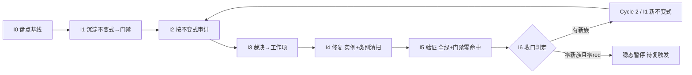

# nop-stream 不变式驱动的持续审计闭环（nop-stream Invariant-Driven Continuous Audit Loop）

> **产出方法**：`ai-dev/skills/invariant-loop-audit-prompt.md`（诊断→选型→拟制→共识审查）；待经独立 fresh session 审查至共识。
> **驱动方**：`missions/nop-stream-invariant-loop.json`（范围：nop-stream 全模块组；授权/commitFormat/Loop Rule 见该 mission description）
> **先例**：nop-chaos-flux 的 ai-invariant-loop-roadmap.md（docs/backlog 下，首个闭环先例，Cycle 1+2 完成后稳态暂停；该文件位于 nop-chaos-flux 独立 worktree，本仓库内不可解析——跨仓先例引用，非本仓文档链接）
> **与既有线性 roadmap 的关系**：`nop-stream-production-roadmap.md`（活跃建设，40/43 done）、`nop-stream-independent-audit-roadmap.md`（23 阶段 done）、`nop-stream-flink-comparison-roadmap.md`（16/21 done）均为**线性管道**——MG 产出为文档。本图为**闭环飞轮**——I6 产出为可执行 CI 门禁。两者不互斥：线性管道先行铺面，闭环飞轮后续治根。

## 目的

nop-stream 已被审计 **21 轮**（5 deep + 16 adversarial r1–r16）+ **23 阶段独立审计**，是 nop-entropy 全仓**被审计次数最多的模块**。每轮都在**同一家族的新路径**上发现缺陷——但**这些缺陷最终都被修了**（live code 已含修复）。问题不是"缺陷修不掉"，而是**"每族都要历经多轮审计才完整捕获全部兄弟实例"**：

- **WindowAggregationOperator 粘合层族**历经 R8（resolveKey 反向 / timestamp drop）→ R13（`#` 分隔符 / mergeWindow 覆写）→ R14（`:` 分隔符）→ R15（无 trigger.onMerge）→ R16（allowedLateness 死 API / multi-target add）**至少 7+ 个兄弟实例，横跨 5 轮审计**才逐步发现；
- **TwoPhaseCommitSinkFunction 并发族**：R16 AR-1（`saveState()` 无锁 → CME）+ R16 AR-11（`setPendingCommits()` 接受任意 Map）——R16 summary 自列"形成级联"；
- **Checkpoint ID/存储族**：R16 AR-5（idCounter 未更新）/ AR-10（checkpointSuccessMap 泄漏）/ AR-15（storage 按文件名排序）/ AR-16（CANCEL trigger）4 兄弟；
- **CEP/NFA/SharedBuffer 族**：R16 AR-6（清除非 start 状态）/ AR-7（DeweyNumber int 溢出）/ AR-8（Lockable 双重释放）/ AR-12（NFA 无界）+ R8 AR-66 共 5 兄弟；
- **ClusterRegistry 不一致族**：AR-9（JDBC 设 lease=0）+ AR-18（InMemory 忽略 per-renewal timeout）——"两个实现语义不一致"。

R16 summary 自身描述了"WindowAggregationOperator 粘合层"为质量风险：*"是否有其他参数被类似地遗忘传递？"*——**审计者自己标记了打地鼠模式**。

根因 = **"修实例不修类别"** + **反应式测试（per-bug）非穷举** + **零可执行不变式门禁**（`ai-dev/tools/check-nop-stream-audit-manifest.mjs` 57KB 仅验证审计证据 schema，不验证代码不变式）。

本路线图把修-漏-再修的循环**改造为自驱动飞轮**：把已知失败模式**沉淀为可执行不变式门禁**（入 CI，回归自动被抓）→ 按不变式**确定性审计**全部方法 → 裁决 → 修复（强制类别清扫）→ 新失败类再沉淀为新不变式。

## Loop Design（循环方法论，非 phase）

每个 Cycle 固定 7 步，I0 仅 Cycle 1 有：

```
I0 盘点基线 → I1 沉淀不变式(→门禁入CI) → I2 按不变式审计(跑门禁+对抗探查) → I3 裁决→工作项
    → I4 修复(实例+类别清扫+测试) → I5 验证(全绿+门禁零命中) → I6 收口(新失败类?→下轮 I1; 否则稳态)
```

- **自动化边界**：I1/I2/I5 的门禁部分完全自动化（CI 连续跑）；I2 的对抗探查 + I3 裁决为半自动（每轮一次）；I4 修复预授权 P0/P1 自动执行（同 audit-remediation 纪律）。
- **棘轮规则**：不变式门禁只增不减；弱化/豁免需人工确认并留痕。
- **稳态与复触发**：一轮 I2 零新违背且零新不变式类 → 循环暂停；触发复跑：① CI 任一不变式门禁变红；② nop-stream 核心类结构变更（新增/重命名 Operator/SinkFunction/Checkpoint 机制）；③ 周期复探（默认每 major release 或季度，取早）。

## Work Item Status

> 唯一动态状态区。状态流转：`todo` → `planned`（draft review 通过）→ `done`（closure audit 通过，不得提前）。

| Work Item | 交付范围 | 状态 | 依赖 |
| --- | --- | --- | --- |
| Cycle 1 / I0. 不变式盘点与基线 | 从 21 轮审计提取已知失败模式族 → 不变式目录（`ai-dev/audits/nop-stream-invariants/invariant-catalog.md`，每条：不变式陈述、覆盖失败族、历史审计证据 `finding-ID`/`文件:行`、检测方法）；确认基线 = 当前零代码不变式门禁；枚举全部变更型方法/类（Operator 族 / SinkFunction 族 / Checkpoint 机制 / CEP NFA / ClusterRegistry）作为审计目标集 | `done` | — |
| Cycle 1 / I1. 不变式沉淀（首批门禁） | 将首批不变式落为参数化穷举测试 + 门禁脚本 + 表完备性门禁。首批候选族（I0 确认后定稿）：① WindowAggregationOperator 构造参数完备性（每个构造器参数列表必须 round-trip 全部 WindowedStreamImpl 字段）；② Collections.synchronizedMap/Xxx 字段迭代点必须在 synchronized 块内；③ Checkpoint idCounter 更新原子性；④ CEP SharedBuffer/Lockable 释放对称性；⑤ ClusterRegistry 多实现语义一致性（lease timeout）。门禁入 CI（JUnit `@ParameterizedTest` + `ai-dev/tools/check-nop-stream-invariants.mjs`） | `done` | I0 |
| Cycle 1 / I2. 不变式驱动审计 | ① 跑 I1 门禁跨全部方法 → red list（确定性）；② 对抗探查聚焦门禁未表达盲区（新交错组合、refactor 引入新方法、跨 Operator 参数遗漏）；③ 标注每条发现属已知族或新族 | `done` | I1 |
| Cycle 1 / I3. 发现裁决与工作项拟制 | red list 逐条裁决（P0/P1/P2/P3）→ P0/P1 派 I4；新族派 Cycle 2 / I1（Loop Rule）；裁决表零悬挂 | `done` | I2 |
| Cycle 1 / I4. 修复执行（实例 + 类别清扫 + 测试） | 强制类别清扫（修任一 Operator/SinkFunction 必 grep 全部同类兄弟）+ test-first（先红后绿）+ 不变式门禁复跑零命中；WindowAggregationOperator 族历史案例作为回归基线。**执行结果（plan `2026-08-12-1217-5`）**：RL-1..7 全部修复（含 RL-3 backlog 触发闭合）；四族类别清扫证据在案；92 门禁 + 全量 `-am` 全绿；mjs pins 清零 | `done` | I3 |
| Cycle 1 / I5. 全量验证与门禁零命中 | `./mvnw test -pl nop-stream -am -T 1C` + 门禁零命中 + 相关 e2e；full-green 记录。**执行结果（plan `2026-08-12-1217-6`）**：2822 tests / 0 failures 全绿；mjs all exit 0（pins 0）；JUnit 9 门禁类 92 tests 0 failures；e2e 6/6 + 7/7；零新失败；full-green 记录 + `cycle1-I6-input.md` 落档（I6 输入唯一落点） | `done` | I4 |
| Cycle 1 / I6. 循环收口与下一轮触发判定 | 统计本轮门禁数/red list/新族数；有新族 → 派 Cycle 2（Loop Rule）；无新族且 red list 零 → 稳态暂停 + 登记复触发条件；closure 独立 fresh session。**执行结果（plan `2026-08-12-1217-7`）**：收口统计与 `cycle1-I6-input.md` 一致（2822 tests / 0 failures；门禁 9 类 / 92 tests；pin 0）；red list 零悬挂（7/7 + RL-3 闭合）；PD-15 裁定正式新族（输出契约族）→ Cycle 2 派生（I1–I6 六行）；跨 task side-output 缺口双层裁决（interim fail-fast 预授权分派 Cycle 2 / I4 + 线协议 `HG-01` 人工确认门）；复触发登记 | `done` | I5 |
| Cycle 2 / I1. 不变式沉淀（输出契约族门禁） | PD-15 输出契约族不变式 #6 沉淀为一等门禁并入 CI：JUnit `TestOutputContractInvariant`（全 main `Output` 实现类 `collect(OutputTag,X)` 行为三态穷举：转发 / fail-fast / 已知违约 pin）+ 类级枚举完备性（新增 main `Output` 实现类不入注册表即红）+ 发射点注册表（6 发射点全覆盖，新增即红）+ mjs `scan-output-contract` 子命令 + committed 回归测试；跨 task 已知违约实例以过渡 pin 登记（关联 `HG-01`，移除 = Cycle 2 / I4 interim fail-fast 落地后）。**触发证据（PD-15 先例链）**：不变式「任何 `Output.collect(OutputTag, X)` 调用必须被转发到注册的 side-output 消费者，不得静默丢弃；无注册消费者 → fail-fast」；发现 `文件:行` = `ChainingOutput.java:84-86`（原始丢弃点）→ live 发射点 `ProcessOperator.java:111/:134` / `WindowOperator.java:1030/:1860` / `CepOperator.java:483/:777`；派生说明 = I3 登记（adjudication-table.md §4 PD-15）→ I4 修复基线 `b20fcd0e1`（`ChainingOutput.java:111` 转发 + fail-fast）→ I6 裁定正式新族（adjudication-table.md §I6）。**执行结果（plan `2026-08-12-1217-8`）**：JUnit 门禁 10 类 / 102 tests / 0 failures（新增 TestOutputContractInvariant 10 用例）+ mjs `all` exit 0（scan-output-contract V1–V5）+ E2E 3/3；过渡 pin 2 条（RWO/BRWO，`HG-01` 关联，removalTrigger 在案）；`cycle2-I1-input.md` 落档（Cycle 2 统计唯一落点）；catalog #6 定稿 + core-design.md §6.1 不变式节 | `done` | I6 |
| Cycle 2 / I2. 不变式驱动审计 | ① 跑 I1 门禁跨全部 `Output` 实现类与发射点 → 确定性 red list；② 对抗探查聚焦门禁未表达盲区（透传目标敏感分类、嵌套类方法体解析、注册/接线时序）；③ 标注已知族或新族。**执行结果（plan `2026-08-12-1217-09`）**：mjs `all` exit 0（5 命令）+ JUnit 门禁 10 类 / 102 tests / 0 failures + E2E 3/3 + 全量 2832 tests / 0 failures；确定性 red list（C2-RL-1 RWO / C2-RL-2 BRWO / C2-RL-3 措辞过 claim）+ 2 条过渡 pin 复核均维持 + 聚焦探查 5 发现（C2-PR-1..5，无新独立族，2 个不变式扩展候选供 I6）；`red-list.md` 权威化（零悬挂）移交 I3；`cycle2-I2-probing-report.md` 新建落档 | `done` | I1 |
| Cycle 2 / I3. 发现裁决与工作项拟制 | red list 逐条裁决（P0/P1/P2/P3）→ P0/P1 派 I4（含跨 task interim fail-fast 预授权确认，I6 预裁决输入，见 adjudication-table.md §I6）；新族派 Cycle 3 / I1（Loop Rule）；裁决表零悬挂。**执行结果（plan `2026-08-12-1217-10`）**：裁决表 Cycle 2 节落档（adjudication-table.md §7-§10，8 条目零悬挂：C2-RL-1/2 = P1 派 I4（interim fail-fast，信封通过无人工确认门）/ C2-RL-3 = P3 backlog / C2-PR-1/2/5 = 关闭（非 defect）/ C2-PR-3/4 = P3 backlog）；interim fail-fast 预授权确认（§7.3 信封复核通过，WI-C2-1 派发六要素齐全含收尾三连）；无新族显式声明 + C2-PR-2/5 扩展候选移交 I6；Follow-up Backlog 新增 2 条；独立共识审查 8/8 PASS + closure audit 8/8 PASS | `done` | I2 |
| Cycle 2 / I4. 修复执行 | 跨 task interim fail-fast 修复（`RecordWriterOutput` / `BroadcastingRecordWriterOutput` `collect(OutputTag)` 空体 → 抛 `ERR_STREAM_SIDE_OUTPUT_NO_CONSUMER` 风格异常；类内部行为修复，private 嵌套类、`Output` 接口零变更，同 RL-7 先例）+ 注册表分类更新 + 过渡 pin 移除；test-first 先红后绿；类别清扫（全 `Output` 实现类兄弟）。**执行结果（plan `2026-08-12-1217-11`）**：RWO/BRWO `collect(OutputTag)` fail-fast 落地（`ERR_STREAM_SIDE_OUTPUT_NO_CONSUMER` + `ARG_OUTPUT_TAG`/`ARG_DETAIL`，commit `88bc0270c`）；注册表分类迁移 `pinned-known-violation` → `fail-fast`（含 `TimestampedCollector` disposition 同步）；过渡 pin 2 条移除（留痕在案）；JUnit 断言翻转 + 跨 task E2E 第 4 用例（RWO 1 writer + BRWO 2 writers，4/4 绿）；类别清扫零遗留（4 实现类 + 6 发射点 + 接线链）；门禁复跑零命中（JUnit 门禁子集 102 tests / 0 failures + mjs `all` exit 0 pins 0）+ core 1428 / runtime 805 全量回归绿；文档收口（core-design §6.1 / red-list / logs）；独立 closure audit 10/10 PASS | `done` | I3 |
| Cycle 2 / I5. 全量验证与门禁零命中 | `./mvnw test -pl nop-stream -am -T 1C` + 门禁零命中 + 相关 e2e；full-green 记录 + 下轮输入落档。**执行结果（plan `2026-08-12-1217-12`）**：全量 2833 tests / 0 failures 全绿（core 1428 / runtime 805 / cep 320 / rocksdb 83 / connector 35 / connector-jdbc 32 / connector-batch 35 / connector-debezium 19 / flow 51 / fraud-example 25）；mjs `all` exit 0（pin 0，无 unpinned / 无 stale）；JUnit 门禁 10 类 102 tests 0 failures（含 I4 翻转/新增用例）；e2e 复跑绿（`TestSideOutputChainingE2E` 4/4 含跨 task fail-fast 第 4 用例 + Window E2E 6/6 + 7/7）；零新失败；E2E 发射点覆盖事实核实在案（仅 WindowOperator:1030 有 E2E 覆盖，其余 5 发射点无——P3 backlog 处置不变，注册表措辞未改）；full-green 记录 + `cycle2-I6-input.md` 落档（I6 输入唯一落点） | `done` | I4 |
| Cycle 2 / I6. 循环收口 | 统计/稳态判定；`HG-01` 线协议支持如获人工批准另立 plan（Successor）；closure 独立 fresh session | `todo` | I5 |

## Phase Details

### I0 — 不变式盘点与基线（仅 Cycle 1）

不变式目录 `ai-dev/audits/nop-stream-invariants/invariant-catalog.md`：每条不变式含「陈述 / 覆盖失败族 / 历史 audit-finding-ID 证据 / 检测方法（JUnit / 静态扫描 / ArchUnit）」。审计目标集 = nop-stream 全部变更型类/方法。

### I1 — 不变式沉淀（每 Cycle 一批门禁）

把不变式落为：① JUnit 5 `@ParameterizedTest`（方法/类表驱动，单文件集中）+ 表完备性门禁（新增类不入表即红）；② 静态可 grep 的不变式补 `ai-dev/tools/check-nop-stream-invariants.mjs` 扫描器；③ committed 回归测试。设计文档补「不变式」节。

### I2 — 不变式驱动审计

① 门禁跑全方法 → red list；② 对抗探查（`open-ended-adversarial-review-prompt.md`）聚焦盲区；③ 标注已知族或新族。

### I3 — 发现裁决

red list → P0/P1 入 I4；新族 → Cycle 2 / I1；P2/P3 入 Follow-up Backlog。裁决表零悬挂。

### I4 — 修复执行

类别清扫强制：修任一 Operator 必 grep 全部同类兄弟；test-first 先红后绿；门禁复跑零命中。

### I5 — 全量验证

`./mvnw test` + 门禁零命中 + e2e；full-green 记 `ai-dev/logs/`。

### I6 — 循环收口

统计门禁数/red list/新族数；稳态判定 + 复触发条件登记；closure 独立 fresh session。

Cycle 1 / I6 裁定摘要（2026-08-12，plan `2026-08-12-1217-7`）：PD-15 输出契约族裁定正式新族 → 依 Loop Rule 派生 Cycle 2（I1–I6 六行已追加，I1 附触发证据）；跨 task side-output 缺口双层裁决 = interim fail-fast 预授权分派 Cycle 2 / I4（类内部行为修复，自动信封）+ 线协议结构性重构 = `HG-01` 人工确认门（执行门未过，登记待办，非延期非降级）；Cycle 2 / I1 门禁范围裁定（三态分类 + 类级枚举完备性 + call-site 注册表 + 过渡 pin）见 adjudication-table.md §I6；Cycle 2 触发原因 = 新族沉淀 + `HG-01` 人工确认门；复触发三选一继续生效。

## Dependency Graph



## Loop Rule（自动派生与稳态规则）

- **新族强制沉淀**：I2/I3 发现的任一"新失败类"→ I6 必须派生 Cycle N+1 / I1，**AI 可自动追加**（预授权，PD-n 先例链），追加时附「触发证据 = 发现 `文件:行` + 不变式陈述」回写本表。
- **棘轮**：已沉淀的不变式门禁只增不减；弱化/删除/豁免需人工确认 + 留痕 + committed 回归测试同步。
- **稳态暂停与复触发**：一轮零新族且 red list 零 → 稳态暂停；复触发三选一：① CI 该门禁变红；② nop-stream 核心类结构变更（新增/重命名 Operator/SinkFunction/Checkpoint 机制）；③ 周期复探。
- **Cycle 2 触发登记（2026-08-12，I6 落档）**：Cycle 2 触发原因 = 新族沉淀（PD-15 输出契约族，正式新族）+ 跨 task side-output 缺口（已确认契约缺口，执行门 = 人工确认待办 `HG-01`）。三选一复触发继续生效（① CI 任一不变式门禁变红；② nop-stream 核心类结构变更；③ 周期复探）；**人工确认待办的触发** = 人工批准跨 task side-output 线协议结构性变更（`HG-01`，登记见 Follow-up Backlog）。
- **类别清扫强制**：I4 修任一实例必须 grep 全类兄弟；只修报到的实例 = 未完成。
- **范围独立**：本图专注 nop-stream 不变式沉淀与防回退，与 `nop-stream-production-roadmap.md`（功能建设）/ `nop-stream-independent-audit-roadmap.md`（一次性深度审计）范围不重叠。

## Cross-Cutting

- **授权**：P0/P1 自动修复预授权（同 audit-remediation 先例）；结构性重构（公共 API、模块边界、Operator 接口变更）执行前人工确认；新不变式门禁入 CI 视为 check 脚本变更，需 committed 回归测试。
- **可推广性**：本方法论适用于任何有状态子系统。nop-metadata / nop-ai / nop-code 另立各自的 invariant-loop roadmap（范围独立）。

## Follow-up Backlog

> P2/P3 findings adjudicated in Cycle 1 / I3 (`ai-dev/audits/nop-stream-invariants/adjudication-table.md` §1)。
> 已裁定处置（附依据即合规），不驱动独立修复计划；当 I4/I5 类别清扫或复探触发其适用场景时评估修复。Source audit paths preserved for traceability.

### `InMemoryClusterRegistry.renewLease()` ignores `leaseTimeoutMs` (R16-AR-18)

- **Source**: `ai-dev/audits/nop-stream-invariants/red-list.md` RL-3（2026-08-12 I2 权威版）(P2)
- **Description**: `InMemoryClusterRegistry.java:68-81` renewLease 只存 `now`（:74），忽略 per-renewal `leaseTimeoutMs` 参数；`:90/:98/:114` 活性计算全部用固定 `leaseTtlMs`（15s）→ InMemory（嵌入式/单机执行模式，`EmbeddedDistributedExecutor.java:134` / `RpcDistributedExecutor.java:191` 生产接线）语义与 JDBC 实现不一致，违反不变式 #5(b)。
- **Recommendation**: renewLease 记录 `now + leaseTimeoutMs` 并按参数计算活性；同步核对 `evictExpiredNodes`/`getActiveNodes`/`getNodeLease`。
- **Status**: ✅ 已由 I4 触发闭合（2026-08-12，plan `2026-08-12-1217-5` Phase 1，commit `fcc71fc05`）— renewLease 按 `leaseTimeoutMs` 参数计算过期时间（`InMemoryClusterRegistry.java:88-89`），getNodeLease/evictExpiredNodes/getActiveNodes 全部读存储 expireAt；翻转测试 `TestClusterRegistryConsistencyInvariant.testRenewLeasePerRenewalTimeoutIsPinnedPerImpl`（InMemory 分支）+ 新增 `testInMemoryRenewLeaseHonorsPerRenewalTimeout` 全绿。历史处置记录保留如上。

### 跨 task side-output 线协议结构性变更（人工确认待办 `HG-01`）

- **Source**: I6 裁定 `ai-dev/audits/nop-stream-invariants/adjudication-table.md` §I6（2026-08-12，plan `2026-08-12-1217-7`）；同族 PD-15 派生登记（§4）
- **Description**: `RecordWriterOutput.collect(OutputTag)`（`nop-stream-core/.../execution/StreamTaskInvokable.java:645` 空体）/ `BroadcastingRecordWriterOutput.collect(OutputTag)`（同文件 :706 空体）→ 多 vertex 部署下 task tail 算子（WindowOperator / CepOperator / ProcessOperator）发出的 side-output 静默丢弃——**已确认契约缺口**（P1，静默数据丢失，生产可达，同 RL-7 族）。接线路径：`GraphExecutionPlan.java:454-458`（fanOutWriters 构造 `StreamTaskInvokable`）→ `wireOperators`（`StreamTaskInvokable.java:239/:245`）/ `wireTailToRecordWriter`（:352）→ tail 算子 `setOutput(RecordWriterOutput / BroadcastingRecordWriterOutput)`。证据 = 6 发射点：`ProcessOperator.java:111/:134` / `WindowOperator.java:1030/:1860` / `CepOperator.java:483/:777`。
- **Recommendation（修复方向）**: RecordWriter 线协议结构性重构（跨 task side-output 序列化 / 路由 / 消费注册机制），公共内部机制变更 → 执行门 = 人工确认（mission Cross-Cutting：「结构性重构执行前人工确认」），不在自动修复信封内。
- **Status**: `pending human confirmation`
- **Successor**: 人工确认后另立 plan（跨 task 侧输出线协议设计 + 实现 + E2E）；触发条件 = 人工批准 + 跨 task side-output 需求出现（或 CI 门禁红暴露新实例）
- **保护性覆盖（四重留痕）**: ① in-task 路径已 fail-fast（I4 `b20fcd0e1`，`ChainingOperator` 无消费者抛 `ERR_STREAM_SIDE_OUTPUT_NO_CONSUMER`）；② Cycle 2 / I1 门禁（类级枚举完备性 + call-site 注册表 + 行为三态分类，新增实现类 / 新增发射点 / 行为漂移即红）；③ 过渡 pin 2 条（`mjs-pins.json`，关联 `HG-01`；移除 = Cycle 2 / I4 interim fail-fast 修复落地 + 注册表分类更新后，禁静默移除——`HG-01` 线协议支持落地属增强，不阻塞 pin 移除）；④ 本待办条目。interim fail-fast（空体 → 抛异常）属自动信封，预授权分派 Cycle 2 / I4，不入 backlog（记入 adjudication-table.md §I6）。

### 输出契约族审计证据准确性 + E2E 覆盖扩展（C2-RL-3 + C2-PR-4，P3 优化）

- **Source**: `ai-dev/audits/nop-stream-invariants/red-list.md` C2-RL-3（Cycle 2 / I2 权威版，2026-08-12）+ C2-PR-4（探查报告盲区 d）；裁决 = `ai-dev/audits/nop-stream-invariants/adjudication-table.md` §7.2/§10（Cycle 2 / I3）
- **Description**: 注册表 `output-contract-registry.json` emissionPoints 表 6 条中 5 条 disposition 写 "E2E covered by TestSideOutputChainingE2E"，实测该 E2E（3 用例）仅覆盖 `WindowOperator.java:1030`（late-data 路径）——`ProcessOperator.java:111/:134`、`WindowOperator.java:1860`、`CepOperator.java:483/:777` 共 5 个发射点无 E2E 覆盖（单元层亦无 OutputTag 发射断言）。措辞过 claim = 审计证据可追溯性质量问题（非代码缺陷，mjs 不消费 disposition 字段）。
- **Recommendation**: 修订注册表措辞为实际覆盖范围 与/或 扩展 `TestSideOutputChainingE2E` 覆盖 6 发射点全路径（ctx.output / ProcessWindowFunction / PatternProcessFunction）。
- **Status**: `todo`（已裁定处置附依据，不驱动独立修复计划；触发条件 = I4 类别清扫或复探时评估）

### side-output 消费者重复注册语义（C2-PR-3，P3 优化）

- **Source**: `ai-dev/audits/nop-stream-invariants/cycle2-I2-probing-report.md` C2-PR-3（2026-08-12）；裁决 = `ai-dev/audits/nop-stream-invariants/adjudication-table.md` §7.2/§10（Cycle 2 / I3）
- **Description**: 同一 `OutputTag` 第二次注册消费者时 `sideOutputConsumers.put` last-wins 静默覆盖前一消费者（`ChainingOutput.java:67-69` / `StreamTaskInvokable.java:310-313`），无 fail-fast / 无合并 / 无广播语义。不违反不变式 #6（仍转发到"一个"注册消费者，无静默丢弃）；生产当前无重复注册调用面。
- **Recommendation**: 重复注册 fail-fast 或广播语义（多 sink 场景），优化候选。
- **Status**: `todo`（已裁定处置附依据，不驱动独立修复计划；触发条件 = 多消费者接线需求出现或类别清扫时评估）
