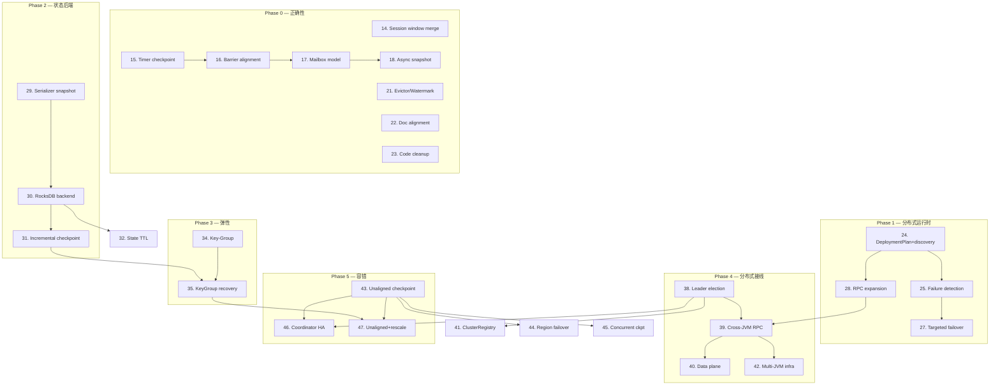

# nop-stream 生产级完善路线图

> Last updated: 2026-07-25
> Sources: `ai-dev/analysis/nop-stream/08-gap-analysis.md`（73 条显式缺口 ID [G1-G68, D69-D73] + 6 条已解决附录 [R1-R6]，primary）, `ai-dev/backlog/completion-roadmap.md`（Phase 0—5 战略框架）, `ai-dev/backlog/nop-stream-flink-comparison-roadmap.md`（前序路线图，Items 9—13 已完成）

## Purpose

把 nop-stream 从「设计成熟、核心修补完成」推进到「完整分布式生产级流处理引擎」。本路线图驱动 73 条源码级对比缺口的逐一关闭与 Phase 1—6 能力建设，对齐 `completion-roadmap.md` 的全部成功标准。

Does not contain implementation details. Each `planned` stage is owned by its execution plan.

## Work Items

> **This is the only dynamic state block. Update status only here.**
> The roadmap is a human-AI alignment artifact: humans set items and their order;
> AI takes the first `todo` item, drafts/executes plans, and writes the item back to `done` when closure audit passes.
>
> 编号延续前序路线图（Items 1—13 已完成）。分组标题（Phase X）为组织视图，无独立状态。

### Phase 0 — 正确性缺口补齐与文档收敛

- 14. Session window merge 修复（G1，P0）: `done`
- 15. Timer checkpoint/restore + timer service 统一（G2, G16，P0/P1）: `done`
- 16. Multi-input barrier alignment（G4, G7，P1）: `done`（G5/G34 deferred to Stage 39 — 跨 JVM RPC prerequisite，见 `checkpoint-design.md:911`）
- 17. Mailbox 执行模型（G22，P1）: `done`
- 18. 异步两阶段 snapshot pipeline（G30, G44，P2）: `done`（plan `2026-07-25-2200-1-async-snapshot-pipeline`，completed）
- 19. Checkpoint 并发与共享状态（G31, G33，P2）: `done`（plan `ai-dev/plans/nop-stream-production/2026-07-25-2300-1-checkpoint-concurrency.md`，completed — G31 收口：Coordinator 尊重 `maxConcurrentCheckpoints` + minPause(last-completed) 接线 + stale 警告/文档修正 + 共存 pending 经 coordinator 路径独立 ACK/complete/abort/timeout 由 focused test 覆盖；G33 裁定延后 Stage 31 — 内存后端无共享状态可消费，引入空壳抽象违反 plan 指南 #22/#24）
- 20. Partial/subtask 级恢复（G28, G29，P2）: done（G29 — plan `2026-07-25-2200-2-partial-subtask-recovery`，completed；G28 design-gated，需先起草 region/drain/reconnect 设计文档，见 plan Deferred）
- 21. Evictor/Pane/Watermark 集成（G46—G48，P2）: `done`
- 22. 文档合同对齐与 source-anchors 补全（D69—D73，Doc）: `done`
- 23. 代码清理与 P3 次要改进（G68, G62, G64，P3）: done（plan `2026-07-25-2200-3-code-cleanup-p3`，completed；G62 降级为 Decision-only）

### Phase 1 — 分布式运行时基础

- 24. DeploymentPlan subtask 分配 + 平台 discovery 接入（G50, G51，P2）: done（plan `ai-dev/plans/nop-stream-production/2026-07-26-0207-1-deployment-plan-discovery.md`，completed）
- 25. Per-task failure detection + execution state machine（G52, G54—G56, G58，P2）: done（plan `ai-dev/plans/nop-stream-production/2026-07-26-0207-2-per-task-failure-detection.md`，completed；G55 region scheduling 明确 Out-of-Scope，属 Stage 27/44）
- 26. Buffer pool 抽象（G53，P2）: done（plan `ai-dev/plans/nop-stream-production/2026-07-26-0207-3-buffer-pool.md`，completed）
- 27. Targeted failover（G57，P2）: `done`（plan `ai-dev/plans/nop-stream-production/2026-07-26-0433-2-targeted-failover.md`，裁定交付 **NO-GO** — all-pipelined→单 region + drain/reconnect 不可设计；设计文档 `ai-dev/design/nop-stream/failover-design.md`；G57/G28(续)/per-region-counter deferred → Stage 44，需 blocking edge + supervision loop 前置）
- 28. 分布式 RPC 接口扩容 + 进程内 backpressure（G23, G26，P1）: done（plan `ai-dev/plans/nop-stream-production/2026-07-26-0433-1-rpc-dispatcher-backpressure.md`，completed — 控制面 RPC 暴露 terminate/abort/status + G26 dispatcher 最小化 Decision + G27 backpressure 契约 + CREDIT_BASED/ACK_WINDOW 永久排除）

### Phase 2 — 状态后端生产化

- 29. SerializerFingerprint schema 兼容性体系（G12, G40, G41, G59，P1/P2/P3）: `todo`
- 30. RocksDB 状态后端核心: `todo`
- 31. 增量 checkpoint（SST 共享）: `todo`
- 32. State TTL（G42, G43，P2）: `todo`
- 33. 状态迁移接线: `todo`

### Phase 3 — 弹性与重分布

- 34. Key-Group 模型（G37—G39，P2）: `todo`
- 35. KeyGroupRange 恢复 + RocksDB key-group 感知 restore: `todo`
- 36. ~~BroadcastState 类型（G36，P2）~~ → 推迟，需先更新 vision §七: `todo`
- 37. StateShard→KeyGroup 迁移 + vision Non-Goal 更新: `todo`

### Phase 4 — 分布式接入平台基础设施

- 38. Leader election / HA（G24, G25，P1）: `todo`
- 39. 控制面 RPC 跨 JVM + fencing token 统一（G23 续）: `todo`
- 40. 数据面 IMessageService 跨 JVM: `todo`
- 41. ClusterRegistry 收敛到平台 discovery: `todo`
- 42. 多 JVM 集成测试基建: `todo`

### Phase 5 — 容错强化

- 43. Channel 心跳 + unaligned checkpoint（G6，P1）: `todo`
- 44. Region-based failover（G28 续，P2）: `todo`
- 45. 多并发 checkpoint 完整支持（G31 续，P2）: `todo`
- 46. Coordinator HA 端到端 + HA checkpoint store（G32, G35，P2）: `todo`
- 47. Unaligned + rescale 交互: `todo`

### Phase 6 — 生态与上层

- 48. Kafka IMessageService: `todo`
- 49. Source split 体系（FLIP-27 风格）: `todo`
- 50. nop-stream-flow XDSL 声明式编排: `todo`
- 51. Delta 定制 StreamModel: `todo`
- 52. 事务型 JDBC sink（2PC）: `todo`
- 53. CDC 深化 + 文件 sink: `todo`
- 54. CEP SharedBuffer 缓存改进（G65，P3）: `todo`
- 55. 推迟项跟踪：spill-to-disk（G66）/ adaptive scheduling（G67）: `todo`

## Status values

| Status | Meaning |
| --- | --- |
| `todo` | Not started, no plan |
| `planned` | Has execution plan, passed draft review |
| `done` | Complete, passed closure audit |

## Framework / platform reuse

| Capability | Provider | Notes |
| --- | --- | --- |
| 状态持久化 | `ICheckpointStorage` (LocalFile/JDBC) | LocalFile 已实现，Jdbc 待接线（Phase 5） |
| 数据序列化 | `JsonTool`（保留）+ `SerializerFingerprint` schema 解析层（Phase 2） | 不引入二进制序列化体系（vision Non-Goal） |
| CEP 条件表达式 | `IEvalFunction` (nop-xlang) | 已使用 |
| 数据库访问 | `IJdbcTemplate` + `IDialect` | checkpoint storage 使用 |
| 批量数据源 | `IBatchLoader` / `IBatchConsumer` | 已桥接 |
| 消息队列（数据面） | `IMessageService`（SysDaoMessageService / PulsarMessageService） | Phase 4 接入跨 JVM |
| RPC（控制面） | `IRpcService` / `MessageRpcServer` / `SimpleRpcServer` / `RpcServiceProxyFactoryBean` | Phase 4 接线 |
| Leader 选举 | `ILeaderElector` / `SysDaoLeaderElector` | Phase 4 接入，nop-stream 为首个生产用户 |
| Discovery / 心跳 / lease | `IDiscoveryClient` / `INamingService` | Phase 4 接入 |
| 分布式锁 | `IResourceLockManager` + `SysDaoResourceLockManager` | DONE，按需使用 |
| 分区分配 | `IPartitionAssigner` + `WeightedPartitionAssigner` | DONE |
| Delta 定制 | Nop 可逆计算机制 | Phase 6 接入 |

## Current baseline

**Already shipped（前序路线图 Items 9—13）:**
- InputGate barrier alignment enabled（`InputGate.handleBarrierNonRecursive()` 承担多输入对齐；`BarrierAligner` 类 `@Deprecated` 为 reference code，无生产调用者）、findCompletedCheckpointId 修复、abort 通道 local 路径
- TimestampsAndWatermarksOperator 自动插入、AccumulationMode/PaneInfo 接线、evictAfter
- CEP 统一 IKeyedStateBackend，移除 SimpleKeyedStateStore
- Operator State 基础体系 + 重分布
- StreamModel 做实（buildStreamModel 注册 StreamComponents，Fingerprint 生效）

**Main gaps (not yet closed):**
- ~~G1: Session window merge 对 AggregatingState 失败~~ ✅ Closed (item 14)
- ~~G2: Timer 无 checkpoint/restore~~ → Stage 15
- ~~G3: BarrierAligner 无生产调用者~~ ✅ Closed (item 9)
- ~~G8—G11, G13: Operator State 体系缺失~~ ✅ Closed (items 12a/12b)
- ~~G14, G15, G17: PaneInfo/AccumulationMode/SourceFunction watermark~~ ✅ Closed (item 10)
- ~~G16: 并行 timer service 重复~~ → Stage 15
- ~~G18, G19, G49: CEP 状态后端/SimpleKeyedStateStore~~ ✅ Closed (item 11)
- ~~G20: Watermark runtime→CepOperator 传播管路~~ ✅ Closed (items 10/11)
- ~~G21: OperatorChain double-open~~ ✅ Closed (item 9)
- ~~G4: 无 multi-input barrier alignment~~ ✅ Closed (item 16) — `InputGate.handleBarrierNonRecursive()`
- ~~G7: 无 channel blocking~~ ✅ Closed (item 16) — `InputGate.blockConsumption()`/`resumeConsumption()`
- G5, G34: CancelCheckpointMarker / abort data-channel propagation → Stage 39（deferred from item 16，跨 JVM RPC prerequisite，见 `checkpoint-design.md:911`）
- G22: 无 mailbox 执行模型 → Stage 17
- G23—G25: 无跨 JVM RPC / leader election → Stages 28/38/39
- G28—G35（除 G34）: Checkpoint 管线多项缺口 → Stages 18/19/20
- ~~G60, G61, G63: bulk cleanup / Jdbc dup-key / Timer O(n)~~ ✅ Closed (item 9)
- RocksDB 状态后端缺失 → Stages 30-31
- Key-Group / rescale 缺失 → Stages 34-35
- Unaligned checkpoint 缺失（G6）→ Stage 43
- 文档与实现多处不一致（D69—D73）→ Stage 22 ✅ Closed (item 22)

## Stages

| # | Stage | Owner plan | Deps | Critical path | Reuse |
| --- | --- | --- | --- | --- | --- |
| 14 | Session window merge | `14-session-window-merge` | — | **Yes** | Flink `mergeNamespaces` |
| 15 | Timer checkpoint + 统一 | `15-timer-checkpoint` | — | **Yes** | Flink `snapshotTimersForKeyGroup` |
| 16 | Multi-input barrier + abort | `16-barrier-alignment` | 15 | **Yes** | existing `InputGate` alignment |
| 17 | Mailbox 执行模型 | `17-mailbox-model` | 16 | **Yes** | nop-stream 原生 minimal task queue |
| 18 | 异步两阶段 snapshot | `18-async-snapshot` | 17 | No | Flink `OperatorSnapshotFutures` |
| 19 | Checkpoint 并发与共享 | `19-checkpoint-concurrency` | 18 | No | — |
| 20 | Partial/subtask 恢复 | `20-partial-recovery` | 16 | No | — |
| 21 | Evictor/Pane/Watermark | `21-evictor-watermark` | — | No | existing window impl |
| 22 | 文档合同对齐 | `22-doc-alignment` | — | No | — |
| 23 | 代码清理与 P3 | `23-code-cleanup` | — | No | — |
| 24 | DeploymentPlan 分配 + discovery | `24-deployment-discovery` | Phase 0 | **Yes** | `IDiscoveryClient` / `INamingService` |
| 25 | Failure detection + state machine | `25-failure-detection` | 24 | **Yes** | — |
| 26 | Buffer pool | `26-buffer-pool` | 24 | No | — |
| 27 | Targeted failover | `27-targeted-failover` | 25 | **Yes** | — |
| 28 | RPC 接口扩容 + backpressure | `28-rpc-backpressure` | 24 | **Yes** | `nop-rpc` |
| 29 | SerializerFingerprint 兼容性 | `29-serializer-fingerprint` | — | **Yes** | nop-stream 原生（保留 JsonTool） |
| 30 | RocksDB 后端核心 | `30-rocksdb-backend` | 29 | **Yes** | RocksDB JNI |
| 31 | 增量 checkpoint | `31-incremental-checkpoint` | 30 | **Yes** | RocksDB native checkpoint (G45) |
| 32 | State TTL | `32-state-ttl` | 30 | No | RocksDB compaction filter |
| 33 | 状态迁移接线 | `33-state-migration` | 29 | No | existing `SerializerFingerprint` |
| 34 | Key-Group 模型 | `34-key-group` | Phase 2 | **Yes** | Flink KeyGroupRange |
| 35 | KeyGroupRange 恢复 | `35-keygroup-recovery` | 34, 31 | **Yes** | — |
| 36 | BroadcastState | `36-broadcast-state` | Phase 2 | No | — |
| 37 | StateShard→KeyGroup 迁移 | `37-shard-migration` | 34 | No | — |
| 38 | Leader election / HA | `38-leader-election` | Phase 1 | **Yes** | `ILeaderElector` / `SysDaoLeaderElector` |
| 39 | 跨 JVM RPC + fencing | `39-cross-jvm-rpc` | 38, 28 | **Yes** | `nop-rpc` 全套 |
| 40 | 数据面跨 JVM | `40-data-plane` | 39 | **Yes** | `SysDaoMessageService` / `PulsarMessageService` |
| 41 | ClusterRegistry 收敛 | `41-cluster-registry` | 38 | No | `IDiscoveryClient` / `INamingService` |
| 42 | 多 JVM 测试基建 | `42-multi-jvm-infra` | 39 | **Yes** | — |
| 43 | Channel 心跳 + unaligned | `43-unaligned-checkpoint` | Phase 4 | **Yes** | FLIP-76 |
| 44 | Region failover | `44-region-failover` | 43 | No | — |
| 45 | 多并发 checkpoint | `45-concurrent-checkpoint` | 43 | No | — |
| 46 | Coordinator HA E2E | `46-coordinator-ha` | 38, 43 | No | — |
| 47 | Unaligned + rescale | `47-unaligned-rescale` | 43, 35 | No | — |
| 48 | Kafka IMessageService | `48-kafka-message` | Phase 4 | No | `PulsarMessageService` 形态 |
| 49 | Source split 体系 | `49-source-split` | Phase 3 | No | FLIP-27 |
| 50 | XDSL 声明式编排 | `50-xsdl-orchestration` | Phase 0 | No | Nop XDSL |
| 51 | Delta 定制 | `51-delta-customization` | 50 | No | Nop 可逆计算 |
| 52 | 事务型 JDBC sink（2PC） | `52-jdbc-2pc-sink` | Phase 4 | No | `IBatchConsumer` |
| 53 | CDC 深化 + 文件 sink | `53-cdc-file-sink` | Phase 4 | No | `IBatchLoader` / Debezium |
| 54 | CEP SharedBuffer 缓存 | `54-cep-cache` | — | No | Guava Cache |
| 55 | 推迟项跟踪 | — | — | No | — |

### Stage details

#### 14. Session window merge 修复

> Status: see Work Items above

**Goal:** 修复 `WindowOperator.mergeWindowContents()` 对 AggregatingState 的合并路径，使 session window 端到端可用。

**Deliverables:**
- G1: 用 `state.mergeNamespaces()` 替代 `clear()+add()`，修复 AggregatingState merge 抛异常
- 启用当前 4 个 disabled session window 测试
- Owner-doc: `docs-for-ai/02-core-guides/testing.md` 记录测试限制历史

**Out of scope:** MergingWindowSet 本身（已实现）、非 session 窗口类型。

**Module / area:** nop-stream/nop-stream-core/window/

#### 15. Timer checkpoint/restore + timer service 统一

> Status: see Work Items above

**Goal:** 使 timer 参与 checkpoint/restore，并合并两个重复的 timer service 实现。

**Deliverables:**
- G2: `HeapInternalTimerService.snapshotTimersForKeyGroup()` + restore
- G16: 合并 `HeapInternalTimerService` 与 `WindowOperatorTimerService` 为单一实现
- kill 恢复后 window 正确触发的 E2E 测试

**Out of scope:** Timer 差量 checkpoint（优化项，后续）。

**Module / area:** nop-stream/nop-stream-core/time/, nop-stream/nop-stream-core/window/

#### 16. Multi-input barrier alignment + abort 通道

> Status: see Work Items above

**Goal:** 验证 InputGate 多输入对齐状态机（已实现于 `InputGate.handleBarrierNonRecursive()`），补齐 cancel marker 与 abort 数据通道传播。

**Deliverables:**
- G4: 多输入 barrier 对齐运行时（InputGate 状态机）✅ verified — `InputGate.java:347`，`GraphExecutionPlan.java:285` 接线，`TestInputGateBarrierAlignment` 覆盖
- G5: `CancelCheckpointMarker` 事件类型 — deferred to Stage 39（跨 JVM RPC prerequisite，见 `checkpoint-design.md:911`：abort 信号须有独立于数据流的控制通道）
- G7: `Input.blockConsumption()`/`resumeConsumption()` channel blocking ✅ verified — `InputGate.java:220/234/245`，`TestInputGateBlockingApi` 覆盖
- G34: abort 信号通过数据 channel 传播 — deferred to Stage 39（同 G5；当前 local 执行由控制路径 `registerLocalAbortHandler` → `inputGate.resumeConsumptionAll()` + `task.cancel()` 承担）

**Out of scope:** unaligned checkpoint（Stage 43）。

**Module / area:** nop-stream/nop-stream-core/checkpoint/, nop-stream/nop-stream-runtime/checkpoint/

#### 17. Mailbox 执行模型

> Status: done (2026-07-25) — plan `2026-07-25-1500-1-mailbox-execution-model`

**Goal:** 引入最小化单线程任务队列，使 checkpoint barrier 与 timer 正确交错。**不移植 Flink MailboxProcessor 全套机制**，实现 nop-stream 原生的 `processInput`/`processMail` 交错循环。

**Deliverables:**
- G22: 最小化 task queue + `processInput`/`processMail` 交错（非 Flink Mail/MailboxExecutor/suspend-resume 全套）
- 单线程避免并发同步问题的验证

**Out of scope:** 异步算子（vision Non-Goal）。

**Module / area:** nop-stream/nop-stream-runtime/task/

#### 18. 异步两阶段 snapshot pipeline

> Status: see Work Items above

**Goal:** 把同步 snapshot 改为同步 phase（状态冻结）+ 异步 phase（持久化），降低 checkpoint 延迟。

**Deliverables:**
- ✅ G30, G44: coordinator 侧 async persist pipeline（专用 `checkpoint-persist-*` executor，三段模型：段 1 ACK 线程 CAS+快照 → 段 2 executor I/O 不持锁 → 段 3a/3b 重新获取 monitor）。**Note**: draft review 修正了初稿「引入 task 侧 `OperatorSnapshotFutures` 等价物」方向——nop-stream 无 task 侧持久化，改为 coordinator 侧 async persist。Plan `2026-07-25-2200-1-async-snapshot-pipeline` (completed)

**Out of scope:** RocksDB 增量 checkpoint（Stage 31）。

**Module / area:** nop-stream/nop-stream-core/checkpoint/, nop-stream/nop-stream-runtime/checkpoint/

#### 19. Checkpoint 并发与共享状态

> Status: see Work Items above

**Goal:** 解开 `maxConcurrentCheckpoints=1` 硬上限，引入 shared state registry。

**Deliverables:**
- G31: 多并发 checkpoint 基础支持（完整多 epoch 追踪在 Stage 45）— ✅ done（Coordinator 尊重配置值；minPause(last-completed) 接线；共存 pending 独立 ACK/complete/abort/timeout 经 coordinator 路径覆盖；stale 警告/文档修正）
- ~~G33: `SharedStateRegistry` 引用计数~~ → 移交 Stage 31（plan `2026-07-25-2300-1` Deferred 裁定：内存全量后端下 `CompletedCheckpoint.taskStates` 为独立 `byte[]`/`HashMap` 拷贝，无跨 checkpoint 共享状态可消费；唯一 load-bearing 消费者为 Stage 31 RocksDB 增量 SST 共享。本 plan 不引入无消费者空壳抽象）

**Out of scope:** unaligned 下的多并发（Stage 45）。

**Module / area:** nop-stream/nop-stream-core/checkpoint/, nop-stream/nop-stream-runtime/checkpoint/

#### 20. Partial/subtask 级恢复

> Status: G29 done（plan `2026-07-25-2200-2-partial-subtask-recovery`，completed）；G28 design-gated

**Goal:** 支持 subtask 粒度的状态恢复，而非全局恢复。

**Deliverables:**
- G28: partial failover 基础（完整 region failover 在 Stage 44）— design-gated，deferred
- G29: subtask-level granular restoration — done（`restoreFromEpoch` epochId 透传 + 多 subtask 独立恢复验证）

**Out of scope:** region-aware scheduling（Stage 44；Stage 27 裁定 no-go，未引入 region 概念）。

**Module / area:** nop-stream/nop-stream-runtime/recovery/

#### 21. Evictor/Pane/Watermark 集成

> Status: see Work Items above

**Goal:** 补齐窗口/时间模型的剩余集成缺口。

**Deliverables:**
- G46: `Evictor.evictAfter()` 调用接线
- G47: `StatusWatermarkValve` 等效（多输入 watermark 合并）
- G48: early/on-time/late pane tracking
- Owner-doc: `time-model-design.md` 更新

**Out of scope:** 并行源 watermark 对齐（需 coordinator，Phase 5+）。

**Module / area:** nop-stream/nop-stream-core/window/, nop-stream/nop-stream-core/time/

#### 22. 文档合同对齐与 source-anchors 补全

> Status: done (2026-07-25) — plan `2026-07-25-1500-3-doc-contract-alignment`

**Goal:** 消除文档与实现的落差，补全 source-anchors 的 nop-stream 条目。

**Deliverables:**
- D69: EFFECTIVELY_ONCE 语义文档（nop-stream 独有）
- D70: Epoch-based recovery 文档（nop-stream 独有）
- D71: 四层图模型差异文档
- D72: IMessageService 数据面设计文档
- D73: ClusterRegistry JDBC durability 文档
- `01-architecture-baseline.md` §四执行管线修订
- `docs-for-ai/04-reference/source-anchors.md` 添加 nop-stream 锚点
- `cep-design.md` 纠正 SimpleKeyedStateStore 说法

**Out of scope:** 代码变更（纯文档）。

**Module / area:** ai-dev/design/nop-stream/, docs-for-ai/

#### 23. 代码清理与 P3 次要改进

> Status: see Work Items above

**Goal:** 清理代码债务与 P3 次要改进项。

**Deliverables:**
- G68: OperatorChain javadoc 修复（forward vs reverse）
- G62: MergingState 中间接口 — **Decision-only**（不引入无消费方的空壳接口；设计决策记录于 `state-management-design.md` §2.4，延后至有真实消费方的 window/state 重构 successor）
- G64: 反射工厂加载优化（消除空 catch，保持既有 call-site fail-fast）
- 空 else 块清理、`CheckpointMetricsSnapshot.toString()` 补 failureCause
- `PartitionPolicy` 死代码处理
- BarrierAligner + AlignedBarrier 删除（跨 plan deferred 死代码）；@Deprecated 死类清理

**Out of scope:** 功能性变更。

**Module / area:** nop-stream/nop-stream-core/, nop-stream/nop-stream-runtime/

#### 24. DeploymentPlan subtask 分配 + 平台 discovery 接入

> Status: see Work Items above

**Goal:** 通过 DeploymentPlan 驱动 subtask 到节点的分配，接入平台 discovery 实现节点注册与发现。**不引入 Flink SlotSharingGroup**（vision 约束 7 明确排除）。

**Deliverables:**
- G50: `DeploymentPlan` 承载 co-location 语义（subtask→node 映射），替代 slot 概念
- G51: 节点注册/发现通过 `IDiscoveryClient`/`INamingService` WIRE 平台

**Out of scope:** slot pool、SlotSharingGroup（vision Non-Goal）、跨 JVM resource manager（Phase 4 WIRE 平台）。

**Module / area:** nop-stream/nop-stream-runtime/scheduler/, nop-stream/nop-stream-runtime/cluster/

#### 25. Per-task failure detection + execution state machine

> Status: see Work Items above

**Goal:** 在 nop-stream 现有 `Task`/`SubtaskTask` 上补齐生命周期状态与 task 级故障检测。**不引入 Flink ExecutionGraph/ExecutionVertex 三层调度模型**（vision §十明确排除）。

**Deliverables:**
- G52: per-task 心跳/超时
- G54: `Task` 生命周期补齐中间状态（基于现有 Task 状态机扩展，非 ExecutionState 枚举移植）
- G55, G56: execution attempt tracking（fencing 需要）+ retry 记录
- G58: `SubtaskTask.cancel` 规范化、`Task.java` 状态补齐

**Out of scope:** region-aware scheduling（Stage 44 容错阶段）、Flink ExecutionGraph 三层抽象。

**Module / area:** nop-stream/nop-stream-runtime/task/, nop-stream/nop-stream-runtime/scheduler/

#### 26. Buffer pool 抽象

> Status: see Work Items above

**Goal:** 引入最小化有界缓冲 SPI 用于进程内 flow control。**不引入 Flink NetworkBufferPool/LocalBufferPool 层次**（跨 JVM flow control 由 IMessageService 后端提供）。

**Deliverables:**
- G53: `IBufferPool` SPI + 基于有界队列的 Memory 实现（进程内 backpressure）

**Module / area:** nop-stream/nop-stream-runtime/transport/

#### 27. Targeted failover

> Status: done（裁定交付 NO-GO）

**Goal:** 裁定 targeted failover 在当前架构下是否可行。裁定结果：**NO-GO**。

**Deliverables:**
- G57: targeted failover 可行性裁定文档 `ai-dev/design/nop-stream/failover-design.md`（NO-GO：all-pipelined→单 region + drain/reconnect 不可设计）

**Deferred → Stage 44（需架构前置）：** G57 实现、G28（续，partial/region 恢复）、per-region restart 计数器。前置 = blocking edge + region 概念 + supervision loop + drain/reconnect + per-region 计数器。

**Out of scope:** 完整 region-based failover（Stage 44，含跨 JVM）；region-aware scheduling（G55）。

**Module / area:** ai-dev/design/nop-stream/failover-design.md（裁定文档；无代码变更）

#### 28. 分布式 RPC 接口扩容 + 进程内 backpressure

> Status: see Work Items above

**Goal:** 扩展 RPC 接口为完整调度控制面。**不实现 credit-based/ACK_WINDOW 网络层 flow control**（G27）——这属于 Flink Netty 网络栈概念，nop-stream 跨 JVM flow control 由 `IMessageService` 后端（Pulsar/DB）提供。

**Deliverables:**
- G23: `IStreamTaskRpcService`/`IStreamCoordinatorRpcService` 扩容（local 实现完整）
- G26: `IStreamExecutionDispatcher` 从 2 methods 扩展
- G27: 进程内 backpressure 通过 Stage 26 有界缓冲实现；跨 JVM 由 IMessageService 后端提供（不重建网络层 flow control）

**Out of scope:** credit-based flow control、ACK_WINDOW（Flink Netty 网络栈概念，vision 约束 7 排除）、跨 JVM 传输（Stage 39）。

**Module / area:** nop-stream/nop-stream-runtime/rpc/, nop-stream/nop-stream-runtime/transport/

#### 29. SerializerFingerprint schema 兼容性体系

> Status: see Work Items above

**Goal:** 建立 checkpoint 恢复时的 schema 兼容性检查。**这是 storage 层的内部实现，不向上暴露**。序列化实现固定为 `JsonTool`，不暴露序列化接口，不引入 Flink Type-based 二进制序列化（见 `state-management-design.md` §6 核心原则）。

**Deliverables:**
- G12: `SerializerFingerprint` 作为 checkpoint manifest **内部元数据**（schema 结构指纹，非序列化器指纹）。具体 schema 描述可采用平台 `record-object.xdef` 机制，但实现细节屏蔽在 storage 内部
- G40, G41: state name → schema 记录机制（**内部自动管理**，算子不接触）。`StateDescriptor` 不携带 serializer 或 schema 引用
- G59: CheckpointSerDe schema versioning
- 设计文档更新：`state-management-design.md` §6 已明确原则

**Out of scope:** 向算子/用户暴露 schema 接口、Flink `TypeSerializer`/`TypeSerializerSnapshot` 二进制体系、`IStreamSerializer` 接口、多序列化器 SPI。

**Module / area:** nop-stream/nop-stream-core/state/, nop-stream/nop-stream-core/checkpoint/

#### 30. RocksDB 状态后端核心

> Status: see Work Items above

**Goal:** 实现 RocksDB 状态后端，突破内存上限。

**Deliverables:**
- `RocksDBStateBackend` + `RocksDBKeyedStateBackend`
- 所有 keyed state（Value/Map/List/Reducing/Aggregating）落到 RocksDB 列族
- 10 GB 状态稳定运行基准

**Out of scope:** 增量 checkpoint（Stage 31）、State TTL（Stage 32）。

**Module / area:** nop-stream/nop-stream-core/state/（新建 rocksdb 子包）

#### 31. 增量 checkpoint（SST 共享）

> Status: see Work Items above

**Goal:** 基于 RocksDB native checkpoint 实现 SST 内容寻址与共享。

**Deliverables:**
- G45, (G30 续): SST 文件内容寻址 + `SharedStateRegistry` 引用计数
- 多 checkpoint 共享同一 SST，subsumption 时清理
- 增量 checkpoint < 5s 基准

**Module / area:** nop-stream/nop-stream-core/state/rocksdb/

#### 32. State TTL

> Status: see Work Items above

**Goal:** 实现 keyed state 的生存时间与过期清理。

**Deliverables:**
- G42: `StateTtlConfig`
- G43: TTL 装饰器 + RocksDB compaction filter / memory lazy eviction

**Module / area:** nop-stream/nop-stream-core/state/

#### 33. 状态迁移接线

> Status: see Work Items above

**Goal:** 接线状态迁移机制，基于 SerializerFingerprint（非二进制 TypeSerializer）。

**Deliverables:**
- `SerializerFingerprint` 比对 + `StateMigrationFunction` 注册与触发（基于 JSON schema 差异检测）
- Integer→Long 迁移 action 验证

**Module / area:** nop-stream/nop-stream-core/state/, nop-stream/nop-stream-core/checkpoint/

#### 34. Key-Group 模型

> Status: see Work Items above

**Goal:** 用 Key-Group 替代固定 StateShard，支持并行度变化时的状态重分布。

**Deliverables:**
- G37: `maxParallelism`（默认 128）+ key→group 映射
- G38: 稳定哈希替代 `Object.hashCode()`
- G39: StateShard range 交集/分割能力
- Owner-doc: `state-management-design.md` 记录决策

**Out of scope:** rescale 恢复（Stage 35）、自动迁移（Stage 37）。

**Module / area:** nop-stream/nop-stream-core/state/

#### 35. KeyGroupRange 恢复 + RocksDB key-group 感知 restore

> Status: see Work Items above

**Goal:** 实现 rescale 时的局部恢复。

**Deliverables:**
- KeyGroupRange 交集恢复
- RocksDB SST 文件 key-group 前缀 + range 交集读取
- parallelism=4→16、16→4 savepoint restore 测试

**Module / area:** nop-stream/nop-stream-core/state/, nop-stream/nop-stream-core/state/rocksdb/

#### 36. BroadcastState（推迟 — 需 vision 决策）

> Status: see Work Items above

**Goal:** ~~实现 BroadcastState 类型支持配置流/规则流。~~ **推迟**：vision §七 核心取舍明确将"广播流"列入"去除"。实现前必须先通过 vision 决策流程（如 Stage 37 的先例）更新 §七，否则不做。

**Deliverables:**
- G36:（推迟）`BroadcastStateDescriptor` + `IBroadcastState` + Memory 后端
- 前置：vision §七 更新决策

**Out of scope:** 在 vision 未更新前实现。

#### 37. StateShard→KeyGroup 迁移 + vision 更新

> Status: see Work Items above

**Goal:** 提供存量 savepoint 的迁移路径，并更新 vision Non-Goal 边界。

**Deliverables:**
- 一次性迁移 action
- `00-vision.md` Non-Goal 更新：savepoint rescale 纳入目标

**Module / area:** `ai-dev/design/nop-stream/00-vision.md`

#### 38. Leader election / HA

> Status: see Work Items above

**Goal:** 为 JobCoordinator 接入 leader 选举实现 HA。**nop-stream 是 `SysDaoLeaderElector` 首个生产用户。**

**Deliverables:**
- G24: `ILeaderElector` + `SysDaoLeaderElector` 接入 `JobCoordinator`
- G25: standby coordinator + fencing
- 平台集成问题回传 nop-sys-dao

**Out of scope:** 完整 HA 测试矩阵（Stage 46）。

**Module / area:** nop-stream/nop-stream-runtime/cluster/

#### 39. 跨 JVM RPC + fencing token 统一

> Status: see Work Items above

**Goal:** 控制面 RPC 跨 JVM，统一 fencing token 为单调 epoch。

**Deliverables:**
- `MessageRpcServer`/`SimpleRpcServer` 暴露 `IStreamTaskRpcService`
- `RpcServiceProxyFactoryBean` + `ClusterRpcClient` 远程代理
- stream UUID fencing token → 单调 `LeaderEpoch.epoch`
- abort 控制通道 distributed 路径（`cancelTask` RPC）
- G5: `CancelCheckpointMarker` 事件类型（作为已恢复 channel 的补充通知，非主 abort 机制；主 abort 仍为控制通道，见 `checkpoint-design.md:911`）
- G34: abort 信号跨 JVM 数据 channel 传播（G5 的延续，distributed abort 协议设计项）

**Module / area:** nop-stream/nop-stream-runtime/rpc/

#### 40. 数据面 IMessageService 跨 JVM

> Status: see Work Items above

**Goal:** 数据面跨 JVM 传输，复用平台 IMessageService。

**Deliverables:**
- `RemoteResultPartition`/`RemoteInputChannel` 注入 `SysDaoMessageService`（DB）或 `PulsarMessageService`
- 两种后端各验证一次

**Module / area:** nop-stream/nop-stream-runtime/transport/

#### 41. ClusterRegistry 收敛到平台 discovery

> Status: see Work Items above

**Goal:** 用平台 discovery 替代/对接自建 `JdbcClusterRegistry`。

**Deliverables:**
- `IDiscoveryClient` + `INamingService` + `AutoRegistration` 接入
- 决策点：完全替换 vs 对接（需人确认）

**Module / area:** nop-stream/nop-stream-runtime/cluster/

#### 42. 多 JVM 集成测试基建

> Status: see Work Items above

**Goal:** 建立进程编排与 kill/restart 的集成测试基建。

**Deliverables:**
- 进程编排（N 个 TaskManager JVM + 1 个 JobCoordinator JVM）
- 端口/消息主题分配、日志聚合、进程级 kill/restart
- CI 集成

**Module / area:** nop-stream/nop-stream-runtime/test/（新建）

#### 43. Channel 心跳 + unaligned checkpoint

> Status: see Work Items above

**Goal:** 实现 channel 级心跳与 unaligned checkpoint（背压逃生）。

**Deliverables:**
- `RemoteInputChannel` 心跳/超时检测
- G6: channel state 持久化 + priority event + aligned→unaligned timeout fallback
- 持续背压下 unaligned checkpoint 完成测试

**Module / area:** nop-stream/nop-stream-runtime/transport/, nop-stream/nop-stream-runtime/checkpoint/

#### 44. Region-based failover

> Status: see Work Items above

**Goal:** pipelined region 识别 + 区域级 task 重启，缩小故障爆炸半径。

**Deliverables:**
- G28（续）: 1000 vertex 中单 task 失败只重启 region（< 10 vertex）

**Module / area:** nop-stream/nop-stream-runtime/recovery/

#### 45. 多并发 checkpoint 完整支持

> Status: see Work Items above

**Goal:** 解开 `maxConcurrentCheckpoints=1`，支持多 epoch 同时追踪。

**Deliverables:**
- G31（续）: `CheckpointBarrierTracker` + `BarrierAligner` 多 epoch 追踪
- maxConcurrent=3 互不干扰测试

**Module / area:** nop-stream/nop-stream-runtime/checkpoint/

#### 46. Coordinator HA 端到端 + HA checkpoint store

> Status: see Work Items above

**Goal:** 补齐 coordinator HA 测试矩阵与 HA checkpoint store。

**Deliverables:**
- G32: `CompletedCheckpointStore` 等价物，store 冗余
- G35: operator coordinator ACK tracking
- 完整测试矩阵：leader 切换、脑裂、fencing、commit uncertainty

**Module / area:** nop-stream/nop-stream-runtime/checkpoint/, nop-stream/nop-stream-runtime/cluster/

#### 47. Unaligned + rescale 交互

> Status: see Work Items above

**Goal:** 处理 unaligned checkpoint 与 rescale 的复杂叠加。

**Deliverables:**
- in-flight data 跨新并行度重映射（`InflightDataRescalingDescriptor` 等价物）
- 首版限制：rescale 时强制 aligned

**Module / area:** nop-stream/nop-stream-runtime/checkpoint/

#### 48. Kafka IMessageService

> Status: see Work Items above

**Goal:** 实现 `nop-message-kafka`（当前空模块）。

**Deliverables:**
- 按 `PulsarMessageService` 形态实现 Kafka 后端

**Module / area:** nop-message-kafka/

#### 49. Source split 体系

> Status: see Work Items above

**Goal:** 实现 FLIP-27 风格的 Source split 体系。

**Deliverables:**
- `SourceEnumerator`（动态 split 发现分配）
- `SourceReader`（split-based 消费）

**Module / area:** nop-stream/nop-stream-connector/

#### 50. nop-stream-flow XDSL 声明式编排

> Status: see Work Items above

**Goal:** 实现 XDSL 声明式 StreamModel 编排，兑现三入口承诺。

**Deliverables:**
- `nop-stream-flow` 模块
- XDSL StreamModel 与等价 DataStream API fingerprint 一致

**Module / area:** nop-stream/nop-stream-flow/（新建）

#### 51. Delta 定制 StreamModel

> Status: see Work Items above

**Goal:** 接入 Nop 可逆计算机制，支持模型层差量修改。

**Deliverables:**
- Delta 修改 StreamModel 后 fingerprint 正确反映变更

**Module / area:** nop-stream/nop-stream-flow/

#### 52. 事务型 JDBC sink（2PC）

> Status: see Work Items above

**Goal:** 实现两阶段提交的 JDBC sink，保证 exactly-once 输出。

**Deliverables:**
- `TwoPhaseCommitSinkFunction` 的 JDBC 实现（preCommit → commit → abort）
- 幂等 commit 验证

**Module / area:** nop-stream/nop-stream-connector/

#### 53. CDC 深化 + 文件 sink

> Status: see Work Items above

**Goal:** 深化 CDC 桥接与文件 sink 的 exactly-once 支持。

**Deliverables:**
- CDC（Debezium 桥接深化）
- 文件 sink（temp file + atomic rename + manifest commit）

**Module / area:** nop-stream/nop-stream-connector/

#### 54. CEP SharedBuffer 缓存改进

> Status: see Work Items above

**Goal:** 改进 CEP SharedBuffer 缓存，恢复 Flink CEP 的 LRU 驱逐行为。

**Deliverables:**
- G65: Guava Cache 替代 ConcurrentHashMap

**Module / area:** nop-stream/nop-stream-cep/

#### 55. 推迟项跟踪

> Status: see Work Items above

**Goal:** 记录当前路线图不做的 P3 项，保持 gap 计数完整。

**Deliverables:**
- G66: spill-to-disk for large buffers（推迟）
- G67: adaptive scheduling（推迟）

**Out of scope:** 本路线图范围内实现。

## Dependency graph

> 完整依赖矩阵以 Stages table 为准（conflicts resolve in favor of table）。下图展示关键路径依赖。

## Cross-cutting concerns

| Concern | Notes |
| --- | --- |
| 对比深度 | 源码级（精确到类名、方法签名），每个发现须附带代码引用 |
| 避免重复造轮 | 分布式能力（网络、HA、lease、discovery）一律 WIRE 平台，不自建。流处理专有逻辑（operator state、RocksDB、unaligned、key-group）才 BUILD |
| Verification baseline | 代码变更后 `mvn test -pl nop-stream -am -T 1C` 必须通过 |
| 空壳检测 | 每个实现 stage 必须包含 Anti-Hollow 检查（接口有实现调用） |
| Owner-doc 同步 | 设计变更必须同步更新 `ai-dev/design/nop-stream/` 对应文档；`source-anchors.md` 在 Stage 22 补全 |
| Gap 关闭追踪 | 每个 stage 关闭时在 `08-gap-analysis.md` 对应 gap 行末标记 ✅ + 关闭 plan 路径 |
| 跨 stage 缺口 | G28 跨 Stage 20/27/44；G31 跨 Stage 19/45。各 stage 范围不重叠，逐步深化 |
| 与 completion-roadmap 的关系 | 本路线图是 `completion-roadmap.md` Phase 0—5 的执行落地。Phase 划分如有冲突以 completion-roadmap 为准 |
| completion-roadmap 隐含项 | Phase 0.7（端到端并行度>1 验证）折叠到 Stage 42 多 JVM 测试基建；Phase 2.3（operator state rescale-to-changed-parallelism）折叠到 Stage 35 KeyGroupRange 恢复；Phase 3.8（分布式部署指南）折叠到 Stage 22 文档对齐 |

## Rules

- This file is a state index and coarse decomposition, not an execution plan.
- Each `planned` stage is owned by its execution plan.
- Status changes happen only in the Work Items block at the top.
- Milestones are derived from dependency status, never marked prematurely.
- Framework/platform reuse explicitly noted (see Framework / platform reuse table) — do not rebuild existing capabilities.

## Design Decision Points（需人确认）

引用自 `08-gap-analysis.md` §Design Decision Points 与 `completion-roadmap.md` §七。

| # | Issue | Stage 前置 | Recommendation |
|---|-------|----------|---------------|
| D1 | Key-Group vs StateShard 迁移路径 | Stage 34 前 | StateShard 增加 maxParallelism + 稳定哈希（最小侵入） |
| D2 | 是否引入 mailbox 模型 | Stage 17 前 | 最小化单线程 task queue（nop-stream 原生，非 Flink MailboxProcessor 移植） |
| D3 | 分布式 RPC 传输选型 | Stage 39 前 | IMessageService（与现有体系一致）/ gRPC / Akka |
| D4 | OperatorState 分发模式 | 已落地 | UNION/BROADCAST/SPLIT_DISTRIBUTE 已实现 |
| D5 | Timer checkpoint 策略 | Stage 15 前 | 全量 checkpoint（先正确再优化） |
| D6 | 是否引入 Guava 依赖 | Stage 53 前 | 添加 Guava（与 Flink CEP 一致） |
| D7 | ClusterRegistry 取舍 | Stage 41 前 | 完全替换 vs 对接 |
| D8 | leader elector 后端 | Stage 38 前 | JDBC（零基建）vs Nacos/Zookeeper |
| D9 | 数据面 IMessageService 默认后端 | Stage 40 前 | SysDaoMessageService（DB）vs Pulsar |

## Follow-up Backlog

> P2/P3 findings not warranting a dedicated stage. Source audit paths preserved for traceability.

### `source-anchors.md` has zero nop-stream entries

- **Source**: `ai-dev/audits/nop-stream-flink-comparison/2026-07-24-2227-multi-audit-nop-stream-flink-comparison.md` (P2)
- **Description**: `source-anchors.md` (193 lines) has zero matches for "nop-stream" or any major nop-stream class.
- **Recommendation**: Add anchor entries in Stage 22.

### `CheckpointMetricsSnapshot.toString()` omits `failureCause`

- **Source**: 同上 (P2)
- **Recommendation**: Stage 23 附带修复。

### `WindowOperator` has empty else blocks

- **Source**: `2026-07-24-2227-open-audit-nop-stream-flink-comparison.md` (P2)
- **Recommendation**: Stage 23 附带清理。

### `OperatorChain.open()` javadoc contradicts implementation

- **Source**: 同上 (P2)
- **Recommendation**: Stage 23 附带修复。

### `PartitionPolicy` enum values `UNION` and `SINGLETON` are dead code

- **Source**: 同上 (P2)
- **Recommendation**: Stage 23 附带处理。

### 08-gap-analysis P2 计数不匹配

- **Source**: `08-gap-analysis.md` Priority Summary
- **Description**: 声称 P2=43，显式列出仅 31 条（G28-G58）。
- **Recommendation**: 修复 08 分类计数；不影响本路线图执行。

## References

- `ai-dev/analysis/nop-stream/08-gap-analysis.md` — 73 gap 条目的完整分类表
- `ai-dev/backlog/completion-roadmap.md` — Phase 0—5 战略框架
- `ai-dev/design/nop-stream/checkpoint-design.md` — Checkpoint 协议权威
- `ai-dev/design/nop-stream/state-management-design.md` — 状态后端设计
- `ai-dev/design/nop-stream/01-architecture-baseline.md` — 架构基线与执行管线定义
- `ai-dev/backlog/nop-stream-flink-comparison-roadmap.md` — 前序路线图（Items 1—13 已完成）
- `.opencode/skills/mission-driver/references/roadmap-template.md` — roadmap 结构模板
