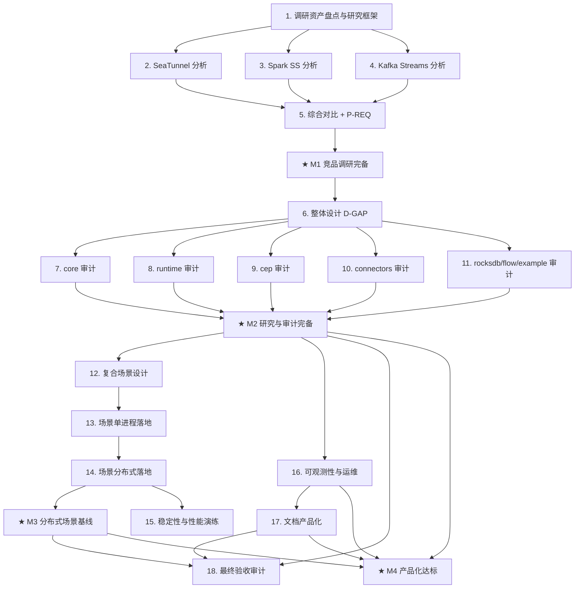

# nop-stream 产品化路线图

> Last updated: 2026-09-01 (items 2/3/4 → done, plan 0753-2 completed with closure audit PASS; item 5 remains planned, plan 0753-3 awaits execution; M1 blocked on item 5)
> Sources:
> - `ai-dev/backlog/nop-stream-production-roadmap.md`（前序路线图，Items 14—56 全部 done — 73 条源码级缺口收口，primary baseline）
> - `ai-dev/analysis/nop-stream/08-gap-analysis.md`（73 条显式缺口 G1—G68, D69—D73，已全部 Closed/Excluded）
> - `ai-dev/analysis/nop-stream-flink-comparison-deep-dive.md`, `2026-05-19a-seatunnel-vs-nop-stream-comparison.md`, `2026-05-23-nop-stream-beam-hazelcast-comparison.md`（已有竞品对比）
> - `ai-dev/analysis/2026-05-20-nop-stream-duplicate-code-audit.md`, `2026-06-30-nop-stream-code-audit.md`, `2026-04-02-nop-stream-design-review.md`（已有代码/设计审计）
> - `~/sources`（51 个已下载参考项目：flink、beam、tis 等）
> - `ai-dev/design/nop-stream/`（16 份设计文档）

## Purpose

把 nop-stream 从「技术完备」（73 缺口收口、分布式/HA/failover 落地）推进到「产品化达标」：以竞品产品化实践为参照，完成整体设计与逐模块审计（消除重复代码、确保核心逻辑优雅可靠），设计并真实落地可运行的复杂复合使用场景（强制分布式多 JVM 验证），最终使设计、实现和实际功能应用都达到产品要求。

本 roadmap 是**自进化文档**：mission 执行过程中发现的修正项以 Follow-up 工作项追加（见 Rules），驱动 `./tools/mission-driver.sh nop-stream-productization` 自主循环。

Does not contain implementation details. Each `planned` stage is owned by its execution plan.

## Work Items

> **This is the only dynamic state block. Update status only here.**
> The roadmap is a human-AI alignment artifact: humans set items and their order;
> AI takes the first `todo` item, drafts/executes plans, and writes the item back
> to `done` when closure audit passes.
>
> 分组标题（Phase X）为组织视图，无独立状态。里程碑（★）状态为派生值。

### Phase R — 竞品调研（产品化视角）

- 1. 调研资产盘点与研究框架：盘点 `~/sources` 已有源码与 `ai-dev/analysis` 已有报告，定义产品化评估维度矩阵（API/DX、连接器生态、部署形态、运维监控、容错语义、性能、文档），输出调研索引与缺口清单（识别未覆盖的竞品与分析维度）: `done`（plan `ai-dev/plans/nop-stream-productization/2026-09-01-0753-1-research-asset-inventory-and-evaluation-framework.md` completed 2026-09-01，closure audit PASS；产出 `ai-dev/analysis/2026-09/2026-09-01-research-asset-inventory-and-evaluation-framework.md`；含前序 mission 遗留 8 条 stale gap-analysis 行收口；关键发现：`~/sources/data-integration/seatunnel` 已有完整 checkout，item 2 clone 裁定留给其 plan）
- 2. SeaTunnel 源码获取与产品化分析（连接器生态、CDC 产品化、多引擎适配层、部署/监控形态；shallow clone 到 `~/sources`，报告写入 `ai-dev/analysis/`）: `done`（plan `2026-09-01-0753-2-competitor-source-productization-analysis.md` Phase 1 completed 2026-09-01，closure audit PASS；`~/sources/seatunnel@5dbfb374`；报告 `ai-dev/analysis/2026-09/2026-09-01-seatunnel-productization-analysis.md`：CONN/DEPL/OPS/DOC 3@high、API 2@high、FT 2@medium、PERF 2@high + `ST-1..10` P-REQ 候选）
- 3. Spark Structured Streaming 源码获取与产品化分析（micro-batch/continuous 双模式、adaptive query execution、状态存储与运维产品化）: `done`（同上 plan Phase 2 completed 2026-09-01，closure audit PASS；`~/sources/spark@992b0905`（完整 depth-1 裁定见报告附录 A）；报告 `2026-09-01-spark-structured-streaming-productization-analysis.md`：API/OPS/PERF/DEPL/DOC 3@high、FT/CONN 2@high + `SPS-1..9` 候选；核心证据：AQE 与 stateful/Real-time 互斥 SPARK-53941、Real-time Mode 4.1 新路线）
- 4. Kafka Streams 源码获取与产品化分析（库形态 vs 引擎形态对比、事务性 exactly-once、interactive query、运维模型倒推）: `done`（同上 plan Phase 3 completed 2026-09-01，closure audit PASS；`~/sources/kafka@7434a60c`；报告 `2026-09-01-kafka-streams-productization-analysis.md`：FT/API/DOC 3@high、DEPL/OPS/PERF 2@high、CONN 1@high（by design）+ `KS-1..9` 候选；核心命题结论：库形态只内建逻辑健康，进程编排倒推宿主——nop-stream 取逻辑健康信号面）
- 5. 竞品综合对比与产品化要求清单（综合 Flink/Beam/SeaTunnel/Spark/Kafka Streams/tis/Hazelcast 已有+新增报告，按评估矩阵输出 **P-REQ 清单**并映射到 Phase D/M/S 工作项）: `planned`（plan `2026-09-01-0753-3-competitor-synthesis-p-req-list.md`；tis 证据 `ai-dev/analysis/2026-08/2026-08-14d-tis-vs-nop-data-integration-comparison.md`）
- ★ **M1 里程碑：竞品调研完备**（unlocks when 1—5 done）

### Phase D — 整体设计分析

- 6. nop-stream 整体设计产品化 gap 分析（对照 P-REQ 清单 + 16 份设计文档 + 现有 476+ 测试，产出 D-GAP 清单与修正建议；对 README 已声明的未实现项 — K8s/YARN 部署编排、HPA、RuntimeTopology 概念阶段 — 逐项裁定 go/defer/exclude）: `todo`

### Phase M — 模块审计（去重 + 核心逻辑优雅性/可靠性）

> 审计项统一模式：验证 2026-05-20 duplicate-code audit 与 2026-06-30 code audit 的整改收口 + 产品化视角新增审计；小缺陷就地修复，大缺陷转为 Follow-up 工作项。

- 7. nop-stream-core 审计（执行管线/窗口/checkpoint 核心路径）: `todo`
- 8. nop-stream-runtime 审计（分布式执行、HA、supervision loop、数据面）: `todo`
- 9. nop-stream-cep 审计（NFA/SharedBuffer/模式编译）: `todo`
- 10. connectors 审计（connector/batch/jdbc/debezium 四模块：重复代码、契约一致性、与 core 的重复逻辑）: `todo`
- 11. rocksdb / flow / fraud-example 审计（状态后端、XDSL 编译、示例产品的产品化程度）: `todo`
- ★ **M2 里程碑：研究与审计完备**（unlocks when M1 + 6—11 done）

### Phase S — 复合场景与分布式落地

- 12. 复合场景设计文档（基于 fraud-example 扩展 2—3 个场景，如 S1: CDC source → CEP → 窗口聚合 → 2PC JDBC sink；S2: 文件 source → keyBy 聚合 + Delta 定制拓扑 → 文件 sink + rescale；定义可运行验收标准与分布式验证矩阵）: `todo`
- 13. 复合场景单进程落地（LOCAL 模式 E2E 全部跑通 + 修复发现缺陷；XDSL 声明式定义优先）: `todo`
- 14. 复合场景分布式落地（MiniStreamCluster 真实多 JVM DISTRIBUTED 模式：kill/recover/fencing 演练 + rescale 验证 + exactly-once 断言）: `todo`
- 15. 分布式稳定性与性能演练（长时 soak、backpressure 行为、chaos 矩阵 + 指标采集；允许与 Phase P 并行）: `todo`
- ★ **M3 里程碑：分布式场景基线**（unlocks when 13 + 14 done）

### Phase P — 产品化收敛

- 16. 可观测性与运维产品化（按 item 6 的 D-GAP 裁剪：metrics 暴露收敛、健康检查、运维操作手册；优先复用平台既有设施）: `todo`
- 17. 文档产品化（用户指南、连接器目录、`docs-for-ai/` owner doc 与 source-anchors/INDEX 同步）: `todo`
- 18. 产品化最终验收审计（independent closure audit：对照 P-REQ 全清单逐项核验，产出验收报告）: `todo`
- ★ **M4 里程碑：产品化达标**（unlocks when M2 + M3 + 16—18 done）

## Status values

| Status | Meaning |
| --- | --- |
| `todo` | Not started, no plan |
| `planned` | Has execution plan, passed draft review |
| `done` | Complete, passed closure audit |

> Milestone status is derived: milestone flips to `done` only when all its dependencies are `done`.

## Framework / platform reuse

| Capability | Provider | Notes |
| --- | --- | --- |
| 跨 JVM 消息传输 | `IMessageService`（SysDao/Pulsar/Kafka 三后端 + `IDataPlaneWireCodec`） | 已实现，勿重建 |
| Checkpoint 存储 | `ICheckpointStorage`（LocalFile/JDBC） | 已实现 |
| 状态后端 | `RocksDBStateBackend`（增量快照/TTL/key-group layout v2） | 已实现 |
| 多 JVM 测试基建 | `MiniStreamCluster`（ProcessBuilder + H2 AUTO_SERVER） | 已实现，Phase S 直接复用 |
| 集群发现/选举 | nop-cluster discovery + `JdbcLeaderElector`/`SysDaoLeaderElector` | 已实现 |
| 声明式编排 | XDSL `.stream.xml` + Delta 定制（nop-stream-flow） | 已实现 |
| 容错 | region-based failover + supervision loop + unaligned checkpoint | 已实现（Stage 43—47） |
| CEP | NFA + Guava SharedBuffer | 已实现 |
| 2PC sink 框架 | `TwoPhaseCommitSinkFunction`（JDBC/File 实现） | 已实现 |
| 竞品源码 | `~/sources`（flink、beam、tis 等 51 项已下载） | 新增竞品 shallow clone 后同样存放于此 |
| 文档合同 | `docs-for-ai/INDEX.md` + `04-reference/source-anchors.md` | 文档变更后跑 link checker |

## Current baseline

**Already shipped（前序 production roadmap Items 14—56 全部 done）:**
- 73 条 Flink 源码级对比缺口全部 Closed / 裁定 Excluded（见 `ai-dev/analysis/nop-stream/08-gap-analysis.md`）
- 五层编译管线（StreamModel→StreamGraph→JobGraph→PartitionedPlan→DeploymentPlan）+ LOCAL/DISTRIBUTED 双模式
- 跨 JVM 控制面 RPC（fencing token 统一）+ 数据面 wire codec（SysDao/Pulsar/Kafka）
- HA leader election、region-based failover、drain/reconnect、unaligned checkpoint、多并发 checkpoint
- RocksDB 状态后端 + 增量 checkpoint + State TTL + 状态迁移 + Key-Group rescale（含离线 reshard 工具）
- FLIP-27 Source 体系、CDC（Debezium + offset checkpoint）、事务型 JDBC/File sink（exactly-once）
- CEP（NFA + Guava cache）、XDSL 声明式编排 + Delta 定制
- `MiniStreamCluster` 多 JVM 测试基建 + 独立进程入口（`JobCoordinatorMain`/`TaskManagerMain`）
- 476+ 测试文件（10 个子模块）

**Main productization gaps（本 roadmap 要解决的，初始假设，由 Phase R/D 核验修正）:**
- SeaTunnel / Spark Structured Streaming / Kafka Streams 源码未下载，产品化视角对比不完整
- 缺少系统化的「产品化要求清单」：部署形态、运维监控、可观测性、用户文档的产品标准未定义
- 代码审计（2026-05-20/2026-06-30）整改后的持续验证不足，模块间重复代码与核心逻辑优雅性未按产品标准复审
- 复杂复合场景（CDC + CEP + 窗口 + 2PC + rescale 组合）端到端真实分布式运行验证不足
- K8s/YARN 部署编排、HPA 未实现（README 声明），RuntimeTopology 处于概念阶段 — 需产品级裁定

## Stages

| # | Stage | Owner plan | Deps | Critical path | Reuse |
| --- | --- | --- | --- | --- | --- |
| 1 | 调研资产盘点与研究框架 | per-item plan | — | **Yes** | `~/sources` + `ai-dev/analysis` 索引 |
| 2 | SeaTunnel 产品化分析 | per-item plan | 1 | **Yes** | shallow clone |
| 3 | Spark Structured Streaming 产品化分析 | per-item plan | 1 | **Yes** | shallow clone |
| 4 | Kafka Streams 产品化分析 | per-item plan | 1 | **Yes** | shallow clone |
| 5 | 竞品综合对比 + P-REQ 清单 | per-item plan | 2, 3, 4 | **Yes** | 已有对比报告 |
| ★ | M1 竞品调研完备 | — | 1—5 | — | — |
| 6 | 整体设计产品化 gap 分析（D-GAP） | per-item plan | M1 | **Yes** | 16 份设计文档 |
| 7 | core 审计 | per-item plan | 6 | **Yes** | 已有审计报告 |
| 8 | runtime 审计 | per-item plan | 6 | **Yes** | 已有审计报告 |
| 9 | cep 审计 | per-item plan | 6 | **Yes** | 已有审计报告 |
| 10 | connectors 审计 | per-item plan | 6 | **Yes** | 已有审计报告 |
| 11 | rocksdb/flow/fraud-example 审计 | per-item plan | 6 | **Yes** | 已有审计报告 |
| ★ | M2 研究与审计完备 | — | M1 + 6—11 | — | — |
| 12 | 复合场景设计文档 | per-item plan | M2（6 的 D-GAP 输入场景约束） | **Yes** | fraud-example |
| 13 | 场景单进程落地 | per-item plan | 12 | **Yes** | XDSL/Delta、AutoTest |
| 14 | 场景分布式落地 | per-item plan | 13 | **Yes** | `MiniStreamCluster` |
| 15 | 稳定性与性能演练 | per-item plan | 14 | No（可与 Phase P 并行） | `MiniStreamCluster` |
| ★ | M3 分布式场景基线 | — | 13 + 14 | — | — |
| 16 | 可观测性与运维产品化 | per-item plan | M2（D-GAP 裁剪） | **Yes** | 平台 metrics/discovery |
| 17 | 文档产品化 | per-item plan | 16 | **Yes** | `docs-for-ai` 体系 |
| 18 | 产品化最终验收审计 | per-item plan | M2 + M3 + 16, 17 | **Yes** | closure-audit prompt |
| ★ | M4 产品化达标 | — | M2 + M3 + 16—18 | — | — |

## Stage details

### 1. 调研资产盘点与研究框架

> Status: see Work Items above

**Goal:** 建立竞品调研的产品化评估框架与资产索引，识别未覆盖的竞品与分析维度。

**Deliverables:**
- `~/sources` 与 `ai-dev/analysis` 现有资产盘点（含 flink/beam/tis 源码、8 份 nop-stream 对比分析、多份竞品对比报告）
- 产品化评估维度矩阵（API/DX、连接器生态、部署形态、运维监控、容错语义、性能、文档，含评分标准）
- 缺口清单：未下载竞品、未覆盖维度 → 输入 items 2—4 scope 校准

**Out of scope:** 下载新源码（items 2—4）、撰写对比结论（item 5）。
**Module / area:** `ai-dev/analysis/`（报告）、`~/sources`（只读盘点）。

### 2. SeaTunnel 源码获取与产品化分析

> Status: see Work Items above

**Goal:** 获取 SeaTunnel 源码并从产品化视角分析，产出可借鉴的产品实践清单。

**Deliverables:**
- shallow clone（`--depth 1`）到 `~/sources/seatunnel`
- 产品化分析报告：连接器生态组织方式、CDC 产品化、多引擎适配层（Source/Sink API 抽象）、部署形态（本地/集群/K8s）、监控与运维、配置 DSL 与向导
- 借鉴点 → P-REQ 候选条目（供 item 5 汇总）

**Out of scope:** 其他竞品、nop-stream 侧改动。
**Module / area:** `ai-dev/analysis/`。

### 3. Spark Structured Streaming 源码获取与产品化分析

> Status: see Work Items above

**Goal:** 同 item 2 模式，聚焦 Spark Structured Streaming。

**Deliverables:**
- shallow clone `spark`（或仅 streaming 相关子集）到 `~/sources/spark`
- 产品化分析报告：micro-batch vs continuous 双模式的取舍、adaptive query execution、状态存储与 checkpoint 产品化、Structured Streaming API 设计、运维/监控集成
- 借鉴点 → P-REQ 候选条目

**Out of scope:** Spark 非流处理部分深挖。
**Module / area:** `ai-dev/analysis/`。

### 4. Kafka Streams 源码获取与产品化分析

> Status: see Work Items above

**Goal:** 同 item 2 模式，聚焦 Kafka Streams 的库形态产品化。

**Deliverables:**
- shallow clone `kafka`（streams 子模块为主）到 `~/sources/kafka`
- 产品化分析报告：库形态 vs 引擎形态的运维差异、事务性 exactly-once 集成、状态存储（RocksDB 内嵌）、interactive query、liveness/健康暴露
- 借鉴点 → P-REQ 候选条目

**Out of scope:** Kafka broker/storage 深挖。
**Module / area:** `ai-dev/analysis/`。

### 5. 竞品综合对比与产品化要求清单（P-REQ）

> Status: see Work Items above

**Goal:** 汇总全部竞品证据，定义 nop-stream 的产品化要求清单。

**Deliverables:**
- 综合对比报告（矩阵：竞品 × 产品化维度，引用 items 1—4 + 已有 Flink/Beam/Hazelcast/SeaTunnel 对比报告）
- **P-REQ 清单**：编号的产品化要求（每条含验收标准 + 来源依据 + 建议归属工作项），映射到 Phase D/M/S items
- 对 items 6—18 scope 的修正建议（自进化入口之一）

**Out of scope:** nop-stream 侧代码改动。
**Module / area:** `ai-dev/analysis/`。

### 6. nop-stream 整体设计产品化 gap 分析

> Status: see Work Items above

**Goal:** 对照 P-REQ 审视 nop-stream 整体设计，产出 D-GAP 清单与裁定。

**Deliverables:**
- D-GAP 清单（设计层缺口，每条含 go/defer/exclude 裁定 + 依据）
- K8s/YARN 部署编排、HPA、RuntimeTopology 三项 README 已声明未实现项的正式裁定
- 对 Phase M 审计重点与 Phase S 场景设计的输入（自进化入口之二）

**Out of scope:** 模块级代码审计（items 7—11）。
**Module / area:** `ai-dev/analysis/` + `ai-dev/design/nop-stream/`。

### 7. nop-stream-core 审计 / 8. nop-stream-runtime 审计 / 9. nop-stream-cep 审计

> Status: see Work Items above

**Goal:** 逐模块按产品标准审计：重复代码、核心逻辑优雅性、可靠性。

**Deliverables（每模块）:**
- 审计报告（引用 2026-05-20/2026-06-30 已有审计验证收口 + 产品化新增审计）
- 小缺陷就地修复（单 plan 范围内）；大缺陷转为 Follow-up 工作项（自进化入口之三）
- 回归测试全绿

**Out of scope:** 跨模块重构（需 Follow-up 立项）。
**Module / area:** `nop-stream/nop-stream-core|runtime|cep/`。

### 10. connectors 审计

> Status: see Work Items above

**Goal:** connector/batch/jdbc/debezium 四模块统一审计。

**Deliverables:**
- 四模块审计报告：模块间重复代码、与 core 的重复逻辑、source/sink 契约一致性、错误处理与资源管理
- 契约一致性测试补齐 + 小缺陷就地修复

**Out of scope:** 新连接器开发。
**Module / area:** `nop-stream/nop-stream-connector*/`。

### 11. rocksdb / flow / fraud-example 审计

> Status: see Work Items above

**Goal:** 状态后端、XDSL 编译层、示例产品的产品化审计。

**Deliverables:**
- 三模块审计报告（RocksDB 后端健壮性、DSL 编译器与 XDef 合同、fraud-example 作为产品示例的完整度）
- fraud-example 产品化程度评估 → item 12 场景设计输入

**Out of scope:** 大规模示例重写（item 12/13 处理）。
**Module / area:** `nop-stream/nop-stream-rocksdb|flow|fraud-example/`。

### 12. 复合场景设计文档

> Status: see Work Items above

**Goal:** 设计 2—3 个复杂复合使用场景并定义可运行验收标准。

**Deliverables:**
- 场景设计文档（S1: CDC → CEP → 窗口聚合 → 2PC JDBC sink；S2: 文件 source → keyBy 聚合 + Delta 定制拓扑 → exactly-once 文件 sink + rescale；S3 可选，由 D-GAP/P-REQ 派生）
- 每场景：XDSL 拓扑定义、数据流、验收断言（正确性 + exactly-once + 恢复语义）、分布式验证矩阵（kill/rescale/backpressure 组合）

**Out of scope:** 场景实现（items 13/14）。
**Module / area:** `ai-dev/design/nop-stream/`。

### 13. 复合场景单进程落地

> Status: see Work Items above

**Goal:** LOCAL 模式跑通全部复合场景并修复发现的缺陷。

**Deliverables:**
- 场景 XDSL 定义 + 可运行测试（AutoTest/JUnit 5）
- 场景级缺陷修复 + 回归测试
- 全模块测试全绿

**Out of scope:** 多 JVM 验证（item 14）。
**Module / area:** `nop-stream/nop-stream-fraud-example/`（或新 demo 模块，plan 裁定）。

### 14. 复合场景分布式落地

> Status: see Work Items above

**Goal:** MiniStreamCluster 真实多 JVM DISTRIBUTED 模式验证复合场景。

**Deliverables:**
- 多 JVM E2E：场景部署 → kill TaskManager → recover（fencing 断言）→ rescale → exactly-once 结果断言
- 分布式路径缺陷修复 + gated 测试（`@EnabledIfSystemProperty`）全绿
- 分布式运行手册初稿（供 item 16/17 深化）

**Out of scope:** 性能压测（item 15）。
**Module / area:** `nop-stream/nop-stream-runtime/`。

### 15. 分布式稳定性与性能演练

> Status: see Work Items above

**Goal:** 产品级稳定性证据：长时运行与 chaos 演练。

**Deliverables:**
- 演练矩阵执行报告：soak（长时运行 + 状态增长）、backpressure 行为（buffer pool/credit）、chaos（随机 kill、网络分区模拟 — 按 wire 后端能力裁剪）
- 瓶颈/缺陷清单 → Follow-up 工作项（自进化入口之四）

**Out of scope:** SLO/基准测试框架建设。
**Module / area:** `nop-stream/` + `_tmp/`（演练产物）。

### 16. 可观测性与运维产品化

> Status: see Work Items above

**Goal:** 按 D-GAP 裁剪交付运维级可观测性。

**Deliverables:**
- metrics 暴露收敛（checkpoint 延迟/背压/吞吐/状态大小等核心指标，优先复用平台既有 metrics 设施）
- 健康检查与运维操作（启动/停止/savepoint/恢复）手册
- D-GAP 相关运维项收口或裁定

**Out of scope:** 新监控平台建设。
**Module / area:** `nop-stream/nop-stream-runtime/` + `docs-for-ai/`。

### 17. 文档产品化

> Status: see Work Items above

**Goal:** 面向产品用户的文档体系。

**Deliverables:**
- 用户指南（DataStream API + XDSL 编排 + 连接器使用 + 分布式部署）
- 连接器目录（source/sink 能力矩阵：exactly-once/CDC/并行度支持）
- `docs-for-ai/INDEX.md` + source-anchors 同步，link checker 通过

**Out of scope:** 营销/官网类内容。
**Module / area:** `docs-for-ai/`。

### 18. 产品化最终验收审计

> Status: see Work Items above

**Goal:** independent closure audit 对照 P-REQ 全清单逐项核验。

**Deliverables:**
- 验收报告：P-REQ 逐条状态（met / adjudicated-excluded + 依据），D-GAP 与 Follow-up 清零或裁定
- 未尽项 → Follow-up backlog（若为 P0 级则本 roadmap 不关闭）

**Out of scope:** 新功能开发。
**Module / area:** `ai-dev/audits/nop-stream-productization/`。

## Dependency graph

## Cross-cutting concerns

| Concern | Notes |
| --- | --- |
| 验证基线 | 每个 code-touching plan：`./mvnw test -pl nop-stream -am -T 1C` 全绿；docs 变更跑 `node ai-dev/tools/check-doc-links.mjs --strict` |
| 网络与外部目录 | 竞品源码 shallow clone（`--depth 1`）到 `~/sources`（用户指定目录）；临时产物一律放 `_tmp/`，禁用系统 `/tmp` |
| 生成文件禁改 | `_` 前缀文件/目录为生成物，改动须上移到源模型/Delta/模板 |
| 不重建既有能力 | 见 Framework / platform reuse 表；产品化优先复用平台设施，不引入新框架 |
| 分布式验证真实性 | DISTRIBUTED 验证必须走 `MiniStreamCluster` 真实多 JVM，禁止仅单进程模拟充当分布式证据 |
| 研究类交付物 | 竞品分析/审计报告写入 `ai-dev/analysis/`（遵循 `00-analysis-writing-guide.md`），以 docs commit 收口 |
| 自进化机制 | 四个修正入口：item 5（P-REQ 修正 scope）、item 6（D-GAP 修正审计/场景重点）、items 7—11 审计发现、item 15 演练发现；均以 Follow-up 工作项追加（见 Rules） |
| 审计独立性 | closure audit 用独立 subagent，禁止自审；item 18 为最终独立验收 |

## Rules

- This file is a state index and coarse decomposition, not an execution plan.
- Each `planned` stage is owned by its execution plan.
- Status changes happen only in the Work Items block at the top.
- Milestones are derived: dependencies must all be `done` before the milestone is marked `done`.
- **自进化规则（本 roadmap 核心机制）**：mission 执行中（DRAFT_PLANS/CLOSURE_AUDIT/DEEP_AUDIT 各环节）发现需要修正 roadmap 时，以 **Follow-up 工作项**追加到 Work Items 末尾（编号顺延，状态 `todo`，标注来源 plan/audit）；需要调整既有工作项语义或顺序时，遵循 stop-edit-restart（先停 mission，再编辑，再重启）。每次修正同步更新头部 Last updated。
- Follow-up 工作项与既有 items 同权参与「取第一个 `todo`」调度，不跳过、不重排（追加仅在末尾）。
