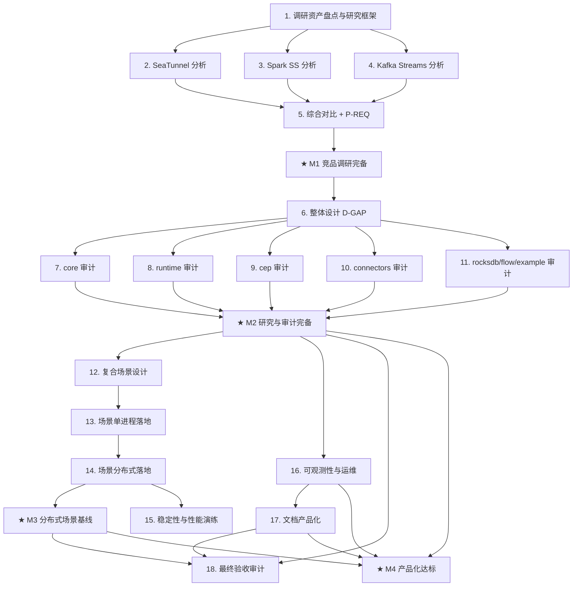

# nop-stream 产品化路线图

> Last updated: 2026-09-03 (item 17 → `done`：plan 0617-1 completed——文档产品化四新页（用户指南含 P-REQ-16 触发语义映射表/连接器目录/CDC cookbook/迁移指南）+ quickstart 脚手架（P-REQ-25，3 拓扑端到端验证全绿）+ D-DRIFT-1 核销 + INDEX/anchors 同步，closure audit CLOSURE-APPROVED；item 18 保持 `planned`（硬依赖已满足，可调度）)
> Sources:
> - `ai-dev/backlog/nop-stream-production-roadmap.md`（前序路线图，Items 14—56 全部 done — 73 条源码级缺口收口，primary baseline）
> - `ai-dev/analysis/nop-stream/08-gap-analysis.md`（73 条显式缺口 G1—G68, D69—D73，已全部 Closed/Excluded）
> - `ai-dev/analysis/nop-stream-flink-comparison-deep-dive.md`, `2026-05-19a-seatunnel-vs-nop-stream-comparison.md`, `2026-05-23-nop-stream-beam-hazelcast-comparison.md`（已有竞品对比）
> - `ai-dev/analysis/2026-05-20-nop-stream-duplicate-code-audit.md`, `2026-06-30-nop-stream-code-audit.md`, `2026-04-02-nop-stream-design-review.md`（已有代码/设计审计）
> - `~/sources`（51 个已下载参考项目：flink、beam、tis 等）
> - `ai-dev/design/nop-stream/`（16 份设计文档）

## Purpose

把 nop-stream 从「技术完备」（73 缺口收口、分布式/HA/failover 落地）推进到「产品化达标」：以竞品产品化实践为参照，完成整体设计与逐模块审计（消除重复代码、确保核心逻辑优雅可靠），设计并真实落地可运行的复杂复合使用场景（强制分布式多 JVM 验证），最终使设计、实现和实际功能应用都达到产品要求。

本 roadmap 是**自进化文档**：mission 执行过程中发现的修正项以 Follow-up 工作项追加（见 Rules），驱动 `./tools/mission-driver.sh nop-stream-productization` 自主循环。

Does not contain implementation details. Each `planned` stage is owned by its execution plan.

## Work Items

> **This is the only dynamic state block. Update status only here.**
> The roadmap is a human-AI alignment artifact: humans set items and their order;
> AI takes the first `todo` item, drafts/executes plans, and writes the item back
> to `done` when closure audit passes.
>
> 分组标题（Phase X）为组织视图，无独立状态。里程碑（★）状态为派生值。

### Phase R — 竞品调研（产品化视角）

- 1. 调研资产盘点与研究框架：盘点 `~/sources` 已有源码与 `ai-dev/analysis` 已有报告，定义产品化评估维度矩阵（API/DX、连接器生态、部署形态、运维监控、容错语义、性能、文档），输出调研索引与缺口清单（识别未覆盖的竞品与分析维度）: `done`（plan `ai-dev/plans/nop-stream-productization/2026-09-01-0753-1-research-asset-inventory-and-evaluation-framework.md` completed 2026-09-01，closure audit PASS；产出 `ai-dev/analysis/2026-09/2026-09-01-research-asset-inventory-and-evaluation-framework.md`；含前序 mission 遗留 8 条 stale gap-analysis 行收口；关键发现：`~/sources/data-integration/seatunnel` 已有完整 checkout，item 2 clone 裁定留给其 plan）
- 2. SeaTunnel 源码获取与产品化分析（连接器生态、CDC 产品化、多引擎适配层、部署/监控形态；shallow clone 到 `~/sources`，报告写入 `ai-dev/analysis/`）: `done`（plan `2026-09-01-0753-2-competitor-source-productization-analysis.md` Phase 1 completed 2026-09-01，closure audit PASS；`~/sources/seatunnel@5dbfb374`；报告 `ai-dev/analysis/2026-09/2026-09-01-seatunnel-productization-analysis.md`：CONN/DEPL/OPS/DOC 3@high、API 2@high、FT 2@medium、PERF 2@high + `ST-1..10` P-REQ 候选）
- 3. Spark Structured Streaming 源码获取与产品化分析（micro-batch/continuous 双模式、adaptive query execution、状态存储与运维产品化）: `done`（同上 plan Phase 2 completed 2026-09-01，closure audit PASS；`~/sources/spark@992b0905`（完整 depth-1 裁定见报告附录 A）；报告 `2026-09-01-spark-structured-streaming-productization-analysis.md`：API/OPS/PERF/DEPL/DOC 3@high、FT/CONN 2@high + `SPS-1..9` 候选；核心证据：AQE 与 stateful/Real-time 互斥 SPARK-53941、Real-time Mode 4.1 新路线）
- 4. Kafka Streams 源码获取与产品化分析（库形态 vs 引擎形态对比、事务性 exactly-once、interactive query、运维模型倒推）: `done`（同上 plan Phase 3 completed 2026-09-01，closure audit PASS；`~/sources/kafka@7434a60c`；报告 `2026-09-01-kafka-streams-productization-analysis.md`：FT/API/DOC 3@high、DEPL/OPS/PERF 2@high、CONN 1@high（by design）+ `KS-1..9` 候选；核心命题结论：库形态只内建逻辑健康，进程编排倒推宿主——nop-stream 取逻辑健康信号面）
- 5. 竞品综合对比与产品化要求清单（综合 Flink/Beam/SeaTunnel/Spark/Kafka Streams/tis/Hazelcast 已有+新增报告，按评估矩阵输出 **P-REQ 清单**并映射到 Phase D/M/S 工作项）: `done`（plan `2026-09-01-0753-3-competitor-synthesis-p-req-list.md` completed 2026-09-01，closure audit PASS（8/8，session `ses_fa56dadccffecEazHBGZCJCd2R`）；报告 `ai-dev/analysis/2026-09/2026-09-01-competitor-productization-synthesis-and-p-req.md`：7×7 矩阵（45 评分格 + 4 no-evidence）+ **P-REQ-1..28**（P0×5/P1×19/P2×4，归属 item 16×12/6×9/17×4/11×2/Follow-up×1）+ 修正建议（Follow-up item 19 落库；tis ②③⑥显式拒绝）；05-19a 报告 superseded、tis 报告裁定保持 open；**M1 解锁**，item 6 可启动）
- ★ **M1 里程碑：竞品调研完备**（unlocks when 1—5 done）: `done`（2026-09-01，items 1—5 全 done）

### Phase D — 整体设计分析

- 6. nop-stream 整体设计产品化 gap 分析（对照 P-REQ 清单 + 16 份设计文档 + 现有 476+ 测试，产出 D-GAP 清单与修正建议；对 README 已声明的未实现项 — K8s/YARN 部署编排、HPA、RuntimeTopology 概念阶段 — 逐项裁定 go/defer/exclude）: `done`（plan `ai-dev/plans/nop-stream-productization/2026-09-01-0938-1-design-productization-gap-analysis.md` completed 2026-09-01，closure audit PASS（session `ses_fa535e4eeffehOuSbEvfm8PM1A`）；产出 **D-GAP 报告** `ai-dev/analysis/2026-09/2026-09-01-nop-stream-design-productization-gap-analysis.md`——P-REQ-13..21 全量三态裁定（go×4/defer×3/exclude×2，P-REQ-15 混合：K8s defer、YARN/HPA/RuntimeTopology exclude）+ 下游输入（§3.1 Phase M 审计重点 / §3.2 Phase S 约束 + S3 不派生 / §3.3 item 16 裁剪建议）；Follow-up item 20 追加；F-2 stop-edit-restart 建议提请执行；设计 drift 2 项（D-DRIFT-1 RuntimeTopology / D-DRIFT-2 EpochManifest 字段）有处置路径）

### Phase M — 模块审计（去重 + 核心逻辑优雅性/可靠性）

> 审计项统一模式：验证 2026-05-20 duplicate-code audit 与 2026-06-30 code audit 的整改收口 + 产品化视角新增审计；小缺陷就地修复，大缺陷转为 Follow-up 工作项。

- 7. nop-stream-core 审计（执行管线/窗口/checkpoint 核心路径）: `done`（plan `ai-dev/plans/nop-stream-productization/2026-09-01-0938-2-core-module-audit.md` completed 2026-09-01，closure audit **CLOSURE-APPROVED**（session `ses_fa4f7c567ffezlrg0acXrjKG3J`，9/9 PASS，2 Minor 均处置）；产出审计报告 `ai-dev/analysis/2026-09/2026-09-01-nop-stream-core-module-audit.md`（resolved）——05-20/06-30 core 相关组收口核验（无回潮）+ D-GAP core 三重点消化（Trigger 语义证据表供 item 17）+ **Flink/Beam 8 低置信格 Phase M 级裁定：全部无需补评**（items 8—11 引用 §2.2，勿重复裁定）+ 15 项小缺陷修复（10 项配 focused 测试）+ Follow-up items 21—24 追加 + hollow-scan 工具 P1 消息语义分级修正（guard 误报降 low、stub 仍 high）；全模块回归绿 + 四工具门禁 exit 0；§7 空壳模块结论（3 删 1 实现）供 items 8—11 引用）
- 8. nop-stream-runtime 审计（分布式执行、HA、supervision loop、数据面）: `done`（plan `ai-dev/plans/nop-stream-productization/2026-09-01-0938-3-runtime-module-audit.md` completed 2026-09-01，closure audit PASS（session `ses_fa44b7fbcffe8IZHXkYJotg2is`，17 Gate 15 PASS + 2 Minor 均处置）；产出审计报告 `ai-dev/analysis/2026-09/2026-09-01-nop-stream-runtime-module-audit.md`（resolved）——05-20/06-30 runtime 相关组收口核验（无回潮，死代码组 6 清除/3 收编/1 迁移 core）+ D-GAP runtime 两重点四分项消化（P-REQ-20 D-DRIFT-2 方向裁定、torn-write 注入测试补齐）+ 24 项小缺陷修复（R-1..R-24 + G6/G7，26 个新 focused 用例；R-14 fencing 回滚防护配真实 3 进程 gated 多 JVM 测试，7/7 绿）+ Follow-up items 25—28 追加；全模块回归绿 + 五工具门禁 exit 0）
- 9. nop-stream-cep 审计（NFA/SharedBuffer/模式编译）: `done`（plan `ai-dev/plans/nop-stream-productization/2026-09-01-1457-1-cep-module-audit.md` completed 2026-09-01，closure audit **CLOSURE-APPROVED**（session `ses_fa314ff8dffecIdD27vrS7NA2U`，8/8 PASS））；产出审计报告 `ai-dev/analysis/2026-09/2026-09-01-nop-stream-cep-module-audit.md`（resolved）——05-20 §2 cep 主体侧/06-30 十项收口核验（无 regressed，唯一 partial 路由 item 22）+ 2300-2 cep 侧三点全 live 复核 + D-GAP item 9「无额外重点」勾销 + 8 项小缺陷修复（CE-1 high：内层 windowTime 静默禁用 fail-fast 等，4 项行为修复配 10 个新 focused 用例 + fix-revert 验证）+ 前置会话断点三件套收口（遗留失败测试/scratch 文件/invariant 注册表漂移）+ watch-only 14 组（无大缺陷，无 Follow-up 追加）；全模块回归绿（cep 359/0）+ 四工具门禁 exit 0）
- 10. connectors 审计（connector/batch/jdbc/debezium 四模块：重复代码、契约一致性、与 core 的重复逻辑）: `done`（plan `ai-dev/plans/nop-stream-productization/2026-09-01-1457-2-connectors-module-audit.md` completed 2026-09-01，closure audit **CLOSURE-APPROVED**（session `ses_fa2f21823ffeesGnoD4qeNUomN`，A.1—A.10 全 PASS））；产出审计报告 `ai-dev/analysis/2026-09/2026-09-01-nop-stream-connectors-module-audit.md`（resolved）——05-20 无 connector 专属组显式记录 / 06-30 十项收口核验（无 regressed，唯一 partial 路由 item 22）/ 2300-1/2/3 零 connector 侧修复点确认 + D-GAP item 10 两项重点消化（**候选钩子清单 H-1..H-6 自包含落地供 item 20 直接消费** + XDef 校验覆盖现状表：8/8 配置 bean 走构造期校验）+ 8 项小缺陷修复（CN-1 high：FileSourceReader 恢复后光标回退（fix-revert 验证）+ 序列化器 fail-fast + close 错误优先级 + taxonomy/null 边界/日志清理，14 个新 focused 用例）+ hollow-scan 工具 P6b 误报修正（temp 领域词检测缺陷）+ owner-doc connector-design.md 3 处 stale 最小同步；watch-only 8 组（无大缺陷，无 Follow-up 追加；**item 22 枚举事实补全：connector 16 文件**）；全模块回归绿 + 五工具门禁 exit 0）
- 11. rocksdb / flow / fraud-example 审计（状态后端、XDSL 编译、示例产品的产品化程度）: `done`（plan `ai-dev/plans/nop-stream-productization/2026-09-01-1457-3-rocksdb-flow-fraud-example-audit.md` completed 2026-09-01，closure audit **CLOSURE-APPROVED**（session `ses_fa2be1d58ffeK9Lb2nWgs2fmfE`，A.1—A.10 全 PASS + 3 Minor 均处置））；产出审计报告 `ai-dev/analysis/2026-09/2026-09-01-nop-stream-rocksdb-flow-fraud-example-audit.md`（resolved）——05-20 无三模块专属组显式记录 / 06-30 十项收口核验（无 regressed，唯一 partial 路由 item 22）/ 2300-2 rocksdb 侧双分支 fail-fast live 复核成立 + 2300-1/3 零三模块修复点确认 + **P2 backlog 两条 rocksdb native-handle 条目收口（RK-1/RK-2）** + D-GAP item 11 三重点消化（P-REQ-20 segment 级 checksum/schemaVersion 端到端真实性成立 / flow XDef 完备性表：5 类 silently-dropped 声明面收敛 build 期 fail-fast、`_gen` 纪律 clean / fraud-example 完整度评估 + Gap A/B/C 缺口清单自包含供 items 12/17）+ 19 项小缺陷修复（15 个新 focused 用例 + 1 fixture + 1 测试重写；FX-1 经 fix-revert 实验如实定性为复制模板修复）+ Follow-up items 29/30 追加；全模块回归绿（868/0）+ 五工具门禁 exit 0；**M2 解锁条件（items 6—11 全 done）随本写回成立**
- ★ **M2 里程碑：研究与审计完备**（unlocks when M1 + 6—11 done）: `done`（2026-09-01，M1 + items 6—11 全 done）

### Phase S — 复合场景与分布式落地

- 12. 复合场景设计文档（基于 fraud-example 扩展 2—3 个场景，如 S1: CDC source → CEP → 窗口聚合 → 2PC JDBC sink；S2: 文件 source → keyBy 聚合 + Delta 定制拓扑 → 文件 sink + rescale；定义可运行验收标准与分布式验证矩阵）: `done`（plan `ai-dev/plans/nop-stream-productization/2026-09-01-2217-1-composite-scenario-design.md` completed 2026-09-01，closure audit **CLOSURE-APPROVED**（session `ses_fa286a702ffeBqX2daZlW0bdF8`，A.1—A.7 全 PASS + 2 Minor 名字漂移均已就地修正））；产出设计文档 `ai-dev/design/nop-stream/composite-scenario-design.md` + README 索引新增场景层——S1/S2 全量设计（拓扑与数据流/XDSL bean-xpl 取舍表/输入输出契约/验收断言 A1-1..A1-7、A2-1..A2-7 全 repo-observable）+ 关键决策 D1—D9 含拒绝替代方案（CDC=replayable 事件源经 `createMessageSource` 注入点（生产 offset checkpoint 路径）/JDBC 目标库=H2（分布式复用 MiniStreamCluster AUTO_SERVER）/连接器参数=bean 引用/Delta=显式路径拓扑级（增算子+边改接）/rescale 双路径必验（restore-time + 离线 reshard 工具）/文件 sink=输出目录规范断言/窗口 assigner 不目录化（W-F5 关闭）/模块=扩展 fraud-example（依赖增量清单内联）/测试驱动=XDSL 入口+runtime harness 组合）+ Gap A/B/C 映射闭环（A→S1；B→S1 富化+S2 主轴+S2-java 对照变体；C→S1/S2 恢复轴+S2 后端切换格）+ 分布式验证矩阵 C0—C3（kill/fencing（task_assignment epoch 严格递增）/restore-rescale/backpressure（观察代理=checkpoint 产物推进+结果完整性），六条硬约束逐条合规对照 + S3 不派生独立裁定行内联）+ 附录 A 六节 live 锚点自包含（items 13/14 无需回读过程文档））
- 13. 复合场景单进程落地（LOCAL 模式 E2E 全部跑通 + 修复发现缺陷；XDSL 声明式定义优先）: `done`（plan `ai-dev/plans/nop-stream-productization/2026-09-01-2217-2-composite-scenario-local-implementation.md` completed 2026-09-02，closure audit **CLOSURE-APPROVED**（独立 general subagent fresh session `ses_fa1ad6cbfffeumKpvD5XpqeGGx`，A.1—D.13 全 PASS，证据见 plan Closure 节））——S1/S2 XDSL 场景在 fraud-example 落地（D8）：S1 `fraud-s1-cdc.stream.xml`（共享前缀 + 4 条 cep→window→aggregate→2PC-JDBC-sink 链，`<patterns>` 4 模式，H2 + per-chain ledger）+ S2 base/delta（`x:extends` 黑名单拓扑级 delta，`FileTwoPhaseCommitSink` 目录规范断言）+ 场景主代码（`UserHistoryEnricher` keyed 富化=UnusualAmount 去 stub + `UserTransactionHistory` 复活、`ReplayableCdcSourceFunction` 生产 offset 路径、`DirectoryFileSourceFunction` 字节 cursor）+ 28 个新测试（断言映射表 A1-1..7/A2-1..7 全归属；A2-4 LOCAL P>1 显式路由 plan 3（2PC sink P>1 fail-fast 硬门禁），LOCAL 侧面覆盖 keyed 续算/双后端恢复/离线 reshard 128→256 恢复执行）；**就地修复 6 项场景发现引擎缺陷**（`ai-dev/bugs/2026-09/2026-09-02-composite-scenario-uncovered-engine-defects.md`：JobGraphGenerator 虚拟链 HashMap 顺序依赖 + 跨 vertex partitioner 丢失 / ProcessOperator keyed backend 未装配 / CEP 状态 JSON 持久化不可用（P2-INV-6 解决：JavaStreamSerializer + `__java_bytes__` marker）/ 2PC pendingCommits 键归一化 / 终态 barrier-写-finished-partition 竞态）；Gap A/B/C 100%（死 `fraud-detection.stream.xml` 删除、README 双入口重写、S2-java 对照变体）；设计文档 A.0 落地裁定 7 项回写；`./mvnw test -pl nop-stream -am -T 1C` 全绿 + hollow/invariants/doc-links/plan-checklist exit 0
- 14. 复合场景分布式落地（MiniStreamCluster 真实多 JVM DISTRIBUTED 模式：kill/recover/fencing 演练 + rescale 验证 + exactly-once 断言）: `done`（plan `ai-dev/plans/nop-stream-productization/2026-09-01-2217-3-composite-scenario-distributed-verification.md` completed 2026-09-02，closure audit **CLOSURE-APPROVED**（独立 general subagent fresh session `ses_f9d9ba880ffeUBCdg4ulKxjRej`，14 项核验 13 PASS + 1 doc-links Blocker 当场修复复验，证据见 plan Closure 节））——launch 基建扩展被场景 gated 测试真实消费：`ClusterPipelineFactory` seam（`pipelineFactoryClass`，工厂失败 fail-fast 不回落 trivial）+ `RemotePipelineSpec`/`RemotePipelineResolver`（XDSL 以声明 spec 跨 JVM 运输、TM 本地重建同构图，fingerprint 一致钉定）+ `RemoteTaskDeploySupport`（TM 侧 tracker/后端/restore-on-deploy 三空白补全，KeyGroupRange 路由恢复）+ launch 周期 checkpoint + 分布式提交/abort 通道 + JC 重启恢复；测试归属裁定路径①（runtime test-jar 导出，沿 core 先例；路径②构成禁戒环被拒）；分布式验证矩阵 100% 逐格（C0 S1/S2、C1 S1（FAILED-report 路径）/S2（租约到期路径）含行为级 fencing 断言（陈旧 epoch mutation RPC 边界拒绝 + epoch 严格递增）与 kill 前 durable manifest 前置；C2 = TM 2→3 跨集群恢复演练（`TestS2RestoreRescaleMultiJvmE2E`，相同 jobId/checkpoint 身份恢复无重复无丢失）+ keyed-P>1+2PC 形态显式路由 CONN-01 successor/item 29（引擎硬门禁）；C3 = sink bean 内节流两场景（节流期间 durable epoch 严格推进 + 释放后精确期望集））；离线 reshard 按 D5 不入矩阵；**就地修复 7 项分布式缺陷**（`ai-dev/bugs/2026-09/2026-09-02-distributed-scenario-engine-defects.md`：remote-deploy checkpoint 接线三空白/barrier 扇出面/timeout abort 级联/新鲜启动 initializeState 缺失/尾部提交丢失/陈旧 attempt 注册表竞态/running 计数语义漂移）；item 28 两项遗留核验显式记录（remote-deploy 真实流量未触发 hang；JDBC 后端 Stage-31 未触发）未静默绕过；分布式运行手册初稿 `ai-dev/design/nop-stream/distributed-runbook.md`（演练步骤与 gated 命令一一对应，供 items 16/17 深化）；设计文档 A.0-D 裁定 8 条回写；gated 启用态 13/13（S1 2+S2 2+C2 1+C3 2+序列化 6）+ legacy 7/7 绿、默认态全模块绿、hollow/invariants/doc-links/plan-checklist exit 0
- 15. 分布式稳定性与性能演练（长时 soak、backpressure 行为、chaos 矩阵 + 指标采集；允许与 Phase P 并行）: `done`（plan `ai-dev/plans/nop-stream-productization/2026-09-02-2216-2-stability-performance-exercise.md` completed 2026-09-03，closure audit **CLOSURE-APPROVED**（独立 general subagent fresh session，证据见 plan Closure 节））——演练矩阵 6/6 格全参数执行留档（SOAK-1/2/3 + CHAOS-1（8 轮含 SIGSTOP/SIGCONT 分区等价轮 7—8）+ CHAOS-2（HA 租约 failover ×2）+ BP-1（档位 50/200/500ms 量化）），产物 = `_tmp/mini-stream-cluster/{1788380205294-1,1788381152134-1,1788382070775-1,1788383926464-1,1788385016277-1,1788386243853-1}`（samples/chaos-events/run-summary 全留档）+ 报告 `ai-dev/analysis/2026-09/2026-09-03-distributed-stability-exercise-report.md`（resolved）；**核心结论**：持续运行稳定性基线被 item 28 阻塞——跨 TM 累计 ~800—1000 条记录后数据面永久停摆（无回压传导）+ jam 诱发 stall 恢复耗尽 recovery cap(3) 后真实故障不可恢复（CHAOS-1 fail 格）；正向证据 = HA 租约 failover 独立于 jam 严格递增轮转 + 50ms 节流档 C3 无死锁语义成立 + fencing 在 cap 耗尽前每轮严格递增；演练基建三装置（负载生成含期望集单一事实源/种子化 chaos 驱动/周期采样含停滞与泄漏判定）+ 参数化联合入口 `TestStabilityExerciseMultiJvm`（fail-fast 参数校验 + preserve-artifacts 强制）+ 29 独立单测（audit 复核一致）；引擎缺陷全路由（item 28 证据锐化 → Follow-up 31；观察面缺口 → Follow-up 32）未就地修；默认态全模块绿 + gated 演练命令可复现 + hollow/invariants/doc-links/plan-checklist exit 0
- ★ **M3 里程碑：分布式场景基线**（unlocks when 13 + 14 done）: `done`（2026-09-02，items 13 + 14 全 done——LOCAL + DISTRIBUTED 复合场景基线成立：XDSL 场景资产 + 分布式验证矩阵 100% + 运行手册初稿 + 13 项场景驱动引擎缺陷修复（两 bug note））

### Phase P — 产品化收敛

- 16. 可观测性与运维产品化（按 item 6 的 D-GAP 裁剪：metrics 暴露收敛、健康检查、运维操作手册；优先复用平台既有设施）: `done`（plan `ai-dev/plans/nop-stream-productization/2026-09-02-2216-1-observability-ops-productization.md` completed 2026-09-03，closure audit **CLOSURE-APPROVED**（独立 general subagent `ses_f9c9bf3b5ffe11bJLHcQo0M94j` 两轮：初审 1 Blocker（io 层指标 2<3）→ 修复 `nop.stream.io.emit.time` → 复审通过，证据见 plan Closure 节））——P-REQ-1..12 收敛（11 met + P-REQ-9 Web 控制台 defer 含 revisit 条件）：五层指标标准集（engine/task/operator/io/state，复用 micrometer 组合注册表；io 层 emit.time 为生产侧背压代理）+ 作业事件监听（事件总线真实路径派发）+ Prometheus/OpenMetrics HTTP 暴露（TextFormat 0.0.4 默认 + Accept 协商，默认关闭显式语义）+ metrics 配置模板 + REST 运维 API（submit/stop/list/detail/threaddump/checkpoints，404/400/409 结构化错误）+ checkpoint overview/history 观测（failureCause）+ 七态逻辑健康状态机（合法性表 fail-fast + 监听器 + gated 多 JVM e2e）+ RocksDB 指标 recorder + 状态重置工具（reset-state/reshard 入口收敛，拒绝语义显式）+ 治理配置（历史条数/时长双约束 + 终态记录保留）+ AlertChannel 抽象（Logging/Webhook 两渠道，异步有界队列不阻塞控制路径，故障注入 e2e）；运维契约唯一权威落点 `docs-for-ai/03-modules/nop-stream.md`（指标名表/REST 契约/健康语义/告警与治理配置键/运维手册速查 + INDEX/source-anchors STRM-038..045 锚点），runbook 深化（维护工具 + 运维观测面章节）且 §7 背压条目收口裁定（代理观察 + 缺口记 Follow-up 候选归属 item 15）；`./mvnw test -pl nop-stream -am -T 1C` 全绿（3191/0）+ gated 启用态绿（场景 13/13 + legacy 8/8）+ hollow/doc-links/plan-checklist exit 0
- 17. 文档产品化（用户指南、连接器目录、`docs-for-ai/` owner doc 与 source-anchors/INDEX 同步）: `done`（plan `ai-dev/plans/nop-stream-productization/2026-09-03-0617-1-docs-productization.md` completed 2026-09-03，closure audit **CLOSURE-APPROVED**（session `ses_f9b7c0d2dffeD4F4S8PTH3aGRq`，全 Phase 验证 PASS + 文档-代码一致性抽查 5/5 + 12 追加锚点全存在）；交付：`docs-for-ai/03-modules/` 四新页（user-guide 含 P-REQ-16 触发语义映射表 / connectors 目录 P-REQ-22 十组件能力矩阵 / cdc-cookbook P-REQ-23 四节含 live 锚点 / migration-guide P-REQ-24 两轴+版本政策）+ `nop-stream/quickstart/` 脚手架 P-REQ-25（D2=模板目录+脚本，3 拓扑两扇正门，verify.sh 端到端 3 测试全绿留档）+ D-DRIFT-1 九位置核销 + INDEX/source-anchors 同步（STRM-046）；顺手修复既有 wiring-registry 9 处 stale pin（invariants 门禁 exit 0）；D1b 裁定 test-scope 入口如实标注 + main-scope 入口 Follow-up 候选）
- 18. 产品化最终验收审计（independent closure audit：对照 P-REQ 全清单逐项核验，产出验收报告）: `planned`（plan `ai-dev/plans/nop-stream-productization/2026-09-03-0617-2-final-acceptance-audit.md` active 2026-09-03，draft review 两轮共识；**硬依赖 item 17 完成**（Phase 1 fail-fast 前置校验）；draft review 修正关键 baseline：P-REQ-26/27 核对交付物从未产出（RK-1/RK-2 为 rocksdb native-handle 修复、与本组无关），终态判定与 P-REQ-27 对照表处置为本 plan 必答题；含 defer 全量 revisit（P-REQ-9/15-K8s/17/21）+ items 19—32 治理核对 + item 28/31 诚实性呈现 + M4 判定）
- ★ **M4 里程碑：产品化达标**（unlocks when M2 + M3 + 16—18 done）
- 19. [Follow-up，来源 item 5 plan `2026-09-01-0753-3`] 连接器生态产品化：连接器 SPI 注册中心（NopIoC 承载，`IStreamSourceFactory`/`IStreamSinkFactory` 等价物 + 能力矩阵机制）+ OLAP/数仓端连接器最小集裁定（ClickHouse/Doris/StarRocks/Hive/Paimon 等，对照 tis 建议① 与 SeaTunnel 74 模块组织方式；P-REQ-28，tis 报告 Open Question 2「Delta 作为市场替代机制」在此裁定）: `todo`
- 20. [Follow-up，来源 item 6 plan `2026-09-01-0938-1`（D-GAP 报告 `ai-dev/analysis/2026-09/2026-09-01-nop-stream-design-productization-gap-analysis.md` §2.1/§3.4）] 作业提交前校验产品化：连接器 dry-run 连通性验证（SourceWorkUnit/Sink 契约校验钩子，消费 item 10 审计的候选钩子清单）+ 凭据加密接入（nop-credential，含 kms-vault）+ conf-validate 独立校验命令（不启动作业即字段级报错）（P-REQ-13/14 go 裁定载体）: `todo`
- 21. [Follow-up，来源 item 7 plan `2026-09-01-0938-2`（core 审计报告 `ai-dev/analysis/2026-09/2026-09-01-nop-stream-core-module-audit.md` §2.3 D-1..D-4）] nop-stream-core 重复代码收敛（第二轮）：MemoryStateSerDe restore*/snapshot* 成对克隆 + 5×类名回退模板 + 8×entry-loop 模板、memory 状态类 4 对克隆（applyMigration 四处逐字复制）、MemoryKeyedStateBackend 8 个 getXxxState 重载同构 + rebindStateBackends instanceof 阶梯（TtlAware 收敛）、windowing assigner/trigger 家族克隆（SETW/SPTW ~85%、CETT/CPTT ~80% 已漂移、溢出守卫 4 处复制）、StreamGraphGenerator 节点+边创建样板 4 处——序列化路径重构需独立回归面，超出单审计 plan 修复范围: `todo`
- 22. [Follow-up，来源 item 7 plan `2026-09-01-0938-2`（同报告 §1.2 #6）；item 10 closure 事实补全；item 11 closure 事实补全] 测试代码通配符导入清理：core 169 / runtime 108 / cep 15 / flow 1 / connector 16（connector 5 / batch 5 / jdbc 2 / debezium 4，item 10 审计 live 复算）/ **rocksdb 4 / fraud-example 4（item 11 审计复算 5，其 TestGeographicAnomalyPatternFix 重写后剩 4）** 个 test 文件（main 已全模块清零）；跨模块统一 sweep，避免 items 8—11 各自重复机械修改: `todo`
- 23. [Follow-up，来源 item 7 plan `2026-09-01-0938-2`（同报告 §1.2 #8）] nop-stream-core execution 根包重组：31 个根文件中 Task 执行族（Task/SubtaskTask/TaskExecutor/StreamTaskInvokable）下沉子包（06-30 审计建议的 execution.runtime 拆分），属跨模块 import 变更: `todo`
- 24. [Follow-up，来源 item 7 plan `2026-09-01-0938-2`（同报告 §2.3 W-4/C1-C2-C6）] 状态恢复路径防御性校验补全：MemoryStateSerDe mapValue 逐对类型校验、namespace 反序列化守卫（TimeWindow 字段检查）、TaskEpochSnapshot KeyGroupRange start/end 一致性校验——与 item 21 的 SerDe 重构联动执行避免双倍改动: `todo`
- 25. [Follow-up，来源 item 8 plan `2026-09-01-0938-3`（runtime 审计报告 §2.1 ①a）] checkpoint manifest 版本化与校验和落地（P-REQ-20 go 裁定 / D-DRIFT-2 收敛载体）：EpochManifest 补 `stateFormatVersion`（alias CheckpointSerDe 格式信封版本为单一版本真值）+ `checksum`（canonical 序列化去 checksum 字段后 SHA-256）+ 协调器写入 / restore 旧 manifest 兼容 + 测试；落地后同步 checkpoint-design.md §2.6 字段表（跨 core/runtime，item 8 已裁定方向）: `todo`
- 26. [Follow-up，来源 item 8 plan `2026-09-01-0938-3`（同报告 §2.2 F-A/F-B/F16）] runtime checkpoint 协调器结构治理：retention GC I/O 移出 coordinator monitor（getAllCheckpoints/deleteCheckpoint 在 monitor 内执行）+ GraphModelCheckpointExecutor.executeWithCheckpoint 三 overload 与 JobCoordinator terminateDrain/Suspend/Export 三联克隆合并（行为级漂移 R-7/R-12 已在 item 8 修复，本项收结构）: `todo`
- 27. [Follow-up，来源 item 8 plan `2026-09-01-0938-3`（同报告 §2.2 F-C/W-5）] 分布式控制面 fencing 补全：cancelTask RPC 携带 fencing epoch（IStreamTaskRpcService 接口变更 + 全部实现/测试替身，当前唯一无 epoch 的 mutating 入口）+ TaskManager deployTask slot-replace get→remove→put 原子化: `todo`
- 28. [Follow-up，来源 item 8 plan `2026-09-01-0938-3`（同报告 §2.2 F-D/W-8）] remote deploy 数据面通道收敛：SubtaskPlanBuilder 按需构建 per-subtask 通道（消除 remote-deploy 全对订阅 + 1024 槽队列满后 dispatch 线程永久阻塞的泄漏）+ JdbcCheckpointStorage.loadRetainedEpochManifests override（承接 2300-2 遗留 P2，Stage-31 重启恢复在 JDBC 后端降级）: `todo`
- 29. [Follow-up，来源 item 11 plan `2026-09-01-1457-3`（三模块审计报告 `ai-dev/analysis/2026-09/2026-09-01-nop-stream-rocksdb-flow-fraud-example-audit.md` §2.5/§3.2 结构部分）] flow DSL 编译器产品化收敛：xpl source 取消语义（`XplSourceFunction.cancel` 的 volatile 标志无任何可观察路径——run 不读、SourceContext 无取消访问器、无线程中断，内联 xpl source 不可取消）+ build 期错误源位置锚点（编译错误带 transform/edge id 但无 file/line，需 `_gen`/builder 传递 sourceLocation）+ per-transform parallelism 消费（core `Transformation.parallelism` 为 final，需 core API 扩展后由 builder 接线，替代 item 11 的 fail-fast 过渡 FL-2）: `todo`
- 30. [Follow-up，来源 item 11 plan `2026-09-01-1457-3`（同报告 §2.5/§3.2 rocksdb 重复代码清单）] rocksdb SerDe 克隆家族收敛：`RocksDBSnapshotSerDe` 8 snapshot + 8 restore 分支同构、`RocksDBKeyedStateBackend` 8 个 getXxxState 重载 85% 同构、状态类族 4 对克隆（List/InternalList、Appending/Internal×2、Aggregating 两态、Map）——与 item 21（core 侧同族清单）联动执行避免双倍改动: `todo`
- 31. [Follow-up，来源 item 15 plan `2026-09-02-2216-2`（演练报告 `ai-dev/analysis/2026-09/2026-09-03-distributed-stability-exercise-report.md`）] item 28 证据锐化与修复范围扩展：分布式演练全参数定量触发 remote-deploy 数据面停摆——跨 TM 通道累计 ~800—1000 条记录后永久 jam（三速率点：200 行/s@5s、20 行/s@40s、10 ev/s@60s；停摆签名 = epoch/输出冻结 + 进程全活 + msg_queue 单调涨至 22k/18k/41k + TM `RemoteInputChannel Interrupted while enqueueing`）；JDBC transport 无回压传导（源全速写完而消费侧死亡）；**继发控制面失效**：jam 诱发 taskStall 自动恢复 ×3 耗尽 recovery cap(=3) 后真实节点 kill/租约到期永久不可恢复（CHAOS-1 轮 3—8）；全对订阅垃圾消息在健康短跑亦 ~34/s 残留增长。修复须覆盖：per-subtask 通道收敛 + 队列满语义 + stall 恢复预算与真实故障恢复的区分。产物锚点 = 报告 Phase 3/4 节 6 个 runId（`_tmp/mini-stream-cluster/` 留档）: `todo`
- 32. [Follow-up，来源 item 15 plan `2026-09-02-2216-2`（Phase 1 观察模式裁定显式缺口，非引擎缺陷）] 演练观察面上收：TM 进程侧 io 层指标（`nop.stream.io.emit.time`/`operator.processing.time`/`io.records.emitted.total`）多 JVM 模式不经 JC 暴露（`TaskManagerMain` 无 ops 端点、无 TM→JC metric transport——分布式演练背压量化只能用 JC 面代理）+ 队列水位直测 gauge 缺（现以 `nop_stream_msg_queue` COUNT 采样为代理）——稳定性/背压量化观察面补齐: `todo`

## Status values

| Status | Meaning |
| --- | --- |
| `todo` | Not started, no plan |
| `planned` | Has execution plan, passed draft review |
| `done` | Complete, passed closure audit |

> Milestone status is derived: milestone flips to `done` only when all its dependencies are `done`.

## Framework / platform reuse

| Capability | Provider | Notes |
| --- | --- | --- |
| 跨 JVM 消息传输 | `IMessageService`（SysDao/Pulsar/Kafka 三后端 + `IDataPlaneWireCodec`） | 已实现，勿重建 |
| Checkpoint 存储 | `ICheckpointStorage`（LocalFile/JDBC） | 已实现 |
| 状态后端 | `RocksDBStateBackend`（增量快照/TTL/key-group layout v2） | 已实现 |
| 多 JVM 测试基建 | `MiniStreamCluster`（ProcessBuilder + H2 AUTO_SERVER） | 已实现，Phase S 直接复用 |
| 集群发现/选举 | nop-cluster discovery + `JdbcLeaderElector`/`SysDaoLeaderElector` | 已实现 |
| 声明式编排 | XDSL `.stream.xml` + Delta 定制（nop-stream-flow） | 已实现 |
| 容错 | region-based failover + supervision loop + unaligned checkpoint | 已实现（Stage 43—47） |
| CEP | NFA + Guava SharedBuffer | 已实现 |
| 2PC sink 框架 | `TwoPhaseCommitSinkFunction`（JDBC/File 实现） | 已实现 |
| 竞品源码 | `~/sources`（flink、beam、tis 等 51 项已下载） | 新增竞品 shallow clone 后同样存放于此 |
| 文档合同 | `docs-for-ai/INDEX.md` + `04-reference/source-anchors.md` | 文档变更后跑 link checker |

## Current baseline

**Already shipped（前序 production roadmap Items 14—56 全部 done）:**
- 73 条 Flink 源码级对比缺口全部 Closed / 裁定 Excluded（见 `ai-dev/analysis/nop-stream/08-gap-analysis.md`）
- 五层编译管线（StreamModel→StreamGraph→JobGraph→PartitionedPlan→DeploymentPlan）+ LOCAL/DISTRIBUTED 双模式
- 跨 JVM 控制面 RPC（fencing token 统一）+ 数据面 wire codec（SysDao/Pulsar/Kafka）
- HA leader election、region-based failover、drain/reconnect、unaligned checkpoint、多并发 checkpoint
- RocksDB 状态后端 + 增量 checkpoint + State TTL + 状态迁移 + Key-Group rescale（含离线 reshard 工具）
- FLIP-27 Source 体系、CDC（Debezium + offset checkpoint）、事务型 JDBC/File sink（exactly-once）
- CEP（NFA + Guava cache）、XDSL 声明式编排 + Delta 定制
- `MiniStreamCluster` 多 JVM 测试基建 + 独立进程入口（`JobCoordinatorMain`/`TaskManagerMain`）
- 476+ 测试文件（10 个子模块）

**Main productization gaps（本 roadmap 要解决的，初始假设，由 Phase R/D 核验修正）:**
- SeaTunnel / Spark Structured Streaming / Kafka Streams 源码未下载，产品化视角对比不完整
- 缺少系统化的「产品化要求清单」：部署形态、运维监控、可观测性、用户文档的产品标准未定义
- 代码审计（2026-05-20/2026-06-30）整改后的持续验证不足，模块间重复代码与核心逻辑优雅性未按产品标准复审
- 复杂复合场景（CDC + CEP + 窗口 + 2PC + rescale 组合）端到端真实分布式运行验证不足
- K8s/YARN 部署编排、HPA 未实现（README 声明），RuntimeTopology 处于概念阶段 — 需产品级裁定

## Stages

| # | Stage | Owner plan | Deps | Critical path | Reuse |
| --- | --- | --- | --- | --- | --- |
| 1 | 调研资产盘点与研究框架 | per-item plan | — | **Yes** | `~/sources` + `ai-dev/analysis` 索引 |
| 2 | SeaTunnel 产品化分析 | per-item plan | 1 | **Yes** | shallow clone |
| 3 | Spark Structured Streaming 产品化分析 | per-item plan | 1 | **Yes** | shallow clone |
| 4 | Kafka Streams 产品化分析 | per-item plan | 1 | **Yes** | shallow clone |
| 5 | 竞品综合对比 + P-REQ 清单 | per-item plan | 2, 3, 4 | **Yes** | 已有对比报告 |
| ★ | M1 竞品调研完备 | — | 1—5 | — | — |
| 6 | 整体设计产品化 gap 分析（D-GAP） | per-item plan | M1 | **Yes** | 16 份设计文档 |
| 7 | core 审计 | per-item plan | 6 | **Yes** | 已有审计报告 |
| 8 | runtime 审计 | per-item plan | 6 | **Yes** | 已有审计报告 |
| 9 | cep 审计 | per-item plan | 6 | **Yes** | 已有审计报告 |
| 10 | connectors 审计 | per-item plan | 6 | **Yes** | 已有审计报告 |
| 11 | rocksdb/flow/fraud-example 审计 | per-item plan | 6 | **Yes** | 已有审计报告 |
| ★ | M2 研究与审计完备 | — | M1 + 6—11 | — | — |
| 12 | 复合场景设计文档 | per-item plan | M2（6 的 D-GAP 输入场景约束） | **Yes** | fraud-example |
| 13 | 场景单进程落地 | per-item plan | 12 | **Yes** | XDSL/Delta、AutoTest |
| 14 | 场景分布式落地 | per-item plan | 13 | **Yes** | `MiniStreamCluster` |
| 15 | 稳定性与性能演练 | per-item plan | 14 | No（可与 Phase P 并行） | `MiniStreamCluster` |
| ★ | M3 分布式场景基线 | — | 13 + 14 | — | — |
| 16 | 可观测性与运维产品化 | per-item plan | M2（D-GAP 裁剪） | **Yes** | 平台 metrics/discovery |
| 17 | 文档产品化 | per-item plan | 16 | **Yes** | `docs-for-ai` 体系 |
| 18 | 产品化最终验收审计 | per-item plan | M2 + M3 + 16, 17 | **Yes** | closure-audit prompt |
| ★ | M4 产品化达标 | — | M2 + M3 + 16—18 | — | — |

## Stage details

### 1. 调研资产盘点与研究框架

> Status: see Work Items above

**Goal:** 建立竞品调研的产品化评估框架与资产索引，识别未覆盖的竞品与分析维度。

**Deliverables:**
- `~/sources` 与 `ai-dev/analysis` 现有资产盘点（含 flink/beam/tis 源码、8 份 nop-stream 对比分析、多份竞品对比报告）
- 产品化评估维度矩阵（API/DX、连接器生态、部署形态、运维监控、容错语义、性能、文档，含评分标准）
- 缺口清单：未下载竞品、未覆盖维度 → 输入 items 2—4 scope 校准

**Out of scope:** 下载新源码（items 2—4）、撰写对比结论（item 5）。
**Module / area:** `ai-dev/analysis/`（报告）、`~/sources`（只读盘点）。

### 2. SeaTunnel 源码获取与产品化分析

> Status: see Work Items above

**Goal:** 获取 SeaTunnel 源码并从产品化视角分析，产出可借鉴的产品实践清单。

**Deliverables:**
- shallow clone（`--depth 1`）到 `~/sources/seatunnel`
- 产品化分析报告：连接器生态组织方式、CDC 产品化、多引擎适配层（Source/Sink API 抽象）、部署形态（本地/集群/K8s）、监控与运维、配置 DSL 与向导
- 借鉴点 → P-REQ 候选条目（供 item 5 汇总）

**Out of scope:** 其他竞品、nop-stream 侧改动。
**Module / area:** `ai-dev/analysis/`。

### 3. Spark Structured Streaming 源码获取与产品化分析

> Status: see Work Items above

**Goal:** 同 item 2 模式，聚焦 Spark Structured Streaming。

**Deliverables:**
- shallow clone `spark`（或仅 streaming 相关子集）到 `~/sources/spark`
- 产品化分析报告：micro-batch vs continuous 双模式的取舍、adaptive query execution、状态存储与 checkpoint 产品化、Structured Streaming API 设计、运维/监控集成
- 借鉴点 → P-REQ 候选条目

**Out of scope:** Spark 非流处理部分深挖。
**Module / area:** `ai-dev/analysis/`。

### 4. Kafka Streams 源码获取与产品化分析

> Status: see Work Items above

**Goal:** 同 item 2 模式，聚焦 Kafka Streams 的库形态产品化。

**Deliverables:**
- shallow clone `kafka`（streams 子模块为主）到 `~/sources/kafka`
- 产品化分析报告：库形态 vs 引擎形态的运维差异、事务性 exactly-once 集成、状态存储（RocksDB 内嵌）、interactive query、liveness/健康暴露
- 借鉴点 → P-REQ 候选条目

**Out of scope:** Kafka broker/storage 深挖。
**Module / area:** `ai-dev/analysis/`。

### 5. 竞品综合对比与产品化要求清单（P-REQ）

> Status: see Work Items above

**Goal:** 汇总全部竞品证据，定义 nop-stream 的产品化要求清单。

**Deliverables:**
- 综合对比报告（矩阵：竞品 × 产品化维度，引用 items 1—4 + 已有 Flink/Beam/Hazelcast/SeaTunnel 对比报告）
- **P-REQ 清单**：编号的产品化要求（每条含验收标准 + 来源依据 + 建议归属工作项），映射到 Phase D/M/S items
- 对 items 6—18 scope 的修正建议（自进化入口之一）

**Out of scope:** nop-stream 侧代码改动。
**Module / area:** `ai-dev/analysis/`。

### 6. nop-stream 整体设计产品化 gap 分析

> Status: see Work Items above

**Goal:** 对照 P-REQ 审视 nop-stream 整体设计，产出 D-GAP 清单与裁定。

**Deliverables:**
- D-GAP 清单（设计层缺口，每条含 go/defer/exclude 裁定 + 依据）
- K8s/YARN 部署编排、HPA、RuntimeTopology 三项 README 已声明未实现项的正式裁定
- 对 Phase M 审计重点与 Phase S 场景设计的输入（自进化入口之二）

**Out of scope:** 模块级代码审计（items 7—11）。
**Module / area:** `ai-dev/analysis/` + `ai-dev/design/nop-stream/`。

### 7. nop-stream-core 审计 / 8. nop-stream-runtime 审计 / 9. nop-stream-cep 审计

> Status: see Work Items above

**Goal:** 逐模块按产品标准审计：重复代码、核心逻辑优雅性、可靠性。

**Deliverables（每模块）:**
- 审计报告（引用 2026-05-20/2026-06-30 已有审计验证收口 + 产品化新增审计）
- 小缺陷就地修复（单 plan 范围内）；大缺陷转为 Follow-up 工作项（自进化入口之三）
- 回归测试全绿

**Out of scope:** 跨模块重构（需 Follow-up 立项）。
**Module / area:** `nop-stream/nop-stream-core|runtime|cep/`。

### 10. connectors 审计

> Status: see Work Items above

**Goal:** connector/batch/jdbc/debezium 四模块统一审计。

**Deliverables:**
- 四模块审计报告：模块间重复代码、与 core 的重复逻辑、source/sink 契约一致性、错误处理与资源管理
- 契约一致性测试补齐 + 小缺陷就地修复

**Out of scope:** 新连接器开发。
**Module / area:** `nop-stream/nop-stream-connector*/`。

### 11. rocksdb / flow / fraud-example 审计

> Status: see Work Items above

**Goal:** 状态后端、XDSL 编译层、示例产品的产品化审计。

**Deliverables:**
- 三模块审计报告（RocksDB 后端健壮性、DSL 编译器与 XDef 合同、fraud-example 作为产品示例的完整度）
- fraud-example 产品化程度评估 → item 12 场景设计输入

**Out of scope:** 大规模示例重写（item 12/13 处理）。
**Module / area:** `nop-stream/nop-stream-rocksdb|flow|fraud-example/`。

### 12. 复合场景设计文档

> Status: see Work Items above

**Goal:** 设计 2—3 个复杂复合使用场景并定义可运行验收标准。

**Deliverables:**
- 场景设计文档（S1: CDC → CEP → 窗口聚合 → 2PC JDBC sink；S2: 文件 source → keyBy 聚合 + Delta 定制拓扑 → exactly-once 文件 sink + rescale；S3 可选，由 D-GAP/P-REQ 派生）
- 每场景：XDSL 拓扑定义、数据流、验收断言（正确性 + exactly-once + 恢复语义）、分布式验证矩阵（kill/rescale/backpressure 组合）

**Out of scope:** 场景实现（items 13/14）。
**Module / area:** `ai-dev/design/nop-stream/`。

### 13. 复合场景单进程落地

> Status: see Work Items above

**Goal:** LOCAL 模式跑通全部复合场景并修复发现的缺陷。

**Deliverables:**
- 场景 XDSL 定义 + 可运行测试（AutoTest/JUnit 5）
- 场景级缺陷修复 + 回归测试
- 全模块测试全绿

**Out of scope:** 多 JVM 验证（item 14）。
**Module / area:** `nop-stream/nop-stream-fraud-example/`（或新 demo 模块，plan 裁定）。

### 14. 复合场景分布式落地

> Status: see Work Items above

**Goal:** MiniStreamCluster 真实多 JVM DISTRIBUTED 模式验证复合场景。

**Deliverables:**
- 多 JVM E2E：场景部署 → kill TaskManager → recover（fencing 断言）→ rescale → exactly-once 结果断言
- 分布式路径缺陷修复 + gated 测试（`@EnabledIfSystemProperty`）全绿
- 分布式运行手册初稿（供 item 16/17 深化）

**Out of scope:** 性能压测（item 15）。
**Module / area:** `nop-stream/nop-stream-runtime/`。

### 15. 分布式稳定性与性能演练

> Status: see Work Items above

**Goal:** 产品级稳定性证据：长时运行与 chaos 演练。

**Deliverables:**
- 演练矩阵执行报告：soak（长时运行 + 状态增长）、backpressure 行为（buffer pool/credit）、chaos（随机 kill、网络分区模拟 — 按 wire 后端能力裁剪）
- 瓶颈/缺陷清单 → Follow-up 工作项（自进化入口之四）

**Out of scope:** SLO/基准测试框架建设。
**Module / area:** `nop-stream/` + `_tmp/`（演练产物）。

### 16. 可观测性与运维产品化

> Status: see Work Items above

**Goal:** 按 D-GAP 裁剪交付运维级可观测性。

**Deliverables:**
- metrics 暴露收敛（checkpoint 延迟/背压/吞吐/状态大小等核心指标，优先复用平台既有 metrics 设施）
- 健康检查与运维操作（启动/停止/savepoint/恢复）手册
- D-GAP 相关运维项收口或裁定

**Out of scope:** 新监控平台建设。
**Module / area:** `nop-stream/nop-stream-runtime/` + `docs-for-ai/`。

### 17. 文档产品化

> Status: see Work Items above

**Goal:** 面向产品用户的文档体系。

**Deliverables:**
- 用户指南（DataStream API + XDSL 编排 + 连接器使用 + 分布式部署）
- 连接器目录（source/sink 能力矩阵：exactly-once/CDC/并行度支持）
- `docs-for-ai/INDEX.md` + source-anchors 同步，link checker 通过

**Out of scope:** 营销/官网类内容。
**Module / area:** `docs-for-ai/`。

### 18. 产品化最终验收审计

> Status: see Work Items above

**Goal:** independent closure audit 对照 P-REQ 全清单逐项核验。

**Deliverables:**
- 验收报告：P-REQ 逐条状态（met / adjudicated-excluded + 依据），D-GAP 与 Follow-up 清零或裁定
- 未尽项 → Follow-up backlog（若为 P0 级则本 roadmap 不关闭）

**Out of scope:** 新功能开发。
**Module / area:** `ai-dev/audits/nop-stream-productization/`。

## Dependency graph

## Cross-cutting concerns

| Concern | Notes |
| --- | --- |
| 验证基线 | 每个 code-touching plan：`./mvnw test -pl nop-stream -am -T 1C` 全绿；docs 变更跑 `node ai-dev/tools/check-doc-links.mjs --strict` |
| 网络与外部目录 | 竞品源码 shallow clone（`--depth 1`）到 `~/sources`（用户指定目录）；临时产物一律放 `_tmp/`，禁用系统 `/tmp` |
| 生成文件禁改 | `_` 前缀文件/目录为生成物，改动须上移到源模型/Delta/模板 |
| 不重建既有能力 | 见 Framework / platform reuse 表；产品化优先复用平台设施，不引入新框架 |
| 分布式验证真实性 | DISTRIBUTED 验证必须走 `MiniStreamCluster` 真实多 JVM，禁止仅单进程模拟充当分布式证据 |
| 研究类交付物 | 竞品分析/审计报告写入 `ai-dev/analysis/`（遵循 `00-analysis-writing-guide.md`），以 docs commit 收口 |
| 自进化机制 | 四个修正入口：item 5（P-REQ 修正 scope）、item 6（D-GAP 修正审计/场景重点）、items 7—11 审计发现、item 15 演练发现；均以 Follow-up 工作项追加（见 Rules） |
| 审计独立性 | closure audit 用独立 subagent，禁止自审；item 18 为最终独立验收 |

## Rules

- This file is a state index and coarse decomposition, not an execution plan.
- Each `planned` stage is owned by its execution plan.
- Status changes happen only in the Work Items block at the top.
- Milestones are derived: dependencies must all be `done` before the milestone is marked `done`.
- **自进化规则（本 roadmap 核心机制）**：mission 执行中（DRAFT_PLANS/CLOSURE_AUDIT/DEEP_AUDIT 各环节）发现需要修正 roadmap 时，以 **Follow-up 工作项**追加到 Work Items 末尾（编号顺延，状态 `todo`，标注来源 plan/audit）；需要调整既有工作项语义或顺序时，遵循 stop-edit-restart（先停 mission，再编辑，再重启）。每次修正同步更新头部 Last updated。
- Follow-up 工作项与既有 items 同权参与「取第一个 `todo`」调度，不跳过、不重排（追加仅在末尾）。
