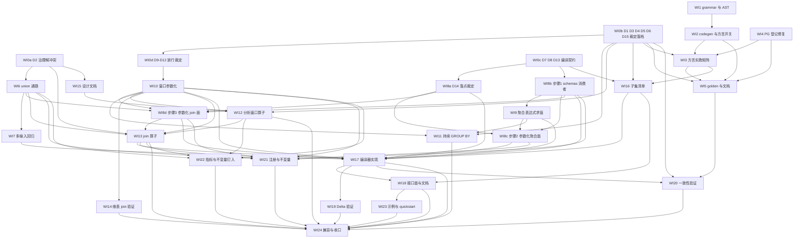

# nop-stream 窄范围 SQL 接口 Roadmap

> Last updated: 2026-10-02（v8：执行进展——WI0a/WI0b/WI0c/WI0d/WI1 全部 done（各带独立 closure audit），M0 解锁；D1-D15 落档于 ai-dev/design/nop-stream/ 四份文档。历史：v7：改写 A4 使五个内置聚合 id 与 coder 的来源与 WI8b/WI8c/WI9 一致（此前残留被否决的 (b) 分支 bean 机制）；把 join 运行时求值唯一化到 WI13 的 buildJoin 并补依赖边 WI8d→WI13；WI8c 补「bean 与 aggregatorRef 恰好其一」；WI8b/c/d 标签由 A1/A2/A3 改为 步骤1/2/3 以免与 Assumptions 撞名；WI19 门控分类归入不触门；deps 与图 75 边零差异。v6：把 D14 状态在全文统一为「已裁定走 (a)」，清掉残留的分支条件表述；WI17 与 WI21 补齐对 WI8c 与 WI8d 的依赖边；WI8a 的完成判定改为只落已裁定分支；WI8b 与 WI8c 与 WI8d 的完成判定补 coder 来源、bean 互斥、windowStrategyRef 归属与既有测试替换。v5：owner 裁定 D14 走选项 (a)，WI8 拆为 WI8b 与 WI8c 与 WI8d 三个独立工作项；工作项 29 → **31**，deps 与依赖图 75 边零差异。历史：v2 修四处事实错误；v3 修测试环境/keyed-state/类名白名单/Oracle 截断/方言继承链等事实并拆 WI0 与 WI8；v4 补 D14 与 D15、修正 mission-driver 状态行嵌套括号导致 3 项被静默丢弃的缺陷、修正 gate-inventory 机制与 XLang 注册方式描述。**当前实测：31 工作项 + 7 里程碑全部被 `parseRoadmapMarkdown` 解析，无静默丢弃**）
> 位置：按仓库 roadmap 惯例存放于 `ai-dev/backlog/`。书写约定：未来交付物路径用普通文本书写、不加反引号；已存在的文档路径用反引号，持续受 check-doc-links 保护。
> mission-driver 兼容：本文 `## Work Item Status` 采用 `- 名称: \`status\`` 形态（`tools/mission-driver/src/roadmap-check.mjs:23` 的 `BULLET_RE`，状态集见 `:14`），已实测 `parseRoadmapMarkdown` 可解析全部 31 个工作项与 7 个里程碑（进度分母只计工作项）。**状态行的尾部括注必须是单层非嵌套**——`BULLET_RE` 只允许一组 `（…）` 且其内不得再出现 `（）`，嵌套会使整行匹配失败并被**静默丢弃**。改任何状态行后必须重跑解析器并核对条目数。**尚无 mission 配置**（missions/ 下无 nop-stream-sql 条目）。建 mission 的两个具体前置是 **D13 未裁**（`moduleDir` 不可定）与 **D15/Q1 未裁**（`commands.test` 是否带 `-Dnop.test.docker.enabled=true` 不可定）；前置齐备前本 roadmap 不会被自动驱动。
> 数据口径：全部 file:line 于 2026-09-30 从源码实测核对，经四轮独立子代理审计逐条复核（外部数据库行为不可验证处一律标注）；EQL 语法以 `nop-persistence/nop-orm-eql/model/antlr/BaseRule.g4` 及其生成物 `nop-persistence/nop-orm-eql/src/main/java/io/nop/orm/eql/parse/antlr/EqlParser.java` 为准，两者交叉验证。**本仓库无法验证的外部数据库行为一律显式标注「未在本仓库验证」**（见 F14 教训）。

> Sources:
> - `ai-dev/design/nop-stream/00-vision.md`（§四 Non-Goals、§五 收敛路径、§六 决策点 #1、§七 取舍、§八 15 条不变量）
> - `ai-dev/design/nop-stream/comparison.md`（`:187-188`、`:271`、`:672-673`、`:685` 的 `❌` / 规划断言）
> - `ai-dev/design/nop-stream/component-roadmap.md:13`（`去除复杂 Join…聚焦于单流窗口聚合`）
> - `ai-dev/plans/nop-stream-productization/2026-09-01-0938-1-design-productization-gap-analysis.md:22`（vision 冲突约束原文，作用域为该 plan 自身裁定）
> - `ai-dev/analysis/nop-stream/10-flink2.3-quality-verdict.md`（引擎就绪度 4/5）
> - `ai-dev/analysis/2026-09/2026-09-30-doris-nereids-optimizer-extraction-feasibility.md`（该分析口径 B/C：优化器语义层不可跨引擎移植、仅骨架约 15-20% 可用；口径 A「仓库内模块化可行」不适用于本 roadmap 的跨模块场景）
> - `docs-for-ai/02-core-guides/eql-and-database-compatibility.md`、`docs-for-ai/02-core-guides/testing.md`
> - `ai-dev/logs/2026/09-30.md`（D3 owner 裁定、v1/v2/v3 演进记录）
> - `ai-dev/backlog/unit-test-coverage-roadmap.md`、`ai-dev/backlog/duckdb-integration-roadmap.md`、`ai-dev/backlog/nop-stream-productization-roadmap.md`（格式与去重参照）

## Purpose

编排 nop-stream **窄范围 SQL 接口**的交付：单表查询、静态维表 lookup join、双流**等值** join（hash / window merge）、窗口与分析窗口聚合。**不是** Flink SQL / Table 栈的复刻——不做代价优化器、不做非等值 join、不做方言全覆盖。

三层结构：

1. **语法层**：复用 `nop-orm-eql` 的 EQL 作为 SQL 载体。目标是**同一条查询既可翻译到 Oracle/PostgreSQL 执行，也可编译到 nop-stream 执行**（§3.3 为核心技术判断，§3.5 为其落点约束）。
2. **编译层**：EQL AST → 流模型。**不是纯新增**——StreamModel 当前没有参数化算子面，聚合/join/窗口只能引用预置 bean（§3.5），且编译器需要一个宿主模块裁定（D13）。
3. **执行层**：补齐多输入通路、参数化窗口、聚合表达式求值、join/分析窗口算子四类缺口。

**Non-Goals**：代价优化器；非等值 / 范围 join；CDC retract 全链路（由 D1 决定是否降级）；Flink SQL 方言兼容；CEP / 连接器 / HA / 部署编排（属 `ai-dev/backlog/nop-stream-productization-roadmap.md`）。

**门控判据（本 roadmap 统一定义，取代此前含糊的「是否撞 Non-Goal」）**：一个 WI 受门控，当且仅当它满足任一条——(a) 在 `00-vision.md` §四 Non-Goals 表内新增或扩展能力；(b) 触发 §六 决策点（#1 = StreamModel 核心结构变更，含新增 Transformation 类型、修改 StreamComponents 注册表结构）；(c) 改写 §七 核心取舍；(d) 声称改变 §八 设计不变量；(e) 改变 §五 收敛路径的阶段归属。

| 能力 | 触门条款 | 门控 WI |
|---|---|---|
| 治理解冲突本身 | §四 §五 §六 §七 全部条款 | WI0a（它是解除其余门控的唯一入口） |
| 裁定 D1 D3 D4 D5 D6 D15 | §六 #1（D4 的 TUMBLE 语法面若进 EQL grammar 则触生成管线；D1 的 c 分支触元素模型契约） | WI0b |
| 裁定 D7 D8 D13 | §五（宿主模块决定编译管线的阶段归属） | WI0c |
| 裁定 D9 至 D12 | §六 #1（窗口节点结构变更） | WI0d |
| SQL API | §四 `SQL API` | WI16 WI17 WI18 |
| 双流 Join | §四 `双流 Join` | WI13 |
| union 多输入 | §六 #1 | WI6 |
| 两输入算子 | `comparison.md:271` `TwoInputStreamOperator ❌ 不实现` → 门控 WI6 与 WI13；WI7 只加测试不改结构故不触门 | — |
| 参数化算子面 | §六 #1 | WI8a WI8b WI8c WI8d |
| 注册接线 | §八 1 2 9 11 12 13 14，且新增 `StreamComponents` 注册表条目另触 §六 #1 | WI21 |
| 编译与用户面 | §四 + §五 | WI17 WI18 |
| EQL 窗口语法补全 | 不触门（共享 ORM grammar 的加法变更，但按 plan-first 处理，见 Cross-Cuting 4） | WI1 WI2 |
| 窗口方言能力开关 | 不触门（改 `orm/dialect.xdef` 与各 `dialect.xml`，按 Cross-Cuting 4 走 plan-first） | WI2 WI3 |
| PG/DuckDB 窗口函数登记补缺 | 不触门（修复既有方言登记缺陷） | WI4 |
| 方言实跑矩阵 | 不触门 | WI3 |
| 翻译 golden 与文档 | 不触门 | WI5 |
| 多输入回归 | 不触门 | WI7 |
| 聚合表达式求值 | 不触门 | WI9 |
| 窗口参数化与 fail-fast 放行 | §六 #1（窗口节点结构变更） | WI10 |
| 持续 GROUP BY | §六 #1（新增算子形态） | WI11 |
| 分析窗口算子 | §四 `SQL API` + §六 #1 | WI12 |
| 静态维表 lookup join | 不触门——§七 #G36 裁定的替代路径正是外部维表 lookup | WI14 |
| 设计文档 | 不触门 | WI15 |
| Delta 验证 | **不触门**——§八 10 被验证而非被改变 | WI19 |
| 一致性验证 | 不触门 | WI20 |
| 指标与不变量钉入 | §八 1 与 9（新增算子须纳入） | WI22 |
| 示例 | 不触门 | WI23 |
| 兼容与收口 | §八 3 与 5（记录兼容性影响） | WI24 |

**§八 其余不变量的处置**（WI21 覆盖 1 2 9 11 12 13 14；以下逐条说明为何无需新覆盖或归何处）：3（`PartitionedPlan` 是 parallelism 与 edge partition 与 state route 与 checkpoint route 的唯一语义来源）→ 归 WI24 兼容说明核对；4（barrier 只由 source 读取线程注入）→ 多输入不改变注入点，由 WI7 的 barrier 对齐用例覆盖；5（manifest durable 前 sink transaction 不得 commit）→ D1 取 (b) 时的 upsert sink 受此约束，由 WI11 在 (b) 分支断言；6（恢复从最新 durable epoch manifest 开始）→ 多输入与聚合不改变恢复起点，由 WI7 与 WI12 的 restore 用例覆盖；7（无重放或无严格提交能力不得声明 `STRICT_EXACTLY_ONCE`）→ D1 取 (b) 或 (c) 时新 sink 的语义等级声明受此约束，归 WI11；8（旧 attempt 与旧 coordinator 必须 fencing）→ 本 roadmap 不改 attempt 生命周期；15（作业终止必须明确 `JobTerminationMode`）→ 本 roadmap 不改终止路径。

**另两条同样具约束力**：§三 #4 语义不降级与 §三 #5 稳定身份（同 §八 7 与 §八 1 的适用范围，已分别归 WI11 与 WI21）；§三 #8 Nop 平台集成——静态维表 lookup 必须走 `IJdbcTemplate` 或 `IBatchLoader` 而非自建数据源（归 WI14）；§十 明确拒绝「自管 HashMap 做窗口状态」，故 WI12 的每 key 有序缓冲必须落在 namespace-based keyed state 上（归 WI12 完成判定）；§十 拒绝「独立线程注入 Barrier」与「直接 `DataSource.getConnection()` 做 checkpoint 存储」——本 roadmap 不触碰这两条路径。

`ai-dev/plans/nop-stream-productization/2026-09-01-0938-1-design-productization-gap-analysis.md:22` 原文为「`00-vision.md` 含显式 non-goals……**裁定不得与之冲突**；冲突时只能产出 stop-edit-restart 建议」——该约束**作用域是那一条 plan 自身的裁定**，本 roadmap 引用它作为治理惯例，实际解冲突由 WI0a 统一执行。

**必须修订的断言全集**（WI0a 的作业清单，不得只改 §四两行）：`00-vision.md` §四 `SQL API` / `双流 Join` 两行、§五 收敛路径未给 SQL/join 留插入点、§六 #1 决策点、§七 `去除：复杂 Join、广播流`；`comparison.md:187` SQL、`:188` 双流 Join、`:271` `TwoInputStreamOperator ❌ 不实现`、`:672` 双流 Join、`:673` SQL API、`:685` `声明式编排 ⚠️ 规划 Phase 5`；`component-roadmap.md:13`。

## 前置裁定（Gate D1—D15）

| 裁定 | 状态 | 负责 | 选项 | 结论 / 依据 |
|---|---|---|---|---|
| D1 结果表语义 | **已裁定 owner 2026-10-02**：(a) 终值语义降级 | owner | (a) **终值语义降级**：`<reduce>` last-value-wins 加模型语义标注（**注意不是 append-only——引擎无逐条追加式聚合输出面**）；(b) 算子内模拟 retract 加 upsert sink；(c) `StreamRecord` 加 RowKind | **已裁 (a)**：`<reduce>` last-value-wins 显式标注，**非 append-only 非 retract**（引擎无逐条追加式聚合输出面；`<reduce>` 逐条 emit 当前归约值，既不提供 append-only 也不提供 retract 语义，`StreamReduceOperator.java:87-106`）；R1 关闭；落档 ai-dev/design/nop-stream/sql-subset-and-semantics.md §1 含对 D9-D12 的输入约束 |
| D2 治理解冲突范围 | **已裁定 owner 2026-10-02**：收窄表述 | owner | 全解除 / 收窄表述 / 保留（roadmap 阻塞） | Purpose「必须修订的断言全集」12 条逐条同步完成，落档 ai-dev/design/nop-stream/sql-vision-conflict-resolution.md 含修订前后对照与 owner 授权证据 |
| D3 EQL 窗口语法补全范围 **已裁定** owner 2026-09-30（落档 2026-10-02 归 WI0b） | owner | 按方言裁剪语法 / 全集直增 | **语法全集直增，方言差异不进 grammar**；能力经 dialect `<features>` 下发，缺省不启用，翻译期未启用 → `ERR_EQL_DIALECT_NOT_SUPPORT_FEATURE`；落档 ai-dev/design/nop-stream/sql-subset-and-semantics.md §2 |
| D4 流时间窗口语法选型 | **已裁定 owner 2026-10-02**：伪表函数 | owner | `TUMBLE(t, INTERVAL)` 伪表函数 / `WINDOW` 子句 / stream-only 标记 | **已裁伪表函数**：语法落 DMLStatement.g4 表源分支（sqlTableSource/sqlSingleTableSource），AST 落 EqlAST.xjava；流目标映射窗口 assigner；RDBMS 目标 T1/T2/T3 三档（T2 全部语义不等价必须标注，外部数据库事实未在本仓库验证）；落档 ai-dev/design/nop-stream/sql-subset-and-semantics.md §3 |
| D5 全局 `ORDER BY` 与 `LIMIT` | **已裁定 owner 2026-10-02**：首版排除 | owner | 排除 / keyed 缓冲近似 | **已裁首版排除**，进不支持清单（清单草案在落档 §4，定稿归 WI16）；落档 ai-dev/design/nop-stream/sql-subset-and-semantics.md §4 |
| D6 分析窗口流上执行语义 | **已裁定 owner 2026-10-02**：事件时间 | owner | 事件时间 / processing-time 近似 | **已裁事件时间**，分析窗口与 WI13 共用 watermark 与每 key 有序缓冲设施；Q2 归属 WI12 设计时落实；落档 ai-dev/design/nop-stream/sql-subset-and-semantics.md §5 |
| D7 表列绑定来源与解析入口 | **已裁定 owner 2026-10-02**：SQL 面自带 schema 为主 + EqlASTParser 入口 | owner | ORM 实体元数据 / 连接器 schema / `.sql` DDL / xdef `schemas` 声明面 / **SQL 面自带 schema**；入口 `EqlASTParser` 与 `EqlExprASTParser` 二选一 | **必须含「SQL 面自带 schema」选项**（与 D8 的 `<sql>` 元素天然配对，是当前选项集遗漏的一档）。约束：xdef `schemas` 声明面在 build 期 fail-fast（`StreamModelDslBuilder.java:266-275`），类型面仅 `BasicTypeInfo`（`BasicTypeInfo.java:20-28`），**无 SQL 类型→流类型映射**——该映射裁定**归本决策**，不推给 WI8a 与 WI8b。**已裁**：五选项裁定 SQL 面自带 schema 为主、入口 EqlASTParser、九种受管类型名映射 BasicTypeInfo 九实例、时间列用 bigint epoch-millis 承载且 DATE/TIMESTAMP/DECIMAL 编译期报错；落档 ai-dev/design/nop-stream/sql-compiler-contract.md §1 |
| D8 用户可见接口面 | **已裁定 owner 2026-10-02**：新增 `<sql>` xdef 元素 | owner | 新增 `<sql>` xdef 元素 / `.sql` 文件加 bean / Java API / CLI / GraphQL | 建议**新增 `<sql>` xdef 元素**，但**不得预设编译落点**（落点已由 D14 裁定为 (a)，WI8a 负责落档）。**已裁**：五选项裁定 `<sql>` 元素胜出，首版不含 Java API / CLI / GraphQL；落档 ai-dev/design/nop-stream/sql-compiler-contract.md §2 |
| D9 `allowedLateness` 放行 | **已裁定 owner 2026-10-02**：放行（WI10 落地） | owner | 放行 / 保持 fail-fast | **已裁放行**：D1 已裁 (a) 终值语义，迟到数据 fire-and-update 安全；运行时迟到管线已存在，唯一闸门是 build 期双层 fail-fast；WI10 义务=接口面通路+buildWindow 消费双层声明；关键约束=清空点须推迟到 cleanup；落档 ai-dev/design/nop-stream/window-failfast-decisions.md §1 |
| D10 `accumulationMode` 放行 | **已裁定 owner 2026-10-02**：保持 fail-fast（WI10 落地） | owner | 放行 DISCARDING 以外 / 保持 fail-fast | **已裁保持**：A&R spec-only 门禁原样；ACCUMULATING 运行时已支持、保持属首版 scope 收敛而非语义不相容；落档 ai-dev/design/nop-stream/window-failfast-decisions.md §2 |
| D11 `triggerId` 放行 | **已裁定 owner 2026-10-02**：保持 fail-fast（WI10 落地） | owner | 放行 / 保持 fail-fast | **已裁保持**：首版不建 trigger 注册表，自定义 trigger 部分发射与 DISCARDING-only 一致性承诺不一致；落档 ai-dev/design/nop-stream/window-failfast-decisions.md §3 |
| D12 窗口级 `parallelism` 放行 | **已裁定 owner 2026-10-02**：保持 fail-fast（WI10 落地） | owner | 放行 / 保持 fail-fast | **已裁保持**：window 虚拟节点无执行顶点，per-transform parallelism 由宿主元素承载；**item 29 通路与 2PC 门禁零退化已确认**；落档 ai-dev/design/nop-stream/window-failfast-decisions.md §4 |
| D13 编译器宿主模块与依赖方向 | **已裁定 owner 2026-10-02**：分支 a 新模块 nop-stream-sql | owner | (a) 新模块 `nop-stream-sql` 同时依赖 `nop-stream-flow` 与 `nop-orm-eql`；(b) 给 `nop-stream-flow` 加 `nop-orm-eql` 依赖；(c) 复制最小 EQL parser 子集 | 建议 **(a)**：现状 `nop-stream-flow` 只依赖 core/cep/xdefs/xlang/codegen/ioc，**零** `nop-orm-eql` 依赖；而 `nop-orm-eql` 依赖 `nop-dao` + `nop-orm-model` + `nop-core` + `nop-codegen` + `nop-antlr4-common`，(b) 会把持久层拖进引擎，破坏引擎独立性；(c) 违反单一口径原则。落地由 WI17 承担。**已裁分支 a**：模块骨架创建义务归 WI8b；声明面落点经 WI8c 回改裁定（2026-10-02）落 base stream.xdef、消费面经 SPI 由新模块承载——delta 扩展机制实验证实不可行（回改条款执行，见 sql-compiler-contract.md §3.2 回改注记；WI8b 注记 2026-10-02：schemas 面无需 delta）；落档 ai-dev/design/nop-stream/sql-compiler-contract.md §3 |
| D14 参数化算子面与编译落点 | **已裁定 owner 2026-09-30**，**落档 2026-10-02（WI8a）** | owner | (a) 给 StreamModel 增加参数化算子面；(b) 预置 bean 家族，模型只引用 bean 名；(c) 绕过 XDSL 直产 StreamGraph | 与 D13 正交：D13 定**放哪个模块**，D14 定**产物长什么样**。**owner 已裁定走 (a)**：(b) 与 (c) 不再作为本 roadmap 的实施路径，若日后要改判须先改本行再动 WI8c 与 WI8d。落档 ai-dev/design/nop-stream/sql-landing-decision.md 含保留面分化与迁移影响 |
| D15 多库实跑降级档 | **已裁定 owner 2026-10-02**：允许降级 + 强制标注 | owner | opt-in 实跑为硬门 / 允许 H2 实跑加其余方言快照比对降级 | **已裁允许降级**：默认 H2 实跑；opt-in 多库可用时实跑（5 个 Testcontainers 方言测试）；不可用时快照比对降级且交付说明**逐方言标注未实测，禁止无标注收口**；Q1 保持未决；落档 ai-dev/design/nop-stream/sql-subset-and-semantics.md §6 |

每条裁定的记录落 `ai-dev/design/nop-stream/` 对应设计文档并注明负责人与日期；未落档的裁定视为未裁。

## Current Baseline（2026-09-30 实测，两轮审计复核）

本节子编号 `3.1`—`3.5` 供文内 `§3.x` 交叉引用。

### 3.1 执行能力映射

| 目标 SQL 能力 | 现有承接 | 状态 |
|---|---|---|
| SELECT / WHERE / 投影 | `<filter>` / `<map>` 内联 `xpl-fn` body（`stream.xdef:134-146`） | ✅ 可直接编译 |
| 聚合函数 `sum` / `count` / `avg` | **无**——XLang 无聚合函数（`nop-kernel/nop-xlang/src/main/java/io/nop/xlang/functions/GlobalFunctions.java` 的函数定义区按函数名/词边界匹配命中数为 0；裸 grep `ARG_[A-Z_]*COUNT` 有 13 处命中、分布在 12 行，属子串噪声。补充：该类无静态注册表与注解注册，函数由 XLangCoreInitializer 显式按类反射注册（`registerStaticFunctions(GlobalFunctions.class)`），故只能按名检索）；`SqlExprToFilterBeanTransformer.java:31-56` 只覆盖谓词种类，其余抛 `ERR_EQL_UNSUPPORTED_EVAL_EXPR` | ❌ **WI9** |
| 单流**窗口内** GROUP BY | `<keyBy>` → `<window>` → `<aggregate>`（`AdvancedTransforms.java:267-288`，类型校验 `:271-277`）；`<aggregate>` 只有 `bean` 无 `params` | ⚠️ 需参数化面 → **D14 已裁定走 (a)，落地为 WI8c**（与 `windowingStrategies` 同构的 `aggregators` 注册表 + `aggregatorRef`） |
| 单流**无窗口**持续 GROUP BY | `<aggregate>` 强制 `WindowedStream`；`<reduce>` 可挂 `KeyedStream`，语义是**逐条 emit 当前归约值**（`StreamReduceOperator.java:89-107`，last-value-wins） | ⚠️ 非 append-only、非 retract → WI11（D1 分支） |
| 全局 ORDER BY / LIMIT | 无 sort / TopN 设施 | ❌ D5 排除 |
| 分析窗口 `OVER(...)` | 无算子（`<aggregate>` 是切片聚合，非逐行分析） | ❌ WI12（D6） |
| 静态维表 lookup join | `<keyBy>` + `<process>`：keyed state 由 `ProcessOperator.java:73` 注入，backend 在 `ProcessOperator.java:60` 的 `open()` 内由 `stateBackend.createKeyedStateBackend` 自建，运行时在 `TaskCheckpointWiring.java:167-176` 为链上每个 `AbstractStreamOperator` 设 state backend | ⚠️ operator 级 keyed-state checkpoint/restore **已有**端到端证据（`nop-stream/nop-stream-runtime/src/test/java/io/nop/stream/runtime/checkpoint/TestE2EWindowOperatorWithCheckpoint.java`）；缺的是 DSL→运行时路径证据与维表 join 本身 → WI14。**`<custom>` 亦非不可行**：无自动注入，但可照 `ProcessOperator.java:59-61` 先例在 `open()` 内自建 |
| 双流等值 join / window join | 无 join 算子；需 union 通路 | ❌ WI6 + WI13 |
| sort-merge join | 无排序设施 | ❌ 延后；**`<edge partition="HASH">` 与 `keyBy` 互斥**（HASH 边指向 keyBy 目标抛 `ERR_STREAM_EDGE_HASH_REDUNDANT`，`StreamModelDslBuilder.java:421-425`），正确机制只有 **union 之后 `keyBy`** |

### 3.2 多输入通路证据链（缺口在 API 层，四处内核级约束）

| 层 | 事实 | 证据 |
|---|---|---|
| DSL 模型 | 多入边已支持：`upstreams.get(to).add(from)` 存 `Set`，Kahn 拓扑按多入边算度 | `StreamModelDslBuilder.java:302-345, 348-407` |
| 输入数闸门 | `requireSingleInput` 要求 size==1；另有上游**类型**闸门（`AdvancedTransforms.java:271-277, 409-415`）与 HASH 冗余闸门（`StreamModelDslBuilder.java:415-429`） | 同左 |
| union 现状 | `buildUnion` 直接 fail-fast，错误文案自述「runtime only supports OneInputStreamOperator」 | `AdvancedTransforms.java:360-368` |
| 抽象 | `getInputs()` 返回 `List<Transformation<?>>`，但 `OneInputTransformation` 只有单个 `Transformation<IN> input` 字段 | `Transformation.java:183`、`OneInputTransformation.java:30,47` |
| 图生成 | `StreamGraphGenerator` 按 `getInputs().get(0)` 取单输入（**无 union 分支**）；`JobGraphGenerator` 对多入边节点显式不可 chain，另按 `source->target` 去重边 | `StreamGraphGenerator.java:410-413`、`JobGraphGenerator.java:372-376`、`:582` |
| 运行时 | 每条入边建 channel；多通道读取与 per-channel barrier | `GraphExecutionPlan.java:530-566`、`InputGate.java:683`、`:978-1021` |
| 水位合并 | min 合并在 `InputGate` 的水位合并路径 | `InputGate.java:533-552`、`:1250-1272` |
| **约束 1** | `GraphExecutionPlan.buildInputGate` 只从 `inEdges.get(0)` 取 `EdgeConfig` → 双输入 gate 静默继承首边流控配置 | `GraphExecutionPlan.java:562` |
| **约束 2** | 边按 `source->target` 去重 → **同一上游顶点的两条入边塌成一条**（self-join 必现） | `JobGraphGenerator.java:582` |
| **约束 3** | `dispatchChannelElement` 的**数据元素**路径丢弃 `channelIndex`（barrier 与 watermark 等控制元素仍按 channel 分派）；`AbstractStreamOperator` 只有 `processWatermark1/2`、**无** `processElement1/2`；`StreamTaskInvokable` 把所有 element 派给单一 `headInput` | `InputGate.java:804`、`AbstractStreamOperator.java:437,441`、`StreamTaskInvokable.java:975-982` |
| **约束 4** | `AbstractStreamOperator` 硬编码 `IndexedCombinedWatermarkStatus.forInputsCount(2)` → 算子侧水位合并固定为 2 输入，与 channel 数无关 | `AbstractStreamOperator.java:430` |
| 序列化约束 A | 传输层信封携带 **Java 类名**，decode 走 `Class.forName` | `StreamElementCodec.java:60-71,88-95` |
| 序列化约束 B | 类名须命中 `ClassNameValidator` 前缀白名单，否则 `ERR_STREAM_CLASS_NOT_ALLOWED`——tag 包装类必须落在 `io.nop.stream.*` 等白名单前缀内 | `ClassNameValidator.java:16-42`、`StreamElementCodec.java:60` |
| 回归资产强度 | 两个既有测试均为 wire/unit 级：`TestUnalignedCheckpointMultiInput` 是 `ChannelState` serde 往返；`TestWatermarkMultiInputCombineWire` 直接调 `processWatermark1/2`。**全仓无「两源进单算子」端到端测试** | 同左两文件 |

**tag 绕行方案的边界**（针对约束 3）：两条分支各插一个算子把 tag 打进 value，合流后单算子凭 tag 区分。代价：(a) 依赖信封类名可解析；(a′) 包装类必须在 `ClassNameValidator` 白名单前缀内；(b) 下游 schema 与 sink 需理解包装类型；(c) **不解决约束 1/2/4**——那三条必须单独修（WI6）。

### 3.3 EQL 窗口能力 vs Oracle/PostgreSQL

**判定先行（v2/v3 修正）**：EQL 的**语法**只覆盖 Oracle/PG 标准窗口的「PARTITION BY + ORDER BY 核心子集」；EQL 的**函数登记按方言分层**——聚合族与排名族可用性不同，不可给单一 ✅。

| Oracle / PostgreSQL 窗口能力 | EQL 语法层 | 方言层现状 | 证据 |
|---|---|---|---|
| `SUM/AVG/MIN/MAX OVER (...)` 聚合窗口 | ✅ 可解析 | 广泛可用（`default.dialect.xml` 登记 4 个聚合；`count` 是 grammar 关键字而非 dialect 函数，`BaseRule.g4:236`） | `BaseRule.g4:221-225`；生成物 `EqlParser.sqlWindowExpr()`；测试 `TestEqlCompiler.java:183` |
| `RANK/ROW_NUMBER/DENSE_RANK/LEAD/LAG/FIRST_VALUE/LAST_VALUE/NTH_VALUE/PERCENT_RANK/CUME_DIST OVER (...)` | ✅ 可解析 | **按方言分层**：`window-expr-support.dialect.xml` 直接 extends 的 6 个方言（oracle / h2 / mysql / mssql / db2 / dm）经继承链实际覆盖 10 个；`postgresql` / `postgis` / `duckdb` / `es` / `tdengine` **不含** → 命中 `ERR_EQL_UNKNOWN_FUNCTION` | `postgresql.dialect.xml:3`；`duckdb.dialect.xml:8`；`EqlTransformVisitor.java:1372-1375` |
| 仅 `OVER (ORDER BY ...)` | ❌ 两子句均无 `?` 必填 | — | `BaseRule.g4:221-225` |
| `OVER ()` | ❌ 同上 | — | 同上 |
| frame `ROWS/RANGE/GROUPS BETWEEN ...` | ❌ grammar 无 frame 分支；`ROWS` 仅未使用 token（`SQL92Keyword.g4:574`），无 `PRECEDING/FOLLOWING/GROUPS` token | 待 WI2/WI3 定 | `_SqlWindowExpr.java:19-23` 三字段（function + 两子句） |
| 命名窗口 `WINDOW w AS (...)` | ❌ grammar 无 `WINDOW` | — | 同上 |
| 聚合型窗口函数集 | 仅 `MAX/MIN/SUM/COUNT/AVG` | `STDDEV`/`VAR` 需补登记 | `BaseRule.g4:235-237` |
| `INTERVAL` 字面量 | ✅ | — | `BaseRule.g4:308-310` |
| 多方言翻译通道 | ✅ | — | `AstToSqlGenerator extends AstToEqlGenerator`；`AstToEqlGenerator.java:915-921` |
| 文档口径 | ⚠️ 宣称「支持标准 SQL 的全部子句：… 窗口函数」，宽于实况 | — | `docs-for-ai/02-core-guides/eql-and-database-compatibility.md:34` |

**D3 分层原则落地机制（语法层无条件，方言层按需启用）**：

- **grammar 全集直增**：单一 grammar 服务全部方言，不做方言条件分支。
- **能力开关下沉 dialect**：`nop-kernel/nop-xdefs/src/main/resources/_vfs/nop/schema/orm/dialect.xdef:45-58` 的 `<features>` 现有 24 个能力位（22 个 `supportXxx` 加 `useGetStringForDate` 加 `useAsInFrom`），`nop-persistence/nop-dao/src/main/resources/_vfs/nop/dao/dialect/default.dialect.xml:15-23` 集中缺省（`supportILike="false"`、`supportWithAsClause="true"`），各方言在自己的 `<features/>` 覆盖（`postgresql.dialect.xml:94`）。
- **翻译期裁决**：抛 `ERR_EQL_DIALECT_NOT_SUPPORT_FEATURE` 的消费点全仓**仅一处**——`EqlTransformVisitor.java:1477-1483`（错误码定义 `OrmEqlErrors.java:191`，既有断言 `TestEqlCompileSql.java:381`）；`:556, 631, 1077` 是 `isSupportWithAsClause()` 分支，不抛该码。
- **开关粒度按 frame 单位拆**：暂名 `supportWindowFrameRows` / `…Range` / `…Groups`，`default.dialect.xml` 缺省 `false`。设计动机（MySQL 8 对 `GROUPS` 的处理、Oracle 无 `GROUPS`）**未在本仓库验证**，仅作拆分理由；启用矩阵由 WI3 实跑产出。
- **可选子句不做开关**：`OVER (ORDER BY ...)` / `OVER ()` 是标准 SQL。

### 3.4 不可移植层：流时间窗口（W2 ≠ 窗口函数）

`TUMBLE / HOP / SESSION` 是按事件时间切片的伪表函数，不是窗口函数。**「Oracle/PG 原生没有」属外部数据库事实，未在本仓库验证**；仓库内可证的只是 EQL 侧无该语法的任何登记或模板，仅剩注释残迹（`DMLStatement.g4:216-218`）。

| | W1 分析窗口 `OVER(...)` | W2 时间切片窗口 `TUMBLE/HOP/SESSION` |
|---|---|---|
| 标准归属 | SQL:2003 分析函数 | 无原生标准（外部事实，未在本仓库验证） |
| Oracle/PG | ✅ 原生（外部事实，未在本仓库验证） | ❌ 无（外部事实，未在本仓库验证） |
| EQL 现状 | 语法部分 + 排名族登记按方言分层（§3.3） | 无 |
| nop-stream 现状 | ❌ 无算子 | ⚠️ 白名单仅 4 个 id，default 抛 `ERR_STREAM_REF_UNKNOWN`（`AdvancedTransforms.java:242-264`）；core 侧 assigner 齐全 |
| 首版策略 | WI1 WI2 WI4 + D6 + WI12 | WI10 参数化 + D4 |

**D4 三档**：T1 直通（仅流目标，产物标注 stream-only）；T2 近似——仓库内**唯一**可证的映射是 `oracle.dialect.xml:184-186` 把跨方言 `date` 模板映射为 `trunc({0})`（即 Oracle 侧走 `TRUNC` 而非 `date_trunc`）；PostgreSQL 侧 `date_trunc` 与 TimescaleDB `time_bucket` 的可用性**属外部事实，未在本仓库验证**（仓库内 `date_trunc` 仅出现在 H2 模板）。T3 拒绝并给替代建议。T2 全部**语义不等价**，产物必须标注，且各方言映射写法以 WI3 实跑产出为准。

### 3.5 编译落点约束

| 落点诉求 | 实测约束 | 证据 |
|---|---|---|
| 参数化聚合/join/窗口 | `<aggregate>` 与 `<process>` 与 `<union>` **只有 `bean` 名无 `params`**；`<window>` 只有 `strategyRef` 加 `allowedLateness` 与 `triggerId` 且**无 `params`**——它虽从 `StreamTransformModel` 继承了 `bean` 属性，但 `buildWindow` 不消费该属性；`<custom>` 的 `params` 与 `source` **双双 build 期 fail-fast** | `stream.xdef:106-194`、`AdvancedTransforms.java:386-407` |
| schema 声明 | `<schemas>` 与 `<coders>` 在 build 期直接抛 `ERR_STREAM_NOT_IMPLEMENTED`（与 `<streams>`/`<sideInputs>`/`<environments>`/`<requirements>`/`<checkpointParticipants>`/生命周期回调同批，后者占 `:236-265`） | `StreamModelDslBuilder.java:266-275` |
| 谓词翻译 | `SqlExprToFilterBeanTransformer` 仅覆盖 And/Or/Not/Binary/Like/Unary/IsNull/In/Between，**投影与聚合表达式不可转** | `SqlExprToFilterBeanTransformer.java:31-56` |
| 类型系统 | 仅 `BasicTypeInfo` 加 `UnknownTypeInformation`，**无 SQL 类型→流类型映射** | `BasicTypeInfo.java:20-28` |
| WHERE / 投影 | ✅ 现成通路 | `stream.xdef:134-146` |
| 依赖方向 | `nop-stream-flow` 依赖 core/cep/xdefs/xlang/codegen/ioc，**零** `nop-orm-eql`；而 `nop-orm-eql` 依赖 nop-dao + nop-orm-model + nop-core + nop-codegen | 两处 `pom.xml` |

编译落点已由 **D14** 裁定为选项 (a) 参数化算子面（WI8a 负责把该裁定落档）；(b) 预置 bean 家族与 (c) 绕过 XDSL 直产 StreamGraph 已被排除，不再是实施路径。(a) 的具体形态已定为三步递进并各自独立交付：**WI8b**（步骤 1）让 `schemas` 声明面有消费者即 field type 解析为 `BasicTypeInfo` 与 coder；**WI8c**（步骤 2）参数化聚合面即新增 `aggregators` 注册表与 `aggregate` 的 `aggregatorRef`，形状与既有 `windowingStrategies` 同构；**WI8d**（步骤 3）参数化 join 面即 `joins` 注册表与 `joinRef`，只做声明与构造期校验，运行时求值由 WI13 的 `buildJoin` 承接。三者的表达式**取值**求值复用既有 `keyExpr` 的 `!expr` 加 `TreeBean` 通路，无需新增求值设施；但**聚合函数本身不在 XLang 注册表**，其累加实现由 WI9 新建求值器提供，WI8c 只声明 id 与参数形状；**模块落点由 D13 裁定**（WI0c 承担）。**WI8a 落档前 WI17 不可实施**；D7 的 schema 来源与类型映射裁定独立于 D14，不得由 WI8a 预设。

## Assumptions

1. **A1** 单条记录打 tag 后经传输层可解析，且包装类落在 `ClassNameValidator` 白名单前缀内（`ClassNameValidator.java:16-42`）——否则 `ERR_STREAM_CLASS_NOT_ALLOWED`，WI6 需先扩白名单或改为让 `InputGate` 保留 channelIndex（工作量上升一个量级）。
2. **A2** 多库验证经既有 Testcontainers opt-in 开关可用：`-Dnop.test.docker.enabled=true` 启用 PG / Oracle / MySQL / MariaDB / MSSQL 方言测试（`nop-persistence/nop-dao/src/test/java/io/nop/dao/dialect/TestPostgreDialect.java:16` 与 TestOracleDialect 与 TestMySQLDialect 与 TestMariaDBDialect 与 TestSQLServerDialect 共 5 个，注解在 :16 或 :18），`nop-persistence/nop-orm/pom.xml:54-58` 已声明 postgres 驱动。**CI 当前不传该 flag**，故多库验证在 CI 内为 opt-in（A2 的未决部分：是否把该 flag 纳入 CI）。
3. **A3** 「不做优化器」与 `ai-dev/backlog/xlang-execution-optimization-roadmap.md` 不冲突——后者目标是 XLang 执行后端而非查询规划。
4. **A4** (a) 分支下**五个内置聚合 id 不是 bean**——它们是 `aggregators` 注册表里的纯参数描述符，解析时先查 `beanResolver.contains(fnId)`，未命中则落到 Java 内置目录（与 `windowingStrategies` 的 4 个内置 id 同一套路，`AdvancedTransforms.java:242-264`），累加实现由 WI9 求值器提供。真正需要 bean 的是 join 算子基类与 `<process>`/`<custom>` 路径上的算子类，它们由 Delta 或 `beans.xml` 提供，**平台无注解扫描**，必须显式 `<bean>` 定义。
5. **A5** keyed state 可承载「每 key 有序缓冲」。**已有** operator 级 keyed-state checkpoint/restore 端到端证据（`nop-stream/nop-stream-runtime/src/test/java/io/nop/stream/runtime/checkpoint/TestE2EWindowOperatorWithCheckpoint.java`、`TestE2ECheckpointAndRecovery.java`、`TestRocksDBStateBackendE2E.java`）；**尚缺**的是「每 key 有序缓冲」这一具体用法与 DSL→运行时路径的证据。若证伪，WI12/WI13 需改设计。
6. **A6** 等值 join 的 key 共置依赖 union 之后 `keyBy` 的显式 `parallelism`（`buildKeyBy` 经 `applyDeclaredParallelism` 应用 keyBy 自身声明值，`StreamModelDslBuilder.java:610-619`）。**「两侧 parallelism 必须一致」这一说法在本仓库无代码或测试支撑**，仅为待验证假设，WI13 需以实测确认或推翻。**已推翻（WI13 2026-10-03）**：共置由 union→keyBy 单一 partition 顶点结构保证——两侧先合流再进入同一分区变换，单一路由域与来源侧无关；两侧无需声明等 parallelism，keyBy 的声明 parallelism 只定共享分区顶点的规模；`KeyGroupAssignment.assignToKeyGroup` 是 (key, maxParallelism) 纯函数，路由从不感知来源侧（TestEquiJoinParallelismInvariant 三观察）。边界：结构性与构建级证据成立，parallelism>1 的 join 端到端执行受本地 runner 一 JVM 一 execute 限制未覆盖（非对称 2/1 并行度为构建级通过）。

## Risks And Open Questions

| ID | 风险 / 开放问题 | 影响 WI | 缓解 |
|---|---|---|---|
| R1 | D1 选 (c) → 触及元素模型契约、状态/快照兼容、序列化路径与 §八 不变量 | WI11 WI12 WI13 需重排 | **已关闭（2026-10-02）**：D1 已裁 (a)，WI11 WI12 WI13 按 re-scope 表 (a) 行执行 |
| R2 | D2 选「保留」→ 除 Phase 1 外整体阻塞 | WI6+ | WI0a 显式记录该分支；**状态用合法 token `todo` 并在括注写 `blocked 原因：D2=保留`，不得把 `blocked` 当状态 token**（`roadmap-check.mjs:14` 状态集不含它，写成 token 会被解析器静默丢弃） |
| R3 | (a) 分支把参数化面做成 xdef 声明，可能与既有 `bean` 路径并存出错配（两个都声明或都不声明） | WI8c WI8d WI24 | 互斥校验在构造期 fail-fast；WI24 的迁移说明覆盖该互斥规则 |
| R4 | frame 三单位支持度不一致，单一能力位表达不了 | WI2 WI3 | 按单位拆三个能力位；启用矩阵以实跑产出，不预设 |
| R5 | PG/DuckDB 窗口函数登记缺失是**既有缺陷**，可能被误当作方言测试 | WI4 | 交付说明标为缺陷修复并给回归 |
| R6 | 约束 2（边去重）只在 self-join 形态暴露 | WI6 WI7 | WI7 强制含 self-join 拓扑用例 |
| R7 | 约束 4（水位合并固定 2 输入）使「builder 放行多输入」的上限实际为 2 | WI6 | WI6 明确记录该上界，或把 `forInputsCount` 参数化纳入范围 |
| Q1 | 是否把 `-Dnop.test.docker.enabled=true` 纳入 CI？ | WI3 WI5 WI20 | 未决前按 A2 走 opt-in + H2 默认 |
| Q2 | 窗口 frame 在事件时间语义下的「重开/修正」如何表达（无 RowKind 时） | WI12 | 归属已裁（D1/D6 已裁 2026-10-02）：D1=(a) 无 RowKind 不引入修正语义，frame 重开按事件时间重算处理，WI12 设计时落实（见 sql-subset-and-semantics.md §5） |
| Q3 | `<edge partition="HASH">` 与 `keyBy` 互斥后，非等值 join 的排序设施从哪来 | Follow-up | 已在 Follow-up FU-1 登记 |

**D1/D2 结论 → 受影响 WI 重排表**：

| 裁定结论 | 重排动作 |
|---|---|
| D1 = (a)【**已生效 2026-10-02**】 | WI11 落为 `<reduce>` 映射加 last-value-wins 语义标注（**不得标为 append-only**）；WI12/WI13 保持终值输出；R1 关闭 |
| D1 = (b)【未采纳】 | WI11 追加撤回输出路径与 upsert sink（`SinkConsistencyCapability.UPSERT_BY_KEY` 需首次接线，范围显著变大）；WI12/WI13 追加撤回 |
| D1 = (c)【未采纳】 | `StreamRecord` 契约变更单独立项（独立 plan 加回归加迁移说明），WI11/WI12/WI13 全部重排并追加 RowKind 测试 |
| D2 = 保留 | Phase 1 继续；WI6 及之后全部保持 `todo` 并在括注记 blocked 原因 |

## Work Item Status

> 唯一动态状态块。状态语义：`todo` 未开工 / `ready` 前置齐备可起草 / `planned` 已有承载 plan / `done` 独立 closure audit 通过。**状态 token 只允许这四个**；blocked、deferred 等语义写入括注，不得作为 token（否则被解析器静默丢弃）。**本块只放 bullet，禁止放表格**（`tryParseTableRow` 会把块内表格行当工作项）。每个 WI 以独立 plan 承载，写前必读 `ai-dev/plans/00-plan-authoring-and-execution-guide.md`。Item Type 取 `Fix` / `Decision` / `Proof` / `Feature`（`Feature` 为新能力实现类，随本次修订同步修订 plan guide 规则 15 与模板；本 roadmap 实际用量 Decision 6、Feature 13、Fix 3、Proof 9（WI8 拆为 WI8a 至 WI8d 后重新计数），未使用 `Follow-up`——次级事项在 `## Follow-up Backlog` 登记）。另注两条格式陷阱：`tools/mission-driver/prompts/execute.md` 的 ❌→✅ 在本 roadmap 映射为 → `done`，写 ✅ 会被解析器静默丢弃；**尾部括注不得嵌套 `（）`、内部不得出现 `)`，否则整行被静默丢弃**——改任何状态行后必须重跑 `parseRoadmapMarkdown` 核对条目数仍为 31。

### Phase 0 — 治理与裁定（门控项）

- WI0a D2 治理解冲突唯一入口: `done`（deps 无；Item Type Decision；12 条断言逐条修订完成，D2=收窄表述落 ai-dev/design/nop-stream/sql-vision-conflict-resolution.md，owner 授权 2026-10-02 执行指令；承载 plan ai-dev/plans/nop-stream-sql/01-wi0a-d2-vision-conflict-resolution.md，独立 closure audit PASS 2026-10-02）
- WI0b D1 D3 D4 D5 D6 D15 六条裁定落档: `done`（deps 无；Item Type Decision；六条裁定已落 ai-dev/design/nop-stream/sql-subset-and-semantics.md，D4 落 TUMBLE 语法面与 EQL grammar 及 AST 落点，D5 落不支持清单草案，D15 落降级协议，re-scope 表已按 D1 分支 a 标注生效；承载 plan ai-dev/plans/nop-stream-sql/02-wi0b-subset-and-semantics-decisions.md，独立 closure audit PASS 2026-10-02）
- WI0c D7 D8 D13 三条编译契约裁定: `done`（deps 无；Item Type Decision；三条裁定已落 ai-dev/design/nop-stream/sql-compiler-contract.md，D7 含 schema 五选项与解析入口与九类型映射表与时间列立场，D8 裁定 sql xdef 元素，D13 裁定分支 a 新模块 nop-stream-sql 且 delta 机制归 WI8b plan 裁定附回改条款；承载 plan ai-dev/plans/nop-stream-sql/03-wi0c-compiler-contract-decisions.md，独立 closure audit PASS 2026-10-02）
- WI0d D9 至 D12 四个 fail-fast 放行裁定: `done`（deps WI0b；Item Type Decision；四条裁定落 ai-dev/design/nop-stream/window-failfast-decisions.md——D9 放行且 D12 确认 item 29 通路与 2PC 门禁零退化，D10/D11 保持 fail-fast；承载 plan ai-dev/plans/nop-stream-sql/05-wi0d-window-failfast-decisions.md，独立 closure audit PASS 2026-10-02）
- ★ **里程碑：M0 治理解冲突**（解锁条件 WI0a 至 WI0d 全部 done；2026-10-02 达成，D1-D15 除 D14 落档归 WI8a 外全部落档）：`done`

### Phase 1 — EQL 语法与方言（不触门；WI1 与 WI4 可立即开工，WI3 与 WI5 需 WI0b 落 D15）

- WI1 EQL 窗口 grammar 与 AST 补全: `done`（deps 无；Item Type Feature；四能力 grammar 与 AST 字段断言 21 用例全绿，nop-orm-eql 80 与 nop-orm 208 回归绿，生成物白名单零越界，七新关键字登记 unreservedWord_；承载 plan ai-dev/plans/nop-stream-sql/04-wi1-eql-window-grammar-ast.md，独立 closure audit PASS 2026-10-02）
- WI2 窗口 codegen 与方言能力开关: `done`（deps WI1；Item Type Feature；AstToEqlGenerator/AstToSqlGenerator 双通道输出 frame 与命名窗口，EqlTransformVisitor 补 WINDOW 子句编译遍历与 over 引用校验，dialect.xdef 三能力位经 wrapper 保留文件绑定、default.dialect.xml 集中缺省 false；TestEqlCompileSql 26 用例含 EQL 通道 round-trip 与三单位双态矩阵，nop-orm-eql -am 全量 94 绿；承载 plan ai-dev/plans/nop-stream-sql/07-wi2-window-codegen-dialect-flags.md，独立 closure audit 首轮 FAIL 2 Major 补强后复核 PASS 2026-10-02）
- WI3 方言窗口能力实跑矩阵: `done`（deps WI0b 与 WI2 与 WI4；Item Type Proof；docker 实测可用使 D15 主路径部分启用——H2 2.4.240 与 PostgreSQL 16 七组实跑矩阵全 PASS，h2/postgresql features 填 true×3 且 h2gis/postgis/duckdb 经继承同值；10 可独立加载方言快照 golden 入库，db2 独立加载失败单列；矩阵落 ai-dev/design/nop-stream/sql-window-dialect-matrix.md 含 D15 逐方言标注；承载 plan ai-dev/plans/nop-stream-sql/08-wi3-dialect-window-matrix.md，独立 closure audit 首轮 FAIL 2 项文本缺陷修正后达成 PASS 条件 2026-10-02）
- WI4 窗口函数方言登记缺口修复: `done`（deps 无；Item Type Fix；postgresql.dialect.xml extends 链加 window-expr-support，PG 系三方言经继承获得 10 个窗口函数，真实方言加载回归 3 用例绿、nop-orm-eql -am 全量 83 绿；D15 标注：TestPostgreDialect docker opt-in 存量回归未在本环境实测，依据 TestDialect.java:193-196 跳过逻辑分析不受影响；承载 plan ai-dev/plans/nop-stream-sql/06-wi4-pg-window-function-registration.md，独立 closure audit PASS 2026-10-02）
- WI5 双目标翻译 golden 与文档校正: `done`（deps WI0b 与 WI2 与 WI3 与 WI4；Item Type Proof；frame golden 扩至 5 可编译方言 h2/postgresql/duckdb/postgis/h2gis 各 6 组+对照轴，fail-fast 断言 6 方言×3 单位=18 条，eql-and-database-compatibility.md 窗口口径改为 grammar∩能力位∩继承链三层交集并保留函数登记附加维度、W2 未进语法层标注；矩阵文档补 WI5 交叉注记；承载 plan ai-dev/plans/nop-stream-sql/09-wi5-translation-golden-and-doc.md，独立 closure audit 三轮 FAIL→FAIL→PASS 2026-10-02）
- ★ **里程碑：M1 语法可用**（解锁条件 Phase 1 全部 done；2026-10-02 达成，WI1 至 WI5 全 done）：`done`

### Phase 2 — 多输入通路（WI6 与 WI7 触门与否以 Purpose 表为准；WI6 门控，WI7 不触门）

- WI6 union 多输入通路与内核约束修复: `done`（deps WI0a；Item Type Feature；UnionTransformation 与 DataStream.union 与 StreamUnionOperator pass-through 顶点落地，transformUnion 分支每输入一条 StreamEdge，registerStreams 重复键序号消歧；约束 2 修复——union 目标保留平行 JobEdge 加 IdentityHashMap matrix 键控加 remote topic 序号消歧，非 union 目标维持去重防链内扇入双写，回归 TestJobGraphParallelEdges；约束 1 修复——declared-vs-declared 四字段值不一致 fail-fast、undeclared 让位于 declared，core 与 remote 双侧同修，回归 TestMultiEdgeGateConfigConsistency 4 用例；约束 4 二输入上界 javadoc 显式记录；builder 放行——buildUnion 按边声明顺序重复合流、KeyedStream 拒绝、HASH 边入 union fail-fast 指引 union 后 keyBy；端到端两源进单算子 TestUnionPipelineE2E 与 self-union TestSelfUnionPipelineE2E 绿；core 1663 runtime 1185 flow 136 全绿；承载 plan ai-dev/plans/nop-stream-sql/13-wi6-union-multi-input.md，独立 closure audit PASS 2026-10-02）
- WI7 多输入回归三件套: `done`（deps WI6；Item Type Proof；四个具名测试类齐备且实跑绿——TestMultiInputBarrierAlignment 严格模式契约断言加 §八 4 barrier-after-element 行为断言，TestMultiInputWatermarkMinMerge min 合并被慢侧拖住加 EOS MAX 排除，TestMultiInputExactlyOnceCheckpoint §八 6 双证据即 manifest task snapshots 绑定 durable offset 加 RESTORE_PROBE 断言 initializeState 收到 durable offset 加消费区间零重发，TestMultiInputSelfJoinEdgeDedup 覆盖约束 2；执行期发现 union 顶点 E2E 对齐阻塞缺位为 live defect 已路由 FU-9 须 Fix 单独立项，时序判别断言待修复后启用；线程同一性由 core TestSourcePullBarrierInjection 承载；runtime 全量 1196 零退化；承载 plan ai-dev/plans/nop-stream-sql/20-wi7-multi-input-regressions.md，独立 closure audit 五轮轨迹最终 PASS 2026-10-02）
- ★ **里程碑：M2 多输入可用**（解锁条件 WI6 与 WI7 done；2026-10-02 达成）：`done`

### Phase 3 — 执行面地基（WI8a WI8b WI8c WI8d WI10 WI21 门控；WI9 WI15 不触门，以 Purpose 表为准）

- WI8a D14 编译落点落档: `done`（deps WI0c；Item Type Decision；落档 ai-dev/design/nop-stream/sql-landing-decision.md——保留面分化表述：分支 b 保留 bean 存在性/类型检查不丢失 builder fail-fast、丢失模型级参数契约/Delta 再参数化/组合爆炸消除三项，分支 c 整体绕过三层保护；迁移影响按 D13 新模块 schema 分支、互斥与迁移说明归 WI24；WI8b/c/d 边界确认、D7/D8/D13 正交；承载 plan ai-dev/plans/nop-stream-sql/10-wi8a-landing-decision.md，独立 closure audit PASS 2026-10-02）
- WI8b 步骤1 让 schemas 声明面有消费者: `done`（deps WI0c；Item Type Feature；收敛为构造期 builder 级实现——StreamSchemaRegistry.resolveManagedType 九名闭集严格解析为 BasicTypeInfo、首错即抛含 schema/field/type 定位，coder 为内建 SimpleTypeSerializer 且九名 identity golden 断言，coders 注册表仍 fail-fast 留 FU-3；schemasRegistryFailsFast 改断言新行为；TestStreamSchemaConsumer 五用例含 FieldSpec 往返与 build 前调用契约；模块骨架 nop-stream-sql 已建且 install 绿；roadmap 行内措辞已按构造期收敛改写、Cross-Cutting 4 与 D13/contract/landing-decision 已注记；承载 plan ai-dev/plans/nop-stream-sql/11-wi8b-schemas-consumer.md，独立 closure audit PASS 2026-10-02）
- WI8c 步骤2 参数化聚合面: `done`（deps WI8a 与 WI8b 与 WI9；Item Type Feature；aggregators 注册表与 aggregate 的 aggregatorRef 落 base stream.xdef——D13 回改裁定 delta 扩展不可行，消费面经 IAggregatorFunctionResolver SPI 由 nop-stream-sql 承载并以模块 app-beans 自动装配；形状与 windowingStrategies 同构；恰一裁定 bean 与 aggregatorRef 并存或双缺 fail-fast；逐项 fail-fast 六项各有具名测试——未知 aggregatorId 加未知 fnId 加 expr 编译失败加参数个数加参数类型加无 provider；builtinIds 与 BaseRule.g4 五聚合对齐钉子；累加 100% 来自 WI9 求值器；TestParameterizedAggregateModel 接线证明假 resolver 经 BeanContainer 真实调用；flow 140 加 sql 34 绿；承载 plan ai-dev/plans/nop-stream-sql/15-wi8c-parameterized-aggregate.md，独立 closure audit 首轮 FAIL 一项 M-1 补无 provider 用例后 PASS 2026-10-02）
- WI8d 步骤3 参数化 join 面: `done`（deps WI8a 与 WI8b 与 WI6 与 WI10；Item Type Feature；joins 注册表与 join 的 joinRef 落 base stream.xdef，字段五项齐备；八项构造期校验各有具名钉码测试——含上游恰 2 按声明边计数与 HASH 边禁入；self-join 形态用例判别性为真；buildJoin 运行时占位显式 NOT_IMPLEMENTED 指向 WI13；JoinType enum 新建 nop-stream-core；IJoinResolver 作废注记落 landing-decision；TestParameterizedJoinModel 13 用例，flow 153 加 core 1663 绿；承载 plan ai-dev/plans/nop-stream-sql/16-wi8d-parameterized-join.md，独立 closure audit PASS 2026-10-02）
- WI9 聚合与标量表达式求值: `done`（deps WI8b；Item Type Feature；nop-stream-sql 新增求值设施——StreamRecordEvaluator 加 RecordColumnAccess 加 StreamSqlExprCompiler v1 标量子集加 resolveType D7 映射加 StreamSqlAggregation 直接实现 core AggregateFunction 四方法加 StreamSqlAggregations 五 id 目录；五聚合在流记录上求值各有单测共 24 用例，EQL 文本到求值器转换链全程零 ERR_EQL_UNSUPPORTED_EVAL_EXPR，子集外 fail-fast invalid-arg，DISTINCT fail-fast，resolve 未知名返回 null 保 A4 bean 前置全序，WI8c 经 WindowedStream.aggregate 零适配；承载 plan ai-dev/plans/nop-stream-sql/14-wi9-aggregate-eval.md，独立 closure audit PASS 2026-10-02）
- WI10 窗口声明参数化与四个 fail-fast 放行: `done`（deps WI0d；Item Type Feature；assigner 参数化——xdef strategy 增 duration 属性，resolveWindowAssigner 解析全序 bean→kind+duration→白名单→REF_UNKNOWN，kind 缺 duration/白名单+duration 并存/非正值各 fail-fast；D9 放行——解除双层 allowedLateness fail-fast，buildWindow 持有 WindowedStreamImpl 调 allowedLateness，合并语义节点级覆盖 strategy 级；WindowOperator 清空点推迟条件化为 allowedLateness>0 且 event-time 时跳过 purge；D10/D11/D12 保持 fail-fast 各有专项测试；per-transform parallelism 与 2PC 门禁零退化；**审计修正**：accumulationMode 接线缺口为先前遗留已登记 FU-8，purge deferral 判别性测试待接线修复后补齐；owner doc 双文件更新；承载 plan ai-dev/plans/nop-stream-sql/12-wi10-window-parameterization.md，独立 closure audit 三轮 FAIL→FAIL→PASS 2026-10-02）
- WI15 设计文档产出: `done`（deps WI0a；Item Type Proof；四设计面齐备——SQL 编译契约由既有 sql-compiler-contract 加 sql-landing-decision 承载，新增 multi-input-model 即 WI6 落地设计五项决策表、join-operator 即 WI13 实现依据双形态加复用义务加 A6、parameterized-declarations 即三注册表加 SPI 加模块布局硬约束，contract 补 §0 文档族 index 九行路由表；头块三层结构与 design guide 纪律经 audit 19 处锚点实测一致；WI12/13/17 设计依赖各有章节可指；承载 plan ai-dev/plans/nop-stream-sql/17-wi15-design-docs.md，独立 closure audit PASS 2026-10-02）
- WI21 注册与接线覆盖设计不变量: `todo`（deps WI6 与 WI8b 与 WI8c 与 WI8d 与 WI10 与 WI13；Item Type Fix；完成判定 每个新组件在 stream.xdef 有声明面并在 StreamComponents 注册表有条目即 §八 11，StreamRequirement 在编译时与运行时双阶段校验即 §八 12，transactional operator 实现 CheckpointParticipant 即 §八 13，分布式 edge 显式配置 EdgeConfig 即 §八 14 即约束 1，keyed state 满足确定性 KeyGroup 路由即 §八 2，timer state 纳入必要状态即 §八 9，持久状态有稳定 operatorId 即 §八 1；七项各有具名测试）
- ★ **里程碑：M3 执行面就绪**（解锁条件 Phase 3 全部 done，含 WI8a WI8b WI8c WI8d WI9 WI10 WI15 WI21）：`todo`

### Phase 4 — 执行算子（WI11 WI12 WI13 门控；WI14 不触门，以 Purpose 表为准）

- WI11 无窗口持续 GROUP BY: `done`（deps WI0b 与 WI9 与 WI10；Item Type Feature；D1 已裁 a 分支——语义标注两处 StreamReduceOperator 文件级注释与 buildReduce javadoc 均显式 last-value-wins 且非 append-only 非 retract；分支专属断言 TestContinuousGroupBy 3 用例——E2E 中间值序列 [1,2,2,4,6] 判别性成立加 UPSERT_BY_KEY 声明外零调用非空转扫描加 §八 7 guarantee 非 STRICT 断言；§八 5 不适用 b/c 路线未采纳；承载 plan ai-dev/plans/nop-stream-sql/21-wi11-continuous-groupby.md，独立 closure audit 三轮轨迹最终 PASS 2026-10-02）
- WI12 分析窗口算子: `done`（deps WI0b 与 WI10 与 WI15；Item Type Feature；PerKeyOrderedBuffer 独立可测构件落 runtime/windowing——TreeMap 按 ts 加 seq 双键有序加跨 key 隔离加 trim 双变体返回被删键；OverWindowOperator 落 OVER 双帧语义 ROW_NUMBER 加 FRAME_SLIDING_AGG，持久化走 keyed MapState §十 通道——open 自建 keyed backend 加每元素 durable copy 加 snapshotState 经 super 携带 keyed lineage；keyed 清理回归守卫两断言；TestAnalysisWindowEventTime 3 加 TestPerKeyOrderedBuffer 8 加 TestE2EOverWindowWithCheckpoint keyed lineage 断言加 rn=1/2/3 跨界连续，runtime 全量 1208 零退化；审计四轮轨迹首轮 FAIL B-1 §十 违反与 B-2 共享实例经 Path A rework 后最终 PASS 2026-10-02；承载 plan ai-dev/plans/nop-stream-sql/22-wi12-over-window-operator.md）
- WI13 双流等值 join 算子: `done`（deps WI0a 与 WI6 与 WI8d 与 WI10 与 WI12；Item Type Feature；EquiJoinOperator 落 core/operators/join——hash 与 window 双形态、keyed MapState durable 权威加 PerKeyOrderedBuffer 工作视图——构件 git-mv 上移 core/common/buffer 供双算子共享、配对即时发射加 watermark 补齐与越界修剪、matched 旗标工作视图与 durable 副本同步翻转、跨 key 清理按 equiKey 重设 currentKey——一轮 audit MAJ-1 泄漏修复红→绿回归钉住；buildJoin 真实装配——侧标记 map 加 union 加 keyBy 加 keyed.transform，自连接按声明边计数；18 用例实跑绿含 DSL E2E 双 source 到 sink 恰两配对与跨 key durable 清理断言；执行期发现并修复 restore 后 MapState 句柄孤儿缺陷——WI12 OverWindowOperator 同修经二轮 audit 确认零退化；两轮独立 closure audit——一轮 FAIL MAJ-1 修复后二轮 PASS——2026-10-03；承载 plan ai-dev/plans/nop-stream-sql/23-wi13-equi-join-operator.md）
- WI14 静态维表 lookup join 验证与适配: `done`（deps WI10；Item Type Proof；process 路径判别性证据——TestE2EDimLookupWithCheckpoint 以 stub 代际戳加共享计数器区分 restore 缓存命中与重新加载；custom 路径 TestCustomOperatorSelfProvisionedBackend 按 ProcessOperator 先例 open 内自建 keyed backend 加继承 applyPendingRestoreState 加 store 接线断言加 snapshot/restore 参与；DSL 全链 TestDimLookupPipelineE2E——发现并闭合 roadmap「DSL→运行时路径证据」缺口的确切形态：.stream.xml 须声明 checkpoint 才走 checkpoint engine 的 backend provisioning；§三 #8 合规——ITableLookup 桥接接口落 core 零 dao 依赖，IJdbcTemplate 适配器类型证明即真实 H2 SELECT 加 transient 重新解析契约；承载 plan ai-dev/plans/nop-stream-sql/18-wi14-dim-lookup-verification.md，独立 closure audit PASS 2026-10-02）
- ★ **里程碑：M4 算子齐备**（解锁条件 Phase 4 全部 done，含 WI11 WI12 WI13 WI14；2026-10-03 达成）：`done`

### Phase 5 — SQL 编译与接口面（门控归属以 Purpose 表为准：WI16 WI17 WI18 WI19 WI22 触门，WI20 与 WI23 不触门；WI21 挂 Phase 3）

- WI16 SQL 子集与不支持清单确认: `done`（deps WI0b 与 WI0c 与 WI3；Item Type Decision；sql-subset-and-semantics.md 新增四节定稿——§4a 不支持清单九项每项附 fail-fast 形态与钉码测试指认，§4b 纳入面总表九行含 TUMBLE 语法面现状锚点即 grammar 变更尚未落地须随 WI17 前补，§4c W2 三档确认，§4d 错误码表三段零新增码逐项对账钉码测试；独立 closure audit 首轮 FAIL 一项 M-1 即 TUMBLE 归属 WI1 失实修正后复核 PASS 2026-10-02；承载 plan ai-dev/plans/nop-stream-sql/19-wi16-subset-confirmation.md）
- WI17 SQL 编译器实现: `todo`（deps WI7 与 WI8a 与 WI8b 与 WI8c 与 WI8d 与 WI9 与 WI10 与 WI13 与 WI16；Item Type Feature；完成判定 EQL AST 编译为 D8 选定形态，WHERE 与投影走 filter 与 map 内联 xpl，聚合落 WI8c 的 aggregatorRef 与 join 落 WI8d 的 joinRef；宿主模块与 pom 依赖按 D13 落档结论落地，选新模块时含 pom 与 xdef 资源注册；产物通过既有 xdef 校验与 builder，EQL 错误码映射到 stream 错误码）
- WI18 用户接口面与用户文档: `todo`（deps WI16 与 WI17；Item Type Feature；完成判定 D8 选定入口具名可调用；TestStreamSqlEntryE2E 从 SQL 文本到 sink 输出端到端跑通；用户文档写入 docs-for-ai/03-modules/nop-stream-sql.md 并登记 docs-for-ai/INDEX.md 与 source-anchors）
- WI19 Delta 定制验证: `todo`（deps WI17；Item Type Proof；完成判定 编译产物可被 Delta 覆盖定制且有用例，并显式验证 §八 10 即 Delta 只改模型不 patch runtime object；记录单一确定结论及其证据，判据为前句两项，不留二选一判据）
- WI20 双目标一致性验证: `todo`（deps WI0b 与 WI5 与 WI17；Item Type Proof；完成判定 同一查询两路 golden：编译到 nop-stream 执行并断言结果集，经 AstToSqlGenerator 产出 RDBMS SQL 并在 H2 实跑对照，其余方言实跑范围按 D15 裁定；W2 与 D1 非 append-only 项显式标注语义差异）
- WI22 指标与不变量钉入: `todo`（deps WI6 与 WI10 与 WI12 与 WI13；Item Type Fix；完成判定 新算子接入 observability-design 的 engine 与 task 与 operator 与 io 与 state 五层指标集；新增 operator 类必须登记进 ai-dev/audits/nop-stream-invariants/gate-inventory.json 的 modules 映射——`check-nop-stream-invariants.mjs` 的 `sync` 命令会以 invariant-catalog 的类清单反查该表，缺项即失败；该表的双向比对只覆盖已登记的类，故缺项不会由比对本身发现，必须靠 sync 检查；该义务作为本 WI 的显式断言；不变量注册表本身归 WI21 的 StreamComponents 注册职责）
- WI23 示例与 quickstart: `todo`（deps WI18；Item Type Proof；完成判定 新增 TestStreamSqlQuickstart 用例从 .sql 文件跑到 sink 并在 quickstart 的 verify.sh 脚本中纳入；fraud-example 是否纳入由该用例覆盖决定并记录）
- ★ **里程碑：M5 SQL 面可用**（解锁条件 Phase 5 全部 done，含 WI16 WI17 WI18 WI19 WI20 WI22 WI23）：`todo`

### Phase 6 — 收口

- WI24 兼容迁移说明与 docs 收口: `todo`（deps WI11 与 WI12 与 WI13 与 WI14 与 WI17 与 WI18 与 WI19 与 WI20 与 WI21 与 WI22 与 WI23；Item Type Proof；完成判定 stream.xdef 变更与四个 fail-fast 放行对既有 .stream.xml 用户的兼容与迁移说明落档；docs-for-ai/INDEX.md 与 docs-for-ai/04-reference/source-anchors.md 同步；check-doc-links --strict 退出码 0；独立 closure audit 通过且本文件状态、承载 plan、当日日志三处一致）
- ★ **里程碑：M6 roadmap 收口**（解锁条件 WI24 done）：`todo`

**roadmap 级完成判定**（Definition of Done，四条全满足才算 roadmap done）：(1) 全部**工作项**为 `done` 且 `roadmapAllDone` 为真（里程碑不计入——驱动循环只翻工作项 token，里程碑由 M 成员的 `done` 派生，不作为独立门）；(2) WI24 的独立 closure audit 通过；(3) 无 hollow 项——每个新增组件都有对应注册、指标与不变量条目（以 WI21 与 WI22 的清单逐条核对）；(4) D1 至 D15 全部在 ai-dev/design/nop-stream/ 下对应设计文档落档且含负责人与日期。

**plan 编号与目录**：两套编号制度并存——手工起草按 plan guide 规则 21 用 `NN-<描述>.md` 且 `NN` 为当前最大值加一；mission-driver 起草按 `tools/mission-driver/prompts/draft-from-roadmap.md` 用 `{YYYY-MM-DD-HHmm}-{N}-{slug}.md`，`{N}` 是执行序数。目录固定为 ai-dev/plans/nop-stream-sql/ 与 ai-dev/audits/nop-stream-sql/（未来交付物，按本仓书写约定不加反引号）。本 roadmap 不预留固定编号号，避免与并行 mission 撞号。

## Follow-up Backlog

> 次级事项在此登记，**故意置于 `## Work Item Status` 块之外**，因此不计入 mission-driver 进度分母、也不参与 roadmap 完成判定（放进去反而会让 `roadmapAllDone` 永不可达）。条目的 `todo` 仅为视觉标记。晋级为正式 WI 时从 WI25 起顺延取号。

- FU-1 非等值与范围 join 与 sort-merge 所需排序设施: `todo`（阻塞于 Q3：HASH 边与 keyBy 互斥后排序从哪来）
- FU-2 SQL92Keyword.g4 中 ROWS token 与未来的 PRECEDING 与 FOLLOWING 与 GROUPS 与 WINDOW token 归位: `todo`
- FU-3 xdef 中 sideInputs 与 coders 与 requirements 与 checkpointParticipants 四个 no-execution-consumer 声明面是否补消费者: `todo`
- FU-4 reduce 的 last-value-wins 语义是否需要显式 sink 能力标记: `todo`
- FU-5 self-join 在 JobGraphGenerator 边去重下的表示法即多条平行边如何命名与区分: `todo`（WI6 注记：union 目标的平行边已可存活且 remote topic 以 #序号 消歧；本条残余范围是非 union 拓扑的平行边命名规范）
- FU-6 AbstractStreamOperator 水位合并固定两输入是否参数化以支持多于两输入: `todo`
- FU-7 window 节点从 StreamTransformModel 继承的 bean 属性被 buildWindow 静默忽略，是否补 fail-fast 或纳入消费: `todo`
- FU-8 WindowedStreamImpl/WindowOperatorFactoryImpl.configureBuilder 从不传递 accumulationMode 到 WindowOperator——xdef 声明 DISCARDING 的模型构建出的算子恒为 ACCUMULATING（WI10 audit 发现的结构性接线缺口）: `todo`
- FU-9 union 顶点 E2E 层对齐阻塞缺位——STRICT_EXACTLY_ONCE 下 union 顶点 gate 未阻塞 fast channel（WI7 TestMultiInputBarrierAlignment 实测 f-4→f-5 转发间隔 8ms≈源速率而非对齐窗口 ≈80ms；单算子级 gate 阻塞已被 TestProcessingGuaranteeBehavior 证明，缺口在 union 顶点 barrier wiring/tracker 路径）。已确认 live defect，须 Fix 单独立项（Plan guide 规则 15），修复后 TestMultiInputBarrierAlignment 的时序判别断言即可启用: `todo`

## Dependency Graph

**并行提示**：按 `deps` 字段机械推导，**五个工作项可同时开工**——WI0a、WI0b、WI0c（Phase 0 三条裁定线彼此独立）、WI1（grammar）、WI4（PG 登记修复）。`deps` 是唯一并行屏障，故「WI0b 与 WI0c 需等 WI0a」不成立；它们与 WI0a 的关系是业务先后建议，不是依赖。Phase 1 的 WI2 链与 WI4 链互不依赖；WI8b 在 WI0c 落 D7 后即可开工，不必等 D14。WI8a 是全局瓶颈：直接等它的有 WI8c 与 WI8d 与 WI17；传递等它的有 WI21（经 WI8c 与 WI8d）与 WI18 与 WI19 与 WI20 与 WI23 与 WI24（后五项经 WI17）。它本身等 WI0c。**WI8b 是个例外**——只依赖 WI0c 的 D7 类型映射，不等 WI8a，因此在 D14 落档前即可开工。WI6 等 WI0a。WI15 等 WI0a。**「WI0a → WI15 是所有执行算子的文档前置」不成立**：只有 WI12 依赖 WI15。

## Framework / Platform Reuse

| 能力 | 提供方 | 约束 |
|---|---|---|
| SQL 解析 | `nop-persistence/nop-orm-eql/src/main/java/io/nop/orm/eql/parse/EqlASTParser.java` 与同目录 `EqlExprASTParser.java` | ORM 外复用先例 `nop-metadata/nop-metadata-service/src/main/java/io/nop/metadata/service/lineage/SqlSourceEntityExtractor.java:40`；入口由 D7 裁 |
| 谓词转换 | `SqlExprToFilterBeanTransformer`（`nop-persistence/nop-orm-eql/src/main/java/io/nop/orm/eql/eval/SqlExprToFilterBeanTransformer.java:31`） | **只覆盖谓词**，不得当通用表达式转换器 |
| 标量表达式 | XLang 内联 `xpl-fn` body | XLang **无聚合函数**，聚合求值由 WI9 新建 |
| 方言翻译 | `AstToSqlGenerator` 加 `IDialect` 加 18 个 `*.dialect.xml` | 不新开翻译器 |
| 方言能力开关 | `dialect.xdef:45-58` 加 `default.dialect.xml:15-23` 加各方言 `<features/>` 加 `EqlTransformVisitor.java:1477-1483` 加 `OrmEqlErrors.java:191` | 缺省 false；抛该码的消费点全仓仅一处 |
| 窗口函数登记 | `window-expr-support.dialect.xml`，越界校验 `EqlTransformVisitor.java:1378-1383` | 继承面本身有缺口（§3.3），WI4 修复 |
| 流模型与校验 | `nop-kernel/nop-xdefs/src/main/resources/_vfs/nop/schema/stream/stream.xdef` 加 builder fail-fast | 注意 schemas 与 coders 与 custom 的 params 是 **fail-fast 而非静默忽略** |
| keyed state 与 timer | `ProcessOperator.java:60,73`、`TaskCheckpointWiring.java:167-176`、`nop-stream/nop-stream-core/src/main/java/io/nop/stream/core/time/TimerService.java:72` | WI11 WI12 WI13 地基；custom operator 可照 `ProcessOperator.java:59-61` 自建 |
| 多输入运行时 | `GraphExecutionPlan`、`InputGate`、水位合并 | 四处内核约束必须显式修 |
| 序列化 | `StreamElementCodec.java:60-71,88-95` 加 `ClassNameValidator.java:16-42` | tag 包装类须在白名单前缀内 |
| 多库测试 | Testcontainers opt-in `-Dnop.test.docker.enabled=true`；默认 H2 | CI 未传该 flag（A2） |
| 测试基建 | `docs-for-ai/02-core-guides/testing.md` 三档基类加快照录制回放 | 新增测试类名已在各 WI 完成判定中具名 |

## Cross-Cuting（每个 WI 的完成判定）

1. **独立 plan 承载**：每个 WI 一个 plan，写前必读 `ai-dev/plans/00-plan-authoring-and-execution-guide.md`；本 roadmap 只写做什么、依赖与完成判定，实现细节归 plan。
2. **生成物纪律**：改 `.g4` 必须重生成 ANTLR parser，不手改 `EqlParser.java`；改 `model/ast/**` 走既有 codegen 链；`stream.xdef` 变更须同步重生成 `_gen`；nop-stream 的 `_gen/`、`_*.xml`、`_*.java` 一律禁改。
3. **验证门**：`./mvnw test -pl <affected-module> -am` 绿；多库用例需显式声明是否在 opt-in 下运行；触及跨模块 SQL 字面量时按 testing.md 运行时字面量批量改写协议跑全 reactor。
4. **protected area 显式声明**：本 roadmap 触碰三处受保护面，全部按 **plan-first** 处理，证据 = owner doc 更新 + 回归测试 + 迁移说明。
   - **生成管线**（AGENTS Protected Areas）：WI1 改 `nop-persistence/nop-orm-eql/model/antlr/BaseRule.g4` 并重生成 `EqlParser.java`、同步 `model/ast/io/nop/orm/eql/ast/EqlAST.xjava` 触 `_gen`；WI2 改 `AstToEqlGenerator` 与 `AstToSqlGenerator` 两个 codegen 侧生成器。
   - **`nop-kernel/nop-xdefs` 的 `orm/dialect.xdef`**：WI2 新增能力位、WI3 填各方言 `dialect.xml` 的 `<features>` 值。
   - **`nop-kernel/nop-xdefs` 的 `stream/stream.xdef`**：WI10 窗口节点结构；WI24 兼容说明涉及该文件；**新算子的 xdef 声明面归属 WI21**（WI21 完成判定要求每个新组件在 stream.xdef 有声明面）。D14 已裁定走 (a)，故以下三项为**确定触碰**：WI8b 把 `field type` 收敛为受管类型名并解除 `<schemas>` 的 build 期 fail-fast（执行修订 2026-10-02：收敛在构造期 builder 级实现，未触 stream.xdef——xdef enum 闭集与 delta 扩展方向冲突、报错点语义落点应为构造期，见 sql-landing-decision §5）；WI8c 新增 `aggregators` 注册表与 `aggregate` 的 `aggregatorRef`（执行 2026-10-02：落 base stream.xdef——D13 回改裁定，delta 扩展不可行，消费面经 SPI 由 nop-stream-sql 承载）；WI8d 新增 `joins` 注册表与 `join` 的 `joinRef`（同回改裁定落 base stream.xdef）。
   迁移说明范围 = 18 个 `dialect.xml` 与既有 `.stream.xml` 用户。除上述三处与 WI0a 改 `ai-dev/design/nop-stream/*`（需 owner 确认）外，本 roadmap 不碰 `nop-core` / `nop-xlang` 内部与 ORM 模型结构（`model/*.orm.xml`）。
5. **每 WI 客观完成判定**：各 WI 行内已带 `完成判定`，必须落到具名测试类、文件或断言；**禁止二选一判据**（如「A 或 B 任一即可」），确需二选一时先由 D 编号裁定再执行。环境条件类降级（opt-in 实跑不可用时）统一由 D15 裁定并在交付说明逐方言标注，不在 WI 内自行分支。
6. **状态一致与 owner**：本文件状态 token、承载 plan 的 Phase Status、当日 `ai-dev/logs/` 三处同步；closure 由独立子代理 audit（不同 task_id，不得自审）。每个承载 plan 须在 plan 头部记录 owner；Cross-Cuting 4 的 plan-first 项与 WI0a 的 owner 确认由该 owner 发起。
7. **既有门禁不可退化**：`ai-dev/tools/check-nop-stream-invariants.mjs` 及其 `gate-inventory.json`、per-transform parallelism、2PC sink 门禁为既有 CI 门禁，新能力必须钉入而非绕过（WI21 WI22）。
8. **docs 同步**：改 EQL 语法或方言 → `docs-for-ai/02-core-guides/eql-and-database-compatibility.md`；改流 transform 或 xdef → 对应 `ai-dev/design/nop-stream/*` 加用户文档；路由与锚点变化 → `docs-for-ai/INDEX.md` 与 `docs-for-ai/04-reference/source-anchors.md`。改完跑 `node ai-dev/tools/check-doc-links.mjs --strict` 须退出码 0。

## Rules

- 状态只在 `## Work Item Status` 的状态 token 通道维护；**token 只允许 `todo` / `ready` / `planned` / `done`**；blocked 与 deferred 等语义写入括注；**该块只放 bullet，禁止表格**。
- WI 编号递增不重排；Follow-up 以 `FU-n` 编号，晋级从 WI25 起顺延取号。
- **deps 是唯一并行屏障**；门控判据见 Purpose 条款表，新增能力须先归类再排期。门控表述的**唯一权威位置是 Purpose 条款表**（`deps` 与依赖图只承载顺序，不承载门控）；每条裁定同时在该表与其所属 WI 的行内体现，二者必须一致。
- **D3 分层原则（已裁定，全程遵守）**：EQL 语法层只加不裁；方言差异一律走 dialect `<features>`，缺省 `false`；每个新能力位必须同时补缺省值、启用方言清单（实跑产出）、fail-fast 测试三件。
- **每条裁定的落档义务**：D1/D3/D4/D5/D6/D15 落 ai-dev/design/nop-stream/sql-subset-and-semantics.md（D3 已由 owner 于 2026-09-30 裁定，其语法分层原则由 WI0b 一次性落档）；**D2 落 ai-dev/design/nop-stream/sql-vision-conflict-resolution.md**，记录 12 条断言的修订前后文本与 owner 确认；D7/D8/D13 落 ai-dev/design/nop-stream/sql-compiler-contract.md；D14 落 ai-dev/design/nop-stream/sql-landing-decision.md；D9 至 D12 落 ai-dev/design/nop-stream/window-failfast-decisions.md（四份均为未来交付物）。未落档并注明负责人与日期的视为未裁，对应 WI 不得起草。
- EQL 窗口能力以 grammar 交集 dialect features 交集方言继承链为准，不以文档宣称口径为准。
- W2 与 W1 **分开记账**：W2 在 RDBMS 目标永不承诺等价，只能 T1/T2/T3。
- **跨 roadmap 去重与所有权**：`duckdb-integration-roadmap.md` 的 WI8（方言函数全量验证）拥有 `duckdb.dialect.xml` 的函数验证与错误语义，本 roadmap WI3 只写 `<features>` 值，duckdb dialect 文件改动以 duckdb roadmap 先行；`unit-test-coverage-roadmap.md` WI4 拥有 nop-orm-eql 既有测试增量，本 roadmap WI1 至 WI5 新增窗口测试归本 roadmap，两者不重复记账。
- 与 `ai-dev/backlog/nop-stream-productization-roadmap.md` 的边界：不重开其已完成项；CEP、连接器、HA、部署编排不在本 roadmap 内。
- 每个显著变更按 `ai-dev/logs/00-log-writing-guide.md` 更新当日日志；裁定与设计产出分别落 `ai-dev/design/` 与 `ai-dev/analysis/`。
