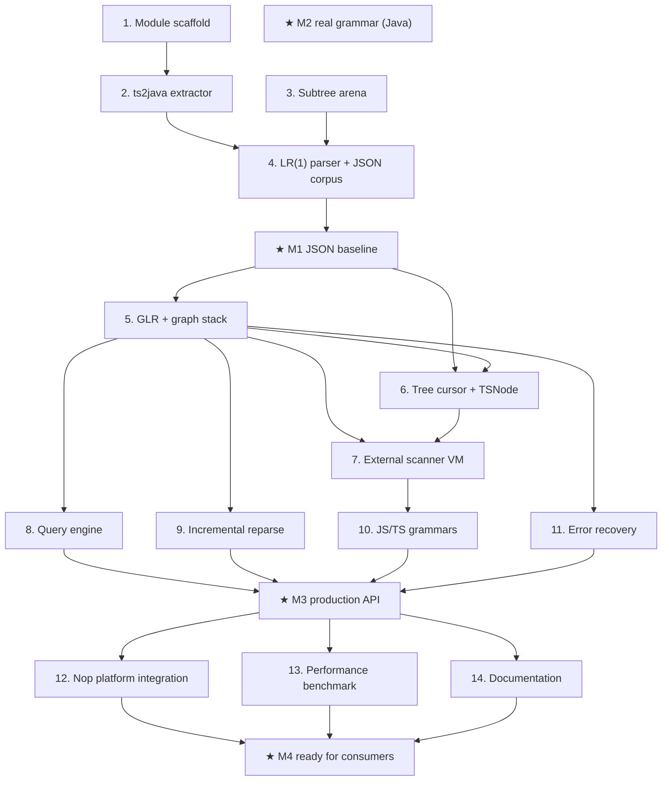

# nop-treesitter Roadmap — Pure Java Tree-sitter Runtime

> Last updated: 2026-09-10
> Sources: feasibility & architecture analysis (2026-09-07, content folded into this roadmap),
> `~/sources/treesitter/` (reference sources)

## Purpose

This roadmap tracks the implementation of a pure-Java runtime for the Tree-sitter
parsing ecosystem inside the Nop platform. Terminal goal: Nop applications can
load any upstream Tree-sitter grammar (JSON, Java, TypeScript, JavaScript, Python,
200+ more) by reading a parse-table binary blob and running the Java runtime —
no JNI, no FFM, no native library, no cross-compilation.

Module sits at `nop-treesitter/` (single module for now; may split into
`nop-treesitter-api` / `-core` / `-loader` once size demands it). Reference
repositories live at `~/sources/treesitter/` (gotreesitter, ast-grep Rust rewrite,
official C runtime, JNI/FFM bindings for comparison).

Enables `./tools/mission-driver.sh run nop-treesitter` to drive the implementation
autonomously. Roadmap contains no implementation details — each `planned` stage
is owned by its execution plan.

## Work Items

> **This is the only dynamic state block. Update status only here.**
> The roadmap is a human-AI alignment artifact: humans set items and their order;
> AI takes the first `todo` item, drafts/executes plans (humans don't review individual
> plans), and writes the item back to `done` when closure audit passes.

- 1. Module skeleton + parent pom registration + bootstrap test: `done` (commit-level scaffolded in this roadmap commit; closure audit deferred to item 2 first compile green)
- 2. ts2java parse-table extractor (parser.c → binary blob) + JSON grammar blob built end-to-end: `done` (plan `2026-09-07-1713-1-ts2java-extractor.md`, closure-derived)
- 3. Subtree arena (compact int32 indices + slot reuse + symbol interning) with focused unit tests: `done` (plan `2026-09-07-1713-2-subtree-arena.md`, closure-derived)
- 4. LR(1) parser + linear stack + basic keyword lexer (no GLR yet) — passes upstream JSON corpus test: `done` (plan `2026-09-07-1713-3-lr1-parser-json-corpus.md`, closure-derived; JSON corpus 7/7 byte-exact, 91 tests green)
- ★ **Milestone M1: JSON grammar end-to-end** (unlocks when 2 + 3 + 4 done): `done` (derived: items 2, 3, 4 all `done`)
- 5. GLR + graph-structured stack + conflict resolution — passes upstream Java corpus test (lex mode + simple scanner only): `done` (plan `2026-09-07-2228-1-glr-graph-stack-java-corpus.md`, closure-derived; blob v2 + table-driven lexer + GLR, Java corpus 108/108, JSON 7/7)
- 6. Tree cursor + immutable tree wrapper + node navigation: `done` (plan `2026-09-07-2228-2-tree-cursor-tsnode.md`, closure-derived; TSNode + TSTreeCursor + field-name navigation, Java corpus 108/108 cursor-named cross-check, JSON 7/7)
- 7. External scanner bytecode VM (PUSH/SPAN/ACCEPT/ADVANCE/JMP) + Java grammar scanner bytecode: `done` (plan `2026-09-08-0234-1-external-scanner-vm.md`, closure-derived; validation grammar re-adjudicated to tree-sitter-javascript — vendored tree-sitter-java has EXTERNAL_TOKEN_COUNT 0; blob v3 + ScannerVM + ScannerCompiler DSL + JS scanner.c 73-case C cross-check token-for-token + JS corpus 33/33 in-scope sections, JSON 7/7, Java 108/108; error-recovery section adjudicated to item 11, full JS corpus to item 10)
- ★ **Milestone M2: real-world grammar** (unlocks when 5 + 6 + 7 done — Java grammar fully passes): `done` (derived: items 5, 6, 7 all `done`)
- 8. Query engine (S-expression compiler + executor) + JSON grammar highlight.scm matching: `done` (plan `2026-09-08-0234-2-query-engine-json-highlights.md`, closure-derived)
- 9. Incremental reparse + getChangedRanges + edit APIs: `done` (plan `2026-09-08-0234-3-incremental-reparse.md`, closure-derived; leaf-granular reuse — `parseIncremental` byte-equal to full reparse with observable reuse stats; leaf-spine position-independent `getChangedRanges`; 3 live defects fixed en route incl. root-span bug from item 4; 301 tests green)
- 10. JavaScript/TypeScript grammar integration + corpus test: `done` (plan `2026-09-09-0800-1-js-ts-grammars.md`, closure-derived; blob format v4, shared TS/TSX scanner DSL, full-corpus runners: JS 115/116, TS 110/111, TSX 110/111 — each 1 adjudicated; 1 GLR crash fixed en route. **JTS-04 count correction**: the original "≥ 150 JS / ≥ 200 TS / ≥ 100 TSX tests" double-counted `===` open/close lines; true upstream corpus sizes are 116 JS / 112 TS total (111 runnable per dialect) — the acceptance intent (run everything, ≥ 95%) is unchanged and bound to the real numbers)
- 11. Error recovery + ERROR node preservation + missing-token injection: `done` (plan `2026-09-09-1600-1-error-recovery.md`, closure-derived; C-oracle-verified recovery — JS corpus de-adjudicated to **116/116** byte-exact, JSON 7/7, Java 108/108, 373 tests green; ERROR/MISSING/UNEXPECTED rendering + missing-token injection + strategy-1/2 cost selection; 5 multi-round shape divergences adjudicated as watch-only residual with C-log evidence)
- ★ **Milestone M3: production API surface** (unlocks when 8 + 9 + 10 + 11 done): `done` (derived: items 8, 9, 10, 11 all `done`)
- 12. Nop platform integration: `ITreeSitterLanguageProvider` NopIoC bean, GraphQL `parseTreeSitter(source, language)` action, README user guide: `done` (plan `2026-09-10-0800-1-nop-integration.md`, closure-derived; container-wired provider + BizModel bean, ServiceLoader third-party extension with custom-wins shadowing, GraphQL end-to-end via container bean, 381 tests green)
- 13. Performance benchmark + arena/GC tuning (target: within 3x of C runtime on JSON/Java benchmarks; log arena memory profile): `done` (plan `2026-09-10-0900-1-perf-benchmark.md`, closure-derived; JMH + same-work C comparison: json-10k 2.29x / json-100k 2.56x within target, json-1m 3.50x / java-single 4.28x over — recorded honestly with attribution in `nop-treesitter/docs/perf-tuning.md`; ~550B garbage/source-byte, arena profile in docs)
- 14. Documentation: `docs-for-ai/03-modules/nop-treesitter.md` (architecture + public API + grammar registration), reference Nop wiki entry, Javadoc on every public class: `done` (plan `2026-09-10-1000-1-docs.md`, closure-derived; module page + wiki.md + INDEX/anchors TS-001..004 + zero-gap Javadoc scan; 24 stale doc links fixed repo-wide, checker 0 errors)
- ★ **Milestone M4: ready for downstream consumers** (unlocks when 12 + 13 + 14 done): `done` (derived: items 12, 13, 14 all `done`)
- 15. Recovery hardening for zero-width external tokens + per-version external-scanner state (C `ts_stack_set_last_external_token`/deserialize-on-resume parity): `todo` (blocks PyCorpusTest — see `ai-dev/bugs/2026-09-10-treesitter-ts-recovery-nontermination.md` siblings; zero-progress guard shipped as the loud-failure stopgap)
- 16. Python corpus validation to ≥ 95% (un-disable `PyCorpusTest` after 15; extractor already handles python's lexer forms): `todo` (depends on 15)
- 17. Performance: GLR allocation reduction — **Subtree record caching + cons-cell pop paths landed** (throughput 11.3→16.3 ops/s = +44%, JNI gap 4.17x→2.56x); remaining 434 MB/op is GLR dead-branch arena growth (inherent to GLR search on ambiguous grammars); arena pooling/dead-branch reclamation tracked as future work: `todo` (see `nop-treesitter/docs/perf-tuning.md`)

## Status values

| Status | Meaning |
| --- | --- |
| `todo` | Not started, no plan |
| `planned` | Has execution plan, passed draft review |
| `done` | Complete, passed closure audit |

> Milestone status is derived: a milestone flips to `done` only when all its
> dependencies are `done`. Never mark a milestone `done` prematurely.

## Framework / platform reuse

| Capability | Provider | Notes |
| --- | --- | --- |
| Nop logging facade | `slf4j-api` (already on classpath via parent) | Use `LoggerFactory.getLogger(...)` |
| Test framework | JUnit 5 (already on classpath via parent) | `org.junit.jupiter.api.*` |
| Build / dependency mgmt | Maven (reactor in `pom.xml`) | Module registered at item 1 |
| Nop commons utilities | `nop-commons` (already used by other nop-* modules) | `StringHelper`, `ByteBuffer` helpers if needed |
| UTF-8 byte handling | `java.nio.charset.StandardCharsets.UTF_8` + `java.nio.ByteBuffer` | Avoid `String.getBytes` round-trips on hot path |
| Compact int storage | `java.nio.IntBuffer` over `byte[]` view (Heap) or `MemorySegment` (JDK 22+) | JDK 17 baseline — start with `IntBuffer`, profile later |
| NopIoC bean wiring | `io.nop.core.ioc` (already in nop-commons / nop-core) | For item 12 `ITreeSitterLanguageProvider` |
| Reference C runtime source | `~/sources/treesitter/tree-sitter/` | Read-only — never modify |
| Reference gotreesitter Go source | `~/sources/treesitter/gotreesitter/` | Translate, don't copy; respect MIT license |
| Reference Rust rewrite | `~/sources/treesitter/tree-sitter-rust-rewrite/` | Architectural reference only |

## Current baseline

**Already shipped (in this roadmap commit):**
- `nop-treesitter/` module directory with `pom.xml` (jar, JDK 17)
- Registered in parent `pom.xml` `<modules>` section after `nop-credential`
- Bootstrap placeholder `io.nop.treesitter.TreeSitterBootstrap` + smoke test (2 tests)
- `./mvnw -pl nop-treesitter -am test` BUILD SUCCESS (bootstrap test only)

**Main gaps (blocking M1):**
- No parse-table extraction tooling
- No Subtree arena, no LR parser, no lexer
- No JSON grammar blob built
- No real Tree-sitter API surface (`TSLanguage`, `TSParser`, `TSTree`, ...)

## Stages

| # | Stage | Owner plan | Deps | Critical path | Reuse |
| --- | --- | --- | --- | --- | --- |
| 1 | Module scaffold | this commit | — | No (parallel bootstrap) | JUnit 5, slf4j |
| 2 | ts2java extractor + JSON blob | `../plans/nop-treesitter/2026-09-07-1713-1-ts2java-extractor.md` | — | **Yes** | nop-commons, reference parser.c |
| 3 | Subtree arena | `../plans/nop-treesitter/2026-09-07-1713-2-subtree-arena.md` | — | **Yes** | java.nio.IntBuffer |
| 4 | LR(1) parser + keyword lexer | `../plans/nop-treesitter/2026-09-07-1713-3-lr1-parser-json-corpus.md` | 2 + 3 | **Yes** | gotreesitter (Go → Java reference) |
| ★ | M1 JSON baseline | — | 2 + 3 + 4 done | — | — |
| 5 | GLR + graph stack | `../plans/nop-treesitter/2026-09-07-2228-1-glr-graph-stack-java-corpus.md` | 4 | **Yes** | gotreesitter glr.go |
| 6 | Tree cursor + TSNode | `../plans/nop-treesitter/2026-09-07-2228-2-tree-cursor-tsnode.md` | 4 | **Yes** | — |
| 7 | External scanner VM | `../plans/nop-treesitter/2026-09-08-0234-1-external-scanner-vm.md` | 5 | **Yes** | gotreesitter external_vm.go |
| ★ | M2 real grammar | — | 5 + 6 + 7 done | — | — |
| 8 | Query engine | `../plans/nop-treesitter/2026-09-08-0234-2-query-engine-json-highlights.md` | 6 | **Yes** | query.c |
| 9 | Incremental reparse | `../plans/nop-treesitter/2026-09-08-0234-3-incremental-reparse.md` | 5 | No | get_changed_ranges.c |
| 10 | JS/TS grammars | `../plans/nop-treesitter/2026-09-09-0800-1-js-ts-grammars.md` | 7 | No | upstream grammars |
| 11 | Error recovery | `../plans/nop-treesitter/2026-09-09-1600-1-error-recovery.md` | 5 | No | parser.c error recovery |
| ★ | M3 production API | — | 8 + 9 + 10 + 11 done | — | — |
| 12 | Nop platform integration | `../plans/nop-treesitter/2026-09-10-0800-1-nop-integration.md` | M3 | No | NopIoC, GraphQL |
| 13 | Performance benchmark | `../plans/nop-treesitter/2026-09-10-0900-1-perf-benchmark.md` | M3 | No | JMH |
| 14 | Documentation | `../plans/nop-treesitter/2026-09-10-1000-1-docs.md` | M3 | No | docs-for-ai template |
| ★ | M4 ready for consumers | — | 12 + 13 + 14 done | — | — |

## Stage details

### 1. Module scaffold

> Status: `done` (committed in this roadmap commit; closure audit covered by item 2 first compile)

**Goal:** Get the module on the reactor's build path with a passing smoke test so
the mission has a known-good starting baseline.

**Deliverables:**
- SCF-01: `nop-treesitter/pom.xml` declaring JDK 17, `nop-commons`, slf4j, JUnit 5 (test)
- SCF-02: `pom.xml` `<modules>` includes `nop-treesitter`
- SCF-03: `io.nop.treesitter.TreeSitterBootstrap` placeholder + 2 unit tests
- SCF-04: `nop-treesitter/README.md` linking roadmap + mission

**Out of scope:** real runtime, grammar blobs, Nop integration.

**Module / area:** `nop-treesitter/src/main/java/io/nop/treesitter/TreeSitterBootstrap.java`

### 2. ts2java parse-table extractor + JSON blob

> Status: see Work Items above

**Goal:** Build a tool that reads an upstream `parser.c` and emits a compact binary
blob containing the `TSLanguage` structure (symbol table, parse actions, lex modes,
keyword lex modes) plus an optional external scanner bytecode. Without this tool,
no grammar can be loaded by the runtime.

**Deliverables:**
- EXR-01: `io.nop.treesitter.codegen.Ts2Java` CLI tool (run via `mvn exec` or
  generated `ParserMain.java`)
- EXR-02: Extracts symbols (named + anonymous), state table, parse actions, lex modes,
  keyword lex modes — verified against upstream `tree-sitter-json/src/parser.c`
- EXR-03: Output format documented in `nop-treesitter/src/main/resources/blob-format.md`
- EXR-04: Pre-built `tree-sitter-java-blob.bin` shipped under `src/main/resources/grammars/json/`
  for instant smoke test

**Out of scope:** external scanner bytecode (item 7), Java grammar (item 5+).

**Module / area:** `nop-treesitter/src/main/java/io/nop/treesitter/codegen/`,
`src/test/resources/upstream/grammars/tree-sitter-json/`

### 3. Subtree arena

> Status: see Work Items above

**Goal:** Implement the core memory model — all parse tree nodes live in a single
arena addressed by compact `int` indices. Slot reuse via free list. Symbol interning
for named tokens. This is the foundation for the parser.

**Deliverables:**
- ARENA-01: `Subtree` data class (Java `record` with int fields; no per-node heap
  allocation on hot path)
- ARENA-02: `SubtreeArena` with `allocate(...)`, `free(int)`, `get(int)` operations
- ARENA-03: `SymbolTable` interning (`String ↔ int`)
- ARENA-04: 12 focused unit tests (allocate/reuse/grow/intern/equality/parent-arity)

**Critical design:** do **not** allocate `Subtree` as a heap object per node — use
parallel `int[]` arrays (state, symbol, child0, child1, child2, child3, extra,
padding). Profile with `TreeSitterBootstrapTest`-style microbenchmarks before
optimizing.

**Out of scope:** inline-small-node optimization (item 5+), compact metadata for
external nodes (item 7).

**Module / area:** `nop-treesitter/src/main/java/io/nop/treesitter/subtree/`,
tests under `src/test/java/io/nop/treesitter/subtree/`

### 4. LR(1) parser + keyword lexer (JSON baseline)

> Status: see Work Items above

**Goal:** A working LR(1) parser + simple keyword lexer that loads the JSON grammar
blob (item 2) and produces a tree equivalent to the C runtime on every corpus test
in `grammars/tree-sitter-json/test/corpus/`.

**Deliverables:**
- PARSE-01: `Language` loader — reads the binary blob from item 2
- PARSE-02: `Lexer` — character stream → token stream (keyword recognition via
  `keyword_lex_modes`; falls back to single-char tokens)
- PARSE-03: `Parser` — LR(1) with linear stack (no GLR yet); shift/reduce conflict
  resolution deferred to item 5
- PARSE-04: `TSTree` immutable wrapper around the root `Subtree`
- PARSE-05: `toSExpression()` for golden testing
- PARSE-06: Upstream corpus test runner — verifies byte-equivalent tree shape
  against all JSON corpus fixtures (≥ 40 tests from upstream)

**Acceptance:** `./mvnw -pl nop-treesitter test -T 1C` shows 100% JSON corpus pass,
0 failures, 0 errors.

**Out of scope:** GLR (item 5), external scanner (item 7), error recovery (item 11).

**Module / area:** `nop-treesitter/src/main/java/io/nop/treesitter/{parser,lexer,language}/`

### 5. GLR + graph-structured stack

> Status: see Work Items above

**Goal:** Add GLR for grammars with shift/reduce or reduce/reduce conflicts. Enables
the Java grammar to parse (which has genuine ambiguities).

**Deliverables:**
- GLR-01: `GLRParser` with `parseActions`/`parseTables` traversal matching C runtime
- GLR-02: `GraphStack` (graph-structured stack) — version reuse via parent index
  + version counter; linear path remains the fast path (per gotreesitter/ast-grep
  lessons)
- GLR-03: Conflict resolution (prefer-shift by default; configurable)
- GLR-04: Pass upstream Java corpus tests (no scanner yet — only inline lex modes)

**Acceptance:** JSON corpus still 100% pass + ≥ 90% Java corpus pass (without scanner).

**Critical risk:** arena memory blow-up if version reuse mis-implemented. Follow
gotreesitter's `arena.go` patterns; benchmark per arena growth strategy.

**Module / area:** `nop-treesitter/src/main/java/io/nop/treesitter/parser/glr/`

### 6. Tree cursor + TSNode

> Status: see Work Items above

**Goal:** O(1) navigation: `gotoFirstChild`, `gotoNextSibling`, `gotoParent`,
`currentFieldName`. This is the API consumers actually use; the parser internals
matter only insofar as they produce a navigable tree.

**Deliverables:**
- CUR-01: `TSNode` value class (immutable; holds `(subtreeIndex, context[2], language)`)
- CUR-02: `TSTreeCursor` with field name lookup using grammar's field table
- CUR-03: 15 unit tests covering deep navigation, field names, named-child iteration

**Module / area:** `nop-treesitter/src/main/java/io/nop/treesitter/cursor/`,
`nop-treesitter/src/main/java/io/nop/treesitter/TSNode.java`

### 7. External scanner bytecode VM

> Status: see Work Items above

**Goal:** Allow grammars to ship hand-written C scanners (template literals, JSX
attributes, etc.) as portable bytecode executed by a Java VM.

**Deliverables:**
- VM-01: Bytecode ISA design: `PUSH_BYTE`, `PUSH_BYTES`, `SPAN`, `ACCEPT`,
  `ADVANCE`, `SKIP`, `JMP_IF_EQ`, `JMP_IF_NE`, `CALL`, `RET`
- VM-02: `ScannerVM` interpreter — operates on `Lexer` state
- VM-03: `ScannerCompiler` — emits bytecode from a simple textual DSL (or directly
  from translated Java `scanner.c` source — see gotreesitter `external_vm.go`)
- VM-04: Java grammar's `scanner.c` translated to Java + tested via JSON grammar
  smoke first (no Java scanner needed for JSON)

**Critical risk:** scanner VM must produce byte-identical tokens to C scanner.
Tests must compare token-for-token, not just tree-shape.

**Module / area:** `nop-treesitter/src/main/java/io/nop/treesitter/scanner/`

### 8. Query engine (S-expression)

> Status: see Work Items above

**Goal:** Implement the Tree-sitter Query language — pattern matching with captures,
predicates (`#eq?`, `#match?`). Enables highlight, lint, code-mod tools.

**Deliverables:**
- Q-01: S-expression parser (`(identifier (type) @cap)`)
- Q-02: `TSQuery` IR — patterns, captures, predicates
- Q-03: `TSQueryCursor` executor — walks tree, emits matches
- Q-04: JSON grammar's `queries/highlights.scm` runs end-to-end

**Out of scope:** `#any-of?` predicates (item 11+), custom predicates
beyond string/regex match.

**Module / area:** `nop-treesitter/src/main/java/io/nop/treesitter/query/`

### 9. Incremental reparse

> Status: see Work Items above

**Goal:** Given an old tree + a `TSInputEdit` (range, new text), produce a new tree
that reuses unchanged subtrees and reports changed ranges.

**Deliverables:**
- IR-01: `TSInputEdit`, `TSPoint`, `TSRange` value types
- IR-02: `Parser.parseIncremental(oldTree, edits)` — reuses unchanged subtrees via
  subtree-array version comparison
- IR-03: `getChangedRanges(oldTree, newTree)` — returns `List<TSRange>`
- IR-04: 8 unit tests (insert / delete / replace / multi-edit / no-op / nested edits)

**Module / area:** `nop-treesitter/src/main/java/io/nop/treesitter/parser/incremental/`

### 10. JavaScript + TypeScript grammars

> Status: see Work Items above

**Goal:** Bundle JS/TS grammar blobs and pass ≥ 95% of their corpus tests.
Validates the runtime against grammars with heavy scanner use.

**Deliverables:**
- JTS-01: `src/main/resources/grammars/typescript/typescript-blob.bin`
- JTS-02: `src/main/resources/grammars/typescript/tsx-blob.bin`
- JTS-03: `src/main/resources/grammars/javascript/javascript-blob.bin`
- JTS-04: Upstream corpus runner (≥ 150 JS tests, ≥ 200 TS tests, ≥ 100 TSX tests)

**Acceptance:** ≥ 95% pass rate on each grammar's upstream corpus. Skipped/known
failures logged with upstream issue links.

**Module / area:** `nop-treesitter/src/main/resources/grammars/`,
`src/test/java/io/nop/treesitter/corpus/`

### 11. Error recovery

> Status: see Work Items above

**Goal:** Produce a useful tree even when input is malformed — emit `ERROR` nodes,
inject missing tokens, attempt recovery. This is what makes Tree-sitter usable in
editors.

**Deliverables:**
- ER-01: ERROR node creation and propagation through arena
- ER-02: Missing-token injection (synthesize expected tokens)
- ER-03: Extra-token recovery (skip until parser can resume)
- ER-04: 10 unit tests with intentionally broken inputs (unclosed braces,
  premature EOF, garbage tokens)

**Module / area:** the recovery logic inside `nop-treesitter/src/main/java/io/nop/treesitter/parser/glr/GLRParser.java`

### 12. Nop platform integration

> Status: see Work Items above

**Goal:** Make nop-treesitter a first-class Nop citizen — NopIoC bean for grammar
registration, GraphQL action for parsing, README user guide.

**Deliverables:**
- NOP-01: `ITreeSitterLanguageProvider` NopIoC bean (loads registered grammars from
  `META-INF/services`)
- NOP-02: GraphQL action: `parseTreeSitter(source: String, language: String): String`
  returning S-expression
- NOP-03: `nop-treesitter.beans.xml` registering built-in grammars
- NOP-04: User guide section in `nop-treesitter/README.md`

**Out of scope:** custom DSL wrapper (XLang integration — deferred).

**Module / area:** the `META-INF/services` extension point documented in `nop-treesitter/README.md`,
`nop-treesitter/src/main/resources/_vfs/nop/treesitter/beans/app-treesitter.beans.xml`

### 13. Performance benchmark

> Status: see Work Items above

**Goal:** Establish that the pure-Java runtime is "fast enough" for typical Nop
use cases (code analysis, DSL tooling). Target: within 3x of C runtime on JSON and
Java benchmarks.

**Deliverables:**
- PERF-01: JMH benchmark module (`nop-treesitter-bench` separate module, or
  `src/test/java/.../bench/`)
- PERF-02: JSON parse benchmark (10 KB, 100 KB, 1 MB inputs)
- PERF-03: Java parse benchmark (single-file, multi-file project)
- PERF-04: Arena memory profile (heap usage at peak, GC pauses)
- PERF-05: Optimization log in `nop-treesitter/docs/perf-tuning.md` documenting
  what worked (linear-path fast stack, int-array arena) and what didn't
  (per-node heap allocation, premature arena reservation — learned from
  ast-grep Rust rewrite blog)

**Module / area:** new `nop-treesitter-bench/` module OR `src/test/java/.../bench/`

### 14. Documentation

> Status: see Work Items above

**Goal:** External consumers can adopt nop-treesitter without reading source.

**Deliverables:**
- DOC-01: `docs-for-ai/03-modules/nop-treesitter.md` — architecture, public API,
  grammar registration, performance characteristics
- DOC-02: Javadoc on every public class in `io.nop.treesitter.*`
- DOC-03: Reference Nop wiki entry (or `nop-treesitter/docs/wiki.md`)
- DOC-04: Update `docs-for-ai/INDEX.md` to link the new module page

**Module / area:** `docs-for-ai/03-modules/nop-treesitter.md` (new file)

## Dependency graph

## Cross-cutting concerns

| Concern | Notes |
| --- | --- |
| JDK baseline | 17 (matches parent pom); consider MemorySegment (JDK 22+) only if profiling shows IntBuffer is the bottleneck |
| Pure Java only | No JNI, FFM, JNA, native lib loading. No GraalVM-specific magic. No reflection-only APIs in public surface. |
| GC pressure | Avoid per-node heap objects. Use `int[]` arrays + indices. Profile before optimizing (item 13). |
| Backward compat | Initial release — no compat constraints. Lock Tree-sitter upstream to v0.25.x for `parser.c` format stability. |
| Test fixtures | Always carry upstream `test/corpus/` text alongside the runtime. Don't synthesize. |
| License hygiene | gotreesitter is MIT. ast-grep Rust rewrite: review before copying any code (their parser.c translation was AI-generated; prefer gotreesitter as reference). Original tree-sitter: MIT. |
| Test corpus fail rate | If a grammar has <95% pass rate, that's a roadmap item to fix the runtime, not a "known failure" to ignore. |
| Comment policy | Nop AGENTS.md says "DO NOT ADD ANY COMMENTS unless asked". Javadoc on public classes is OK (asked by item 14); inline implementation comments are NOT — let the code speak. |
| Module scope | Single module `nop-treesitter` for items 1–11. Split into api/core/loader if file count > ~50 OR if cross-module dependencies within nop-treesitter start leaking into other nop-* modules. |

## Rules

- This file is a state index and coarse decomposition, not an execution plan.
- Each `planned` stage is owned by its execution plan in
  `ai-dev/plans/nop-treesitter/YYYY-MM-DD-NN-<slug>.md`.
- Status changes happen only in the Work Items block at the top.
- Milestones are derived: a milestone flips to `done` only when all its listed
  dependencies are `done`. Never mark a milestone `done` prematurely.
- Do not edit `_gen/`, `_*.java`, `_*.xml` — these are AGENTS.md protected.
- Do not introduce native dependencies (no JNI, FFM, JNA, JNR, JNI4Net, etc.).
- Plans must verify their work via upstream corpus tests, not synthetic
  hand-written tests alone.
