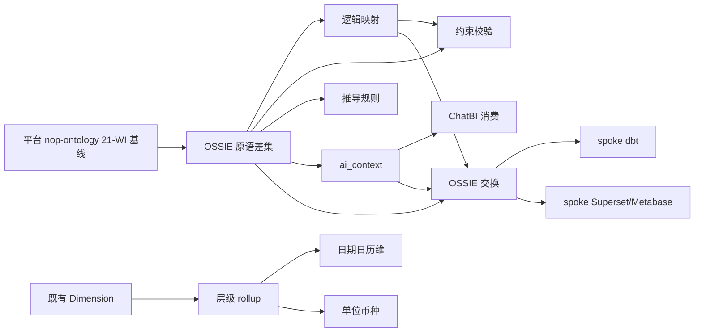

# Ontology & Semantic Roadmap — Apache OSSIE 对标缺口

> 最后更新：2026-09-23
> 来源：`~/sources/ossie`（Apache OSSIE，core-spec 0.2.0.dev0）× `nop-entropy` 模块盘点对比
> 关联：`knowledge-rag-roadmap.md`（WeKnora 对标，姊妹路线图）
> 前置阅读：`ai-dev/analysis/2026-09/2026-09-12a-github-ontology-projects-vs-nop-metadata.md`（**含 2026-09-14 裁定补记**）
> **并行路线图（定义面权威）**：分支 `feature/nop-ontology` 上 `feature/nop-ontology` 分支上的 ai-dev/backlog/nop-ontology-roadmap.md（21 WI）+ ai-dev/design/nop-ontology/01-data-model.md（两路径仅存在于该分支，master 上不可见——本文件不反引号以免 check-doc-links 误报）——**本路线图不取代它**，边界见 §1/§8
> 位置：本文件按仓库 roadmap 惯例存放于 `ai-dev/backlog/`；格式遵循 AGE 模板（attractor-guided-engineering-template）nop-app-erp docs/backlog/00-roadmap-authoring-guide.md（跨仓）（跨仓模板参考）。
> 独立草案审查：见文末 Draft Review Record

## 1. 目的

补齐 Nop 平台相对 Apache OSSIE 的**本体-OSSIE 特有原语、本体-逻辑映射、AI 语义注解与厂商中立交换**缺口。`nop-metadata` 已有治理深度；**本体定义面（ObjectType/LinkType/ActionType 等）归平台 `nop-ontology` 21-WI 路线图**，本路线图只做 OSSIE 对标中**该 21-WI 未覆盖或需对账衔接**的部分。

**与平台 `nop-ontology` 路线图的边界**：

| 面 | 归属 | 说明 |
|----|------|------|
| ObjectType/Property/LinkType/ActionType/Function/Interface 定义 + 三绑定 + 动能面 + 设计器 UI | **分支 21-WI**（`feature/nop-ontology`） | 本路线图 O1 **不对账不实施** |
| OSSIE 特有：ValueType+units、关系 `verbalizes`/`identify_by`/角色基数、`ontology_mappings`、`requires`/`derived_by`、`ai_context`、OSSIE 交换/转换器 | **本路线图 O1–O9** | O1 首项 = 与 21-WI 逐 WI 对账后的差集设计 |
| 维度层级 rollup / 日期日历维 / 单位币种换算（BI 语义层深化） | **本路线图 O10–O12** | 不属本体定义面，归 `nop-metadata`/应用 |

**范围外（明确不做）**：

- **SQL/表达式多方言交换与可移植 SQL 子集** — 完全交给 EQL `dialect.xml`；**不**实现 OSSIE 式 11 方言并列数组、**不**做 OSSIE_SQL_2026 合规等级、**不**做 sqlglot 式多方言 lint。交换格式中的表达式一律以 EQL 表达，落库/导出时由 EQL dialect 负责翻译
- RDF/OWL/SPARQL/三元组库运行时 — 已裁决拒绝；走 XDef + GraphQL / 独立 `nop-ontology` 模块路线
- **在 nop-metadata 上恢复 `ontology.xdef` 声明层** — 2026-09-14 裁定补记已**废止**该路径（nop-metadata 瘦身为治理运行时）
- OSSIE 参考编译器/语义查询语言 — OSSIE 自身亦仅 roadmap；Nop 已有 EQL 运行时，不重复建设
- CLI `convert`/`validate` 空壳、compliance 空目录等 OSSIE 自身未完成项 — 不对标

## 2. Work Item Status

> 状态在工作项上；Milestone 仅为分组。此块是 AI 工作队列唯一入口：按里程碑顺序取第一个 `todo`。

**汇总**：todo 12 · ready 0 · done 0

### M1 — 本体原语对账与映射

| Work Item | Status | Depends |
|-----------|--------|---------|
| O1 OSSIE 特有原语对账差集（对齐平台 nop-ontology 21-WI） | todo | 平台 21-WI 定义面基线（前置对账） |
| O2 本体 ↔ 逻辑模式映射实体 | todo | O1 |

### M2 — 本体约束与推导

| Work Item | Status | Depends |
|-----------|--------|---------|
| O3 `requires` 完整性约束校验 | todo | O1, O2 |
| O4 `derived_by` 推导规则（非递归起步） | todo | O1 |

### M3 — AI 语义注解与消费

| Work Item | Status | Depends |
|-----------|--------|---------|
| O5 `ai_context` 五级结构化注解 | todo | O1 |
| O6 ChatBI/Agent 消费 `ai_context` | todo | O5 |

### M4 — 交换与转换器

| Work Item | Status | Depends |
|-----------|--------|---------|
| O7 OSSIE 结构导入/导出（表达式=EQL） | todo | O1, O2, O5 |
| O8 转换器 spoke #1 — dbt MetricFlow | todo | O7 |
| O9 转换器 spoke #2 — 候选池 {Superset, Metabase}（实施时人工二选一） | todo | O7 |

### M5 — 语义层深化

| Work Item | Status | Depends |
|-----------|--------|---------|
| O10 维度层级 rollup | todo | 既有 Dimension |
| O11 日期日历维（date spine） | todo | 既有 Dimension, O10 |
| O12 单位/币种换算 | todo | 既有 Dimension, O10 |

## 3. 框架/平台复用

以下能力已存在，工作项**不得重建**：

| 能力 | 提供方式 |
|------|----------|
| 术语/词汇治理 | `nop-metadata` Glossary/Term（`iri`/`namespaces`/`conceptMappings` 字段**已预留**）、Classification/Tag 审批流、SemanticType |
| BI 语义层 | Measure/Dimension/Join/Filter、`queryAggregation`/`queryJoinData`/`queryTableData`、跨库联邦 |
| SQL 生成与**方言** | EQL→SqlExpr AST + **`dialect.xml` 全权负责方言**（`sql:when-dialect`、函数映射、DDL 方言） |
| 血缘/质量/契约 | SQL-AST 血缘提取、data quality checkpoint、reconciliation、data contract |
| 模型 DSL 体系 | XDef/XMeta、Delta `x:extends`、~130 个 xdef 元模型 |
| ChatBI | `nop-datav` chatbi 工具环（数据集绑定、行钳制、可见性守卫）；应用层文档见 nop-app-erp docs/design/dashboard-semantic-layer.md、docs/design/ai-native-interface.md（跨仓） |
| 代码图算法 | `nop-graph`（BFS/PageRank/Leiden…）— 非业务 KG |
| OLAP 查询 | `nop-orm` MDX executor |
| **本体定义面（并行在建）** | 分支 `feature/nop-ontology`：ai-dev/backlog/nop-ontology-roadmap.md 21 WI（定义 8 实体 + 动能 3 实体 + 三绑定 + 设计器） |
| 现成对标分析 | 平台内 ontology-vs-nop-metadata（**含废止 ontology.xdef-on-nop-metadata 的裁定补记**）/ Palantir / TrustGraph 分析笔记 |

## 4. 当前基线

| OSSIE 能力 | Nop 现状 | 缺口性质 |
|------------|----------|----------|
| EntityType/ValueType 概念模型 | 定义面归平台 `nop-ontology` 21-WI（在建）；OSSIE ValueType+units 差集未建 | 对账差集（O1） |
| n-ary 关系 + 角色 + 基数 + `verbalizes` + `identify_by` | 平台 LinkType 有双向/基数；OSSIE `verbalizes`/`identify_by` 模式串未建 | 对账差集（O1） |
| `ontology_mappings`（object/link 映射到逻辑层） | 无独立映射实体；Glossary `conceptMappings` 仅预留 JSON | 结构缺口（O2） |
| `derived_by` 推导规则（Datalog 式） | `nop-rule` 是决策树/矩阵，无递归推导 | 能力缺口（O4） |
| `requires` 完整性约束 | data quality 有规则，**无**本体级 population/link 约束 | 能力缺口（O3） |
| `ai_context`（五级） | description 零散，**无**结构化 instructions/synonym/example_queries | 能力缺口（O5） |
| 厂商中立交换 + hub-spoke 转换器 | 无 OSSIE 导入/导出；表达式方言由 EQL 负责（见范围外） | 能力缺口（O7–O9） |
| 维度层级/日历/单位币种 | Dimension 有但 rollup 薄；无 date spine；无单位换算 | 共同缺口（O10–O12；OSSIE 亦 roadmap） |

## 5. Milestones

### Milestone M1 — 本体原语对账与映射

| Work Item | Status | Owner Doc | Dependencies | Platform Reuse | 落点 |
|-----------|--------|-----------|--------------|----------------|------|
| O1: OSSIE 特有原语对账差集 | todo | ai-dev/design/nop-metadata/ontology-ossie-primitives.md（**NEW**） | 平台 `feature/nop-ontology` 21-WI 定义面基线（**实施前强制对账**） | 承接 21-WI 的 NopOnt* 定义表与发布管线；补 ValueType+units、`verbalizes`、`identify_by`、角色/基数与 OSSIE 对齐 | **平台** `feature/nop-ontology` 扩展（**禁止**在 nop-metadata 上恢复 ontology.xdef） |
| O2: 本体 ↔ 逻辑模式映射实体 | todo | ai-dev/design/nop-metadata/ontology-mappings.md（**NEW**） | O1 | `nop-metadata` catalog 逻辑表、EQL 表达式（方言归 dialect.xml） | **平台** ORM 新实体（mapping 实体） |

### Milestone M2 — 本体约束与推导

| Work Item | Status | Owner Doc | Dependencies | Platform Reuse | 落点 |
|-----------|--------|-----------|--------------|----------------|------|
| O3: `requires` 完整性约束校验 | todo | ai-dev/design/nop-metadata/ontology-constraints.md（**NEW**） | O1, O2 | data quality checkpoint 调度、`nop-rule` 求值可选复用 | **平台** |
| O4: `derived_by` 推导规则（非递归起步，递归后置） | todo | ai-dev/design/nop-metadata/ontology-derivation.md（**NEW**） | O1 | `nop-rule` 双 DSL、EQL 视图能力（方言仍归 dialect.xml） | **平台** |

### Milestone M3 — AI 语义注解与消费

| Work Item | Status | Owner Doc | Dependencies | Platform Reuse | 落点 |
|-----------|--------|-----------|--------------|----------------|------|
| O5: `ai_context` 五级结构化注解 | todo | ai-dev/design/nop-metadata/ai-context.md（**NEW**） | O1（概念级可先于完整差集落地） | XMeta 扩展投影、GraphQL 暴露 | **平台** XMeta + **应用**填充 |
| O6: ChatBI/Agent 消费 `ai_context` | todo | ai-dev/design/nop-datav/ai-design.md（**EXPAND**，已存在） | O5 | 既有 chatbi system prompt / 工具环 | **平台** prompt 装配 + **应用** nop-app-erp 接线（跨仓） |

### Milestone M4 — 交换与转换器

> 表达式一律 EQL；导出目标工具需要特定 SQL 方言时由 EQL `dialect.xml` 翻译，转换器**不**携带多方言表达数组。

| Work Item | Status | Owner Doc | Dependencies | Platform Reuse | 落点 |
|-----------|--------|-----------|--------------|----------------|------|
| O7: OSSIE 结构导入/导出（YAML/JSON，表达式=EQL） | todo | ai-dev/design/nop-metadata/ossie-exchange.md（**NEW**） | O1, O2, O5 | `nop-cli convert` 插件位、ext/delta 式透传 | **平台** 或 **工具** `nop-cli` |
| O8: 转换器 spoke #1 — dbt MetricFlow | todo | ai-dev/design/nop-metadata/ossie-exchange.md（**EXPAND**，O7 已建时） | O7 | hub-spoke：只映射结构 + EQL 表达式字段 | **工具** |
| O9: 转换器 spoke #2 — 候选池 {Superset, Metabase}，**实施时人工二选一** | todo | ai-dev/design/nop-metadata/ossie-exchange.md（**EXPAND**） | O7 | 同 O8；OSSIE 自身亦无 Superset 转换器，可双赢 | **工具** |

### Milestone M5 — 语义层深化

| Work Item | Status | Owner Doc | Dependencies | Platform Reuse | 落点 |
|-----------|--------|-----------|--------------|----------------|------|
| O10: 维度层级 rollup | todo | ai-dev/design/nop-metadata/dimension-hierarchies.md（**NEW**，O10–O12 共用） | 既有 Dimension | `nop-metadata` Measure/Dimension、`nop-report`/`nop-datav` 消费 | **平台** ORM 扩展 |
| O11: 日期日历维（date spine） | todo | ai-dev/design/nop-metadata/dimension-hierarchies.md（**EXPAND**，O10 已建时） | 既有 Dimension, O10 | 同上 | **平台** ORM 扩展 |
| O12: 单位/币种换算 | todo | ai-dev/design/nop-metadata/dimension-hierarchies.md（**EXPAND**，O10 已建时） | 既有 Dimension, O10 | 同上 | **平台** ORM 扩展 |

## 6. Work Item Details

| Work Item | 交付范围（一句话） | ORM 变更 |
|-----------|-------------------|----------|
| O1 | 与平台 21-WI 逐 WI 对账后输出差集设计并落地：ValueType+units、`verbalizes` 模式、`identify_by` 首选标识、OSSIE 角色/基数对齐；**不**在 nop-metadata 恢复 ontology.xdef | **是**（NopOnt* 定义表加性扩展，归平台分支） |
| O2 | 概念/关系 → 逻辑表/字段/EQL 表达式的映射实体 + 引用完整性校验；**不**做方言数组 | **是**（mapping 实体） |
| O3 | 本体约束声明 + 校验执行器，结果接入 data quality checkpoint/评分 | 可能（constraint 实体） |
| O4 | `derived_by` 声明（一期非递归视图式），求值走 EQL/规则引擎 | 可能（derivation 实体） |
| O5 | model/dataset/field/relationship/metric 五级 `ai_context`（instructions/synonyms/exampleQueries）XMeta 节点 + 投影 | 否（XMeta/ext）或加性列 |
| O6 | ChatBI/Agent 装配时注入 `ai_context`，提升生成问答与指标解释质量 | 否 |
| O7 | OSSIE 文档 ↔ Nop 本体/语义模型结构互转；表达式字段读写均为 EQL，方言翻译委托 dialect.xml | 否 |
| O8 | dbt semantic_manifest ↔ O7 中间格式结构转换 + round-trip 测试 | 否 |
| O9 | Superset 或 Metabase（人工定）↔ O7 结构转换 + round-trip 测试 | 否 |
| O10 | 维度层级父指针 + rollup 预聚合，供报表/看板/ChatBI 上卷 | **是** |
| O11 | date spine 日历维生成（工作日/财周/财月属性），供时间智能 | **是** |
| O12 | 单位换算率表 + 币种折算（含生效期），供多币种度量 | **是** |

## 7. Dependencies

## 8. 横切关注点

- **方言单一真相**：一切 SQL 方言问题路由 EQL `dialect.xml`（含 `sql:when-dialect`、函数映射）。任何工作项若发现"需要新方言层"，标记供人工审查而非自建。
- **不引入 RDF 栈**：O1–O12 全部走独立 `nop-ontology` 模块 / XDef / ORM / GraphQL；若实施中出现 jena/rdf4j/SPARQL 依赖提案，直接阻塞。
- **与平台 21-WI 对账义务**：O1 实施前必须读取 `feature/nop-ontology` 分支的 ai-dev/backlog/nop-ontology-roadmap.md 与 ai-dev/design/nop-ontology/01-data-model.md（分支路径），输出逐 WI 覆盖矩阵；重叠项以 21-WI 为准，本路线图只交付差集。**禁止**恢复 nop-metadata 上的 `ontology.xdef`（2026-09-14 裁定废止）。
- **与既有自评衔接**：引用 `2026-09-12a-…nop-metadata.md` 时必须同时采纳其**裁定补记**（独立模块取代 ontology.xdef-on-nop-metadata），不得只采 §Conclusion 旧路径。
- **与知识路线图边界**：KG **运行时抽取**（文档→图谱）归 `knowledge-rag-roadmap.md` K15；本路线图的"本体"是**设计时语义声明/交换层**，两者不重叠。
- **保护区域**：
  - `*.orm.xml`/`*.api.xml` → `auto + dual-agent-approval`（非已废止的 ask-first）。
  - **落应用仓（nop-app-erp）的接线工作项触发「外部仓库代码」保护区域**（nop-app-erp docs/context/ai-autonomy-policy.md（跨仓）：跨仓 plan + 双独立子 agent 批准）；本仓保护区域按本仓 `ai-dev` 约定执行；与 ORM 变更叠加时两者均须满足。
- **状态纪律**：`todo → ready` 须独立草案审查；`ready → done` 须独立结束审计。里程碑无状态。

## 9. 规则

1. 本路线图是编排层，不是实施规格；每工作项实施前须单独 plan + plan-audit。
2. 不重建 §3 已列能力；发现复用点在结束审计时回写 §3。
3. AI 不得自行增删/重排工作项；结构变更标记供人工审查。
4. **禁止**在本路线图内恢复任何"多方言表达/可移植 SQL 子集"工作项——该主题已裁决归 EQL dialect。
5. O1 不得绕过与平台 21-WI 的对账直接开工。

## Draft Review Record

| Round | Reviewer | Verdict | Summary |
|-------|----------|---------|---------|
| R1 | 独立子 agent `ses_f337528c9ffeGQiCsGJ70TxPB4`（fresh） | needs revision | 3 Blocker（O1 复活已废止 ontology.xdef-on-nop-metadata；与平台 21-WI 双路线图无边界；O6 幽灵 EXPAND 路径）+ Major（§2 分组、mermaid 表图冲突、O10 过大须拆、保护区域缺外部仓）+ Minor/Nit；方言排除与 K15/O1 边界裁定成立 |
| R2 | 独立子 agent `ses_f33605c79ffeSpizwg4HrhWWgU`（fresh） | passes draft review | 全部 16 项 R1 Blocker/Major 修复复核通过；0 Blocker + 0 Major + 8 Minor + 1 Nit（O11/O12 EXPAND-before-NEW 依赖、O9 §2 标签、README O5/外部仓枚举等，与 knowledge 路线图同批）——已回写，不阻塞 per-plan |
