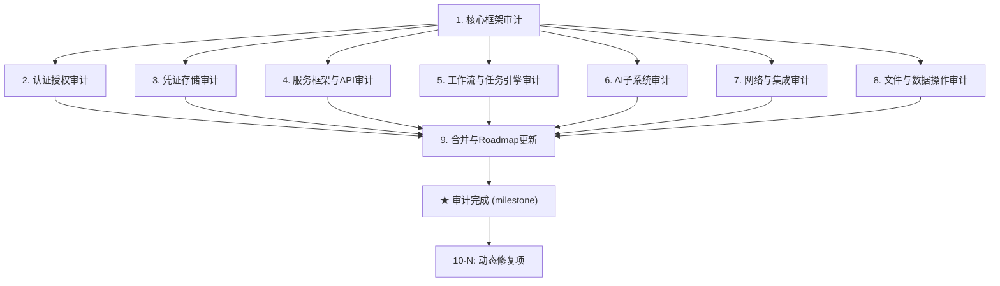

# Nop Entropy 安全审计 Roadmap — 全栈安全审查与自动修复

> Last updated: 2026-09-18
> Sources: `docs-for-ai/02-core-guides/auth-and-permissions.md` (认证模式),
> `docs-for-ai/02-core-guides/tenant-model.md` (租户隔离),
> `docs-for-ai/04-reference/safe-api-reference.md` (安全API使用)

## Purpose

本 roadmap 跟踪 nop-entropy 平台的全面安全审计及后续自动修复。终端目标：完成所有模块的安全审计，修复所有 CRITICAL/HIGH 级别问题，通过安全复查 — 使得 `./tools/mission-driver.sh security-audit` 能够自主驱动后续安全增强工作。

**两阶段设计**:
1. **审计阶段**: 逐模块系统性审计每个安全关键模块，生成审计报告
2. **修复阶段**: 汇总发现，按严重性排序，动态更新本 roadmap 添加修复工作项，然后执行修复

不包含实现细节。每个 `planned` 阶段由其执行计划拥有。

## Work Items

> **这是唯一的动态状态块。仅在此处更新状态。**
> 审计合并（item 9）完成后，此块将动态添加修复工作项。

### Phase 1: 审计（按模块）

- 1. 核心框架安全审计 (`nop-core-framework`, `nop-persistence`, `nop-kernel`): `done`
- 2. 认证授权审计 (`nop-auth`, `nop-biz-auth-core`): `planned`
- 3. 凭证存储审计 (`nop-credential`): `todo`
- 4. 服务框架与API层审计 (`nop-service-framework`, `nop-graphql`): `todo`
- 5. 工作流与任务引擎审计 (`nop-wf`, `nop-task`, `nop-job`): `todo`
- 6. AI子系统审计 (`nop-ai`): `todo`
- 7. 网络与集成审计 (`nop-network`, `nop-stream`, `nop-tcc`): `todo`
- 8. 文件与数据操作审计 (`nop-file`, `nop-datav`, `nop-metadata`): `todo`

### Phase 2: 合并与Roadmap更新

- 9. 审计合并与Roadmap动态更新: `todo`

### Phase 3: 修复（item 9 完成后动态生成）

> **状态: 待生成** — 修复工作项将在审计合并后添加到此处。
> 工作项将按优先级排序: CRITICAL → HIGH → MEDIUM → LOW

## Status values

| Status | Meaning |
| --- | --- |
| `todo` | 未开始，无计划 |
| `planned` | 有执行计划，已通过草稿评审 |
| `done` | 完成，已通过闭环审计 |

> 里程碑状态是派生的: 当审计项 1-8 全部 `done` 时，里程碑自动变为 `done`。

## Framework / platform reuse

| Capability | Provider | Notes |
| --- | --- | --- |
| 静态分析 | PMD + SpotBugs + Checkstyle | 已在根 pom.xml (qa profile) 配置 |
| 代码覆盖率 | JaCoCo | 默认启用 |
| JWT tokens | `JwtAuthTokenProvider` | 使用现有实现；不要重建加密 |
| 密码哈希 | SHA256 + BCrypt 组合 | 使用现有 `CompositePasswordEncoder` |
| AES-256-GCM 加密 | `nop-credential` 模块 | 重用于敏感数据 |
| 租户隔离 | ORM 自动过滤 + BizModel 数据权限 | 深度防御模式 |
| Delta 定制 | Nop Delta 机制 | 用于安全配置覆盖 |

## Current baseline

**已发布:**
- Auth HTTP 过滤器，基于路径的规则 (`AuthFilterConfig`)
- JWT token 生命周期 (access/refresh/code 使用独立 HMAC keys)
- MFA 支持 (TOTP, WebAuthn, SMS, Email)
- AES-256-GCM 加密凭证存储
- 租户隔离 (ORM 自动过滤 + BizModel 数据权限)
- PMD 安全规则 (HardCodedCryptoKey, InsecureCryptoIv)
- 安全 cookie 处理 (HttpOnly, SameSite=Lax, __Host- 前缀)

**已知安全缺口 (待审计验证):**
- Action auth 默认禁用 (`nop.auth.enable-action-auth=false`)
- Admin bypass check 默认禁用 (`nop.auth.skip-check-for-admin=false`)
- JWT enc-key 默认为空 (必须按部署配置)
- 密码策略默认较弱 (最小 8 字符，无复杂性强制)

## Stages

| # | Stage | Owner plan | Deps | Critical path | Reuse |
| --- | --- | --- | --- | --- | --- |
| 1 | 核心框架安全审计 | core-audit-plan | — | **Yes** | PMD/SpotBugs |
| 2 | 认证授权审计 | auth-audit-plan | 1 | **Yes** | 现有 auth filter |
| 3 | 凭证存储审计 | credential-audit-plan | 1 | No | nop-credential |
| 4 | 服务框架与API审计 | api-audit-plan | 1 | No | nop-graphql |
| 5 | 工作流与任务引擎审计 | workflow-audit-plan | 1 | No | — |
| 6 | AI子系统审计 | ai-audit-plan | 1 | No | — |
| 7 | 网络与集成审计 | network-audit-plan | 1 | No | — |
| 8 | 文件与数据操作审计 | data-audit-plan | 1 | No | — |
| 9 | 审计合并与Roadmap更新 | consolidation-plan | 1-8 | **Yes** | — |
| ★ | **Milestone: 审计完成** | — | 1-8 done | — | — |
| 10-N | **动态修复项** (item 9 后生成) | — | milestone | — | — |

## Stage details

### 1. 核心框架安全审计

> Status: see Work Items above

**Goal:** 审计 `nop-core-framework` (security, plugin, IoC)、`nop-persistence` (ORM, SQL注入面) 和 `nop-kernel` (XLang代码生成)。

**Deliverables:**
- CORE-01: 密钥管理审查 (IKeyManager, DefaultKeyManager, CompositeKeyManager)
- CORE-02: 插件系统安全 (SHA256验证, 制品下载, 生命周期)
- CORE-03: IoC容器安全 (bean注入, 配置注入)
- CORE-04: ORM/EQL注入面分析 (SQL生成, 查询编译)
- CORE-05: 租户隔离执行审查

**Out of scope:** 认证/登录流程 (item 2), 凭证加密 (item 3)。

**Module / area:** `nop-core-framework/`, `nop-persistence/`, `nop-kernel/`

### 2. 认证授权审计

> Status: see Work Items above

**Goal:** 审计 `nop-auth` (RBAC, MFA, session, SSO) 和 `nop-biz-auth-core` (JWT, 密码编码, 过滤器)。

**Deliverables:**
- AUTH-01: JWT token 生命周期安全 (目的隔离, 密钥轮换, 过期)
- AUTH-02: 密码策略执行 (强度, 存储, 重置流程)
- AUTH-03: MFA实现审查 (TOTP, WebAuthn, SMS, Email code 时序)
- AUTH-04: 会话管理 (cookie安全, 超时, 并发会话)
- AUTH-05: RBAC绕过风险 (admin skip-check, service-public 标志)
- AUTH-06: SSO/OAuth集成安全

**Out of scope:** 凭证存储 (item 3), API级权限检查 (item 4)。

**Module / area:** `nop-auth/`, `nop-service-framework/nop-biz-auth-core/`

### 3. 凭证存储审计

> Status: see Work Items above

**Goal:** 审计 `nop-credential` (AES-256-GCM加密, Vault KMS, RBAC访问)。

**Deliverables:**
- CRED-01: 加密实现审查 (密钥派生, IV处理, GCM标签)
- CRED-02: Vault KMS集成安全 (认证, token轮换)
- CRED-03: 凭证级RBAC (NopCredentialAuth映射)
- CRED-04: 使用审计追踪完整性 (NopCredentialUsage)

**Out of scope:** 认证模块 (item 2), 文件存储 (item 8)。

**Module / area:** `nop-credential/`

### 4. 服务框架与API审计

> Status: see Work Items above

**Goal:** 审计 `nop-service-framework` (BizModel, GraphQL引擎) 和API暴露面。

**Deliverables:**
- API-01: GraphQL端点安全 (查询深度, 复杂度, 内省)
- API-02: Action auth检查 (GraphQLActionAuthChecker)
- API-03: 字段级可见性执行
- API-04: 分布式代理安全 (/px/ 路径, token转发)

**Out of scope:** 认证/登录 (item 2), 工作流 (item 5)。

**Module / area:** `nop-service-framework/`

### 5. 工作流与任务引擎审计

> Status: see Work Items above

**Goal:** 审计 `nop-wf` (审批委托, 替换)、`nop-task` (逻辑流)、`nop-job` (定时任务)。

**Deliverables:**
- WF-01: 工作流审批委托安全
- WF-02: 任务执行隔离
- WF-03: 作业调度安全 (分布式锁, 重试)

**Out of scope:** 认证 (item 2), 凭证存储 (item 3)。

**Module / area:** `nop-wf/`, `nop-task/`, `nop-job/`

### 6. AI子系统审计

> Status: see Work Items above

**Goal:** 审计 `nop-ai` (LLM网关, agent执行, 工具调用)。

**Deliverables:**
- AI-01: AI网关账户切换安全
- AI-02: 工具调用沙箱
- AI-03: 提示注入防护
- AI-04: LLM响应处理 (密钥泄漏)

**Out of scope:** 认证 (item 2), 凭证存储 (item 3)。

**Module / area:** `nop-ai/`

### 7. 网络与集成审计

> Status: see Work Items above

**Goal:** 审计 `nop-network` (HTTP客户端, MQTT)、`nop-stream` (分布式流)、`nop-tcc` (分布式事务)。

**Deliverables:**
- NET-01: HTTP客户端安全 (SSL/TLS, 重定向处理)
- NET-02: MQTT连接安全
- NET-03: 流处理隔离
- NET-04: TCC事务超时处理

**Out of scope:** 认证 (item 2), 凭证存储 (item 3)。

**Module / area:** `nop-network/`, `nop-stream/`, `nop-tcc/`

### 8. 文件与数据操作审计

> Status: see Work Items above

**Goal:** 审计 `nop-file` (上传/下载)、`nop-datav` (数据视图)、`nop-metadata` (BI语义层)。

**Deliverables:**
- FILE-01: 文件上传路径遍历防护
- FILE-02: 文件存储访问控制
- DATA-01: 数据视图注入风险
- META-01: 元数据血缘安全

**Out of scope:** 认证 (item 2), 凭证存储 (item 3)。

**Module / area:** `nop-file/`, `nop-datav/`, `nop-metadata/`

### 9. 审计合并与Roadmap更新

> Status: see Work Items above

**Goal:** 合并所有审计发现 (items 1-8)，按严重性分类，动态更新本 roadmap 添加修复工作项。

**Deliverables:**
- CONSOL-01: 将所有审计报告聚合为统一发现数据库
- CONSOL-02: 分类发现: CRITICAL / HIGH / MEDIUM / LOW
- CONSOL-03: 在本 roadmap 中生成修复工作项 (Phase 3)
- CONSOL-04: 为每个修复批次创建执行计划

**关键行为**: 此 item 完成后，上面的 Work Items 块将更新为包含新的修复项 (10, 11, 12, ...)。mission-driver 将继续执行这些修复计划。

**Out of scope:** 实际修复 (动态生成)。

**Module / area:** 跨模块

## Dependency graph

## Cross-cutting concerns

| Concern | Notes |
| --- | --- |
| 验证基线 | 每个阶段后: `./mvnw test -T 1C` 通过，静态分析干净 |
| 发现格式 | 每个审计产生结构化报告，包含严重性、位置、建议 |
| 不过早修复 | 所有修复在 Phase 3 进行；审计阶段只读 |
| 回归预防 | 每个修复必须包含回归测试 |
| 租户安全 | 所有模块的跨模块关注点: 验证租户隔离 |
| 配置安全 | 审查所有 `@cfg:` 值注入的密钥泄漏 |
| 生成代码安全 | 验证 `_gen/` 输出不引入漏洞 |

## Rules

- 本文件是状态索引和粗略分解，不是执行计划。
- 每个 `planned` 阶段由其执行计划拥有。
- 状态变更仅发生在顶部的 Work Items 块中。
- 里程碑是派生的: 审计项 1-8 必须全部 `done` 后里程碑才标记为 `done`。
- **动态更新规则**: item 9 完成后，本 roadmap 必须更新修复工作项后 mission 才能继续。
- **严重性优先排序**: 修复项按 CRITICAL → HIGH → MEDIUM → LOW 排序。
- **不跳过审计**: 范围内的每个模块必须在合并前完成审计。
