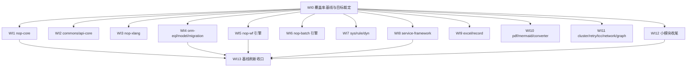

# 全仓单元测试补充 Roadmap（unit-test coverage uplift）

> Last updated: 2026-09-30
> 位置：按仓库 roadmap 惯例存放于 `ai-dev/backlog/`。书写约定：未来交付物路径用普通文本书写、不加反引号；已存在的文档路径用反引号，持续受 check-doc-links 保护。
> 数据口径：main = `src/main/java` 下 `.java` 文件数（排除 `_gen` 生成物，与 root pom sonar/jacoco 排除口径一致）；test = `src/test/java` 下 `.java` 文件数。实测日期 2026-09-30。

## Purpose

本 roadmap 编排全仓各模块的单元测试补充工作。排序逻辑是三因子：**被依赖程度**（回归爆炸半径）× **当前覆盖缺口** × **可测性**（纯逻辑域优先于容器/部署域）：

- **M1 框架内核**：nop-kernel / nop-persistence 被全部上层模块依赖，是覆盖缺口中单价最高的部分
- **M2 业务引擎**：nop-wf-core（80 main / 0 test）等零测试引擎模块是最大风险敞口
- **M3 format 与外围**：文件格式引擎与可靠性外围模块
- **M4 收口**：基线刷新 + 未达标模块显式裁定

**范围**：单元测试与进程内集成测试（`BaseTestCase` / `JunitBaseTestCase` / `JunitAutoTestCase` 三档，见 `docs-for-ai/02-core-guides/testing.md`）。**明确不做**：E2E 测试（`nop-entropy-e2e/` 既有路线）、性能基准（nop-benchmark 既有路线）、对 `_gen` 生成物的测试、为凑指标的逐行覆盖。

**硬边界**：本 roadmap 的 work item 只新增测试与测试资源，**不修改产品行为**。测试暴露的产品缺陷一律走独立 bug 流程（`ai-dev/bugs/00-bug-fix-note-writing-guide.md`），修复作为独立变更立项（其回归测试天然计入覆盖增量）。

## Current Baseline（2026-09-30 实测）

文件数比只是**粗筛信号**，不作为完成判定：数据驱动测试模块会被严重低估（nop-jq 官方 jq 1.7.1 套件 430/430 走单个 `.test` 资源文件驱动，仅 7 个测试类；nop-xlang 大量为数据用例集）。WI0 用既有 jacoco 管线实测行/分支覆盖后校准目标。

### 缺口榜（按波次分组）

| 分组 | main | test | 文件数比 | 备注 |
|------|-----:|-----:|-----:|------|
| nop-format | 608 | 55 | 9% | nop-excel 224/11、nop-pdf 107/6、nop-mermaid 40/1、nop-converter 35/1、office-model 两模块 57/0 |
| nop-wf | 204 | 24 | 11% | **nop-wf-core 80/0——全仓最大零测试引擎模块**；wf-api 61/0、wf-dao 36/0 |
| nop-persistence | 559 | 197 | 35% | 组内极不均衡：**nop-orm-eql 149/8（全仓最大低覆盖核心模块）**、orm-model 64/4、db-migration 72/9；orm 主模块 152/136 为参照 |
| nop-kernel | 2586 | 390 | 15% | nop-core 749/66、nop-xlang 734/98、nop-commons 403/41、nop-api-core 322/33、nop-dataset 59/5 |
| nop-batch | 216 | 38 | 17% | batch-core 85/17、batch-dsl 33/8、batch-exp 23/4 |
| nop-service-framework | 238 | 56 | 23% | nop-biz 89/22、biz-auth-core 60/14、gateway 44/18、biz-auth-api 28/0 |
| nop-sys | 140 | 24 | 17% | sys-api 57/0（序列号/字典/锁）、sys-dao 58/14 |
| nop-dyn | 105 | 16 | 15% | dyn-api 45/0、dyn-dao 35/4 |
| nop-rule | 72 | 10 | 13% | rule-core 34/7、rule-api 21/0、rule-dao 17/0 |
| nop-cluster | 72 | 9 | 12% | cluster-core 54/6 |
| nop-retry | 41 | 4 | 9% | 已知幂等键生命周期 P1（2026-09-30 审计），修复时回归并入 |
| nop-tcc | 43 | 5 | 11% | tcc-core 14/1 |
| nop-jq | 71 | 7 | 9% | **数据驱动低估**：官方 430 用例基线已达标，按 WI0 jacoco 实测定目标 |
| nop-graph | 27 | 3 | 11% | 已知 TarjanSCC lowLink 缺陷（2026-09-30 审计），修复时回归并入 |
| nop-network / nop-utils / nop-integration | 224 | 50 | — | network 48/10、utils 115/24、integration 61/16 |
| nop-spring / nop-quarkus / nop-file / nop-autotest / nop-search | 122 | 5 | — | spring 29/1、quarkus 21/0、file 14/0、autotest 41/1（测试基建自身）、search 17/3 |
| nop-report | 143 | 45 | 31% | report-core 引擎域补强 |
| nop-frontend-support / nop-dev-tools | 108 | 23 | — | ui 60/2、dev-tools 24/5 |

### 达标参照系（模式与目标感来源）

nop-stream 690/703（≈101%）、nop-lint 160/133（83%）、nop-metadata 242/166（68%）、nop-datav 131/78（59%）、nop-ai 1027/612（59%）、nop-code 242/132（54%）、nop-treesitter 56/71（126%）、nop-demo 54/54（100%）。这些模块的测试写法是各 WI 开工时的就近参照。

## Work Item Status

> 唯一动态状态块。勾选 = 独立 closure audit 通过（完成判定见 Cross-Cutting）。WI 编号全文件递增；**deps 是唯一并行屏障**，M1/M2/M3 之间无依赖的 WI 允许并行。每个 WI 以独立 plan 承载（见 `ai-dev/plans/00-plan-authoring-and-execution-guide.md`）。

### M0 — 度量基线与目标裁定

- [ ] WI0 全仓覆盖率基线快照与分模块目标裁定：消费既有 jacoco 管线（root pom coverage profile 默认激活、jacoco 0.8.14、`tests/pom.xml` 聚合报告、`_gen`/`_*.java` 已排除）跑全仓 test + report，产出分模块行/分支覆盖基线快照；快照脚本落 ai-dev/tools/（可重复执行，WI13 复用）；裁定分模块覆盖目标——按模块角色分层，预设建议内核层 ≥55% 行覆盖、业务引擎层 ≥45%、外围 ≥30%，WI0 可按实测推翻并记录理由；修正文件数比已知误判（nop-jq、nop-xlang 等数据驱动模块）；基线报告落 ai-dev/analysis/ 当月目录（Deliverable: 基线报告 + 目标裁定记录 + 可重复脚本；deps: 无；Item Type: Decision + Proof）

### M1 — 框架内核（回归爆炸半径最大；受保护区零修改）

- [ ] WI1 nop-core 补强（实测 749/66）：resource/VFS 加载与 Delta 合并、config 体系、entity 元模型、XML/JSON 解析边界、错误码注册等纯逻辑域优先（`BaseTestCase` 级，无 DB 无 IoC）；protected area——产品代码零修改（Deliverable: 测试；deps: WI0；Item Type: Fix）
- [ ] WI2 nop-commons + nop-api-core 补强（403/41 + 322/33）：helpers/util 边角值域、api-core 模型解析；nop-kernel 其余小模块顺带补强（nop-dataset 59/5、nop-codegen 41/10、nop-record-mapping 24/5、nop-markdown 25/9）（Deliverable: 测试；deps: WI0；Item Type: Fix）
- [ ] WI3 nop-xlang 补强（734/98）：xpl/xscript 求值边界（字面量/运算符/内建函数/错误路径——2026-09-30 审计已发现 JsPromise 错误路径偏离 JS 语义三处，修复时回归并入）、解析错误恢复、xdef 校验规则边角；已有 98 个测试文件，增量聚焦 WI0 基线显示的低覆盖类；protected area——产品代码零修改（Deliverable: 测试；deps: WI0；Item Type: Fix）
- [ ] WI4 nop-persistence 核心域补强：nop-orm-eql EQL→SQL 翻译（149/8——方言分支/函数翻译/子查询/分页）、nop-orm-model 模型加载与校验（64/4）、nop-db-migration DDL diff 与迁移生成（72/9）、nop-dao 补强（107/28）；orm 主模块 136 个测试文件为就近模式参照（Deliverable: 测试；deps: WI0；Item Type: Fix）

### M2 — 业务引擎（零测试重灾区）

- [ ] WI5 nop-wf 引擎面：nop-wf-core（80/0）流程定义解析/节点流转/任务分配/回退跳转语义；nop-wf-dao（36/0）与 nop-wf-api（61/0）结构性用例；wf-service 已有 22 个测试文件为模式参照；已知 P1（canonical 审批模板 end listener 驳回即通过）修复时回归测试并入（Deliverable: 测试；deps: WI0；Item Type: Fix）
- [ ] WI6 nop-batch 引擎面（组内 216/38）：nop-batch-core chunk 处理/断点续传/checkpoint 语义（85/17）、nop-batch-dsl 模型解析（33/8）、nop-batch-exp 表达式求值（23/4）；已知 P1（taskKey 无唯一约束并发防重）修复时回归测试并入（Deliverable: 测试；deps: WI0；Item Type: Fix）
- [ ] WI7 可复用业务模块补强：nop-sys（sys-api 57/0 序列号/数据字典/分布式锁语义、sys-dao 58/14 补强）、nop-rule（rule-core 34/7 决策树/决策矩阵执行语义、rule-api 21/0、rule-dao 17/0）、nop-dyn（dyn-api 45/0、dyn-dao 35/4 动态表单校验）（Deliverable: 测试；deps: WI0；Item Type: Fix）
- [ ] WI8 nop-service-framework 补强（238/56）：nop-biz CRUD/findPage/批量保存语义（89/22）、nop-biz-auth-core 数据权限过滤（60/14）、nop-gateway 补强（44/18）、nop-biz-auth-api 结构性用例（28/0）；BizModel 服务测试必须经 `IGraphQLEngine`（testing.md 禁令：禁止直调 bizObj.method）（Deliverable: 测试；deps: WI0；Item Type: Fix）

### M3 — format 与外围

- [ ] WI9 nop-format 第一批：nop-excel（224/11）模型解析/公式计算/导出（golden 快照模式）、nop-record 二进制编解码 roundtrip 补强（103/24）（Deliverable: 测试 + golden fixtures；deps: WI0；Item Type: Fix）
- [ ] WI10 nop-format 第二批：nop-pdf（107/6）、nop-mermaid（40/1）、nop-converter（35/1）、nop-office-model（24/0）、nop-office-doc-model（33/0）、nop-chart-export（29/3）（Deliverable: 测试；deps: WI0；Item Type: Fix）
- [ ] WI11 可靠性外围：nop-cluster-core（54/6）、nop-retry（41/4）、nop-tcc（43/5）、nop-network（48/10）、nop-graph（27/3）；异步/并发域严格遵守 testing.md 防挂起六规则；已知缺陷（TarjanSCC lowLink、retry 幂等键生命周期）修复时回归测试并入（Deliverable: 测试；deps: WI0；Item Type: Fix）
- [ ] WI12 小模块收尾与达标确认：nop-spring（29/1）、nop-quarkus（21/0）、nop-file（14/0）、nop-autotest（41/1 测试基建自身）、nop-search（17/3）、nop-integration（61/16）、nop-frontend-support（84/18）、nop-utils（115/24）、nop-dev-tools/nop-message/nop-credential/nop-runner/nop-bytecode/nop-refactor/nop-report 按 WI0 基线确认达标或补缺（Deliverable: 测试 + 确认记录；deps: WI0；Item Type: Fix）

### M4 — 收口

- [ ] WI13 基线刷新与缺口榜收口：用 WI0 脚本重跑全仓基线，各波次覆盖数字回写本 roadmap Current Baseline；未达标模块逐个显式裁定（继续投入/延期/接受现状，记录理由）；脚本固化入 ai-dev/tools/ 供后续巡检防倒退（Deliverable: 刷新报告 + 裁定记录；deps: WI0 + M1–M3 全部 WI 完成或显式延期裁定；Item Type: Proof）

## Dependency Graph

## Framework / Platform Reuse

| 能力 | 提供方 | 约束 |
| --- | --- | --- |
| 测试基类与快照录制/回放 | `nop-autotest`（JunitAutoTestCase / JunitBaseTestCase / `@NopTestConfig` / `@EnableSnapshot`） | 选型与全部坑位遵守 `docs-for-ai/02-core-guides/testing.md`；示例见 `docs-for-ai/05-examples/test-examples.java` |
| 纯逻辑测试 | nop-core `BaseTestCase` + `CoreInitialization.initialize()/destroy()` | 无 DB 无 IoC 场景首选，M1 内核 WI 的默认档位 |
| 覆盖率采集 | root pom coverage profile（jacoco 0.8.14，默认激活）+ tests 模块 jacoco-aggregate | 只读消费既有管线，不调整 `_gen`/`_*.java` 排除口径 |
| golden 快照模式 | testing.md「XPL Tag 输出 Golden JSON 快照测试」惯例 | 输出类模块（excel/pdf/xpl tag/converter）优先；录入方法 `@Disabled`，不干扰 CI |
| BizModel 测试通道 | `IGraphQLEngine.newRpcContext` + `executeRpc` | 全部 service/biz 域测试强制；禁止直调 `bizObj.method` |
| bug 记录流程 | `ai-dev/bugs/00-bug-fix-note-writing-guide.md` | 测试暴露的产品缺陷一律走此流程；修复带回归测试（Bug Fix Test Coverage Rule） |

## Cross-Cutting（每个 WI 的完成判定）

1. **纯测试增量**：只新增测试与测试资源，不修改产品代码。禁止"为让测试通过"顺手改产品行为；发现缺陷 → 记入 `ai-dev/bugs/` → 修复独立立项，其回归测试计入覆盖增量。
2. **验证门**：`./mvnw test -pl <module> -am` 绿；涉及跨模块测试字面量/快照时按 testing.md「运行时字面量批量改写协议」跑全 reactor 验证。
3. **测试写法**：全部遵守 `docs-for-ai/02-core-guides/testing.md`——用到 `dao()/newEntity()` 必加 `@NopTestConfig(localDb = true, initDatabaseSchema = ...)`、异步防挂起六规则、冻结时钟、快照三层验证（显式断言锚定业务不变量，防录制回放漂移）。
4. **取向**：纯逻辑单测优先于容器测试；断言业务语义而非凑覆盖率数字；既有测试只增不删不削弱（`@Ignore`/删除既有断言视为倒退）。
5. **protected areas 零修改**：nop-core / nop-xlang / nop-xdef 内部、ORM 模型结构、生成管线。如覆盖缺口必须改产品代码才能测，按 AGENTS.md 对应 autonomy 等级另行立项，不在本 roadmap WI 内夹带。
6. **closure 判定**：(a) jacoco 实测（WI0 口径）达到该模块目标，或有记录的延期/接受裁定；(b) 独立 closure audit（不同 task_id 子代理，不得自审）；(c) 本文件 checkbox、当日 `ai-dev/logs/`、承载 plan 三处状态一致。

## Rules

- 状态只在 `## Work Item Status` 的 checkbox 通道维护，不设第二状态面；WI 编号全文件递增不重排。
- **deps 是唯一并行屏障**：M1/M2/M3 的 WI 只依赖 WI0，可跨里程碑并行（例如 WI5 不必等 M1 完成才开工）；WI13 必须最后。
- 文件数比只用于粗筛定位缺口，**不作为完成判定**；完成判定一律用 WI0 裁定的 jacoco 实测口径。
- Current Baseline 为 2026-09-30 快照，WI13 刷新后整体回写；中间期不逐条更新表格数字。
- 覆盖目标预设（内核 ≥55% / 引擎 ≥45% / 外围 ≥30% 行覆盖）仅为立项建议，WI0 有权按实测推翻；数据驱动模块以语义基线为准（nop-jq 官方 430 用例、nop-xlang 数据用例集），不强求文件数比。
- 与 2026-09-30 全仓深度审计（`ai-dev/audits/2026-09/`）的衔接：审计发现的测试缺口类发现（P2 测试缺口 6 项）修复立项时，其回归测试归属本 roadmap 对应 WI 记账，避免重复立项。
