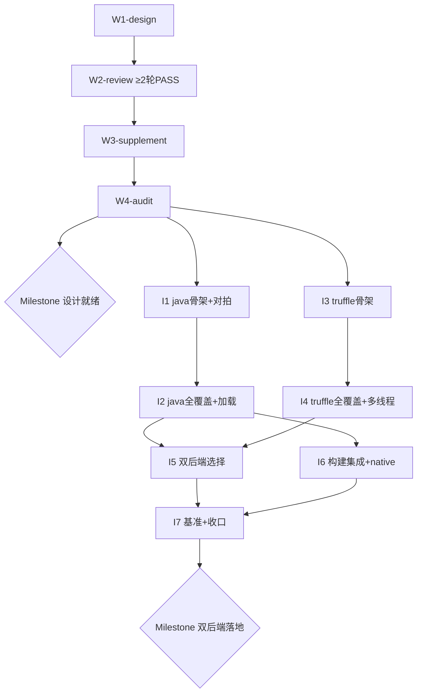

# XLang 优化执行双后端 Roadmap（nop-xlang-java + nop-xlang-truffle）

> Status: active
> Last updated: 2026-08-19（W2-review 完成：五轮独立子agent 审查至 PASS（0 P0/P1），gate 关闭，W3 解锁）
> Sources（设计阶段必读输入，实施前不得跳过）：
> - `ai-dev/design/xlang-truffle/01-truffle-knowledge.md`（Truffle 框架知识层，2026-08-16 三轮独立审查达成共识）
> - `ai-dev/analysis/2026-08/2026-08-16-truffle-graalvm-ecosystem-research.md`（GraalVM/Truffle 生态调研：native 内 guest 代码有运行时 JIT（25 默认）但宿主 Java 无 JIT，Truffle 只服务 JVM 部署形态；Espresso 支持 native exe 内动态加载字节码）
> - `~/sources/graal`（oracle/graal sparse clone：truffle + sdk 模块一手源码，SL 参考实现）
> - `nop-kernel/nop-xlang/src/main/java/io/nop/xlang/exec/`（现解释器：Executable 树 137 文件）

**Why**：XLang 目前为内存中解释执行（`IExecutableExpression.execute` 虚调用递归），在 GraalVM native image 中作为宿主 Java 代码 AOT 编译后**无运行时 JIT**（native 内的 Truffle 运行时 JIT 只服务 guest 语言代码，不作用于宿主 XLang 解释器），解释开销无法自我修复。可逆计算原则要求 Generator 优于 Interpreter。本 roadmap 落地双后端：
1. **nop-xlang-java**（新模块，建在 nop-kernel 下；编译期确定 → Java）：构建期把 Executable 树转译为 Java 源码（`_gen/`），运行期直接执行生成类，零解释开销；native image 场景唯一提速路线；
2. **nop-xlang-truffle**（新模块，建在 nop-kernel 下；运行时 → Truffle）：Executable 树翻译为 Truffle AST，GraalVM 部署下经 partial evaluation 获得 JIT，服务运行时动态编译的脚本/表达式；支持多线程（Context 池 + 共享 Engine + ContextPolicy.SHARED）。

两后端并存互补：**编译期可确定的资源走 Java 后端，运行时动态产生的走 Truffle 后端，两者都不适用时回退现解释器兜底**。正确性基准：同一 Executable 树在解释器/Java/Truffle 三后端执行结果必须一致（对拍）。

## Work Items

> **这是唯一动态状态块。状态只在这里更新。**
> 人工设定条目与顺序；AI 取第一个 `todo`，起草/执行计划，closure audit 通过后标 `done`。

### 阶段一：设计与计划 gate（用户指定流程，先于一切实现）

- W1-design. 三组设计文档撰写：`done`（plan：`ai-dev/plans/xlang-execution-optimization/2026-08-19-2050-1-w1-design-docs.md`，2026-08-19 closure audit CAN CLOSE，0 Blocker/0 Major；产出 5 篇正文 + 3 README，01 决策迁出收口、Open Questions 清账）
  - `ai-dev/design/xlang-execution/`：00-vision（双后端愿景）+ 01-architecture-baseline（双后端统一架构：后端选择机制"编译期确定→java / 运行时→truffle / 兜底→解释器"、后端注册 SPI、对拍验证框架、模块边界与依赖方向）
  - `ai-dev/design/xlang-java/`：README + architecture-baseline（Executable→Java 转译器、~137 节点类映射策略、SourceLocation 保真、生成类加载与 `ResourceComponentManager` 集成"生成类优先/解释器兜底"、`_gen/` 构建任务、EvalMethod 调用约定）
  - `ai-dev/design/xlang-truffle/`：00-vision + 02-architecture-baseline（truffle 模块设计：XLangLanguage/Context、帧/slot 映射、多线程架构 Context 池 + SHARED + 共享 Engine、两级内联缓存准则、与 nop-js Engine 共享评估）
  - 依赖：无（知识输入已就绪）。粒度约束：三组文档可拆多个 plan，但必须全部定稿才能进 W2
- W2-review. 设计文档独立审查 gate：`done`（plan：`ai-dev/plans/xlang-execution-optimization/2026-08-19-2050-2-w2-design-review-gate.md`，2026-08-19 五轮独立子agent 审查至 PASS） — 依赖：W1-design。**硬性要求：至少两轮独立子agent 审查（每轮新开子agent，不共享上下文），逐轮修复后复审，直到某轮 PASS（0 P0/P1）才可关闭；审查报告落 `ai-dev/audits/xlang-execution-optimization/`，roadmap 条目须回链两轮以上报告**。轮次报告：[round-1](../audits/xlang-execution-optimization/2026-08-19-design-review-round-1.md)（FAIL 2 P1→修复）、[round-2](../audits/xlang-execution-optimization/2026-08-19-design-review-round-2.md)（FAIL 1 P1→修复）、[round-3](../audits/xlang-execution-optimization/2026-08-19-design-review-round-3.md)（FAIL 1 P1→修复）、[round-4](../audits/xlang-execution-optimization/2026-08-19-design-review-round-4.md)（FAIL 2 P1→修复）、[round-5](../audits/xlang-execution-optimization/2026-08-19-design-review-round-5.md)（**PASS 0 P0/0 P1**，含移交 W3 清单 17 项）
- W3-supplement. 按定稿设计回填实现 work items：`planned`（plan：`ai-dev/plans/xlang-execution-optimization/2026-08-19-2050-3-w3-supplement-work-items.md`，已过独立 draft review） — 依赖：W2-review。修订本 roadmap 阶段二的 I1-I7（增删拆并、定稿验收标准与依赖），同步更新 `missions/xlang-execution-optimization.json` 的 commands（纳入新模块）；本项自身需 plan review 通过
- W4-audit. roadmap workitem 审核 gate：`todo` — 依赖：W3-supplement。独立 audit（openAuditPrompt）：粒度（单 plan 可完成，5-15 文件/200-500 行/1-4 phases）、依赖图无环且与 stage 表一致、验收标准可验证、复用标注准确、与定稿设计无冲突；FAIL 则回 W3
- ★ **Milestone: 设计与计划就绪**（W1-W4 全部 done，阶段二 work items 定稿并通过审核）：`todo` — 派生：W1-W4

### 阶段二：实现（预列占位，以 W3-supplement 定稿为准，不得在 W4 前启动）

- I1. nop-xlang-java 模块骨架 + 表达式子集转译器（字面量/标识符/算术/逻辑/比较/方法调用）+ 三后端对拍测试框架：`todo` — 依赖：W4-audit。占位，W3 定稿
- I2. nop-xlang-java 全节点覆盖（控制流/作用域/函数/宏产物全 137 节点类）+ 生成类加载集成（生成类优先、解释器兜底）：`todo` — 依赖：I1。占位，W3 定稿
- I3. nop-xlang-truffle 模块骨架（truffle-api + dsl-processor 依赖、XLangLanguage/XLangContext、ContextPolicy=SHARED）+ 帧/slot 映射 + 表达式子集翻译：`todo` — 依赖：W4-audit（可与 I1/I2 并行，顺序执行优先 I 系列编号序）。占位，W3 定稿
- I4. nop-xlang-truffle 全节点覆盖 + 多线程运行时（Context 池 + 共享 Engine + enter/leave 批求值 + 两级内联缓存）：`todo` — 依赖：I3。占位，W3 定稿
- I5. 双后端统一选择机制（编译期确定→java / 运行时→truffle / 默认→解释器；配置开关与降级路径；`ScriptCompilerRegistry` 式注册 SPI）：`todo` — 依赖：I2, I4。占位，W3 定稿
- I6. 构建集成（codegen/xgen 任务扫描 `_vfs/**/*.xpl|*.xlib|*.expr|*.xbiz` → 生成 `_gen/` 源码）+ native image 兼容验证（Java 后端生成类可进 image）+ docs-for-ai 同步：`todo` — 依赖：I2。占位，W3 定稿
- I7. 性能基准（解释器/Java/Truffle 三后端 bench，含 GraalVM 与 stock JVM 两形态）+ 收口全量回归 + 独立 closure audit：`todo` — 依赖：I5, I6。占位，W3 定稿
- ★ **Milestone: 双后端落地**（I1-I7 全部 done）：`todo` — 派生：I1-I7

## Status values

| Status | Meaning |
| --- | --- |
| `todo` | 未开始，无计划 |
| `planned` | 有计划，通过独立 draft review |
| `done` | 完成，通过独立 closure audit |

> Milestone 状态为派生：阶段一 = W1-W4 全部 done；阶段二 = I1-I7 全部 done。

## Framework / platform reuse

| Capability | Provider | Notes |
| --- | --- | --- |
| Executable 树编译前端 | `nop-xlang` `XplCompiler`/宏全展开/slot 分配（`LexicalScopeAnalysis`） | 两后端只做树→目标翻译，不改前端 |
| 模型缓存 | `ResourceComponentManager`（IResourceLoadingCache） | Java 后端"生成类优先/解释器兜底"加载挂点 |
| Java 源编译既有通路 | `nop-javac`（JdkJavaCompiler）+ `xlang/janino`（EvalMethod 约定先例） | 转译器调用约定与对拍参照 |
| GraalVM 配置生成 | `nop-codegen` `GraalvmConfigGenerator`/`nop-vfs-index.txt` | I6 native 兼容复用 |
| Truffle 知识与参考 | `ai-dev/design/xlang-truffle/01-truffle-knowledge.md` + `~/sources/graal` SL 实现 | W1 设计输入，不重新调研 |
| 脚本引擎注册先例 | `ScriptCompilerRegistry`（nop-xlang） | I5 后端注册 SPI 参照 |
| 依赖坐标 | `org.graalvm.truffle:truffle-api` + `truffle-dsl-processor` + `org.graalvm.polyglot:polyglot`（25.x） | I3 引入，版本钉 LTS 线 |

## Current baseline

**Already shipped:**
- 解释器执行链完整：`XplModelParser` → Executable 树 → `DefaultExpressionExecutor`/`EvalRuntime`，宏/标签全编译期展开
- `nop-js` 已验证 polyglot Context 嵌入模式（GraalJS）
- `nop-codegen` GraalVM 配置生成管线（reflect/proxy/vfs-index）

**Main gaps (blocking this roadmap):**
- 无 Executable→Java 转译后端（native image 下解释执行慢）
- 无 Truffle 后端（JVM 下运行时动态脚本无 JIT）
- 无多后端选择机制与三后端对拍框架

## Stages

| # | Stage | Owner plan | Deps | Critical path | Reuse |
| --- | --- | --- | --- | --- | --- |
| 1 | 双后端设计文档（execution/java/truffle 三组） | W1-design | — | **Yes** | 知识文档/SL 源码 |
| 2 | 设计独立审查（≥2 轮至 PASS） | W2-review | W1-design | **Yes** | ai-dev/skills 审查 prompt |
| 3 | 回填实现 work items + mission.json 更新 | W3-supplement | W2-review | **Yes** | — |
| 4 | roadmap workitem 审核 | W4-audit | W3-supplement | **Yes** | openAuditPrompt |
| ★ | 设计与计划就绪 | — | W1-W4 | — | — |
| 5 | nop-xlang-java 骨架 + 子集转译 + 对拍框架 | I1 | W4-audit | Yes | nop-javac/janino 约定 |
| 6 | nop-xlang-java 全覆盖 + 加载集成 | I2 | I1 | **Yes** | ResourceComponentManager |
| 7 | nop-xlang-truffle 骨架 + 帧映射 + 子集翻译 | I3 | W4-audit | Yes | SL 参考实现 |
| 8 | nop-xlang-truffle 全覆盖 + 多线程 | I4 | I3 | **Yes** | 知识文档 §4/§7 |
| 9 | 双后端选择机制 + 配置降级 | I5 | I2, I4 | **Yes** | ScriptCompilerRegistry |
| 10 | 构建集成 + native 兼容 + docs 同步 | I6 | I2 | Yes | GraalvmConfigGenerator |
| 11 | 性能基准 + 收口审计 | I7 | I5, I6 | Yes | — |
| ★ | 双后端落地 | — | I1-I7 | — | — |

## Dependency graph

## 审查与验证纪律（本 roadmap 特有约束）

1. **设计 gate 硬约束**：W2-review 不少于两轮独立子agent（无共享上下文），PASS（0 P0/P1）前不得进 W3；审查报告持久化到 `ai-dev/audits/xlang-execution-optimization/` 并在 W2 条目回链。
2. **阶段二冻结**：W4-audit done 前，任何 I 系列工作项不得起草 plan（预列项内容仅作范围预估）。
3. **对拍不变式**：每个 I 系列实现 plan 的验收必须包含"同一 Executable 树多后端执行结果一致"的对拍断言；回归不允许削弱现解释器测试。
4. **生成物纪律**：`_gen/` 与 `_` 前缀产物不可手改（AGENTS.md 硬规则）；Java 后端只生成源码与加载器，不绕过 codegen 管线。
5. **模块边界**：新模块依赖方向 `nop-xlang-java`/`nop-xlang-truffle` → `nop-xlang` → `nop-core`，禁止反向；Truffle 依赖只出现在 nop-xlang-truffle（不得泄漏进内核其他模块）。
