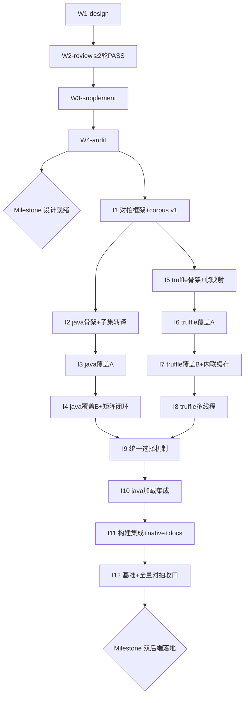

# XLang 优化执行双后端 Roadmap（nop-xlang-java + nop-xlang-truffle）

> Status: active
> Last updated: 2026-08-21（I4 执行完毕（三 Phase）+ 独立 fresh closure audit CAN CLOSE 标 done——java 覆盖 B 三族 33 类转译（含非根 CallFunc 局部函数调用形态 + `LocationFunction` 转译并入；两类改判排除，B 族 35→33 / EXCLUDED 16→18 / java 目标集 120）+ corpus 覆盖 B 对拍全绿（19 单元，含 `$out` 模板单元——I2 移交闭合）+ 覆盖矩阵闭环（java 侧全量 120 + pending 清零；truffle 侧锚点适配 87）；此前：I4/I7 plan 起草并通过三轮独立子agent 审查至共识（I4：round-3 确认 Blocker/Major 全修复，F1 roadmap 漂移当场修正；I7：round-3 无 Blocker/Major，roadmap 137 计数当场修正）；此前：I6 执行完毕 + 独立 closure audit CAN CLOSE 标 done——truffle 覆盖 A 五族 + 残余 59 类翻译 + Q3 残余路径 + kind 实测 + truffle 侧覆盖矩阵落地，corpus 覆盖 A 对拍全绿；此前：I3 执行完毕 + 独立 closure audit CAN CLOSE 标 done——A 五族 + 残余转译 + 共享 helper 增量 + corpus 覆盖 A 对拍全绿 + 覆盖矩阵机制落地；I3/I6 plan 起草并通过两轮独立子agent 审查至共识；I5 执行完毕 + 独立 closure audit CAN CLOSE 标 done——truffle 后端骨架 + 帧/slot 映射 + 子集翻译 + 翻译缓存落地，对拍 truffle 列激活）
> Sources（设计阶段必读输入，实施前不得跳过）：
> - `ai-dev/design/xlang-truffle/01-truffle-knowledge.md`（Truffle 框架知识层，2026-08-16 三轮独立审查达成共识）
> - `ai-dev/analysis/2026-08/2026-08-16-truffle-graalvm-ecosystem-research.md`（GraalVM/Truffle 生态调研：native 内 guest 代码有运行时 JIT（25 默认）但宿主 Java 无 JIT，Truffle 只服务 JVM 部署形态；Espresso 支持 native exe 内动态加载字节码）
> - `~/sources/graal`（oracle/graal sparse clone：truffle + sdk 模块一手源码，SL 参考实现）
> - `nop-kernel/nop-xlang/src/main/java/io/nop/xlang/exec/`（现解释器：Executable 树——W1 时点 137 文件，live 现为 138（I2 落 `XLangSemantics` 入包），矩阵基线以 live 扫描为准）

**Why**：XLang 目前为内存中解释执行（`IExecutableExpression.execute` 虚调用递归），在 GraalVM native image 中作为宿主 Java 代码 AOT 编译后**无运行时 JIT**（native 内的 Truffle 运行时 JIT 只服务 guest 语言代码，不作用于宿主 XLang 解释器），解释开销无法自我修复。可逆计算原则要求 Generator 优于 Interpreter。本 roadmap 落地双后端：
1. **nop-xlang-java**（新模块，建在 nop-kernel 下；编译期确定 → Java）：构建期把 Executable 树转译为 Java 源码（`_gen/`），运行期直接执行生成类，零解释开销；native image 场景唯一提速路线；
2. **nop-xlang-truffle**（新模块，建在 nop-kernel 下；运行时 → Truffle）：Executable 树翻译为 Truffle AST，GraalVM 部署下经 partial evaluation 获得 JIT，服务运行时动态编译的脚本/表达式；支持多线程（Context 池 + 共享 Engine + ContextPolicy.SHARED）。

两后端并存互补：**编译期可确定的资源走 Java 后端，运行时动态产生的走 Truffle 后端，两者都不适用时回退现解释器兜底**。正确性基准：同一 Executable 树在解释器/Java/Truffle 三后端执行结果必须一致（对拍）。

## Work Items

> **这是唯一动态状态块。状态只在这里更新。**
> 人工设定条目与顺序；AI 取第一个 `todo`，起草/执行计划，closure audit 通过后标 `done`。

### 阶段一：设计与计划 gate（用户指定流程，先于一切实现）

- W1-design. 三组设计文档撰写：`done`（plan：`ai-dev/plans/xlang-execution-optimization/2026-08-19-2050-1-w1-design-docs.md`，2026-08-19 closure audit CAN CLOSE，0 Blocker/0 Major；产出 5 篇正文 + 3 README，01 决策迁出收口、Open Questions 清账）
  - `ai-dev/design/xlang-execution/`：00-vision（双后端愿景）+ 01-architecture-baseline（双后端统一架构：后端选择机制"编译期确定→java / 运行时→truffle / 兜底→解释器"、后端注册 SPI、对拍验证框架、模块边界与依赖方向）
  - `ai-dev/design/xlang-java/`：README + architecture-baseline（Executable→Java 转译器、~137 节点类映射策略、SourceLocation 保真、生成类加载与 `ResourceComponentManager` 集成"生成类优先/解释器兜底"、`_gen/` 构建任务、EvalMethod 调用约定）
  - `ai-dev/design/xlang-truffle/`：00-vision + 02-architecture-baseline（truffle 模块设计：XLangLanguage/Context、帧/slot 映射、多线程架构 Context 池 + SHARED + 共享 Engine、两级内联缓存准则、与 nop-js Engine 共享评估）
  - 依赖：无（知识输入已就绪）。粒度约束：三组文档可拆多个 plan，但必须全部定稿才能进 W2
- W2-review. 设计文档独立审查 gate：`done`（plan：`ai-dev/plans/xlang-execution-optimization/2026-08-19-2050-2-w2-design-review-gate.md`，2026-08-19 五轮独立子agent 审查至 PASS） — 依赖：W1-design。**硬性要求：至少两轮独立子agent 审查（每轮新开子agent，不共享上下文），逐轮修复后复审，直到某轮 PASS（0 P0/P1）才可关闭；审查报告落 `ai-dev/audits/xlang-execution-optimization/`，roadmap 条目须回链两轮以上报告**。轮次报告：[round-1](../audits/xlang-execution-optimization/2026-08-19-design-review-round-1.md)（FAIL 2 P1→修复）、[round-2](../audits/xlang-execution-optimization/2026-08-19-design-review-round-2.md)（FAIL 1 P1→修复）、[round-3](../audits/xlang-execution-optimization/2026-08-19-design-review-round-3.md)（FAIL 1 P1→修复）、[round-4](../audits/xlang-execution-optimization/2026-08-19-design-review-round-4.md)（FAIL 2 P1→修复）、[round-5](../audits/xlang-execution-optimization/2026-08-19-design-review-round-5.md)（**PASS 0 P0/0 P1**，含移交 W3 清单 17 项）
- W3-supplement. 按定稿设计回填实现 work items：`done`（plan：`ai-dev/plans/xlang-execution-optimization/2026-08-19-2050-3-w3-supplement-work-items.md`，2026-08-19 独立 closure audit CAN CLOSE，0 Blocker/0 Major/3 Minor——Minor 均为 W4-audit 输入；裁定记录见 `ai-dev/logs/2026/08-19.md`） — 依赖：W2-review。修订本 roadmap 阶段二（原预列 I1-I7 增删拆并为 I1-I12，定稿验收标准与依赖，Stages 表/依赖图同步）。**commands 纳入新模块采用"模块落盘即切换"裁定**：Maven `-pl` 对尚不存在模块直接报错，提前写入会使 mission.json live commands 恒失败——目标 commands 与切换时机已写入 I2（落盘 `nop-xlang-java` 时切换）/I5（落盘 `nop-xlang-truffle` 时追加）/I12（汇总口径核验）条目验收标准，live commands 在落盘前保持仅引用已存在模块
- W4-audit. roadmap workitem 审核 gate：`done`（plan：`ai-dev/plans/xlang-execution-optimization/2026-08-19-2350-1-w4-roadmap-workitem-audit-gate.md`，2026-08-20 round-1 独立审计即 PASS + 独立 closure audit CAN CLOSE，0 Blocker/0 Major/0 Minor；W3 Closure 移交 3 项 Minor 逐项裁定非阻塞，裁定记录见 `ai-dev/logs/2026/08-20.md`） — 依赖：W3-supplement。独立 audit（openAuditPrompt）：粒度（单 plan 可完成，5-15 文件/200-500 行/1-4 phases）、依赖图无环且与 stage 表一致、验收标准可验证、复用标注准确、与定稿设计无冲突；FAIL 则回 W3。轮次报告：[round-1](../audits/xlang-execution-optimization/2026-08-20-roadmap-workitem-audit-round-1.md)（**PASS 0 P0/0 P1/4 P2**，独立 fresh session，五维度逐维度 PASS；W3 移交 3 项 Minor 逐项裁定非阻塞——I6 类别同构引用链完整可解析 / I3/I4/I6/I7/I8 复用信息由定稿口径块共享 helper 纪律 + Stages Reuse 列承载 / 编号映射表抽验 10 处覆盖全部行使分支且语义正确；遗留 4 项 P2 逐条裁定归属见报告 §八，移交后继清单见 §七）
- ★ **Milestone: 设计与计划就绪**（W1-W4 全部 done，阶段二 work items 定稿并通过审核）：`done` — 派生：W1-W4（2026-08-20 W4-audit done 后同步）

### 阶段二：实现（W3-supplement 已定稿：原预列 I1-I7 增删拆并为 I1-I12，逐项裁定与理由见 `ai-dev/logs/2026/08-19.md`；W4-audit done 前不得启动）

> **定稿口径（全条目适用）**
>
> - **对拍不变式（纪律 3）**：各条目验收中的"对拍"= [xlang-execution/01-architecture-baseline.md](../design/xlang-execution/01-architecture-baseline.md) §五口径——同一棵 Executable 树三层断言（返回值 equals 含类型 / 副作用 scope 变量与输出缓冲逐项比对 / 异常语义 错误码 + SourceLocation 回映射），列适用性（静态单元三列：解释器/java/truffle；动态单元两列：解释器/truffle），后端身份断言（java 列执行体=生成类实例、truffle 列=翻译 AST CallTarget——不断言身份的比对判无效），列缺席显式记录跳过（不算通过）；单元级降级判 FAIL 不判跳过
> - **覆盖矩阵**：以 live `nop-kernel/nop-xlang/src/main/java/io/nop/xlang/exec/` 为基线逐节点类断言 translator 注册（W1 时点 137 文件，live 现为 138——基线以 live 扫描为准，I3 落 `ExecNodeBaseline` 单一事实源）；新增节点类未注册即矩阵红灯；缺 translator 的树转译/翻译 fail-fast，禁止部分生成（设计 java §三 / truffle 02 §七同构策略）
> - **粒度**：条目按"单 plan 可完成（约 5-15 文件 / 200-500 行 / 1-4 phases 量级）"定稿——全覆盖条目按设计 java §三分类表切分为覆盖 A（数据与作用域族：作用域链访问/类型操作/对象集合构造访问/绑定守卫调试/slot 写族）与覆盖 B（函数闭包/控制流/输出节点生成族）两半；无欠粒度合并项
> - **共享 helper 纪律**：语义敏感操作（数值提升/宽松比较/属性反射等）生成代码与翻译 AST 统一调用定义在 `nop-xlang` 的共享 helper，禁止为后端重写语义等价实现（设计 java §三 / truffle 02 §七同一裁定）
> - **编号映射（W3 重排，解读设计文档旧引用用）**：原预列 I1-I7 → 定稿 I1-I12：旧 I1→I1+I2；旧 I2→I3+I4+I10；旧 I3→I5；旧 I4→I6+I7+I8；旧 I5→I9；旧 I6→I11；旧 I7→I12。W1/W2 定稿设计文档中的 I 系条目号引用仍为旧编号（设计文档冻结不改，finding 已移交），W4-audit 核对"与定稿设计无冲突"时按本映射解读

- I1. 三后端对拍验证框架 + corpus v1：`done`（plan：`ai-dev/plans/xlang-execution-optimization/2026-08-20-0030-1-i1-compare-harness-corpus-v1.md`，2026-08-20 执行完毕并独立 closure audit CAN CLOSE（task `ses_fe4ede786ffeuzX4oxTRiiXzli`，0 Blocker/0 Major/3 Minor 收口动作项当场处置）；落地：harness 于 nop-xlang 测试源码 `io.nop.xlang.compare` 包 + test-jar 发布、corpus v1 22 单元（6 类 × 双形态 + 组合双形态）解释器基线全绿、四类分歧注入自检红/绿可控、列缺席显式记录有测试；执行中三项裁定（CallFunc 程序入口包装/slot 类 let 载体/FunctionExecutable 族属宿主反射分派族）记 plan Phase 2 Execution note 供 I2/I5 对账） — 依赖：W4-audit
  - 范围：对拍 harness（后端作为用例执行参数矩阵化，复用 Nop AutoTest 机制；落点由实现 plan 按模块依赖方向合法性定）；表达式子集 corpus v1（静态资源样例 + 动态字符串样例配比构成，配比落 plan）；测试级强制路由 API 与后端身份断言；列适用性与"列缺席显式记录"机制；差异注入自检
  - 验收：对拍不变式断言机制落地（三层断言/身份断言/列适用性）并以差异注入自检证明（故意构造分歧用例 → harness 判 FAIL，红/绿可控）；corpus v1 解释器基线列全绿；列缺席记录机制有测试（java/truffle 列缺席时显式记跳过、不算通过）
  - 复用：Nop AutoTest 机制
- I2. nop-xlang-java 模块骨架 + 表达式子集转译 + 共享语义 helper 基座 + 对拍 java 列激活：`done`（plan：`ai-dev/plans/xlang-execution-optimization/2026-08-20-0030-2-i2-java-backend-skeleton.md`，2026-08-20 执行完毕并独立 closure audit CAN CLOSE（task `ses_fe4c3e210ffexDxW6Ji3fpPwTa`，0 Blocker）；落地：`nop-kernel/nop-xlang-java` 模块（转译器 `ExecToJavaTranslator` + 生成约定 `EvalMethodConvention`/`GeneratedEvalBinding`）、共享 helper 基座 `io.nop.xlang.exec.XLangSemantics`（解释器五节点类收口改调，498 回归与基线一致）、corpus v1 静态单元 java 列 vs 解释器列对拍全绿（22/22，强身份断言=确定性派生生成类实例）、mission.json commands 四条切换 live 可运行；包装器契约定稿（`$out` 第二隐参）责任链 I4 记账；执行中裁定：java 列测试域执行通路=nop-javac 内存编译（设计文本缺口记 log 供修订）、FunctionExecutable 系生成代码经同一 `EvalGlobalRegistry` 运行时解析、共享分派 handle 按 funcName 分立防类级缓存跨名污染） — 依赖：I1
  - 范围：新模块 `nop-xlang-java` 落盘（`nop-kernel` 下，pom/包结构骨架）；表达式子集（字面量/slot 标识符/算术/逻辑/比较/简单方法调用）树→Java 源码转译；共享语义 helper 基座（数值提升/宽松比较等，定义在 nop-xlang，解释器同步改用——行为不变由既有测试保证）；EvalMethod 调用约定（static + 首参 `IEvalScope $scope`，纯表达式单元经 `EvalMethodInvoker` 包装）；模板入口包装器契约定稿（xpl/xlib 追加 `IEvalOutput $out` 隐参，设计 java §七）；SourceLocation 静态常量内嵌
  - 验收：表达式 corpus java 列 vs 解释器列对拍全绿（含 java 列身份断言=生成类实例）；解释器改用共享 helper 后 nop-xlang 既有测试全绿；生成源码含 SourceLocation 静态常量（异常语义断言可执行）；mission.json commands 在模块落盘的同一次变更中切换为含 `:nop-xlang-java` 的口径（如 `./mvnw test -pl :nop-xlang,:nop-xlang-java -am -T 1C`，build/lint/typecheck 同步）——"模块落盘即切换"裁定，见 W3-supplement 条目备注
  - 复用：janino `EvalMethod` 先例（`JaninoScriptCompiler`/`EvalMethodInvoker`）；`nop-javac` 仅可选诊断性编译校验（不承担产物编译）
- I3. java 转译覆盖 A（数据与作用域族）：`done`（plan：`ai-dev/plans/xlang-execution-optimization/2026-08-20-0610-1-i3-java-translate-coverage-a.md`，2026-08-20 执行完毕（三 Phase）并独立 fresh closure audit CAN CLOSE（task `ses_fe312a5ddffeVNdliAXMZZ6EwH`，0 Blocker/0 Major/2 Minor 文档漂移收口时当场修复）；落地：A 五族 + 并入残余 59 类转译 + 共享 helper 增量（`XLangSemantics` +33 方法族，解释器 ~25 节点类同步改调，87 类支持集可编程枚举）；corpus 覆盖 A（`CorpusCoverageA` 20 静态 + 13 动态单元，五族静态 ≥1 + 异常单元 2）解释器基线全绿 + **java 列 vs 解释器列对拍全绿（`TestCorpusCoverageAJavaColumn` 33/33，三层断言 + 身份断言=生成类实例）——验收第一项**；**覆盖矩阵落地（`TestExecTranslationCoverageMatrix` 124 用例：支持集 ↔ `ExecNodeBaseline.registeredTarget()` 双向一致 + 87 类逐类最小实例真实转译（非清单自证）+ B 族 35 类 pending fail-fast + 红灯注入 FutureExecutable 红/绿对照）——验收第二项**；live exec/ 138 文件四分区 = A 族 44 + 并入残余 15 + I2 已落 28 + B 族 35 + 排除 16（`ExecNodeBaseline` 单一事实源 + `TestExecNodeBaselineFreshness` 新鲜度红灯，test-jar 供 I6 同基线消费）；执行中 3 处 live 缺陷 scope 内修复（typeof null NPE / 对象解构 rest 收集误放整 map，附 bug note；`genDebug` 生成代码误引 FQN——由对拍机制发现，语料回归覆盖）；nop-xlang 506/0/2 + nop-xlang-java 228/0/0 全绿。**归属裁定定稿（Phase 1，repo-observable：plan Execution Notes + `io.nop.xlang.compare.ExecNodeBaseline` 四分区单一事实源 + `TestExecNodeBaselineFreshness` 红灯）**：边缘裁定 `VarStatusExecutable`/`DebugIdentifierExecutable` 归 A 合成树覆盖、`LocationFunction`/`ReturnScopeValuesExecutable`/`ExecutableFunctionEvalAction` + 函数邻接 7 类归 B；产生路径盘点：Reference 族/InitRef/EnhanceRef/BindVar/Cast/Getter 族/Setter/MakeProperty/VarStatus/DebugIdentifier/GuardNotEmpty/CloneLiteral/Between/Assert/Range 合成树覆盖（不可经表达式出口产生），corpus 可产生清单见 plan Phase 1 note） — 依赖：I2
  - 范围：作用域链访问/类型操作/对象集合构造访问/绑定守卫调试/slot 写族 + 并入残余（类别划分=设计 java §三分类表 + `ExecNodeBaseline` 代码化分区）
  - 验收：对应类别 corpus 扩充后 java 列 vs 解释器列对拍全绿；覆盖矩阵推进（类别内 exec/ 基线节点类逐一注册）
- I4. java 转译覆盖 B（函数闭包/控制流/输出节点生成族）+ 覆盖矩阵闭环：`done`（plan：`ai-dev/plans/xlang-execution-optimization/2026-08-20-1150-1-i4-java-translate-coverage-b.md`，2026-08-20/21 执行完毕（三 Phase）并独立 fresh closure audit CAN CLOSE（task `ses_fdff23ea7ffeN3POIvcB21hN32`，0 Blocker/0 Major/2 Minor 收口时处置）；落地：**Phase 1** 产生路径盘点 + 边缘类裁定（`LocationFunction` 转译并入、`ReturnScopeValuesExecutable`/`ExecutableFunctionEvalAction` 改判排除——B 族 35→33、EXCLUDED 16→18、java 目标集 = 138-16-2 = 120）+ per-backend 基线口径（`javaTargetSet()`/`truffleRegisteredTarget()` 双 accessor，truffle 侧矩阵锚点行为中性适配）+ 函数载荷下降私有方法 / 换缓冲共享 helper + 生成体回调 / `$out` 双参入口 / cell 契约四项形态裁定（plan Execution Notes §1-9）；**Phase 2** B 三族 33 类逐类转译 + 共享 helper 增量（`XLangSemantics` collectText/collectJson/collectNode/collectSql/genXjson/genNode 换缓冲族 + `GeneratedEvalFunction` 适配器，解释器对应节点同步改调）+ java 侧矩阵锚点切换（与注册收口同次变更，无中期红灯窗口）+ 转译级单测（每族真实转译 + fail-fast 反证 + cell 行为级 + ExitMode 边界 4 例）；**Phase 3** corpus 覆盖 B（19 单元：`static-b/` 模板 8 + 函数/闭包静态 4（含局部函数声明+调用形态）+ 控制流 5 + 动态 2（缺席显式记录），异常单元与 `$out` 输出序列单元在册）**java 列 vs 解释器列对拍全绿（`TestCorpusCoverageBJavaColumn` 19/19，三层断言 + 身份断言=生成类实例 + 模板单元输出缓冲副作用比对——验收第一项**，I2 `$out` 移交闭合）；**覆盖矩阵闭环（`TestExecTranslationCoverageMatrix` 122 用例：支持集 ↔ `javaTargetSet()`(120) 双向 set 相等 + 逐类最小实例真实转译（非清单自证）+ pending 清零断言 + `FutureExecutable` 红灯注入 + 证据形态裁定类专门断言（GenNodeAttr 宿主载体/LazyCompiled 空载荷/FunctionalAdapter fail-fast）+ 改判排除两类 fail-fast 反证——验收第二项**；truffle 侧矩阵锚点适配后 122 用例全绿复验；三模块全绿 nop-xlang 514 + nop-xlang-java 263 + nop-xlang-truffle 382 = 1159/0/0；`GenNodeExecutable.visit` tagNameExpr==null NPE 存量缺陷 scope 内修复（null guard）） — 依赖：I3
  - 范围：函数/闭包（含可变 slot 闭包捕获 cell 契约，设计 java §三；函数载荷处置与非根 CallFunc 形态裁定）；控制流（ExitMode 传播边界不变式：不跨函数/闭包边界传播，语句位置一一对应）；输出/节点生成族（`$out` API 调用序列 + Gen*/Collect* 换缓冲形态裁定）；I2 移交的 `$out` 契约执行路径验证闭合
  - 验收：全类别 corpus java 列 vs 解释器列对拍全绿；覆盖矩阵全绿（exec/ live 基线逐节点类注册断言，新增节点类红灯）
- I5. nop-xlang-truffle 模块骨架 + 帧/slot 映射 + 表达式子集翻译 + 翻译缓存：`done`（plan：`ai-dev/plans/xlang-execution-optimization/2026-08-20-0030-3-i5-truffle-backend-skeleton.md`，2026-08-20 执行完毕并独立 fresh closure audit CAN CLOSE（0 Blocker）；落地：`nop-kernel/nop-xlang-truffle` 模块（truffle 三坐标 25.2.4 钉线 + dsl-processor annotationProcessorPaths）、`XLangLanguage`（id `xl`、EXCLUSIVE 过渡形态=编译期常量注册，SHARED 切换归 I8）/`XLangContext`（求值窗口协议，输出缓冲线程绑定）、帧/slot 映射（`LexicalScopeAnalysis` slot 布局 → FrameDescriptor/FrameSlot，kind 仅可推断处标注不虚构）、表达式子集翻译器（子集外 fail-fast 报节点类名+SourceLocation；语义敏感操作走 `XLangSemantics` 共享 helper）、翻译缓存（键=sourceKey+树指纹，动态源=源内容哈希键）；corpus v1 表达式单元 truffle 列 vs 解释器列对拍全绿（22/22，三层断言+身份断言=翻译 AST 经 CallTarget 执行）；不泄漏断言通过（nop-kernel 域内 org.graalvm.truffle/polyglot 依赖仅本模块 pom）；mission.json commands 四条已追加 `:nop-xlang-truffle` 且 live 可运行；plan 委托决策 D1/D2/D3 定稿闭合；执行中发现的 guest null 语义缺陷已 scope 内修复（COMPLETION_MARKER 交接）） — 依赖：I1（可与 I2-I4 并行）
  - 范围：新模块 `nop-xlang-truffle` 落盘（`nop-kernel` 下；truffle-api/dsl-processor/polyglot 25.x LTS 钉版引入 + 常规冒烟复核——Q5 确认点已关闭，设计 truffle 02 §二）；XLangLanguage（id `xl`、`ContextPolicy=SHARED` 终态注册；EXCLUSIVE 过渡形态=翻译正确性对拍保守载体，两形态各自是验证载体）；XLangContext（输出缓冲线程绑定）；帧/slot 映射（`LexicalScopeAnalysis` slot 布局 → FrameDescriptor/FrameSlot，kind 标注仅限可推断类型、不虚构）；表达式子集翻译（与 I2 同子集）；翻译缓存（键=resourcePath+树指纹；无 resourcePath 动态源缓存形态由 plan 定稿，设计 truffle 02 §七）
  - 验收：表达式 corpus truffle 列 vs 解释器列对拍全绿（允许 EXCLUSIVE 过渡形态；含 truffle 列身份断言=翻译 AST 经 CallTarget 执行）；org.graalvm.* 依赖仅出现在本模块 pom（不泄漏断言）；mission.json commands 在模块落盘的同一次变更中追加 `:nop-xlang-truffle`（模块落盘即切换，同 W3-supplement 裁定）
  - 复用：SL 参考实现（`~/sources/graal`）；`LexicalScopeAnalysis`
- I6. truffle 翻译覆盖 A（数据与作用域族，类别同 I3）：`done`（plan：`ai-dev/plans/xlang-execution-optimization/2026-08-20-0610-2-i6-truffle-translate-coverage-a.md`，2026-08-20 执行完毕（三 Phase）并独立 fresh closure audit CAN CLOSE（task `ses_fe2cdadf1ffe80jMKndZ543MTp` / marker `ses_audit_i6_truffle_0820_Kx7qN4vZ`，0 Blocker/3 Advisory 数字漂移当场修正）；落地：A 五族 + 并入残余 59 类翻译（新翻译节点 47 类 + 绑定辅助 1，支持集可编程枚举 87 类，共享 helper 零提取——I3 已提取集合无缺口、nop-xlang 主代码零变更）；**corpus 覆盖 A truffle 列 vs 解释器列对拍全绿（`TestCorpusCoverageATruffleColumn` 33/33，三层断言 + 身份断言 = 翻译 AST 经 CallTarget 执行）——验收第一项**；**truffle 侧覆盖矩阵落地（`TestTruffleCoverageMatrix` 124 用例：支持集 ↔ `ExecNodeBaseline.registeredTarget()` 同一实体双向一致 + 87 类逐类最小实例真实翻译 + B 族 35 类 pending fail-fast + `FutureExecutable` 红灯注入红/绿对照）——验收第二项**；I5 移交两项闭合（kind 全量覆盖率实测：corpus v1 4 slots 全推断 + corpus A 13 slots 推断 0 原因五分类 NON_LITERAL_WRITE 11/MIXED_FAMILY 2，`[truffle-frame-stats]` 逐单元可复跑；Q3 残余路径：scope 查找节点 5 类经 `XLangContext.requireEvalScope()` 存取、slot 化优先两分支真实语料覆盖 slot 访问 41 vs scope 查找 21，`[truffle-q3-stats]` 逐单元可复跑）；树指纹载荷白名单全量覆盖 + 可翻译-未白名单 fail-fast 守卫 + 87 类 payload/subtree 双变体逐类测试（158 用例，防缓存串用硬验收）；fallback 未触发（I3 已 completed，正常路径直接消费，Phase 1 Execution Notes 裁定在案）；三模块全绿 nop-xlang 506/0/2（零变更）/ nop-xlang-java 228/0/0（零变更）/ nop-xlang-truffle 384/0/0） — 依赖：I5
  - 验收：对应类别 corpus truffle 列 vs 解释器列对拍全绿；覆盖矩阵推进（与 java 侧同基线同口径）
- I7. truffle 翻译覆盖 B（函数闭包/控制流/输出族，类别同 I4）+ 两级内联缓存 + 覆盖矩阵闭环：`planned`（plan：`ai-dev/plans/xlang-execution-optimization/2026-08-20-1150-2-i7-truffle-translate-coverage-b.md`，2026-08-20 起草并通过三轮独立子agent 审查至共识——round-3 无 Blocker/Major：既有调用节点缓存回填不可空洞满足（可观测缓存状态接线证据）、闭包形态按 live 拷贝机制真裁定（两拷贝时序载体语料）、输出换缓冲 truffle 侧决策项、fallback 机制对齐 I6 先例含 nop-xlang 测试源码 Targets；与 I4 接口（corpus 供给/per-backend 口径/清零点全集/对称 fallback）逐项自洽） — 依赖：I6
  - 范围：ExitMode→控制流异常族（SL 模式三值一一对应；载体选型含 Try catch 交互裁定）；两级内联缓存（一级 CallTarget 身份/二级直达调用形态；禁止函数实例身份与任何运行时值身份缓存，设计 truffle 02 §六；适用面含既有函数调用节点回填）；语义敏感操作 generic/fallback 走共享 helper；闭包捕获形态裁定（物化 vs live 同构值拷贝）与输出换缓冲形态裁定
  - 验收：全类别 corpus truffle 列 vs 解释器列对拍全绿；覆盖矩阵全绿（exec/ live 基线逐节点类，同 I4 口径——truffle 目标集收敛到 per-backend 全量）
- I8. truffle 多线程运行时（Context 池 + 共享 Engine + SHARED 形态）：`todo` — 依赖：I7
  - 范围：池租借协议（租借注入输出缓冲/全局作用域句柄、归还前清空；context 内状态只在 enter()..leave() 窗口有效，设计 truffle 02 §五）；共享 Engine 单例 + enter/leave 批求值（可重入）；SHARED 形态并发正确性验证载体；翻译缓存淘汰（容量上限/LRU）；单元级翻译失败记观测事件（衔接 I9 决策树动态路径第三分支）
  - 验收：SHARED 形态并发对拍——多线程经池并发求值同一/不同编译单元，结果与单线程解释器求值一致 + 无跨 Context 串值断言（输出缓冲/作用域隔离）全绿；池租借协议有正/负测试（归还后残留状态检测）
- I9. 统一后端选择机制（注册 SPI + 决策树 + 配置开关 + 降级观测）：`todo` — 依赖：I4, I8
  - 范围：后端注册 SPI（显式注册表，`ScriptCompilerRegistry`/`@GlobalInstance` 先例；条目=能力集/可用性状态/不可用原因；不做 classpath 扫描）；统一决策树（静态路径=扫描清单成员资格；动态路径含单元级翻译失败第三分支；单跳降级 java→解释器、truffle→解释器）；配置开关（java/truffle 各自 enable + 强制解释器诊断模式；不设"全局默认后端"）；降级观测（WARN+指标+注册表不可用条目；日志/指标命名契约落 docs-for-ai）；动态编译出口清单化核验（`ExpressionExecutor` 系"运行时字符串→Executable 树"出口统一回调注册表裁决，禁止各入口自带后端 if/else）
  - 验收（对拍引用口径）：路由场景矩阵（静态→java / 动态→truffle / 各降级→解释器 / 单元级降级判 FAIL）逐场景断言后端身份 + 执行结果一致性——**以 I1 对拍框架运行结果为验收输入**（显式引用关系：场景用例经框架执行与断言，非独立重写比对）
  - 复用：`ScriptCompilerRegistry`
- I10. java 生成类加载集成（绑定决策树 + RCM 缓存）：`todo` — 依赖：I9
  - 范围：统一决策树静态路径 java 侧落地（设计 java §五）：扫描清单成员资格判定 + 生成类清单树指纹一致性校验（施加对象=Executable 树指纹，防 stale、Delta 变更不漏检）+ 生成类优先/解释器兜底 + 绑定结果随 `ComponentCacheEntry` 缓存 + 降级观测事件分级（stale 缺陷 vs 租户差异化树预期稳态降级）
  - 验收：绑定路由对拍——静态单元经绑定后 java 列 vs 解释器列一致 + 身份断言；指纹失配/清单缺失降级解释器 + 观测事件断言；清单外资源走动态路径不记降级事件断言（测试以转译器 API 合成双清单产物，生产管线产物归 I11）
  - 复用：`ResourceComponentManager`/`IResourceLoadingCache`
- I11. 构建集成 + native image 兼容 + docs-for-ai 同步：`todo` — 依赖：I10
  - 范围：codegen/xgen 任务注册（扫描口径：`_vfs/**/*.xpl`/`*.xlib` 确定；其余 `_vfs` XDSL 类型按 live 清点定稿并显式记录纳入/排除及理由——xtask/xgen/xrun、嵌入 xpl 片段等，不引入 live 不存在类型）；双清单分离产物（构建期扫描清单 should-set + 生成类清单 resourcePath→类名+树指纹；格式与存放路径由 plan 定稿）；任务经与运行时相同编译前端取树、重生成幂等、不绕过 codegen 管线；native image 兼容（`GraalvmConfigGenerator` 管线复用 + 生成类直编镜像验证）；truffle 模块镜像排除机制（profile/classifier）；docs-for-ai 新模块开发指南同步
  - 验收：端到端对拍——真实 `_vfs` 静态资源经任务扫描→转译→常规编译→加载绑定后 java 列 vs 解释器列全量一致 + 身份断言；构建管线漏跑可观测断言（java 后端启用但扫描清单缺失→注册不可用条目 + 全局 WARN）；重生成幂等断言
  - 复用：codegen/xgen 任务体系；`GraalvmConfigGenerator`/`nop-vfs-index.txt`
- I12. 性能基准 + 全量三后端对拍收口 + 独立 closure audit：`todo` — 依赖：I11（传递覆盖 I1-I10 全链）
  - 范围：三后端基准（解释器/java/truffle × GraalVM 与 stock JVM 两形态；Context 池创建/销毁成本与池大小调优实测；静态资源 JVM 形态生成物缺失不借道 truffle 的机会成本量化；Q1/Q4 watch-only 重评估触发口径量化定义）；mission.json commands 汇总口径核验
  - 验收：全量三后端对拍套件**直接运行**全绿（解释器/java/truffle 三列全 corpus、静态/动态列适用性、后端身份断言——不得以引用形式弱化）；基准数据落 repo（报告 + 可复跑入口）
  - 复用：`nop-benchmark/nop-benchmark-xpl`（JMH 既有先例）
- ★ **Milestone: 双后端落地**（I1-I12 全部 done）：`todo` — 派生：I1-I12

## Status values

| Status | Meaning |
| --- | --- |
| `todo` | 未开始，无计划 |
| `planned` | 有计划，通过独立 draft review |
| `done` | 完成，通过独立 closure audit |

> Milestone 状态为派生：阶段一 = W1-W4 全部 done；阶段二 = I1-I12 全部 done。

## Framework / platform reuse

| Capability | Provider | Notes |
| --- | --- | --- |
| Executable 树编译前端 | `nop-xlang` `XplCompiler`/宏全展开/slot 分配（`LexicalScopeAnalysis`） | 两后端只做树→目标翻译，不改前端 |
| 模型缓存 | `ResourceComponentManager`（IResourceLoadingCache） | Java 后端"生成类优先/解释器兜底"加载挂点 |
| Java 源编译既有通路 | `nop-javac`（JdkJavaCompiler）+ `xlang/janino`（EvalMethod 约定先例） | 转译器调用约定与对拍参照 |
| GraalVM 配置生成 | `nop-codegen` `GraalvmConfigGenerator`/`nop-vfs-index.txt` | I11 native 兼容复用 |
| Truffle 知识与参考 | `ai-dev/design/xlang-truffle/01-truffle-knowledge.md` + `~/sources/graal` SL 实现 | W1 设计输入，不重新调研 |
| 脚本引擎注册先例 | `ScriptCompilerRegistry`（nop-xlang） | I9 后端注册 SPI 参照 |
| 依赖坐标 | `org.graalvm.truffle:truffle-api` + `truffle-dsl-processor` + `org.graalvm.polyglot:polyglot`（25.x） | I5 引入，版本钉 LTS 线 |

## Current baseline

**Already shipped:**
- 解释器执行链完整：`XplModelParser` → Executable 树 → `DefaultExpressionExecutor`/`EvalRuntime`，宏/标签全编译期展开
- `nop-js` 已验证 polyglot Context 嵌入模式（GraalJS）
- `nop-codegen` GraalVM 配置生成管线（reflect/proxy/vfs-index）

**Main gaps (blocking this roadmap):**
- 无 Executable→Java 转译后端（native image 下解释执行慢）
- 无 Truffle 后端（JVM 下运行时动态脚本无 JIT）
- 无多后端选择机制与三后端对拍框架

## Stages

| # | Stage | Owner plan | Deps | Critical path | Reuse |
| --- | --- | --- | --- | --- | --- |
| 1 | 双后端设计文档（execution/java/truffle 三组） | W1-design | — | **Yes** | 知识文档/SL 源码 |
| 2 | 设计独立审查（≥2 轮至 PASS） | W2-review | W1-design | **Yes** | ai-dev/skills 审查 prompt |
| 3 | 回填实现 work items + mission.json 更新 | W3-supplement | W2-review | **Yes** | — |
| 4 | roadmap workitem 审核 | W4-audit | W3-supplement | **Yes** | openAuditPrompt |
| ★ | 设计与计划就绪 | — | W1-W4 | — | — |
| 5 | 三后端对拍验证框架 + corpus v1 | I1 | W4-audit | **Yes** | Nop AutoTest |
| 6 | nop-xlang-java 骨架 + 子集转译 + 共享 helper 基座 | I2 | I1 | Yes | janino EvalMethod 先例 |
| 7 | java 转译覆盖 A（数据与作用域族） | I3 | I2 | Yes | 共享 helper |
| 8 | java 转译覆盖 B（函数/控制流/输出族）+ 覆盖矩阵闭环 | I4 | I3 | Yes | — |
| 9 | nop-xlang-truffle 骨架 + 帧映射 + 子集翻译 + 翻译缓存 | I5 | I1 | **Yes** | SL 参考实现/LexicalScopeAnalysis |
| 10 | truffle 翻译覆盖 A（类别同 I3） | I6 | I5 | **Yes** | — |
| 11 | truffle 翻译覆盖 B + 两级内联缓存 + 覆盖矩阵闭环 | I7 | I6 | **Yes** | 共享 helper |
| 12 | truffle 多线程运行时（Context 池 + SHARED） | I8 | I7 | **Yes** | 知识文档 §五 |
| 13 | 统一后端选择机制（SPI + 决策树 + 降级观测） | I9 | I4, I8 | **Yes** | ScriptCompilerRegistry |
| 14 | java 生成类加载集成（绑定决策树 + RCM 缓存） | I10 | I9 | **Yes** | ResourceComponentManager |
| 15 | 构建集成 + native 兼容 + docs 同步 | I11 | I10 | **Yes** | GraalvmConfigGenerator |
| 16 | 性能基准 + 全量三后端对拍收口 + 独立 closure audit | I12 | I11 | **Yes** | nop-benchmark-xpl（JMH） |
| ★ | 双后端落地 | — | I1-I12 | — | — |

## Dependency graph

## 审查与验证纪律（本 roadmap 特有约束）

1. **设计 gate 硬约束**：W2-review 不少于两轮独立子agent（无共享上下文），PASS（0 P0/P1）前不得进 W3；审查报告持久化到 `ai-dev/audits/xlang-execution-optimization/` 并在 W2 条目回链。
2. **阶段二冻结**：W4-audit done 前，任何 I 系列工作项不得起草 plan（阶段二条目已由 W3-supplement 定稿；解冻点仍是 W4-audit done）。**解冻点已达成（2026-08-20 W4-audit done），I 系列可起草 plan。**
3. **对拍不变式**：每个 I 系列实现 plan 的验收必须包含"同一 Executable 树多后端执行结果一致"的对拍断言；回归不允许削弱现解释器测试。
4. **生成物纪律**：`_gen/` 与 `_` 前缀产物不可手改（AGENTS.md 硬规则）；Java 后端只生成源码与加载器，不绕过 codegen 管线。
5. **模块边界**：新模块依赖方向 `nop-xlang-java`/`nop-xlang-truffle` → `nop-xlang` → `nop-core`，禁止反向；`nop-xlang-java` → `nop-javac` 仅限构建期可选诊断性编译校验边（设计 execution 01 §二虚线边，非运行时依赖）；Truffle 依赖只出现在 nop-xlang-truffle（不得泄漏进内核其他模块）。
