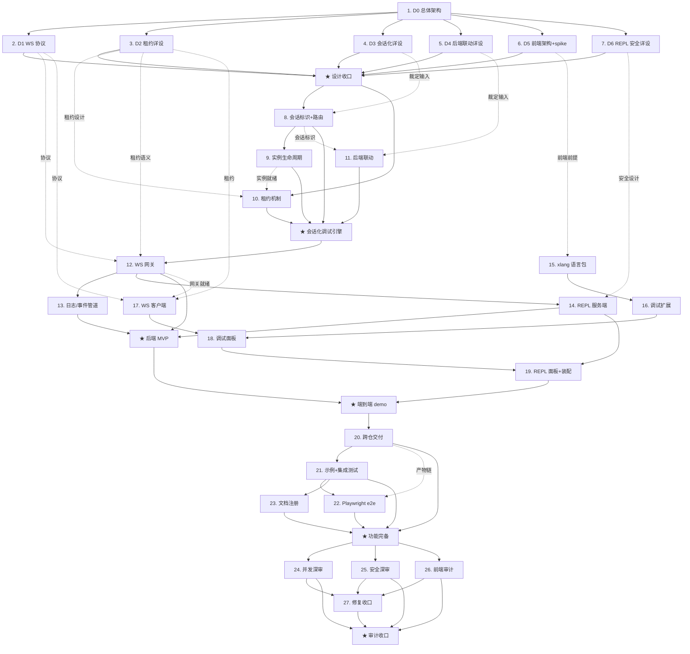

# XLang 在线开发调试编辑器 Roadmap — nop-entropy × nop-chaos-flux

> Last updated: 2026-09-26（R2：吸收两轮独立审查发现）
> Sources: `ai-dev/analysis/2026-09/2026-09-26-magic-api-online-debug-analysis.md`（primary，含 §6 三条用户裁定）、
> `ai-dev/audits/check/dev-tools.md`（调试器模块既有审计基线）、
> `ai-dev/design/xlang-truffle/00-vision.md`（一期不做 debugger 的边界，本 roadmap 为其后续）

## Purpose

本 roadmap 追踪"XLang 在线开发调试编辑器"的完整实现：后端（nop-entropy）把现有 `XLangDebugger` 引擎会话化并通过 WebSocket 暴露，前端（nop-chaos-flux）在 `flux-code-editor`（CodeMirror 6）上增加 XLang 语言支持、断点调试与 REPL 面板，并打通 flux 产物进入 nop-entropy 的跨仓交付链，最终形成浏览器端可用的 XLang 在线开发调试能力。

关键用户裁定（详见 analysis §6，作为本 roadmap 的硬约束）：
1. 前端基座 = nop-chaos-flux 现有 code editor，在其上改进，不引入 Monaco；
2. 挂起超时 = 前端租约续期（lease + renewal），前端关闭后后端不得永久阻塞；
3. 多用户并发 = 每用户独立 debugger 实例（会话隔离）。

范围边界："开发"侧仅覆盖**编辑器内编写 + 编译诊断 + REPL 即时执行**；XDSL 资源的保存/热发布/生产测试运行（magic-api 的"在线开发"另外半边）不在本 roadmap 范围，留 follow-up。

Does not contain implementation details. Each `planned` stage is owned by its execution plan.

**双仓归属**：owner 仓库 = 主要交付物所在仓；任何涉双仓的 plan 必须在 plan 内显式声明目标仓库与验证命令。Wave 0-2、5 的 owner 是 nop-entropy；Wave 3 的 owner 是 nop-chaos-flux；Wave 4 owner 是 nop-entropy，但 item 20/22 的主要工作面在 flux 侧与产物链。

## Work Items

> **This is the only dynamic state block. Update status only here.**
> The roadmap is a human-AI alignment artifact: humans set items and their order;
> AI takes the first `todo` item, drafts/executes plans, and writes the item back
> to `done` when closure audit passes. No skipping.

### Wave 0: 设计细化（设计文档全部落 nop-entropy ai-dev/design/xlang-web-debugger/，D5 的 spike POC 代码可在 flux 侧）

- 1. D0 总体架构与协议总纲（组件/时序、与 SimpleRpcServer/IDEA 共存、WS 传输容器裁定、集群转发与多人协作范围裁定）: `todo`
- 2. D1 WebSocket 调试协议详设（JSON envelope、消息集、版本化、鉴权握手、受控扩展事件登记）: `todo`
- 3. D2 租约续期与生命周期详设（TTL/renew/断连宽限/多标签页归属、release 双语义状态机）: `todo`
- 4. D3 调试器会话化详设（方案 A/B 裁定、会话标识透传、多线程单步目标策略、IDEA 兼容）: `todo`
- 5. D4 调试模式与执行后端联动详设（两条绕过路径的消除策略、配置联动矩阵）: `todo`
- 6. D5 前端架构设计 + 语法方案 spike（扩展点、包结构、Lezer 构建链评估、grammar 三来源 POC 裁定）: `todo`
- 7. D6 在线 eval REPL 与安全边界详设（沙箱、取消机制三选一、权限、审计日志）: `todo`

★ **Milestone: 设计收口**（unlocks when 1-7 done）: `todo`

### Wave 1: 后端引擎会话化（nop-entropy）

- 8. 会话标识注入 + executor 会话路由（按 D3 裁定落地）: `todo`
- 9. 每会话 debugger 实例生命周期 + IDEA 默认会话兼容 + 并发回归: `todo`
- 10. 租约续期机制（per-thread TTL、release 双语义、到期/异常事件扩展，含时序测试）: `todo`
- 11. 调试模式执行后端联动（按 D4：两条绕过路径消除或降级，含回归）: `todo`

★ **Milestone: 会话化调试引擎**（unlocks when 8-11 done）: `todo`

### Wave 2: 后端通道与服务（nop-entropy）

- 12. WebSocket 调试网关（复用平台 WS 基座，按 D1/D2 实施协议映射、鉴权、会话生命周期绑定连接）: `todo`
- 13. 日志流与事件管道（log appender 攒批定向推送、断点/异常/租约过期事件统一出站）: `todo`
- 14. 在线 eval REPL 服务端（按 D6：compile+execute、取消机制、沙箱与权限、审计日志）: `todo`

★ **Milestone: 后端调试服务 MVP**（unlocks when 8-14 done）: `todo`

### Wave 3: 前端编辑器与调试 UI（nop-chaos-flux）

- 15. xlang CodeMirror 语言包（按 D5：Lezer grammar 构建链、高亮/折叠、诊断对接、语言注册开放化）: `todo`
- 16. 调试编辑器扩展（断点 gutter、挂起行/异常波浪线装饰、断点增删交互）: `todo`
- 17. WS 调试客户端与租约续期（连接/重连/鉴权、续期心跳、断连放行、会话恢复）: `todo`
- 18. 调试面板（变量树懒展开、调用栈/frame 切换、表达式求值、控制按钮、日志面板）: `todo`
- 19. 在线 REPL 面板 + 编辑器装配（语言包 + 调试扩展 + 面板组装为 xlang 在线调试编辑器组件）: `todo`

★ **Milestone: 端到端断点调试 demo**（unlocks when 8-19 done）: `todo`

### Wave 4: 跨仓交付、集成与文档

- 20. 跨仓交付与版本配套（flux-bundle 打包清单、宿主 registry/版本契约、nop-web-site 产物刷新、demo 宿主裁定）: `todo`
- 21. 示例接入 + 后端集成测试（选定 XDSL 场景，nop-entropy 侧集成测试）: `todo`
- 22. 前后端 Playwright e2e（flux 侧：断点→续期→单步→求值→放行→完成全链路）: `todo`
- 23. 文档与注册（module-groups 补 nop-dev-tools 条目、source-anchors DBG 锚点、debugging-and-diagnostics 补节、flux 侧文档）: `todo`

★ **Milestone: 功能完备**（unlocks when 20-23 done）: `todo`

### Wave 5: 深度审计与修复收口

- 24. 并发与会话隔离深度审计（多会话竞态、租约/断连时序、线程泄漏、死锁、单步目标错乱；不变式闭环核对）: `todo`
- 25. 安全深度审计（REPL 沙箱逃逸、WS 鉴权、越权调试/会话访问、DoS 面、审计日志完备性）: `todo`
- 26. 前端集成审计（扩展生命周期泄漏、重连恢复正确性、前后端协议一致性双向核对）: `todo`
- 27. 审计修复收口（消化 24-26 产生的 remediation plans；超限时按审计域拆分，本 item 随最后一份 plan 收口翻转）: `todo`

★ **Milestone: 审计收口**（unlocks when 24-27 done）: `todo`

## Status values

| Status | Meaning |
| --- | --- |
| `todo` | Not started, no plan |
| `planned` | Has execution plan, passed draft review |
| `done` | Complete, passed closure audit |

> Milestone status is derived: 依赖项全部 `done` 后才可翻转。

## Framework / platform reuse

| Capability | Provider | Notes |
| --- | --- | --- |
| 调试引擎 | nop-dev-tools `nop-xlang-debugger`（`XLangDebugger`/`SuspendedThread`/`BreakpointManagerImpl`/`IDebugNotifier`） | 复用引擎，只做会话化改造；注意 `IDebugNotifier` 属引擎层模块而非 nop-api-debugger，租约过期/异常事件是对它的**受控扩展** |
| 调试协议 | nop-dev-tools `nop-api-debugger`（`IDebugger`/`IDebuggerAsync`/`Breakpoint` 等 11 类） | WS 网关以 `IDebugger` 为基座映射 + 受控扩展事件；扩展事件必须在 D1 消息集显式登记 |
| executor 注入槽位 | nop-core `EvalExprProvider` + `IExpressionExecutor` | 会话路由 executor 落点（方案 A 候选） |
| 位置信息链路 | `SourceLocation` ↔ AST ↔ Executable ↔ EvalFrame | 已完备，直接消费 |
| 桌面调试通道 | `SimpleRpcServer` + nop-idea-plugin | 保留共存，本 roadmap 不破坏 |
| **WS 通道基座** | nop-graphql-core `JsonRpcWebSocketHandler`（含 `IUserContextExtractor` 握手鉴权/4401 关闭/token 刷新/keepalive）+ quarkus/spring `JsonRpcWebSocketEndpoint` 端点适配器（quarkus-websockets、spring-boot-starter-websocket 依赖已在） | **平台已有通用 WebSocket 基座，网关必须复用该模式**，不得从零重造传输与鉴权 |
| 前端编辑器基座 | nop-chaos-flux `@nop-chaos/flux-code-editor`（CodeMirror 6） | 在其扩展体系上加语言/断点/装饰，不引 Monaco；`use-code-mirror` 支持 extensions 注入 |
| 语法/诊断先例 | flux-code-editor `extensions/expression/*`（linter/completion/decoration）；后端 XLangLexer.g4 | grammar 三来源之一；注意 nop-treesitter **无现成 xlang grammar**，flux 侧也**无 @lezer/generator 构建链**（需引入） |
| 前端面板交互先例 | nop-chaos-flux `@nop-chaos/nop-debugger`（页面 devtools 面板） | 借鉴 tab/时间线/证据引用 UX；职责不同不混用 |
| 前端渲染器与 env | flux-react renderer registry、`flux-core` `env.openSocket` 结构化接口、`@nop-chaos/shared` token 注入 | WS 客户端走 `env.openSocket` 抽象；浏览器原生 WS 无自定义握手头（见 D1 硬约束） |
| 跨仓交付链 | flux scripts/pack-flux-bundle.mjs → dist-packages tgz → 宿主 → `nop-frontend-support/nop-web-site` 预编译产物（`__NOP_SHARED__` registry + `HOST_API_VERSION` 版本契约） | item 20 沿此既有链路，不另造通道 |
| 测试 | JUnit 5 + Nop AutoTest（后端）；vitest + Playwright（flux） | 各仓标准 |
| 日志管道参考 | magic-api `MagicLoggerContext`（ThreadLocal + Appender + 攒批） | 模式借鉴，实现按 Nop 风格重写 |

## Current baseline

**Already shipped:**
- `XLangDebugger` 引擎：条件断点/logpoint/三向单步/runToPosition/帧内表达式求值/懒展开变量树
- `SimpleRpcServer` TCP 通道 + IDEA 插件消费（默认 `127.0.0.1:12345`，`nop.xlang.debugger.enabled=false`）
- 平台通用 WebSocket 基座（JsonRpc WebSocket handler + 双栈端点适配器 + 握头鉴权）
- nop-chaos-flux：CodeMirror 6 编辑器（语言注册/lint/补全/merge diff/变量面板）、页面 devtools 面板、`env.openSocket` 抽象、flux-bundle 跨仓打包脚本
- magic-api 调研结论与三条用户裁定（analysis 文档）

**Main gaps:**
- 调试器全局单例状态，无会话隔离，多用户互扰
- 调试器无浏览器可达通道（**调试器层面**无 WS 暴露；通用 WS 基座已有，缺的是复用与协议）
- 无 XLang 浏览器端语法支持（Lezer 无 xlang grammar，flux 无 @lezer/generator 构建链，`EditorLanguage` 为封闭联合需开放化）
- 挂起无租约机制（现有 200ms monitorWait 轮询可中断，但无 per-thread TTL、无"前端消失自动放行"语义、无 lease-expired 事件）
- `EvalStaticBoundExecutable` 绕过 executor 且 `bindTagFunction` 标签绑定体第二条绕过路径，均不可断点，未与 `debugger.enabled` 联动
- 无在线 eval REPL 端点；**引擎无内建取消/步数限制**（`while(true)` 将永久占死线程）；无运行时沙箱
- flux 新包进入 nop-entropy 产物链的工作流存在但未覆盖新组件（registry/版本契约需更新）
- docs-for-ai 对 `nop-dev-tools` 零覆盖（module-groups 无该目录条目）

## Stages

| # | Stage | Owner plan | Deps | Critical path | Reuse |
| --- | --- | --- | --- | --- | --- |
| 1 | D0 总体架构与协议总纲 | plan-01-design-overview | — | **Yes** | analysis §6 裁定、WS 基座 |
| 2 | D1 WS 协议详设 | plan-02-design-protocol | after 1 | **Yes** | nop-api-debugger、IUserContextExtractor |
| 3 | D2 租约续期详设 | plan-03-design-lease | after 1 | **Yes** | monitorWait 底座 |
| 4 | D3 会话化详设 | plan-04-design-session | after 1 | **Yes** | EvalExprProvider |
| 5 | D4 执行后端联动详设 | plan-05-design-backend-link | after 1 | No | EvalBackendRouter |
| 6 | D5 前端架构 + 语法 spike | plan-06-design-frontend | after 1 | **Yes** | flux-code-editor、XLangLexer.g4 |
| 7 | D6 REPL 与安全详设 | plan-07-design-repl-security | after 1 | No | nop-biz 鉴权 |
| ★ | 设计收口 (milestone) | — | 1-7 done | — | — |
| 8 | 会话标识注入 + executor 路由 | plan-08-session-routing | after ★, 4 | **Yes** | EvalExprProvider |
| 9 | 每会话实例生命周期 + IDEA 兼容 | plan-09-session-lifecycle | after 8 | **Yes** | XLangDebugger |
| 10 | 租约续期机制 | plan-10-lease-renewal | after ★, 3, 9 | **Yes** | monitorWait 底座 |
| 11 | 执行后端联动 | plan-11-backend-link | after 8, 5 | No | EvalBackendRouter |
| ★ | 会话化调试引擎 (milestone) | — | 8-11 done | — | — |
| 12 | WebSocket 调试网关 | plan-12-ws-gateway | after engine ★, 2, 3 | **Yes** | JsonRpcWebSocketHandler 模式 |
| 13 | 日志流与事件管道 | plan-13-log-event-pipe | after 12 | No | magic-api 模式 |
| 14 | REPL 服务端 | plan-14-repl-server | after 12, 7 | No | XLang compile |
| ★ | 后端调试服务 MVP (milestone) | — | 8-14 done | — | — |
| 15 | xlang 语言包 | plan-15-cm-xlang-lang | after 6 | **Yes** | CodeMirror/Lezer |
| 16 | 调试编辑器扩展 | plan-16-cm-debug-ext | after 15 | **Yes** | — |
| 17 | WS 客户端与续期 | plan-17-fe-ws-client | after 2, 3, 12 | **Yes** | env.openSocket |
| 18 | 调试面板 | plan-18-fe-debug-panel | after 16, 17 | **Yes** | nop-debugger UX |
| 19 | REPL 面板 + 装配 | plan-19-fe-repl-assembly | after 14, 18 | No | — |
| ★ | 端到端断点调试 demo (milestone) | — | 8-19 done | — | — |
| 20 | 跨仓交付与版本配套 | plan-20-cross-repo-delivery | after demo ★ | **Yes** | pack-flux-bundle 链路 |
| 21 | 示例接入 + 后端集成测试 | plan-21-example-itest | after 20 | **Yes** | AutoTest |
| 22 | 前后端 Playwright e2e | plan-22-playwright-e2e | after 20, 21 | **Yes** | flux e2e 设施 |
| 23 | 文档与注册 | plan-23-docs | after 21 | No | docs-for-ai 体系 |
| ★ | 功能完备 (milestone) | — | 20-23 done | — | — |
| 24 | 并发/会话隔离深审 | plan-24-audit-concurrency | after 功能完备 ★ | **Yes** | audits prompt 体系 |
| 25 | 安全深审 | plan-25-audit-security | after 功能完备 ★ | **Yes** | — |
| 26 | 前端集成审计 | plan-26-audit-frontend | after 功能完备 ★ | No | — |
| 27 | 审计修复收口 | plan-27-remediation | after 24-26 | **Yes** | — |
| ★ | 审计收口 (milestone) | — | 24-27 done | — | — |

## Stage details

### 1. D0 总体架构与协议总纲

> Status: see Work Items above

**Goal:** 产出总体设计文档：组件图（前端/WS 网关/会话管理器/XLangDebugger/执行后端）、端到端消息时序（断点命中→续期→恢复→完成）、与既有 SimpleRpcServer+IDEA 通道的共存与开关策略、WS 传输容器裁定（复用 JsonRpcWebSocketHandler 模式 + quarkus/spring 端点适配器，评估 GraphQL subscription 是否有额外收益）、范围裁定（集群多实例消息转发：单实例先行、显式 out of scope；多人协同编辑：out of scope）。

**Deliverables:**
- XDBG-D0-01: 总体设计文档 00-overview.md（含 open questions 清零或转派 D1-D6）
- XDBG-D0-02: 里程碑验收标准定义（对应 Work Items 各 milestone）

**Out of scope:** 各子域细节（D1-D6 负责）；集群转发与协同编辑（显式裁定 out of scope，留 follow-up）；XDSL 资源热发布/保存回写（留 follow-up）。

**Module / area:** ai-dev/design/xlang-web-debugger/（写前必读 `ai-dev/design/00-design-writing-guide.md`）

### 2. D1 WebSocket 调试协议详设

> Status: see Work Items above

**Goal:** 定义浏览器↔后端的 JSON envelope 协议：消息集（断点管理/控制命令/事件推送/求值）、请求-响应关联、版本化与错误语义、握手鉴权流程（**硬约束：浏览器原生 WebSocket 无法携带自定义 Authorization 头**，需在 cookie/查询参数/subprotocol/首帧鉴权中裁定；`IUserContextExtractor` 为复用候选）；`IDebugger` 方法到消息的映射表；受控扩展事件（异常、租约过期等 `IDebugNotifier`/引擎层新增回调）在消息集中显式登记。

**Deliverables:**
- XDBG-D1-01: 协议详设 01-ws-protocol.md（消息 schema、时序图、映射表、鉴权裁定、扩展事件登记、示例报文）
- XDBG-D1-02: 与 magic-api CSV 协议的对照与不采纳理由记录

**Module / area:** ai-dev/design/xlang-web-debugger/

### 3. D2 租约续期与生命周期详设

> Status: see Work Items above

**Goal:** 定义租约模型：TTL 初值与续期间隔、renew 帧格式（或与心跳合帧）、断连宽限期、页面关闭/beforeunload 语义、多标签页同会话的租约归属规则；**release 双语义状态机**——到期自动放行 = resume 语义（脚本继续执行完，防请求线程泄漏），会话销毁 = close 语义（中止，抛 ERR_XLANG_DEBUGGER_ALREADY_CLOSED）；到期未续时向前端推送"租约过期已放行"事件。

**Deliverables:**
- XDBG-D2-01: 生命周期详设 02-lease-lifecycle.md（状态机图、参数表、边界时序：断网/休眠/杀页签、resume 与 close 两种 release 的区分）

**Module / area:** ai-dev/design/xlang-web-debugger/

### 4. D3 调试器会话化详设

> Status: see Work Items above

**Goal:** 裁定方案 A（全局 executor 外壳内按会话路由）vs 方案 B（runtime 级注入）；定义会话标识如何注入 `EvalRuntime` 并在嵌套 action/函数调用中可靠透传；每会话 `XLangDebugger` 实例的创建/销毁生命周期；多线程同时挂起时单步命令的目标选择策略；IDEA 插件现有单例用法的兼容方案（默认会话）。

**Deliverables:**
- XDBG-D3-01: 会话化详设 03-sessionization.md（裁定 + 理由 + 透传机制 + 生命周期图 + IDEA 兼容评估）

**Module / area:** ai-dev/design/xlang-web-debugger/（涉及 nop-kernel/nop-dev-tools，注意保护区 plan-first 要求）

### 5. D4 调试模式与执行后端联动详设

> Status: see Work Items above

**Goal:** 消除两条断点失效路径：① `EvalBackendRouter` 直通 `EvalStaticBoundExecutable`（无视 executor、`allowBreakPoint()=false`、`sourceTree` 保留可降级）；② `bindTagFunction` 产出的 xlib 标签绑定体经函数调用链执行时同样直通。裁定策略：调试会话内强制 interpreter / 按单元降级 / 加载期抑制静态绑定；定义与 `nop.xlang.execution.force-interpreter`、`nop.xlang.debugger.enabled` 的联动矩阵；运行期切换可行性结论。

**Deliverables:**
- XDBG-D4-01: 联动详设 04-execution-backend-link.md（裁定 + 两条路径的消除方案 + 联动矩阵 + 性能影响评估）

**Module / area:** ai-dev/design/xlang-web-debugger/

### 6. D5 前端架构设计 + 语法方案 spike

> Status: see Work Items above

**Goal:** 定义 flux-code-editor 上的扩展架构：新包结构（如 `@nop-chaos/flux-xlang-lang`、`@nop-chaos/flux-xlang-debug`）、与 renderer registry 集成、状态管理；**构建链评估：flux 侧无 @lezer/generator/@lezer/lr，引入 grammar 文件 + 生成步骤 + 运行时依赖的方案**；现有 `EditorLanguage` 封闭联合与 `createLanguageExtension` 硬编码 switch 的开放化（registry 化）方案；语法三来源 POC 并裁定：①参照 nop-idea-plugin 语法规则新写 Lezer grammar、②参考 nop-treesitter grammar 编写经验（注意：treesitter 无现成 xlang 资产）、③基于后端 XLangLexer.g4 转译。

**Deliverables:**
- XDBG-D5-01: 前端架构 05-frontend-architecture.md（包结构、扩展点、集成图、语言注册开放化方案）
- XDBG-D5-02: 语法 spike 06-grammar-spike.md（三方案 POC 结论与裁定，含构建链引入评估）

**Module / area:** ai-dev/design/xlang-web-debugger/ + flux 侧 spike POC 代码（可放 _tmp/，不入主分支）

### 7. D6 在线 eval REPL 与安全边界详设

> Status: see Work Items above

**Goal:** 定义 REPL 服务契约：编译+执行管线（复用 `XLangCompileTool`）、**取消机制三选一裁定（硬约束：XLang 引擎现无 interrupt/cancel/deadline/stepLimit，`while(true)` 将占死请求线程）**——引擎 interrupt 检查点（涉 nop-kernel，保护区 plan-first）/ 线程放弃（泄漏换响应）/ 进程隔离（worker 执行）；沙箱策略（无现成运行时沙箱：import 白名单、禁写 Delta 守卫需自建，nop-lint 静态检查不构成运行时强制）、权限模型（复用 nop-biz 鉴权注解体系）、审计日志（谁在何时执行了什么）、超时与资源限制。

**Deliverables:**
- XDBG-D6-01: REPL 安全详设 07-repl-security.md（契约 + 取消机制裁定 + 沙箱规则表 + 权限矩阵 + 审计事件）

**Module / area:** ai-dev/design/xlang-web-debugger/

### 8. 会话标识注入 + executor 会话路由

> Status: see Work Items above

**Goal:** 按 D3 裁定实施上半部分：会话标识进入 `EvalRuntime` 并可靠透传；executor 路由外壳——按会话标识路由到对应 debugger 实例，无标识执行走空实现（零开销路径）。

**Deliverables:**
- XDBG-08-01: 会话标识注入 + 路由实现
- XDBG-08-02: 透传与空转单测（嵌套 action/函数调用透传、无标识路径行为不变）

**Module / area:** nop-dev-tools/nop-xlang-debugger、（按 D3 裁定可能涉）nop-kernel/nop-core

### 9. 每会话 debugger 实例生命周期 + IDEA 兼容

> Status: see Work Items above

**Goal:** 按 D3 裁定实施下半部分：每会话 `XLangDebugger` 实例（含各自 BreakpointManagerImpl/suspendedThreads/租约状态）的创建/销毁；IDEA 插件与 SimpleRpcServer 通道映射到"默认会话"保持兼容；多线程单步目标策略落地。

**Deliverables:**
- XDBG-09-01: 实例生命周期 + 默认会话兼容实现
- XDBG-09-02: 并发回归测试（双会话互不干扰、IDEA 全链路回归、多线程挂起/单步）

**Module / area:** nop-dev-tools/nop-xlang-debugger、nop-idea-plugin（回归验证）

### 10. 租约续期机制

> Status: see Work Items above

**Goal:** 按 D2 实施：SuspendedThread 级 per-thread TTL（现无 TTL 字段，在 monitorWait 轮询循环内按 deadline 退出——注意 `resume()` 全局放行语义不可直接挪用）、renew/release 双语义 API（到期放行 = resume 语义继续执行完；close 语义仅用于会话销毁中止）、lease-expired/异常事件回调（`IDebugNotifier` 受控扩展）。

**Deliverables:**
- XDBG-10-01: 租约实现 + 引擎层 API + 事件扩展
- XDBG-10-02: 时序测试（续期成功/停止续期到期放行且脚本执行完/立即断连/并发续期竞态/close 与 lease 并发）

**Module / area:** nop-dev-tools/nop-xlang-debugger

### 11. 调试模式执行后端联动

> Status: see Work Items above

**Goal:** 按 D4 裁定实施，消除两条绕过路径（静态绑定直通 + bindTagFunction 标签绑定体直入），使调试会话内可断点（或降级 interpreter），并落实配置联动矩阵。

**Deliverables:**
- XDBG-11-01: 联动实现（含标签函数路径）
- XDBG-11-02: 回归测试（静态绑定单元断点命中、xpl 标签内断点命中、非调试路径性能无损）

**Module / area:** nop-kernel/nop-xlang（EvalBackendRouter 一带，保护区：需 plan audit）、nop-dev-tools/nop-xlang-debugger

### 12. WebSocket 调试网关

> Status: see Work Items above

**Goal:** 按 D1/D2 实施：基于平台 WS 基座（JsonRpcWebSocketHandler 模式 + 端点适配器）实现调试网关——握手鉴权（按 D1 裁定的无自定义头方案）、会话生命周期绑定连接（断连→宽限→按 D2 语义放行→销毁）、`IDebugger` 方法与受控扩展事件的协议映射、envelope 编解码。

**Deliverables:**
- XDBG-12-01: 网关实现
- XDBG-12-02: 集成测试（断点调试全流程 + 鉴权失败 + 断连放行时序）。plan 起草时按 phase 严格控制文件数（网关本体/协议编解码/会话绑定可拆 phase）

**Module / area:** nop-dev-tools/（新子模块或扩展 nop-xlang-debugger，按 D0 裁定）

### 13. 日志流与事件管道

> Status: see Work Items above

**Goal:** 按会话定向的日志管道（Appender + 攒批 flush + 会话路由出站），断点命中/异常/租约过期等事件统一经网关推送（复用 item 10 的扩展事件）。

**Deliverables:**
- XDBG-13-01: 日志管道实现 + 事件出站整合
- XDBG-13-02: 测试（日志攒批顺序、会话隔离、事件到达顺序）

**Module / area:** nop-dev-tools/

### 14. 在线 eval REPL 服务端

> Status: see Work Items above

**Goal:** 按 D6 实施：REPL compile+execute 端点，含取消机制（按 D6 三选一裁定落地，可能涉 nop-kernel/nop-xlang——保护区 plan-first）、沙箱限制、权限校验、审计日志、超时与资源限制。

**Deliverables:**
- XDBG-14-01: REPL 服务实现（含按裁定的取消机制）
- XDBG-14-02: 安全与权限测试（未授权拒绝、沙箱逃逸用例被拦、死循环被取消/超时）。plan 起草时按 phase 严格控制文件数（取消机制/沙箱/权限可拆 phase）

**Module / area:** nop-dev-tools/ 或 nop-biz（按 D0/D6 裁定）；取消机制若落 nop-kernel/nop-xlang 则该部分独立 plan-audit

### 15. xlang CodeMirror 语言包

> Status: see Work Items above

**Goal:** 按 D5 裁定落地：引入 Lezer 构建链（grammar 文件 + 生成步骤 + @lezer/lr 运行时）、xlang grammar、高亮/折叠/括号匹配/缩进、`EditorLanguage` 封闭联合与 `createLanguageExtension` switch 的开放化（registry 化，保持既有语言零回归）、基础诊断对接（后端编译错误→lint 标注）。

**Deliverables:**
- XDBG-15-01: `@nop-chaos/flux-xlang-lang` 包（构建链 + grammar + 语言支持 + 注册开放化 + 诊断桥）；grammar 体量超限时可拆为独立后续 plan
- XDBG-15-02: vitest 单测 + 既有语言回归 + 语法样例快照

**Module / area:** nop-chaos-flux `packages/`（flux-code-editor 的 types.ts/base.ts 开放化属于本 item）

### 16. 调试编辑器扩展

> Status: see Work Items above

**Goal:** 断点 gutter（点击增删、状态同步）、挂起行高亮、异常波浪线等 CodeMirror 扩展，与调试状态 store 对接。

**Deliverables:**
- XDBG-16-01: 调试扩展包
- XDBG-16-02: vitest 单测（装饰生命周期、断点交互）

**Module / area:** nop-chaos-flux `packages/`

### 17. WS 调试客户端与租约续期

> Status: see Work Items above

**Goal:** 按 D1/D2 实现前端 WS 客户端：走 `env.openSocket` 抽象、连接/鉴权（按 D1 裁定方案）/重连、续期心跳（页面可见性感知）、断连放行触发、会话恢复（重连后同步断点与挂起状态）。

**Deliverables:**
- XDBG-17-01: 调试客户端模块（store + transport）
- XDBG-17-02: vitest 单测（重连矩阵、续期时序、可见性切换）

**Module / area:** nop-chaos-flux `packages/`

### 18. 调试面板

> Status: see Work Items above

**Goal:** 变量树懒展开、调用栈/frame 切换、表达式求值输入、继续/单步/run-to-cursor 控制、日志面板；交互先例参考 `@nop-chaos/nop-debugger` 面板体系。

**Deliverables:**
- XDBG-18-01: 面板组件 + i18n
- XDBG-18-02: 组件测试

**Module / area:** nop-chaos-flux `packages/`

### 19. 在线 REPL 面板 + 编辑器装配

> Status: see Work Items above

**Goal:** REPL 面板对接后端端点；将语言包、调试扩展、面板装配为完整的"xlang 在线调试编辑器"组件并注册 renderer。

**Deliverables:**
- XDBG-19-01: 装配组件 + registry 注册 + playground 示例页

**Module / area:** nop-chaos-flux `packages/` + `apps/`

### 20. 跨仓交付与版本配套

> Status: see Work Items above

**Goal:** 打通 flux 新包进入 nop-entropy 的既有产物链：flux-bundle 打包清单纳入新包（pack-flux-bundle.mjs）、宿主 `__NOP_SHARED__` registry 与 `HOST_API_VERSION` 版本契约更新、nop-web-site 预编译产物刷新、demo 宿主裁定（playground vs 生产 admin 页）。

**Deliverables:**
- XDBG-20-01: 打包清单/registry/版本契约更新 + 产物刷新 + 宿主接入说明

**Module / area:** nop-chaos-flux `scripts/`、`packages/flux-bundle`；nop-entropy `nop-frontend-support/nop-web-site`

### 21. 示例接入 + 后端集成测试

> Status: see Work Items above

**Goal:** 选定一个 XDSL 场景（如 nop-rule 或 nop-task 的 xpl 片段）接入在线调试入口；后端集成测试覆盖"示例脚本调试全链路"。

**Deliverables:**
- XDBG-21-01: 示例页面/配置（nop-entropy 侧）
- XDBG-21-02: 后端集成测试

**Module / area:** nop-entropy 示例模块

### 22. 前后端 Playwright e2e

> Status: see Work Items above

**Goal:** flux 侧 e2e：断点→命中→续期→单步→求值→放行→完成全链路，含断连/租约过期路径。

**Deliverables:**
- XDBG-22-01: Playwright e2e 套件 + CI 可运行说明

**Module / area:** nop-chaos-flux tests/e2e/

### 23. 文档与注册

> Status: see Work Items above

**Goal:** docs-for-ai 补齐：module-groups 登记 `nop-dev-tools/`（含新模块）、source-anchors 增 DBG 锚点、debugging-and-diagnostics 增"在线调试"节；nop-chaos-flux 侧组件使用文档。

**Deliverables:**
- XDBG-23-01: 四处文档更新（含 doc-links --strict 0 errors）

**Module / area:** nop-entropy `docs-for-ai/` + flux `docs/`

### 24. 并发与会话隔离深度审计

> Status: see Work Items above

**Goal:** 独立审计（非实现者自审）：多会话竞态、租约到期/断连/重连时序、线程泄漏与请求线程占用、死锁、单步目标错乱、会话标识透传断点；按不变式闭环方法核对实现与 D2/D3 设计的一致性。

**Deliverables:**
- XDBG-24-01: 审计报告（ai-dev/audits/xlang-web-debugger/，逐条 CONFIRMED/REFUTED + P0-P3 分级）

**Module / area:** ai-dev/audits/xlang-web-debugger/

### 25. 安全深度审计

> Status: see Work Items above

**Goal:** 独立审计：REPL 沙箱逃逸面与取消机制绕过、WS 鉴权与会话劫持、越权调试/访问他人会话、审计日志完备性、DoS（大量断点/高频续期/超大求值表达式/死循环脚本）。

**Deliverables:**
- XDBG-25-01: 安全审计报告 + 风险分级

**Module / area:** ai-dev/audits/xlang-web-debugger/

### 26. 前端集成审计

> Status: see Work Items above

**Goal:** 独立审计：CodeMirror 扩展生命周期与内存泄漏、重连恢复正确性、前后端协议实现一致性双向核对（以 D1 文档为仲裁基准）。

**Deliverables:**
- XDBG-26-01: 前端审计报告

**Module / area:** ai-dev/audits/xlang-web-debugger/

### 27. 审计修复收口

> Status: see Work Items above

**Goal:** 消化 24-26 产生的 remediation plans 并复审；范围超限时按审计域拆分多份 remediation plan（本 item 的 done 状态随最后一份 plan 收口翻转）；全部 P0/P1 清零后翻转本项与"审计收口"里程碑。

**Deliverables:**
- XDBG-27-01: 修复 plans 执行与复审记录

**Module / area:** 双仓（按审计发现定位）

## Dependency graph

## Cross-cutting concerns

| Concern | Notes |
| --- | --- |
| 双仓协同 | owner 仓库 = 主要交付物所在仓；涉双仓的 plan 必须显式声明目标仓库与验证命令。flux 侧工作区：nop-chaos-flux 仓（遵循其 AGENTS.md，验证 pnpm test / pnpm typecheck）；产物回流走 item 20 的既有链路 |
| 跨仓交付链 | flux 新包必须经 pack-flux-bundle 清单 → 宿主 registry/版本契约 → nop-web-site 产物刷新，缺一步则 e2e（item 22）无法联通；版本契约（HOST_API_VERSION）变更需显式登记 |
| 保护区 | nop-kernel/nop-xlang、nop-core 内部改动为 plan-first（item 8/11/14 均可能触发，各自 plan 内申请 audit）；nop-dev-tools 当前无 owner doc——item 8 的 plan 顺带补 module-groups 最小条目，item 23 做完整注册 |
| 不破坏既有通道 | SimpleRpcServer + IDEA 插件全链路回归必须保留；会话化提供"默认会话"兼容 |
| 线程安全红线 | 挂起/恢复/租约/会话路由全部新并发代码必须有并发测试；禁止无超时的阻塞等待（引以为戒：magic-api consumer.take() 无超时）；注意全局 resume 与 per-thread 租约的语义差异 |
| 租约语义 | 到期自动放行 = resume 语义（脚本继续执行完，防请求线程泄漏），不是杀线程；close 语义（中止）仅用于会话销毁；前端必须能收到"过期放行"事件并反映在 UI |
| 权限 | WS 握手与 REPL 端点必须走 nop-biz 鉴权体系（复用 IUserContextExtractor 候选）；禁止出现无鉴权的调试通道 |
| 性能红线 | 非调试路径零回归（executor 路由空转发开销需基准对比；语言注册开放化后既有语言零回归）；日志攒批不引入有界锁竞争 |
| 协议仲裁 | 前后端协议分歧一律以 ai-dev/design/xlang-web-debugger/01-ws-protocol.md 为准，改协议先改设计 |
| 验证基线 | 后端 `./mvnw -pl <module> -am test`；前端 `pnpm test` / `pnpm typecheck`；每 stage 收口时 doc-links --strict 0 errors |

## Rules

- This file is a state index and coarse decomposition, not an execution plan.
- Each `planned` stage is owned by its execution plan.
- Status changes happen only in the Work Items block at the top.
- Milestones are derived: 依赖项全部 `done` 前不得翻转。
- 设计类 item（Wave 0）的 closure 证据 = 设计文档 + doc-links 通过 + 设计评审（对抗性审查一轮）；实现类 item 遵循 mission-driver 标准闭环（EXECUTE → CLOSURE_SCRIPT_CHECK → CLOSURE_AUDIT → BUILD_VERIFY）。
- 审计类 item（24-26）必须由独立会话/子代理执行，不得由实现者自审。
