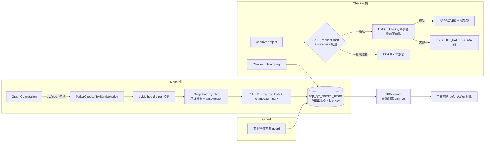
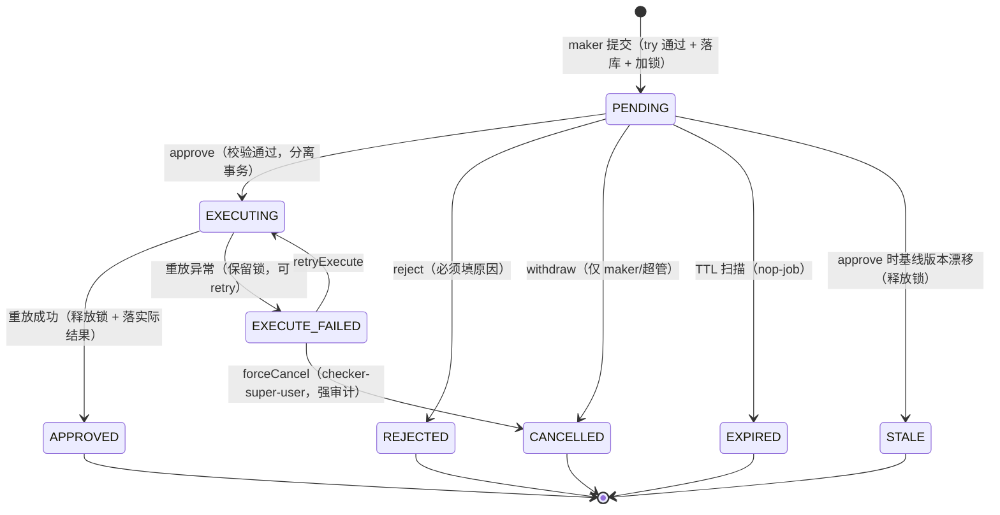

# Maker-Checker 架构基线

**日期**：2026-09-22
**范围**：nop-biz / nop-graphql / nop-sys / nop-sys-web；桥接 nop-wf
**状态**：active
**源码锚点（现状骨架）**：`nop-service-framework/nop-biz/src/main/java/io/nop/biz/makerchecker/`、`nop-service-framework/nop-graphql/nop-graphql-core/src/main/java/io/nop/graphql/core/engine/GraphQLExecutor.java`、`nop-kernel/nop-xdefs/src/main/resources/_vfs/nop/schema/biz/xbiz.xdef`、`nop-sys/model/nop-sys.orm.xml`

---

## 一、设计结论

1. **审批对象 = 变更意图快照**：待审记录封存"归一化输入（requestData）+ 提交时数据基线投影（beforeData）+ 基线版本（baseVersion）+ 快照哈希（requestHash）"；批准后由平台**重放同一份输入**，不重新解析新请求。复杂嵌套数据因 GraphQL 输入本就是树而天然覆盖，diff 由 objMeta 驱动的递归比较器在查询时计算（§专题 02）。
2. **待审互斥 = lockKey 唯一索引**：`nop_sys_checker_record.lockKey`（`{tenantId}:{bizObjName}:{bizObjId}`，终态置空）唯一索引实现"一对象至多一条待审"；biz 变更管道统一前置 guard 拒绝对被锁对象的修改/删除（§专题 03）。
3. **checker 侧零新语义**：approve/retry 复用原 biz 动作重放；审批记录自身提供一组标准动作（approve/reject/withdraw/retryExecute/forceCancel），SoD、staleness、幂等在记录动作内集中校验。
4. **配置三级**：全局开关（已有）→ xbiz `<maker-checker enabled>` 声明（Delta 可按部署覆盖）→ `IMakerCheckerProvider` SPI（动态规则，如金额阈值）。
5. **数据模型扩展 `nop_sys_checker_record`**（列变更清单见 §6；ORM 修改走 plan-first）。

## 二、总体结构

- **Maker 侧**（已具备大半）：GraphQL 引擎层 tryAction 替换拦截是唯一拦截点；`MakerCheckerTryServiceAction` 串起 try 校验 → 快照 → 落库 → 返回审批编号。
- **Guard**：所有会改数据的 biz 变更动作在执行前查待审锁；这是"待审对象不可修改"的强制点。
- **Checker 侧**（本设计新增）：`NopSysCheckerRecord` BizModel 扩展标准审批动作；重放走原动作管道。

## 三、核心对象契约

| 契约 | 职责 | 归属模块 |
|------|------|---------|
| `IMakerCheckerProvider`（已有 SPI） | `isMakerCheckerEnabled(bizObjName, action)`：DSL 声明 + 动态规则合成；新增缺省实现按 §5 配置模型判定 | nop-biz |
| `IMakerCheckerPendingGuard`（新增） | 变更动作执行前按目标 id 集合查待审锁，命中即抛 `nop.err.sys.makerchecker.pending-lock` | nop-sys（实现）/ nop-biz（调用点） |
| `IEntitySnapshotProjector`（新增） | 按输入形状递归投影当前实体状态为 beforeData；输出 baseVersion | nop-sys |
| `IInputCanonicalizer`（新增） | 输入归一化：字段序、absent/null 区分、标量标准化、剔除客户端控制字段 | nop-sys |
| `IEntityTreeDiffCalculator`（新增） | beforeData + requestData → DiffTree（掩码在此层施加，服务端唯一出口） | nop-sys |
| `MakerCheckerTryServiceAction`（已有，扩展） | 编排：guard → try → 投影 → 归一化 → 落库 | nop-biz |

职责边界约束：

- 快照/diff/掩码逻辑只存在于 nop-sys 的上述三个契约实现中，业务模块零依赖。
- nop-wf 不感知 nop-sys 记录结构；桥接经 SPI + businessKey 约定（§7）。
- 审核前端不自行比较数据：表单复用模式（缺省）消费 beforeData/expectedAfter + changedPaths 高亮；diff 表格模式消费 diffTree；两者均由服务端计算（渲染模式见 04 文档）。

## 四、状态机（记录生命周期）

终态 = `APPROVED / REJECTED / CANCELLED / EXPIRED / STALE`（均释放锁）；`EXECUTE_FAILED` 非终态（锁保留，等待 retry 或人工 force-cancel）——保证"批准过的变更要么生效、要么对象保持冻结"，不允许静默丢失。

**生命周期与记录保留（常见疑问澄清）**：

- 锁约束的是"同一对象**同一时刻**至多一条 PENDING"，不是次数限制。记录到达终态后 lockKey 置空即解锁，同对象可立即发起新一轮送审——每轮送审创建一条**新记录**（新 recordId、新基线快照、新锁），轮与轮互不干扰；下一轮 beforeData 取上一轮生效后的状态，diff 始终表达"本轮改了什么"。
- 待审期间发现提交有误：maker 本人 withdraw（→ CANCELLED + 解锁）或 checker reject（→ REJECTED + 解锁）后修改重报，无需等审批结束。
- **记录不删除**："终态置空"只置 lockKey 列（锁标志），行本身保留为审计第一载体（maker/checker/时间/双快照/结果全在行上，待办队列与审计历史同表靠 status 区分）。仅 APPROVED 记录可按部署 TTL 归档（缺省不删），其余终态永不自动清理（见 02 §六）。
- 单待审限制的理由是重放确定性：两条待审快照共享同一数据基线，先后重放会使第二条的批准意图失真；串行审批（批准生效后再基于新状态制单）是重要数据的正确语义。

## 五、配置模型（三级开关）

1. **全局**：`nop.graphql.maker-checker.enabled`（已有，缺省 false）。
2. **声明级**：xbiz `<maker-checker tryMethod="..." cancelMethod="..." enabled="true|false"/>`（xbiz.xdef 扩展可选 `enabled` 属性，缺省 true）；`@BizMakerChecker` 注解同步增加 `enabled()`。Delta 定制可按部署翻转单个动作，无需改代码。
3. **运行时规则**：`IMakerCheckerProvider` 缺省实现 = `全局 && 声明 enabled && 动态规则不否决`；动态规则（如"金额 > 阈值才需复核"）由部署方提供 provider 实现，平台不内置规则表。

try/cancel 方法契约：

- `tryMethod(record)`：dry-run 校验，**不得**产生业务表变更；允许预留资源（如占号），预留的释放统一走 `cancelMethod`。
- `cancelMethod(record)`：在 REJECTED / CANCELLED / EXPIRED / STALE 终态时调用一次，释放 try 阶段预留；调用失败仅告警不阻断终态落库。

## 六、数据模型变更（`nop_sys_checker_record`）

| 列 | 类型 | 说明 |
|----|------|------|
| `beforeData` | LONGTEXT | 提交时目标对象基线投影快照（create 型为 NULL） |
| `baseVersion` | BIGINT | 基线实体 version（乐观锁基线，staleness 校验用） |
| `requestHash` | CHAR(64) | 归一化 requestData 的 SHA-256，重放前完整性校验 |
| `lockKey` | VARCHAR(200) | PENDING 期间 = `{tenantId}:{bizObjName}:{bizObjId}`，终态置 NULL；**唯一索引（tenantId, lockKey）** |
| `idempotencyKey` | VARCHAR(64) | create 型防重复提交，客户端生成；唯一索引（bizObjName, action, idempotencyKey） |
| `expireTime` | DATETIME | 待审过期时刻（TTL 扫描用） |
| `checkComment` | VARCHAR(1000) | checker 意见 / 驳回原因（reject 必填） |
| `changeSummary` | VARCHAR(2000) | 变更摘要（顶层变更字段名 + 计数），列表页免算 diff |
| `emergency` | BOOLEAN | bypass 提交标记（配合强审计） |

状态列取值扩展为 §4 状态机全集。索引新增：`(tenantId, lockKey)` 唯一、`(bizObjName, action, idempotencyKey)` 唯一、`(status, expireTime)`。

无主键变更；兼容现状列（`requestData/cbErrCode/cbErrMsg` 等语义不变，`cbErrCode/cbErrMsg` 专用于 EXECUTE_FAILED 的重放错误）。

## 七、审批 API 面（NopSysCheckerRecord BizModel 扩展）

| 动作 | 类型 | 权限（action-auth） | 说明 |
|------|------|--------------------|------|
| `findPendingItems` | query | `:find`（复核角色） | Checker Inbox：按 status=PENDING 过滤 + 数据权限圈定可见范围 |
| `getReviewDetail` | query | `:find` | 返回记录 + beforeData/expectedAfter/changedPaths（表单复用模式数据源）+ 按需 diffTree（含掩码）；displayName 按请求 locale 从目标对象 xmeta 解析 |
| `approve` | mutation | `:approve` | SoD → hash → staleness → EXECUTING → 重放 |
| `reject` | mutation | `:approve` | 必填 checkComment |
| `withdraw` | mutation | `:withdraw` | 仅 maker 本人或 checker-super-user |
| `retryExecute` | mutation | `:approve`（super-user） | EXECUTE_FAILED → EXECUTING |
| `forceCancel` | mutation | `:approve`（super-user） | EXECUTE_FAILED → CANCELLED，强审计 |

checker 可见范围圈定：缺省 = 拥有 `:approve` 权限即可见全部待审（按租户隔离）；部署方可用 provider SPI 收窄为"按业务对象角色圈定"（对应 Fineract 式 join 过滤），平台不做内置配置表。

## 八、L1 ↔ L2（nop-wf）桥接契约

- 桥接点：provider SPI 声明某动作的复核模式为 `workflow`（而非缺省 `local`）。此时 PENDING 记录落库后由平台调 `WorkflowService.startWorkflow`，businessKey 固定为 `mkchecker:{recordId}`；记录锁保留至流程终态，流程审批回调驱动记录状态机（approve/reject 事件映射）。
- nop-wf 侧不新增记录结构；会签/或签/串签/投票全部复用既有 execGroup 语义。
- 本桥接为二期范围；一期 L1 的 approve 是内置单级审批。

## 九、审计事件（七类，经 IAuditService 上报）

`SUBMIT / APPROVE / REJECT / WITHDRAW / EXPIRE / EXECUTE_FAIL / BYPASS`。事件载荷含 recordId、bizObjName/action、maker/checker、requestHash；BYPASS 事件附 emergency 角色并触发告警。审批记录行本身仍是第一审计载体（maker/checker 双方字段齐全），事件流用于外发订阅与告警。

## 十、拒绝了什么

| 替代方案 | 拒绝理由 |
|----------|---------|
| 业务表加 status 标志位实现待审 | 侵入业务表；"变更内容"与"审批状态"耦合；每个业务重复实现 |
| 每业务表配影子表（_pending 副本） | 表数量翻倍；与平台元数据驱动 + Delta 思路冲突 |
| 仅 baseVersion 乐观校验、不加待审锁 | 用户填完表单提交才被告知"对象在审批中"，体验差且并发窗口内反复作废；锁把不确定性提前到提交一刻 |
| EXECUTE_FAILED 同时释放锁 | 批准过的变更静默未生效且对象可被继续修改，违反硬约束 4 |
| 前端 diff 计算 | 掩码必须服务端施加；多处前端实现易漂移 |
| 快照只存 diff 不存原始输入 | diff 不可逆，审计需原始意图；重放需完整输入；存储冗余可接受 |
| 脱敏后载荷进入审批 | 掩码值会随重放写回业务库（Fineract 同款教训）；含掩码字段的提交必须显式拒绝或走字段级加密扩展 |
