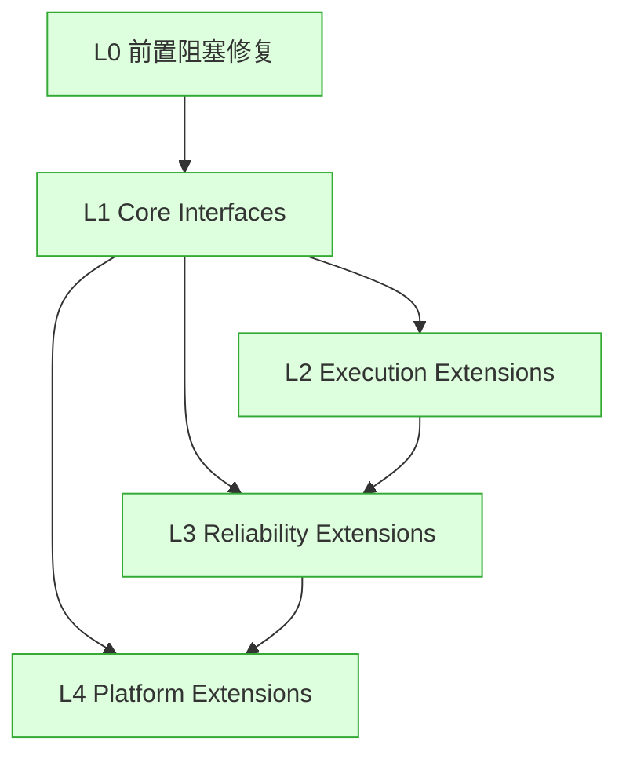

# nop-ai-agent Implementation Roadmap

> Last Updated: 2026-06-20 (plan 277: ReAct loop message contract & lifecycle semantics — AR-03/06/07/11/12/13/14 all fixed)
> Source: 设计体系 `ai-dev/design/nop-ai-agent/00-vision.md` 等；完整逐项历史（含 plan 级实现描述）见 `ai-dev/archive/design/nop-ai-agent/nop-ai-agent-roadmap-2026-06-20.md`

## Purpose

本文是 nop-ai-agent 从设计到实现的全局状态索引。AI 或维护者读完本文即知各层工作项是否完成，无需重走全部设计文档与代码。

**本文是编排层，不是 execution plan。** 工作项的逐项实现细节（plan 级描述、代码改动）见各 plan 文件与归档原文 §4，不在本 roadmap 重复。审计发现、设计决策、技术债也各有归属（见 Pointers），不在此维护。

## Phase Status

> **全文件唯一的动态状态区。更新状态只改这里。**
> 状态流转：draft review 通过 → `todo` 改 `planned`；closure audit 通过 → `planned` 改 `done`（不得提前）。

- L0. 前置阻塞项修复: `done`
- L1. Core Interfaces（系统运行的最低要求）: `done`
- L2. Execution Extensions（扩展接口 + pass-through 默认）: `done`
- L3. Reliability Extensions（生产环境加固）: `done`
- L4. Platform Extensions（多 Agent / 多租户 / 分布式）: `done`

## Status Values

| Status | 含义 |
|--------|------|
| `done` | 该层全部工作项已实现，且对应 plan 通过 closure audit |
| `planned` | 已有 execution plan，等待实现 |
| `todo` | 尚未开始，无对应 plan |

本项目 L0–L4 当前全部 `done`。新工作项（后续 successor 或可选项）出现时，在 Phase Status 追加新行。

## Platform Reuse

以下能力由 Nop 平台已有模块提供，实现 agent 层时不重建：

| 能力 | 提供方 | 说明 |
|------|--------|------|
| LLM 调用 + 多 Provider | `nop-ai-core` | `ChatServiceImpl` / `DefaultAiChatService`；`llm.xdef` + `{provider}.llm.xml`（ollama/deepseek/claude/gemini/azure/volcengine/bailian/lm-studio 等） |
| 工具 DSL | `nop-ai-toolkit` | `tool.xdef`；只依赖 `nop-ai-api`，与 `nop-ai-core` 独立发展 |
| 可逆计算 / codegen | Nop XLang | `agent.xdef` / `agent-plan.xdef` 经 xdsl-loader 加载；Delta 定制 |

## Current Baseline

**已实现：** L0–L4 全部工作项（80+ 项），覆盖——ReAct 执行引擎、Actor 消息入口、会话管理与存储（内存/文件/DB）、上下文治理（5 层压缩管道）、安全权限（三源合并/路径/sandbox）、可靠性（熔断/重试/目标跟踪/checkpoint/durable restore/auto-recovery）、用量计费与预算、多 Agent 团队编排（DAG 调度/auto-spawn/异步跨进程/daemon 协调/配额/fencing token）。205+ test files / 2756+ tests。

**逐项清单（ID + 描述 + plan 编号映射）** 见归档原文 §4。

---

## Work Items

> 此处仅按层摘要。**逐项清单**（L0-1 … L4-*，含每个工作项的描述与落地 plan）见 `ai-dev/archive/design/nop-ai-agent/nop-ai-agent-roadmap-2026-06-20.md` §4。

| Layer | 工作项范围 | 关键交付 | plan 范围 | 状态 |
|-------|-----------|---------|-----------|------|
| L0 | L0-1 ~ L0-3 | DSL 注册加载、枚举统一、LLM 调用路径确认 | — | done |
| L1 | L1-1 ~ L1-20, A1 ~ A6 | 引擎入口、ReAct 循环、会话、权限派生、事件流、Budgeted Memory、Completion Gate、Checkpoint Journal、Session Fork、Actor Cancel | plans 146–192 | done |
| L2 | L2-1 ~ L2-23 | 工具修复、上下文压缩、内容护栏、模型路由（PassThrough/Smart）、用量计费、per-model 聚合、预算控制 | plans 201–209 | done |
| L3 | L3-1 ~ L3-9（含 L3-1b, L3-4b/c/d） | 熔断 + circuit-aware routing、重试策略、目标跟踪、检查点、durable session restore、auto restore-on-startup、DB-backed store、审批门、拒绝账本 | plans 207, 210–214 | done |
| L4 | L4-1 ~ L4-8 + L4-* 扩展（team/scheduler/spawn/async/cross-process/quota/fencing/reclaim/timeout） | 消息服务（内存/DB）、多 Agent 团队、nop-task DAG 集成、blockedBy 守护、auto-spawn、异步并行编排、跨进程 daemon 协调、资源配额、fencing token、任务 reclaim/超时 | plans 221–245 | done |

---

## Dependency Graph

## Pointers

非 roadmap 内容已拆分到各自归属，本文件不重复维护：

- **审计发现追踪**（各轮 deep audit 的发现 ID → 修复 plan 映射）→ `ai-dev/audits/nop-ai-agent-audit-tracker.md`。原始审计证据在各 `ai-dev/audits/<date>-deep-audit-nop-ai-agent/` 目录。
- **设计决策**（D1 Agent 配置化 / D2 Actor 模型 / D3 pass-through 默认 / D4 不做 MCP / D5 LLM 路径）→ `ai-dev/design/nop-ai-agent/00-vision.md`（设计原则）；原始 ADR 文字见归档原文 §6。
- **技术债** → 归档原文 §5（已全部解决或纳入后续 successor）。
- **逐项工作项 + 实现描述** → 归档原文 §4。
- **审计检查清单** → 归档原文 §7（注意：其中未勾选的构建/测试验证项以 live `./mvnw test -pl nop-ai-agent` 实际结果为准）。

## Rule

- 本文档是状态索引和粗粒度分层划分，不是 execution plan。实现细节在 plan 文件，不在本 roadmap。
- **可标记单位是 Layer**（L0–L4），当前全部 `done`。新工作项出现时在 Phase Status 追加（如 `L5. <后续方向>: todo`）。
- **唯一动态块是 Phase Status**（顶部）。状态不散落到 Work Items 表、Pointers 或别处。
- 审计发现不在此追踪（在 `audits/nop-ai-agent-audit-tracker.md`）；设计决策不在此重述（在 `00-vision.md`）；逐项实现描述不在此复制（在归档原文/plan）。
- 不得在 closure audit 通过前把 Layer 标为 `done`。
