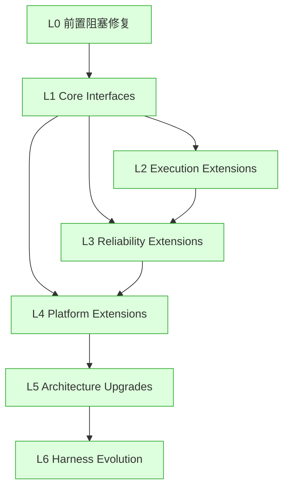

# nop-ai-agent Implementation Roadmap

> Last Updated: 2026-08-02 (plan `2026-08-02-0650-1`: Harness Evolution L6 收口 — 17 份 W1–W6 落地计划均通过独立 closure audit，roadmap 完成定义第四项满足；同时回填 pre-existing L5 缺口到 Work Items 表 + Dependency Graph，使 Phase Status / 表 / 图 / header 彼此一致)
> Source: 设计体系 `ai-dev/design/nop-ai-agent/00-vision.md` 等；完整逐项历史（含 plan 级实现描述）见 `ai-dev/archive/design/nop-ai-agent/nop-ai-agent-roadmap-2026-06-20.md`；harness evolution (L6) 见 `ai-dev/backlog/nop-ai-agent-harness-evolution-roadmap.md` 及其 17 份落地计划（2026-08-01-1437-* / -1440-* / -1505-* / -1905-* / 2026-08-02-0421-* / -0656-* / -0900-*）

## Purpose

本文是 nop-ai-agent 从设计到实现的全局状态索引。AI 或维护者读完本文即知各层工作项是否完成，无需重走全部设计文档与代码。

**本文是编排层，不是 execution plan。** 工作项的逐项实现细节（plan 级描述、代码改动）见各 plan 文件与归档原文 §4，不在本 roadmap 重复。审计发现、设计决策、技术债也各有归属（见 Pointers），不在此维护。

## Phase Status

> **全文件唯一的动态状态区。更新状态只改这里。**
> 状态流转：draft review 通过 → `todo` 改 `planned`；closure audit 通过 → `planned` 改 `done`（不得提前）。

- L0. 前置阻塞项修复: `done`
- L1. Core Interfaces（系统运行的最低要求）: `done`
- L2. Execution Extensions（扩展接口 + pass-through 默认）: `done`
- L3. Reliability Extensions（生产环境加固）: `done`
- L4. Platform Extensions（多 Agent / 多租户 / 分布式）: `done`
- L5. Architecture Upgrades（AgentScope 审计驱动）: `done` — Middleware 洋葱链 + Tag-based Tool Visibility（plan 296）
- L6. Harness Evolution（10 类增量共识收敛，W1–W6）: `done` — 17 份落地计划（W1 plan 运行时门控 / W2e LLM 错误规范化 / W2 Reliability / W3 Middleware / W4 上下文工程 / W5 Guardrail / W6 Recipe）均通过独立 closure audit

## Status Values

| Status | 含义 |
|--------|------|
| `done` | 该层全部工作项已实现，且对应 plan 通过 closure audit |
| `planned` | 已有 execution plan，等待实现 |
| `todo` | 尚未开始，无对应 plan |

本项目 L0–L6 当前全部 `done`。新工作项（后续 successor 或可选项）出现时，在 Phase Status 追加新行。

## Platform Reuse

以下能力由 Nop 平台已有模块提供，实现 agent 层时不重建：

| 能力 | 提供方 | 说明 |
|------|--------|------|
| LLM 调用 + 多 Provider | `nop-ai-core` | `ChatServiceImpl` / `DefaultAiChatService`；`llm.xdef` + `{provider}.llm.xml`（ollama/deepseek/claude/gemini/azure/volcengine/bailian/lm-studio 等）。错误规范化配置（`<errorMappings>`）已加入 llm.xdef，运行时消费属 backlog `nop-ai-agent-harness-evolution-roadmap.md` W2e |
| 工具 DSL | `nop-ai-toolkit` | `tool.xdef`；只依赖 `nop-ai-api`，与 `nop-ai-core` 独立发展 |
| 可逆计算 / codegen | Nop XLang | `agent.xdef` / `agent-plan.xdef` 经 xdsl-loader 加载；Delta 定制。L6 harness evolution 新增声明式 schema（`recipe.xdef`、`llm-failover.xdef`、`agent.xdef` 的 `<filter-chain>`、guardrail rule/test 包）均经此机制加载 |

> **Platform Reuse vs Current Baseline 边界（plan `2026-08-02-0650-1` Decision）**：本表只列"由 Nop 平台**已有**模块提供、被 agent 层复用"的能力（LLM 调用 / 工具 DSL / codegen 机制）。L6 harness evolution 新增的 schema 是 **agent 层自身的产物**（声明在 `nop-ai-agent` / `nop-ai-core` 模块内），属 Current Baseline 已实现范围，不在此表重复列出。

## Current Baseline

**已实现：** L0–L6 全部工作项（80+ 项 + L6 harness evolution 10 类增量 W1–W6），覆盖——ReAct 执行引擎、Actor 消息入口、会话管理与存储（内存/文件/DB）、上下文治理（5 层压缩管道 + L6 引用式压缩双轨 + 压缩快照归档/压缩比度量）、安全权限（三源合并/路径/sandbox）、可靠性（熔断/重试/目标跟踪/checkpoint/durable restore/auto-recovery + L6 wait_for/idempotency_key/三级失败升级/ProviderFailoverQueue/LLM 错误规范化与配额感知账号链恢复）、用量计费与预算、多 Agent 团队编排（DAG 调度/auto-spawn/异步跨进程/daemon 协调/配额/fencing token）、声明式 filter chain、BAIL 中断语义、Recipe 组合层、Plan 运行时门控（Gate/Trigger Rule/dependsOn/Replanner）。L6 新增声明式 schema：`recipe.xdef`、`llm-failover.xdef`、`agent.xdef` 的 `<filter-chain>`、guardrail rule/test 包（`io.nop.ai.agent.guardrail.rule` / `.test`）。3379+ test files。

**逐项清单（ID + 描述 + plan 编号映射）** 见归档原文 §4。

---

## Work Items

> 此处仅按层摘要。**逐项清单**（L0-1 … L4-*，含每个工作项的描述与落地 plan）见 `ai-dev/archive/design/nop-ai-agent/nop-ai-agent-roadmap-2026-06-20.md` §4。

| Layer | 工作项范围 | 关键交付 | plan 范围 | 状态 |
|-------|-----------|---------|-----------|------|
| L0 | L0-1 ~ L0-3 | DSL 注册加载、枚举统一、LLM 调用路径确认 | — | done |
| L1 | L1-1 ~ L1-20, A1 ~ A6 | 引擎入口、ReAct 循环、会话、权限派生、事件流、Budgeted Memory、Completion Gate、Checkpoint Journal、Session Fork、Actor Cancel | plans 146–192 | done |
| L2 | L2-1 ~ L2-23 | 工具修复、上下文压缩、内容护栏、模型路由（PassThrough/Smart）、用量计费、per-model 聚合、预算控制 | plans 201–209 | done |
| L3 | L3-1 ~ L3-9（含 L3-1b, L3-4b/c/d） | 熔断 + circuit-aware routing、重试策略、目标跟踪、检查点、durable session restore、auto restore-on-startup、DB-backed store、审批门、拒绝账本 | plans 207, 210–214 | done |
| L4 | L4-1 ~ L4-8 + L4-* 扩展（team/scheduler/spawn/async/cross-process/quota/fencing/reclaim/timeout） | 消息服务（内存/DB）、多 Agent 团队、nop-task DAG 集成、blockedBy 守护、auto-spawn、异步并行编排、跨进程 daemon 协调、资源配额、fencing token、任务 reclaim/超时 | plans 221–245 | done |
| L5 | Architecture Upgrades（AgentScope 审计驱动） | Middleware 洋葱链（IAgentMiddleware + MiddlewareChain 9 点链式拦截）+ Tag-based Tool Visibility（IToolDefinition tags/activeTags/denyTags/denyTools + set-active-tags 元工具） | plan 296 | done |
| L6 | Harness Evolution（10 类增量共识收敛） | W1 Plan 运行时门控（Gate/Trigger Rule/dependsOn/Replanner）/ W2e LLM 错误规范化与配额感知恢复 / W2 Reliability（wait_for/idempotency_key/三级失败升级/ProviderFailoverQueue）/ W3 Middleware（双层中间件 + 声明式 filter chain）/ W4 上下文工程（引用式压缩双轨 + 压缩快照归档/压缩比）/ W5 Guardrail（AttackPlugin+Grader/规则关系图/BAIL 中断）/ W6 Recipe 组合层 | `2026-08-01-1437-*` / `2026-08-01-1440-*` / `2026-08-01-1505-*` / `2026-08-01-1905-*` / `2026-08-02-0421-*` / `2026-08-02-0656-*` / `2026-08-02-0900-*` | done |

---

## Dependency Graph

```mermaid
graph TD
    L0["L0 前置阻塞修复"]
    L1["L1 Core Interfaces"]
    L2["L2 Execution Extensions"]
    L3["L3 Reliability Extensions"]
    L4["L4 Platform Extensions"]
    L5["L5 Architecture Upgrades"]
    L6["L6 Harness Evolution"]

    L0 --> L1
    L1 --> L2
    L1 --> L3
    L2 --> L3
    L1 --> L4
    L3 --> L4
    L4 --> L5
    L5 --> L6

    style L0 fill:#dfd,stroke:#3a3
    style L1 fill:#dfd,stroke:#3a3
    style L2 fill:#dfd,stroke:#3a3
    style L3 fill:#dfd,stroke:#3a3
    style L4 fill:#dfd,stroke:#3a3
    style L5 fill:#dfd,stroke:#3a3
    style L6 fill:#dfd,stroke:#3a3
```

## Pointers

非 roadmap 内容已拆分到各自归属，本文件不重复维护：

- **审计发现追踪**（各轮 deep audit 的发现 ID → 修复 plan 映射）→ `ai-dev/audits/nop-ai-agent-audit-tracker.md`。原始审计证据在各 `ai-dev/audits/<date>-deep-audit-nop-ai-agent/` 目录。
- **设计决策**（D1 Agent 配置化 / D2 Actor 模型 / D3 pass-through 默认 / D4 不做 MCP / D5 LLM 路径）→ `ai-dev/design/nop-ai-agent/00-vision.md`（设计原则）；原始 ADR 文字见归档原文 §6。
- **技术债** → 归档原文 §5（已全部解决或纳入后续 successor）。
- **逐项工作项 + 实现描述** → 归档原文 §4。
- **审计检查清单** → 归档原文 §7（注意：其中未勾选的构建/测试验证项以 live `./mvnw test -pl nop-ai-agent` 实际结果为准）。

## Rule

- 本文档是状态索引和粗粒度分层划分，不是 execution plan。实现细节在 plan 文件，不在本 roadmap。
- **可标记单位是 Layer**（L0–L6），当前全部 `done`。新工作项出现时在 Phase Status 追加（如 `L7. <后续方向>: todo`）。
- **唯一动态块是 Phase Status**（顶部）。状态不散落到 Work Items 表、Pointers 或别处。
- 审计发现不在此追踪（在 `../../audits/nop-ai-agent-audit-tracker.md`）；设计决策不在此重述（在 `00-vision.md`）；逐项实现描述不在此复制（在归档原文/plan）。
- 不得在 closure audit 通过前把 Layer 标为 `done`。
